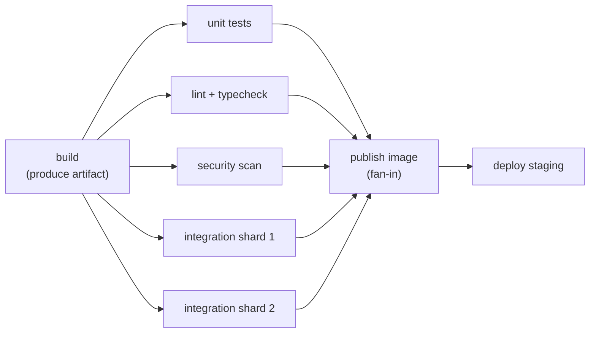
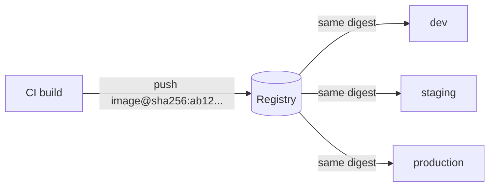

[CI/CD](./) ›

# Platforms & Pipeline Design

This page compares the major CI/CD platforms, describes the common pipeline topologies (linear, DAG, matrix, fan-out/fan-in), covers the techniques that keep pipelines fast, and sets out a testing strategy that fits inside them. Rollout mechanics are on [Deployment Strategies](deployment.html); credentials, supply-chain hardening, and GitOps are on [Security, GitOps & Operations](security-and-operations.html).

## Core Concepts

Every CI/CD system uses much the same model, though the vocabulary differs:

| Concept | Meaning | GitHub Actions | GitLab CI/CD | Jenkins |
|---------|---------|----------------|--------------|---------|
| Definition file | Pipeline as code, versioned with the repo | `.github/workflows/*.yml` | `.gitlab-ci.yml` | `Jenkinsfile` (Groovy) |
| Run | One execution triggered by an event | workflow run | pipeline | build |
| Unit of scheduling | Runs on one machine or container | job | job | stage / `node` block |
| Step | One command or reusable action | step (`run` / `uses`) | `script` line | step |
| Executor | Machine that runs jobs | runner (hosted or self-hosted) | runner | agent |
| Reuse | Share logic across repos | reusable workflows, actions | CI/CD components, `include` | shared libraries |
| Deployment target | Named environment with protection rules | environment | environment | (plugins) |

Two properties matter more than any feature list: **where jobs run** (vendor-hosted vs your own runners, which determines cost, network access, and blast radius) and **how pipelines are composed** (reusable units that let a platform team maintain one hardened template instead of hundreds of copies).

## Platforms

### GitHub Actions

Event-driven workflows tightly integrated with GitHub repositories, pull requests, and packages. The Marketplace of third-party actions is its biggest strength and, as the 2025 `tj-actions/changed-files` compromise showed, its biggest supply-chain risk (see [Hardening GitHub Actions](security-and-operations.html#hardening-github-actions)).


```yaml
# .github/workflows/python.yml
name: Python CI
on: [push, pull_request]
permissions:
  contents: read
jobs:
  test:
    runs-on: ubuntu-latest
    strategy:
      matrix:
        python-version: ["3.12", "3.13", "3.14"]
    steps:
      - uses: actions/checkout@v6
      - uses: actions/setup-python@v6
        with:
          python-version: ${{ matrix.python-version }}
          cache: pip
      - run: pip install -r requirements.txt
      - run: pytest -q
```


Notable capabilities:

- **Hosted runners** for Linux, Windows, and macOS, including native **arm64** Linux runners. **Larger runners** go up to 96 vCPU / 384 GB RAM on x64 and 64 vCPU on arm64, and there is a GPU runner (NVIDIA T4) for ML workloads.
- **Environments** with required reviewers, wait timers, and branch restrictions. These are the manual gate in continuous delivery.
- **Reusable workflows** (`workflow_call`) and composite actions for sharing pipelines across repositories.
- **OIDC federation** to AWS, Azure, GCP, and Vault, so no long-lived cloud keys are stored (see [OIDC federation](security-and-operations.html#oidc-federation-no-stored-cloud-keys)).
- **Merge queue**, which tests each PR against the latest `main` plus everything queued ahead of it before merging.
- **Artifact attestations** (`actions/attest`) for signed SLSA build provenance.

**Pricing (2026):** usage in public repositories is free. GitHub cut hosted-runner prices by up to 39% from 1 January 2026. A planned per-minute platform charge for *self-hosted* runners was announced for March 2026 and then postponed after community feedback, so check current billing documentation before planning around it.

### GitLab CI/CD

Part of GitLab's single-application DevSecOps platform, which includes the source host, registry, security scanners, and environments in one product. Pipelines are defined in `.gitlab-ci.yml`. Use `rules:` for conditions; the older `only:`/`except:` keywords are deprecated in its favor.

```yaml
# .gitlab-ci.yml
stages: [test, build, deploy]

default:
  image: node:24

test:
  stage: test
  script:
    - npm ci
    - npm test

build:
  stage: build
  script:
    - npm ci
    - npm run build
  artifacts:
    paths: [dist/]

deploy:
  stage: deploy
  needs: [build]               # DAG edge: start as soon as build finishes
  environment: production
  script:
    - ./scripts/deploy.sh dist/
  rules:
    - if: $CI_COMMIT_BRANCH == $CI_DEFAULT_BRANCH
      when: manual             # continuous delivery: a human clicks deploy
```

Notable capabilities: `needs:` for DAG pipelines that ignore stage boundaries, `parallel: matrix:` for matrix jobs, parent/child and multi-project pipelines, **CI/CD components** published to a CI/CD Catalog for versioned reuse, **merge trains** (GitLab's merge queue), and `id_tokens:` for OIDC authentication to clouds and Vault.

### Jenkins

The long-standing self-hosted automation server. Its plugin ecosystem can integrate with almost anything, and it is still common in enterprises with on-premises requirements. The cost is operational: the controller, plugins, and agents need patching, and plugin compatibility is a recurring source of breakage. Prefer **declarative** pipelines over scripted ones, and run builds in ephemeral container agents rather than on the controller.

```groovy
// Jenkinsfile (declarative)
pipeline {
    agent { docker { image 'maven:3-eclipse-temurin-21' } }
    options { timeout(time: 30, unit: 'MINUTES') }
    stages {
        stage('Build') { steps { sh 'mvn -B -DskipTests package' } }
        stage('Test') {
            steps { sh 'mvn -B test' }
            post { always { junit 'target/surefire-reports/*.xml' } }
        }
        stage('Deploy') {
            when { branch 'main' }
            steps { sh './deploy.sh' }
        }
    }
}
```

### CircleCI

A hosted CI service known for fast Docker-based executors, strong caching, and **orbs** (versioned, reusable config packages). It also offers macOS, arm, and GPU resource classes and self-hosted runners.


```yaml
# .circleci/config.yml
version: 2.1
jobs:
  build-and-test:
    docker:
      - image: cimg/node:24.11
    steps:
      - checkout
      - restore_cache:
          keys: [npm-{{ checksum "package-lock.json" }}]
      - run: npm ci
      - save_cache:
          key: npm-{{ checksum "package-lock.json" }}
          paths: [~/.npm]
      - run: npm test
workflows:
  main:
    jobs: [build-and-test]
```


### Other Platforms

- **Buildkite**: a hosted control plane with agents that always run on your own infrastructure. Popular for large monorepos and security-sensitive builds because source code and secrets never leave your network.
- **Azure Pipelines**: part of Azure DevOps. Strong Windows/.NET support and multi-stage YAML pipelines.
- **Tekton**: a Kubernetes-native framework (CNCF) where tasks and pipelines are custom resources. It is usually a building block for internal platforms rather than something developers use directly. **Tekton Chains** adds signed SLSA provenance.
- **Dagger**: pipelines written as code in Go, Python, or TypeScript that run in containers, identically on a laptop and on any CI host. Useful for escaping YAML and vendor lock-in.
- **Drone / Harness CI**: Drone is container-native and now owned by Harness. **Travis CI**, once the default for open source, has largely been replaced by GitHub Actions and is mostly found in legacy projects.

### Platform Comparison

| Platform | Hosting | Config | Strengths | Trade-offs | Typical fit |
|----------|---------|--------|-----------|------------|-------------|
| GitHub Actions | SaaS, self-hosted runners | YAML | Deep GitHub integration, Marketplace, OIDC, attestations | Third-party action supply-chain risk; YAML logic gets unwieldy | Projects hosted on GitHub |
| GitLab CI/CD | SaaS or self-managed | YAML | One platform for SCM, CI, registry, and security; DAGs; components | Heavier to self-manage; best features in paid tiers | Teams wanting an all-in-one DevSecOps suite |
| Jenkins | Self-hosted | Groovy | Unlimited flexibility, huge plugin catalog | Operational burden, plugin drift, security patching | Legacy or on-prem enterprise estates |
| CircleCI | SaaS, self-hosted runners | YAML | Fast executors, caching, orbs, test splitting | Credit-based cost at scale | Speed-sensitive SaaS teams |
| Buildkite | Hybrid (your agents) | YAML | Scale, data stays in your network, dynamic pipelines | You operate the agent fleet | Large monorepos, regulated builds |
| Azure Pipelines | SaaS, self-hosted agents | YAML | Windows/.NET, Azure integration | Microsoft-centric | Azure and .NET organizations |
| Tekton | Your Kubernetes cluster | Kubernetes CRDs | Cloud-native, composable, Chains provenance | Low-level; needs a platform team | Internal developer platforms |

## Pipeline Topologies

### Linear

Stages run strictly in order: `build → test → deploy`. Easy to reason about, and adequate for small projects. The cost is that total time is the sum of every stage, even when stages do not depend on each other.

### Directed Acyclic Graph (Fan-out / Fan-in)

Jobs declare their actual dependencies (`needs:` in both GitHub Actions and GitLab), and the scheduler runs everything whose inputs are ready. Independent checks **fan out** in parallel after the build, and a single job **fans in** once they all succeed. The critical path, not the sum of all jobs, determines wall-clock time.




```yaml
# GitHub Actions: fan-out on `needs: build`, fan-in on `needs: [ ... ]`
jobs:
  build:     { runs-on: ubuntu-latest, steps: [ ... ] }
  unit:      { needs: build, runs-on: ubuntu-latest, steps: [ ... ] }
  lint:      { needs: build, runs-on: ubuntu-latest, steps: [ ... ] }
  scan:      { needs: build, runs-on: ubuntu-latest, steps: [ ... ] }
  publish:
    needs: [unit, lint, scan]
    runs-on: ubuntu-latest
    steps: [ ... ]
```


### Matrix

One job definition expanded over a cross-product of parameters, such as runtime versions × operating systems. Use `exclude`/`include` to trim combinations, and `fail-fast: false` when you want the full picture rather than the first failure.

```yaml
strategy:
  fail-fast: false
  matrix:
    node: [20, 22, 24]
    os: [ubuntu-latest, windows-latest, macos-latest]
    exclude:
      - os: windows-latest
        node: 20
```

GitLab's equivalent is `parallel: matrix:`. Matrices multiply cost quickly, so test the full matrix on `main` or nightly and a representative subset on PRs.

### Monorepo: Affected-Target Pipelines

In a monorepo, rebuilding everything on every change does not scale. Pipelines compute the set of **affected** projects from the changed paths and the dependency graph, then build and test only those. Nx, Turborepo, Bazel, Pants, and Please all do this. At minimum, path filters (`on.push.paths`, GitLab `rules: changes:`) skip unrelated workflows. See [Monorepo Architecture](../../advanced/monorepo/) and [Monorepo Tooling](../../advanced/monorepo-tooling/).

### Build Once, Promote Everywhere

Deployment stages should consume the artifact produced by the build stage, identified by an immutable **digest**, rather than rebuilding it. Promotion then means pointing the next environment at the same digest. This guarantees that what was tested is what ships, and it makes provenance and signing meaningful.



## Keeping Pipelines Fast

Pipeline duration is a developer-productivity metric. The main levers, roughly in order of payoff:

| Technique | How | Typical effect |
|-----------|-----|----------------|
| **Dependency caching** | Cache package-manager stores keyed on the lockfile hash (`setup-*` actions' `cache:` input, GitLab `cache:key:files`) | Minutes saved on install steps |
| **Container layer caching** | BuildKit cache export (`--cache-to type=registry` or `type=gha`), and ordering Dockerfile layers from least to most volatile | Image builds become incremental |
| **Parallelism and sharding** | DAG fan-out; split test suites across N jobs by timing data (GitLab `parallel: N` with `CI_NODE_INDEX`, CircleCI test splitting, Playwright/Jest `--shard`) | Near-linear speedup for large suites |
| **Test selection** | Run only tests affected by the change (dependency graph, test impact analysis); run the full suite on `main` | Large PR-time savings in big repos |
| **Remote build cache** | Share compiled outputs across machines and developers (Bazel remote cache, Nx/Turborepo remote cache, Gradle build cache) | Unchanged targets are never rebuilt |
| **Cancel superseded runs** | `concurrency: cancel-in-progress` (GitHub), `interruptible: true` (GitLab) | Frees runners during rapid pushes |
| **Right-sized runners** | Larger or arm64 runners for CPU-bound jobs; they often cost less per completed job | Shorter compile and test times |

Also consider a **merge queue** (GitHub merge queue, GitLab merge trains). It serializes merges and tests each PR combined with the ones ahead of it, which keeps `main` green without requiring every author to rebase and rerun.

## Testing Strategy

The classic **test pyramid** says to have many fast, isolated unit tests, fewer integration tests, and a small number of slow end-to-end tests. The pipeline mirrors it: the cheapest, most frequent tests run earliest.

| Layer | Scope | When it runs | Target duration | Examples |
|-------|-------|--------------|-----------------|----------|
| Static analysis | Lint, format, type-check | Every push (also pre-commit) | < 1 min | ESLint, Ruff, `tsc`, `go vet` |
| Unit | One function or class, no I/O | Every push | < 5 min | Jest, Vitest, pytest, JUnit |
| Integration / contract | Real database or queue in containers; API contracts between services | Every PR | 5–15 min | Testcontainers, Pact |
| End-to-end | Full user flows through a browser or API against a deployed environment | Pre-merge smoke subset; full suite on staging | 10–30 min | Playwright, Cypress |
| Performance | Load and latency against SLO thresholds | On `main`, nightly, or pre-release | Varies | k6, Gatling, Locust |
| Post-deploy verification | Smoke tests and canary analysis in production | Every deploy | Minutes | Synthetic checks, [canary analysis](deployment.html#canary-releases) |

Practices that keep the suite trustworthy:

- **Treat flaky tests as defects.** Detect them automatically (reruns that change outcome), **quarantine** them out of the blocking path, and track them to a fix. Common causes are real time and sleeps (mock the clock), test-order dependence, shared state, and unpinned external services.
- **Use real dependencies in containers** (Testcontainers, service containers) rather than mocks for integration tests. It catches driver, SQL-dialect, and migration bugs that mocks hide.
- **Consumer-driven contract tests** (Pact) let microservices verify API compatibility without standing up the whole system for end-to-end tests.
- **Gate on meaningful thresholds.** Examples are coverage on changed lines rather than an absolute percentage, or a p95 latency budget in k6 `thresholds`. Blanket gates tend to be gamed.

```javascript
// k6 load test: the pipeline fails if either threshold is breached
import http from 'k6/http';
export const options = {
  vus: 50,
  duration: '2m',
  thresholds: {
    http_req_duration: ['p(95)<300'],   // ms
    http_req_failed: ['rate<0.01'],
  },
};
export default function () {
  http.get(`${__ENV.BASE_URL}/api/health`);
}
```

---

<nav class="page-nav">
  <a href="./">⬅ CI/CD Hub</a>
  <a href="deployment.html">Deployment Strategies ➡</a>
</nav>

## See Also

- [Deployment Strategies](deployment.html) — rolling, blue-green, canary, and feature flags
- [Security, GitOps & Operations](security-and-operations.html) — securing pipelines, provenance, and GitOps
- [Docker](../docker/) — reproducible build environments and layer caching
- [Please Build](../please-build.html) — a monorepo build system with affected-target builds
- [Monorepo Tooling](../../advanced/monorepo-tooling/) — Bazel, Nx, Turborepo, and remote caching
