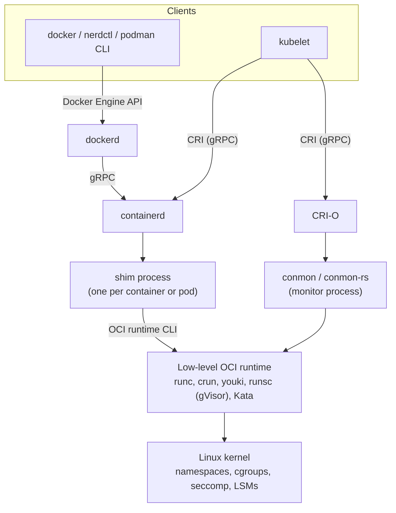
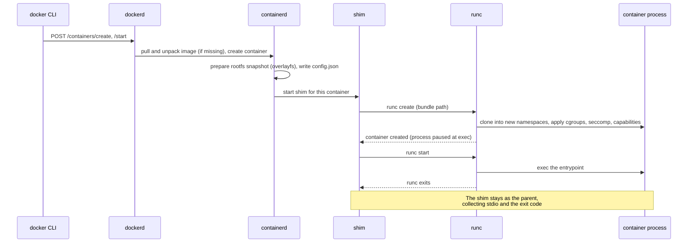
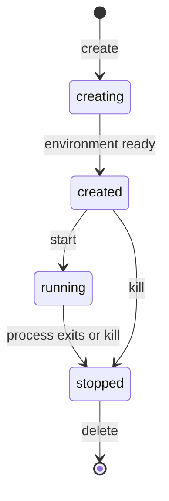
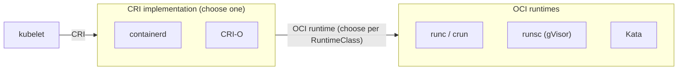
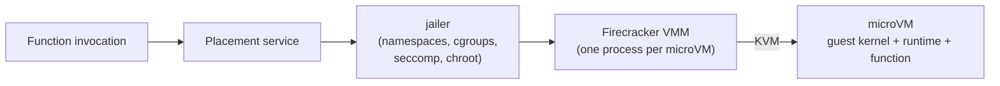
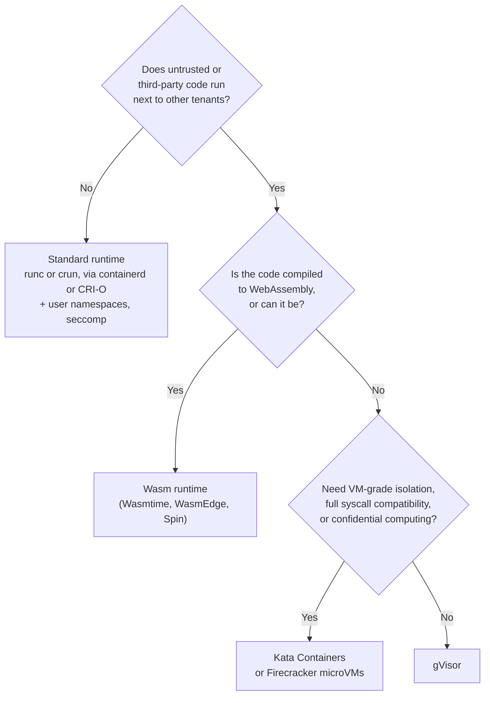

[Technology](./) &raquo; Container Runtimes &amp; Alternatives

A **container runtime** is the software that turns a container image into a running, isolated process. "Docker" is a product built from several such components, and since 2015 the industry has standardized the interfaces between them: an image format, a runtime specification, and a Kubernetes-facing API. Because of those standards, each layer can be replaced independently. This page describes the layers (OCI specifications, low-level runtimes such as runc and crun, high-level runtimes such as containerd and CRI-O), the sandboxed alternatives that add a stronger isolation boundary (gVisor, Kata Containers, Firecracker microVMs), and WebAssembly as a different kind of workload altogether. It closes with a guide to choosing an isolation boundary.

For building images and everyday use, see the [Docker section](docker/). For scheduling containers across machines, see [Kubernetes](kubernetes/), which talks to any of the runtimes below through the Container Runtime Interface.

*Versions cited are current as of September 2026.*

## The container stack

Running `docker run nginx` passes through several independent programs:



| Layer | Responsibility | Examples |
|-------|----------------|----------|
| Client | User-facing commands, image builds, Compose | `docker`, `podman`, `nerdctl`, `kubectl` (via the kubelet) |
| High-level runtime | Pull and store images, manage snapshots, networking setup, container lifecycle, API | `dockerd`, **containerd**, **CRI-O**, Podman (as a library, no daemon) |
| Shim or monitor | Parent of the container process; holds its stdio and exit status so the daemon can restart without killing containers | `containerd-shim-runc-v2`, `conmon` |
| Low-level (OCI) runtime | Create namespaces and cgroups, apply security policy, start the process | **runc**, **crun**, **youki**, **runsc**, **Kata** |

Two standard boundaries make the stack modular:

- **The OCI runtime specification** sits between the high-level and low-level runtime. Any OCI-compliant runtime can be substituted at the bottom.
- **The Kubernetes Container Runtime Interface (CRI)** sits between the kubelet and the high-level runtime. Kubernetes removed its built-in Docker integration (dockershim) in v1.24 (2022); it now talks to containerd or CRI-O directly, and images built with Docker run unchanged because they are OCI images.

Docker Engine itself delegates to containerd and runc. Since Docker Engine 29, new installations also use containerd's image store rather than Docker's older storage drivers, so Docker and containerd share one set of images.

### What happens on `docker run`



The low-level runtime does not stay running. It sets the process up, starts it and exits. The shim remains, which is why containerd or dockerd can be upgraded or restarted without stopping running containers.

## Kernel primitives

On Linux, a "container" is an ordinary process with a restricted view of the system. The runtime assembles it from kernel features:

| Primitive | What it isolates or limits |
|-----------|---------------------------|
| **Namespaces** | What the process can see: `pid` (process IDs), `net` (interfaces, routes, ports), `mnt` (mount table), `uts` (hostname), `ipc`, `user` (UID/GID mapping), `cgroup`, `time` |
| **cgroups (v2)** | How much it can use: CPU weight and quota, memory limit, I/O bandwidth, number of processes |
| **Capabilities** | Which fragments of root privilege it holds (for example `CAP_NET_BIND_SERVICE` without full root) |
| **seccomp** | Which system calls it may make; Docker's default profile blocks several dozen rarely needed, high-risk calls |
| **LSMs** (AppArmor, SELinux) | Mandatory access control on files, mounts and other resources |
| **Root filesystem** | An overlay of read-only image layers plus a writable layer, entered with `pivot_root` |

All containers on a host share one kernel. That is the source of their speed and density, and also their main security weakness: a kernel vulnerability reachable from inside a container can compromise the host. Every sandboxed runtime later on this page exists to change that.

**cgroup v1 is being retired.** Kubernetes deprecated cgroup v1 in v1.35, where the kubelet refuses to start on a cgroup v1 node unless `failCgroupV1: false` is set. Docker Engine 29 also deprecates cgroup v1. Current distributions use cgroup v2 by default.

## The Open Container Initiative (OCI)

The **Open Container Initiative**, founded in 2015 under the Linux Foundation, maintains three specifications:

| Specification | Defines | Current version |
|---------------|---------|-----------------|
| **Image** | Image layout: a manifest listing content-addressed layer tarballs and a JSON config (entrypoint, environment, architecture); multi-architecture index | 1.1 (2024) |
| **Runtime** | The filesystem bundle (a root filesystem plus `config.json`) and the lifecycle operations a runtime must implement | 1.3 |
| **Distribution** | The registry HTTP API for pushing and pulling, derived from the Docker Registry v2 protocol | 1.1 (2024) |

Version 1.1 of the image and distribution specifications standardized **artifacts** and the **referrers API**. Registries can now store arbitrary content (Helm charts, SBOMs, signatures, WebAssembly modules, ML model weights) and link it to an image, which is how tools such as Sigstore cosign and Notation attach signatures and attestations.

### The runtime bundle

A low-level runtime knows nothing about registries or layers. It receives a directory containing an extracted root filesystem and a `config.json`, and starts a process as described. You can build a bundle by hand:

```bash
mkdir -p mybundle/rootfs && cd mybundle
docker export "$(docker create alpine)" | tar -C rootfs -xf -   # flatten an image into rootfs/
runc spec                                                       # write a default config.json
sudo runc run demo                                              # create and start in one step
```

An abridged `config.json`:

```json
{
  "ociVersion": "1.2.0",
  "process": {
    "user": { "uid": 1000, "gid": 1000 },
    "args": ["/usr/bin/myapp", "--serve"],
    "env": ["PATH=/usr/local/bin:/usr/bin:/bin"],
    "cwd": "/",
    "capabilities": {
      "bounding": ["CAP_NET_BIND_SERVICE"],
      "effective": ["CAP_NET_BIND_SERVICE"],
      "permitted": ["CAP_NET_BIND_SERVICE"]
    },
    "noNewPrivileges": true
  },
  "root": { "path": "rootfs", "readonly": true },
  "linux": {
    "namespaces": [
      { "type": "pid" }, { "type": "network" }, { "type": "ipc" },
      { "type": "uts" }, { "type": "mount" }, { "type": "cgroup" }
    ],
    "resources": {
      "memory": { "limit": 536870912 },
      "cpu": { "quota": 50000, "period": 100000 },
      "pids": { "limit": 256 }
    },
    "seccomp": {
      "defaultAction": "SCMP_ACT_ERRNO",
      "architectures": ["SCMP_ARCH_X86_64"],
      "syscalls": [
        { "names": ["read", "write", "openat", "close", "..."], "action": "SCMP_ACT_ALLOW" }
      ]
    }
  }
}
```

The whole isolation policy is in this file: which namespaces to create, the cgroup limits (here 512 MiB of memory and half a CPU), the capability set, and a seccomp allowlist. The file says *what* isolation to provide, not *how*. runc implements it with kernel namespaces; gVisor and Kata read the same file and implement equivalent isolation with a user-space kernel or a virtual machine. That separation is what lets sandboxed runtimes slot in unnoticed.

The runtime specification defines a small lifecycle that every runtime implements:



## Low-level runtimes

### runc

**runc** is the reference OCI runtime, extracted from Docker in 2015 and written in Go. It is the default in Docker, containerd and most Kubernetes distributions. It is a command-line tool with no daemon: given a bundle, it creates namespaces, configures cgroups, applies capabilities, seccomp and LSM policy, pivots into the root filesystem and executes the process.

```bash
runc list                    # containers known to this runc state directory
runc exec demo sh            # run another process inside a container
runc kill demo TERM
runc delete demo
```

The current release series is 1.5 (June 2026). runc has a history of container-escape vulnerabilities in the narrow window when it prepares the container's filesystem, from CVE-2019-5736 (overwriting the host runc binary) to CVE-2024-21626 ("Leaky Vessels", a leaked file descriptor) and a group of mount-race issues disclosed in November 2025 (including CVE-2025-31133 and CVE-2025-52565). Keeping runc patched is a routine but important part of host maintenance.

### crun and youki

**crun** (Red Hat) implements the same specification in C. It starts containers faster and uses less memory than runc because it has no Go runtime to initialize, which matters at high density. It is the default in Podman on Fedora and RHEL and a drop-in replacement for runc elsewhere. crun can also run WebAssembly modules through an embedded Wasm engine (see [Running Wasm in container infrastructure](#running-wasm-in-container-infrastructure)).

**youki** is a Rust implementation and a CNCF sandbox project, motivated by Rust's memory safety for code that manipulates namespaces and file descriptors.

| | runc | crun | youki |
|---|---|---|---|
| Language | Go | C | Rust |
| Maintainer | OCI | Red Hat / containers project | CNCF sandbox |
| Default in | Docker, containerd, most Kubernetes | Podman (Fedora, RHEL) | (opt-in) |
| Relative start-up time | Baseline | Fastest | Between the two |
| Wasm support | No | Yes (compile-time option) | Experimental |

## High-level runtimes

### containerd

**containerd** is a daemon that handles everything the low-level runtime ignores: pulling and verifying images, storing content, managing filesystem snapshots, and the container lifecycle, exposed over a gRPC API. It graduated from the CNCF in 2019 and is the most widely deployed Kubernetes runtime; Docker uses it internally.

For each container (or each Kubernetes pod), containerd starts a **shim** that becomes the container's parent. The shim interface is also the main extension point: alternative runtimes such as Kata, gVisor and the Wasm shims plug in as containerd shims (for example `io.containerd.kata.v2` or `io.containerd.wasmtime.v1`).

containerd 2.0 (November 2024) removed long-deprecated APIs and introduced a new configuration format (version 3). The project now designates long-term-support releases: as of September 2026, 2.3 is the LTS line and 2.4 the latest feature release.

```bash
nerdctl run -d --name web -p 8080:80 nginx   # Docker-compatible CLI for containerd
nerdctl ps
ctr -n k8s.io containers list                # low-level debugging client
crictl ps                                    # talks CRI, works with containerd or CRI-O
```

### CRI-O

**CRI-O** implements the Kubernetes CRI and nothing else. It pulls images, manages pod sandboxes and delegates to an OCI runtime (runc or crun), with no build tooling or general-purpose API. Its minor versions track Kubernetes minor versions one to one. It is the runtime in Red Hat OpenShift and a common choice for clusters that want the smallest possible node runtime.

### Podman

**Podman** offers a Docker-compatible CLI without a central daemon. Each `podman run` forks a small `conmon` monitor and invokes the OCI runtime directly, so containers are ordinary child processes of the user who started them. This makes **rootless** operation natural and integrates well with systemd (through Quadlet unit files). Podman can also serve the Docker API over a socket for tools that expect it.



containerd and CRI-O are interchangeable at the CRI boundary; runc, crun, gVisor and Kata are interchangeable at the OCI boundary. "Docker versus containerd versus CRI-O" is therefore rarely an either-or choice: the products sit at different layers.

## User namespaces and rootless containers

By default, root inside a container is root on the host (UID 0), constrained only by capabilities, seccomp and LSMs. **User namespaces** map container UIDs to an unprivileged range on the host, so a process that escapes the container arrives as an unprivileged user.

- **Rootless Docker and Podman** run the whole engine as a normal user inside a user namespace.
- **Kubernetes** supports user namespaces per pod with `hostUsers: false`. The feature reached stable in v1.36. It requires Linux 6.3 or later, containerd 2.0+ or CRI-O 1.25+, and runc 1.2+ or crun 1.9+.

```yaml
apiVersion: v1
kind: Pod
metadata:
  name: userns-demo
spec:
  hostUsers: false          # root in the pod maps to an unprivileged host UID
  containers:
  - name: app
    image: nginx
```

User namespaces are the cheapest large security improvement available for ordinary containers, and they mitigate several of the runc escapes listed above.

## Sandboxed runtimes

Sandboxed runtimes keep the OCI interface, so orchestrators and image tooling do not change, but put a stronger boundary between the workload and the host kernel. The two main designs take opposite routes.

```mermaid
flowchart TB
    subgraph S1["runc"]
        A1["Container process"] -->|"hundreds of syscalls,<br/>seccomp-filtered"| K1["Host kernel"]
    end
    subgraph S2["gVisor"]
        A2["Container process"] -->|"syscalls intercepted"| SE["Sentry<br/>(user-space kernel, Go)"]
        SE -->|"small allowlisted set"| K2["Host kernel"]
    end
    subgraph S3["Kata Containers"]
        A3["Container process"] --> GK["Guest kernel"]
        GK -->|"virtio devices"| VMM["VMM<br/>(QEMU, Cloud Hypervisor,<br/>Firecracker, Dragonball)"]
        VMM -->|"hardware virtualization"| K3["Host kernel / KVM"]
    end
```



### gVisor

**gVisor** (Google) runs as the OCI runtime `runsc`. Its **Sentry** component is an application kernel written in Go that implements the Linux system-call interface in user space. The container's system calls are intercepted (by the default *systrap* platform, or with hardware virtualization on the *KVM* platform) and handled by the Sentry, which itself makes only a small, seccomp-restricted set of calls to the host kernel. File access goes through a separate **Gofer** process or a directly mounted filesystem.

- **Isolation:** the host kernel's large system-call surface is replaced by gVisor's much smaller one, written in a memory-safe language.
- **Cost:** system-call-heavy and I/O-heavy workloads pay a noticeable overhead; a small number of system calls and `/proc` or `/sys` behaviors are not implemented.
- **Use for:** running untrusted code at high density without a VM per workload. It underpins GKE Sandbox and Google's serverless platforms.

```bash
# Docker: register runsc in /etc/docker/daemon.json, then select it per container
docker run --rm --runtime=runsc hello-world
```

### Kata Containers

**Kata Containers** runs each pod inside a lightweight virtual machine with its own guest kernel. A hardware-virtualization boundary (Intel VT-x, AMD-V, Arm virtualization extensions) separates the workload from the host; a kernel exploit inside the pod compromises only that disposable VM. Kata 3.x added a Rust runtime and a built-in VMM (Dragonball) alongside support for QEMU, Cloud Hypervisor and Firecracker.

- **Isolation:** VM-grade, with container ergonomics and full Linux compatibility, since the guest runs a real kernel.
- **Cost:** a guest kernel per pod means more memory and slower start-up than runc (typically hundreds of milliseconds). Nested virtualization is needed to run it inside cloud VMs that do not expose bare-metal virtualization.
- **Use for:** hostile multi-tenancy, compliance regimes that require VM isolation, and confidential computing (Kata is the basis of the CNCF Confidential Containers project, which runs pods inside hardware-encrypted VMs such as AMD SEV-SNP and Intel TDX).

### Selecting a runtime in Kubernetes

A **RuntimeClass** names a handler configured in the node's containerd or CRI-O. Pods opt in by name, and the optional `overhead` field lets the scheduler account for the sandbox's own memory and CPU:

```yaml
apiVersion: node.k8s.io/v1
kind: RuntimeClass
metadata:
  name: kata
handler: kata              # must match a runtime configured on the node
overhead:
  podFixed:
    memory: "160Mi"
    cpu: "250m"
---
apiVersion: v1
kind: Pod
metadata:
  name: untrusted-job
spec:
  runtimeClassName: kata
  containers:
  - name: job
    image: registry.example.com/untrusted:1.0
```

### Comparison

| Property | runc / crun | gVisor | Kata Containers |
|----------|-------------|--------|-----------------|
| Isolation boundary | Shared host kernel | User-space application kernel | Per-pod VM with guest kernel |
| Host kernel exposure | Full syscall surface (filtered by seccomp) | Small allowlisted set | Via the VMM and virtio devices |
| Start-up | Fastest | Fast | Slower (hundreds of ms) |
| Linux compatibility | Native | Most, not all | Native (real kernel) |
| Memory overhead | Minimal | Low to moderate | Highest (guest kernel per pod) |
| Needs hardware virtualization | No | No (optional KVM platform) | Yes |
| Typical use | Trusted workloads | Untrusted code at density | Hostile tenants, compliance, confidential computing |

## Firecracker microVMs

**Firecracker** (AWS, open source since 2018) is a **virtual machine monitor**, a minimal replacement for QEMU, written in Rust and built on Linux KVM. It powers AWS Lambda and AWS Fargate. It is not an OCI runtime itself; it launches **microVMs** with only the devices a serverless workload needs: virtio network and block devices, a serial console, and a minimal keyboard controller used only to reset the VM.

Its published specification (enforced in CI) sets these limits:

- The VMM starts within 8 ms of CPU time (6 to 60 ms wall clock) to API readiness.
- A guest reaches `/sbin/init` within **125 ms** of the start instruction.
- The VMM's own memory overhead is **5 MiB or less** for a 1 vCPU, 128 MiB microVM.

Each Firecracker process runs inside a **jailer** that applies namespaces, cgroups, a seccomp filter and a chroot, so a compromised VMM is itself contained.



Firecracker connects to the container world through **Kata Containers**, which can use it as its VMM, and through **firecracker-containerd**, which lets containerd run OCI containers inside microVMs. Firecracker is the isolation engine; those projects make it speak OCI.

Choose Firecracker (usually through Kata or a platform built on it) when you need VM-grade isolation with fast start-up at high density, the serverless and sandboxed-code-execution case. For long-running services, an ordinary container or an ordinary VM is simpler.

The VM-per-container pattern has spread beyond servers. Apple's open-source `container` tool for macOS 26 on Apple silicon runs each Linux container in its own lightweight VM rather than placing all containers in one shared Linux VM as Docker Desktop does.

## WebAssembly

WebAssembly (Wasm) is a different kind of workload rather than a stronger wall around a Linux process. runc, gVisor and Kata all run an ordinary Linux binary and differ in how strongly they isolate it. A Wasm runtime executes a portable **bytecode module** inside a virtual machine that starts with no access to anything outside its own linear memory.

### Properties

- **Portable.** The same `.wasm` file runs on x86-64, Arm64 or any other architecture with a runtime, so there is no per-architecture image build.
- **Sandboxed by construction.** A module can only call functions its host explicitly provides. There is no ambient access to files, network or environment to take away.
- **Fast to start.** A precompiled module instantiates in microseconds to a few milliseconds, with no kernel, init process or filesystem setup.
- **Small.** Modules are typically kilobytes to a few megabytes.
- **Language support varies.** Rust, C and C++ compile to Wasm well; Go (including TinyGo), C#/.NET, Kotlin and others have working toolchains; languages that rely on a large dynamic runtime or native extensions (much of Python's scientific stack, for example) are harder.

### WASI

Core Wasm can compute but cannot open a file or a socket. The **WebAssembly System Interface (WASI)**, developed in the W3C WebAssembly Community Group, defines standard interfaces for doing so, based on capabilities the host grants.

| Version | Released | Model |
|---------|----------|-------|
| WASI 0.1 ("preview 1") | 2019 onward | POSIX-like functions on a single module; still widely supported |
| WASI 0.2 ("preview 2") | January 2024 | Rebuilt on the **Component Model**; interfaces defined in WIT, including `wasi:cli`, `wasi:filesystem`, `wasi:sockets`, `wasi:http` |
| WASI 0.3 | June 2026 | Native async in the Component Model (`async func`, `stream<T>`, `future<T>`); `wasi:io` folded into the canonical ABI |

Capabilities are granted at launch. A module sees only the directories and resources the host pre-opens:

```bash
# Build a Rust program for WASI 0.2
cargo build --release --target wasm32-wasip2

# Run it with Wasmtime, granting access to ./data only (visible to the guest as /data)
wasmtime run --dir ./data::/data target/wasm32-wasip2/release/app.wasm /data/input.txt
```

Without `--dir`, the same program's attempt to open the file fails, because the module was never given a handle to any directory.

**WASIX** is a separate set of POSIX extensions (threads, `fork`, signals, full sockets) defined by Wasmer. It eases porting existing POSIX software but is not part of the WASI standard and is supported mainly by Wasmer's runtime.

### The Component Model

The Component Model lets modules written in different languages call each other through typed interfaces described in **WIT** (Wasm Interface Type), with the runtime handling data conversion. No shared memory layout or foreign-function glue is needed.

```wit
package example:service@0.1.0;

interface handler {
  record request {
    path: string,
    body: list<u8>,
  }
  record response {
    status: u16,
    body: list<u8>,
  }
  handle: func(req: request) -> response;
}

world service {
  export handler;
}
```

A component that exports `handler` can be written in Rust and called from a host or another component written in Go or JavaScript. For HTTP services, the standard `wasi:http/proxy` world plays this role, and frameworks such as Fermyon Spin and wasmCloud build on it.

### Runtimes

| Runtime | Maintainer | Notes |
|---------|------------|-------|
| **Wasmtime** | Bytecode Alliance | Reference implementation of WASI 0.2/0.3 and the Component Model; Cranelift compiler |
| **WasmEdge** | CNCF | Edge and AI-inference focus; embedded by crun |
| **Wasmer** | Wasmer Inc. | WASIX, package registry |
| **WAMR** | Bytecode Alliance | Interpreter and AOT modes for microcontrollers and embedded devices |

### Running Wasm in container infrastructure

Wasm modules can be packaged as OCI images or artifacts, stored in ordinary registries, and scheduled by Kubernetes. Two integration points exist:

- **crun** built with a Wasm handler detects Wasm images (flagged with the annotation `module.wasm.image/variant=compat-smart`) and runs the module in an embedded engine such as WasmEdge or Wasmtime instead of executing a Linux binary.
- **runwasi** is a containerd project that provides shims running modules directly under containerd (for example `io.containerd.wasmtime.v1`). The Spin shim used by **SpinKube** builds on it.

```toml
# /etc/containerd/config.toml (containerd 2.x, config version 3)
[plugins.'io.containerd.cri.v1.runtime'.containerd.runtimes.wasmtime]
  runtime_type = "io.containerd.wasmtime.v1"
```

```yaml
apiVersion: node.k8s.io/v1
kind: RuntimeClass
metadata:
  name: wasmtime
handler: wasmtime
---
apiVersion: apps/v1
kind: Deployment
metadata:
  name: wasm-app
spec:
  replicas: 3
  selector:
    matchLabels: { app: wasm-app }
  template:
    metadata:
      labels: { app: wasm-app }
    spec:
      runtimeClassName: wasmtime
      containers:
      - name: app
        image: registry.example.com/wasm-app:1.0
        resources:
          limits: { memory: "32Mi", cpu: "100m" }
```

The orchestrator treats the pod like any other; only the node's runtime knows it is executing bytecode. An earlier approach, **Krustlet** (a replacement kubelet written in Rust for Wasm workloads), is no longer maintained; the shim-based approach replaced it.

### Where Wasm fits

Wasm's advantage is start-up time, footprint and a capability-based sandbox, not steady-state speed: compiled Wasm usually runs somewhat slower than equivalent native code. It suits:

- Serverless and edge functions where cold start dominates latency (Fastly Compute, Cloudflare Workers, Fermyon, Akamai).
- Plugin systems that must run third-party code safely inside a host application (Envoy and proxy filters, databases, editors, games).
- Small, stateless request handlers in scale-to-zero platforms.

It is a poor fit for existing applications with large native dependencies, heavy threading, or reliance on Linux-specific behavior. Wasm complements containers rather than replacing them.

## Choosing a runtime

Choose the lightest isolation boundary that meets your trust and compatibility requirements.



| Requirement | Choice | Reason |
|-------------|--------|--------|
| Trusted internal workloads | **runc** or **crun** via containerd, CRI-O, Docker or Podman | Fastest, fully compatible, universal tooling |
| Hardened ordinary containers | The above plus **user namespaces**, rootless mode, a tight seccomp profile | Large security gain with no compatibility cost |
| Kubernetes node runtime | **containerd** or **CRI-O** | Both implement the CRI and delegate to any OCI runtime |
| Untrusted code at high density | **gVisor** | Small host-kernel exposure without a VM per workload |
| Hostile multi-tenancy or compliance | **Kata Containers** | Hardware-virtualization boundary with container tooling |
| Per-request isolation at serverless scale | **Firecracker** (directly or via Kata) | Guest boot within 125 ms, a few MiB of VMM overhead |
| Instant start, tiny footprint, safe plugins | **WebAssembly / WASI** | Capability sandbox, microsecond-to-millisecond instantiation |

Three axes decide most cases:

1. **Trust.** If only your own code runs on the host, a standard container is almost always right. Add a sandbox when something untrusted shares a host with something it must not reach.
2. **Start-up and density.** Scale-to-zero and per-request isolation push toward Firecracker (VM-grade) or Wasm (lightweight sandbox).
3. **Compatibility.** runc and Kata run any Linux binary unchanged; gVisor runs most; Wasm runs only code compiled for it.

## See also

- [Docker](docker/): building images and the everyday container workflow
- [Docker: Advanced Patterns](docker/advanced.html): production architectures and case studies
- [Docker Essentials](docker-essentials.html): command cheat sheet
- [Kubernetes](kubernetes/): orchestrating any OCI runtime through the CRI
- [Cloud and Container Security](cybersecurity/cloud-and-container-security.html): threat models and hardening for containers
- [AWS](aws/): Lambda and Fargate, which run on Firecracker
- [Distributed Systems](../distributed-systems/): distributed computing principles

## References

- [OCI Runtime Specification](https://github.com/opencontainers/runtime-spec), [Image Specification](https://github.com/opencontainers/image-spec), [Distribution Specification](https://github.com/opencontainers/distribution-spec)
- [runc](https://github.com/opencontainers/runc), [crun](https://github.com/containers/crun), [youki](https://github.com/containers/youki)
- [containerd](https://containerd.io/), [CRI-O](https://cri-o.io/), [Podman](https://podman.io/)
- Kubernetes documentation: [Runtime Class](https://kubernetes.io/docs/concepts/containers/runtime-class/), [User Namespaces](https://kubernetes.io/docs/concepts/workloads/pods/user-namespaces/), [About cgroup v2](https://kubernetes.io/docs/concepts/architecture/cgroups/)
- [gVisor documentation](https://gvisor.dev/docs/)
- [Kata Containers](https://katacontainers.io/)
- [Firecracker specification](https://github.com/firecracker-microvm/firecracker/blob/main/SPECIFICATION.md); Agache et al., [Firecracker: Lightweight Virtualization for Serverless Applications](https://www.usenix.org/conference/nsdi20/presentation/agache) (NSDI 2020)
- [WASI roadmap](https://wasi.dev/roadmap), [Component Model](https://component-model.bytecodealliance.org/), [runwasi](https://github.com/containerd/runwasi), [SpinKube](https://www.spinkube.dev/)
- [Apple container](https://github.com/apple/container)
