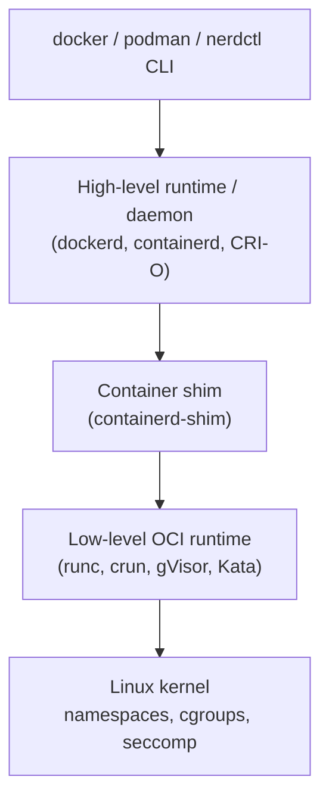
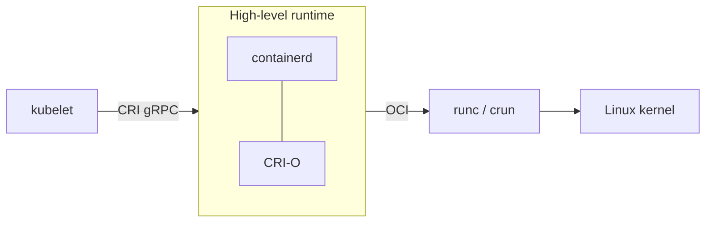
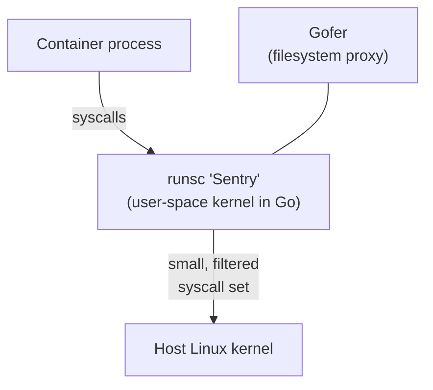

<div class="hero-section" style="background: linear-gradient(135deg, #0066cc 0%, #00aaff 100%); color: white; padding: 3rem 2rem; margin: -2rem -3rem 2rem -3rem; text-align: center;">
  <h1 style="color: white; margin: 0; font-size: 2.5rem;">Container Runtimes &amp; Alternatives</h1>
  <p style="font-size: 1.25rem; margin-top: 1rem; opacity: 0.9;">The OCI spec, runc/containerd/CRI-O, sandboxed runtimes (gVisor, Kata), Firecracker microVMs, and WebAssembly — and when to choose each over Docker.</p>
</div>

[Technology](./) &raquo; Container Runtimes &amp; Alternatives

<div class="intro-card">
  <p class="lead-text">"Docker" is a brand, not a runtime. Underneath the friendly CLI sits a <strong>stack of standardized components</strong> — an image format, a high-level daemon, and a low-level runtime that actually talks to the kernel. Once you understand that stack, you can swap pieces in and out: replace the daemon with containerd or CRI-O, replace the low-level runtime with a sandbox like gVisor or a microVM like Kata/Firecracker, or step outside containers entirely with WebAssembly. This page maps the landscape and gives you a decision framework for picking the right isolation boundary for a workload.</p>
</div>

<div class="tip-card">
  <h4>Where this fits</h4>
  <ul>
    <li><strong>This page</strong> — the runtime layer beneath Docker and its alternatives; how containers actually start, and what to use when a plain container is too much or too little isolation.</li>
    <li><a href="docker/">Docker section</a> — building images, Dockerfiles, storage, and security for the common case.</li>
    <li><a href="kubernetes/">Kubernetes</a> — orchestrating whichever runtime you choose, via the Container Runtime Interface (CRI).</li>
  </ul>
</div>

## The Container Stack: It Isn't One Program

The first thing to internalize is that the word "Docker" hides three distinct layers that the industry has since standardized and decoupled. When you run `docker run nginx`, the request flows down through them:



| Layer | Job | Examples |
|-------|-----|----------|
| **CLI / client** | User-facing commands, build orchestration | `docker`, `podman`, `nerdctl` |
| **High-level runtime** | Pull/manage images, manage container lifecycle, expose an API | `dockerd`, **containerd**, **CRI-O** |
| **Low-level (OCI) runtime** | Set up namespaces/cgroups and `exec` the process | **runc**, **crun**, **gVisor**, **Kata** |

The boundary between the high-level and low-level runtime is governed by the **OCI Runtime Specification**, which is what makes the whole thing swappable. Any runtime that speaks OCI is a drop-in replacement at the bottom of the stack — that is the single most important fact for everything below.

## The Open Container Initiative (OCI)

The **Open Container Initiative**, formed in 2015 under the Linux Foundation, publishes three vendor-neutral specifications that turned "a Docker image" into "a portable, standard artifact":

- **Image Specification** — the on-disk/registry format: a layered filesystem (content-addressable tarballs), plus a JSON config describing layers, env, entrypoint, and architecture. This is why an image built by Docker runs under containerd, Podman, or Kubernetes unchanged.
- **Runtime Specification** — how to run a **filesystem bundle**: a root filesystem directory plus a `config.json`. It defines the lifecycle (`create` → `start` → `kill` → `delete`) and the configuration the runtime must honor.
- **Distribution Specification** — the registry HTTP API for pushing and pulling images (standardizing what the Docker Registry v2 protocol started).

### The runtime bundle

A low-level OCI runtime does not know about registries or layers. It is handed a directory containing an already-extracted root filesystem and a `config.json`, and its only job is to turn that into a running, isolated process:

```json
{
  "ociVersion": "1.1.0",
  "process": {
    "terminal": false,
    "user": { "uid": 1000, "gid": 1000 },
    "args": ["/usr/bin/myapp", "--serve"],
    "env": ["PATH=/usr/local/bin:/usr/bin:/bin", "TERM=xterm"],
    "cwd": "/",
    "capabilities": {
      "bounding": ["CAP_NET_BIND_SERVICE"],
      "effective": ["CAP_NET_BIND_SERVICE"]
    },
    "noNewPrivileges": true
  },
  "root": { "path": "rootfs", "readonly": true },
  "linux": {
    "namespaces": [
      { "type": "pid" },
      { "type": "network" },
      { "type": "ipc" },
      { "type": "uts" },
      { "type": "mount" }
    ],
    "resources": {
      "memory": { "limit": 536870912 },
      "cpu": { "shares": 1024 }
    },
    "seccomp": { "defaultAction": "SCP_ACT_ERRNO" }
  }
}
```

Two things are worth noticing. First, the entire isolation policy — which **namespaces** to create, which **cgroup** limits to apply, which Linux **capabilities** to grant, and the **seccomp** filter — lives in this one file. Second, nothing here says *how* isolation is implemented. A standard runtime creates real kernel namespaces; a sandboxed runtime can read the same config and implement the equivalent isolation a completely different way. That is the seam every alternative below exploits.

## Standard Runtimes: runc, containerd, CRI-O

### runc — the reference low-level runtime

**runc** is the original OCI runtime, donated by Docker, written in Go, and still the default almost everywhere. It is a small command-line tool: given a bundle, it creates Linux namespaces, configures cgroups, applies the seccomp/capabilities/AppArmor policy, pivots into the root filesystem, and `exec`s the container's process. There is no daemon — runc starts the process and gets out of the way.

```bash
# runc operates directly on a bundle, no daemon involved
runc run mycontainer        # create + start in one step
runc list                   # show running containers
runc exec mycontainer sh    # exec into a running container
runc kill mycontainer TERM
runc delete mycontainer
```

Because it shares the host kernel directly, runc is the **fastest, lightest** option — and the one with the **largest attack surface**, since a kernel exploit from inside the container is a host compromise.

### crun — the C reimplementation

**crun** is a functionally equivalent OCI runtime written in C rather than Go. It starts containers faster and uses less memory (no Go runtime), which matters at high container density, and it has first-class support for cgroups v2. It is the default in Podman/CRI-O on many distributions and is a transparent swap for runc. (crun is also the entry point for some WASM workflows, covered later.)

### containerd — the high-level runtime

**containerd** is the daemon that sits *above* runc and handles everything runc deliberately ignores: pulling and unpacking images, managing snapshots/storage, networking, and the full container lifecycle over a gRPC API. Docker itself uses containerd internally; Kubernetes talks to it directly. For each container, containerd launches a small **shim** process that owns the container's lifetime, so the containerd daemon can be restarted or upgraded without killing running containers.

```bash
# nerdctl is a Docker-compatible CLI for containerd
nerdctl run -d --name web -p 8080:80 nginx
nerdctl ps
ctr -n k8s.io containers list   # low-level containerd client
```

### CRI-O — purpose-built for Kubernetes

**CRI-O** is a high-level runtime built for one job: implementing Kubernetes' **Container Runtime Interface (CRI)** and nothing else. Where containerd is a general-purpose runtime that *also* speaks CRI, CRI-O is intentionally minimal — it pulls images, manages pods, and delegates to an OCI runtime (runc or crun), with no extra surface for `docker build`-style features. It is the default in OpenShift and a common choice for security-conscious clusters.



The takeaway: **containerd and CRI-O are interchangeable at the CRI boundary; runc and crun are interchangeable at the OCI boundary.** This is why "Docker vs containerd vs CRI-O" is rarely a real either/or — they live at different layers.

## When a Shared Kernel Isn't Enough: Sandboxed Runtimes

Standard containers share the host kernel. That sharing is the source of their speed *and* their central security weakness: every container is one kernel vulnerability away from the host. Sandboxed runtimes keep the OCI interface (so orchestrators don't notice) but interpose a stronger isolation boundary between the container and the host kernel. The two leading approaches take opposite routes to the same goal.

### gVisor — a user-space kernel

**gVisor** (Google) inserts a user-space "guest kernel" called **runsc** between the container and the host. Instead of forwarding the container's system calls to the host kernel, runsc *intercepts* them and reimplements the Linux syscall API in a sandboxed Go process. The container thinks it is talking to Linux; it is actually talking to gVisor, which makes a much smaller, tightly controlled set of calls to the real kernel.



- **Isolation model:** the host kernel's syscall surface (hundreds of calls, the usual source of container escapes) is hidden behind gVisor's much smaller surface.
- **Cost:** the syscall interception and reimplementation add CPU overhead, and gVisor does not implement every obscure syscall, so some workloads (heavy I/O, certain `/proc` usage) underperform or fail.
- **Use it for:** multi-tenant platforms running untrusted code where you want strong isolation without spinning up a full VM. It is the runtime behind Google Cloud Run and parts of App Engine.

```bash
# gVisor registers as an OCI runtime named runsc
docker run --runtime=runsc hello-world
# In Kubernetes, a RuntimeClass selects it per-pod:
#   runtimeClassName: gvisor
```

### Kata Containers — a lightweight VM per container

**Kata Containers** takes the opposite approach: instead of emulating the kernel, give each container (or pod) its *own real kernel* inside a lightweight virtual machine. A hardware-virtualization boundary (Intel VT-x / AMD-V) separates the container from the host, so a kernel exploit inside the container compromises only that throwaway VM, not the host.

- **Isolation model:** hardware-enforced VM boundary — the strongest of the container-compatible options, equivalent to a VM but with container ergonomics.
- **Cost:** higher memory and a slower (~hundreds of ms) cold start than runc, because a kernel and minimal guest must boot. Kata uses minimized kernels and memory ballooning to keep this as low as possible.
- **Use it for:** running genuinely untrusted tenants side by side, or meeting compliance requirements that mandate VM-level isolation, while keeping Kubernetes/OCI tooling.

| Property | runc (standard) | gVisor | Kata Containers |
|----------|-----------------|--------|-----------------|
| Isolation boundary | Shared host kernel | User-space kernel (Go) | Per-container VM (hardware) |
| Kernel attack surface | Full host kernel | Small, filtered | Guest kernel only |
| Startup | Fastest (~ms) | Fast (slight overhead) | Slower (~100s of ms) |
| Syscall compatibility | 100% (native) | Most, not all | 100% (real kernel) |
| Memory overhead | Minimal | Low–moderate | Higher (kernel per VM) |
| Best for | Trusted workloads | Untrusted code, density | Untrusted multi-tenant, compliance |

## Firecracker — MicroVMs for Serverless Scale

**Firecracker** (AWS) is the **virtual machine monitor (VMM)** that powers AWS Lambda and Fargate. It is not itself an OCI runtime; it is a minimalist replacement for QEMU, purpose-built to launch **microVMs** — stripped-down virtual machines with only the devices a serverless workload needs (a network interface, a block device, a serial console) and nothing else.

Its design goals are the inverse of a general-purpose hypervisor:

- **Minimal device model** → tiny attack surface and a memory footprint of only a few MB per microVM.
- **Sub-150 ms boot** → fast enough to start a fresh VM *per function invocation*, the property AWS Lambda needs to give every customer request hardware-level isolation cheaply.
- **Rust + jailer** → the VMM runs as a small Rust process inside its own seccomp/cgroup jail, so even a compromised VMM is contained.

```text
Lambda invocation  ──►  Firecracker VMM  ──►  microVM (guest kernel + your function)
                          (one per invocation, booted in <150 ms,
                           torn down after, isolated by VT-x/AMD-V)
```

Firecracker connects back to the container world through **Kata** (which can use Firecracker as its VMM) and through **firecracker-containerd**, letting containerd launch OCI containers inside Firecracker microVMs. In other words, Firecracker is the *isolation engine*; Kata and firecracker-containerd are the adapters that make it speak OCI.

**Choose Firecracker (directly or via Kata) when** you need VM-grade isolation at extreme density and per-request startup — the serverless/FaaS sweet spot. **Don't** reach for it for long-running stateful services where a standard container or a normal VM is simpler.

## WebAssembly and WASI: A Next-Generation Runtime

While Docker and traditional container runtimes have revolutionized application deployment, the technology continues to evolve. One of the most promising developments is the emergence of WebAssembly as a potential container runtime alternative. This represents a significant shift in how we think about application isolation and portability.

### WASM/WASI as Container Runtime Alternative

WebAssembly (WASM) and the WebAssembly System Interface (WASI) represent a potential paradigm shift in container technology, offering a lightweight, secure, and portable alternative to traditional container runtimes. Unlike traditional containers that share the host kernel, WebAssembly provides a completely sandboxed execution environment that can run anywhere — from browsers to servers to edge devices.

Crucially, WASM is a *different kind of isolation* than everything above. runc, gVisor, and Kata all isolate an OS process — they differ only in how strong the boundary around that process is. WebAssembly does not run an OS process at all: it runs a **bytecode module inside a virtual machine** that has no inherent access to the host. The boundary is the VM itself.

#### Understanding WebAssembly

To appreciate why WebAssembly is relevant to containerization, let's examine its core characteristics that make it suitable as a container runtime alternative:

**Core Characteristics:**
- **Binary Instruction Format**: Designed for stack-based virtual machines
- **Near-Native Performance**: Compiles to machine code (JIT/AOT) with minimal overhead
- **Language Agnostic**: Supports C/C++, Rust, Go, and many other languages
- **Sandboxed Execution**: Strong security guarantees through capability-based security
- **Platform Independent**: True write-once, run-anywhere portability — the *same* `.wasm` binary runs on any CPU architecture, with no per-arch images

That last point is a real differentiator from OCI images, which are built and distributed per architecture (`amd64`, `arm64`, …). A WASM module is architecture-neutral by construction.

#### WASI (WebAssembly System Interface)

Pure WebAssembly can compute but cannot, by itself, open a file or a socket — it has no syscalls. **WASI** provides a standardized, capability-based system interface so WASM modules can interact with the outside world in a portable, sandboxed way:

```rust
// Example WASI application in Rust
use std::env;
use std::fs;

fn main() {
    // WASI provides standard file system access
    let args: Vec<String> = env::args().collect();

    if args.len() > 1 {
        match fs::read_to_string(&args[1]) {
            Ok(contents) => println!("File contents: {}", contents),
            Err(e) => eprintln!("Error reading file: {}", e),
        }
    }
}
```

**WASI Capabilities:**
- **File System Access**: Sandboxed file operations
- **Network Access**: Controlled socket operations
- **Environment Variables**: Secure environment access
- **Random Number Generation**: Cryptographically secure randomness
- **Clock Access**: Time and timer functionality

While WASI provides essential system interfaces, some applications require more extensive POSIX compatibility. This is where WASIX comes in.

#### WASIX: Extended WASI

WASIX extends WASI with additional POSIX compatibility:

- **Threading Support**: Full POSIX threads
- **Process Forking**: Fork/exec capabilities
- **Signals**: POSIX signal handling
- **Sockets**: Extended networking support
- **Shared Memory**: Inter-process communication

```c
// WASIX example with threading
#include <pthread.h>
#include <stdio.h>

void* worker(void* arg) {
    printf("Worker thread: %ld\n", (long)arg);
    return NULL;
}

int main() {
    pthread_t thread;
    pthread_create(&thread, NULL, worker, (void*)42);
    pthread_join(thread, NULL);
    return 0;
}
```

With these extended capabilities, WebAssembly becomes viable for a broader range of applications. But how do we actually run WebAssembly modules as containers? There are two camps: standalone runtimes, and OCI-integrated runtimes.

#### The runtimes: Wasmtime, WasmEdge, Wasmer, and crun

Several engines execute `.wasm` modules. The dominant standalone runtimes are:

- **Wasmtime** — the Bytecode Alliance reference runtime, the leading implementation of WASI and the Component Model.
- **WasmEdge** — a CNCF runtime tuned for edge/cloud and AI inference, with deep containerd integration.
- **Wasmer** — a runtime emphasizing broad language support and WASIX.

To run WASM *as a container*, an OCI-compliant runtime embeds one of these engines. **crun** does exactly this — it can detect a WASM workload and execute it via an embedded WasmEdge instead of `exec`ing a native binary:

```bash
# Running WASM containers with crun (built with WASM support)
sudo crun --runtime=/usr/bin/crun-wasm run wasm-container

# Container configuration for WASM — the annotation flags the module as WASM
{
  "ociVersion": "1.0.2",
  "process": {
    "args": ["app.wasm"],
    "env": ["PATH=/usr/local/sbin:/usr/local/bin:/usr/sbin:/usr/bin:/sbin:/bin"],
    "cwd": "/"
  },
  "root": {
    "path": "rootfs"
  },
  "annotations": {
    "module.wasm.image/variant": "compat"
  }
}
```

The other integration path is **runwasi**, a containerd shim that runs WASM modules directly as containerd-managed workloads — this is the mechanism behind the Kubernetes `RuntimeClass` examples below. Either way, the orchestrator sees an ordinary OCI workload; the runtime quietly executes bytecode instead of a Linux process.

Now that we've seen how WebAssembly can function as a container runtime, let's examine the compelling advantages it offers over traditional container technologies.

### Advantages of WASM Containers

WebAssembly's appeal as a runtime comes down to three properties: it starts almost instantly, it isolates by *capability* rather than by kernel namespace, and its modules are tiny. The figures below are representative order-of-magnitude comparisons (exact numbers vary by workload and host); treat them as relative, not absolute.

#### Startup time and footprint

| Metric | Docker container | Firecracker microVM | WASM module |
|--------|------------------|---------------------|-------------|
| Cold start | ~1 s | ~125 ms | ~1 ms |
| Memory overhead | ~50 MB | ~150 MB | ~1-5 MB |
| Disk footprint | 100 MB - 1 GB | 100 MB - 1 GB | 1-10 MB |
| CPU overhead | 5-10% | 5-15% | under 1% |

The sub-millisecond cold start is the headline number: it makes WASM attractive for serverless and edge workloads where a traditional container's ~1 second startup dominates request latency.

#### Capability-based security

A container restricts a process *after* it has full access to a shared kernel — you drop capabilities and add seccomp profiles to claw privileges back. WebAssembly inverts this: a module starts with **no** access to the host and can only touch resources its host explicitly hands it (a pre-opened directory, a socket, a clock). There is no ambient authority to escape from.

```rust
// A WASI module can only open files under a directory the host pre-opened.
// Without that grant, path_open simply fails — the module never had access.
use wasi::{Errno, Fd};

fn open_under_preopened(dir_fd: Fd, path: &str) -> Result<Fd, Errno> {
    unsafe {
        wasi::path_open(
            dir_fd, // a directory FD the host chose to expose
            0,      // dirflags
            path,
            0,      // open flags
            0,      // rights base
            0,      // rights inheriting
            0,      // fd flags
        )
    }
}
```

These advantages make WebAssembly particularly attractive for modern cloud-native applications. But how do we manage WebAssembly containers at scale? The answer lies in integrating with existing orchestration platforms.

### WASM Container Orchestration

#### Kubernetes Integration

```yaml
apiVersion: v1
kind: Pod
metadata:
  name: wasm-app
  annotations:
    module.wasm.image/variant: "compat-smart"
spec:
  runtimeClassName: wasmtime
  containers:
  - name: app
    image: myregistry/wasm-app:latest
    resources:
      limits:
        memory: "10Mi"
        cpu: "100m"
```

The `runtimeClassName` selects a WASM-capable runtime (via a runwasi shim) exactly the way `gvisor` or `kata` would select those runtimes — the orchestration plane is unchanged.

#### Krustlet: Kubernetes Kubelet for WASM

```rust
// Krustlet provider implementation
use kubelet::Provider;

struct WasmProvider {
    runtime: wasmtime::Engine,
}

impl Provider for WasmProvider {
    async fn add(&self, pod: Pod) -> Result<()> {
        let module = self.fetch_wasm_module(&pod)?;
        let instance = self.runtime.instantiate(&module)?;
        instance.run().await
    }
}
```

While the integration with Kubernetes and other orchestration platforms is promising, it's important to understand where WebAssembly containers excel and where traditional containers might still be the better choice.

### Use Cases and Limitations

**Ideal Use Cases:**
- **Edge Computing**: Ultra-low latency requirements
- **Serverless Functions**: Fast cold starts
- **Plugin Systems**: Secure, sandboxed extensions
- **IoT Devices**: Minimal resource footprint
- **Multi-tenant Platforms**: Strong isolation guarantees

**Current Limitations:**
- **Ecosystem Maturity**: Tooling still evolving
- **Language Support**: Not all languages compile efficiently to WASM
- **System Calls**: Limited compared to native containers
- **Debugging**: More challenging than traditional containers

Despite these limitations, many organizations are exploring WebAssembly for specific workloads. If you're considering this transition, here's a practical approach to migration.

### Migration Path

```python
# Gradual migration strategy
class ContainerMigrationStrategy:
    def assess_workload(self, app):
        """Determine if app is suitable for WASM"""
        criteria = {
            "stateless": app.is_stateless(),
            "cpu_bound": app.is_cpu_intensive(),
            "small_footprint": app.size < 50 * 1024 * 1024,  # 50MB
            "supported_language": app.language in ["rust", "c", "go"],
        }

        score = sum(criteria.values()) / len(criteria)
        return score > 0.7  # 70% criteria met

    def migrate_to_wasm(self, app):
        """Step-by-step migration"""
        steps = [
            self.compile_to_wasm,
            self.add_wasi_bindings,
            self.test_functionality,
            self.optimize_performance,
            self.deploy_hybrid,
            self.monitor_and_validate,
            self.complete_migration
        ]

        for step in steps:
            if not step(app):
                return self.rollback(app)
```

To make informed decisions about migration, it's essential to understand the real-world performance characteristics of WebAssembly containers compared to traditional Docker containers.

### Performance Characteristics

The table below sketches how the two runtimes compare across a few common workload shapes. Startup and memory are reported in the same units across rows so the trend is visible; per-request latency is roughly comparable once warm, which is the key takeaway — **WASM's win is in cold start and footprint, not steady-state throughput.**

| Workload | Runtime | Cold start | Per-request latency | Memory |
|----------|---------|-----------|---------------------|--------|
| HTTP request handler | Docker | ~1200 ms | ~0.5 ms | ~50 MB |
| HTTP request handler | WASM | ~1 ms | ~0.6 ms | ~2 MB |
| Image processing | Docker | ~1500 ms | ~10 ms | ~200 MB |
| Image processing | WASM | ~2 ms | ~12 ms | ~20 MB |
| API gateway | Docker | ~1000 ms | ~0.2 ms | ~100 MB |
| API gateway | WASM | ~0.5 ms | ~0.25 ms | ~5 MB |

Two patterns stand out. First, cold start collapses from roughly a second to single-digit milliseconds — decisive for serverless and scale-to-zero. Second, steady-state per-request latency is essentially a wash; WASM does not make a warm handler meaningfully faster, so it is not a drop-in throughput upgrade for long-running services. As the technology matures, we can expect even more improvements. Let's look at what's on the horizon.

### Future Developments

**Component Model:**
```wit
// WebAssembly Interface Types (WIT)
interface http-handler {
  use types.{request, response}

  handle: func(req: request) -> response
}

world service {
  import wasi:filesystem/types
  import wasi:sockets/tcp

  export http-handler
}
```

The **Component Model** is the most consequential development here: it lets WASM modules written in *different languages* describe and call each other's interfaces (via WIT, the WebAssembly Interface Types) with no shared memory layout or FFI glue. It is what will make WASM a true polyglot composition format rather than a single-module sandbox.

**WASM-native Development:**
```rust
// Future: Direct WASM targeting without WASI
#[no_std]
#[wasm_module]
pub mod app {
    #[wasm_export]
    pub fn handle_request(ptr: *const u8, len: usize) -> Vec<u8> {
        // Direct memory manipulation
        // No system calls needed
    }
}
```

## Choosing a Runtime

There is no single "best" runtime — there is the lightest isolation boundary that satisfies your trust and compatibility requirements. Work down this list and stop at the first row that fits:

| If you need… | Choose | Why |
|--------------|--------|-----|
| The default for trusted internal workloads | **runc / crun** (Docker, containerd) | Fastest, lightest, 100% compatible, ubiquitous tooling |
| Kubernetes-native, minimal runtime | **containerd** or **CRI-O** | Purpose-built CRI implementations; delegate to runc/crun |
| Stronger isolation for untrusted code, high density | **gVisor** | Shrinks kernel attack surface without a full VM |
| VM-grade isolation with container ergonomics | **Kata Containers** | Real per-container kernel via hardware virtualization |
| VM isolation at serverless scale and startup | **Firecracker** (often via Kata) | MicroVMs that boot in <150 ms, one per invocation |
| Instant cold start, tiny footprint, polyglot plugins | **WebAssembly / WASI** | Sub-ms start, MB-scale modules, capability-based sandbox |

A few rules of thumb to anchor the decision:

- **Trust is the first axis.** If you run only your own code, a standard container (runc) is almost always right; reach for a sandbox only when something untrusted runs *next to* something it must not reach.
- **Startup is the second axis.** Scale-to-zero and per-request isolation push you toward Firecracker (VM-grade) or WASM (process-grade-but-tiny), depending on how strong a boundary you need.
- **Compatibility is the constraint.** runc and Kata run *any* Linux binary unchanged. gVisor runs *most*. WASM runs only code compiled to WASM — the biggest adoption hurdle, and why it complements rather than replaces containers today.

The durable principle does not change with the tooling: build for **consistency, isolation, and portability**, and choose the lightest runtime that meets your isolation needs.

## See Also

- [Docker](docker/) — Building images and the common-case container workflow
- [Docker: Advanced Patterns](docker/advanced.html) — Production architectures, design patterns, and case studies
- [Docker Essentials](docker-essentials.html) — Command cheat sheet
- [Kubernetes](kubernetes/) — Orchestrating any OCI runtime via the CRI
- [AWS](aws/) — Fargate and Lambda, which run on Firecracker microVMs
- [Cybersecurity](cybersecurity/) — Isolation, sandboxing, and threat models
- [Distributed Systems](../distributed-systems/) — Distributed computing principles
