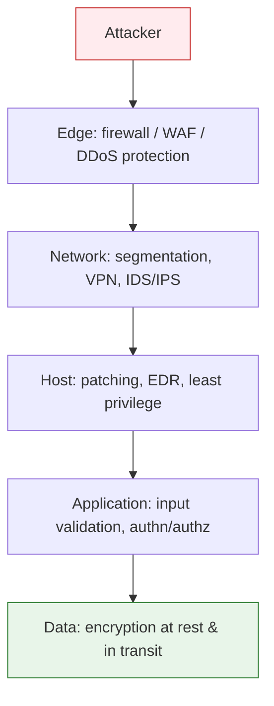
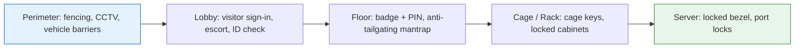

<p class="breadcrumb"><a href="./">Cybersecurity</a> › Attacks &amp; Network Defense</p>

# Attacks & Network Defense

Defending a network means both building perimeter controls and understanding the adversary. This page covers network defenses (firewalls, VPNs, IDS), the advanced attack techniques that bypass them (social engineering, supply chain, ransomware), and the physical and ML-based attack vectors that target the edges of what software controls.

## Network Security: Defending Your Digital Perimeter

Now that we understand how encryption protects data (see [Cryptography](cryptography.html)), let's explore how to defend against attacks on your networks and systems.

Effective security is layered — no single control is trusted to stop everything. This **defense-in-depth** model means an attacker who breaches one layer still faces the next:



### Firewalls: Your First Line of Defense

A firewall is like a security guard for your network, checking every packet of data that tries to enter or leave. But unlike a human guard, it makes decisions based on rules you define:

```bash
# Example: Block all incoming connections except web traffic
iptables -A INPUT -p tcp --dport 80 -j ACCEPT   # Allow HTTP
iptables -A INPUT -p tcp --dport 443 -j ACCEPT  # Allow HTTPS
iptables -A INPUT -j DROP                        # Block everything else

# Why this matters: Without these rules, anyone could connect
# to any service running on your computer
```

### The Evolution of Network Attacks

Attackers have become increasingly sophisticated. Here's how network attacks have evolved and how defenses have adapted:

#### 1. Simple Port Scanning → Stateful Firewalls
Early attackers would scan for open ports. Modern firewalls track connection states, allowing responses only to connections you initiated.

#### 2. Application Exploits → Deep Packet Inspection
Attackers started hiding malicious code in seemingly normal traffic. Next-generation firewalls inspect the actual content of packets, not just headers.

#### 3. Encrypted Attacks → SSL/TLS Inspection
As more traffic became encrypted, attackers hid behind HTTPS. Modern security appliances can decrypt, inspect, and re-encrypt traffic (with proper certificates).

### VPNs: Creating Secure Tunnels

When you connect to public WiFi, a VPN creates an encrypted tunnel to a trusted server. All your traffic flows through this tunnel, safe from prying eyes:

```python
# What happens without VPN:
# Your computer → [UNENCRYPTED] → Coffee shop WiFi → Internet
# Anyone on the same WiFi can see your traffic

# With VPN:
# Your computer → [ENCRYPTED TUNNEL] → VPN server → Internet
# Coffee shop WiFi only sees encrypted data
```

### Intrusion Detection: When Prevention Isn't Enough

Even the best defenses can be breached. Intrusion Detection Systems (IDS) act like security cameras, watching for suspicious behavior:

```python
# Example IDS rule detecting potential SQL injection
if "SELECT" in request and "UNION" in request:
    alert("Possible SQL injection attempt detected!")
    log_attack(source_ip, request_details)

# More sophisticated detection uses machine learning
# to identify anomalies in network behavior
```

## Zero Trust: Never Trust, Always Verify

The old model of "trust internal network, distrust external" is dead. Zero Trust assumes the network is already hostile and verifies every request on its own merits, regardless of where it originates — which is why it underpins modern cloud [IAM](cloud-and-container-security.html#iam-the-keys-to-your-kingdom) as well as network design.

```python
# Traditional security model
if request.source_ip in internal_network:
    allow(request)  # DANGEROUS!

# Zero Trust model
def handle_request(request):
    # Verify everything, every time
    if not verify_identity(request.user):
        return deny()

    if not verify_device(request.device):
        return deny()

    if not verify_location(request.location):
        return deny()

    if not verify_authorization(request.user, request.resource):
        return deny()

    # Continuous verification
    monitor_behavior(request)

    return allow()
```

## Advanced Attack Techniques: How Hackers Think

To defend effectively, you need to understand how attackers operate. Modern attacks go far beyond simple password guessing.

### Social Engineering: Hacking Humans

The weakest link in any security system is often the human element. Attackers know this:

**Phishing Evolution**:
1. **Basic**: "Your account is suspended! Click here!"
2. **Spear Phishing**: Targeted emails using personal information
3. **Whaling**: Targeting executives with sophisticated attacks
4. **Vishing**: Voice phishing over phone calls
5. **Smishing**: SMS-based phishing

**Defense**: Security awareness training and technical controls like email authentication (SPF, DKIM, DMARC).

**AI-Powered Attacks**:
- **Deepfake voice cloning**: CEO fraud using synthetic voices
- **AI-generated phishing**: Personalized at scale using LLMs
- **Business Email Compromise (BEC)**: $2.9 billion in losses (2023)
- **Defense**: AI-powered email security, behavioral analysis, voice authentication

### Supply Chain Attacks: Trusting the Untrustworthy

Why hack one company when you can hack a supplier and reach hundreds? The SolarWinds attack compromised 18,000 organizations through a single software update.

**Recent Supply Chain Attacks (2023-2024)**:
- **3CX**: Compromised software update affected 600,000+ companies
- **MOVEit**: SQL injection led to breaches at 1000+ organizations
- **PyPI/npm attacks**: Malicious packages targeting developers
- **xz Utils backdoor**: Near-miss that could have compromised Linux systems worldwide

```python
# How supply chain attacks work:
# 1. Attacker compromises software vendor
# 2. Malicious code inserted into legitimate update
# 3. Customers install "trusted" update
# 4. Attacker now has access to all customers

# Defense: Software composition analysis
import subprocess

# Check dependencies for known vulnerabilities
result = subprocess.run(['pip-audit'], capture_output=True)
if 'vulnerability' in result.stdout.decode():
    alert_security_team()
```

### Supply-Chain Defense: Knowing and Trusting What You Ship

Detecting a malicious package after the fact is reactive. A mature program shifts left, building the supply chain so that every artifact is *inventoried*, *verifiable*, and *attributable*. Four pillars carry most of the weight: an inventory of what you ship (SBOM), proof of how it was built (provenance), cryptographic identity on the artifacts (signing), and continuous evaluation of the components and vendors you depend on.

#### Software Bills of Materials (SBOM)

An SBOM is a machine-readable inventory of every component — direct and transitive — that goes into a build, with versions, suppliers, licenses, and ideally hashes. When a new CVE drops (think Log4Shell), the difference between "we'll know in an hour" and "we'll know in three weeks" is whether you have current SBOMs you can query. Two formats dominate:

| Aspect | CycloneDX | SPDX |
|--------|-----------|------|
| Steward | OWASP | Linux Foundation (ISO/IEC 5962:2021) |
| Primary focus | Security & vulnerability use cases (VEX, dependencies, services) | Licensing & compliance, broad artifact description |
| Encodings | JSON, XML, Protobuf | JSON, YAML, RDF, tag-value, spreadsheet |
| Component identity | CPE, PURL, SWID | PURL, CPE, download location |
| Common generators | `cyclonedx-*` CLIs, Syft, build plugins | Syft, FOSSology, SPDX tools |

Both satisfy the U.S. NTIA "minimum elements" for an SBOM and both can carry **VEX** (Vulnerability Exploitability eXchange) data, which states whether a known CVE in a bundled component is actually *exploitable* in your product — critical for cutting through the noise of transitive findings.

```bash
# Generate an SBOM from a built container image (format-agnostic tool)
syft myorg/app:1.4.2 -o cyclonedx-json > sbom.cdx.json
syft myorg/app:1.4.2 -o spdx-json       > sbom.spdx.json

# Scan that SBOM for known vulnerabilities (decoupled from generation)
grype sbom:sbom.cdx.json --fail-on high
```

#### SLSA: Provenance for the Build Itself

[SLSA](https://slsa.dev/) ("Supply-chain Levels for Software Artifacts") is a framework for hardening the *build pipeline* so that an artifact's origin is tamper-evident. Its core deliverable is signed **provenance**: an attestation that says "this artifact, with this digest, was produced from this source commit by this builder using these parameters." The levels are cumulative:

- **L1** — Provenance exists. The build process is scripted and emits a provenance document, even if unsigned. Gives basic transparency.
- **L2** — Signed provenance from a hosted build service. Provenance is generated by the platform (not the developer's laptop) and cryptographically signed, so it can't be silently forged.
- **L3** — Hardened, isolated builds. The build runs in an ephemeral, isolated environment with non-falsifiable provenance; secrets and the signing process are inaccessible to user-defined build steps, defeating an attacker who controls the build script.

```yaml
# Conceptual: a build emits provenance that a policy engine later verifies
attestation:
  predicateType: https://slsa.dev/provenance/v1
  subject:
    - name: myorg/app
      digest: { sha256: "9f86d0…" }   # the exact artifact this vouches for
  predicate:
    buildDefinition:
      buildType: "https://github.com/actions/runner"
      externalParameters:
        source: "git+https://github.com/myorg/app@<commit-sha>"
    runDetails:
      builder: { id: "https://github.com/slsa-framework/..." }
```

#### Signing and Verification

Provenance and SBOMs are only trustworthy if they're signed and the signatures are checked at admission time. **Sigstore** has become the de-facto open ecosystem:

- **cosign** signs container images and arbitrary blobs (including SBOMs and SLSA provenance) and attaches them to the registry as OCI artifacts.
- **Fulcio** issues short-lived signing certificates bound to an OIDC identity (a CI workload, a developer's SSO account), enabling **keyless signing** — no long-lived private key to leak.
- **Rekor** is an append-only transparency log; every signature is recorded so it can be audited and so revocation/monitoring is possible.

```bash
# Keyless sign in CI (identity comes from the workflow's OIDC token)
cosign sign --yes myorg/app@sha256:9f86d0…

# Attach an SBOM as a signed attestation
cosign attest --yes --predicate sbom.cdx.json \
  --type cyclonedx myorg/app@sha256:9f86d0…

# Verify at deploy time: signature + who signed it + which workflow
cosign verify \
  --certificate-identity-regexp '^https://github.com/myorg/.+' \
  --certificate-oidc-issuer https://token.actions.githubusercontent.com \
  myorg/app@sha256:9f86d0…
```

Admission controllers (Kyverno, OPA/Gatekeeper, Sigstore's policy-controller) enforce these checks in the cluster, *rejecting* any image that lacks valid provenance signed by an approved identity. This closes the SolarWinds-style gap: a tampered build artifact won't match a legitimate provenance attestation and is refused at deploy.

#### Dependency Scanning and Pinning

- **Software Composition Analysis (SCA)** — tools like `pip-audit`, `npm audit`, Dependabot, OSV-Scanner, Grype, and Trivy map your declared dependencies against vulnerability databases (NVD, the [OSV](https://osv.dev/) database, GitHub Advisories) and open PRs to bump them.
- **Lockfiles and hash pinning** — `requirements.txt` with `--hash`, `package-lock.json`, `go.sum`, and `Cargo.lock` pin exact versions *and digests*, so a registry that silently republishes a different artifact under the same version is detected.
- **Vendoring / internal proxies** — an internal registry mirror (Artifactory, Nexus, a Go module proxy) gives you a quarantine point and defeats **dependency-confusion** attacks, where an attacker publishes a public package with the same name as your private one and a higher version number.
- **Build hygiene** — pin CI actions to commit SHAs (not mutable tags), run builds with no network egress where possible, and review new transitive dependencies, not just direct ones.

#### Vendor and Third-Party Risk Assessment

Software you buy or integrate is part of your attack surface. A structured third-party risk management (TPRM) process evaluates suppliers before and during the relationship:

- **Security questionnaires & attestations** — standardized instruments (SIG, CAIQ) plus independent assurance reports (**SOC 2 Type II**, **ISO/IEC 27001** certification) substantiate a vendor's controls rather than taking their word.
- **Right-to-audit & SLAs** — contracts should mandate breach-notification timelines, patch SLAs, data-handling and sub-processor disclosure, and the right to assess.
- **Continuous monitoring** — external attack-surface and security-rating services flag a vendor's deteriorating posture between annual reviews; subscribe to their advisories so you learn about *their* incidents quickly.
- **Tiering** — assess depth-of-review against the blast radius: a vendor with access to production data or that ships code into your build warrants far deeper scrutiny than a marketing SaaS.

### Ransomware: The Digital Hostage Crisis

Ransomware encrypts your files and demands payment for the key. Modern ransomware is sophisticated:

1. **Initial Access**: Through phishing, RDP brute force, or exploits
2. **Reconnaissance**: Map the network, find valuable data
3. **Lateral Movement**: Spread to critical systems
4. **Data Exfiltration**: Steal data for "double extortion"
5. **Encryption**: Lock everything simultaneously
6. **Ransom Demand**: Pay or lose your data (and maybe have it leaked)

**Defense Strategy**:
```bash
# The 3-2-1 backup rule
# 3 copies of important data
# 2 different storage media
# 1 offsite backup

# Plus: Immutable backups that can't be encrypted
# Plus: Regular restore testing
# Plus: Network segmentation to limit spread
```

## Advanced Attack Vectors

### Side-Channel Attacks: The Invisible Threat

Some attacks don't target your code or network—they exploit the physical properties of computing. These "side channels" leak information through timing, power consumption, or electromagnetic radiation.

#### Timing Attacks: When Speed Kills Security

```python
# Vulnerable password check
def check_password_vulnerable(input_password, correct_password):
    if len(input_password) != len(correct_password):
        return False

    for i in range(len(input_password)):
        if input_password[i] != correct_password[i]:
            return False  # Returns immediately on first mismatch!
    return True

# Attack: Measure how long the function takes
# Longer execution = more characters correct
# Attacker can guess password one character at a time!

# Secure constant-time comparison
import hmac

def check_password_secure(input_password, correct_password):
    # Always compares all bytes, regardless of mismatches
    return hmac.compare_digest(input_password, correct_password)
```

#### Power Analysis: Reading Secrets from Power Lines

When your CPU processes different data, it uses different amounts of power. Attackers with physical access can measure these variations:

```python
# During RSA decryption, the CPU uses more power for '1' bits than '0' bits
# By measuring power consumption during decryption,
# attackers can recover the private key bit by bit!

# Defense: Power analysis countermeasures
def masked_multiplication(a, b):
    # Add random "mask" to hide real values
    mask = random.randint(1, 1000)
    masked_a = a ^ mask
    masked_b = b ^ mask
    # Perform operation on masked values
    result = complex_operation(masked_a, masked_b)
    # Remove mask from result
    return result ^ mask
```

### Machine Learning Under Attack

As AI becomes more prevalent, attackers have developed ways to fool machine learning models:

#### Adversarial Examples: Fooling AI

```python
# Add tiny, invisible changes to an image
# that completely fool an AI classifier

def create_adversarial_example(model, image, true_label):
    # Calculate gradient of loss with respect to input
    epsilon = 0.01  # Tiny perturbation

    # Fast Gradient Sign Method (FGSM)
    gradient = calculate_gradient(model, image, true_label)
    perturbation = epsilon * sign(gradient)

    # Add perturbation to image
    adversarial_image = image + perturbation

    # To human: looks identical
    # To AI: completely different!
    # "Stop sign" → "Speed limit 45"
    return adversarial_image
```

#### Model Stealing: Intellectual Property Theft

Attackers can steal a machine learning model by querying it:

```python
# Attacker queries your model API with carefully chosen inputs
# Uses responses to train their own copy of your model
# After enough queries, they have a functional clone!

# Defense: Rate limiting, anomaly detection, output perturbation
def protect_model_api(model, input_data):
    # Add small random noise to outputs
    prediction = model.predict(input_data)
    noise = random.normal(0, 0.01, prediction.shape)
    return prediction + noise
```

## Physical & Hardware Attacks

Most of this page assumes the adversary is on the wire. But an attacker who can *touch* the hardware — or who is the hardware vendor — operates below the layer your software trusts. Physical security is the substrate every other control rests on: an unlocked rack, a cloned badge, or a leaking power rail can make perfect cryptography irrelevant.

### Data-Center & Facility Access Control

Physical defense, like network defense, is layered. A modern colocation or cloud facility enforces concentric zones, each with stronger controls than the last:



Key controls and the threats they address:

- **Mantraps / access-control vestibules** — a two-door airlock that admits one person at a time, defeating **tailgating** (slipping in behind an authorized employee).
- **Multi-factor physical access** — badge (something you have) + PIN or biometric (something you know/are). A cloned RFID badge alone shouldn't open a cage.
- **Anti-passback** — the system refuses a badge-in if that badge never badged out, catching a credential that's been passed back through a fence or door.
- **Least privilege & logging** — access is scoped per cage/row, time-boxed for contractors, and every entry is logged and reconciled against change tickets. Cameras provide non-repudiation.
- **Environmental and tamper monitoring** — door-ajar sensors, cage motion sensors, and seismic/vibration sensors on high-value racks.

### Tamper Evidence and Tamper Resistance

You can rarely *prevent* a determined attacker with physical possession from eventually getting in. The realistic goals are to make tampering **evident** (you can tell it happened) and, for the most sensitive components, **responsive** (the device destroys its secrets when attacked):

- **Tamper-evident** — holographic seals, frangible labels, and security tape that shred or display "VOID" if peeled. Chassis-intrusion switches log a BIOS event when a server lid opens. These don't stop an attacker; they ensure you *know*.
- **Tamper-resistant** — hardened enclosures, epoxy potting over sensitive chips, and meshes that resist drilling and probing.
- **Tamper-responsive** — active sensing (mesh continuity, voltage/temperature/light sensors) that triggers immediate **zeroization** of keys. This is the bar set by **FIPS 140-3 Level 3/4** for cryptographic modules: penetrating the boundary actively erases the secrets.
- **Chain of custody & evidence handling** — for hardware that's been out of your control (returned from RMA, seized, shipped), assume compromise until inspected; this is also why **evil-maid** attacks (brief unsupervised access to a powered-off laptop to implant a bootkit) are countered with measured boot and full-disk encryption bound to a TPM.

### Side-Channel & Fault-Injection Attacks

[Side channels](#side-channel-attacks-the-invisible-threat) were introduced above as timing and power leaks. With physical access the threat broadens considerably, because the attacker can both *observe* finer signals and *actively perturb* the device:

- **Differential Power Analysis (DPA)** — statistically correlating many power traces against a key hypothesis recovers keys even when single-trace (simple) power analysis fails. Countermeasures: masking (as shown earlier), hiding (constant-power logic, randomized clock), and balanced dual-rail circuits.
- **Electromagnetic (EM) emanation** — like power analysis but read with a near-field probe; also the basis of **TEMPEST**, where compromising emanations (from a CPU, cable, or even a monitor) are captured remotely. Defenses: shielding, Faraday enclosures, and filtered power.
- **Acoustic and optical** — chip-level acoustic cryptanalysis and laser/optical probing of decapsulated dies.
- **Fault injection (glitching)** — deliberately inducing a fault to skip a security check: **voltage glitching** (a brief undervolt), **clock glitching**, **electromagnetic fault injection**, and **laser fault injection**. A classic target is a `if (signature_valid)` branch or a secure-boot check. Defenses: redundant checks, control-flow integrity, sensors that detect out-of-spec voltage/clock, and randomized timing.
- **Rowhammer & cold-boot** — Rowhammer flips DRAM bits by rapidly accessing neighboring rows (a *remote-ish* hardware fault); cold-boot attacks freeze RAM to read residual keys after power-off. Mitigations: ECC and target-row-refresh memory, and never holding keys in unencrypted DRAM longer than necessary.

### Hardware Security Modules and Secure Elements

Because keys living in general-purpose memory are exposed to many of the attacks above, high-assurance systems keep keys in dedicated hardware that performs crypto *on behalf of* applications without ever exporting the key material:

- **HSM (Hardware Security Module)** — a tamper-responsive appliance or PCIe card that generates, stores, and uses keys inside a certified boundary (typically **FIPS 140-3 Level 3+**). Applications send "sign this / decrypt this" requests over PKCS#11, KMIP, or JCE; the private key never leaves. HSMs back PKI roots, payment (PIN/HSM) systems, code-signing keys, and cloud KMS services.
- **TPM (Trusted Platform Module)** — a low-cost secure crypto-processor on the motherboard that stores platform keys, performs **measured boot** (recording firmware/bootloader hashes into PCRs), and enables **remote attestation** and **sealing** (releasing a disk-encryption key only if the boot chain measurements match).
- **Secure Element / Smartcard / SIM** — a hardened single-chip used in payment cards, passports, and phones; **Apple's Secure Enclave** and Android's **StrongBox** are on-device variants isolating biometric templates and device keys.
- **Why it helps** — even if the host OS is fully compromised, the attacker can request *operations* but cannot extract the key, and rate limiting / policy in the module bounds the damage. Pair HSM-resident keys with strict authorization (quorum/M-of-N for the most sensitive keys) and audit logging.

### Biometric Spoofing and Presentation Attacks

Biometrics ("something you are") gate both physical doors and device unlock, but a biometric is not a secret — your face and fingerprints are observable and reproducible. A **presentation attack** (the ISO/IEC 30107 term) submits a forged trait to the sensor:

- **Fingerprint** — lifted latent prints cast in gelatin, glue, or conductive silicone; high-res photos for capacitive/optical sensors.
- **Face** — printed photos, video replay on a screen, 3D-printed masks, and increasingly **deepfakes** against remote/video identity-verification flows.
- **Voice** — recorded or AI-cloned speech against voice authentication (the same cloning that powers vishing).
- **Iris** — high-resolution photographs with a printed or contact-lens overlay.

Defenses center on **Presentation Attack Detection (PAD) / liveness detection**:

- **Active liveness** — challenge-response (blink, turn head, speak a random phrase) that a static artifact can't satisfy.
- **Passive liveness** — sensing properties only a live trait has: sub-dermal blood flow, pulse, skin texture/specular reflection, 3D depth (structured-light or ToF, as in Face ID), or sweat-pore patterns on a finger.
- **Multi-modal & multi-factor** — combine biometrics with a possession factor; never treat a biometric as a sole high-assurance credential for remote access.
- **Template protection** — store cancelable/transformed templates, not raw biometrics, so a database breach doesn't permanently compromise a trait you can't change. Standards: ISO/IEC 30107-3 (PAD testing) and FIDO's biometric certification program for measured anti-spoof performance.

---

<div class="page-nav">
  <span class="page-nav-prev"><a href="application-and-cloud-security.html">← Web, Cloud &amp; Container Security</a></span>
  <span class="page-nav-next"><a href="operations-and-response.html">Operations, Response &amp; Compliance →</a></span>
</div>

## See Also

- [Operations, Response & Compliance](operations-and-response.html) — what to do once an attack succeeds
- [Web, Cloud & Container Security](application-and-cloud-security.html) — application-layer attacks and Zero Trust in IAM
- [Networking](../networking/) — the protocols and routing these defenses operate on
