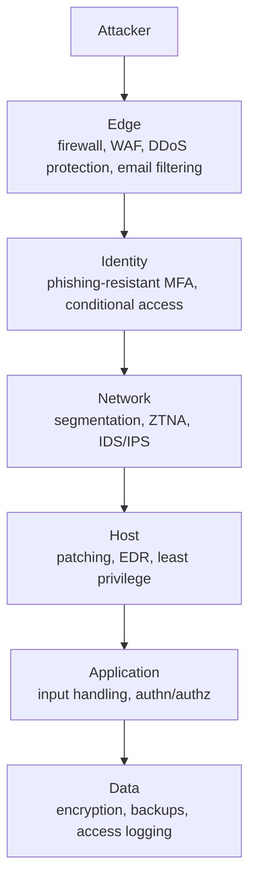
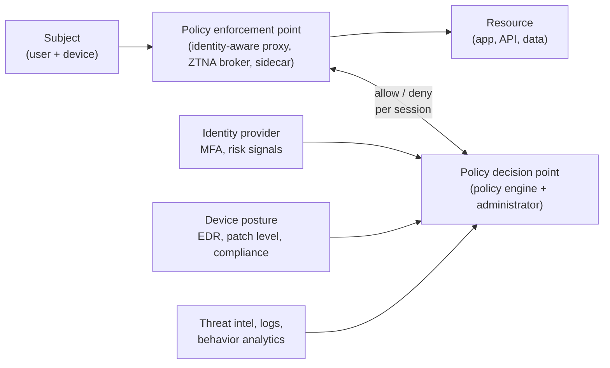
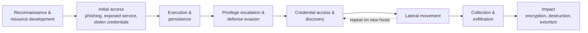
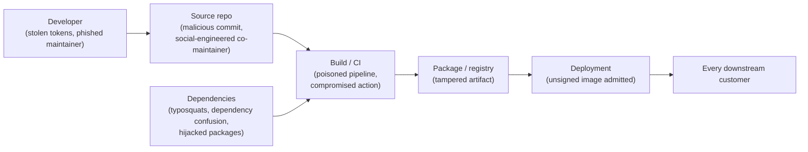
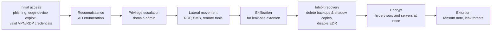
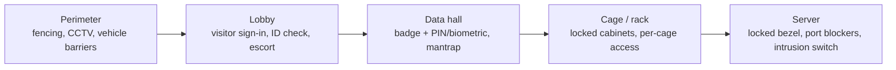

<p class="breadcrumb"><a href="./">Cybersecurity</a> › Attacks &amp; Network Defense</p>

# Attacks & Network Defense

Defending a network means building layered controls *and* understanding how adversaries get past them. This page covers network defenses (firewalls, VPNs, intrusion detection), Zero Trust architecture, the stages of a typical intrusion, and the attack classes that dominate current incident data: social engineering, software supply-chain compromise, and ransomware. It closes with attacks that sit below or beside software controls — side channels and fault injection, attacks on machine-learning systems, and physical and hardware threats.

## Defense in depth

No single control is trusted to stop everything. **Defense in depth** stacks independent layers so that an attacker who defeats one still faces the next, and so that each layer produces signals a defender can detect:



The layers are not equally strong, and in modern environments the identity layer carries more weight than the network edge. The rest of this page works through the layers and the attacks aimed at each.

## Network defenses

### Firewalls

A firewall enforces rules about which traffic may cross a boundary. Capabilities have accumulated over successive generations, each a response to attacks the previous one could not see:

| Generation | Decides on | Stops | Misses |
|------------|-----------|-------|--------|
| Packet filter | Individual packet headers (IP, port, protocol) | Traffic to unexposed ports | Anything riding an allowed port; spoofed replies |
| Stateful | Connection state (new, established, related) | Unsolicited inbound packets pretending to be replies | Malicious content inside legitimate sessions |
| Next-generation (NGFW) | Application identity, user identity, payload signatures | Known exploits and disallowed applications on standard ports | Encrypted payloads unless TLS inspection is enabled; novel attacks |
| Web application firewall (WAF) | HTTP semantics: parameters, headers, bodies | Common injection and scanner patterns | Logic flaws and access-control bugs (see [Application Security](application-and-cloud-security.html)) |
| Cloud security groups / microsegmentation | Workload identity or tags, per instance or pod | Lateral movement between workloads | Abuse of permitted flows |

A minimal host firewall with Linux **nftables** (the successor to iptables) shows the essentials of a stateful default-deny policy — including the two rules naive examples forget, accepting established replies and loopback traffic:

```bash
# /etc/nftables.conf
table inet filter {
  chain input {
    type filter hook input priority 0; policy drop;
    ct state established,related accept   # replies to connections we opened
    ct state invalid drop
    iif "lo" accept                        # local services talking to each other
    meta l4proto { icmp, ipv6-icmp } accept  # needed for PMTU discovery and IPv6
    tcp dport { 22, 80, 443 } accept
  }
}
```

TLS inspection (decrypting, inspecting, and re-encrypting traffic at a proxy) restores visibility into encrypted flows but concentrates risk: the inspection device holds a trusted CA key, breaks certificate pinning, and must itself be patched and hardened. Many organizations now inspect selectively and rely more on endpoint telemetry.

### VPNs and zero-trust network access

A **VPN** creates an encrypted tunnel so that traffic crossing an untrusted network (public Wi-Fi, the internet between sites) cannot be read or modified in transit.

| Protocol | Characteristics |
|----------|-----------------|
| **WireGuard** | Small codebase, fixed modern cryptography (Curve25519, ChaCha20-Poly1305), in the Linux kernel since 5.6; basis of many commercial VPNs and mesh products |
| **IPsec (IKEv2)** | Standards-based, ubiquitous in site-to-site links and native OS clients; complex to configure |
| **TLS/SSL VPN** | Runs over TCP/UDP 443, traverses restrictive networks; typical of enterprise remote-access appliances |

Two caveats shape current practice. First, a VPN protects the path, not the endpoints: a remote-access VPN that drops a user onto a flat internal network grants far more reach than the user needs. Second, internet-facing VPN and edge appliances have themselves become a leading initial-access vector — mass exploitation of Citrix NetScaler ("Citrix Bleed," 2023), Ivanti Connect Secure (2024), and Fortinet and Palo Alto gateways has made patch speed on edge devices a first-order concern.

**Zero-trust network access (ZTNA)** replaces network-level access with per-application access: the user authenticates to a broker, device posture is checked, and a connection is brokered to one specific application rather than to a subnet. See [Zero Trust](#zero-trust-never-trust-always-verify) below.

### Intrusion detection and prevention

An **IDS** watches traffic or host activity and raises alerts; an **IPS** sits inline and can block. Detection approaches:

- **Signature-based**: match known-bad patterns. Precise, but blind to novel attacks and to encrypted payloads.
- **Anomaly-based**: model normal behavior (flows, volumes, protocols) and flag deviations. Catches the unknown at the cost of false positives.
- **Protocol analysis**: parse traffic into structured logs (connections, DNS queries, TLS handshakes, HTTP requests) for hunting and correlation.

The open-source standards are **Suricata** and **Snort** (signature IDS/IPS) and **Zeek** (network security monitoring and protocol logging). A Suricata rule flagging a UNION-based SQL injection attempt in a request URI:

```text
alert http any any -> $HOME_NET any (msg:"Possible SQLi - UNION SELECT in URI"; \
  flow:established,to_server; http.uri; content:"union"; nocase; \
  content:"select"; nocase; distance:0; classtype:web-application-attack; \
  sid:1000001; rev:1;)
```

Because most traffic is now encrypted, network detection increasingly relies on metadata — TLS fingerprints (JA3/JA4), DNS, flow records — while **endpoint detection and response (EDR)** provides the process-level visibility the network has lost. Alerts from all of these feed the SIEM described in [Security Operations](security-operations.html).

## Zero Trust: Never Trust, Always Verify

The perimeter model assumed that anything inside the corporate network could be trusted. Remote work, cloud services, and attackers who reliably get *some* foothold broke that assumption. **Zero Trust** treats the network as hostile and evaluates every access request on its own merits — identity, device health, and context — regardless of where it originates. It is the principle behind modern cloud [IAM](cloud-and-container-security.html#iam-the-keys-to-your-kingdom) as much as network design.

**NIST SP 800-207** defines the reference architecture: a **policy decision point** (policy engine plus policy administrator) decides, and a **policy enforcement point** sits in front of every resource and enforces the decision per session.



Core tenets:

- **Authenticate and authorize every session**, using strong (preferably phishing-resistant) authentication and current device posture.
- **Least-privilege, per-resource access** rather than network-level access.
- **Assume breach**: segment so that a compromised workload or account has a small blast radius, and log everything needed to detect misuse.
- **Continuously re-evaluate**: a session's trust can be revoked when risk signals change.

CISA's **Zero Trust Maturity Model** (v2.0, 2023) organizes adoption into five pillars — Identity, Devices, Networks, Applications and Workloads, and Data — each progressing through Traditional, Initial, Advanced, and Optimal stages. Zero Trust is an architecture adopted incrementally, not a product; in practice most programs start with identity (SSO, phishing-resistant MFA, conditional access) and replacing flat VPN access with per-application access.

## How intrusions unfold

Real attacks are campaigns, not single exploits. **MITRE ATT&CK** catalogs observed adversary behavior as *tactics* (the goal of a step) and *techniques* (how it is achieved), and has become the shared vocabulary for detection engineering and threat intelligence. A condensed view of the enterprise tactics:



The defender's advantage is that attackers must succeed at *every* stage, while a defender needs to detect only one. Mapping detections to ATT&CK techniques shows where coverage is thin.

## Social engineering

People remain the most reliable initial-access vector, and generative AI has lowered the cost of convincing, personalized lures.

| Technique | Mechanism | Primary countermeasure |
|-----------|-----------|------------------------|
| Phishing / spear phishing | Deceptive email, often personalized from public data | Email authentication, link and attachment sandboxing, reporting culture |
| Adversary-in-the-middle (AiTM) phishing | Proxy kits relay the real login page and steal the session cookie *after* MFA succeeds | Phishing-resistant MFA (passkeys, FIDO2 keys), token binding, conditional access |
| MFA fatigue | Repeated push prompts until the user approves one | Number matching, rate limits, phishing-resistant factors |
| Help-desk and vishing | Caller impersonates an employee to reset passwords or enroll a new MFA device | Strict identity verification for resets; call-backs to known numbers |
| Smishing and QR phishing | SMS or QR codes move the lure off the protected corporate channel | User awareness; mobile threat defense |
| Business email compromise (BEC) | Impersonated or compromised executive or vendor requests a payment or bank-detail change | Out-of-band verification of payment changes; dual approval |
| Deepfake voice and video | Synthetic audio or video of an executive on a call | Procedural verification that does not depend on recognizing a voice or face |

**BEC remains one of the costliest crimes reported to the FBI**: the IC3's 2025 report attributes about $3.05 billion in losses to it, out of $20.9 billion in total reported cybercrime losses. Help-desk social engineering drove several major 2023–2025 intrusions attributed to the "Scattered Spider" cluster, including the 2023 MGM Resorts outage.

**Email authentication** makes domain spoofing detectable. SPF lists authorized sending servers, DKIM signs messages, and DMARC tells receivers what to do when both fail and aligns them with the visible `From` domain. Since February 2024, Google and Yahoo require SPF, DKIM, and a DMARC record from bulk senders. A domain should progress to `p=reject`:

```text
_dmarc.example.com.  TXT  "v=DMARC1; p=reject; rua=mailto:dmarc-reports@example.com; adkim=s; aspf=s"
```

## Supply-chain attacks

Compromising one supplier reaches all of its customers at once, and the victims install the malicious code themselves because it arrives through a trusted channel. Attackers target every link from a developer's workstation to the running artifact:



| Year | Incident | Link compromised | Notes |
|------|----------|------------------|-------|
| 2020 | **SolarWinds Orion** | Build system | Trojanized update shipped to roughly 18,000 customers; a small subset selected for follow-on intrusion |
| 2021 | **Log4Shell** (CVE-2021-44228) | Ubiquitous dependency | Not an attack on the supply chain but a vulnerability in it; showed how few organizations knew where they used a component |
| 2023 | **3CX** | Build system, via an upstream compromise | Trojanized desktop client; the intrusion itself began with a trojanized third-party trading application — a cascading supply-chain attack |
| 2023 | **MOVEit Transfer** (CVE-2023-34362) | Third-party file-transfer product | Zero-day SQL injection mass-exploited by the Cl0p group; data stolen from thousands of organizations |
| 2024 | **xz Utils** (CVE-2024-3094) | Maintainer trust | Multi-year social-engineering campaign to become a co-maintainer, then a backdoor targeting SSH; caught shortly before reaching stable distributions |
| 2025 | **tj-actions/changed-files** (CVE-2025-30066) | CI component | Popular GitHub Action retagged to malicious code that dumped CI secrets into build logs |
| 2025 | **npm maintainer phishing and the "Shai-Hulud" worm** | Package registry | Phished maintainers' packages (including `chalk` and `debug`) were republished with malware; a self-propagating worm then used stolen npm tokens to infect hundreds more packages |

### Supply-Chain Defense: Knowing and Trusting What You Ship

A mature program makes every artifact **inventoried** (SBOM), **attributable** (build provenance), **verifiable** (signatures checked at deploy time), and continuously re-evaluated as new vulnerabilities and supplier incidents emerge.

#### Software bills of materials (SBOM)

An SBOM is a machine-readable inventory of every component — direct and transitive — in an artifact, with versions, suppliers, licenses, and ideally hashes. When the next Log4Shell lands, current SBOMs turn "are we affected?" from a weeks-long hunt into a query.

| Aspect | CycloneDX | SPDX |
|--------|-----------|------|
| Steward | OWASP; standardized as ECMA-424 | Linux Foundation; ISO/IEC 5962 |
| Emphasis | Security use cases: vulnerabilities, VEX, services, ML and crypto inventories (CBOM) | Licensing and compliance; SPDX 3.0 added security and AI profiles |
| Encodings | JSON, XML, Protobuf | JSON(-LD), YAML, RDF, tag-value |
| Component identity | PURL, CPE, SWID | PURL, CPE |

Both meet the U.S. NTIA minimum elements. **VEX** (Vulnerability Exploitability eXchange) statements accompany an SBOM to say whether a CVE in a bundled component is actually exploitable in the product — essential for cutting through transitive-dependency noise.

```bash
# Generate an SBOM from a built image, then scan it separately
syft registry.example/app:1.4.2 -o cyclonedx-json > sbom.cdx.json
grype sbom:sbom.cdx.json --fail-on high
```

#### SLSA: provenance for the build

[SLSA](https://slsa.dev/) (Supply-chain Levels for Software Artifacts) is a framework of incremental requirements for making artifact origin tamper-evident. Its central deliverable is signed **provenance**: an attestation that "the artifact with this digest was built from this source revision by this builder with these parameters." The current specification, **SLSA v1.2**, has two tracks:

| Build track level | Requirement | Defends against |
|-------------------|-------------|-----------------|
| L0 | None | — |
| L1 | Provenance exists (may be unsigned) | Mistakes; gives basic transparency |
| L2 | Provenance generated and signed by a hosted build platform | Tampering after the build; forged provenance |
| L3 | Hardened, isolated builds; signing keys inaccessible to build steps | A compromised build script forging provenance or tampering with other builds |

The **Source track**, added in v1.2, applies the same idea to repositories: from basic version control up to enforced change-management controls such as mandatory review, so that provenance can vouch for *how* the source revision came to be.

```yaml
# Shape of a SLSA v1 provenance predicate (in-toto attestation)
_type: https://in-toto.io/Statement/v1
subject:
  - name: registry.example/app
    digest: { sha256: "9f86d081..." }
predicateType: https://slsa.dev/provenance/v1
predicate:
  buildDefinition:
    buildType: https://actions.github.io/buildtypes/workflow/v1
    externalParameters:
      workflow: { repository: "https://github.com/example-org/app", ref: "refs/tags/v1.4.2" }
  runDetails:
    builder: { id: "https://github.com/actions/runner/github-hosted" }
```

#### Signing and verification

Provenance and SBOMs matter only if they are signed and checked at admission. **Sigstore** is the de facto open ecosystem:

- **cosign** signs container images and arbitrary blobs and attaches signatures and attestations to the registry as OCI artifacts.
- **Fulcio** issues short-lived certificates bound to an OIDC identity (a CI workflow or a developer's SSO account), enabling **keyless signing** — there is no long-lived private key to steal.
- **Rekor** is an append-only transparency log recording every signature, so misuse of an identity is publicly auditable.

npm and PyPI now publish Sigstore-backed provenance and attestations for packages built on supported CI systems, and GitHub offers artifact attestations built on the same components.

```bash
# Keyless signing and attestation in CI
cosign sign --yes registry.example/app@sha256:<digest>
cosign attest --yes --type cyclonedx --predicate sbom.cdx.json registry.example/app@sha256:<digest>

# Verification at deploy time: valid signature AND expected signer identity
cosign verify \
  --certificate-identity-regexp '^https://github.com/example-org/' \
  --certificate-oidc-issuer https://token.actions.githubusercontent.com \
  registry.example/app@sha256:<digest>
```

Admission controllers (Kyverno's `ImageValidatingPolicy`, Sigstore policy-controller, OPA Gatekeeper) enforce these checks in Kubernetes, rejecting images without valid provenance from an approved identity; see [Cloud &amp; Container Security](cloud-and-container-security.html#admission-control-and-policy-as-code). A SolarWinds-style tampered artifact would not match legitimate provenance and would be refused.

#### Dependency hygiene

- **Software composition analysis**: `pip-audit`, `npm audit`, OSV-Scanner, Grype, Trivy, Dependabot, and Renovate match dependencies against advisory databases ([OSV](https://osv.dev/), GitHub Advisories, NVD) and propose upgrades.
- **Lockfiles with hashes**: `package-lock.json`, `poetry.lock`/`uv.lock`, `go.sum`, `Cargo.lock`, and `pip --require-hashes` pin exact versions *and* digests, so a republished artifact is detected.
- **Delay adoption**: a cooldown (for example, not installing package versions less than a few days old) avoids most malicious releases, which are usually detected and pulled within hours to days. Renovate's `minimumReleaseAge` and similar settings implement this.
- **Internal proxies and namespace control**: a registry mirror (Artifactory, Nexus, a Go module proxy) gives a quarantine point and defeats **dependency confusion**, where a public package impersonates a private package name with a higher version number.
- **CI hygiene**: pin third-party actions to full commit SHAs rather than mutable tags (the tj-actions lesson), give workflows the minimum token permissions, disable install scripts where possible (`npm ci --ignore-scripts`), and use short-lived OIDC credentials instead of stored secrets. See [CI/CD Security and Operations](../ci-cd/security-and-operations.html).

#### Third-party risk management

Software and services bought from vendors are part of the attack surface:

- **Assurance evidence**: standardized questionnaires (SIG, CAIQ) backed by independent reports (**SOC 2 Type II**, **ISO/IEC 27001** certification).
- **Contract terms**: breach-notification deadlines, patch SLAs, sub-processor disclosure, and a right to assess.
- **Continuous monitoring**: attack-surface and security-rating services, plus vendor advisories, between annual reviews.
- **Tiering**: depth of review proportional to blast radius — a vendor whose code runs in your build, or who holds production data, warrants far more scrutiny than a marketing tool.

## Ransomware

Ransomware has evolved from opportunistic file encryption into an organized criminal industry. Most operations run as **ransomware-as-a-service (RaaS)**: developers supply the malware and leak site, affiliates perform intrusions, and **initial-access brokers** sell footholds. **Double extortion** — stealing data before encrypting it and threatening to publish — is the norm, and some groups (such as Cl0p in the MOVEit campaign) skip encryption entirely and extort on stolen data alone.



Reported figures understate the damage: the FBI IC3 received more than 3,600 ransomware complaints in 2025 with about $32 million in reported direct losses — a number the IC3 itself notes excludes lost business, recovery costs, and unreported incidents.

| Stage targeted | Defense |
|----------------|---------|
| Initial access | Patch internet-facing devices fast; phishing-resistant MFA on VPN, email, and remote access; remove exposed RDP |
| Privilege escalation and lateral movement | Tiered administration, LAPS or equivalent for local admin passwords, segmentation, EDR with tamper protection |
| Exfiltration | Egress monitoring; alert on large transfers to cloud storage or unusual destinations |
| Inhibit recovery | **Immutable or offline backups** (object lock, write-once storage) in a separately administered account |
| Encryption | Hypervisor hardening (ESXi is a favored target); EDR ransomware behavior detection |
| Recovery | Tested restores with measured recovery time; an incident-response plan and retainer (see [Incident Response](incident-response.html)) |

The traditional **3-2-1 backup rule** (three copies, two media, one offsite) is now usually extended to **3-2-1-1-0**: one copy immutable or air-gapped, and zero errors in regular restore tests. Backups whose deletion requires only the same domain-admin credentials the attacker has stolen do not count.

## Side-channel and fault-injection attacks

Side-channel attacks recover secrets not from flaws in an algorithm but from **physical or microarchitectural byproducts of computing it**: execution time, cache state, power draw, electromagnetic emanation, or sound. Fault-injection attacks go further and actively disturb the hardware to make it skip a check.

### Timing attacks

Any operation whose running time depends on secret data leaks that data. The classic example is comparing a secret with an early-exit loop:

```python
import hmac, hashlib

# VULNERABLE: returns at the first differing byte, so response time
# reveals how many leading bytes of the attacker's guess are correct
def verify_signature_leaky(expected: bytes, provided: bytes) -> bool:
    if len(expected) != len(provided):
        return False
    for a, b in zip(expected, provided):
        if a != b:
            return False
    return True

# SAFE: constant-time comparison of a webhook HMAC
def verify_signature(secret: bytes, body: bytes, provided_hex: str) -> bool:
    expected = hmac.new(secret, body, hashlib.sha256).hexdigest()
    return hmac.compare_digest(expected, provided_hex)
```

Remote timing attacks are practical against network services given enough samples, and the same principle governs cryptographic implementations: modern libraries use constant-time arithmetic and avoid secret-dependent branches and table lookups.

### Microarchitectural side channels

Shared CPU state can leak across security boundaries. **Spectre** and **Meltdown** (2018) showed that speculative execution leaves secret-dependent traces in the cache that another process — or JavaScript in a browser — can measure, and a long series of variants (MDS, Retbleed, Downfall, Inception, and others) followed. Mitigations combine microcode updates, kernel changes (page-table isolation, retpolines), compiler hardening, browser process isolation and reduced timer precision, and — for the most sensitive multi-tenant workloads — avoiding core sharing between trust domains. **Rowhammer**, which flips DRAM bits by rapidly accessing neighboring rows, is the fault-injection counterpart that software can trigger remotely; ECC and target-row-refresh reduce but do not eliminate it.

### Physical side channels and fault injection

With physical access, an attacker can both observe finer signals and perturb the device:

| Attack | Mechanism | Countermeasures |
|--------|-----------|-----------------|
| Simple / differential power analysis (SPA/DPA) | Correlate power traces with hypotheses about key bits; DPA uses statistics over many traces | Masking (randomly splitting secrets into shares), hiding (constant-power logic, random delays), dual-rail circuits |
| Electromagnetic analysis, TEMPEST | Near-field probes or remote capture of compromising emanations | Shielding, Faraday enclosures, filtered power |
| Acoustic and optical | Sound of components; photon emission or laser probing of decapsulated dies | Physical shielding, active meshes |
| Voltage, clock, EM, and laser fault injection ("glitching") | Induce a fault at the instant of a check, e.g. a secure-boot signature comparison | Redundant and inverted checks, control-flow integrity, glitch sensors, randomized timing |
| Cold-boot | Chill DRAM to preserve contents after power loss and read residual keys | Memory encryption (AMD SME, Intel TME), keys held in TPM or secure element, wiping keys on sleep |

## Machine Learning Under Attack

Machine-learning systems add attack surfaces that conventional controls do not cover. **MITRE ATLAS** extends ATT&CK-style tactics and techniques to ML systems.

| Attack | Stage | Goal | Main defenses |
|--------|-------|------|---------------|
| Adversarial examples (evasion) | Inference | Small input perturbation causes misclassification | Adversarial training, input preprocessing, certified robustness for narrow cases |
| Data poisoning and backdoors | Training | Corrupt training data so the model misbehaves, possibly only on a trigger | Data provenance, dataset curation and filtering, anomaly detection on training data |
| Model extraction | Inference API | Clone a model by querying it | Rate limiting, query monitoring, returning labels rather than full probability vectors, watermarking |
| Membership inference and data extraction | Inference | Learn whether a record was in the training set, or recover memorized training data | Differential privacy in training, deduplication, output filtering |
| Model supply chain | Distribution | Malicious model files (e.g. Python pickle payloads that execute on load) | Safe formats such as `safetensors`, signature verification, scanning model artifacts |
| Prompt injection | LLM application | Instructions hidden in data hijack an LLM agent's tools | Least agency, human confirmation, treating model output as untrusted; see [Application Security](application-and-cloud-security.html#llm-and-agentic-application-security) |

The canonical evasion attack, the **Fast Gradient Sign Method (FGSM)**, perturbs an input $x$ in the direction that most increases the loss $J$ of a model with parameters $\theta$ for the true label $y$, bounded by a small step $\epsilon$:

$$x_{\text{adv}} = x + \epsilon \cdot \operatorname{sign}\left(\nabla_x J(\theta, x, y)\right)$$

A perturbation invisible to a human can flip an image classifier's output with high confidence. Iterative variants (PGD) are stronger, and physically realizable perturbations — stickers on road signs, patterned eyeglass frames — carry the attack into the real world.

## Physical & Hardware Attacks

An attacker who can touch the hardware — or who controls part of its supply chain — operates below the layer software trusts. An unlocked rack, a cloned badge, or an implanted device can make perfect cryptography irrelevant.

### Facility access control

Physical defense is layered like network defense, with concentric zones of increasing control:



- **Mantraps (access-control vestibules)** admit one person at a time, defeating tailgating.
- **Multi-factor physical access**: badge plus PIN or biometric, because RFID badges — especially legacy 125 kHz proximity cards — are easily cloned.
- **Anti-passback** refuses a badge that never badged out, catching credentials passed back to another person.
- **Scoped, time-boxed, logged access** reconciled against change tickets, with camera coverage for non-repudiation.
- **Environmental and tamper sensors**: door-ajar, cage motion, and vibration sensors on high-value racks.

### Tamper evidence, resistance, and response

A determined attacker with physical possession usually gets in eventually. The realistic goals are to make tampering **evident** and, for the most sensitive components, to make the device **respond** by destroying its secrets:

| Property | Examples | FIPS 140-3 physical security |
|----------|----------|------------------------------|
| Tamper-evident | Void-on-removal seals, security tape, chassis-intrusion switches logging a firmware event | Level 2 |
| Tamper-resistant | Hardened enclosures, epoxy potting, anti-drill meshes | Level 3 (with response) |
| Tamper-responsive | Mesh, voltage, temperature, and light sensors that trigger immediate key **zeroization** | Level 3–4; Level 4 adds protection against environmental attacks |

Hardware that has been out of your control — returned from repair, shipped, or seized — should be treated as compromised until inspected. **Evil-maid** attacks (brief access to an unattended laptop to implant a bootkit) are countered with measured boot and full-disk encryption keys sealed to the TPM, ideally with a pre-boot PIN.

### Hardware roots of trust

Keys held in general-purpose memory are exposed to many of the attacks above, so high-assurance systems keep them in dedicated hardware that performs cryptographic operations without exporting key material:

| Component | Role | Typical use |
|-----------|------|-------------|
| **HSM** (hardware security module) | Tamper-responsive appliance or card; keys generated and used inside a certified boundary (commonly FIPS 140-3 Level 3); accessed via PKCS#11, KMIP, or JCE | PKI root CAs, payment PIN processing, code-signing keys, cloud KMS back ends |
| **TPM 2.0** | Motherboard or firmware crypto-processor; records boot measurements in PCRs | Measured boot, remote attestation, sealing disk-encryption keys to a known-good boot chain |
| **Secure element / enclave** | Isolated on-chip processor | Payment cards, SIMs, passports; Apple Secure Enclave, Android StrongBox; passkey private keys |
| **Confidential computing** | CPU-enforced encrypted, attested VMs or enclaves (AMD SEV-SNP, Intel TDX, Arm CCA) | Protecting workloads from a compromised host or cloud operator |

Even if the host OS is fully compromised, an attacker can request *operations* from an HSM or TPM but cannot extract the key, and the module's policy and rate limits bound the damage. The most sensitive keys should additionally require quorum (M-of-N) authorization and audit logging.

### Biometric presentation attacks

Biometrics are not secrets: faces, fingerprints, and voices are observable and reproducible. A **presentation attack** (the ISO/IEC 30107 term) submits a forged trait to a sensor:

| Modality | Common spoofs |
|----------|---------------|
| Fingerprint | Latent prints cast in gelatin, glue, or conductive silicone; high-resolution photographs |
| Face | Printed photos, screen replay, 3D masks; deepfake video injected into remote identity-verification flows |
| Voice | Recordings and AI voice clones (the same technology behind vishing) |
| Iris | High-resolution photographs, printed contact lenses |

Defenses center on **presentation attack detection (PAD)**, also called liveness detection: *active* challenges (blink, turn, speak a random phrase) and *passive* signals only a live trait produces (depth from structured light or time-of-flight, blood flow, skin texture). Remote identity verification must also defend against **injection attacks**, in which synthetic video bypasses the camera entirely via a virtual camera driver. Biometrics should unlock a local credential (as with passkeys, where the biometric never leaves the device) rather than serve as a standalone remote authenticator, and stored templates should be protected or cancelable so that a database breach does not permanently compromise a trait that cannot be changed. ISO/IEC 30107-3 and the FIDO Alliance biometric certification program define how PAD performance is tested.

---

<div class="page-nav">
  <span class="page-nav-prev"><a href="cloud-and-container-security.html">← Cloud &amp; Container Security</a></span>
  <span class="page-nav-next"><a href="operations-and-response.html">Security Operations &amp; Response →</a></span>
</div>

## See also

- [Security Operations &amp; Response](operations-and-response.html) — detecting and responding once an attack succeeds
- [Application Security](application-and-cloud-security.html) — injection, SSRF, authentication, and LLM application risks
- [Cloud &amp; Container Security](cloud-and-container-security.html) — IAM, workload identity, and Kubernetes admission control
- [Cryptography](cryptography.html) — the primitives side-channel attacks target
- [Networking](../networking/) — the protocols and routing these defenses operate on
- [CI/CD Security and Operations](../ci-cd/security-and-operations.html) — hardening the build pipeline against supply-chain attacks
