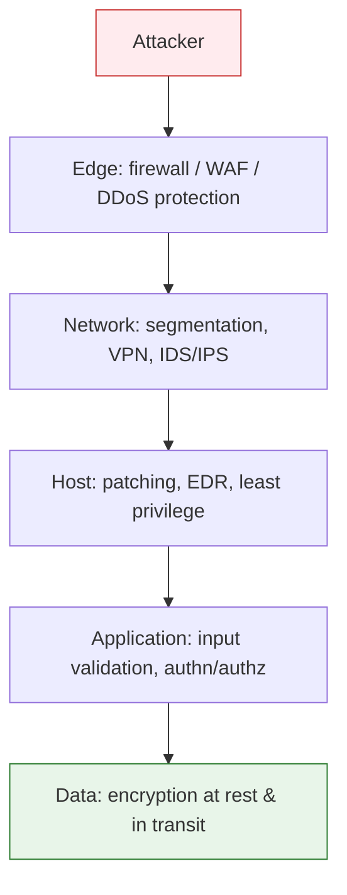

<div class="hero-section" style="background: linear-gradient(135deg, #4facfe 0%, #00f2fe 100%); color: white; padding: 3rem 2rem; margin: -2rem -3rem 2rem -3rem; text-align: center;">
  <h1 style="color: white; margin: 0; font-size: 2.5rem;">Attacks &amp; Network Defense</h1>
  <p style="font-size: 1.25rem; margin-top: 1rem; opacity: 0.9;">Firewalls, VPNs, and intrusion detection — and how attackers get past them</p>
</div>

<p class="breadcrumb"><a href="./">Cybersecurity</a> › Attacks &amp; Network Defense</p>

<div class="intro-card">
  <p class="lead-text">Defending a network means both building perimeter controls and understanding the adversary. This page covers network defenses (firewalls, VPNs, IDS), the advanced attack techniques that bypass them (social engineering, supply chain, ransomware), and the physical and ML-based attack vectors that target the edges of what software controls.</p>
</div>

## Network Security: Defending Your Digital Perimeter

Now that we understand how encryption protects data (see [Cryptography](cryptography.html)), let's explore how to defend against attacks on your networks and systems.

Effective security is layered — no single control is trusted to stop everything. This **defense-in-depth** model means an attacker who breaches one layer still faces the next:



### Firewalls: Your First Line of Defense

A firewall is like a security guard for your network, checking every packet of data that tries to enter or leave. But unlike a human guard, it makes decisions based on rules you define:

```bash
# Example: Block all incoming connections except web traffic
iptables -A INPUT -p tcp --dport 80 -j ACCEPT   # Allow HTTP
iptables -A INPUT -p tcp --dport 443 -j ACCEPT  # Allow HTTPS
iptables -A INPUT -j DROP                        # Block everything else

# Why this matters: Without these rules, anyone could connect
# to any service running on your computer
```

### The Evolution of Network Attacks

Attackers have become increasingly sophisticated. Here's how network attacks have evolved and how defenses have adapted:

#### 1. Simple Port Scanning → Stateful Firewalls
Early attackers would scan for open ports. Modern firewalls track connection states, allowing responses only to connections you initiated.

#### 2. Application Exploits → Deep Packet Inspection
Attackers started hiding malicious code in seemingly normal traffic. Next-generation firewalls inspect the actual content of packets, not just headers.

#### 3. Encrypted Attacks → SSL/TLS Inspection
As more traffic became encrypted, attackers hid behind HTTPS. Modern security appliances can decrypt, inspect, and re-encrypt traffic (with proper certificates).

### VPNs: Creating Secure Tunnels

When you connect to public WiFi, a VPN creates an encrypted tunnel to a trusted server. All your traffic flows through this tunnel, safe from prying eyes:

```python
# What happens without VPN:
# Your computer → [UNENCRYPTED] → Coffee shop WiFi → Internet
# Anyone on the same WiFi can see your traffic

# With VPN:
# Your computer → [ENCRYPTED TUNNEL] → VPN server → Internet
# Coffee shop WiFi only sees encrypted data
```

### Intrusion Detection: When Prevention Isn't Enough

Even the best defenses can be breached. Intrusion Detection Systems (IDS) act like security cameras, watching for suspicious behavior:

```python
# Example IDS rule detecting potential SQL injection
if "SELECT" in request and "UNION" in request:
    alert("Possible SQL injection attempt detected!")
    log_attack(source_ip, request_details)

# More sophisticated detection uses machine learning
# to identify anomalies in network behavior
```

## Zero Trust: Never Trust, Always Verify

The old model of "trust internal network, distrust external" is dead. Zero Trust assumes the network is already hostile and verifies every request on its own merits, regardless of where it originates — which is why it underpins modern cloud [IAM](application-and-cloud-security.html#iam-the-keys-to-your-kingdom) as well as network design.

```python
# Traditional security model
if request.source_ip in internal_network:
    allow(request)  # DANGEROUS!

# Zero Trust model
def handle_request(request):
    # Verify everything, every time
    if not verify_identity(request.user):
        return deny()

    if not verify_device(request.device):
        return deny()

    if not verify_location(request.location):
        return deny()

    if not verify_authorization(request.user, request.resource):
        return deny()

    # Continuous verification
    monitor_behavior(request)

    return allow()
```

## Advanced Attack Techniques: How Hackers Think

To defend effectively, you need to understand how attackers operate. Modern attacks go far beyond simple password guessing.

### Social Engineering: Hacking Humans

The weakest link in any security system is often the human element. Attackers know this:

**Phishing Evolution**:
1. **Basic**: "Your account is suspended! Click here!"
2. **Spear Phishing**: Targeted emails using personal information
3. **Whaling**: Targeting executives with sophisticated attacks
4. **Vishing**: Voice phishing over phone calls
5. **Smishing**: SMS-based phishing

**Defense**: Security awareness training and technical controls like email authentication (SPF, DKIM, DMARC).

**AI-Powered Attacks**:
- **Deepfake voice cloning**: CEO fraud using synthetic voices
- **AI-generated phishing**: Personalized at scale using LLMs
- **Business Email Compromise (BEC)**: $2.9 billion in losses (2023)
- **Defense**: AI-powered email security, behavioral analysis, voice authentication

### Supply Chain Attacks: Trusting the Untrustworthy

Why hack one company when you can hack a supplier and reach hundreds? The SolarWinds attack compromised 18,000 organizations through a single software update.

**Recent Supply Chain Attacks (2023-2024)**:
- **3CX**: Compromised software update affected 600,000+ companies
- **MOVEit**: SQL injection led to breaches at 1000+ organizations
- **PyPI/npm attacks**: Malicious packages targeting developers
- **xz Utils backdoor**: Near-miss that could have compromised Linux systems worldwide

```python
# How supply chain attacks work:
# 1. Attacker compromises software vendor
# 2. Malicious code inserted into legitimate update
# 3. Customers install "trusted" update
# 4. Attacker now has access to all customers

# Defense: Software composition analysis
import subprocess

# Check dependencies for known vulnerabilities
result = subprocess.run(['pip-audit'], capture_output=True)
if 'vulnerability' in result.stdout.decode():
    alert_security_team()
```

### Ransomware: The Digital Hostage Crisis

Ransomware encrypts your files and demands payment for the key. Modern ransomware is sophisticated:

1. **Initial Access**: Through phishing, RDP brute force, or exploits
2. **Reconnaissance**: Map the network, find valuable data
3. **Lateral Movement**: Spread to critical systems
4. **Data Exfiltration**: Steal data for "double extortion"
5. **Encryption**: Lock everything simultaneously
6. **Ransom Demand**: Pay or lose your data (and maybe have it leaked)

**Defense Strategy**:
```bash
# The 3-2-1 backup rule
# 3 copies of important data
# 2 different storage media
# 1 offsite backup

# Plus: Immutable backups that can't be encrypted
# Plus: Regular restore testing
# Plus: Network segmentation to limit spread
```

## Advanced Attack Vectors

### Side-Channel Attacks: The Invisible Threat

Some attacks don't target your code or network—they exploit the physical properties of computing. These "side channels" leak information through timing, power consumption, or electromagnetic radiation.

#### Timing Attacks: When Speed Kills Security

```python
# Vulnerable password check
def check_password_vulnerable(input_password, correct_password):
    if len(input_password) != len(correct_password):
        return False

    for i in range(len(input_password)):
        if input_password[i] != correct_password[i]:
            return False  # Returns immediately on first mismatch!
    return True

# Attack: Measure how long the function takes
# Longer execution = more characters correct
# Attacker can guess password one character at a time!

# Secure constant-time comparison
import hmac

def check_password_secure(input_password, correct_password):
    # Always compares all bytes, regardless of mismatches
    return hmac.compare_digest(input_password, correct_password)
```

#### Power Analysis: Reading Secrets from Power Lines

When your CPU processes different data, it uses different amounts of power. Attackers with physical access can measure these variations:

```python
# During RSA decryption, the CPU uses more power for '1' bits than '0' bits
# By measuring power consumption during decryption,
# attackers can recover the private key bit by bit!

# Defense: Power analysis countermeasures
def masked_multiplication(a, b):
    # Add random "mask" to hide real values
    mask = random.randint(1, 1000)
    masked_a = a ^ mask
    masked_b = b ^ mask
    # Perform operation on masked values
    result = complex_operation(masked_a, masked_b)
    # Remove mask from result
    return result ^ mask
```

### Machine Learning Under Attack

As AI becomes more prevalent, attackers have developed ways to fool machine learning models:

#### Adversarial Examples: Fooling AI

```python
# Add tiny, invisible changes to an image
# that completely fool an AI classifier

def create_adversarial_example(model, image, true_label):
    # Calculate gradient of loss with respect to input
    epsilon = 0.01  # Tiny perturbation

    # Fast Gradient Sign Method (FGSM)
    gradient = calculate_gradient(model, image, true_label)
    perturbation = epsilon * sign(gradient)

    # Add perturbation to image
    adversarial_image = image + perturbation

    # To human: looks identical
    # To AI: completely different!
    # "Stop sign" → "Speed limit 45"
    return adversarial_image
```

#### Model Stealing: Intellectual Property Theft

Attackers can steal a machine learning model by querying it:

```python
# Attacker queries your model API with carefully chosen inputs
# Uses responses to train their own copy of your model
# After enough queries, they have a functional clone!

# Defense: Rate limiting, anomaly detection, output perturbation
def protect_model_api(model, input_data):
    # Add small random noise to outputs
    prediction = model.predict(input_data)
    noise = random.normal(0, 0.01, prediction.shape)
    return prediction + noise
```

---

<div class="page-nav">
  <span class="page-nav-prev"><a href="application-and-cloud-security.html">← Web, Cloud &amp; Container Security</a></span>
  <span class="page-nav-next"><a href="operations-and-response.html">Operations, Response &amp; Compliance →</a></span>
</div>

## See Also

- [Operations, Response & Compliance](operations-and-response.html) — what to do once an attack succeeds
- [Web, Cloud & Container Security](application-and-cloud-security.html) — application-layer attacks and Zero Trust in IAM
- [Networking](../networking/) — the protocols and routing these defenses operate on
