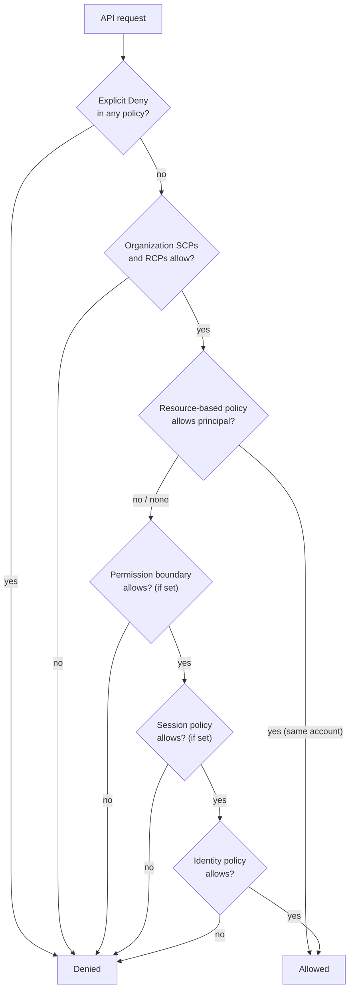
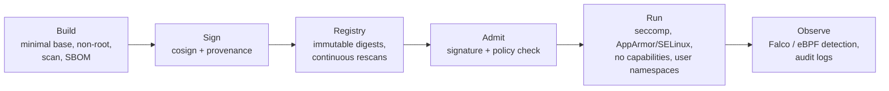
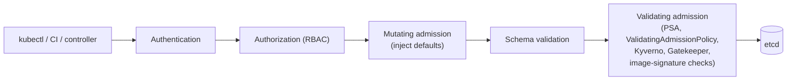

<p class="breadcrumb"><a href="./">Cybersecurity</a> › Cloud &amp; Container Security</p>

# Cloud & Container Security

**Cloud and container security** covers the controls that protect workloads running on infrastructure someone else operates. In the cloud the dominant breach vector moved from the network perimeter to **identity and configuration**: a public storage bucket, an over-permissive role, or a leaked long-lived key does more damage than most exploits. This page covers the shared-responsibility model, cloud IAM and workload identity, posture management (CSPM/CNAPP), container image hardening, runtime confinement and detection, and Kubernetes security including admission control with policy as code.

## Why misconfiguration dominates

Cloud providers' own infrastructure is rarely the weak link; the customer's configuration of it usually is. Resources are created by API call, often hundreds per day, by many engineers and automation pipelines. Any one of them can open a security group to `0.0.0.0/0`, attach `AdministratorAccess` to a CI role, or disable encryption. Because the control plane is reachable from the internet, **a valid credential is equivalent to network access** — no exploit is needed. Most of this page follows from that observation: minimize what each identity can do, eliminate long-lived secrets, and check configuration continuously and preventively.

## The shared-responsibility model

Providers secure the cloud itself ("security *of* the cloud"); customers secure what they put in it ("security *in* the cloud"). Where the line falls depends on the service model:

| Layer | On-prem | IaaS (EC2, Compute Engine) | Containers-as-a-service (EKS/GKE nodes you manage) | PaaS / serverless (RDS, Lambda) | SaaS (M365, Workspace) |
|-------|---------|------------------|---------------------|-----------------|-------------|
| Data, classification, retention | Customer | Customer | Customer | Customer | Customer |
| Identity and access | Customer | Customer | Customer | Customer | Customer |
| Application code and dependencies | Customer | Customer | Customer | Customer | Provider |
| Runtime, middleware, container images | Customer | Customer | Customer | Provider | Provider |
| Guest OS and patching | Customer | **Customer** | Shared (node images) | Provider | Provider |
| Network controls (security groups, firewalls) | Customer | Customer | Customer | Shared | Provider |
| Virtualization, hardware, facilities | Customer | Provider | Provider | Provider | Provider |

The two rows that never move to the provider — **data** and **identity** — are where most incidents originate. Outsourcing infrastructure never outsources the question of who can reach the data.

## IAM: The Keys to Your Kingdom

In a cloud account, identity *is* the perimeter. Identity and Access Management (IAM) determines which principals (users, roles, service accounts, workloads) may perform which actions on which resources, under which conditions.

**Least privilege** is the governing principle: start every identity at zero and grant narrowly, rather than granting broadly and trying to claw permissions back later. Provider tooling helps find the gap between granted and used permissions: AWS IAM Access Analyzer (unused-access findings and policy generation from CloudTrail activity), Google Cloud's IAM recommender, and Microsoft Entra access reviews.

### Policy evaluation

On AWS, a request is allowed only if every applicable policy layer permits it and none denies it. The layers act as successive filters:



This is a simplification (cross-account access requires *both* the identity and resource policy to allow it), but it captures the design: **guardrails set a ceiling, grants operate beneath it, and an explicit deny anywhere wins.**

- **Service control policies (SCPs)** cap what principals in member accounts may do — for example, "nobody may stop CloudTrail" or "no resources outside approved regions."
- **Resource control policies (RCPs)**, added in late 2024, cap what may be done *to* resources such as S3 buckets, KMS keys, and secrets, regardless of which principal asks — the natural home for an organization-wide "no access from outside our organization" rule.
- **Permission boundaries** cap what a single role can ever be granted, which makes it safe to let teams create their own roles.

### A worked example: bucket policies

The overly broad policy below grants every principal on the internet every S3 action on every object:

```json
{
  "Version": "2012-10-17",
  "Statement": [{
    "Effect": "Allow",
    "Principal": "*",
    "Action": "s3:*",
    "Resource": "arn:aws:s3:::my-bucket/*"
  }]
}
```

A least-privilege version names one role, one action, one prefix, and requires that requests arrive through the organization's VPC endpoint:

```json
{
  "Version": "2012-10-17",
  "Statement": [{
    "Effect": "Allow",
    "Principal": { "AWS": "arn:aws:iam::123456789012:role/ReportReader" },
    "Action": "s3:GetObject",
    "Resource": "arn:aws:s3:::my-bucket/reports/*",
    "Condition": {
      "StringEquals": { "aws:SourceVpce": "vpce-0a1b2c3d4e5f67890" }
    }
  }]
}
```

Provider defaults have improved: since April 2023, new S3 buckets have **Block Public Access** enabled and ACLs disabled by default, so the first policy above would be rejected unless someone deliberately turned those protections off. Enforce Block Public Access at the account or organization level so it cannot be undone per bucket.

### Workload identity and the metadata service

The most resilient pattern is to have **no long-lived credentials at all**. Instead of embedding an access key, attach an identity to the compute and let the platform mint short-lived credentials:

| Workload | Mechanism |
|----------|-----------|
| VM | AWS instance profile; GCP attached service account; Azure managed identity |
| Kubernetes pod | EKS Pod Identity or IRSA; GKE Workload Identity Federation; AKS Workload Identity |
| CI/CD pipeline | OIDC federation: the CI provider issues a signed token that the cloud exchanges for a role session (e.g. GitHub Actions → AWS `AssumeRoleWithWebIdentity`) |
| On-prem or other cloud | IAM Roles Anywhere (X.509), GCP/Azure workload identity federation |

A leaked session credential expires within hours at most; a leaked access key works until someone notices. Trust policies for federated roles must pin the token's subject (repository, branch, environment) — a trust policy that accepts any token from a CI provider lets any of that provider's customers assume the role.

On VMs, these credentials are served by the **instance metadata service** at `169.254.169.254`, which makes it the prime target of [SSRF](application-and-cloud-security.html#server-side-request-forgery-ssrf). On AWS, require **IMDSv2**, which demands a session token obtained with a `PUT` request and sets an IP hop limit, defeating simple SSRF and most forwarding tricks. Set IMDSv2-only as the account default and enforce it with an SCP condition (`ec2:MetadataHttpTokens`).

### Human access

- **Federate** humans through a single identity provider (SSO) instead of creating cloud-native users with passwords and keys.
- **Phishing-resistant MFA** (passkeys, security keys) on the identity provider and on any break-glass root credentials.
- **Just-in-time elevation** for administrative roles: time-boxed, approved, and logged, so there is no standing admin access to steal.
- **Zero Trust** principles apply to every request regardless of network origin; see [Attacks &amp; Network Defense](attacks-and-defense.html#zero-trust-never-trust-always-verify).

## Posture management

Least privilege is a goal; **posture management** continuously checks whether it is still being met. Cloud security products have converged into a few overlapping categories, typically sold together as a **cloud-native application protection platform (CNAPP)**:

| Category | Question it answers | Examples |
|----------|---------------------|----------|
| **CSPM** (cloud security posture management) | Is any resource misconfigured against a baseline (CIS Benchmarks, PCI DSS, SOC 2)? | AWS Security Hub, Google Security Command Center, Microsoft Defender for Cloud, Prowler |
| **CIEM** (cloud infrastructure entitlement management) | Which identities hold permissions they never use, or can escalate privilege? | Access Analyzer, commercial CNAPPs |
| **CWPP** (cloud workload protection) | Are running VMs, containers, and functions vulnerable or behaving maliciously? | Agent- or eBPF-based runtime sensors |
| **KSPM** | Are Kubernetes clusters configured safely? | kube-bench, Kubescape |
| **DSPM** (data security posture management) | Where does sensitive data live, and who can reach it? | Data discovery and classification tools |
| **IaC scanning** | Will this Terraform/CloudFormation/Helm change introduce a misconfiguration? | Checkov, Trivy (`trivy config`, which absorbed tfsec), KICS |

Typical CSPM findings: publicly readable buckets; roles with `*:*` or unused for 90 days; unencrypted volumes and snapshots; security groups exposing SSH (22) or RDP (3389) to the internet; audit logging (CloudTrail, Cloud Audit Logs) disabled or writable by the accounts it monitors.

Detection after deployment still leaves a window of exposure, so the strongest posture programs are **preventive**: scan infrastructure-as-code in CI and fail the build before `apply`.

```bash
# Scan Terraform in CI; a non-zero exit fails the pipeline
checkov -d ./terraform --compact --quiet
trivy config --severity HIGH,CRITICAL --exit-code 1 ./terraform
```

Organization-level guardrails (SCPs, RCPs, GCP organization policies, Azure Policy) are the other half of prevention: they make whole classes of misconfiguration impossible rather than merely detectable. The same "policy as code, enforced at the gate" idea reappears in Kubernetes [admission control](#admission-control-and-policy-as-code).

## Container security

A container is an ordinary Linux process isolated with namespaces and cgroups; it **shares the host kernel**. Container security therefore spans the whole lifecycle — what goes into the image, which images are allowed to run, what the running process may do, and what it is observed doing:



### Image hardening

Every binary in an image is both a potential vulnerability and a tool for an attacker who gets a shell. The guiding principle is minimalism.

| Practice | Why |
|----------|-----|
| Minimal or distroless base (`distroless`, Chainguard/Wolfi, Alpine, `scratch`) | No shell, package manager, or `curl` for an intruder; far fewer CVEs to triage |
| Pin by digest (`image@sha256:…`), not `:latest` | Reproducible builds; a tag can be moved, a digest cannot |
| Run as a non-root UID | Limits damage if the process is compromised or escapes |
| Multi-stage builds | Compilers and build tools never reach the runtime image |
| No secrets in layers | Anything `COPY`'d or `ENV`'d persists in image history; use BuildKit secret mounts |
| Scan in CI and continuously in the registry | New CVEs are disclosed against images that were clean when built |
| Generate an SBOM and sign the image | Answer "are we affected?" in minutes; admit only images your pipeline built |

```dockerfile
# Before: mutable tag, root user, extra packages
FROM ubuntu:latest
RUN apt-get update && apt-get install -y curl
COPY app /app
CMD ["/app"]

# After: pinned base, no recommended extras, cleaned cache, unprivileged user
FROM ubuntu:24.04
RUN apt-get update \
 && apt-get install -y --no-install-recommends ca-certificates \
 && rm -rf /var/lib/apt/lists/* \
 && useradd --uid 10001 --no-create-home appuser
COPY --chown=appuser:appuser app /app
USER 10001
CMD ["/app"]
```

For compiled languages, a multi-stage build ships only the binary:

```dockerfile
FROM golang:1.26 AS build
WORKDIR /src
COPY go.mod go.sum ./
RUN go mod download
COPY . .
RUN CGO_ENABLED=0 go build -trimpath -o /out/server ./cmd/server

FROM gcr.io/distroless/static-debian12:nonroot
COPY --from=build /out/server /server
USER nonroot:nonroot
ENTRYPOINT ["/server"]
```

```bash
# Fail the build on serious, fixable vulnerabilities
trivy image --severity HIGH,CRITICAL --ignore-unfixed --exit-code 1 registry.example/app:1.4.2

# Produce an SBOM for incident response
syft registry.example/app:1.4.2 -o spdx-json > app.spdx.json

# Keyless signing in CI (identity comes from the pipeline's OIDC token) ...
cosign sign --yes registry.example/app@sha256:<digest>

# ... and verification that pins *who* signed it
cosign verify \
  --certificate-identity-regexp '^https://github.com/example-org/app/' \
  --certificate-oidc-issuer https://token.actions.githubusercontent.com \
  registry.example/app@sha256:<digest>
```

SBOM formats, SLSA provenance, and the Sigstore components are covered in more depth under [supply-chain defense](attacks-and-defense.html#supply-chain-defense-knowing-and-trusting-what-you-ship).

### Runtime confinement

Hardening reduces what *can* go wrong; runtime controls limit what a running container is *allowed* to do. Because containers share a kernel, a kernel or runtime bug can become a host compromise — as with the 2024 "Leaky Vessels" runc flaw (CVE-2024-21626), where a leaked file descriptor let a container reach the host filesystem. Each layer below narrows the kernel surface available to such an exploit:

| Control | What it restricts | Notes |
|---------|-------------------|-------|
| **Linux capabilities** | Splits root's powers into ~40 units | Drop `ALL`; add back only what is needed (e.g. `NET_BIND_SERVICE`) |
| **seccomp** | Which system calls the process may make | Docker's default profile blocks several dozen rarely needed, dangerous syscalls (e.g. `kexec_load`, `init_module`, `open_by_handle_at`); Kubernetes applies it only when `RuntimeDefault` is set |
| **AppArmor** | File paths, capabilities, and network access, by profile | Path-based MAC; default on Debian/Ubuntu and SUSE. Configured via `securityContext.appArmorProfile` (GA since Kubernetes 1.30) |
| **SELinux** | Access between labeled processes and files | Label-based MAC; default on RHEL/Fedora and the basis of OpenShift container isolation |
| **User namespaces** | Maps container UID 0 to an unprivileged host UID | `hostUsers: false` in the pod spec; stable since Kubernetes 1.36. A process that escapes is not root on the host |
| **Read-only root filesystem** | Writes to the image | Prevents dropping tools or modifying binaries; mount `emptyDir` for scratch space |
| **Sandboxed runtimes** | The shared-kernel assumption itself | gVisor (user-space kernel) or Kata Containers (lightweight VM) for untrusted or multi-tenant code; see [Container Runtimes](../container-runtimes.html) |

```yaml
# Pod-level and container-level hardening in one manifest
apiVersion: v1
kind: Pod
metadata:
  name: api
spec:
  hostUsers: false                  # user namespace: root in pod != root on node
  automountServiceAccountToken: false
  securityContext:
    runAsNonRoot: true
    runAsUser: 10001
    seccompProfile:
      type: RuntimeDefault
    appArmorProfile:
      type: RuntimeDefault
  containers:
    - name: api
      image: registry.example/app@sha256:<digest>
      securityContext:
        allowPrivilegeEscalation: false
        readOnlyRootFilesystem: true
        capabilities:
          drop: ["ALL"]
```

### Runtime detection

Confinement prevents what policy anticipated; **detection** catches what it did not. **Falco** (a CNCF graduated project) observes system calls through an eBPF probe and evaluates them against rules such as "a shell started in a container," "a process read `/etc/shadow`," or "a container opened an unexpected outbound connection." Commercial CWPP sensors and other eBPF tools (Tetragon, Tracee) work similarly; Tetragon can also *enforce*, killing a process at the offending syscall.

```yaml
# Falco rule: interactive shell inside a container
- rule: Terminal shell in container
  desc: An interactive shell was spawned inside a container
  condition: >
    spawned_process and container
    and proc.name in (bash, sh, zsh, ash)
    and proc.tty != 0
  output: >
    Shell in container (user=%user.name container=%container.name
    image=%container.image.repository cmdline=%proc.cmdline)
  priority: WARNING
  tags: [container, shell, mitre_execution]
```

Detection is only useful if someone acts on it; route alerts to the SOC's pipeline (see [Security Operations](security-operations.html)).

## Kubernetes security

Kubernetes adds a powerful control plane: the API server schedules workloads, stores secrets, and grants access across the cluster. Compromising it, or any identity with broad rights on it, compromises every workload. The main control surfaces:

| Surface | Default | Hardened configuration |
|---------|---------|------------------------|
| **API access (RBAC)** | Whatever cluster roles you bind | Narrow `Role`s per namespace; no `cluster-admin` for workloads; watch for escalation verbs (`escalate`, `bind`, `impersonate`) and pod-creation rights, which imply access to any secret in the namespace |
| **Service-account tokens** | Projected, short-lived token mounted in every pod | `automountServiceAccountToken: false` unless the pod calls the API |
| **Network** | Every pod can reach every pod | Default-deny `NetworkPolicy` per namespace, then allow specific flows (requires a CNI that enforces policy) |
| **Secrets** | Base64-encoded in etcd, not encrypted | Encryption at rest with a KMS provider (KMS v2); or an external store via External Secrets Operator or the Secrets Store CSI driver |
| **Pod security** | No restrictions | Pod Security Admission: `restricted` for applications, `baseline` at minimum |
| **Audit** | Off unless configured | API audit policy shipped to the SIEM |
| **Nodes and control plane** | Varies by distribution | CIS Kubernetes Benchmark (kube-bench); private API endpoint; rotate certificates |

```yaml
# Default-deny ingress and egress for every pod in the namespace
apiVersion: networking.k8s.io/v1
kind: NetworkPolicy
metadata:
  name: default-deny
  namespace: payments
spec:
  podSelector: {}
  policyTypes: ["Ingress", "Egress"]
```

### Pod Security Standards

PodSecurityPolicy was removed in Kubernetes 1.25; its replacement is the built-in **Pod Security Admission** controller, which enforces three standard profiles per namespace via labels:

| Profile | Intent | Blocks, among others |
|---------|--------|----------------------|
| `privileged` | Unrestricted; system and infrastructure components only | Nothing |
| `baseline` | Prevent known privilege escalations with minimal friction | Privileged containers, host namespaces (`hostNetwork`, `hostPID`), `hostPath` volumes, added dangerous capabilities |
| `restricted` | Current pod-hardening best practice | Everything in baseline, plus running as root, privilege escalation, any capability other than `NET_BIND_SERVICE`, and a missing seccomp profile |

```yaml
apiVersion: v1
kind: Namespace
metadata:
  name: payments
  labels:
    pod-security.kubernetes.io/enforce: restricted
    pod-security.kubernetes.io/warn: restricted
```

### Admission control and policy as code

An **admission controller** runs after authentication and authorization but before the API server persists an object, and can reject or mutate it. Admission is the cluster's gate — the Kubernetes equivalent of IaC scanning — and policies written as code are version-controlled, reviewed, and tested like any other change.



The main options:

| Engine | Policy language | Characteristics |
|--------|-----------------|-----------------|
| **ValidatingAdmissionPolicy** | CEL, evaluated in the API server | Built in (GA since Kubernetes 1.30); no webhook to operate or fail. A mutating counterpart, MutatingAdmissionPolicy, is newer |
| **Kyverno** | Kubernetes-native resources; CEL-based `ValidatingPolicy`, `MutatingPolicy`, `GeneratingPolicy`, and `ImageValidatingPolicy` | Validates, mutates, generates resources, and verifies image signatures. Kyverno 1.19 (August 2026) made the CEL policy types the primary API and formally deprecated the older `ClusterPolicy` |
| **OPA Gatekeeper** | Rego (Open Policy Agent) | General-purpose engine also used for API authorization and Terraform checks; policies as `ConstraintTemplate`s plus `Constraint`s |
| **Sigstore policy-controller** | Image policy resources | Admits only images with valid signatures or attestations from specified identities |

A built-in ValidatingAdmissionPolicy that rejects privileged containers:

```yaml
apiVersion: admissionregistration.k8s.io/v1
kind: ValidatingAdmissionPolicy
metadata:
  name: disallow-privileged
spec:
  failurePolicy: Fail
  matchConstraints:
    resourceRules:
      - apiGroups: [""]
        apiVersions: ["v1"]
        operations: ["CREATE", "UPDATE"]
        resources: ["pods"]
  validations:
    - expression: >-
        object.spec.containers.all(c,
          !c.?securityContext.?privileged.orValue(false))
      message: "Privileged containers are not allowed."
---
apiVersion: admissionregistration.k8s.io/v1
kind: ValidatingAdmissionPolicyBinding
metadata:
  name: disallow-privileged
spec:
  policyName: disallow-privileged
  validationActions: ["Deny"]
```

The same rule as a Kyverno `ValidatingPolicy`, which uses the same CEL but adds Kyverno features such as background scanning of existing resources and policy reports:

```yaml
apiVersion: policies.kyverno.io/v1
kind: ValidatingPolicy
metadata:
  name: disallow-privileged
spec:
  validationActions: ["Deny"]
  matchConstraints:
    resourceRules:
      - apiGroups: [""]
        apiVersions: ["v1"]
        operations: ["CREATE", "UPDATE"]
        resources: ["pods"]
  validations:
    - expression: >-
        object.spec.containers.all(c,
          !c.?securityContext.?privileged.orValue(false))
      message: "Privileged containers are not allowed."
```

In production, extend the check to `initContainers` and `ephemeralContainers`, and roll new policies out in audit or warn mode before switching to deny. With admission policy in place, a privileged pod is rejected whether it came from an honest mistake or a compromised CI credential. Combined with image scanning and signing, runtime confinement, and detection, the cluster has a control at every stage: what is built, what is admitted, what runs, and what is observed.

---

<div class="page-nav">
  <span class="page-nav-prev"><a href="application-and-cloud-security.html">← Application Security</a></span>
  <span class="page-nav-next"><a href="attacks-and-defense.html">Attacks &amp; Network Defense →</a></span>
</div>

## See also

- [Application Security](application-and-cloud-security.html) — injection, XSS, SSRF, authentication, OAuth, and JWTs
- [Cryptography](cryptography.html) — the primitives behind image signing and secrets at rest
- [Attacks &amp; Network Defense](attacks-and-defense.html) — Zero Trust, supply-chain attacks, SBOM/SLSA/Sigstore
- [Security Operations &amp; Response](operations-and-response.html) — acting on runtime alerts
- [AWS Security](../aws/security.html) — IAM, encryption, and detection on AWS specifically
- [Docker Storage &amp; Security](../docker/storage-security.html) — container fundamentals and Docker-level hardening
- [Kubernetes](../kubernetes/) — cluster architecture and operations
- [Container Runtimes](../container-runtimes.html) — runc, containerd, gVisor, Kata, and isolation trade-offs
- [CI/CD Security and Operations](../ci-cd/security-and-operations.html) — securing the pipeline that builds images
