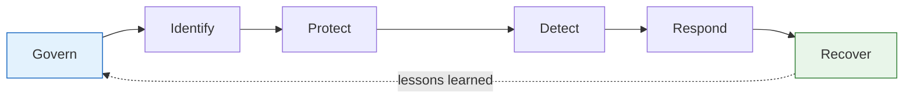
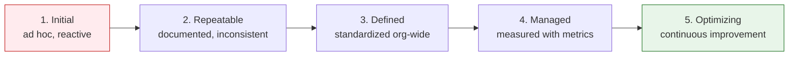

<div class="hero-section" style="background: linear-gradient(135deg, #4facfe 0%, #00f2fe 100%); color: white; padding: 3rem 2rem; margin: -2rem -3rem 2rem -3rem; text-align: center;">
  <h1 style="color: white; margin: 0; font-size: 2.5rem;">Compliance &amp; Governance</h1>
  <p style="font-size: 1.25rem; margin-top: 1rem; opacity: 0.9;">Turning security from a project into a program — frameworks, risk, people, and metrics</p>
</div>

<p class="breadcrumb"><a href="./">Cybersecurity</a> › Compliance &amp; Governance</p>

<div class="intro-card">
  <p class="lead-text">Technology controls are necessary but not sufficient. A durable security posture needs governance: legal obligations that give security teeth (GDPR, PCI DSS), attestation frameworks that prove diligence to customers (SOC 2, ISO 27001), a repeatable way to identify and prioritize risk, a culture that treats people as a defense rather than a liability, and metrics that show whether any of it is working. This page covers how to build security as an ongoing program rather than a one-time fix.</p>
</div>

## Compliance: Security With Legal Teeth

Compliance isn't just bureaucracy—it's security with consequences. Two things make compliance worth understanding even if you never sign an audit report. First, it codifies a baseline: a regulator or standards body has already decided what "reasonable" looks like, so you don't have to argue it from scratch. Second, it shifts incentives—non-compliance carries fines, lost contracts, and personal liability for executives, which is often what finally funds a security program. Understanding the major frameworks helps you build better security regardless of whether you're formally in scope.

A useful mental model is to separate **regulations** (laws you must obey if you handle certain data: GDPR, HIPAA, PCI DSS) from **attestation frameworks** (voluntary standards you adopt and get audited against to prove diligence: SOC 2, ISO 27001). Regulations are imposed on you; attestations are sought by you, usually because customers demand them before they'll trust you with their data.

### GDPR: Privacy as a Human Right

The EU's General Data Protection Regulation (in force since May 2018) changed how the world thinks about personal data. Its central premise is that personal data belongs to the individual ("data subject"), not to the company that collects it, and that processing it requires a lawful basis and a defined purpose.

**Core principles** (Article 5): lawfulness and transparency, purpose limitation, data minimization, accuracy, storage limitation, integrity and confidentiality, and accountability. The last one—accountability—means you must be able to *demonstrate* compliance, not merely assert it.

**Key data-subject rights** that drive engineering requirements:

- **Right of access** — a user can demand a copy of everything you hold about them.
- **Right to erasure** ("right to be forgotten") — a user can demand deletion, which means your architecture must be able to actually find and remove all of one person's data.
- **Right to data portability** — export in a machine-readable format.
- **Right to object / restrict processing** — e.g. opt out of profiling.

**Breach notification** is the operational sting: a personal-data breach must be reported to the supervisory authority within **72 hours** of becoming aware of it, and affected individuals must be told if the breach poses a high risk to their rights. Fines reach up to **€20 million or 4% of global annual turnover**, whichever is higher.

**Global privacy landscape** — GDPR was the template; the rest of the world followed:

- **EU**: cumulative GDPR fines have exceeded €4 billion.
- **US**: state laws proliferating (California's CCPA/CPRA, Virginia's VCDPA, Colorado, and others) — there is still no single federal privacy law.
- **India**: the Digital Personal Data Protection (DPDP) Act 2023 is being implemented.
- **China**: PIPL (Personal Information Protection Law) enforcement is increasing, with strict data-localization and cross-border transfer rules.
- **AI-specific**: the EU AI Act (2024) layers risk-tiered obligations on top of GDPR for systems that process personal data.

GDPR's "privacy by design and by default" requirement (Article 25) means privacy controls belong in the design phase, not bolted on later:

```python
# GDPR requires "privacy by design"
class UserDataHandler:
    def __init__(self):
        self.purpose_limitation = True  # Only use data for stated purpose
        self.data_minimization = True   # Collect minimum necessary
        self.retention_limit = 90       # Delete after 90 days

    def collect_user_data(self, user):
        # Must have a lawful basis — for marketing, that's explicit consent
        if not user.has_consented():
            raise GDPRViolation("No consent for data collection")

        # Right to be forgotten
        if user.requests_deletion():
            self.delete_all_user_data(user)
            self.log_deletion(user)  # Prove compliance (accountability principle)

    def data_breach_notification(self):
        # Must notify the supervisory authority within 72 hours!
        notify_authorities()
        if high_risk_to_individuals():
            notify_affected_users()
```

### PCI DSS: Protecting Payment Cards

If you store, process, or transmit credit card data, the Payment Card Industry Data Security Standard (PCI DSS) isn't optional—it's contractually mandated by the card brands (Visa, Mastercard, etc.). Unlike GDPR it's not a law, but failing it can mean losing the ability to accept cards at all, plus per-record fines after a breach.

PCI DSS v4.0 organizes its requirements into **six goals** and twelve top-level requirements:

| Goal | Requirements |
|------|--------------|
| Build and maintain a secure network | Firewalls; no vendor-default passwords |
| Protect cardholder data | Protect stored data; encrypt data in transit |
| Maintain a vulnerability program | Anti-malware; secure systems and software |
| Implement strong access control | Need-to-know access; unique IDs; physical access control |
| Monitor and test networks | Log and monitor access; test security regularly |
| Maintain an information security policy | Maintain a policy addressing security for all personnel |

The single biggest risk-reducer in PCI is **scope reduction**: the fewer systems that touch card data, the smaller and cheaper your compliance burden. **Tokenization** (replacing the card number with a meaningless token) and using a PCI-compliant payment processor so card data never lands in your systems are the standard moves.

```python
# PCI DSS Requirement 3: Protect stored cardholder data
# NEVER store (Requirement 3.2):
# - Full magnetic stripe data
# - CVV/CVC (the 3-digit code)
# - PIN / PIN block

# If you must store the Primary Account Number (PAN):
def store_card_number(card_number):
    # Requirement 3.4: Render PAN unreadable wherever it is stored.
    # Display masking: show only first 6 and last 4 digits.
    masked = card_number[:6] + "*" * (len(card_number) - 10) + card_number[-4:]

    # Encrypt the full number (strong cryptography + proper key management)
    encrypted = strong_encryption(card_number)

    # Store with restricted, need-to-know access
    store_with_access_control(encrypted, access_level="PCI_AUTHORIZED_ONLY")

# Better still: tokenize so the real PAN never sits in your database.
def tokenize_card(card_number):
    # The processor stores the PAN; you store an opaque token that is
    # useless if stolen and takes those systems out of PCI scope.
    return payment_processor.tokenize(card_number)
```

### SOC 2 and ISO 27001: Proving You're Trustworthy

GDPR and PCI tell you what you *must* do. SOC 2 and ISO 27001 are how you *prove to a customer* that you have your house in order—the attestations a B2B buyer's procurement team asks for before signing.

**SOC 2** (Service Organization Control 2), defined by the AICPA, evaluates a service provider's controls against the five **Trust Services Criteria**:

- **Security** (the only mandatory one — sometimes called the "common criteria")
- **Availability**
- **Processing Integrity**
- **Confidentiality**
- **Privacy**

A **Type I** report assesses whether controls are *designed* correctly at a point in time; a **Type II** report assesses whether they *operated effectively* over a period (typically 3–12 months) and is the one buyers actually trust. SOC 2 is prescriptive about *what to evaluate* but lets you choose *how* to meet each criterion, so the report is paired with auditor narrative describing your specific controls.

**ISO/IEC 27001** is the international standard for an **Information Security Management System (ISMS)**. Where SOC 2 is an attestation report, ISO 27001 is a *certification* you earn from an accredited body. Its defining ideas:

- A **risk-based** ISMS: you identify risks, choose controls to treat them, and document the choices in a **Statement of Applicability**.
- **Annex A** provides a catalog of controls (93 controls in the 2022 revision, grouped into Organizational, People, Physical, and Technological themes) that you select from based on your risk assessment.
- A continual-improvement loop (Plan-Do-Check-Act) with internal audits and management review, recertified on a three-year cycle with annual surveillance audits.

| Aspect | SOC 2 | ISO 27001 |
|--------|-------|-----------|
| Type | Attestation report | Certification |
| Authority | AICPA (US-centric) | ISO/IEC (international) |
| Output | Auditor's report (Type I/II) | Certificate + audit reports |
| Structure | 5 Trust Services Criteria | ISMS + Annex A controls |
| Validity | Point-in-time / period covered | 3-year cycle + annual surveillance |

These overlap heavily, so a common strategy is to build one set of controls and evidence and map it to both frameworks (and to PCI/GDPR where relevant) rather than running parallel programs. That mapping discipline is the heart of "compliance as a byproduct of good security" rather than the other way around.

## Building a Security Program

Knowing the theory is one thing—implementing it is another. A security *program* is the organizational machinery that turns one-off controls into a sustained, improving practice. It rests on three pillars: a governance structure (who owns risk, who approves exceptions, who reports to the board), a risk-management process (covered next), and an operational backbone (policies, training, and metrics).

A widely used scaffolding is the **NIST Cybersecurity Framework (CSF 2.0)**, which organizes everything a program does into six functions:



- **Govern** — risk strategy, roles, policy, oversight (added in CSF 2.0).
- **Identify** — know your assets, data, and risks.
- **Protect** — implement safeguards.
- **Detect** — find events as they happen ([covered in Operations](operations-and-response.html)).
- **Respond** — act on incidents ([Operations](operations-and-response.html)).
- **Recover** — restore and learn.

Compliance with GDPR/PCI/SOC 2 maps neatly onto these functions, which is why a framework-driven program produces audit evidence almost for free.

### Start with Risk Assessment

You cannot protect everything equally, so the program starts by deciding what matters most. Risk assessment answers three questions for each asset: what threatens it, how exposed is it, and what happens if it's compromised.

```python
def assess_security_risks():
    risks = []

    # What are your crown jewels?
    critical_assets = identify_critical_assets()
    # Customer data? Source code? Trade secrets?

    for asset in critical_assets:
        # What threatens this asset?
        threats = identify_threats(asset)
        # Hackers? Insiders? Natural disasters?

        # How vulnerable are you?
        vulnerabilities = assess_vulnerabilities(asset)
        # Unpatched systems? Weak passwords? No backups?

        # What's the impact if compromised?
        impact = calculate_impact(asset)
        # Financial loss? Reputation damage? Legal liability?

        risk_score = threats * vulnerabilities * impact
        risks.append((asset, risk_score))

    # Focus on highest risks first
    return sorted(risks, key=lambda x: x[1], reverse=True)
```

### Risk Management: Quantifying and Treating Risk

The toy `threats * vulnerabilities * impact` formula above is fine for prioritization, but a mature program needs a defensible, repeatable method. The standard decomposition expresses risk as the product of how often a bad thing happens and how much it costs when it does:

$$ \text{Annualized Loss Expectancy} = \text{ALE} = \text{SLE} \times \text{ARO} $$

where the **Single Loss Expectancy** is the cost of one occurrence and the **Annualized Rate of Occurrence** is how many times per year you expect it:

$$ \text{SLE} = \text{Asset Value} \times \text{Exposure Factor} $$

The **Exposure Factor** is the fraction of the asset's value lost in a single event (0 to 1). A control is economically justified when it reduces ALE by more than it costs to run:

$$ \text{Control Value} = (\text{ALE}_{\text{before}} - \text{ALE}_{\text{after}}) - \text{Annual Cost of Control} $$

**Worked example.** A customer database is valued at \$5,000,000. A ransomware event would render it unusable, so the exposure factor is 0.8, giving an SLE of \$4,000,000. Historically you assess such an event as occurring roughly once every 10 years, so ARO = 0.1 and the annualized loss expectancy is:

$$ \text{ALE}_{\text{before}} = 4{,}000{,}000 \times 0.1 = 400{,}000 \text{ per year} $$

You're considering immutable backups plus endpoint detection that you believe drops the rate to once every 50 years (ARO = 0.02) and the controls cost \$120,000 per year to operate:

$$ \text{ALE}_{\text{after}} = 4{,}000{,}000 \times 0.02 = 80{,}000 \text{ per year} $$

$$ \text{Control Value} = (400{,}000 - 80{,}000) - 120{,}000 = 200{,}000 \text{ per year} $$

The control yields \$200,000 of net annual risk reduction, so it's justified. This is **quantitative** risk analysis. In practice the probabilities are uncertain, so many teams supplement it with **qualitative** analysis—plotting likelihood against impact on a 5×5 matrix and using the result to rank, not to compute exact dollars.

Once a risk is understood, you choose one of four **treatment** strategies:

| Strategy | Meaning | Example |
|----------|---------|---------|
| **Mitigate** | Reduce likelihood or impact with controls | Add MFA, patch faster, encrypt backups |
| **Transfer** | Shift the cost to a third party | Buy cyber-insurance; use a PCI-compliant processor |
| **Avoid** | Stop doing the risky activity | Don't store data you don't need |
| **Accept** | Knowingly tolerate the residual risk | Document and sign off on a low, expensive-to-fix risk |

The output is a **risk register**: a living list of risks with owners, scores, chosen treatments, and review dates. Accepting a risk is a legitimate choice, but it must be an explicit, documented decision by someone with the authority to own the consequences—never an accident.

### Security Awareness: Your Human Firewall

The best security technology can't protect against a user who clicks every link. Phishing and social engineering remain a leading cause of breaches precisely because they bypass technical controls and target the human.

```python
class SecurityAwarenessProgram:
    def __init__(self):
        self.training_modules = [
            "Recognizing Phishing",
            "Password Security",
            "Physical Security",
            "Social Engineering",
            "Incident Reporting"
        ]

    def conduct_phishing_test(self):
        # Send a harmless simulated phishing email to employees
        results = send_test_phishing_campaign()

        for employee in results.clicked_link:
            # Don't punish—educate! Just-in-time training works best.
            provide_immediate_training(employee)

        # Track improvement over time (click rate should fall)
        self.metrics.record(results)

    def gamify_security(self):
        # Make security engaging rather than a compliance chore
        return {
            "Security Champion badges",
            "Spot the Phish contests",
            "Capture the Flag events",
            "Security escape rooms"
        }
```

The crucial principle is **blameless education over punishment**. If clicking a simulated phish results in public shaming, employees learn to hide mistakes—including the real breach they cause—rather than report them quickly. Fast reporting is worth far more than a perfect click rate.

### The Human Element

Technology alone can't secure your systems. Culture determines whether your controls are used as intended or routinely worked around. Two organizations with identical tooling can have wildly different real-world security depending on whether people see security as their job or as the security team's obstacle course.

```python
# Security culture indicators — leading signals that culture is healthy
class SecurityCulture:
    def measure_culture_health(self):
        return {
            "password_manager_adoption": "85%",
            "phishing_report_rate": "high",
            "security_champion_volunteers": "growing",
            "shadow_it_usage": "declining",
            "incident_reporting_time": "< 1 hour average"
        }

    def build_security_culture(self):
        # Make security everyone's responsibility
        initiatives = [
            "Executive support and visible commitment",
            "Regular security awareness training",
            "Reward security-conscious behavior",
            "Blameless post-mortems for incidents",
            "Security champions in each team",
            "Make the secure path the easy path"
        ]
        return initiatives
```

The single most effective cultural lever is the last one: **make the secure path the easy path**. If using the password manager, the approved cloud account, or the hardened CI pipeline is *easier* than the insecure workaround, security happens by default. When it's harder, you're relying on willpower, and willpower loses at scale—people reach for unsanctioned tools ("shadow IT") to get their jobs done.

## Measuring Success: KPIs and Maturity

"You can't manage what you can't measure" applies sharply to security, but the field is littered with vanity metrics (number of attacks blocked, number of training sessions held) that look impressive and tell you nothing about risk. Good security metrics are **outcome-oriented**, tied to risk reduction, and trended over time rather than reported as a single snapshot.

### Operational KPIs

The most actionable metrics measure how fast you find and fix problems, because dwell time correlates directly with damage:

| Metric | What it tells you | Goal |
|--------|-------------------|------|
| **MTTD** (Mean Time to Detect) | How long attackers go unnoticed | Lower |
| **MTTR** (Mean Time to Respond/Remediate) | How fast you contain once detected | Lower |
| **Mean time to patch** | Window of exposure for known vulns | Lower |
| **% critical vulns remediated in SLA** | Whether the vuln program actually works | Higher (→100%) |
| **Phishing simulation click rate** | Human-firewall resilience | Lower, trending down |
| **% systems with EDR / MFA coverage** | Control coverage gaps | Higher (→100%) |
| **Patch latency for criticals** | Speed of the protect function | Days, not months |

A complementary financial view ties these back to risk: track the **residual ALE** across your risk register over time. If the program is working, total residual annualized loss expectancy should trend down even as the business (and its attack surface) grows.

### Security Maturity Models

KPIs tell you how today's controls are performing; a **maturity model** tells you how capable your program is as a whole, and gives a roadmap for where to invest next. A simple, widely used five-level scale (derived from CMMI) is:



- **Level 1 — Initial**: security is ad hoc and depends on individual heroics. Success isn't repeatable.
- **Level 2 — Repeatable**: basic processes exist and are followed, but they're not documented or consistent across teams.
- **Level 3 — Defined**: processes are documented, standardized, and applied organization-wide.
- **Level 4 — Managed**: the program is measured—the KPIs above drive decisions, not gut feel.
- **Level 5 — Optimizing**: continuous improvement is built in; the organization proactively refines controls based on data and threat intelligence.

The point of a maturity model isn't to reach Level 5 everywhere—that's rarely cost-justified—but to make a *deliberate* choice about the target level for each capability based on the risk it addresses. A startup might rationally sit at Level 2 for physical security while pushing to Level 4 for its software supply chain. Frameworks like the **NIST CSF** and **CMMC** (for US defense contractors) provide more detailed, domain-specific maturity tiers when a generic five-level scale isn't granular enough.

---

<div class="page-nav">
  <span class="page-nav-prev"><a href="operations-and-response.html">← Operations &amp; Response</a></span>
  <span class="page-nav-next"><a href="./">Back to Cybersecurity Hub →</a></span>
</div>

## See Also

- [Operations, Response & Compliance](operations-and-response.html) — incident response, SIEM, and the day-to-day security operations a program governs
- [Attacks & Network Defense](attacks-and-defense.html) — the threats your risk register is defending against
- [Web, Cloud & Container Security](application-and-cloud-security.html) — the technical controls that mitigate the risks identified here
- [Cryptography](cryptography.html) — the encryption GDPR and PCI DSS require for protecting data
