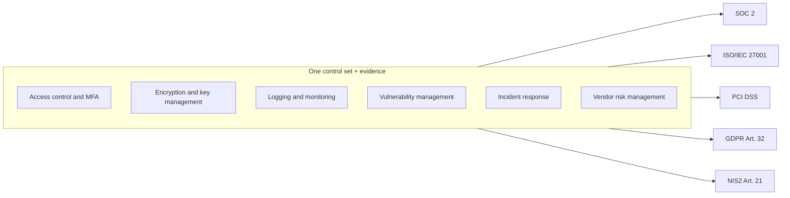
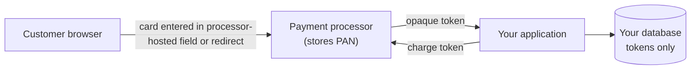
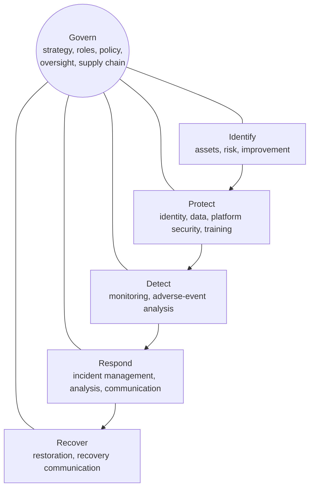
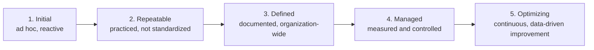

<p class="breadcrumb"><a href="./">Cybersecurity</a> › Compliance &amp; Governance</p>

# Compliance & Governance

**Security governance** is the organizational machinery that decides which risks matter, who owns them, and how controls are chosen, funded, and verified; **compliance** is the subset of that work driven by external obligations — laws, contracts, and certification schemes. This page covers the regulatory landscape (privacy law, sector and cyber-specific regulation, PCI DSS), attestation frameworks (SOC 2, ISO/IEC 27001), program frameworks (NIST CSF 2.0, CIS Controls), quantitative and qualitative risk management, third-party risk, the human side of security, and the metrics and maturity models used to show whether a program works. The engineering side of privacy law is covered in [Privacy Engineering](privacy-engineering.html).

## Regulations, Standards, and Frameworks

Compliance obligations come in four kinds, and confusing them causes both over- and under-investment:

| Kind | Imposed by | Examples | Consequence of failure |
|------|-----------|----------|------------------------|
| **Regulation** | Law, for anyone in scope | GDPR, NIS2, DORA, HIPAA, SEC disclosure rules | Fines, enforcement orders, personal liability for executives |
| **Contractual standard** | Commercial agreements | PCI DSS (card brands), customer security addenda | Loss of the ability to process cards, lost contracts, breach-related fines |
| **Voluntary attestation or certification** | Chosen by the organization, usually because customers demand it | SOC 2, ISO/IEC 27001, CSA STAR, FedRAMP (for US federal sales) | Lost deals; no direct legal penalty |
| **Program framework** | Adopted as internal scaffolding | NIST CSF 2.0, CIS Controls, NIST SP 800-53 | None directly — they organize the work that satisfies everything above |

These overlap heavily. The efficient approach is a single **control set** with shared evidence, mapped to every obligation in scope, rather than one parallel program per framework:



Compliance is a floor, not a measure of security: organizations with clean audit reports are breached routinely. The goal is for compliance to be a **by-product** of a risk-driven program, not the program's purpose.

## Privacy Regulation

### GDPR

The EU General Data Protection Regulation (applicable since May 2018; mirrored in the UK GDPR) treats personal data as belonging to the individual. Processing requires one of six **lawful bases** (consent, contract, legal obligation, vital interests, public task, or legitimate interests) and a defined purpose.

- **Principles (Article 5)**: lawfulness, fairness and transparency; purpose limitation; data minimization; accuracy; storage limitation; integrity and confidentiality; and **accountability** — the controller must be able to *demonstrate* compliance, which in practice means records of processing, data protection impact assessments (DPIAs), and documented decisions.
- **Data-subject rights**: access, rectification, erasure, restriction, portability, and objection (including to profiling). Each is an engineering requirement: you cannot honor an erasure request if you cannot find all of a person's data.
- **Security of processing (Article 32)**: "appropriate technical and organisational measures", explicitly naming encryption and pseudonymization.
- **Privacy by design and by default (Article 25)**: protections belong in the design, and the most protective setting must be the default.
- **Breach notification**: to the supervisory authority within **72 hours** of becoming aware of a personal-data breach, and to affected individuals without undue delay when the risk to them is high (see [Incident Response](incident-response.html#regulatory-notification-deadlines)).
- **International transfers**: data leaving the EU needs an adequacy decision (e.g. the 2023 EU–US Data Privacy Framework), standard contractual clauses, or binding corporate rules.
- **Penalties**: up to **€20 million or 4% of worldwide annual turnover**, whichever is higher. Cumulative fines passed €5 billion by 2025; the largest single fine remains €1.2 billion against Meta (2023) for EU–US data transfers.

### The Global Privacy Landscape

| Jurisdiction | Law | Notes |
|--------------|-----|-------|
| EU / UK | GDPR / UK GDPR | The template for most later laws |
| United States | No comprehensive federal law | Roughly twenty state laws (California CCPA/CPRA, Virginia, Colorado, Texas, and others) plus sector laws: HIPAA (health), GLBA (finance), COPPA (children) |
| China | PIPL (2021) | Consent-centric; data localization and security assessments for cross-border transfers |
| India | DPDP Act (2023) | Implementing rules notified in November 2025, with obligations phased in over the following 18 months |
| Brazil | LGPD (2020) | Closely modeled on GDPR |

### AI Regulation

The **EU AI Act** entered into force in August 2024 with obligations phased in by risk tier: prohibited practices from February 2025, general-purpose AI model obligations from August 2025, and most high-risk-system obligations scheduled for August 2026 onward, although the European Commission has proposed delaying parts of the high-risk regime. It applies alongside GDPR wherever AI systems process personal data. **ISO/IEC 42001** (2023) provides a certifiable AI management system standard analogous to ISO 27001, and the **NIST AI Risk Management Framework** is the common voluntary reference in the US.

## Cybersecurity Regulation

A newer wave of regulation targets security directly rather than through privacy, and increasingly makes **boards and senior management personally accountable**.

| Regulation | Scope | Key obligations |
|------------|-------|-----------------|
| **NIS2 Directive** (EU; member-state transposition deadline October 2024) | "Essential" and "important" entities across 18 sectors (energy, transport, health, digital infrastructure, ICT service providers, manufacturing, and more) | Risk-management measures (Art. 21) including supply-chain security; 24-hour early warning and 72-hour incident notification; management bodies must approve measures and receive training, and can be held liable |
| **DORA** (EU; applies from 17 January 2025) | Banks, insurers, investment firms, and their critical ICT providers | ICT risk management, major-incident reporting, resilience testing including threat-led penetration testing, and oversight of critical third-party ICT providers |
| **Cyber Resilience Act** (EU; in force December 2024) | Manufacturers of hardware and software products with digital elements sold in the EU | Vulnerability and incident reporting from **11 September 2026**; secure-by-design requirements, vulnerability handling, security updates for the support period, and SBOMs from December 2027 |
| **SEC cybersecurity disclosure rules** (US, from December 2023) | US-listed public companies | Disclose material incidents on Form 8-K within four business days of determining materiality; describe risk management, strategy, and governance annually in Form 10-K |
| **HIPAA Security Rule** (US) | Healthcare providers, plans, clearinghouses, and their business associates | Administrative, physical, and technical safeguards for electronic protected health information; risk analysis; breach notification |
| **CMMC 2.0** (US; phased into DoD contracts from November 2025) | Defense contractors handling Federal Contract Information or Controlled Unclassified Information | Three levels: Level 1 (basic safeguarding, self-assessed), Level 2 (the 110 requirements of NIST SP 800-171, mostly third-party assessed), Level 3 (adds selected SP 800-172 requirements, government-assessed) |

## PCI DSS: Protecting Payment Card Data

Any organization that stores, processes, or transmits payment card data must comply with the **Payment Card Industry Data Security Standard**, a contractual requirement enforced by the card brands through acquiring banks. It is not a law, but non-compliance can mean fines, higher processing fees, and ultimately losing the ability to accept cards.

**Version status.** PCI DSS v3.2.1 was retired in March 2024 and v4.0 at the end of 2024; **v4.0.1** (June 2024, a clarification release) is current. The 51 "future-dated" v4.0 requirements became mandatory on **31 March 2025**, so the full v4 standard is now in force.

The standard has six goals and twelve principal requirements:

| Goal | Principal requirements |
|------|------------------------|
| Build and maintain a secure network and systems | 1. Network security controls · 2. Secure configurations |
| Protect account data | 3. Protect stored account data · 4. Strong cryptography in transit over open networks |
| Maintain a vulnerability management program | 5. Anti-malware · 6. Secure systems and software |
| Implement strong access control | 7. Need-to-know access · 8. Identify users and authenticate · 9. Physical access |
| Regularly monitor and test networks | 10. Log and monitor all access · 11. Test security regularly |
| Maintain an information security policy | 12. Organizational policies and programs |

Notable changes in v4:

- **MFA for all access** into the cardholder data environment, not just remote and administrative access (Req. 8.4.2).
- **Payment-page script integrity**: inventory, authorize, and monitor every script on payment pages, and detect unauthorized changes to them (Req. 6.4.3 and 11.6.1) — a direct response to Magecart-style web skimming.
- **Targeted risk analyses** that let organizations set the frequency of some controls themselves, and a **customized approach** that allows alternative controls meeting a requirement's stated objective.
- Stronger password requirements (12 characters minimum) and automated log review.

### Scope Reduction

The most effective PCI strategy is to keep card data out of your systems, because every system that stores, processes, or transmits it — or can connect to one that does — is in scope.



With hosted payment fields or a redirect, the primary account number (PAN) never touches your servers, which can reduce the assessment to the shortest self-assessment questionnaire (SAQ A). Tokens are useless outside the processor, so a stolen token database does not expose card numbers.

When PAN must be stored, v4 requires:

```python
# PCI DSS v4.0.1, Requirement 3 — illustrative only.
#
# 3.3.1  Sensitive authentication data (full track data, CVV2/CVC2, PIN/PIN
#        block) must NOT be retained after authorization, even encrypted.
# 3.4.1  PAN is masked when displayed: at most the BIN (first 6 or 8 digits)
#        and the last 4 digits are visible, and only to roles that need more.
# 3.5.1  PAN is rendered unreadable wherever it is stored: strong
#        cryptography with managed keys, truncation, index tokens, or
#        keyed cryptographic hashes of the entire PAN.

def mask_pan(pan: str) -> str:
    return pan[:6] + "*" * (len(pan) - 10) + pan[-4:]

def store_pan(pan: str) -> None:
    ciphertext = kms_encrypt(key_id="pan-key", plaintext=pan.encode())  # key in KMS/HSM
    db.insert("cards", pan_encrypted=ciphertext, pan_display=mask_pan(pan))
```

## Attestation: SOC 2 and ISO/IEC 27001

Regulations say what you must do; attestations are how you **prove to customers** that you do it. Enterprise procurement typically asks for a SOC 2 Type II report or an ISO 27001 certificate before signing.

**SOC 2**, defined by the AICPA, is an auditor's report on a service organization's controls against the **Trust Services Criteria**: Security (the mandatory "common criteria"), plus optionally Availability, Processing Integrity, Confidentiality, and Privacy. A **Type I** report assesses whether controls are suitably *designed* at a point in time; a **Type II** report tests whether they *operated effectively* over a period (typically 6–12 months) and is the one customers expect. The organization defines its own controls; the auditor opines on them.

**ISO/IEC 27001** specifies an **information security management system (ISMS)** and is certified by an accredited certification body. Its core is a risk-based cycle: assess risks, select controls to treat them, record the choices and justifications in a **Statement of Applicability**, and improve continuously through internal audit and management review. **Annex A** lists 93 reference controls in four themes (organizational, people, physical, technological) in the 2022 revision; certificates against the older 2013 edition expired when the transition period ended on 31 October 2025. Certification runs on a three-year cycle with annual surveillance audits.

| Aspect | SOC 2 | ISO/IEC 27001 |
|--------|-------|---------------|
| Output | CPA firm's attestation report (Type I or II), shared under NDA | Public certificate from an accredited body |
| Origin | AICPA (US) | ISO/IEC (international) |
| Structure | Trust Services Criteria; organization-defined controls | ISMS requirements (clauses 4–10) + Annex A controls |
| Coverage period | Point in time (Type I) or a review period (Type II) | Three-year cycle with annual surveillance |
| Typical buyers | North American SaaS customers | Global, especially Europe and Asia |

Related schemes include **ISO/IEC 27701** (privacy extension), **ISO/IEC 27017/27018** (cloud security and cloud PII), **CSA STAR** (cloud), **ISO/IEC 42001** (AI), and **FedRAMP** (US federal cloud authorization). Compliance-automation platforms that continuously collect evidence from cloud APIs, identity providers, and ticketing systems have made "continuous compliance" the norm for smaller companies, replacing annual screenshot-gathering.

## Building a Security Program

A security *program* turns individual controls into a sustained, improving practice. It needs a **governance structure** (who owns risk, who approves exceptions, how the board is informed), a **risk-management process**, and an **operational backbone** of policies, standards, training, and metrics. The CISO role typically reports to the CEO, CIO, or general counsel; regulations such as NIS2 and the SEC rules now require the board itself to oversee cybersecurity risk.

### NIST Cybersecurity Framework 2.0

The **NIST CSF 2.0** (February 2024) is the most widely used program framework. Version 2.0 broadened it from critical infrastructure to all organizations and added a sixth function, **Govern**, which sits at the center and informs the other five:



The CSF is used through **Profiles** — a *current* profile describing what the organization does today and a *target* profile describing where it needs to be — with the gap between them forming the roadmap. Its **Tiers** (Partial, Risk Informed, Repeatable, Adaptive) describe how rigorous the organization's risk-management practices are. The CSF deliberately does not prescribe controls; it points to control catalogs through informative references.

### Control Catalogs

| Catalog | Size and structure | Best for |
|---------|--------------------|----------|
| **CIS Controls v8.1** | 18 controls with prioritized safeguards in three Implementation Groups (IG1 = essential cyber hygiene for every organization) | Small and mid-sized organizations deciding what to do first |
| **NIST SP 800-53 Rev. 5** | Over 1,000 controls and enhancements in 20 families, with low/moderate/high baselines | US federal systems (FISMA, FedRAMP) and highly regulated environments |
| **ISO/IEC 27002:2022** | Implementation guidance for the 93 Annex A controls | ISO 27001 programs |
| **NIST SP 800-171** | 110 requirements for protecting CUI | US defense and federal contractors (CMMC Level 2) |

### Risk Assessment

A program cannot protect everything equally, so it begins by deciding what matters most. For each important asset — customer data, source code, payment systems, production availability — risk assessment asks what threatens it, how exposed it is, and what the impact of compromise would be. Assets are identified from inventories and data-flow mapping; threats from threat intelligence and [threat modeling](application-and-cloud-security.html); vulnerabilities from scanning, penetration tests, and audits.

Most organizations start with **qualitative** assessment: each risk is scored for likelihood and impact on a 1–5 scale, and the product places it on a 5×5 heat map. This is fast and good for ranking, but the scores are ordinal (a "4" is not twice a "2"), multiplying them is mathematically dubious, and it cannot answer "is this control worth its cost?"

### Quantitative Risk Analysis

The classic quantitative model expresses risk as expected annual loss:

$$
\text{SLE} = \text{Asset Value} \times \text{Exposure Factor}, \qquad \text{ALE} = \text{SLE} \times \text{ARO}
$$

where the **single loss expectancy (SLE)** is the cost of one occurrence, the **exposure factor** is the fraction of the asset's value lost in one event (0 to 1), and the **annualized rate of occurrence (ARO)** is the expected number of events per year. A control is economically justified when it reduces ALE by more than it costs:

$$
\text{Control Value} = \left(\text{ALE}_{\text{before}} - \text{ALE}_{\text{after}}\right) - \text{Annual Cost of Control}
$$

**Worked example.** A customer database is valued at \$5,000,000. A ransomware event would make it unusable (exposure factor 0.8), so SLE = \$4,000,000. Such an event is estimated at once per 10 years (ARO = 0.1):

$$
\text{ALE}_{\text{before}} = 4{,}000{,}000 \times 0.1 = 400{,}000 \text{ per year}
$$

Immutable backups plus EDR are estimated to cut the rate to once per 50 years (ARO = 0.02) at an operating cost of \$120,000 per year:

$$
\text{ALE}_{\text{after}} = 4{,}000{,}000 \times 0.02 = 80{,}000, \qquad
\text{Control Value} = (400{,}000 - 80{,}000) - 120{,}000 = 200{,}000 \text{ per year}
$$

The controls return \$200,000 of net annual risk reduction, so they are justified.

Single-point estimates hide the real uncertainty. The **FAIR** model (Factor Analysis of Information Risk, standardized by The Open Group as Open FAIR) decomposes risk into *loss event frequency* and *loss magnitude*, expresses each as a range (minimum, most likely, maximum), and runs a Monte Carlo simulation to produce a **loss exceedance curve** — the probability that annual losses exceed any given amount:

```python
import numpy as np

rng = np.random.default_rng(42)
years = 100_000

# Loss events per year ~ Poisson(0.1); each event's cost ~ lognormal
# with a median of $2M and a heavy right tail. Output: mean about $0.3M,
# P(loss > $5M) about 1.7%, 95th percentile about $2M.
events = rng.poisson(0.1, size=years)
annual_loss = np.array([
    rng.lognormal(mean=np.log(2e6), sigma=0.9, size=n).sum() for n in events
])

print(f"Expected annual loss:       ${annual_loss.mean():,.0f}")
print(f"P(annual loss > $5M):       {np.mean(annual_loss > 5e6):.1%}")
print(f"95th percentile annual loss: ${np.percentile(annual_loss, 95):,.0f}")
```

A board can act on "there is roughly a 2% chance of losing more than \$5M this year, and this control halves it" in a way it cannot act on "risk score 16, red".

### Risk Treatment and the Risk Register

Each assessed risk receives one of four treatments:

| Treatment | Meaning | Example |
|-----------|---------|---------|
| **Mitigate** | Reduce likelihood or impact with controls | MFA, faster patching, immutable backups |
| **Transfer** | Shift financial impact to a third party | Cyber insurance; outsourcing card handling to a PCI-compliant processor |
| **Avoid** | Stop the risky activity | Stop collecting data you do not need |
| **Accept** | Knowingly tolerate the residual risk | Documented sign-off on a low risk that is expensive to fix |

The output is a **risk register** — a living record of risks with owners, scores, treatments, and review dates:

| ID | Risk | Owner | Inherent | Treatment | Residual | Review |
|----|------|-------|----------|-----------|----------|--------|
| R-014 | Ransomware encrypts production and backups | CIO | High | Mitigate: immutable backups, EDR, tiered admin | Medium | Quarterly |
| R-022 | Leaked cloud access key used for data theft | Head of Platform | High | Mitigate: short-lived credentials, secret scanning | Low | Quarterly |
| R-031 | Legacy HR system cannot enforce MFA | CHRO | Medium | Accept until replacement in Q2; compensating network restriction | Medium | Monthly |

Accepting a risk is legitimate, but only as an explicit, time-bound decision by someone with the authority to own the consequences — never by default. Transfer is limited too: cyber-insurance policies exclude many scenarios (state-backed "acts of war" exclusions are a recurring point of dispute) and increasingly require baseline controls such as MFA and EDR as a condition of cover.

## Third-Party and Supply-Chain Risk

Most organizations now depend on hundreds of SaaS providers, open-source packages, and managed services, each of which extends the attack surface; incidents at MOVEit (2023), Snowflake customer tenants (2024), and CrowdStrike's faulty update (2024) each affected thousands of downstream organizations. CSF 2.0 moved supply-chain risk management into the Govern function (GV.SC), and NIS2 and DORA make it a legal obligation.

A proportionate vendor-risk process:

1. **Tier vendors** by the data they hold and how critical they are to operations.
2. **Assess** proportionately — a SOC 2 report or ISO certificate plus a standard questionnaire (SIG, CAIQ) for most; deeper review for critical vendors.
3. **Contract** for security obligations, breach notification windows, audit rights, and exit plans.
4. **Monitor** continuously: renewed reports, breach news, and security ratings.
5. For software, require an **SBOM** and track vulnerable components (see [Attacks & Network Defense](attacks-and-defense.html) for supply-chain attacks).

## People and Culture

Technology cannot compensate for a culture in which security is seen as an obstacle. Two organizations with identical tooling can have very different real-world security depending on whether people report mistakes quickly and whether the secure path is also the easy one.

**Security awareness and phishing simulation.** Training remains a regulatory expectation (PCI DSS, HIPAA, and NIS2 all require it), but the evidence for its effect is weaker than vendors suggest: a large 2025 study of about 19,500 employees at UC San Diego Health found that annual training and embedded simulation training produced little measurable reduction in phishing click rates. The more robust levers are:

- **Phishing-resistant authentication** — FIDO2 security keys and passkeys cannot be phished by a look-alike site, which removes the most damaging consequence of a click.
- **Easy, blameless reporting** — a one-click "report phish" button and fast feedback. The **report rate** and time-to-report are better metrics than the click rate, because one early report can protect the whole organization.
- **Short, just-in-time guidance** at the point of risk (e.g. external-sender and look-alike-domain banners) rather than annual lectures.
- **Never punishing** people who click simulated phish; punishment teaches people to hide real incidents.

**Make the secure path the easy path.** If the password manager, single sign-on, the approved cloud account, and the hardened CI pipeline are easier than the workarounds, security happens by default. When they are harder, people route around them ("shadow IT" and, increasingly, unsanctioned AI tools). **Security champions** — engineers in each team with extra training and a direct line to the security team — scale this without a proportional increase in security headcount.

## Measuring Success

Good security metrics are **outcome-oriented**, tied to risk, and trended over time. Vanity metrics — attacks blocked, training sessions delivered — look impressive and say nothing about risk.

### Key Metrics

| Metric | What it tells you | Direction |
|--------|-------------------|-----------|
| Mean time to detect (MTTD) | How long attackers go unnoticed | Lower |
| Mean time to respond / contain (MTTR, MTTC) | How fast incidents are stopped once detected | Lower |
| Critical vulnerabilities remediated within SLA (%) | Whether vulnerability management works; track known-exploited (CISA KEV) vulnerabilities separately | Higher, toward 100% |
| MFA coverage, phishing-resistant MFA coverage (%) | Identity control gaps | Higher, toward 100% |
| EDR and logging coverage of assets (%) | Blind spots | Higher, toward 100% |
| Phishing report rate and time-to-report | Human detection capability | Higher / lower |
| Open high risks past treatment date | Governance discipline | Lower |
| Total residual annualized loss (from the risk register) | Overall risk exposure | Lower over time |

The last metric ties the program back to money: if the program is working, total residual expected loss should fall even as the business and its attack surface grow. Board reporting should lead with a few such outcome measures and the top risks, not operational detail.

### Maturity Models

Metrics show how controls perform today; a **maturity model** describes how capable the program is and where to invest next. A common generic scale derived from CMMI:



| Level | Characteristics |
|-------|-----------------|
| 1 — Initial | Ad hoc and dependent on individual heroics; success is not repeatable |
| 2 — Repeatable | Basic processes are followed but not documented or consistent across teams |
| 3 — Defined | Processes are documented, standardized, and applied organization-wide |
| 4 — Managed | Metrics drive decisions; performance is measured against targets |
| 5 — Optimizing | Continuous improvement based on data and threat intelligence |

The goal is not Level 5 everywhere — that is rarely cost-justified — but a *deliberate* target per capability based on the risk it addresses. A startup may rationally sit at Level 2 for physical security while pushing to Level 4 for its software supply chain. Domain-specific alternatives include the NIST CSF Tiers, **CMMC** levels for defense contractors, the OWASP **SAMM** for software security, and the **C2M2** model for energy and critical infrastructure.

---

<div class="page-nav">
  <span class="page-nav-prev"><a href="security-operations.html">← Security Operations</a></span>
  <span class="page-nav-next"><a href="privacy-engineering.html">Privacy Engineering →</a></span>
</div>

## See Also

- [Cybersecurity Hub](./) — the full map of security topics
- [Incident Response & Forensics](incident-response.html) — breach handling and regulatory notification deadlines
- [Security Operations](security-operations.html) — the monitoring and detection a program governs
- [Privacy Engineering](privacy-engineering.html) — implementing GDPR and CCPA requirements in systems
- [Attacks & Network Defense](attacks-and-defense.html) — the threats a risk register defends against
- [Application Security](application-and-cloud-security.html) — threat modeling and secure development
- [Cryptography](cryptography.html) — the encryption GDPR and PCI DSS require
