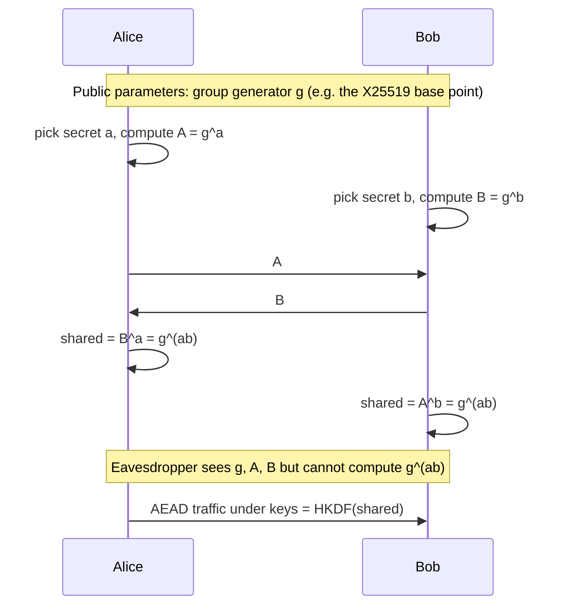
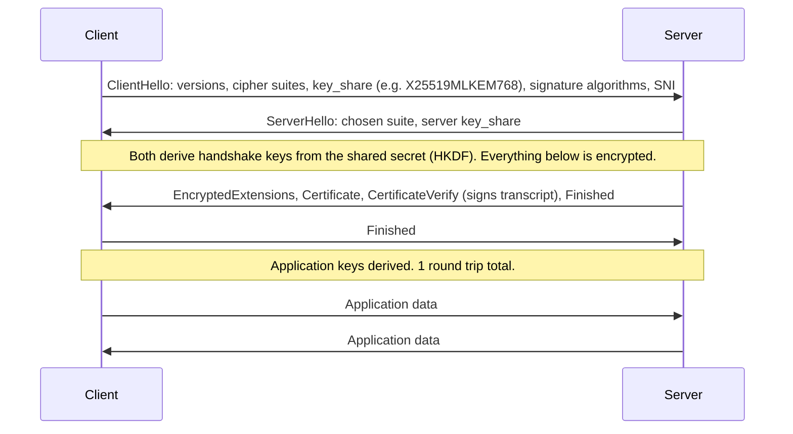
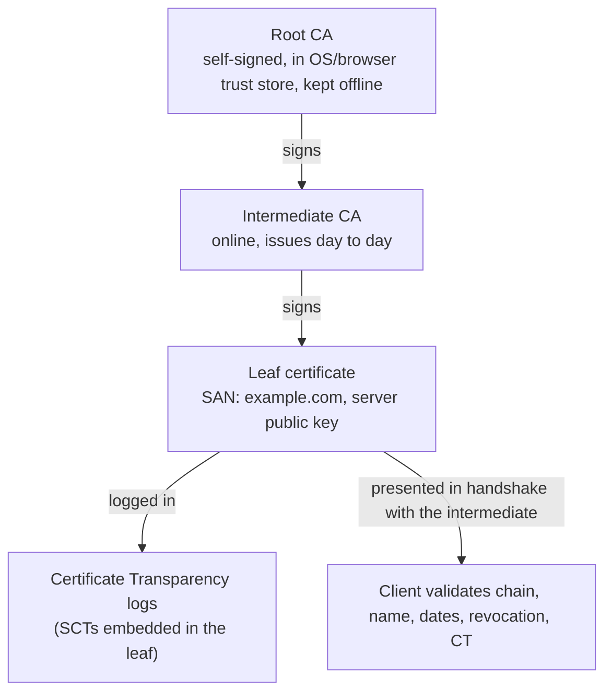
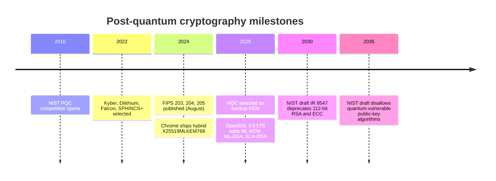
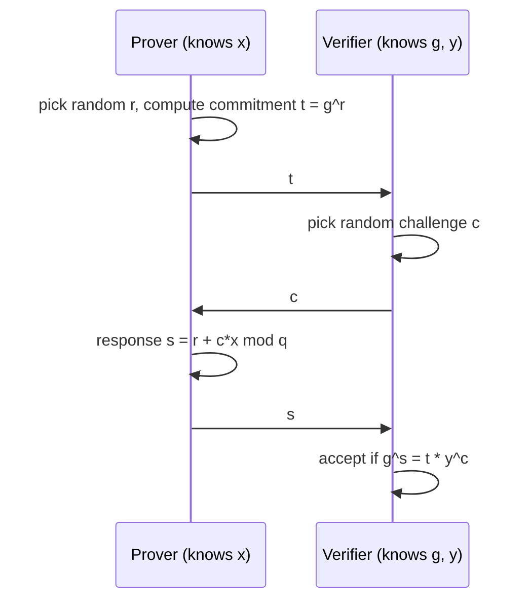

<p class="breadcrumb"><a href="./">Cybersecurity</a> › Cryptography</p>

# Cryptography

Cryptography provides the confidentiality, integrity, and authenticity guarantees that most other security controls depend on. This page covers the working primitives (authenticated encryption, hashing, key exchange, signatures), how they combine in TLS 1.3 and the Web PKI, the migration to post-quantum algorithms now under way, privacy-preserving techniques such as zero-knowledge proofs and homomorphic encryption, and the number theory behind RSA, elliptic curves, and secret sharing. The emphasis is applied: which algorithm to choose, how it fails, and what changed recently. For formal definitions and security proofs, see [Advanced Cryptography](../../advanced/cryptography/).

## The Primitives at a Glance

Real systems are built by combining a small set of primitives. Each does one job; most cryptographic failures come from using one where another was needed (encrypting without authenticating, hashing passwords with a fast hash, signing with a reused nonce).

| Primitive | Guarantees | Current recommendation | Avoid |
|-----------|-----------|------------------------|-------|
| Authenticated encryption (AEAD) | Confidentiality + integrity | AES-256-GCM, ChaCha20-Poly1305 | ECB mode; CBC without a MAC; RC4, 3DES |
| Cryptographic hash | Collision/preimage resistance | SHA-256/384, SHA-3, BLAKE2/BLAKE3 | MD5, SHA-1 |
| Message authentication code | Integrity + authenticity (shared key) | HMAC-SHA-256, KMAC, Poly1305 (inside AEAD) | `hash(key + message)` (length extension) |
| Password hashing | Slow, memory-hard verification | Argon2id, scrypt, bcrypt | Any fast hash, even salted |
| Key derivation | Stretch/split a secret into keys | HKDF | Ad hoc hashing |
| Key exchange / KEM | Establish a shared secret | X25519; hybrid X25519MLKEM768 | Static RSA key transport; finite-field DH < 2048 bits |
| Digital signature | Authenticity + non-repudiation | Ed25519, ECDSA P-256, RSA-PSS; ML-DSA for PQ | RSA PKCS#1 v1.5 for new designs; DSA |
| Random number generation | Unpredictable keys and nonces | OS CSPRNG (`getrandom`, `secrets`, `os.urandom`) | `random`, `Math.random`, time-seeded PRNGs |

The rule that sits above all of these is **do not design your own**: use a vetted, high-level library (libsodium, Google Tink, the Python `cryptography` package, Go's `crypto/*`) and prefer its misuse-resistant APIs over raw primitives.

## Symmetric Encryption

Symmetric ciphers use one secret key for both encryption and decryption. They are fast (AES runs at many GB/s with the AES-NI or ARMv8 crypto instructions) and carry almost all bulk data; public-key cryptography is used only to agree on or transport the symmetric key.

### Authenticated Encryption (AEAD)

A cipher alone provides confidentiality but not integrity: an attacker who flips ciphertext bits flips plaintext bits, and CBC-mode decryption errors have repeatedly produced **padding-oracle** attacks. Modern designs therefore use **AEAD** (authenticated encryption with associated data), which encrypts and authenticates in one operation and refuses to decrypt anything that has been modified. The "associated data" is authenticated but not encrypted — typically a header, record number, or user ID that binds the ciphertext to its context.

```python
import os
from cryptography.hazmat.primitives.ciphers.aead import AESGCM

key = AESGCM.generate_key(bit_length=256)
aead = AESGCM(key)

nonce = os.urandom(12)                  # 96-bit nonce: MUST be unique per key
header = b"user-id=42"                  # authenticated, not encrypted
ciphertext = aead.encrypt(nonce, b"Meet me at midnight", header)

# Decryption verifies the tag first; any tampering raises InvalidTag
plaintext = aead.decrypt(nonce, ciphertext, header)
```

The one rule AES-GCM does not forgive is **nonce reuse**. Encrypting two messages under the same key and nonce leaks their XOR and lets an attacker recover the authentication key and forge messages. Random 96-bit nonces are safe for roughly $2^{32}$ messages per key; beyond that, use a counter nonce, rotate keys, or choose a nonce-misuse-resistant mode such as **AES-GCM-SIV** (RFC 8452). **ChaCha20-Poly1305** (RFC 8439) is the standard alternative on CPUs without AES hardware, where software AES is both slow and prone to cache-timing leaks; **XChaCha20-Poly1305** extends the nonce to 192 bits so random nonces are always safe.

Higher-level wrappers remove the nonce problem entirely. The `cryptography` package's `Fernet` token format (AES-128-CBC with HMAC-SHA-256) and libsodium's `secretbox` generate nonces internally and are appropriate for application developers who just need "encrypt this blob".

### Block Cipher Modes

| Mode | Authenticated | Parallelizable | Notes |
|------|---------------|----------------|-------|
| ECB | No | Yes | Identical blocks give identical ciphertext — leaks structure. Never use. |
| CBC | No | Decrypt only | Needs a random IV and a separate MAC (encrypt-then-MAC); padding-oracle history |
| CTR | No | Yes | Turns a block cipher into a stream cipher; needs a MAC |
| GCM | Yes | Yes | CTR + GHASH; the default AEAD in TLS; catastrophic on nonce reuse |
| GCM-SIV | Yes | Partly | Nonce reuse only reveals whether two messages were identical |
| XTS | No | Yes | Disk encryption (sector-addressed, no room for a tag) |

### Key Sizes and Quantum Computers

AES-128 provides 128-bit security against classical attack. Grover's algorithm gives a quantum computer only a square-root speed-up on key search, and it parallelizes poorly, so NIST continues to treat AES-128 as acceptable; AES-256 is the conservative choice for long-lived data and is required by the NSA's CNSA 2.0 suite.

## Hashing, MACs, and Password Storage

A cryptographic hash maps any input to a fixed-size digest such that finding a collision (two inputs with the same digest) or a preimage (an input for a given digest) is infeasible. Hashes underpin signatures, integrity checks, commitments, and forensic evidence handling.

- **MD5** and **SHA-1** are broken for collision resistance. The 2017 SHAttered attack produced two different PDFs with the same SHA-1 hash, and chosen-prefix collisions followed in 2020. NIST has announced that SHA-1 is to be phased out entirely by the end of 2030.
- **SHA-2** (SHA-256, SHA-384, SHA-512) is the workhorse and remains secure. Its Merkle–Damgård construction is vulnerable to **length extension**, which is why a MAC must be HMAC rather than `SHA256(key || message)`.
- **SHA-3** (Keccak, FIPS 202) uses a different sponge construction and is immune to length extension; its XOFs SHAKE128/256 appear throughout the post-quantum standards.
- **BLAKE2** and **BLAKE3** are fast, secure non-NIST alternatives widely used in software (e.g. WireGuard, content-addressed storage).

### Password Hashing

Password databases are stolen routinely, so the stored value must make offline guessing expensive. General-purpose hashes are the wrong tool: a single modern GPU computes billions of SHA-256 hashes per second. Salting defeats precomputed rainbow tables but does nothing to slow an attacker guessing one account at a time. Password hashes are deliberately **slow and memory-hard**, so that GPU and ASIC parallelism buys the attacker little.

The OWASP Password Storage Cheat Sheet recommends, in order of preference:

| Algorithm | Minimum parameters (OWASP) | Notes |
|-----------|----------------------------|-------|
| **Argon2id** | 19 MiB memory, 2 iterations, parallelism 1 | Winner of the 2015 Password Hashing Competition; RFC 9106 |
| **scrypt** | $N = 2^{17}$, $r = 8$, $p = 1$ | Memory-hard; older and widely available |
| **bcrypt** | Cost factor 10 or more | Truncates input at 72 bytes; not memory-hard |
| **PBKDF2-HMAC-SHA-256** | 600,000 iterations | Only when FIPS 140 validation is required |

```python
from argon2 import PasswordHasher          # pip install argon2-cffi
from argon2.exceptions import VerifyMismatchError

ph = PasswordHasher()                       # Argon2id, RFC 9106 low-memory profile

stored = ph.hash("correct horse battery staple")
# '$argon2id$v=19$m=65536,t=3,p=4$<salt>$<hash>' — salt and parameters are embedded

def login(stored_hash: str, attempt: str) -> bool:
    try:
        ph.verify(stored_hash, attempt)     # constant-time comparison
    except VerifyMismatchError:
        return False
    if ph.check_needs_rehash(stored_hash):  # parameters raised since this hash was made
        ...                                 # re-hash `attempt` and update the stored value
    return True
```

Because the salt and cost parameters are encoded in the hash string, parameters can be raised over time and old hashes upgraded transparently at the next successful login.

## Public-Key Cryptography

Symmetric encryption leaves one problem unsolved: two parties who have never met need a shared key, and sending it over the network exposes it. Public-key (asymmetric) cryptography, introduced by Diffie and Hellman in 1976 and made practical by Rivest, Shamir, and Adleman in 1977, solves it with key pairs whose public half can be published freely.

Public-key primitives are used for two purposes, never for bulk data:

- **Key establishment** — agreeing on a symmetric key (Diffie–Hellman, or a key encapsulation mechanism).
- **Digital signatures** — proving who produced a message (certificates, software updates, Git commits, JWTs).

### Diffie–Hellman Key Exchange

Each party combines its own private value with the other's public value and arrives at the same secret, which an eavesdropper seeing only the public values cannot compute.



Unauthenticated Diffie–Hellman is vulnerable to a man-in-the-middle who runs a separate exchange with each side, so real protocols **sign** the exchange (TLS signs the handshake transcript with the server's certificate key). Using fresh, ephemeral key pairs for every session provides **forward secrecy**: stealing a long-term signing key later does not decrypt past sessions.

### RSA, Elliptic Curves, and Key Sizes

**RSA** rests on the difficulty of factoring $n = pq$. **Elliptic-curve cryptography (ECC)** rests on the elliptic-curve discrete logarithm problem: given points $P$ and $Q = kP$, find $k$. The best known attacks on ECC are fully exponential, while factoring has sub-exponential algorithms (the general number field sieve), so ECC reaches the same security with far smaller keys and faster operations.

| Security strength (bits) | Symmetric | RSA / finite-field DH modulus | ECC key | Status (NIST SP 800-57) |
|--------------------------|-----------|-------------------------------|---------|--------------------------|
| 80 | 2TDEA | 1024 | 160 | Disallowed |
| 112 | 3TDEA | 2048 | 224 | Minimum acceptable today |
| 128 | AES-128 | 3072 | 256 (P-256, Curve25519) | Recommended |
| 192 | AES-192 | 7680 | 384 (P-384) | High assurance |
| 256 | AES-256 | 15360 | 512+ (P-521) | High assurance |

In practice:

- **Curve25519 / Ed25519** (RFC 7748, RFC 8032) are the modern defaults for key exchange (X25519) and signatures (Ed25519): fast, constant-time by design, and free of the invalid-curve and bad-randomness pitfalls of older ECDSA implementations.
- **ECDSA with P-256** remains ubiquitous in the Web PKI and hardware tokens. Its signatures need a unique secret nonce per signature — reusing one (as in the 2010 PlayStation 3 key leak) reveals the private key — so implementations should derive nonces deterministically (RFC 6979).
- **RSA** is still the most common certificate key type. Use at least 2048-bit keys (3072-bit for data that must stay secure past 2030), **OAEP** padding for encryption and **PSS** for signatures. "Textbook" RSA without padding is deterministic and malleable, and PKCS#1 v1.5 encryption padding is the source of the Bleichenbacher oracle family (ROBOT, 2017).

Both RSA and ECC fall to Shor's algorithm on a large quantum computer; see [the quantum threat](#the-quantum-threat-why-we-need-new-cryptography).

### Hybrid Encryption and KEMs

Public-key operations are slow and can only process short inputs, so everything that "encrypts with a public key" is really **hybrid**: a public-key step establishes a random symmetric key, and an AEAD encrypts the data. Modern designs express the public-key step as a **key encapsulation mechanism (KEM)** — `Encaps(pk)` returns a shared secret and a ciphertext, `Decaps(sk, ct)` recovers the secret — which is also the interface of the post-quantum ML-KEM. **HPKE** (Hybrid Public Key Encryption, RFC 9180) standardizes this pattern and is used by Encrypted Client Hello and Messaging Layer Security (MLS, RFC 9420).

## TLS in Practice

**TLS (Transport Layer Security)** is where these primitives come together into a negotiated, authenticated, forward-secret channel; it secures HTTPS, most API traffic, SMTP between mail servers, and service-mesh traffic. TLS 1.3 (RFC 8446, 2018) is the current version; TLS 1.2 remains widely deployed and acceptable with modern cipher suites, while SSL 3.0, TLS 1.0, and TLS 1.1 are formally deprecated (RFC 8996).

### The TLS 1.3 Handshake

TLS 1.2 needed two round trips before application data could flow. TLS 1.3 needs one, because the client no longer waits to be told which key-exchange group to use: it *guesses*, sending an ephemeral public key (a "key share") for its preferred group in the first message. If the server accepts that group, both sides can derive keys immediately; if not, the server sends a `HelloRetryRequest` and the handshake costs an extra round trip.



After `ServerHello`, every handshake message is encrypted, including the server certificate that TLS 1.2 sent in the clear. The remaining plaintext leak — the server name (SNI) in the `ClientHello` — is closed by **Encrypted Client Hello (ECH)**, published as RFC 9849 in March 2026. ECH encrypts the real `ClientHello` under a public key the server publishes in its DNS `HTTPS` record (RFC 9460), leaving only a shared, innocuous outer name visible; it is supported by current Firefox and Chrome and by large CDNs.

| Area | TLS 1.2 | TLS 1.3 |
|------|---------|---------|
| Handshake latency | 2-RTT | 1-RTT (0-RTT on resumption) |
| Forward secrecy | Optional (static-RSA key transport allowed) | Mandatory (ephemeral (EC)DHE or hybrid KEM only) |
| Bulk ciphers | CBC, RC4, 3DES, AEAD | AEAD only |
| Renegotiation | Yes (source of attacks) | Removed (replaced by key update) |
| Compression | Allowed (enabled CRIME) | Removed |
| Certificate privacy | Sent in cleartext | Encrypted |
| Downgrade protection | Weak | Signed transcript plus a sentinel in `ServerHello.random` |

Removing static-RSA key transport is the most important change. Under TLS 1.2 anyone who later obtained the server's private key could decrypt *recorded* traffic; under TLS 1.3 each session key comes from ephemeral values, so forward secrecy is guaranteed.

**0-RTT caveat.** A resuming client can send data in its first flight, encrypted under a pre-shared key from an earlier session. That early data is **replayable** — an attacker can capture and resend it — so servers must accept it only for idempotent requests (an HTTP `GET`, never a `POST` that moves money).

### Cipher Suites and Key-Exchange Groups

A TLS 1.2 cipher suite bundled four choices into one name; TLS 1.3 names only the AEAD cipher and the hash used by HKDF, and negotiates the key-exchange group and signature algorithm in separate extensions.

```
TLS 1.2:  TLS_ECDHE_RSA_WITH_AES_128_GCM_SHA256
              |     |        |             |
          key exch  auth   AEAD cipher   PRF hash

TLS 1.3:  TLS_AES_128_GCM_SHA256
              |              |
          AEAD cipher     HKDF hash
```

TLS 1.3 defines five suites: `TLS_AES_128_GCM_SHA256` (mandatory to implement), `TLS_AES_256_GCM_SHA384`, `TLS_CHACHA20_POLY1305_SHA256`, `TLS_AES_128_CCM_SHA256`, and `TLS_AES_128_CCM_8_SHA256` (truncated tag, marked "not recommended" by IANA; for constrained IoT only). Servers normally apply their own preference order. Sensible defaults:

- **AES-GCM** where the CPU has AES instructions (virtually all servers and modern phones); **ChaCha20-Poly1305** otherwise.
- **Hybrid post-quantum key exchange** — `X25519MLKEM768` — first, with `X25519` as the fallback. Chrome, Edge, and Firefox offer the hybrid group by default, OpenSSL 3.5 (April 2025) makes it the default key share, and major CDNs negotiate it. Its main cost is size: the client key share grows from 32 bytes to about 1.2 KB, which occasionally breaks middleboxes that assume the `ClientHello` fits in one packet.
- For TLS 1.2 clients, allow only ECDHE suites with AEAD ciphers.

```bash
# What did the server negotiate? (OpenSSL 3.5+ can offer the hybrid group)
openssl s_client -connect example.com:443 -tls1_3 \
  -groups X25519MLKEM768:X25519 </dev/null 2>/dev/null \
  | grep -E "Protocol|Cipher|Negotiated TLS1.3 group|Peer Temp Key"

# Enumerate every protocol/suite a server accepts (audits)
nmap --script ssl-enum-ciphers -p 443 example.com
```

The Mozilla SSL Configuration Generator publishes maintained "modern" and "intermediate" server configurations for nginx, Apache, HAProxy, and others, and is the simplest way to avoid hand-tuning suite lists.

### Certificates and the Web PKI

Encryption proves nothing about *who* is on the other end. A certificate binds a public key to a domain name and is signed by a **Certificate Authority (CA)** that the client's trust store already trusts. The server proves it holds the matching private key by signing the handshake transcript (`CertificateVerify`).



- **Chain of trust.** Roots stay offline; intermediates do the signing so a compromised intermediate can be revoked without distrusting the root. The server must send the leaf *and* its intermediates — sending only the leaf is a common misconfiguration that breaks clients without a cached intermediate.
- **Validation levels.** Domain Validation (DV) proves control of the domain; Organization (OV) and Extended Validation (EV) add identity checks. The encryption is identical, browsers no longer display EV specially, and the vast majority of certificates are DV.
- **Certificate Transparency (CT, RFC 6962).** Every publicly trusted certificate must be logged in public, append-only Merkle-tree logs; Chrome and Safari reject certificates without signed log receipts (SCTs). CT does not stop mis-issuance but makes it detectable: domain owners can monitor the logs (e.g. via crt.sh) for certificates they did not request.
- **CAA records** (RFC 8659) in DNS restrict which CAs may issue for a domain.

### Automated Issuance and Shrinking Lifetimes

**ACME** (RFC 8555) and **Let's Encrypt** (launched 2015) turned certificate management from an annual manual chore into an automated, free process:

1. The ACME client creates an account key and orders a certificate for `example.com`.
2. The CA issues a **challenge**: `http-01` (serve a token under `/.well-known/acme-challenge/`), `dns-01` (publish a TXT record; required for wildcards), or `tls-alpn-01`.
3. The client satisfies it, the CA validates, and the client submits a CSR and receives the certificate.
4. The client renews automatically — ideally when the CA tells it to, via **ACME Renewal Information (ARI)**, rather than on a fixed schedule.

```bash
certbot --nginx -d example.com -d www.example.com   # issue and install
certbot renew --dry-run                              # test the renewal timer
```

Short lifetimes limit the damage from an undetected key compromise and reduce reliance on revocation, and the industry is shortening them on a fixed schedule. CA/Browser Forum ballot SC-081 (2025) reduces the maximum lifetime of publicly trusted TLS certificates in steps:

| From | Maximum validity | Domain-validation reuse |
|------|------------------|-------------------------|
| Before 15 March 2026 | 398 days | 398 days |
| 15 March 2026 | 200 days | 200 days |
| 15 March 2027 | 100 days | 100 days |
| 15 March 2029 | 47 days | 10 days |

Let's Encrypt, already at 90 days, is moving further: an opt-in six-day "shortlived" profile, 45-day certificates on an opt-in profile from May 2026, a default of 64 days from February 2027, and 45 days (with authorization reuse cut to hours) from February 2028. At these lifetimes manual renewal is impossible; certificate management is an automation problem.

### Revocation

Sometimes a certificate must die before it expires — the key leaks, the domain changes hands, or the CA mis-issued. Revocation has historically been the weakest part of the PKI:

- **CRLs** — the CA publishes signed lists of revoked serial numbers. Historically large and infrequently fetched.
- **OCSP** — the client asks the CA about one certificate in real time. It adds latency, leaks every site a user visits to the CA, and browsers **soft-fail** when the responder is unreachable, so an attacker who can block the query suppresses revocation. **OCSP stapling** and the **must-staple** extension tried to fix this but never achieved wide deployment.
- **Browser-pushed revocation** — Chrome's CRLSets and Firefox's CRLite aggregate revocation data at the vendor and ship it to the browser, avoiding per-connection lookups.

The industry has now largely abandoned OCSP. The CA/Browser Forum made OCSP optional and CRLs mandatory for publicly trusted CAs, and Let's Encrypt removed OCSP URLs from its certificates in May 2025 and shut its responders down in August 2025, along with must-staple support. The resulting model is **CRLs aggregated by browsers, plus lifetimes short enough that an unrevoked compromised certificate expires quickly**.

### DANE

Browsers trust hundreds of CAs, any of which can issue for any domain; the 2011 DigiNotar compromise produced fraudulent Google certificates used against users in Iran. **DANE** (RFC 6698) lets a domain owner instead publish the expected key in a DNSSEC-signed **TLSA** record:

```
_25._tcp.mail.example.com.  IN  TLSA  3 1 1  <SHA-256 of the server's public key>
                                      | | |
                                      | | +-- matching type 1: SHA-256
                                      | +---- selector 1: SubjectPublicKeyInfo (0 = whole cert)
                                      +------ usage 3 (DANE-EE): this exact key, no CA needed
```

Browsers never adopted DANE for HTTPS (CT solved the mis-issuance-detection problem without a DNSSEC dependency). Its success is **SMTP**: DANE turns opportunistic, trivially downgradeable STARTTLS between mail servers into authenticated, mandatory encryption. MTA-STS (RFC 8461) is the non-DNSSEC alternative for mail.

### Mutual TLS (mTLS)

In ordinary TLS only the server presents a certificate; the client authenticates later with a password or token. **Mutual TLS** adds a `CertificateRequest` from the server, and the client responds with its own `Certificate` and `CertificateVerify`, so both ends are cryptographically authenticated before any application data flows.

mTLS is impractical for public websites but is the backbone of machine-to-machine trust:

- **Service meshes and zero-trust networks** — Istio, Linkerd, and Consul give every workload a short-lived certificate (commonly a SPIFFE identity issued by SPIRE or the mesh's own CA) and enforce mTLS on all internal traffic, so identity comes from the certificate rather than the network location.
- **Partner and financial APIs** — open-banking APIs commonly require client certificates or certificate-bound tokens.
- **Device fleets** — IoT devices provisioned with unique certificates at manufacture.

Its operational cost is certificate lifecycle at scale, which is why meshes pair it with automated internal CAs issuing certificates that live for hours — the same automation-plus-short-lifetime pattern ACME brought to the public web. Note that the public Web PKI is separating the two uses: Chrome's root program is phasing out the client-authentication usage from publicly trusted server certificates, so mTLS client certificates should come from a private CA.

## The Quantum Threat: Why We Need New Cryptography

**Shor's algorithm** factors integers and computes discrete logarithms in polynomial time on a fault-tolerant quantum computer, breaking RSA, finite-field Diffie–Hellman, and all elliptic-curve schemes. Symmetric cryptography and hashes are affected only by Grover's quadratic speed-up and remain safe at current sizes.

No cryptographically relevant quantum computer exists yet, but resource estimates keep falling. In 2019 Gidney and Ekerå estimated that factoring RSA-2048 would take about 20 million noisy qubits for eight hours; Gidney's 2025 revision put it at under one million noisy qubits running for under a week. Current machines have on the order of a thousand physical qubits with error rates far above what such an attack needs, so the gap is large but no longer astronomical.

Two considerations make the migration urgent regardless of when that machine arrives:

- **Harvest now, decrypt later.** An adversary can record encrypted traffic today and decrypt it once a quantum computer exists. Any data that must stay confidential for 10–20 years is already exposed if its key exchange is classical — which is why key exchange is being migrated first.
- **Migration takes a decade.** Previous transitions (SHA-1 to SHA-2, RSA to ECC, TLS 1.0 to 1.2) each took 10–20 years across the installed base of devices, firmware, protocols, and HSMs.

### Post-Quantum Standards

Post-quantum cryptography (PQC) means classical algorithms, running on ordinary computers, built on problems for which no efficient quantum algorithm is known. NIST ran an open competition from 2016 and published its first standards in August 2024:

| Standard | Algorithm (origin) | Type | Hard problem | Public key / output size |
|----------|--------------------|------|--------------|--------------------------|
| **FIPS 203** | ML-KEM (CRYSTALS-Kyber) | KEM | Module learning with errors | ML-KEM-768: 1,184 B key, 1,088 B ciphertext |
| **FIPS 204** | ML-DSA (CRYSTALS-Dilithium) | Signature | Module LWE / SIS | ML-DSA-65: 1,952 B key, 3,309 B signature |
| **FIPS 205** | SLH-DSA (SPHINCS+) | Signature | Hash functions only | SLH-DSA-128s: 32 B key, 7,856 B signature |
| FIPS 206 (in progress) | FN-DSA (Falcon) | Signature | NTRU lattices | Falcon-512: 897 B key, about 666 B signature |
| Selected March 2025 | HQC | KEM | Decoding random quasi-cyclic codes | Backup KEM with a non-lattice assumption |
| SP 800-208 | LMS, XMSS | Stateful signature | Hash functions only | Firmware/code signing; signer must never reuse state |

For comparison, X25519 public keys are 32 bytes and Ed25519 signatures 64 bytes: the practical cost of PQC is **size**, not speed (ML-KEM is faster than X25519). Large signatures are the harder problem for TLS, where a certificate chain carries several signatures and public keys; post-quantum *authentication* in the Web PKI is still being designed (Merkle Tree Certificates are one proposal), whereas post-quantum *key exchange* is already deployed.

**Lattice problems.** ML-KEM and ML-DSA rest on **learning with errors (LWE)**: given a random matrix $A$ and

$$
b = A s + e \pmod{q},
$$

where $s$ is a secret vector and $e$ a vector of small random errors, recover $s$. Without the error term this is linear algebra (Gaussian elimination); with it, the best known classical and quantum algorithms are exponential. "Module" LWE works over polynomial rings, which shrinks keys and speeds up arithmetic while keeping this structure.

### Migration Timeline



NIST IR 8547 (initial public draft, November 2024) proposes deprecating quantum-vulnerable algorithms at the 112-bit security level after 2030 and disallowing RSA and ECC entirely after 2035; the NSA's **CNSA 2.0** sets a similar 2035 horizon for US national security systems, with ML-KEM-1024 and ML-DSA-87 as its public-key algorithms. The recommended migration pattern:

1. **Inventory** where public-key cryptography is used (a *cryptographic bill of materials*): TLS endpoints, VPNs, SSH, code signing, HSMs, embedded devices, stored encrypted data.
2. **Deploy hybrid key exchange first** — X25519MLKEM768 in TLS, `mlkem768x25519-sha256` in OpenSSH (the default since OpenSSH 10.0) — so that security holds if *either* component is unbroken.
3. **Build crypto-agility**: algorithms configurable rather than hard-coded, so future changes are configuration, not rewrites.
4. **Plan signature migration** for long-lived trust anchors (firmware roots, code-signing keys) where replacing keys in the field is slowest.

## Privacy-Preserving Cryptography

Traditional encryption protects data at rest and in transit but requires decrypting it to use it. A family of techniques lets parties prove or compute things about data without revealing it. Secure multi-party computation and differential privacy are covered in [Foundations, Operations & Research](operations-and-response.html) and [Privacy Engineering](privacy-engineering.html).

### Zero-Knowledge Proofs

A zero-knowledge proof convinces a verifier that a statement is true — "I know the private key for this public key", "this transaction balances", "I am over 18" — while revealing nothing beyond that fact. The classic example is the **Schnorr identification protocol**, in which a prover demonstrates knowledge of $x$ where $y = g^x \bmod p$, in a group of prime order $q$:



Verification works because

$$
g^{s} = g^{r + c x} = g^{r} \cdot \left(g^{x}\right)^{c} = t \cdot y^{c} \pmod{p}.
$$

The random $r$ masks $x$ in the response, so the transcript reveals nothing about $x$; a prover who does not know $x$ can answer at most one challenge per commitment and is caught with overwhelming probability. Replacing the verifier's challenge with a hash of the commitment and a message, $c = H(t, m)$ (the **Fiat–Shamir transform**), turns the protocol into a non-interactive proof — which is exactly the Schnorr signature scheme that EdDSA and Bitcoin's Taproot signatures build on.

General-purpose **zk-SNARKs** (Groth16, PLONK) and **zk-STARKs** extend this to proving arbitrary computations with small proofs and fast verification. They are deployed in privacy-preserving cryptocurrencies, Ethereum "zk-rollups" that batch thousands of transactions behind one succinct proof, and anonymous credentials and age-verification schemes for digital-identity wallets. The formal definitions (completeness, soundness, zero-knowledge) are in [Advanced Cryptography](../../advanced/cryptography/#zero-knowledge-proofs).

### Homomorphic Encryption

Homomorphic encryption allows computation directly on ciphertexts: the result, when decrypted, equals the result of the same computation on the plaintexts.

- **Partially homomorphic** schemes support one operation. In **Paillier**, multiplying ciphertexts adds plaintexts, $E(m_1) \cdot E(m_2) \bmod n^2 = E(m_1 + m_2)$, which suits encrypted vote tallies and aggregate statistics. Unpadded RSA and ElGamal are multiplicatively homomorphic.
- **Fully homomorphic encryption (FHE)**, first constructed by Gentry in 2009, supports both addition and multiplication and therefore arbitrary circuits. Each operation adds noise to the ciphertext, and **bootstrapping** homomorphically refreshes it. Current schemes are lattice-based: **BGV/BFV** for exact integer arithmetic, **CKKS** for approximate real-number arithmetic (well suited to machine-learning inference), and **TFHE** for fast bootstrapping on bits and small integers.

FHE remains orders of magnitude slower than plaintext computation, but it has moved from theory to niche production: open-source libraries include OpenFHE, Microsoft SEAL, and Zama's TFHE-rs, and it is used for private set intersection, encrypted database lookups, and privacy-preserving ML inference. Hardware accelerators are an active research and commercial area.

## Mathematical Foundations

### RSA

Key generation, encryption, and decryption:

$$
n = p q, \qquad \varphi(n) = (p - 1)(q - 1), \qquad e d \equiv 1 \pmod{\varphi(n)}
$$

$$
c = m^{e} \bmod n, \qquad m = c^{d} \bmod n
$$

Decryption works because $ed = 1 + k\varphi(n)$ for some integer $k$, and by Euler's theorem $m^{\varphi(n)} \equiv 1 \pmod n$ for $m$ coprime to $n$, so

$$
c^{d} = m^{e d} = m \cdot \left(m^{\varphi(n)}\right)^{k} \equiv m \pmod{n}
$$

(the result also holds for the rare $m$ sharing a factor with $n$, by the Chinese remainder theorem). The public key is $(n, e)$; the private key is $d$, which is easy to compute from $\varphi(n)$ but, as far as anyone knows, requires factoring $n$ to obtain. Standards use $e = 65537$ and many implementations use the Carmichael function $\lambda(n) = \operatorname{lcm}(p-1, q-1)$ in place of $\varphi(n)$, which gives a smaller but equivalent $d$.

```python
# Toy RSA with tiny primes — illustrative only. Real RSA uses 2048+ bit
# primes and OAEP/PSS padding; unpadded ("textbook") RSA is insecure.
p, q = 61, 53
n = p * q                    # 3233
phi = (p - 1) * (q - 1)      # 3120
e = 17                       # coprime with phi
d = pow(e, -1, phi)          # modular inverse (Python 3.8+): 2753

m = 65
c = pow(m, e, n)             # 2790
assert pow(c, d, n) == m     # decrypts back to 65
```

### Elliptic Curves

A short-Weierstrass elliptic curve over the prime field $\mathbb{F}_p$ is the set of points satisfying

$$
y^{2} = x^{3} + a x + b \pmod{p},
$$

together with a point at infinity $\mathcal{O}$ acting as the identity. Adding $P = (x_1, y_1)$ and $Q = (x_2, y_2)$ uses the slope of the line through them (or the tangent, when doubling):

$$
\lambda =
\begin{cases}
\dfrac{y_2 - y_1}{x_2 - x_1} & P \neq Q \\[2ex]
\dfrac{3 x_1^{2} + a}{2 y_1} & P = Q
\end{cases}
\qquad
x_3 = \lambda^{2} - x_1 - x_2, \qquad
y_3 = \lambda (x_1 - x_3) - y_1 .
$$

A private key is a scalar $k$; the public key is $Q = kG$ for a fixed base point $G$, computed with $O(\log k)$ doublings and additions. Recovering $k$ from $Q$ is the elliptic-curve discrete logarithm problem. Bitcoin uses secp256k1 ($a = 0$, $b = 7$); TLS mostly uses P-256 and Curve25519 (the latter in Montgomery form, with a different but equivalent formula).

```python
# Toy elliptic-curve arithmetic. Production code must be constant-time,
# validate points, and use a vetted library — never code like this.
O = None  # point at infinity

def ec_add(P, Q, a, p):
    if P is O: return Q
    if Q is O: return P
    (x1, y1), (x2, y2) = P, Q
    if x1 == x2 and (y1 + y2) % p == 0:
        return O                                   # P + (-P) = O
    if P == Q:
        lam = (3 * x1 * x1 + a) * pow(2 * y1, -1, p) % p
    else:
        lam = (y2 - y1) * pow(x2 - x1, -1, p) % p
    x3 = (lam * lam - x1 - x2) % p
    return (x3, (lam * (x1 - x3) - y1) % p)

def ec_mul(k, P, a, p):
    """Double-and-add: O(log k) group operations."""
    R = O
    while k:
        if k & 1:
            R = ec_add(R, P, a, p)
        P = ec_add(P, P, a, p)
        k >>= 1
    return R

# y^2 = x^3 + 2x + 3 over F_97, point G = (3, 6)
G = (3, 6)
print([ec_mul(k, G, a=2, p=97) for k in range(1, 6)])
# [(3, 6), (80, 10), (80, 87), (3, 91), None]  -> G has order 5: 5G = O.
# Real curves use a base point of large prime order (about 2^256 for P-256).
```

### Shamir's Secret Sharing

Shamir's scheme splits a secret $s$ into $n$ shares such that any $k$ of them reconstruct it and any $k - 1$ reveal nothing. The dealer picks a random polynomial of degree $k - 1$ over $\mathbb{F}_p$ with constant term $s$ and hands out points on it:

$$
f(x) = s + a_1 x + a_2 x^{2} + \cdots + a_{k-1} x^{k-1} \pmod{p}, \qquad \text{share}_i = (i, f(i)).
$$

Any $k$ points determine a unique polynomial of degree $k - 1$, and Lagrange interpolation at $x = 0$ recovers the secret:

$$
s = f(0) = \sum_{i=1}^{k} y_i \prod_{j \neq i} \frac{x_j}{x_j - x_i} \pmod{p}.
$$

With only $k - 1$ points, every possible secret is consistent with exactly one polynomial, so the scheme is information-theoretically secure. It is used to split root-CA and HSM master keys among custodians, to "unseal" HashiCorp Vault, and — generalized into threshold signatures — in multi-party cryptocurrency custody.

```python
import secrets

PRIME = 2**127 - 1   # a Mersenne prime; the field must exceed the secret

def split(secret: int, k: int, n: int, p: int = PRIME):
    coeffs = [secret] + [secrets.randbelow(p) for _ in range(k - 1)]
    def f(x):
        return sum(c * pow(x, i, p) for i, c in enumerate(coeffs)) % p
    return [(x, f(x)) for x in range(1, n + 1)]

def combine(shares, p: int = PRIME):
    secret = 0
    for i, (xi, yi) in enumerate(shares):
        num, den = 1, 1
        for j, (xj, _) in enumerate(shares):
            if i != j:
                num = num * xj % p
                den = den * (xj - xi) % p
        secret = (secret + yi * num * pow(den, -1, p)) % p
    return secret

shares = split(123456789, k=3, n=5)      # 3-of-5
assert combine(shares[:3]) == 123456789
assert combine([shares[0], shares[2], shares[4]]) == 123456789
```

## Common Failure Modes

Deployed cryptography rarely fails because an algorithm is broken; it fails in how it is used.

| Failure | Example | Mitigation |
|---------|---------|------------|
| Nonce/IV reuse | AES-GCM nonce repeated under one key; ECDSA nonce reuse (PS3) | Library-managed nonces, GCM-SIV, deterministic ECDSA or Ed25519 |
| Unauthenticated encryption | CBC padding oracles (POODLE, Lucky 13) | AEAD only |
| Weak randomness | Debian OpenSSL bug (2008) left 32,768 possible keys | OS CSPRNG; never seed from time or PIDs |
| Timing side channels | Early-exit MAC comparison; table-based AES | Constant-time comparison (`hmac.compare_digest`) and implementations |
| Poor key management | Keys in source code, never rotated | KMS/HSM, envelope encryption, rotation, secret scanning |
| Downgrade attacks | FREAK, Logjam forcing export-grade crypto | Remove legacy options; TLS 1.3 transcript protection |
| Fast password hashing | Unsalted SHA-1/MD5 password dumps | Argon2id / scrypt / bcrypt |
| Implementation bugs | Heartbleed (2014) read server memory | Memory-safe implementations, fuzzing, prompt patching |

---

<div class="page-nav">
  <span class="page-nav-prev"><a href="./">← Cybersecurity Hub</a></span>
  <span class="page-nav-next"><a href="application-and-cloud-security.html">Application Security →</a></span>
</div>

## See Also

- [Advanced Cryptography](../../advanced/cryptography/) — provable security, reductions, formal ZK definitions, and PQC theory
- [Application Security](application-and-cloud-security.html) — JWTs, sessions, and where encryption meets application code
- [Privacy Engineering](privacy-engineering.html) — tokenization, differential privacy, and data minimization
- [Foundations, Operations & Research](operations-and-response.html) — security games, composability, and secure multi-party computation
- [Networking: Performance & Security](../networking/performance-and-security.html) — VPNs and network-layer protection
- [Quantum Computing](../quantumcomputing.html) — the hardware behind the post-quantum threat
