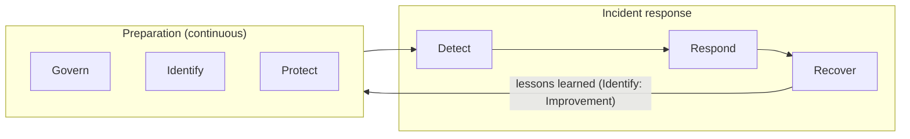
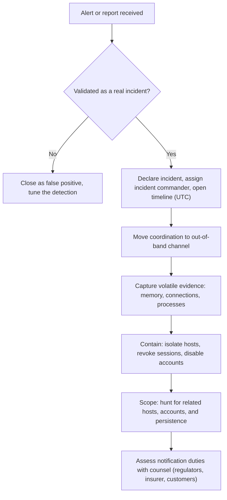
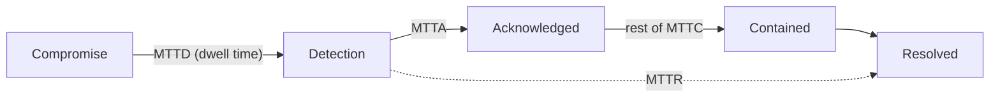

<p class="breadcrumb"><a href="./">Cybersecurity</a> › Incident Response &amp; Forensics</p>

# Incident Response & Forensics

**Incident response (IR)** is the structured process of detecting, containing, eradicating, and recovering from security incidents; **digital forensics** is the discipline of reconstructing what happened from evidence without altering it. This page covers the IR lifecycle as defined by NIST SP 800-61 and SANS, the first hour after detection, regulatory notification deadlines, forensic acquisition and analysis (including cloud environments), chain of custody, post-incident review, and the metrics used to measure response. Detection engineering and the SOC that feeds IR are covered in [Security Operations](security-operations.html).

## The Incident Response Lifecycle

Under the pressure of a live breach, responders should execute a rehearsed plan rather than improvise. Two reference models dominate, and they describe the same work at different granularities:

- **SANS PICERL** — six phases: Preparation, Identification, Containment, Eradication, Recovery, Lessons learned.
- **NIST SP 800-61** — Revision 2 (2012) used four phases: Preparation; Detection & Analysis; Containment, Eradication & Recovery; Post-Incident Activity. **Revision 3 (April 2025)** retires that standalone lifecycle and instead maps incident response onto the six functions of the NIST Cybersecurity Framework 2.0, treating IR as part of ongoing risk management rather than a separate process.



The SP 800-61r3 view: Govern, Identify, and Protect are the preparation that happens continuously; Detect, Respond, and Recover are the incident itself; and lessons learned flow back into every function through the CSF's *Improvement* category.

| SANS PICERL | NIST SP 800-61r2 | CSF 2.0 function (SP 800-61r3) | Core question |
|-------------|------------------|--------------------------------|---------------|
| Preparation | Preparation | Govern, Identify, Protect | Are we ready before anything happens? |
| Identification | Detection & Analysis | Detect | Is this an incident, and how bad? |
| Containment | Containment, Eradication & Recovery | Respond | How do we stop it spreading? |
| Eradication | Containment, Eradication & Recovery | Respond | How do we remove the attacker? |
| Recovery | Containment, Eradication & Recovery | Recover | How do we return to normal safely? |
| Lessons learned | Post-Incident Activity | Identify (Improvement) | How do we prevent a repeat? |

### Preparation

Preparation determines how well every later phase goes and is the highest-leverage investment.

- **Incident response plan** — written, approved by leadership, and rehearsed. It defines roles (incident commander, technical lead, communications lead, legal and privacy counsel, executive sponsor), severity levels, escalation thresholds, and who may authorize disruptive actions such as taking production offline or engaging law enforcement.
- **Contacts and retainers** — an out-of-hours call tree including outside counsel, the cyber-insurance carrier (many policies require using approved IR firms and notifying the carrier promptly), an IR retainer firm, and law enforcement contacts.
- **Telemetry** — EDR on endpoints and servers, centralized logs with enough retention to cover typical dwell time (90 days hot and a year or more archived is common), cloud audit logs (AWS CloudTrail, Azure Activity Log, Google Cloud Audit Logs) enabled in every account and region.
- **Out-of-band communication** — a channel the attacker cannot read. If email or the corporate chat tenant is compromised, responders discussing the incident there tip off the attacker.
- **Playbooks** — scenario-specific runbooks (ransomware, business email compromise, cloud credential leak, data exfiltration, insider).
- **Resilience** — offline or immutable backups that have been test-restored, and "break-glass" administrator accounts that do not depend on the identity provider being healthy.
- **Tabletop exercises** — walking the team through a simulated incident, including executives and legal, so the first use of the plan is not during a real breach. CISA publishes free tabletop exercise packages.

### Detection and Analysis

Detection turns an **event** (any observable occurrence) into an **incident** (an event that violates policy or threatens assets). Sources include SIEM and EDR alerts, user reports, threat-intelligence matches, threat hunting, and — worryingly often — external parties such as law enforcement, a customer, or the attacker's ransom note. Analysis answers four questions:

- **Is it real?** True positive or false positive.
- **What is the scope?** One host, one account, or the whole identity plane.
- **How severe is it?** Driven by data sensitivity, business impact, and attacker capability.
- **What is the attacker's objective?** Ransomware, espionage, fraud, or disruption — mapped where possible to MITRE ATT&CK techniques.

A simple severity scale keeps escalation consistent:

| Severity | Typical definition | Response |
|----------|-------------------|----------|
| SEV-1 (critical) | Confirmed breach of sensitive data, active ransomware, or outage of critical services | Incident commander, executives, and counsel engaged immediately; 24/7 response |
| SEV-2 (high) | Confirmed compromise, contained scope, no confirmed data loss | Dedicated response team during extended hours |
| SEV-3 (medium) | Suspicious activity or single compromised low-value asset | Handled by on-shift SOC analysts |
| SEV-4 (low) | Policy violation or blocked attempt | Ticketed and trended |

Speed and accuracy here are measured by [MTTD](#mttd-and-mttr-measuring-response-performance).

### Containment

Containment stops the damage from growing.

- **Short-term containment** — immediate actions: network-isolate hosts through EDR, disable or reset compromised accounts, **revoke sessions and tokens** (resetting a password does not invalidate existing OAuth refresh tokens or session cookies), block attacker infrastructure.
- **Long-term containment** — temporary controls that let the business operate while eradication is prepared: emergency patches, tightened segmentation, conditional-access policies, additional monitoring on the affected segment.

Two tensions govern containment decisions:

- **Evidence versus speed.** Powering a host off destroys memory-resident evidence (encryption keys, injected code, network connections). Network isolation severs attacker control while keeping the machine running for acquisition.
- **Tipping off the attacker.** Containing one foothold while others remain can prompt the attacker to accelerate — deploying ransomware early or destroying logs. For a sophisticated intrusion, responders often scope fully first and then contain all known footholds simultaneously.

### Eradication

Eradication removes every attacker foothold: malware, web shells, persistence mechanisms (scheduled tasks, services, startup items, cloud IAM users and access keys, OAuth app grants, mailbox forwarding rules), and attacker-created accounts — and closes the initial access vector. **Assume there is more than one**: finding one web shell means hunting for the others. Rebuilding hosts from known-good images is usually safer than cleaning in place. After an Active Directory compromise, eradication includes resetting the `krbtgt` account password twice (to invalidate forged Kerberos "golden tickets") and rotating service-account credentials.

### Recovery

Recovery restores operations and verifies that systems are clean: restore from backups taken **before** the compromise (and scan them — attackers target backups and sometimes plant persistence in them), rebuild, validate that the entry vector is closed, and bring systems back in tiers with heightened monitoring for the attacker's return. Recovery objectives (RTO and RPO) set in advance by the business-continuity plan decide which systems come back first.

### Lessons Learned

Within about two weeks of closure, the team holds a [post-incident review](#post-incident-review-and-lessons-learned) that captures what happened, what worked, and concrete, owned improvements. This is where the loop closes.

## Playbooks for Common Incident Types

Scenario-specific playbooks turn the generic lifecycle into concrete first actions.

| Incident type | Key first actions | Common pitfalls |
|---------------|-------------------|-----------------|
| **Ransomware** | Isolate affected segments; disable compromised admin accounts; protect and verify backups; identify the strain and check for a public decryptor (No More Ransom); determine whether data was exfiltrated (double extortion) | Rebooting encrypted hosts; restoring into an environment the attacker still controls; paying without legal review (sanctions risk) |
| **Business email compromise** | Revoke sessions and reset credentials; remove malicious inbox rules and OAuth grants; contact the bank immediately to recall fraudulent transfers; review mailbox audit logs for accessed data | Resetting the password but leaving session tokens and forwarding rules in place |
| **Cloud credential leak** | Deactivate the key; review the audit log for everything the key did; check for new IAM users, keys, roles, and compute (crypto-mining); rotate secrets the key could read | Deleting the key before recording its activity; checking only one region |
| **Data exfiltration** | Identify what data left, from where, and when; preserve network and proxy logs; engage counsel early to assess notification duties | Under-scoping; assuming encrypted data is safe without checking key exposure |
| **Insider threat** | Coordinate with HR and legal before acting; preserve evidence quietly; restrict access proportionately | Alerting the subject; evidence handling that is not defensible in employment or criminal proceedings |
| **Supply-chain compromise** | Identify affected versions and where they run; block known indicators; follow the vendor's advisory; hunt for post-exploitation activity | Treating the vendor patch as the end of the incident |

## The Golden Hour: First Steps Matter

The first decisions after detection are the most consequential, and the most common mistakes are instinctive: rebooting the machine, deleting the malware, or wiping the host before anyone has captured evidence or scoped the intrusion.



- **Declare early.** Formally declaring an incident activates roles and authority; it is cheap to downgrade later.
- **Document from the first minute.** Maintain a single timeline of who did what and when, in UTC. It is both an operational tool and, potentially, a legal record.
- **Don't power off.** Capture memory first, then isolate the host on the network.
- **Preserve logs.** Attackers clear logs, and default retention can silently age evidence out; export relevant logs immediately.
- **Start the regulatory clock check.** Several regimes run from the moment of *awareness*, not from the end of the investigation (see [notification deadlines](#regulatory-notification-deadlines)).

### Order of Volatility

RFC 3227 (*Guidelines for Evidence Collection and Archiving*) orders evidence from most to least volatile. Collect in this order, because touching a volatile tier can change the ones below it.

| Order | Evidence | Typical lifetime | Collection |
|-------|----------|------------------|------------|
| 1 | CPU registers, cache | Nanoseconds | Rarely collected directly |
| 2 | Routing and ARP tables, process table, kernel statistics, **memory** | Seconds to minutes | Memory image (WinPmem, AVML, LiME); EDR live response |
| 3 | Temporary file systems | Minutes to hours | Live collection (Velociraptor, KAPE) |
| 4 | Disk | Days to years | Forensic image |
| 5 | Remote logging and monitoring data | Retention-dependent | SIEM export, cloud audit logs |
| 6 | Physical configuration, network topology | Long-lived | Documentation, photographs |
| 7 | Archival media and backups | Years | Preserve copies |

```bash
# Linux memory acquisition with Microsoft AVML (static binary, no kernel module)
sudo ./avml /mnt/evidence/host01-mem.lime
sha256sum /mnt/evidence/host01-mem.lime > /mnt/evidence/host01-mem.lime.sha256

# Write evidence to external or network storage, never to the suspect disk,
# which would overwrite unallocated space that may hold deleted artifacts.
```

## Regulatory Notification Deadlines

A breach often starts one or more legal clocks. Deadlines typically run from when the organization becomes *aware* of (or determines the materiality of) an incident, so counsel should be engaged during the golden hour, not after recovery.

| Regime | Scope | Deadline |
|--------|-------|----------|
| **GDPR** (EU/UK) | Personal-data breaches | Supervisory authority within **72 hours** of awareness; affected individuals "without undue delay" if high risk |
| **NIS2** (EU) | Significant incidents at essential and important entities | Early warning within **24 hours**; notification within **72 hours**; final report within **one month** |
| **DORA** (EU financial sector, applies from January 2025) | Major ICT-related incidents | Initial notification within 4 hours of classification (no later than 24 hours after detection); intermediate report within 72 hours; final report within one month |
| **EU Cyber Resilience Act** (reporting applies from 11 September 2026) | Manufacturers of products with digital elements | Actively exploited vulnerabilities and severe incidents: early warning within **24 hours**, notification within 72 hours, via ENISA's single reporting platform |
| **SEC Form 8-K Item 1.05** (US public companies) | Material cybersecurity incidents | Within **four business days** of determining the incident is material |
| **HIPAA** (US health) | Breaches of unsecured protected health information | Individuals without unreasonable delay and within **60 days**; HHS and, above 500 individuals, the media |
| **US state breach laws** | Personal information of state residents | All 50 states have laws; deadlines range from "without unreasonable delay" to fixed windows (commonly 30–60 days) |
| **CIRCIA** (US critical infrastructure) | Covered cyber incidents and ransom payments | Proposed 72 hours for incidents and 24 hours for ransom payments; final rule pending |
| **PCI DSS** | Compromise of cardholder data | Per card-brand and acquirer rules; typically immediate notification of the acquiring bank |

Contracts add further obligations: cloud customers, B2B clients, and cyber-insurance policies commonly require notice within 24–72 hours.

## Digital Forensics

Forensics reconstructs what happened in a way that is technically accurate and, if needed, defensible in court or arbitration. The cardinal rule is to **work on verified copies, never originals**.

### The Forensic Disciplines

| Discipline | Evidence | Answers | Common tools |
|------------|----------|---------|--------------|
| **Memory** | RAM image | Running and hidden processes, injected code, network connections, decrypted keys; catches fileless malware | Volatility 3, MemProcFS |
| **Disk** | Bit-for-bit image | Deleted files, file-system timestamps, registry, browser history, execution artifacts (Prefetch, Amcache, ShimCache) | Autopsy / The Sleuth Kit, X-Ways, FTK, EnCase |
| **Endpoint triage** | Targeted artifact collection at scale | Which of thousands of hosts show the indicator | Velociraptor, KAPE, EDR live response |
| **Network** | Packet captures, flow logs, proxy and DNS logs | Command-and-control, lateral movement, exfiltration volumes | Wireshark, Zeek, Arkime |
| **Log and timeline** | Logs from many sources | A single ordered narrative (a "super timeline") | Plaso (log2timeline), Timesketch, SIEM |
| **Cloud** | Control-plane audit logs, snapshots, identity-provider logs | Which identity did what, from where, via which API | CloudTrail Lake, Microsoft Sentinel/Defender, Google Security Operations |

### Memory Analysis

Memory analysis looks for anomalies against known-good behavior: processes with the wrong parent (a Word process spawning PowerShell), executables running from temporary directories, unbacked executable memory regions (a sign of injection), and connections to unfamiliar infrastructure. Volatility 3 is the current framework (Volatility 2 and Rekall are no longer developed):

```bash
pip install volatility3                      # installs the `vol` command

vol -f host01.mem windows.info               # OS build, capture time
vol -f host01.mem windows.pstree             # process tree: look for odd parent/child pairs
vol -f host01.mem windows.cmdline            # full command lines (encoded PowerShell, LOLBins)
vol -f host01.mem windows.netscan            # sockets and connections with owning PIDs
vol -f host01.mem windows.malfind            # executable memory not backed by a file on disk
vol -f host01.mem -o dump/ windows.dumpfiles --pid 4242   # extract files mapped by a process
```

### Acquiring Evidence Soundly

A forensically sound acquisition is **complete** (every sector, including unallocated space and slack) and **verifiable** (its integrity can be proven later).

- **Write-blockers** — hardware or software that makes the source device read-only during imaging.
- **Bit-for-bit imaging** — raw (`dd`, `dc3dd`) or the Expert Witness format (E01, via `ewfacquire` or FTK Imager), which stores case metadata and embedded hashes. For failing drives, `ddrescue` recovers readable sectors first and logs the unreadable ones.
- **Cryptographic hashing** — hash the source and the image at acquisition; matching hashes prove the copy is identical, and re-hashing at every later step proves it has not changed. SHA-256 is standard; MD5 and SHA-1 still appear alongside it for tool compatibility but should not be relied on alone.

```bash
# 1. Hash the source through a write-blocker
sha256sum /dev/sdb | tee source.sha256

# 2. Image it (dc3dd hashes while imaging and logs errors)
dc3dd if=/dev/sdb of=evidence.img hash=sha256 log=acquisition.log

# 3. Verify the image matches the source
sha256sum evidence.img | tee image.sha256

# 4. Analyze only working copies; the original image stays sealed.
#    A later re-hash that differs from image.sha256 means the evidence
#    can no longer be shown to be unaltered.
```

### Cloud and Ephemeral Environments

In cloud and container environments there is often no disk to pull and the "host" may already be gone. The evidence shifts to the control plane:

- **Audit logs are primary evidence.** CloudTrail, Azure Activity and Entra ID sign-in logs, and Google Cloud Audit Logs record which identity called which API, from which IP, with which credentials. Many data-plane events (such as S3 object reads) are not logged unless enabled beforehand — a preparation item.
- **Snapshot before you touch.** Snapshot volumes and capture memory before terminating or rebuilding a compromised instance; move it to an isolation security group rather than stopping it.
- **Containers are short-lived.** Runtime telemetry (EDR or eBPF sensors such as Falco and Tetragon) and centrally shipped logs are often the only record of what happened inside a pod.
- **Identity is the perimeter.** Cloud intrusions typically start with stolen credentials or tokens, so identity-provider and SaaS audit logs matter as much as host artifacts.

```bash
# AWS: preserve, then isolate, a suspect EC2 instance
aws ec2 create-snapshot --volume-id vol-0abc1234 \
  --description "IR-2026-042 host01 root volume" \
  --tag-specifications 'ResourceType=snapshot,Tags=[{Key=case,Value=IR-2026-042}]'
aws ec2 modify-instance-attribute --instance-id i-0def5678 --groups sg-0isolation
aws ec2 create-tags --resources i-0def5678 --tags Key=case,Value=IR-2026-042

# Deactivate (not delete) a leaked access key so its history stays attributable
aws iam update-access-key --user-name ci-deploy \
  --access-key-id AKIAEXAMPLEKEYID --status Inactive
```

## Chain of Custody

Technically accurate evidence is worthless if its integrity can be challenged. **Chain of custody** is the documented, unbroken record of who handled each item of evidence, when, why, and how it was stored, from collection to final disposition. A gap invites the argument that the evidence was altered, and in legal proceedings it may be excluded.

Each entry records **what** the item is (description, serial number, acquisition hash), **who** handed it over and who received it, **when** (date and time, UTC), **where** it was stored between transfers, and **why** it moved.

| Date / time (UTC) | Item | Action | From → To | Hash verified |
|-------------------|------|--------|-----------|---------------|
| 2026-06-06 02:14 | HDD, S/N WD-1234 | Collected and imaged | Host → Forensic lead | `a1b2…` recorded |
| 2026-06-06 03:40 | evidence.img | Working copy made | Forensic lead → Analyst | `a1b2…` match |
| 2026-06-08 09:00 | HDD, S/N WD-1234 | Sealed for storage | Forensic lead → Evidence safe | `a1b2…` match |

Safeguards that keep the chain intact: tamper-evident bags and seals, restricted and logged access to evidence storage, hash re-verification at every transfer, and a single authoritative custody log. For digital-only evidence, write-once (object-lock) storage with access logging plays the role of the evidence safe. The acquisition hash is the anchor that makes the chain provable rather than merely asserted.

## Post-Incident Review and Lessons Learned

An incident is not closed until the organization has learned from it. The **post-incident review** (retrospective, after-action review, or post-mortem) is held soon after recovery while memories are fresh, and produces a written report and a tracked list of improvements.

### Run It Blameless

The review asks *why the system allowed* an error, not who made it. Blame drives incidents underground: people hide mistakes, reporting slows, and the next breach is detected later. Reward early reporting — including of one's own mistakes — because fast reporting shortens dwell time more than any tool.

### The Questions to Answer

Walk the attack backward along the kill chain:

| Question | Typical improvement |
|----------|---------------------|
| What was the initial access vector? | Patch, harden, or add MFA to that entry point |
| How did the attacker escalate and move laterally? | Tiered administration, segmentation, credential hygiene |
| What data or systems were accessed? | Data-access logging, DLP, encryption |
| How long were they present before detection? | New detections for each observed technique |
| Where did the response lose time? | Pre-approved actions, access for responders, clearer ownership |
| What was missing? | Runbook, log source, tool, contact |

A durable report format is **summary / timeline / root cause and contributing factors / what went well / what went wrong / action items**. Every action item needs an owner and a due date and should be tracked in the normal ticketing system; an improvement that is written down but never implemented is a vulnerability waiting to be re-exploited.

## MTTD and MTTR: Measuring Response Performance

Two metrics dominate incident-response performance and map directly onto the lifecycle:

- **MTTD — mean time to detect**: from initial compromise to detection. It measures detection engineering and the telemetry prepared for it. The equivalent industry measure is **dwell time**; Mandiant's M-Trends 2025 reported a global median of 11 days for intrusions investigated in 2024 — 10 days when the victim detected the intrusion itself and 26 days when an external party notified it.
- **MTTR — mean time to respond** (or recover/remediate): from detection to resolution. It measures containment, eradication, and recovery.

$$
\text{MTTD} = \frac{1}{N} \sum_{i=1}^{N} \left( t^{\text{detect}}_i - t^{\text{compromise}}_i \right)
\qquad
\text{MTTR} = \frac{1}{N} \sum_{i=1}^{N} \left( t^{\text{resolved}}_i - t^{\text{detect}}_i \right)
$$

where the sums run over the $N$ incidents in the measurement window. Supporting metrics:

- **MTTA — mean time to acknowledge**: detection to a human picking up the alert. A long MTTA usually signals alert fatigue or understaffing.
- **MTTC — mean time to contain**: detection to effective containment — the point at which damage stops growing.



Incident timing data is heavy-tailed — a handful of long-running intrusions dominate the mean — so report the **median** and a high percentile alongside the mean, trend them over time, and break them down by incident type. If ransomware MTTR is high while phishing MTTR is low, the ransomware playbook is where to invest.

---

<div class="page-nav">
  <span class="page-nav-prev"><a href="operations-and-response.html">← Foundations, Operations &amp; Research</a></span>
  <span class="page-nav-next"><a href="security-operations.html">Security Operations →</a></span>
</div>

## See Also

- [Cybersecurity Hub](./) — the full map of security topics
- [Security Operations](security-operations.html) — SIEM, detection engineering, and threat hunting that feed incident response
- [Compliance & Governance](compliance-and-governance.html) — the regulations and frameworks that shape response obligations
- [Privacy Engineering](privacy-engineering.html) — personal-data breach handling and DPIAs
- [Attacks & Network Defense](attacks-and-defense.html) — ransomware, social engineering, and the attacks that trigger incidents
- [Cloud & Container Security](cloud-and-container-security.html) — cloud logging and runtime detection
- [Cryptography](cryptography.html) — the hashing behind forensic integrity
