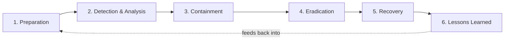

<p class="breadcrumb"><a href="./">Cybersecurity</a> › Incident Response &amp; Forensics</p>

# Incident Response & Forensics

No matter how good your defenses are, some attacks will succeed. Incident response (IR) is the discipline of detecting, containing, and recovering from those breaches in a structured, repeatable way — and digital forensics is the practice of reconstructing what happened without destroying the evidence. This page walks the full IR lifecycle, the first critical minutes after detection, the fundamentals of forensic evidence handling and chain of custody, and the metrics and post-incident reviews that turn every breach into a permanent improvement.

## The Incident Response Lifecycle

Mature incident response is not improvised. It follows a defined lifecycle so that, under the pressure of a live breach, responders execute a plan rather than guess. The two dominant references are the **NIST SP 800-61** four-phase model and the **SANS PICERL** six-phase model; they describe the same work at different granularities.



| SANS (PICERL) | NIST SP 800-61 | Core question |
|---|---|---|
| **P**reparation | Preparation | Are we ready before anything happens? |
| **I**dentification | Detection & Analysis | Is this actually an incident, and how bad? |
| **C**ontainment | Containment, Eradication & Recovery | How do we stop it spreading? |
| **E**radication | Containment, Eradication & Recovery | How do we remove the attacker? |
| **R**ecovery | Containment, Eradication & Recovery | How do we get back to normal safely? |
| **L**essons learned | Post-Incident Activity | How do we make sure it never happens again? |

The cycle is a loop, not a line: lessons learned feed directly back into preparation, hardening the organization against the next event.

### 1. Preparation

Everything you do *before* an incident determines how well the response goes. Preparation is unglamorous but is the single highest-leverage phase.

- **An incident response plan (IRP)** — written, approved, and rehearsed. It defines roles (incident commander, communications lead, forensic lead, legal/PR liaison), escalation thresholds, and decision authority.
- **A contact tree** — who to call at 3 a.m., including external parties: legal counsel, cyber-insurance carrier, an IR retainer firm, and law enforcement.
- **Tooling and access** — EDR/SIEM deployed, log retention configured, forensic imaging tools staged, and a clean out-of-band communication channel (an attacker in your email should not be able to read your incident-response email).
- **Runbooks** — step-by-step playbooks for common scenarios (ransomware, business email compromise, credential theft, data exfiltration).
- **Tabletop exercises** — practicing the plan on a simulated incident so that the first time the team uses it is not during a real breach.

### 2. Detection & Analysis

Detection is where an *event* (any observable occurrence) is triaged into an *incident* (an event that violates security policy or threatens assets). Sources include SIEM alerts, EDR detections, IDS/IPS signatures, user reports, threat-intel matches, and anomalies surfaced by threat hunting. The analyst's job is to answer:

- **Is this real?** (true positive vs. false positive)
- **What is the scope?** (one host or the whole domain?)
- **What is the severity?** (informational, low, high, critical)
- **What is the likely attacker objective?** (ransomware, espionage, fraud)

Accurate, fast analysis here drives every later decision and is directly measured by [MTTD](#mttd-and-mttr-measuring-response-performance).

### 3. Containment

Containment stops the bleeding. It is usually split into:

- **Short-term containment** — immediate, often crude actions to halt spread: isolating a host from the network, disabling a compromised account, blocking a malicious IP at the firewall.
- **Long-term containment** — temporary hardening that lets the business keep running while you prepare to eradicate: applying a patch, rotating credentials, tightening firewall rules around the affected segment.

The critical tension: **isolate the attacker without destroying the evidence**. Pulling the power cable stops the malware but also wipes RAM-resident encryption keys and process state you may need. Network-isolating the host (rather than powering it off) usually preserves volatile evidence while cutting the attacker's control channel.

### 4. Eradication

Once contained, the attacker and their footholds must be completely removed: deleting malware, closing backdoors, removing attacker-created accounts, and patching the vulnerability that enabled entry. The guiding principle is **assume thoroughness**: if you found one webshell, hunt for the others. Re-imaging from known-good media is often safer than cleaning in place, because a partially-cleaned host can re-infect the environment.

### 5. Recovery

Recovery restores systems to normal operation and confirms they are clean. This means restoring from trusted backups, rebuilding hosts, validating that the vulnerability is closed, and **monitoring closely** for signs the attacker returns. Recovery is staged and verified — bringing systems back one tier at a time with heightened logging — rather than flipping everything on at once.

### 6. Lessons Learned

Within a couple of weeks of closing the incident, the team conducts a [post-incident review](#post-incident-review-and-lessons-learned) to capture what happened, what worked, what didn't, and concrete improvements. This is where the loop closes.

## The Golden Hour: First Steps Matter

When you discover a breach, the first decisions are the most consequential — and the most common mistake is to react instinctively (reboot the box, delete the malware, yank the power) in a way that destroys the evidence you will later need. The disciplined opening moves:

```python
# Incident Response Checklist
def initial_response():
    # 1. Don't panic, don't turn anything off yet!
    log("Incident detected at", datetime.now())

    # 2. Preserve evidence
    capture_memory_dump()  # RAM contains encryption keys, passwords
    capture_network_connections()  # See what's communicating

    # 3. Contain the threat
    isolate_affected_systems()  # Prevent lateral movement

    # 4. Start documentation
    create_incident_timeline()

    # 5. Notify response team
    alert_security_team()
```

Why each step matters:

- **Don't power off.** RAM holds decryption keys, injected code, network sockets, and unsaved attacker state. A graceful shutdown or hard power-off discards all of it. Capture volatile memory *first*.
- **Isolate, don't destroy.** Network-isolate the host (disable the switch port, move it to a quarantine VLAN, or pull the cable) to sever the command-and-control channel while keeping the machine running for forensics.
- **Document from the first minute.** A timeline of "who did what, when" is both an operational aid and a legal record. Note timestamps in a consistent timezone (UTC is conventional) and record who took each action.
- **Activate the team, not a hero.** Incident response is a team sport with defined roles. The incident commander coordinates; analysts investigate; a communications lead handles internal and external messaging.

A useful mental model is the **order of volatility**: collect evidence from the most ephemeral source to the most durable — CPU registers and cache, then RAM, then network state and running processes, then disk, then archived logs and backups. Anything you touch on a higher-volatility tier may change a lower one, so capture in that order.

## Digital Forensics: CSI for Computers

Forensics is about finding out what happened *without destroying the evidence* — reconstructing the attacker's actions in a way that is both technically accurate and, if needed, defensible in court. The cardinal rule is to work on **copies**, never originals.

```python
# Memory forensics example: Finding malware in RAM
def analyze_memory_dump(dump_file):
    # Look for suspicious processes
    processes = extract_process_list(dump_file)
    for proc in processes:
        if proc.parent == "svchost.exe" and proc.name == "cmd.exe":
            # svchost shouldn't spawn command prompts!
            flag_suspicious(proc)

    # Extract network connections
    connections = extract_network_connections(dump_file)
    for conn in connections:
        if conn.destination_port == 4444:  # Common backdoor port
            flag_suspicious(conn)

    # Look for injection techniques
    for proc in processes:
        if has_injected_code(proc):
            extract_injected_code(proc)
```

### The Forensic Disciplines

Forensic analysis spans several evidence sources, each with its own tooling:

- **Memory forensics** — analyzing a RAM dump for running processes, injected code, network connections, and encryption keys. Tools: Volatility, Rekall. This is where fileless malware that never touches disk is caught.
- **Disk forensics** — examining a bit-for-bit image of storage for deleted files, file-system timestamps, registry artifacts, and slack space. Tools: Autopsy/The Sleuth Kit, FTK, EnCase.
- **Network forensics** — reconstructing sessions from packet captures and flow logs to trace lateral movement and exfiltration. Tools: Wireshark, Zeek, NetworkMiner.
- **Log and timeline analysis** — correlating events across hosts into a single ordered narrative ("super timeline"). Tools: Plaso/log2timeline, SIEM.

### Acquiring Evidence Soundly

A forensically sound acquisition has two properties: it is a **complete, exact copy**, and its **integrity is provable**.

- **Write-blockers** — hardware or software that lets you read a drive without writing a single byte to it, so the act of imaging cannot alter the original.
- **Bit-for-bit imaging** — capture the entire device (including unallocated space), not just the visible files. `dd` and `ewfacquire` are standard.
- **Cryptographic hashing** — compute a hash of the source and the image at acquisition time. If they match, the copy is verified identical; recomputing the hash later proves the evidence has not been altered.

```bash
# Acquire a forensic image and prove its integrity
# 1. Hash the source device first (read-only, behind a write-blocker)
sha256sum /dev/sdb > source.sha256

# 2. Create a bit-for-bit image
dd if=/dev/sdb of=evidence.img bs=4M conv=noerror,sync status=progress

# 3. Hash the image and confirm it matches the source
sha256sum evidence.img | tee image.sha256

# 4. From now on, work ONLY on copies of evidence.img.
#    Re-hashing later must still match image.sha256 — otherwise
#    the evidence is considered tampered and inadmissible.
```

## Chain of Custody

Technical accuracy is not enough if the evidence cannot be trusted. **Chain of custody** is the documented, unbroken record of who handled a piece of evidence, when, why, and how it was stored — from collection through analysis to final disposition. If there is a gap, the evidence can be challenged as having been altered, and in a legal proceeding it may be thrown out entirely.

A chain-of-custody record answers, for every transfer:

- **What** the evidence is (device, serial number, description, the acquisition hash).
- **Who** collected it and who currently holds it.
- **When** each transfer occurred (date and time).
- **Where** it was stored between transfers (e.g., a sealed evidence bag in a locked safe).
- **Why** it changed hands (analysis, transport, storage).

| Date / Time (UTC) | Item | Action | From → To | Hash verified |
|---|---|---|---|---|
| 2026-06-06 02:14 | HDD, S/N WD-1234 | Collected, imaged | Host → Forensic lead | `a1b2…` |
| 2026-06-06 03:40 | evidence.img | Copied for analysis | Forensic lead → Analyst | `a1b2…` ✓ |
| 2026-06-08 09:00 | HDD, S/N WD-1234 | Sealed for storage | Forensic lead → Evidence safe | `a1b2…` ✓ |

Practical safeguards that keep the chain intact: tamper-evident evidence bags, restricted physical access, hash re-verification at every transfer, and a single authoritative log. The hash that was recorded at acquisition is the anchor — verifying it at each step is what makes the chain provable rather than merely asserted.

## Post-Incident Review and Lessons Learned

The incident is not truly closed until the organization has learned from it. The **post-incident review** (also called a retrospective, after-action review, or "post-mortem") is held shortly after recovery, while memories are fresh, and produces a written report plus a tracked list of improvements.

### Run It Blameless

The most important cultural rule is that the review is **blameless**. The goal is to understand *why* the system allowed a mistake, not to punish the person who made it. A blame culture drives incidents underground — people hide problems, detection slows, and the next breach is worse. As the source operations material puts it, organizations should favor "blameless post-mortems for incidents" and reward, rather than punish, those who report.

### The Questions to Answer

Every incident is a learning opportunity. The review walks the kill chain backward:

1. **What was the initial entry point?** (Patch that vulnerability.)
2. **How did they move laterally?** (Improve segmentation.)
3. **What data was accessed?** (Enhance monitoring.)
4. **How long were they in?** (Improve detection.)

Beyond the technical timeline, a good review also asks:

- **What worked well?** Preserve and reinforce it.
- **Where did we lose time?** Detection lag, slow approvals, missing access, unclear ownership.
- **What was missing?** A runbook, a log source, a tool, a contact.
- **What are the action items?** Each must have an owner and a due date, and must be tracked to completion — an action item that is written down but never done is the same vulnerability waiting to be re-exploited.

A simple, durable format is "**what happened / what went well / what went wrong / action items**", with the action items linked to tickets so progress is visible.

## MTTD and MTTR: Measuring Response Performance

You cannot improve what you do not measure. Two metrics dominate incident-response performance, and they map directly onto the lifecycle phases.

- **MTTD — Mean Time To Detect.** The average elapsed time from when an attacker first compromises the environment to when defenders detect it. This measures the quality of the *detection* phase (and the *preparation* that fed it). Industry "dwell times" are often measured in weeks; driving MTTD down to hours or minutes is a primary objective of a security operations program.
- **MTTR — Mean Time To Respond** (or **Recover/Remediate**). The average time from detection to the incident being fully contained and resolved. This measures the *containment*, *eradication*, and *recovery* phases.

$$
\text{MTTD} = \frac{\sum_i (t^{\text{detect}}_i - t^{\text{compromise}}_i)}{N}
\qquad
\text{MTTR} = \frac{\sum_i (t^{\text{resolved}}_i - t^{\text{detect}}_i)}{N}
$$

where the sums run over the $N$ incidents in the measurement window.

Two related metrics often round out the picture:

- **MTTA — Mean Time To Acknowledge**: detection to a human picking up the alert. A long MTTA usually signals alert fatigue or understaffing.
- **MTTC — Mean Time To Contain**: detection to short-term containment, a useful sub-component of MTTR because containment is what actually stops the damage.

```python
def mttd_mttr(incidents):
    """incidents: list of dicts with epoch timestamps."""
    detect_deltas = [i["detected"] - i["compromised"] for i in incidents]
    resolve_deltas = [i["resolved"] - i["detected"] for i in incidents]
    mttd = sum(detect_deltas) / len(detect_deltas)
    mttr = sum(resolve_deltas) / len(resolve_deltas)
    return {"MTTD_seconds": mttd, "MTTR_seconds": mttr}
```

Trend these metrics over time rather than fixating on a single number. A falling MTTD shows detection engineering is paying off; a falling MTTR shows the response process and runbooks are maturing. Tracking them per incident type also reveals where to invest — if ransomware MTTR is high but phishing MTTR is low, the ransomware runbook needs work.

## See Also

- [Cybersecurity Hub](./) — the full security map
- [Operations & Compliance](operations-and-response.html) — SIEM, threat hunting, pentesting, and the compliance frameworks (GDPR's 72-hour breach notice) that constrain how you respond
- [Attacks & Network Defense](attacks-and-defense.html) — the attacks that trigger these incidents
- [Cryptography](cryptography.html) — the hashing that underpins forensic integrity and chain of custody
- [Web, Cloud & Container Security](application-and-cloud-security.html) — securing the systems you recover
