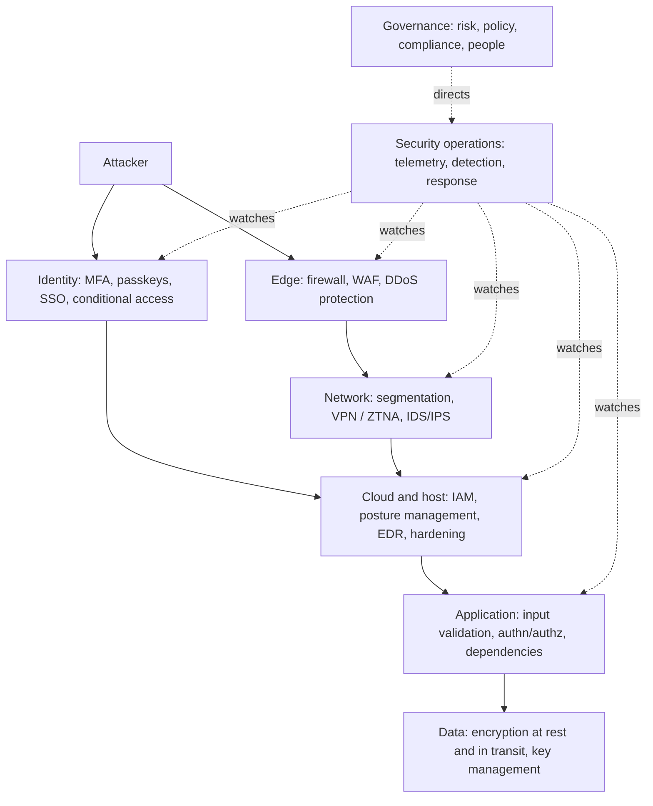

  <h1 style="color: white; margin: 0; font-size: 2.25rem;">Cybersecurity</h1>
  
Protecting systems, networks, and data from digital threats

**Cybersecurity** is the practice of protecting systems, networks, and data against unauthorized access, modification, and disruption. This hub covers the field in nine guides, from the cryptographic primitives that everything else depends on, through application, cloud, and network security, to the operational disciplines — security operations, incident response, governance, and privacy — that keep an organization defended over time. The recurring theme is **risk**: security does not aim for perfection but for reducing the likelihood and impact of realistic attacks at an acceptable cost.

## Core Concepts

A handful of ideas recur across every guide.

| Concept | Meaning |
|---------|---------|
| **CIA triad** | The three properties security protects: **confidentiality** (only authorized parties can read), **integrity** (data and systems are not altered without authorization), and **availability** (they work when needed). Authenticity and non-repudiation are often added. |
| **Threat model** | An explicit statement of what you are protecting, from whom, and how they could attack. A control is only meaningful relative to a threat model: disk encryption stops a laptop thief, not malware running as the logged-in user. |
| **Attack surface** | Every point where an attacker can interact with the system — exposed services, APIs, identities, dependencies, people. Reducing it is often cheaper than defending it. |
| **Defense in depth** | Layered, independent controls so that one failure does not become a full compromise. |
| **Least privilege** | Every user, service, and workload gets only the access it needs, for only as long as it needs it — limiting the blast radius of any compromise. |
| **Zero trust** | No implicit trust from network location: every request is authenticated, authorized, and encrypted based on identity and device posture (NIST SP 800-207). |
| **Assume breach** | Design and staff on the assumption that some attacks will succeed; detection, containment, and recovery matter as much as prevention. |

## How the Topics Fit Together

Defense in depth places independent controls at each layer an attacker must cross, with security operations watching all of them. Each layer maps to a guide in this hub:

Identity sits alongside the network edge as an entry point because, in cloud and SaaS environments, a stolen credential or session token often grants access without touching the network perimeter at all.

| Layer | Where it's covered |
|-------|--------------------|
| Data and encryption | [Cryptography](cryptography.html) |
| Application | [Application Security](application-and-cloud-security.html) |
| Cloud, host, and identity | [Cloud & Container Security](cloud-and-container-security.html) |
| Edge and network | [Attacks & Network Defense](attacks-and-defense.html) |
| Detection and response | [Security Operations](security-operations.html), [Incident Response & Forensics](incident-response.html) |
| Governance and people | [Compliance & Governance](compliance-and-governance.html) |
| Personal data | [Privacy Engineering](privacy-engineering.html) |

## Guides in This Hub

| Guide | What it covers |
|-------|----------------|
| [Cryptography](cryptography.html) | Authenticated encryption, hashing and password storage, key exchange and signatures, TLS 1.3 and the Web PKI, post-quantum migration (ML-KEM, ML-DSA), zero-knowledge proofs, homomorphic encryption, and the math behind RSA, elliptic curves, and secret sharing |
| [Application Security](application-and-cloud-security.html) | The OWASP Top 10, injection, XSS and CSRF, SSRF, authentication and authorization (JWT, OAuth, OIDC), sessions, API security, and the secure development lifecycle |
| [Cloud & Container Security](cloud-and-container-security.html) | Shared responsibility, cloud IAM and least privilege, posture management, image hardening, container and Kubernetes runtime security, and admission control |
| [Attacks & Network Defense](attacks-and-defense.html) | Firewalls, VPNs, and IDS/IPS; social engineering, supply-chain attacks, and ransomware; side-channel and ML attacks |
| [Security Operations](security-operations.html) | Running a SOC: SIEM pipelines, detection engineering with MITRE ATT&CK, threat hunting, and offensive validation (penetration tests, red/blue/purple teams) |
| [Incident Response & Forensics](incident-response.html) | The IR lifecycle (NIST SP 800-61r3, SANS), the first hour, regulatory notification deadlines, memory/disk/cloud forensics, chain of custody, and MTTD/MTTR |
| [Compliance & Governance](compliance-and-governance.html) | GDPR, NIS2, DORA, and the Cyber Resilience Act; PCI DSS v4; SOC 2 and ISO 27001; NIST CSF 2.0; quantitative risk (ALE, FAIR); third-party risk; metrics and maturity |
| [Privacy Engineering](privacy-engineering.html) | Privacy by design, LINDDUN threat modeling, data minimization, tokenization, differential privacy, consent, and data-subject rights in practice |
| [Foundations, Operations & Research](operations-and-response.html) | Formal security (security games, universal composability) and research frontiers: secure multi-party computation, differential privacy, the quantum threat, and AI in attack and defense |

### Suggested Reading Paths

- **Software engineers**: [Cryptography](cryptography.html) → [Application Security](application-and-cloud-security.html) → [Cloud & Container Security](cloud-and-container-security.html) → [Privacy Engineering](privacy-engineering.html).
- **Security operations and incident responders**: [Attacks & Network Defense](attacks-and-defense.html) → [Security Operations](security-operations.html) → [Incident Response & Forensics](incident-response.html).
- **Security leaders and GRC**: [Compliance & Governance](compliance-and-governance.html) → [Incident Response & Forensics](incident-response.html) → [Privacy Engineering](privacy-engineering.html).
- **Theory**: [Cryptography](cryptography.html) → [Foundations, Operations & Research](operations-and-response.html) → [Advanced Cryptography](../../advanced/cryptography/).

## The Threat Landscape

Attack techniques change quickly, but the ways attackers get in are remarkably stable. Mandiant's M-Trends 2025 report, covering intrusions investigated in 2024, found that **exploitation of vulnerabilities** was the most common initial access vector (33%), followed by **stolen credentials** (16%) — the latter rising sharply with the growth of infostealer malware that harvests saved passwords and session cookies from personal and corporate devices. Other persistent patterns:

- **Identity is the primary target.** Cloud and SaaS breaches overwhelmingly begin with a valid credential or token rather than a network exploit, and attackers increasingly bypass MFA through adversary-in-the-middle phishing kits, MFA-fatigue prompts, and help-desk social engineering. Phishing-resistant authentication (FIDO2 security keys and passkeys) is the structural fix.
- **Edge devices are exploited at scale.** VPN concentrators, firewalls, and file-transfer appliances are internet-facing, run with high privilege, and often lack EDR; their vulnerabilities are regularly exploited within days of disclosure. CISA's Known Exploited Vulnerabilities (KEV) catalog is the standard prioritization list.
- **Ransomware is a data-theft business.** Most groups now exfiltrate data before encrypting it, extorting victims twice, and some skip encryption entirely.
- **Supply-chain compromise** — malicious packages in public registries, compromised build systems, and breaches of shared service providers — turns one intrusion into thousands.
- **AI on both sides.** Attackers use generative AI for convincing phishing, voice cloning, and faster reconnaissance; defenders use it for alert triage and detection engineering. AI systems themselves add a new attack surface, including prompt injection against LLM-based agents.

The implication is that the basics still stop most intrusions: patch internet-facing systems fast (especially KEV entries), deploy phishing-resistant MFA, remove standing administrative privilege, keep offline or immutable backups, and collect enough telemetry to detect what gets through.

## Protecting Passwords: A Worked Example

Password storage illustrates how several of these ideas combine. When a website's user database is stolen — LinkedIn's 2012 breach eventually exposed about 117 million unsalted SHA-1 hashes — the attacker attempts to recover passwords offline, at whatever speed their hardware allows.

| Storage method | What an attacker with the database can do |
|----------------|------------------------------------------|
| Plaintext | Read every password immediately |
| Unsalted fast hash (MD5, SHA-1, SHA-256) | Look up common passwords in precomputed (rainbow) tables; crack the rest at billions of guesses per second on GPUs |
| Salted fast hash | Tables no longer work, but each account can still be attacked at billions of guesses per second |
| Salted slow, memory-hard hash (Argon2id, scrypt, bcrypt) | Each guess costs milliseconds and megabytes of memory, making large-scale cracking expensive |
| Passkeys (no shared secret) | Nothing to crack: the server stores only a public key |

The correct choice is the last row where possible and Argon2id otherwise, with MFA protecting against the passwords that are reused or phished regardless of how they are stored. Parameter recommendations and code are in [Cryptography: Password Hashing](cryptography.html#password-hashing).

## References and Further Reading

### Books

- Ferguson, Schneier & Kohno — *Cryptography Engineering*
- Aumasson — *Serious Cryptography* (2nd ed., 2024)
- Boneh & Shoup — *A Graduate Course in Applied Cryptography* (free online)
- Katz & Lindell — *Introduction to Modern Cryptography*
- Anderson — *Security Engineering* (3rd ed.)
- Dowd, McDonald & Schuh — *The Art of Software Security Assessment*
- Zalewski — *The Tangled Web*

### Standards and Frameworks

- OWASP Top 10, Application Security Verification Standard (ASVS), and Cheat Sheet Series
- NIST Cybersecurity Framework 2.0, SP 800-53, SP 800-61r3, SP 800-207 (zero trust)
- MITRE ATT&CK — adversary tactics and techniques
- CIS Controls v8.1 and CIS Benchmarks
- CISA Known Exploited Vulnerabilities catalog

### Staying Current

- Google Project Zero and vendor threat-intelligence reports (Mandiant M-Trends, Verizon DBIR, CrowdStrike Global Threat Report)
- Krebs on Security; Schneier on Security
- SANS Internet Storm Center
- Podcasts: Risky Business, Darknet Diaries, Security Now
- Academic venues: IEEE S&P, USENIX Security, ACM CCS, NDSS, Real World Crypto

### Hands-On Practice

- **CTFs and labs**: picoCTF, OverTheWire, Hack The Box, TryHackMe, PortSwigger Web Security Academy (free)
- **Bug bounty platforms**: HackerOne, Bugcrowd, Intigriti
- **Cloud**: intentionally vulnerable environments such as CloudGoat (AWS) and the cloud providers' own security services (AWS Security Hub, Microsoft Defender for Cloud, Google Security Command Center)
- **Certifications**: entry — CompTIA Security+; practitioner — CySA+, GIAC GSEC/GCIH, OSCP; management — CISSP, CISM; advanced offensive — OffSec OSEP, OSWE, OSED (together OSCE3)

<i class="fas fa-code"></i> Full implementation examples:
<a href="https://github.com/andrewaltimit/Documentation/blob/main/github-pages/code-examples/technology/cybersecurity/cryptographic_foundations.py">cryptographic_foundations.py</a>
<a href="https://github.com/andrewaltimit/Documentation/blob/main/github-pages/code-examples/technology/cybersecurity/advanced_attacks.py">advanced_attacks.py</a>
<a href="https://github.com/andrewaltimit/Documentation/blob/main/github-pages/code-examples/technology/cybersecurity/ml_security.py">ml_security.py</a>
<a href="https://github.com/andrewaltimit/Documentation/blob/main/github-pages/code-examples/technology/cybersecurity/memory_forensics.py">memory_forensics.py</a>

## See Also

Related sections elsewhere on the site:

- [Networking](../networking/) — the protocols and routing that network security defends
- [AWS Security](../aws/security.html) — cloud security controls and the shared-responsibility model on AWS
- [Docker: Storage & Security](../docker/storage-security.html) — container isolation and image security
- [Kubernetes](../kubernetes/) — orchestration and workload security
- [Quantum Computing](../quantumcomputing.html) — the hardware behind the post-quantum threat
- [Advanced Cryptography](../../advanced/cryptography/) — formal foundations of the primitives used here
