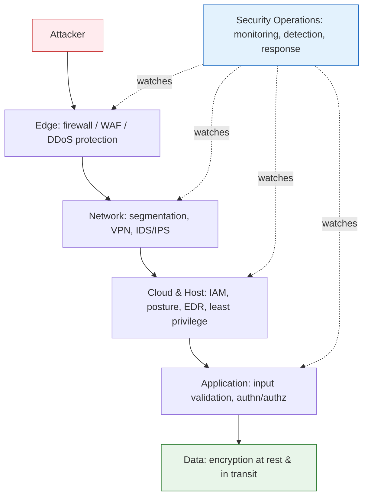

<div class="hero-section" style="background: linear-gradient(135deg, #4facfe 0%, #00f2fe 100%); color: white; padding: 2rem; margin: -2rem -3rem 2rem -3rem; text-align: center;">
  <h1 style="color: white; margin: 0; font-size: 2.25rem;">Cybersecurity</h1>
  <p style="font-size: 1.1rem; margin-top: 0.75rem; opacity: 0.9;">Protecting systems, networks, and data from digital threats</p>
</div>

Cybersecurity is the practice of protecting systems, networks, and data from digital attacks, unauthorized access, and damage. This hub builds from everyday risks (passwords, public WiFi) up through cryptography, web and cloud security, attack techniques, and incident response. The recurring theme is **threat modeling**: security reduces risk against a realistic set of attackers rather than achieving perfection, and every control is a trade-off between protection, cost, and usability.

## How the Topics Fit Together

Effective security is layered — no single control is trusted to stop everything. This **defense-in-depth** model means an attacker who breaches one layer still faces the next. Each layer maps onto the guides in this hub:



| Layer | Where it's covered |
|-------|--------------------|
| Edge & Network | [Attacks & Network Defense](attacks-and-defense.html) |
| Host & Cloud | [Cloud & Container Security](cloud-and-container-security.html) |
| Application | [Application Security](application-and-cloud-security.html) |
| Data (encryption) | [Cryptography](cryptography.html) |
| Detection & Response | [Security Operations](operations-and-response.html) |
| People & Privacy | [Privacy Engineering](privacy-engineering.html) |

---

## Guides in This Hub

| Guide | What it covers |
|-------|----------------|
| [Cryptography](cryptography.html) | Symmetric and public-key encryption, ECC, post-quantum, zero-knowledge and homomorphic encryption, and the math behind RSA, elliptic curves, and secret sharing |
| [Application Security](application-and-cloud-security.html) | SQL injection, XSS, CSRF, authentication and session handling, JWTs, the OWASP Top 10, and secure-by-design development |
| [Cloud & Container Security](cloud-and-container-security.html) | Shared-responsibility model, IAM and identity, cloud posture management, container hardening, and Kubernetes workload security |
| [Attacks & Network Defense](attacks-and-defense.html) | Firewalls, VPNs, and IDS/IPS; social engineering, supply chain and ransomware; side-channel and ML attacks |
| [Security Operations & Response](operations-and-response.html) | Hub for running security day to day — the SOC, incident response, and compliance; branches into the three guides below |
| [Incident Response & Forensics](incident-response.html) | When prevention fails: detect, contain, eradicate, recover, and run a blameless post-mortem |
| [Security Operations](security-operations.html) | The SOC, SIEM pipelines, detection engineering, threat hunting, and offensive testing (pentests, red/blue/purple teams) |
| [Compliance & Governance](compliance-and-governance.html) | Turning security into a program — frameworks, risk management, GDPR/PCI, people, and metrics |
| [Privacy Engineering](privacy-engineering.html) | Protecting people, not just data — privacy by design, data minimization, differential privacy, and legal obligations |

---

## Your Digital Life Under Attack

Every day, you face security threats that most people don't even realize exist. When you type your password into a website, how do you know someone isn't watching? When you connect to public WiFi, who else might be listening? These aren't abstract concerns—they're real vulnerabilities that attackers exploit every day.

### The Password Problem

Let's start with something everyone uses: passwords. You've probably heard advice like "use strong passwords" and "don't reuse them," but understanding why reveals the first layer of cybersecurity.

#### Why Your Password Isn't Safe

When you create an account on a website, your password needs to be stored somehow. But here's the problem: if the website stores your actual password and gets hacked, every user's password is exposed. This happened to LinkedIn in 2012, initially exposing 6.5 million password hashes (later revealed to affect ~117M accounts).

The solution? **Hashing**—a one-way mathematical function that transforms your password into a fixed-length string of characters. Even if hackers steal the database, they can't reverse the hash to get your original password.

```python
# This is what happens to your password
import hashlib

password = "MySecretPass123!"
hashed = hashlib.sha256(password.encode()).hexdigest()
print(f"Your password: {password}")
print(f"What gets stored: {hashed}")
# Output: What gets stored: 7a37b85c8918eac19a9089c0fa5a2ab4dce3f90528dcdeec108b23ddf3607b99
```

But wait—if the same password always produces the same hash, couldn't attackers just compute hashes for common passwords and look them up? They could, and they do. These are called **rainbow tables**.

#### Adding Salt: Making Each Password Unique

To defeat rainbow tables, we add "salt"—random data mixed with your password before hashing. Now even if two users have the same password, their hashes are different:

```python
import bcrypt

def secure_password_storage(password):
    # CRITICAL: Never use SHA256 for password hashing - it's too fast!
    # Use bcrypt, scrypt, or Argon2 instead.
    #
    # bcrypt generates a fresh random salt each call and embeds it in the
    # output, so identical passwords still produce different hashes — and
    # there is no separate salt to store. Cost factor 12 is a good default;
    # raise it as hardware gets faster.
    return bcrypt.hashpw(password.encode('utf-8'), bcrypt.gensalt(rounds=12))

def verify_password(password, hashed):
    # Re-derives the hash using the salt embedded in `hashed`, in constant time
    return bcrypt.checkpw(password.encode('utf-8'), hashed)

# Even identical passwords get different hashes
pwd = "CommonPassword123"
hash1 = secure_password_storage(pwd)
hash2 = secure_password_storage(pwd)
print("Same password, different hashes:")
print(f"Hash 1: {hash1.decode()}")
print(f"Hash 2: {hash2.decode()}")  # differs from hash1, yet both verify
```

But modern attackers have GPUs that can compute billions of hashes per second. This is why security experts now recommend specialized password hashing functions like **bcrypt**, **scrypt**, or **Argon2** that are intentionally slow and memory-intensive, making brute-force attacks impractical.

### The WiFi You're Connected To

When you connect to a coffee shop's WiFi, you're essentially shouting your data across a crowded room. Anyone with the right tools can listen in. Here's what an attacker might see:

```bash
# What an attacker sees on unsecured WiFi (simplified)
Packet captured: HTTP GET /login
Host: example-bank.com
Username: john.doe@email.com
Password: MyBankPassword123
```

This is why websites use HTTPS—the 'S' stands for Secure. But how does HTTPS actually protect you? That brings us to one of the most important concepts in cybersecurity: **encryption**, covered in depth in [Cryptography](cryptography.html).

---

## Key Takeaways

- **Basics stop most attacks.** Strong unique passwords, MFA, encryption, and timely patching defeat the overwhelming majority of real-world intrusions.
- **Defense in depth.** No single control is perfect; layered, overlapping defenses ensure one failure does not become a full compromise.
- **Think like an attacker.** Understanding how injection, phishing, and lateral movement actually work is what lets you defend against them.
- **Security is everyone's job.** Technology cannot protect against careless users — culture, training, and usable controls are part of the system.
- **Plan for failure.** Assume breaches will happen; detection, logging, and a rehearsed incident-response plan limit the damage when they do.
- **It's an ongoing journey.** Every new technology brings new vulnerabilities and every defense spawns new attacks.

A practical starting checklist: enable MFA on important accounts, use a password manager, keep software updated, learn to recognize phishing, know what data you're protecting, and rehearse incident response. Perfect security doesn't exist, but every improvement makes you a harder target.

---

## References and Further Reading

### Getting Started
- **"The Web Application Hacker's Handbook"** - Stuttard & Pinto
- **"Practical Cryptography"** - Ferguson & Schneier
- **OWASP Top 10** - Essential web security risks
- **SANS Reading Room** - Free security papers

### Intermediate Resources
- **"Applied Cryptography"** - Bruce Schneier
- **"The Art of Software Security Assessment"** - Dowd et al.
- **"Network Security: Private Communication in a Public World"** - Kaufman et al.
- **Hack The Box** - Hands-on penetration testing practice

### Advanced Study
- **"Introduction to Modern Cryptography"** - Katz & Lindell
- **"A Graduate Course in Applied Cryptography"** - Boneh & Shoup
- **"The Tangled Web"** - Michal Zalewski
- **Academic conferences**: IEEE S&P, USENIX Security, CCS, NDSS

### Staying Current
- **Krebs on Security** - Brian Krebs' security journalism
- **Schneier on Security** - Bruce Schneier's blog
- **Google Project Zero** - Cutting-edge vulnerability research
- **The Hacker News** - Daily security news
- **SANS Internet Storm Center** - Real-time threat intelligence
- **Security podcasts**: Darknet Diaries, Security Now, Risky Business, The CyberWire

### Emerging Threats
- **AI-Powered Attacks**: Automated vulnerability discovery, deepfakes, prompt injection
- **Ransomware Evolution**: Double/triple extortion, RaaS sophistication
- **Cloud Security**: Misconfigurations remain #1 issue
- **IoT/OT Security**: Critical infrastructure targeting
- **API Security**: Now the #1 attack vector for web apps

### Hands-On Learning
- **CTF Platforms**: PicoCTF, OverTheWire, HackTheBox, TryHackMe
- **Bug bounty programs**: HackerOne, Bugcrowd, Synack
- **Cloud Security**: AWS Security Hub, Azure Security Center labs
- **Security certifications**:
  - Entry: Security+, CySA+
  - Mid: CISSP, CEH, GSEC
  - Advanced: OSCP, OSCE, SANS expert tracks
- **Build your own lab**: Docker containers for safe practice

<div class="code-reference">
<i class="fas fa-code"></i> Full implementation examples:
<a href="https://github.com/andrewaltimit/Documentation/blob/main/github-pages/code-examples/technology/cybersecurity/cryptographic_foundations.py">cryptographic_foundations.py</a>
<a href="https://github.com/andrewaltimit/Documentation/blob/main/github-pages/code-examples/technology/cybersecurity/advanced_attacks.py">advanced_attacks.py</a>
<a href="https://github.com/andrewaltimit/Documentation/blob/main/github-pages/code-examples/technology/cybersecurity/ml_security.py">ml_security.py</a>
</div>

## See Also

The nine in-hub guides are listed in [Guides in This Hub](#guides-in-this-hub) above. Related sections elsewhere on the site:

- [Networking](../networking/) — the protocols and routing security defends
- [AWS](../aws/) — cloud security controls and the shared-responsibility model
- [Docker](../docker/) — container isolation and image security
- [Kubernetes](../kubernetes/) — orchestration and workload security
- [Quantum Computing](../quantumcomputing.html) — post-quantum cryptography and quantum threats
