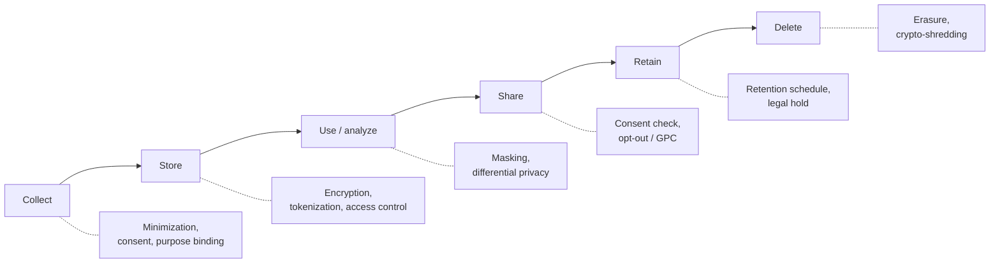

<p class="breadcrumb"><a href="./">Cybersecurity</a> › Privacy Engineering</p>

# Privacy Engineering

Security keeps attackers out; privacy controls what the organization itself does with the data it legitimately holds. Privacy engineering is the discipline of translating abstract legal principles — GDPR's "data protection by design and by default," the CCPA's consumer rights — into concrete architecture: schemas that collect less, pipelines that mask and tokenize, queries that add calibrated noise, and consent records that gate every downstream use. This page covers privacy-by-design, data minimization and retention, PII discovery and masking/tokenization, differential privacy in practice, consent management, and the operational reality of GDPR and CCPA/CPRA.

> **Privacy ≠ security.** A perfectly encrypted, breach-free system can still violate privacy by collecting too much, keeping it too long, or using it for purposes the subject never agreed to. Privacy engineering targets *what you do with data*, not just *who can steal it*.

The controls on this page attach to a data lifecycle: each stage has a corresponding technique that limits exposure.



## Privacy by Design

"Privacy by Design" (PbD), formalized by Ann Cavoukian in the 1990s and later written into GDPR Article 25 as **data protection by design and by default**, is the principle that privacy must be engineered into systems from the start rather than bolted on after launch. The seven foundational principles, in engineering terms:

| Principle | What it means in code/architecture |
|-----------|-------------------------------------|
| **Proactive, not reactive** | Threat-model privacy harms during design review, before the first row is collected |
| **Privacy as the default** | Opt-in, not opt-out; the most protective setting ships enabled |
| **Privacy embedded into design** | Minimization and access control are schema/IAM concerns, not a banner |
| **Full functionality (positive-sum)** | Reject the false choice "privacy *or* features" — solve for both |
| **End-to-end security** | Encrypt at rest and in transit across the full data lifecycle |
| **Visibility and transparency** | Data flows are documented, auditable, and explainable to subjects |
| **Respect for user privacy** | User-centric defaults, clear notices, easy rights exercise |

### Privacy by Default in Practice

The "by default" half of Article 25 is the one most often violated. It says the *factory setting* must be the privacy-protective one.

```python
# ANTI-PATTERN: privacy is opt-out, defaults leak data
class UserProfile:
    def __init__(self):
        self.share_with_partners = True    # on by default — non-compliant
        self.public_profile = True          # exposed unless user hunts for the toggle
        self.retain_forever = True

# PRIVACY BY DEFAULT: most protective setting ships enabled
class UserProfile:
    def __init__(self):
        self.share_with_partners = False   # requires explicit opt-in
        self.public_profile = False        # visible to the user only
        self.purpose = "account_management" # bound to a declared purpose
        self.retention_days = 365           # bounded, not "forever"
```

### The Privacy Threat Model: LINDDUN

Where security threat modeling uses STRIDE, privacy engineering uses **LINDDUN**, a mnemonic for seven privacy threat categories checked against every element of a system's data-flow diagram:

| Threat | The risk |
|--------|----------|
| **L**inking | Correlating records back to one person across sources |
| **I**dentifying | Re-identifying someone behind a "pseudonym" |
| **N**on-repudiation | A subject cannot plausibly deny an action they wanted private |
| **D**etecting | Inferring that someone is in the dataset from observable side effects |
| **D**ata disclosure | Excessive or unnecessary exposure of personal data |
| **U**nawareness | The subject cannot understand or act on their rights |
| **N**on-compliance | The system's practice diverges from its stated policy or the law |

For each data flow, store, and process, you ask "which of these can happen here?" and add a control. *Linking* and *Identifying* are the engine behind most re-identification scandals — the 1990s Massachusetts GIC release, the "anonymized" Netflix Prize ratings, and AOL search logs were all defeated by joining quasi-identifiers across datasets. The LINDDUN project now also publishes a lightweight card-deck variant (LINDDUN GO) for faster workshops.

## Data Minimization and Retention

Two of the strongest, cheapest privacy controls are simply **collecting less** and **keeping it for less time**. Data you never collected cannot be breached, subpoenaed, sold, or misused.

### Minimization: Collect Only What the Purpose Requires

GDPR Article 5(1)(c) requires personal data to be "adequate, relevant and limited to what is necessary." The engineering test is the **purpose binding** question: for each field, *which declared purpose makes this column necessary?* If none, drop it.

```python
# The minimization checklist, encoded as a schema gate
REQUIRED_FOR = {
    "email":        {"account_login", "transactional_email"},
    "shipping_addr":{"order_fulfillment"},
    "date_of_birth":{"age_verification"},          # store age band, not raw DOB, if possible
    # "phone":      collected "just in case" -> NO declared purpose -> reject
}

def validate_collection(field, active_purposes):
    needed_by = REQUIRED_FOR.get(field, set())
    if not (needed_by & active_purposes):
        raise PrivacyViolation(
            f"Field '{field}' has no purpose justifying collection"
        )
```

Common minimization moves:

- **Derive, don't store.** Keep an `age_band` ("25-34"), not a raw date of birth; a `country`, not a precise GPS fix.
- **Truncate at the edge.** Drop the last octet of an IP, round timestamps to the hour.
- **Reference, don't copy.** Hold a tokenized handle to data in a system of record rather than replicating PII into every microservice.

### Retention: Keep It Only as Long as the Purpose Lasts

"Storage limitation" (Article 5(1)(e)) requires data to be kept "no longer than is necessary." Implement it as a **retention schedule** — a per-category TTL with automated, logged deletion:

```python
# Retention schedule: category -> max age, enforced by a scheduled job
RETENTION = {
    "session_logs":      timedelta(days=30),
    "order_history":     timedelta(days=365 * 7),   # tax/accounting obligation
    "marketing_profile": timedelta(days=180),
    "support_tickets":   timedelta(days=365 * 2),
}

def enforce_retention(now):
    for category, max_age in RETENTION.items():
        cutoff = now - max_age
        deleted = db.delete(category, where=f"created_at < {cutoff}")
        audit_log.record("retention_deletion", category=category,
                         rows=deleted, cutoff=cutoff)  # prove compliance later
```

Note the tension with **legal hold** and statutory retention: tax records, KYC/AML data, and litigation holds *override* a delete request. A correct retention engine knows the difference between "the user asked us to forget them" and "the law requires us to keep this for seven years."

> **Crypto-shredding.** When physical deletion is impractical (immutable backups, append-only logs), encrypt each subject's data under a per-subject key and *destroy the key* to render the ciphertext permanently unreadable. This is the standard pattern for honoring erasure against backups.

## PII Discovery, Masking, and Tokenization

You cannot protect data you cannot find. Mature programs run continuous **PII discovery** (data classification) across databases, object storage, logs, and data lakes — then apply masking or tokenization to reduce exposure.

### Discovery and Classification

Classification scanners combine pattern matching (regex for emails, SSNs, card numbers with Luhn validation), dictionary/NER models for names and addresses, and column-statistics heuristics. Cloud-native tools (AWS Macie, Google Cloud DLP, Microsoft Purview) tag findings with a sensitivity level that downstream access policies key off.

```python
import re

# Validators are stronger than naked regex: a Luhn check rejects most false positives
def looks_like_card(s):
    digits = [int(c) for c in s if c.isdigit()]
    if not 13 <= len(digits) <= 19:
        return False
    # Luhn checksum
    total, parity = 0, len(digits) % 2
    for i, d in enumerate(digits):
        if i % 2 == parity:
            d *= 2
            if d > 9:
                d -= 9
        total += d
    return total % 10 == 0

PII_PATTERNS = {
    "email": re.compile(r"\b[\w.+-]+@[\w-]+\.[\w.-]+\b"),
    "ssn":   re.compile(r"\b\d{3}-\d{2}-\d{4}\b"),
    "ipv4":  re.compile(r"\b(?:\d{1,3}\.){3}\d{1,3}\b"),
}
```

### Masking vs. Tokenization vs. Encryption

These three are constantly confused. They solve different problems:

| Technique | Reversible? | Format-preserving? | Typical use |
|-----------|-------------|--------------------|-------------|
| **Masking / redaction** | No (static) | Often | Non-prod test data, UI display (`****1234`), logs |
| **Tokenization** | Yes, via a token vault | Yes | Payment cards (PCI scope reduction), SSNs, analytics joins |
| **Encryption** | Yes, with the key | No (ciphertext) | Data at rest/in transit, anywhere you need the value back |

**Masking** irreversibly replaces a value, optionally preserving format. **Static masking** produces a sanitized copy (e.g., a scrubbed staging database); **dynamic masking** rewrites query results at read time based on the caller's role.

```python
def mask_pan(card_number):
    # PCI-style display masking: first 6 + last 4 visible, rest hidden
    n = len(card_number)
    return card_number[:6] + "*" * (n - 10) + card_number[-4:]

def mask_email(addr):
    user, _, domain = addr.partition("@")
    head = user[0] if user else ""
    return f"{head}***@{domain}"
```

**Tokenization** swaps a sensitive value for a non-sensitive surrogate (the *token*) and stores the mapping in a hardened **token vault**. Crucially, the token has *no mathematical relationship* to the original — unlike ciphertext, you cannot brute-force it without the vault. This is why PCI DSS treats a properly tokenized environment as **out of scope** for cardholder data: the application databases hold only tokens.

```python
import secrets

class TokenVault:
    """Maps sensitive values to random surrogates. The vault is the only
    PCI-in-scope component; everything downstream stores tokens only."""
    def __init__(self):
        self._to_token = {}   # value -> token (deterministic for join stability)
        self._to_value = {}   # token -> value

    def tokenize(self, value):
        if value in self._to_token:          # deterministic: same value -> same token
            return self._to_token[value]      # so analytics joins still work
        token = "tok_" + secrets.token_urlsafe(16)
        self._to_token[value] = token
        self._to_value[token] = value
        return token

    def detokenize(self, token):
        # Access-controlled, audited, and rate-limited in a real vault
        return self._to_value[token]

# Application & analytics see only "tok_..."; raw PANs never leave the vault.
```

**Format-preserving encryption (FPE)** is a middle ground: ciphertext that keeps the original format (a 16-digit "card number" maps to another 16-digit string), useful when a legacy schema demands a specific shape but you still need reversibility under a key. NIST specifies FPE in SP 800-38G. Note the moving target here: after Betül Durak and colleagues, and later Ohad Amon, Orr Dunkelman, and Eyal Ronen, showed practical attacks against the **FF3/FF3-1** tweak schedule, NIST's 2025 draft revision (SP 800-38G Rev. 1) **removes FF3-1 entirely** and retains only **FF1**, tightening it to a minimum domain of one million values. New designs should use FF1 over a large domain, or prefer tokenization where the format constraint is the only reason FPE was considered.

## Differential Privacy in Practice

Masking and tokenization protect *records*. They do nothing against **inference attacks**, where an analyst learns about an individual from aggregate statistics — the classic example being two near-identical queries ("average salary of all employees" vs. "average salary excluding Alice") that reveal Alice's salary by subtraction. **Differential privacy (DP)** is the rigorous defense.

### The Definition

A randomized mechanism $M$ is **ε-differentially private** if, for any two datasets $D$ and $D'$ that differ in a single individual's record, and for every possible output $S$:

$$
\Pr[M(D) \in S] \le e^{\varepsilon} \cdot \Pr[M(D') \in S]
$$

Intuitively: whether or not *your* record is in the dataset, the distribution of outputs barely changes — so the output cannot reveal much about you specifically. The **privacy budget** ε is the knob: small ε (e.g., 0.1) means strong privacy and noisier answers; large ε (e.g., 10) means weak privacy and accurate answers. ε is consumed across queries and **composes additively**, so a fixed total budget must be allocated carefully.

The relaxed (ε, δ)-DP allows a small failure probability δ (kept far below $1/n$ for a dataset of $n$ people):

$$
\Pr[M(D) \in S] \le e^{\varepsilon} \cdot \Pr[M(D') \in S] + \delta
$$

This relaxation is what the **Gaussian mechanism** (adding normally-distributed noise) satisfies, and it is the basis for the tight composition accounting — Rényi DP and the "moments accountant" — that makes training ML models with DP-SGD practical. For choosing and defending ε in a real deployment, NIST published **SP 800-226, *Guidelines for Evaluating Differential Privacy Guarantees*** (2025), which catalogs the common "DP hazards" (mis-set neighboring definitions, floating-point leaks, unbounded sensitivity) that quietly void the guarantee in practice.

### The Laplace Mechanism

For a numeric query $f$, DP is achieved by adding noise calibrated to the query's **sensitivity** — the most the answer can change when one person's record changes:

$$
\Delta f = \max_{D, D'} \lvert f(D) - f(D') \rvert
$$

Add Laplace noise with scale $b = \Delta f / \varepsilon$:

$$
M(D) = f(D) + \mathrm{Laplace}\!\left(0, \frac{\Delta f}{\varepsilon}\right)
$$

```python
import numpy as np

def dp_count(true_count, epsilon):
    # A count query has sensitivity 1: adding/removing one person changes
    # the count by at most 1.
    sensitivity = 1.0
    noise = np.random.laplace(0.0, sensitivity / epsilon)
    return true_count + noise

def dp_mean(values, lower, upper, epsilon):
    # Clamp to a known range so sensitivity is bounded, then split the budget
    # across the sum and the count (each is its own query).
    vals = np.clip(values, lower, upper)
    n = len(vals)
    sens_sum = upper - lower            # one record moves the sum by <= range
    noisy_sum   = vals.sum() + np.random.laplace(0, sens_sum / (epsilon / 2))
    noisy_count = n          + np.random.laplace(0, 1.0      / (epsilon / 2))
    return noisy_sum / max(noisy_count, 1)
```

### Local vs. Central DP, and Real Deployments

- **Central DP** trusts a curator to hold raw data and add noise to released aggregates (smaller noise, used by the **US Census Bureau** for the 2020 redistricting data).
- **Local DP** has each *user* randomize their own value before it ever leaves the device (larger noise, but no trusted curator). Apple's keyboard/emoji telemetry uses local DP, and Google's **RAPPOR** in Chrome pioneered the approach for browser statistics.

> **DP is not a silver bullet.** A tight ε is hard to spend across many queries, choosing ε is a policy decision with real utility cost, and DP protects against inference — it does not replace access control, encryption, or minimization. Use it *with* the other controls.

## Consent Management

Several legal bases permit processing (contract, legal obligation, legitimate interest), but **consent** is the one that requires the most engineering. Under GDPR, valid consent must be **freely given, specific, informed, and unambiguous**, captured by a clear affirmative action — pre-ticked boxes and "by using this site you agree" banners are invalid.

A **Consent Management Platform (CMP)** must do four things well:

1. **Capture** granular, per-purpose consent with a clear affirmative action.
2. **Store** an immutable, timestamped record (proof of consent is the controller's burden).
3. **Enforce** it — every downstream process checks consent before acting.
4. **Honor withdrawal** — withdrawing must be as easy as granting, and it propagates.

```python
from dataclasses import dataclass, field
from datetime import datetime, timezone

@dataclass(frozen=True)            # immutable: an audit record, never edited
class ConsentRecord:
    subject_id: str
    purpose: str                   # "analytics", "marketing_email", ...
    granted: bool
    timestamp: datetime
    policy_version: str            # which notice the subject actually saw
    method: str = "explicit_optin"

class ConsentLedger:
    def __init__(self):
        self._events = []          # append-only history

    def record(self, subject_id, purpose, granted, policy_version):
        self._events.append(ConsentRecord(
            subject_id, purpose, granted,
            datetime.now(timezone.utc), policy_version))

    def has_consent(self, subject_id, purpose):
        # Latest event wins; default-deny if no affirmative grant exists
        relevant = [e for e in self._events
                    if e.subject_id == subject_id and e.purpose == purpose]
        return bool(relevant) and relevant[-1].granted

# Enforcement: the gate every processing path must pass through
def send_marketing_email(subject_id, ledger):
    if not ledger.has_consent(subject_id, "marketing_email"):
        raise PrivacyViolation("No valid consent for marketing_email")
    ...
```

The CCPA/CPRA model inverts the default: most processing is permitted, but consumers have a **right to opt out** of the "sale" or "sharing" of personal information, surfaced through a "Do Not Sell or Share My Personal Information" link and honored automatically via the **Global Privacy Control (GPC)** browser signal. GPC is now a legally binding universal opt-out signal in a growing list of states — California, Colorado, Connecticut, New Jersey (from mid-2025), and Oregon (from January 2026) among them — and regulators have enforced it: California settlements include Sephora ($1.2M, 2022), Healthline ($1.55M, 2025), and Disney ($2.75M, 2026) for failing to honor opt-outs. California's **AB 566** goes further, requiring browsers sold in the state to offer a built-in opt-out-signal control starting **January 1, 2027**, which will push GPC from an opt-in extension toward a default. A robust CMP handles both the GDPR opt-in world and the CCPA opt-out world from one consent ledger.

## The Practical Side of GDPR and CCPA

Beyond consent, both regimes grant data subjects/consumers a set of **rights** that the system must be able to service — usually within a statutory deadline. The hard part is rarely the policy; it is having the *engineering* to find, export, and delete a single person's data spread across dozens of services and backups.

### Data Subject Rights, as Engineering Requirements

| Right (GDPR / CCPA term) | What the system must be able to do |
|--------------------------|-------------------------------------|
| **Access / Right to Know** | Assemble *all* data about a subject across every store into a portable export |
| **Erasure / Deletion** ("right to be forgotten") | Delete or crypto-shred across primaries, replicas, caches, logs, and backups |
| **Rectification** | Correct inaccurate data and propagate the fix downstream |
| **Portability** | Export in a structured, machine-readable, interoperable format |
| **Restriction / Opt-out** | Suppress processing for specific purposes without deleting |
| **Object / Do Not Sell** | Stop "sale"/"sharing"; honor the GPC signal |

The deletion right exposes the **distributed-deletion problem**: a `subject_id` may appear in the orders DB, the analytics warehouse, the email provider, the CDN logs, and last night's backup. A **Data Subject Access Request (DSAR)** orchestrator fans the request out to every registered system and tracks completion.

```python
# DSAR orchestrator: fan out to every system that might hold the subject's data
SYSTEMS = ["users_db", "orders_db", "analytics_dw", "email_provider", "cdn_logs"]

def handle_erasure_request(subject_id, deadline_days=30):
    job = DsarJob(subject_id, kind="erasure", deadline_days=deadline_days)
    for system in SYSTEMS:
        # Each connector knows how to find + delete (or crypto-shred) the subject
        result = connectors[system].erase(subject_id)
        job.record(system, result)
    # Backups: defer to crypto-shred or schedule deletion on next backup rotation
    job.note("backups", "key destroyed; ciphertext unrecoverable")
    audit_log.record("erasure_completed", subject=subject_id, systems=SYSTEMS)
    return job
```

### Breach Notification and DPIAs

Two operational obligations bridge privacy and the [incident response](incident-response.html#the-incident-response-lifecycle) process:

- **Breach notification.** GDPR Article 33 requires notifying the supervisory authority within **72 hours** of becoming aware of a personal-data breach; affected individuals must be told without undue delay if there is high risk to them. US state laws have their own (often faster) timelines.
- **Data Protection Impact Assessment (DPIA).** Required (Article 35) before high-risk processing — large-scale profiling, sensitive categories, systematic monitoring. The DPIA documents the data flows, the LINDDUN-style risks, and the mitigations, and is the artifact regulators ask for first.

### GDPR vs. CCPA/CPRA at a Glance

| Dimension | GDPR (EU) | CCPA / CPRA (California) |
|-----------|-----------|--------------------------|
| **Scope** | Anyone processing EU residents' data | For-profits over revenue/volume thresholds serving CA residents |
| **Default** | Opt-in (consent or other lawful basis) | Opt-out (of sale/sharing) |
| **Key control** | Lawful basis + explicit consent | "Do Not Sell or Share" + GPC |
| **Erasure** | Right to be forgotten | Right to delete (with exceptions) |
| **Breach window** | 72 hours to authority | Varies; "without unreasonable delay" |
| **Penalty ceiling** | Up to €20M or 4% of global turnover | ~$2,663 per violation, ~$7,988 if intentional or involving a minor (CPI-adjusted) |

New for engineering teams: the California Privacy Protection Agency's **ADMT, risk-assessment, and cybersecurity-audit regulations** were finalized in September 2025 and took effect **January 1, 2026** (with phased compliance deadlines). They add three concrete obligations beyond the rights above — a documented **risk assessment** before certain high-risk processing, an **annual independent cybersecurity audit** for qualifying businesses, and consumer rights to **access and opt out of automated decision-making technology (ADMT)** — which pull DPIA-style documentation and audit trails firmly into the US regime, not just the EU one.

The architectural takeaway: build for the *stricter* regime (GDPR's opt-in, purpose-bound, minimized model) and the looser one falls out almost for free, while a single consent ledger and DSAR orchestrator serve every jurisdiction you operate in.

---

<div class="page-nav">
  <span class="page-nav-prev"><a href="operations-and-response.html">← Operations, Response &amp; Compliance</a></span>
  <span class="page-nav-next"><a href="./">Cybersecurity Hub →</a></span>
</div>

## See Also

- [Operations, Response & Compliance](operations-and-response.html) — incident response, breach handling, and the broader compliance landscape
- [Cryptography](cryptography.html) — the encryption, hashing, and key management underpinning crypto-shredding and tokenization
- [Web, Cloud & Container Security](application-and-cloud-security.html) — IAM and access controls that enforce purpose binding in practice
- [Attacks & Network Defense](attacks-and-defense.html) — how the breaches that trigger notification obligations actually happen
- [Database Design](../database-design/) — schema design, where minimization and retention are ultimately enforced
- [AWS](../aws/) — cloud DLP, classification, and key-management services for privacy controls
