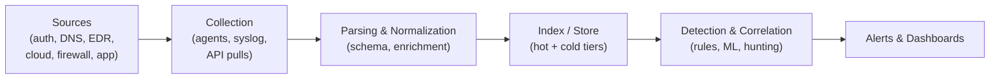
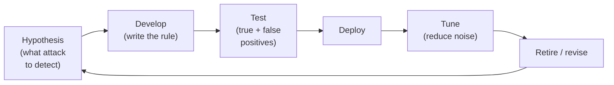
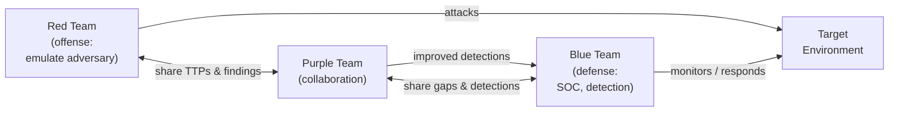

<div class="hero-section" style="background: linear-gradient(135deg, #4facfe 0%, #00f2fe 100%); color: white; padding: 3rem 2rem; margin: -2rem -3rem 2rem -3rem; text-align: center;">
  <h1 style="color: white; margin: 0; font-size: 2.5rem;">Security Operations</h1>
  <p style="font-size: 1.25rem; margin-top: 1rem; opacity: 0.9;">The SOC, SIEM pipelines, detection engineering, threat hunting, and offensive testing</p>
</div>

<p class="breadcrumb"><a href="./">Cybersecurity</a> › Security Operations</p>

<div class="intro-card">
  <p class="lead-text">Security operations is the day-to-day work of keeping an organization defended: collecting and correlating telemetry in a SIEM, engineering detections that fire on real attacks (and not on noise), continuously monitoring for compromise, proactively hunting for adversaries that slipped past automated alerts, and validating all of it with offensive testing — penetration tests and red/blue/purple team exercises. This page covers how a Security Operations Center (SOC) is built and run end to end.</p>
</div>

## The Security Operations Center (SOC)

A **SOC** is the team, process, and tooling responsible for monitoring, detecting, analyzing, and responding to security events. It is the place where prevention meets reality: firewalls, EDR, and access controls reduce risk, but the SOC exists because some attacks always get through, and someone has to be watching.

### SOC Tiers and Roles

Most SOCs organize analysts into tiers, escalating an event up the chain as it proves to be real and serious:

| Tier | Role | Responsibility |
|------|------|----------------|
| **Tier 1** | Triage analyst | First responder to alerts; validates, closes false positives, escalates real ones |
| **Tier 2** | Incident responder | Deep investigation, scoping, containment of confirmed incidents |
| **Tier 3** | Threat hunter / forensics | Proactive hunting, malware analysis, advanced forensics, complex intrusions |
| **SOC Manager** | Lead | Owns metrics, staffing, escalation to leadership, process improvement |
| **Detection Engineer** | Builder | Writes and tunes detections, maintains the SIEM content library |

A common failure mode is the **"tier 1 treadmill"**: analysts drowning in low-value alerts, alert fatigue setting in, and real attacks getting closed as noise. Good SOCs aggressively automate triage so humans spend time on judgment, not button-clicking.

### Key SOC Metrics

You manage what you measure. The metrics that matter for a SOC are about *speed* and *signal quality*:

- **MTTD (Mean Time To Detect)** — how long from compromise to detection. The "dwell time" attackers enjoy.
- **MTTR (Mean Time To Respond)** — how long from detection to containment.
- **False positive rate** — fraction of alerts that turn out to be benign. High FPR burns out analysts.
- **Alert volume per analyst** — a capacity and tuning signal.
- **Coverage** — fraction of relevant attack techniques (e.g., MITRE ATT&CK techniques) you can actually detect.

```python
# A simple operational scorecard a SOC manager might compute weekly
def soc_scorecard(events):
    detected = [e for e in events if e.detected]

    mttd = average(e.detected_at - e.compromised_at for e in detected)
    mttr = average(e.contained_at - e.detected_at for e in detected)

    alerts = [e for e in events if e.generated_alert]
    false_positives = [a for a in alerts if a.benign]
    fpr = len(false_positives) / max(len(alerts), 1)

    return {
        "mttd_hours": mttd / 3600,
        "mttr_hours": mttr / 3600,
        "false_positive_rate": round(fpr, 3),
        "alerts_per_analyst_per_day": len(alerts) / num_analysts / 7,
    }
```

## SIEM and Log Pipelines

A **Security Information and Event Management** system is the SOC's nerve center: it ingests logs from across the environment, normalizes them, correlates events, and raises alerts. It is like having thousands of security cameras with an analyst — and increasingly an ML model — watching them all.

### The Log Pipeline

Before a SIEM can detect anything, raw telemetry has to be collected, shipped, parsed, and stored. This pipeline is where a surprising amount of operational pain lives:



Each stage matters:

- **Collection** — agents (e.g., a forwarder), syslog, or API pulls from cloud providers. The hard problem is *completeness*: a source you don't collect is a blind spot.
- **Parsing and normalization** — raw logs come in dozens of formats. They must be mapped to a common schema (so a "source IP" means the same field everywhere) and **enriched** with context (geolocation, asset criticality, user identity, threat-intel reputation).
- **Indexing and storage** — telemetry is huge and expensive. Most SIEMs use **hot/cold tiering**: recent data in fast searchable storage, older data archived cheaply but slower to query. This trades cost against retention, which directly limits how far back you can investigate.

### Next-Generation SIEM

Modern SIEM platforms have moved well beyond simple rule matching:

- **XDR (Extended Detection and Response)** — unified detection across endpoints, network, identity, and cloud rather than siloed tools.
- **SOAR integration** — Security Orchestration, Automation, and Response: playbooks that automate triage and response (enrich an alert, isolate a host, disable an account) so analysts handle exceptions, not every event.
- **ML-powered analytics** — behavioral baselines and anomaly detection (often called UEBA, User and Entity Behavior Analytics) to catch attacks that no static rule anticipated.
- **Cloud-native SIEM** — elastic, managed platforms (Elastic Security, Splunk Cloud, Microsoft Sentinel, Google Chronicle) that scale ingestion without managing servers.

### Detection Queries

SIEM detections are typically expressed as searches over the normalized data. A canonical example is brute-force login detection:

```python
# Example: Detecting brute force attacks
# SIEM query to find multiple failed logins
query = """
index=auth action=failed
| stats count by src_ip, username
| where count > 5
| eval risk_score = count * 10
| sort -risk_score
"""

# But smart attackers know about SIEMs...
# They might try 4 attempts, wait, then try 4 more
# So we need smarter detection:

advanced_query = """
index=auth action=failed
| bucket _time span=1h
| stats count by src_ip, username, _time
| streamstats sum(count) as total_count by src_ip, username time_window=24h
| where total_count > 10
"""
```

The second query illustrates a recurring theme: naive thresholds are trivially evaded by attackers who throttle their activity, so detections must reason over **windows and behavior**, not single events.

## Detection Engineering

**Detection engineering** is the discipline of building, testing, and maintaining the detections that the SOC runs on. Treating detections as a one-time configuration task is a mistake; they are software, and they need the same lifecycle — version control, testing, and tuning.

### The Detection Lifecycle



A good detection is anchored to **attacker behavior**, not a single indicator. This is the "Pyramid of Pain": detecting a specific file hash is trivial for the attacker to evade (recompile, hash changes), while detecting a *technique* (e.g., a service binary spawning a command shell) forces the attacker to change how they operate — which is expensive for them.

```python
# A behavior-based detection (hard to evade) vs an indicator-based one (easy to evade)

def indicator_detection(event):
    # Brittle: breaks the moment the attacker changes the hash
    return event.file_hash == "a1b2c3...known_bad"

def behavior_detection(event):
    # Robust: catches the technique regardless of the specific binary
    suspicious_parents = {"services.exe", "svchost.exe", "winlogon.exe"}
    shells = {"cmd.exe", "powershell.exe", "bash"}
    return (event.parent_process in suspicious_parents
            and event.process in shells)
```

### Mapping Coverage with MITRE ATT&CK

The **MITRE ATT&CK** framework catalogs real-world adversary tactics (the *why* — e.g., Persistence, Lateral Movement) and techniques (the *how* — e.g., T1053 Scheduled Task). Detection engineers map their rules to ATT&CK techniques to build a **coverage matrix**: which techniques you can detect, which you can't, and where to invest next.

```python
# Coverage analysis: which ATT&CK techniques do our detections cover?
def coverage_report(detections, attack_techniques):
    covered = {d.technique_id for d in detections if d.enabled}
    gaps = [t for t in attack_techniques if t.id not in covered]
    return {
        "coverage_pct": 100 * len(covered) / len(attack_techniques),
        "uncovered_techniques": [t.id for t in gaps],
        # Prioritize gaps by how commonly the technique is used in the wild
        "priority_gaps": sorted(gaps, key=lambda t: -t.prevalence)[:10],
    }
```

### Tuning: Fighting False Positives

The single biggest determinant of whether a SOC is effective is **signal-to-noise ratio**. A detection that fires 200 times a day with two real hits will be ignored within a week. Tuning techniques include:

- **Allow-listing** known-benign sources (the backup server *should* touch every host at 2 a.m.).
- **Thresholding and aggregation** so a burst is one alert, not a hundred.
- **Risk-based alerting** — accumulate small risk signals per entity and alert only when an entity crosses a score, rather than alerting on each weak signal.

## Continuous Monitoring

Detections fire on events, but continuous monitoring is the broader practice of *always knowing the security state of your environment* — not just whether an attack is happening, but whether your defenses are even working.

Effective continuous monitoring spans several layers:

- **Telemetry health** — are all expected log sources still reporting? A source that silently stops sending logs is a blind spot, and attackers deliberately disable logging. Monitoring for the *absence* of expected data is as important as monitoring the data itself.
- **Configuration and posture** — continuous checks that controls remain in place: are S3 buckets still private, is MFA still enforced, did anyone open a management port to the internet?
- **Vulnerability and patch state** — ongoing scanning so newly disclosed vulnerabilities are matched against your asset inventory quickly.
- **Identity and access** — watching for privilege escalation, dormant accounts being reactivated, and impossible-travel logins.

```python
# Monitoring for the absence of telemetry — a frequently missed control
def detect_silent_log_sources(expected_sources, last_seen, now, max_gap=3600):
    silent = []
    for src in expected_sources:
        gap = now - last_seen.get(src, 0)
        if gap > max_gap:
            # A source going dark may mean an outage — or an attacker
            # disabling logging to cover their tracks.
            silent.append((src, gap))
    return sorted(silent, key=lambda x: -x[1])
```

The mindset here overlaps with **Zero Trust**: assume compromise is possible at any time and verify continuously rather than trusting that yesterday's secure state still holds. (See [Attacks & Network Defense → Zero Trust](attacks-and-defense.html#zero-trust-never-trust-always-verify).)

## Threat Hunting: Finding the Hidden

Not all attackers trigger alerts. **Threat hunting** is the proactive, hypothesis-driven search for adversaries that have evaded automated detection. Where the SIEM asks "did a known-bad thing happen?", the hunter asks "if a sophisticated attacker were already inside, where would I find them?"

### Hypothesis-Driven Hunting

A hunt starts from a hypothesis grounded in attacker behavior — for example, "an attacker maintaining persistence would likely use a scheduled task or run service on a server that doesn't normally have one." The hunter then queries the data to confirm or refute it, and crucially, **every successful hunt feeds back into detection engineering** as a new automated rule so the same hunt never has to be done by hand again.

```python
# Hunting for data exfiltration
def hunt_data_exfiltration(network_logs):
    # Look for unusual data transfers
    for connection in network_logs:
        # Large upload to uncommon destination?
        if (connection.bytes_sent > 100_000_000 and  # 100MB+
            connection.destination not in known_services):
            investigate(connection)

        # DNS tunneling? (hiding data in DNS queries)
        if (connection.protocol == 'DNS' and
            len(connection.query) > 100):  # Unusually long domain
            flag_suspicious(connection)

        # Beaconing? (malware calling home)
        if is_periodic(connection.timestamps, tolerance=60):  # Every ~60 seconds
            investigate(connection)
```

### Detecting Beaconing Statistically

Beaconing — malware "calling home" to its command-and-control server at regular intervals — is one of the most productive hunts because it is hard for an attacker to hide entirely. Even with jitter, the timing of callbacks tends to cluster. A hunter can quantify this with the coefficient of variation of the inter-arrival times:

$$
CV = \frac{\sigma}{\mu}
$$

where $\mu$ is the mean gap between connections and $\sigma$ their standard deviation. Automated, periodic beacons produce a **low** $CV$ (highly regular spacing); genuine human-driven traffic is bursty and produces a high $CV$.

```python
import statistics

def beaconing_score(timestamps):
    if len(timestamps) < 4:
        return None  # not enough data to judge regularity
    gaps = [t2 - t1 for t1, t2 in zip(timestamps, timestamps[1:])]
    mean = statistics.mean(gaps)
    if mean == 0:
        return None
    cv = statistics.pstdev(gaps) / mean
    # Low CV => suspiciously regular => likely a beacon
    return {"coefficient_of_variation": cv, "likely_beacon": cv < 0.1}
```

## Penetration Testing and Offensive Validation

Defenses are only as good as their last test. Offensive validation deliberately attacks your own systems to find what real adversaries would find first.

### Penetration Testing: Thinking Like an Attacker

The best way to find vulnerabilities is to try exploiting them — ethically, with explicit authorization (a signed **rules of engagement** and scope). A penetration test typically follows the kill-chain: reconnaissance, scanning, exploitation, and reporting.

```bash
# Reconnaissance phase
nmap -sS -sV -O target.com  # Stealthy scan

# Found port 8080 running outdated Tomcat?
# Check for known vulnerabilities
searchsploit tomcat 7.0.52

# Found SQL injection in login form?
# Carefully test (with permission!)
sqlmap -u "https://target.com/login" --data="user=test&pass=test" --level=3

# Document everything for the client
# The goal isn't to break in—it's to help them fix vulnerabilities
```

The deliverable of a pentest is not a trophy — it is a prioritized report of findings, each with reproduction steps, impact, and remediation guidance.

### Pentest vs. Vulnerability Scan vs. Red Team

These terms are often conflated but answer different questions:

| Activity | Question it answers | Scope | Stealth |
|----------|--------------------|-------|---------|
| **Vulnerability scan** | What known weaknesses exist? | Broad, automated | None |
| **Penetration test** | Can a known weakness be exploited, and how far? | Defined target | Usually overt |
| **Red team** | Can a realistic adversary achieve a specific objective without being caught? | Whole org, objective-driven | Covert |

### Red, Blue, and Purple Teaming

The most mature offensive validation is structured around teams that mirror real attack and defense:



- **Red team** — emulates a specific adversary (often using ATT&CK-mapped tactics) against the whole organization to test whether the blue team can *detect and respond*, not just whether a vulnerability exists. Success is measured against an objective ("exfiltrate the crown-jewel database without being caught"), and the blue team is typically not told in advance.
- **Blue team** — the defenders: the SOC, detection engineers, and responders working to detect, contain, and evict the red team.
- **Purple team** — not a separate team but a *mode of collaboration*. Red and blue work together in real time: red executes a technique, blue checks whether it was detected, and if not, a detection is engineered on the spot. Purple teaming converts an adversarial exercise into a fast feedback loop that directly improves coverage.

```python
# A purple-team exercise turns each emulated technique into a coverage test
def purple_team_run(techniques, run_technique, detection_fired):
    results = []
    for t in techniques:  # e.g., ATT&CK techniques to emulate
        run_technique(t)                     # red executes
        detected = detection_fired(t)        # blue checks the SIEM/EDR
        results.append({
            "technique": t.id,
            "detected": detected,
            # Each miss becomes a detection-engineering backlog item
            "action": "covered" if detected else "build detection",
        })
    return results
```

The output of a purple-team engagement is a measurable improvement in ATT&CK coverage — every technique the blue team missed becomes a new, tested detection, closing the loop back to [detection engineering](#detection-engineering).

## See Also

- [Cybersecurity Hub](./) — overview of the cybersecurity section
- [Operations, Response & Compliance](operations-and-response.html) — incident response, forensics, and the compliance frameworks operations works within
- [Attacks & Network Defense](attacks-and-defense.html) — the attacks this operations work detects and responds to
- [Web, Cloud & Container Security](application-and-cloud-security.html) — securing the systems the SOC monitors
- [Cryptography](cryptography.html) — the math underpinning the controls you operate
