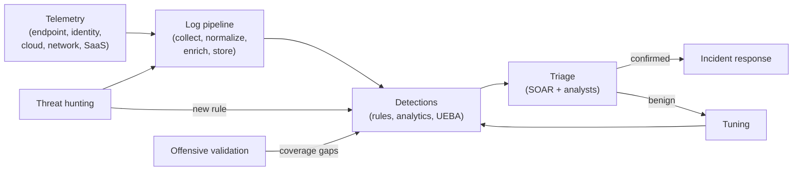
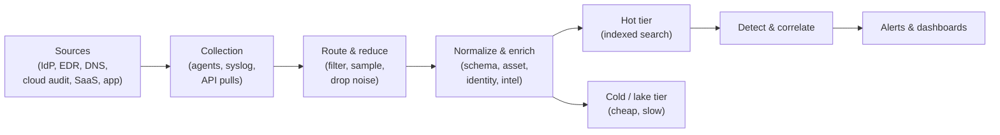
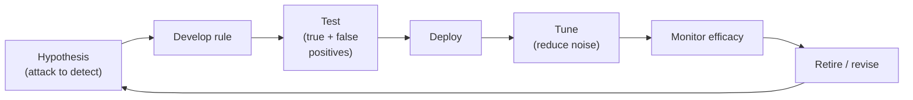
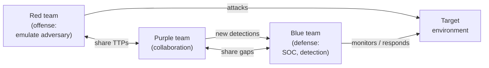

<p class="breadcrumb"><a href="./">Cybersecurity</a> › Security Operations</p>

# Security Operations

**Security operations** (SecOps) is the continuous work of detecting and stopping attacks that got past preventive controls. It covers the Security Operations Center (SOC) and its staffing model, the SIEM and log pipeline that feed it, detection engineering, response automation, continuous monitoring of security posture, proactive threat hunting, and offensive testing that checks whether any of it works. What happens once an alert becomes a confirmed incident — containment, forensics, post-mortems — is covered in [Incident Response & Forensics](incident-response.html).



## The Security Operations Center

A **SOC** is the team, processes, and tooling that monitor an environment, analyze what they see, and start the response. Preventive controls such as firewalls, EDR, and access policy lower the number of successful attacks, but never to zero. The SOC exists to catch what they miss.

### Staffing Model

The traditional SOC is organized in tiers, with an alert escalating as it proves real and serious:

| Role | Responsibility |
|------|----------------|
| **Tier 1: triage analyst** | Reviews incoming alerts, closes false positives, escalates credible ones |
| **Tier 2: incident responder** | Investigates and scopes confirmed incidents, starts containment |
| **Tier 3: threat hunter / forensic analyst** | Proactive hunting, malware analysis, complex intrusions |
| **Detection engineer** | Writes, tests, and tunes detections; owns the detection content library |
| **SOC manager** | Metrics, staffing, escalation to leadership, process improvement |

The tiered model's classic failure mode is the **Tier 1 treadmill**: analysts spend their shifts on low-value alerts, fatigue sets in, and real attacks get closed as noise. Most SOCs now push repetitive triage onto automation — SOAR playbooks and, increasingly, AI triage assistants — and flatten the tiers so analysts work incidents end to end. Platforms that correlate alerts from several products into a single incident help, because the analyst starts from one attack story instead of a dozen unrelated alerts.

Many organizations don't run a 24×7 SOC in-house. They buy **MDR** (managed detection and response) or run a hybrid model where a provider covers after-hours triage and the internal team owns detection content and response decisions.

### SOC Metrics

SOC metrics measure speed, signal quality, and coverage:

| Metric | Definition | What it tells you |
|--------|------------|-------------------|
| **MTTD** (mean time to detect) | Compromise → detection | How long attackers operate unseen (**dwell time**) |
| **MTTR** (mean time to respond) | Detection → containment | How fast the SOC acts once it knows |
| **False-positive rate** | Benign alerts / all alerts | Detection quality; high rates burn out analysts |
| **Alerts per analyst per shift** | Workload | Capacity and tuning pressure |
| **ATT&CK coverage** | Techniques with a tested detection / techniques in scope | Where detection is missing |
| **Automation rate** | Alerts closed or enriched with no human action | How far automation has taken over routine triage |

For outside reference, Mandiant's *M-Trends 2026* reports a global median dwell time of **14 days** for intrusions investigated in 2025 (up from 11 the year before); espionage cases ran to a median of about four months. Exploits were again the most common initial vector (32%), and interactive voice phishing of IT help desks rose to second place (11%). Medians hide a skewed distribution, so track percentiles (p50, p90), not just means.

```python
from statistics import median, quantiles

def soc_scorecard(incidents, alerts, analyst_shifts):
    """Weekly scorecard. Timestamps are datetimes; incidents are confirmed intrusions."""
    dwell   = [(i.detected_at  - i.compromised_at).total_seconds() / 3600 for i in incidents]
    respond = [(i.contained_at - i.detected_at).total_seconds()   / 3600 for i in incidents]
    benign  = sum(1 for a in alerts if a.disposition == "benign")
    return {
        "dwell_hours_p50":   median(dwell) if dwell else None,
        "dwell_hours_p90":   quantiles(dwell, n=10)[-1] if len(dwell) >= 2 else None,
        "respond_hours_p50": median(respond) if respond else None,
        "false_positive_rate": round(benign / max(len(alerts), 1), 3),
        "alerts_per_analyst_shift": round(len(alerts) / max(analyst_shifts, 1), 1),
    }
```

## SIEM and the Log Pipeline

A **SIEM** (security information and event management) system ingests logs from across the environment, normalizes them, correlates events, and raises alerts. Detection quality depends entirely on the data underneath it: a SIEM cannot alert on a source it never collected or a field it cannot parse.

### Pipeline Stages



- **Collection** — agents, syslog, streaming, or API pulls from cloud and SaaS providers. The hard problem is *completeness*: any source you don't collect is a blind spot, and identity and SaaS logs are now as important as endpoint and network data.
- **Routing and reduction** — a **telemetry pipeline** (tools such as Cribl, Vector, or the OpenTelemetry Collector) sits ahead of the SIEM to filter, sample, and reshape events. Because most SIEMs price on ingest volume, dropping predictably useless data before it lands is a direct cost lever and a way to keep the index fast.
- **Normalization and enrichment** — raw logs arrive in dozens of formats and must be mapped to a common schema (so "source IP" is the same field everywhere) and enriched with context: geolocation, asset criticality, resolved user identity, and threat-intel reputation. Open schemas such as the **Open Cybersecurity Schema Framework (OCSF)** and Elastic's ECS reduce the per-source parser sprawl that used to dominate this stage.
- **Storage tiering** — telemetry is large and expensive, so SIEMs split **hot** (recent, fast to search) from **cold or data-lake** tiers (older, cheap object storage, slower to query). The split directly bounds how far back an investigation can reach. **Security data lake** architectures (Amazon Security Lake on OCSF, Google SecOps, Microsoft Sentinel's data lake tier) decouple cheap long-term retention from the query engine so retention is no longer rationed as tightly.

### The Modern Platform

The market has largely folded standalone SIEM, endpoint, and response tooling into unified platforms:

- **XDR** (extended detection and response) correlates detections across endpoint, identity, email, network, and cloud instead of leaving each in its own console. Vendors increasingly ship SIEM and XDR as one product — for example, Microsoft has consolidated Sentinel into the Defender portal, and Google runs Chronicle/SecOps as a cloud-native backend.
- **SOAR** (security orchestration, automation, and response) runs playbooks that enrich an alert, isolate a host, or disable an account automatically, so analysts handle exceptions rather than every event. SOAR is now usually a feature of the platform rather than a separate purchase.
- **UEBA** (user and entity behavior analytics) builds behavioral baselines and flags deviations, catching attacks no static rule anticipated — a compromised account suddenly pulling gigabytes from a repository it never touched before.
- **AI assistants** — LLM-based "SOC copilots" now summarize incidents, draft queries from natural language, and propose response steps. They accelerate triage but need the same skepticism as any junior analyst; their output is a starting point, not a verdict.

### Detection Queries

SIEM detections are searches over the normalized data, written in the platform's query language (SPL in Splunk, KQL in Sentinel/Chronicle, or a portable format such as **Sigma** that compiles to many backends). A canonical example is brute-force login detection:

```
index=auth action=failed
| stats count by src_ip, user
| where count > 5
```

That naive threshold is trivially evaded by an attacker who throttles — four attempts, wait, four more — so real detections reason over sliding windows and behavior, not single events:

```
index=auth action=failed
| bin _time span=1h
| stats count by src_ip, user, _time
| streamstats sum(count) as total by src_ip, user time_window=24h
| where total > 10
```

Password spraying (one password against many accounts) needs the inverse grouping — count distinct *users* per source rather than attempts per user — which is why detections are written against attacker *behavior* rather than a fixed number.

## Detection Engineering

**Detection engineering** builds, tests, and maintains the detections the SOC runs on. Detections are software, not one-time configuration, and need the same lifecycle: version control, code review, automated testing, and continuous tuning. Mature teams manage rules as code ("detection-as-code") in a Git repository with CI that validates and deploys them.

### The Detection Lifecycle



A good detection is anchored to attacker *behavior*, not a single indicator. This is the point of David Bianco's **Pyramid of Pain**: detecting a specific file hash is trivial for an attacker to evade (recompile, the hash changes), whereas detecting a *technique* — a service binary spawning a command shell — forces them to change how they operate, which is expensive.

```python
def indicator_detection(event):
    # Brittle: breaks the moment the attacker recompiles
    return event.file_hash == "a1b2c3...known_bad"

def behavior_detection(event):
    # Robust: catches the technique regardless of the specific binary
    suspicious_parents = {"services.exe", "svchost.exe", "winlogon.exe"}
    shells = {"cmd.exe", "powershell.exe", "pwsh.exe", "bash", "wscript.exe"}
    return event.parent_process in suspicious_parents and event.process in shells
```

### MITRE ATT&CK Coverage

The **MITRE ATT&CK** framework catalogs real-world adversary *tactics* (the goal — Persistence, Lateral Movement) and *techniques* (the method — T1053 Scheduled Task/Job). Detection engineers map rules to techniques to build a **coverage matrix** showing what they can detect, what they can't, and where to invest next. The ATT&CK Navigator is the standard tool for visualizing this heatmap.

ATT&CK is a moving target. The **v18 release (October 2025)** substantially reworked the defensive side of the model: per-technique "Detections" were replaced by structured **Detection Strategies** and concrete **Analytics** (roughly 1,700 analytics for Enterprise), the older **Data Sources** were deprecated in favor of an expanded **Data Components** model aligned to STIX, and new techniques such as Container Administration Command and Delay Execution were added. If your coverage tooling still keys off Data Sources, it needs updating to the new schema; the 2026 releases (v19 and the "agile" point releases) build on that structure.

```python
def coverage_report(detections, techniques_in_scope):
    covered = {d.technique_id for d in detections if d.enabled and d.tested}
    gaps = [t for t in techniques_in_scope if t.id not in covered]
    return {
        "coverage_pct": round(100 * len(covered) / len(techniques_in_scope), 1),
        # Prioritize gaps by how often the technique appears in real intrusions
        "priority_gaps": [t.id for t in sorted(gaps, key=lambda t: -t.prevalence)[:10]],
    }
```

Coverage percentages flatter more than they inform: a detection that exists but is disabled, untested, or drowned in false positives is not real coverage. Weight the matrix by technique prevalence in your threat model, and treat "tested and tuned" as the bar, not "written."

### Tuning: Fighting False Positives

Signal-to-noise ratio is the single biggest determinant of whether a SOC is effective. A detection that fires 200 times a day with two real hits gets muted within a week. Tuning techniques:

- **Allow-listing** known-benign behavior (the backup server *should* touch every host at 02:00).
- **Thresholds and aggregation** so a burst becomes one alert, not a hundred.
- **Risk-based alerting (RBA)** — accumulate small risk scores per user or host across many weak signals and alert only when an entity crosses a threshold, rather than paging on each weak signal alone. This is now the dominant model for high-fidelity alerting in large environments.

## Continuous Monitoring

Detections fire on events; continuous monitoring is the broader practice of always knowing the security *state* of the environment — not only whether an attack is in progress, but whether the defenses themselves still work. It spans several layers:

- **Telemetry health** — are all expected log sources still reporting? A source that silently goes dark is a blind spot, and disabling logging is a common attacker step. Monitoring for the *absence* of expected data matters as much as monitoring the data.
- **Configuration and posture** — continuous checks that controls hold: are storage buckets still private, is MFA still enforced, did anyone expose a management port? Cloud posture drift is a leading cause of breaches.
- **Vulnerability and patch state** — ongoing scanning so newly disclosed CVEs are matched against the asset inventory quickly, since exploitation of known vulnerabilities remains a top initial vector.
- **Identity and access** — privilege escalation, dormant accounts reactivating, impossible-travel logins, and abuse of OAuth/SaaS grants.

```python
def detect_silent_sources(expected_sources, last_seen, now, max_gap=3600):
    """Alert on the absence of telemetry — a frequently missed control."""
    silent = [(src, now - last_seen.get(src, 0))
              for src in expected_sources
              if now - last_seen.get(src, 0) > max_gap]
    return sorted(silent, key=lambda x: -x[1])
```

The mindset overlaps with **Zero Trust**: assume compromise is always possible and verify continuously rather than trusting that yesterday's secure state still holds. (See [Attacks & Network Defense → Zero Trust](attacks-and-defense.html#zero-trust-never-trust-always-verify).)

## Threat Hunting

Not every attacker trips an alert. **Threat hunting** is the proactive, hypothesis-driven search for adversaries that evaded automated detection. Where the SIEM asks "did a known-bad thing happen?", the hunter asks "if a capable attacker were already inside, where would I find them?"

A hunt starts from a hypothesis grounded in attacker behavior — for example, "an attacker maintaining persistence would likely register a scheduled task or service on a server that normally has none." The hunter queries the data to confirm or refute it, and every productive hunt feeds back into detection engineering as a new automated rule, so the same hunt never has to be run by hand twice.

### Detecting Beaconing Statistically

Beaconing — malware calling home to its command-and-control server at regular intervals — is one of the most productive hunts because it is hard to hide completely. Even with jitter, callback timing tends to cluster. A hunter quantifies regularity with the coefficient of variation of the inter-arrival gaps:

$$
CV = \frac{\sigma}{\mu}
$$

where $\mu$ is the mean gap between connections and $\sigma$ their standard deviation. Automated beacons produce a **low** $CV$ (regular spacing); genuine human-driven traffic is bursty and produces a high $CV$. Modern C2 frameworks add large random jitter specifically to raise $CV$, so hunters pair timing analysis with other signals — rare destinations, uniform request sizes, long-lived low-volume sessions, and JA3/JA4 TLS fingerprints.

```python
import statistics

def beaconing_score(timestamps, cv_threshold=0.1):
    if len(timestamps) < 4:
        return None  # too few points to judge regularity
    gaps = [t2 - t1 for t1, t2 in zip(timestamps, timestamps[1:])]
    mean = statistics.mean(gaps)
    if mean == 0:
        return None
    cv = statistics.pstdev(gaps) / mean
    return {"coefficient_of_variation": round(cv, 3), "likely_beacon": cv < cv_threshold}
```

Other high-yield hunts look for data staging before exfiltration (large uploads to rare destinations, long DNS queries suggesting tunneling), living-off-the-land use of built-in admin tools, and anomalous OAuth consent grants in cloud tenants.

## Offensive Validation

Defenses are only as good as their last test. Offensive validation deliberately probes your own systems to find what a real adversary would find first — and, just as importantly, to confirm the SOC can *see* it.

### Pentest vs. Vulnerability Scan vs. Red Team

These terms are routinely conflated but answer different questions:

| Activity | Question it answers | Scope | Stealth |
|----------|---------------------|-------|---------|
| **Vulnerability scan** | What known weaknesses exist? | Broad, automated | None |
| **Penetration test** | Can a weakness be exploited, and how far? | Defined target | Usually overt |
| **Red team** | Can a realistic adversary reach an objective without being caught? | Whole org, objective-driven | Covert |
| **BAS / continuous validation** | Do our controls still catch known techniques, today? | Broad, automated, safe | Overt |

A **penetration test** follows the kill chain — reconnaissance, scanning, exploitation, and reporting — under an explicit, signed **rules of engagement** and scope. The deliverable is not a trophy but a prioritized report: each finding with reproduction steps, impact, and remediation guidance. **Breach and attack simulation (BAS)** tools automate the safe replay of known techniques on a continuous schedule, filling the long gap between annual pentests.

### Red, Blue, and Purple Teaming

The most mature validation mirrors real attack and defense with dedicated roles:



- **Red team** — emulates a specific adversary (usually using ATT&CK-mapped techniques) against the whole organization to test whether the blue team can *detect and respond*, not merely whether a vulnerability exists. Success is measured against an objective ("reach the crown-jewel database without being caught"), and the blue team is typically not warned.
- **Blue team** — the defenders: SOC, detection engineers, and responders working to detect, contain, and evict the red team.
- **Purple team** — not a separate team but a *mode of collaboration*. Red executes a technique, blue checks whether it fired, and if not, a detection is engineered on the spot. Purple teaming turns an adversarial exercise into a fast feedback loop that directly improves coverage. Adversary-emulation tooling (Atomic Red Team, MITRE Caldera, and commercial C2 frameworks under strict authorization) drives the exercises.

```python
def purple_team_run(techniques, run_technique, detection_fired):
    """Each emulated technique becomes a coverage test."""
    results = []
    for t in techniques:                      # e.g., ATT&CK techniques to emulate
        run_technique(t)                       # red executes
        detected = detection_fired(t)          # blue checks the SIEM/EDR
        results.append({
            "technique": t.id,
            "detected": detected,
            "action": "covered" if detected else "build detection",  # miss → backlog item
        })
    return results
```

The output of a purple-team engagement is a measurable improvement in ATT&CK coverage: every missed technique becomes a new, tested detection, closing the loop back to [detection engineering](#detection-engineering).

## See Also

- [Cybersecurity Hub](./) — overview of the cybersecurity section
- [Incident Response & Forensics](incident-response.html) — what happens once a SOC alert becomes a confirmed incident
- [Operations, Response & Compliance](operations-and-response.html) — the formal foundations and research frontiers behind these controls
- [Compliance & Governance](compliance-and-governance.html) — the frameworks and metrics operations reports into
- [Attacks & Network Defense](attacks-and-defense.html) — the attacks this work detects and responds to
- [Web, Cloud & Container Security](application-and-cloud-security.html) — securing the systems the SOC monitors
