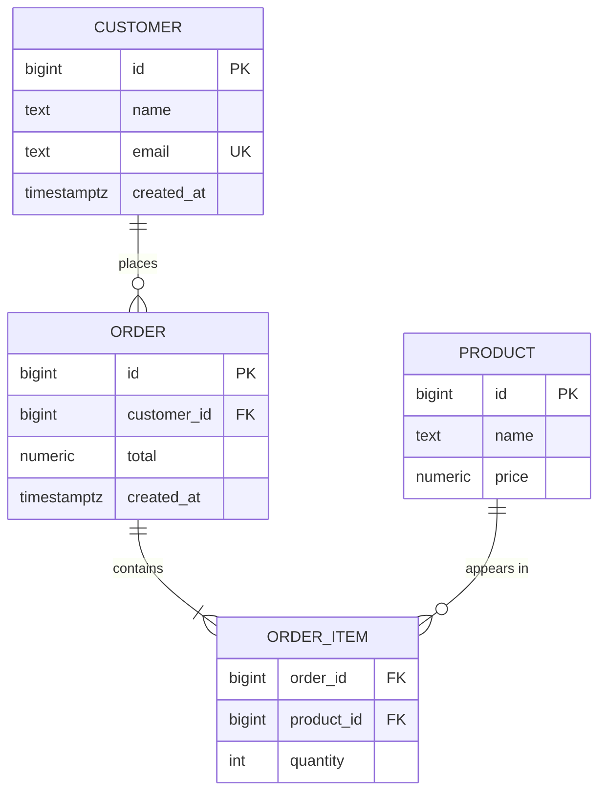
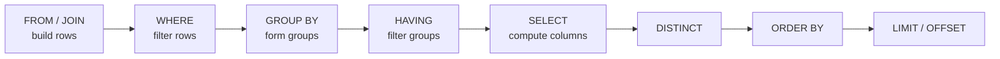
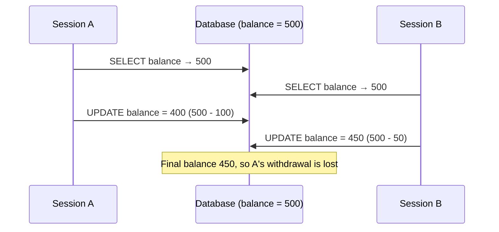

# Database Crash Course

This page is a compact introduction to databases: what a database management system does, how relational data is structured, the SQL you will write most often, and the three mechanisms that make databases fast and safe (indexes, constraints and transactions). It closes with when a non-relational store is the better fit. Examples use PostgreSQL syntax unless noted. For depth on normalization, index internals, query planning and distributed databases, see the [Database Design](database-design/) reference.

## What a database is

A **database** is an organized, persistent collection of data. A **database management system (DBMS)** such as PostgreSQL, MySQL, SQLite or MongoDB is the software that stores it and provides four things a directory of files does not:

| Capability | What it means in practice |
|------------|---------------------------|
| **Declarative querying** | You describe *what* you want (SQL); the query planner decides *how* to fetch it. |
| **Integrity** | Types, keys and constraints reject invalid data before it is stored. |
| **Concurrency control** | Many clients read and write at once without corrupting each other's work. |
| **Durability and recovery** | Committed data survives crashes, via a write-ahead log (WAL) replayed on restart. |

### The database landscape

"SQL vs NoSQL" is a useful first split, but in 2026 the landscape is better described by data model, and many products blur the lines (PostgreSQL stores JSON documents and, via the `pgvector` extension, vector embeddings; MongoDB supports multi-document ACID transactions).

| Model | Shape of data | Typical products | Reach for it when |
|-------|---------------|------------------|-------------------|
| **Relational** | Tables of typed rows, joined by keys | PostgreSQL, MySQL, SQLite, SQL Server | Default choice: structured data, relationships, ad-hoc queries |
| **Distributed SQL** | Relational, sharded and replicated across nodes | CockroachDB, YugabyteDB, Google Spanner | You need SQL and transactions beyond one machine |
| **Document** | JSON-like nested documents | MongoDB, Couchbase | Data is read and written as whole aggregates |
| **Key-value** | Opaque value per key, often in memory | Redis, Valkey, DynamoDB | Caches, sessions, counters, sub-millisecond lookups |
| **Wide-column** | Rows partitioned by key across a cluster | Cassandra, ScyllaDB, Bigtable | Very high write throughput with known query patterns |
| **Graph** | Nodes and edges | Neo4j, Amazon Neptune | Queries are multi-hop traversals |
| **Analytical (OLAP)** | Columnar storage for scans and aggregates | DuckDB, ClickHouse, Snowflake, BigQuery | Reporting and analytics over large datasets |
| **Vector** | High-dimensional embeddings with similarity search | pgvector, Qdrant, Milvus | Semantic search and retrieval for ML applications |

**Rule of thumb:** start with a relational database; PostgreSQL is an excellent default and SQLite is ideal for embedded or single-user use. Move to a specialised store when a concrete requirement (scale, an aggregate-shaped access pattern, latency, traversal) demands it.

## The relational model

Relational data lives in **tables** (relations). Each **row** is one entity and each **column** one typed attribute. Tables reference each other through keys:

- A **primary key** (PK) uniquely identifies each row of its table.
- A **foreign key** (FK) is a column whose value must match a primary key in another table, so the database itself guarantees that an order cannot point to a customer that does not exist.



The crow's-foot notation reads as cardinality: one customer places zero or more orders; each order contains one or more items. `ORDER_ITEM` is a **junction table** resolving the many-to-many relationship between orders and products; its primary key is the composite `(order_id, product_id)`.

**Normalization** is the discipline of storing each fact exactly once (a customer's email lives only in `customers`, never copied into `orders`) so that updates cannot leave contradictory copies behind. In practice, aim for third normal form and denormalize deliberately when measurements justify it; see [Database Design → Normalization](database-design/modeling.html#database-normalization-avoiding-data-disasters).

## SQL essentials

SQL is standardized (ISO/IEC 9075) but every engine has dialect differences. Its statements fall into a few groups:

| Group | Purpose | Statements |
|-------|---------|------------|
| **DDL** (definition) | Create and change structure | `CREATE`, `ALTER`, `DROP`, `TRUNCATE` |
| **DML** (manipulation) | Read and change rows | `SELECT`, `INSERT`, `UPDATE`, `DELETE`, `MERGE` |
| **TCL** (transaction control) | Group statements atomically | `BEGIN`, `COMMIT`, `ROLLBACK`, `SAVEPOINT` |
| **DCL** (access control) | Grant and revoke privileges | `GRANT`, `REVOKE` |

### Defining tables and constraints

```sql
CREATE TABLE customers (
    id          bigint      GENERATED ALWAYS AS IDENTITY PRIMARY KEY,
    name        text        NOT NULL,
    email       text        NOT NULL UNIQUE,
    created_at  timestamptz NOT NULL DEFAULT now()
);

CREATE TABLE orders (
    id          bigint        GENERATED ALWAYS AS IDENTITY PRIMARY KEY,
    customer_id bigint        NOT NULL REFERENCES customers (id) ON DELETE RESTRICT,
    total       numeric(10,2) NOT NULL CHECK (total >= 0),
    created_at  timestamptz   NOT NULL DEFAULT now()
);

-- PostgreSQL does not index foreign-key columns automatically
CREATE INDEX orders_customer_id_idx ON orders (customer_id);

ALTER TABLE customers ADD COLUMN phone text;
```

Constraints are the cheapest data-quality tool available: they are checked on every write, by every client, forever.

| Constraint | Guarantees |
|------------|------------|
| `PRIMARY KEY` | Unique and non-null; identifies the row |
| `FOREIGN KEY` / `REFERENCES` | The value exists in the referenced table; `ON DELETE` decides what happens when the parent row goes (`RESTRICT`, `CASCADE`, `SET NULL`) |
| `UNIQUE` | No two rows share the value (enforced with an index) |
| `NOT NULL` | A value is always present |
| `CHECK` | An arbitrary boolean condition holds |
| `DEFAULT` | Value used when an insert omits the column |

Type choices worth getting right from the start: use `timestamptz` (a point in time) rather than `timestamp` for events, `numeric` rather than floating point for money, and `GENERATED ... AS IDENTITY` (standard SQL) rather than the older PostgreSQL-specific `SERIAL`. When you need UUID keys (for example, so that services can mint IDs without a round trip), prefer time-ordered UUIDv7 over random UUIDv4: new values land at the end of the B-tree instead of scattering writes across it. PostgreSQL 18 adds a built-in `uuidv7()` function.

### Reading and writing rows

The four core DML statements map onto the CRUD operations (Create, Read, Update, Delete):

```sql
-- Create; RETURNING hands back generated values without a second query
INSERT INTO customers (name, email)
VALUES ('Ada Lovelace', 'ada@example.com')
RETURNING id;

-- Read
SELECT name, email
FROM customers
WHERE created_at >= '2026-01-01'
ORDER BY name
LIMIT 10;

-- Update: always scope with WHERE
UPDATE customers SET phone = '555-0100' WHERE id = 1;

-- Delete
DELETE FROM customers WHERE id = 1;

-- Upsert: insert, or update the existing row on a key conflict
INSERT INTO customers (name, email)
VALUES ('Ada King', 'ada@example.com')
ON CONFLICT (email) DO UPDATE SET name = EXCLUDED.name;
```

`ON CONFLICT` is shared by PostgreSQL and SQLite; MySQL uses `ON DUPLICATE KEY UPDATE`, and the standard `MERGE` statement is available in PostgreSQL 15+, SQL Server and Oracle.

### How a query is evaluated

A `SELECT` is written in one order but logically evaluated in another. Knowing the evaluation order explains most "why can't I use that alias here?" errors: `WHERE` runs before `SELECT`, so it cannot see column aliases, and it runs before `GROUP BY`, so filters on aggregates belong in `HAVING`.



This is the *logical* order that defines the result; the planner is free to execute the query physically in any order that produces the same answer.

### Joins

Joins combine rows from related tables in a single query.

```sql
-- Orders with their customer's name (only rows that match)
SELECT o.id, c.name, o.total
FROM orders o
JOIN customers c ON c.id = o.customer_id;

-- Every customer with an order count, including customers with none
SELECT c.name, COUNT(o.id) AS order_count
FROM customers c
LEFT JOIN orders o ON o.customer_id = c.id
GROUP BY c.id, c.name;
```

| Join | Returns |
|------|---------|
| `INNER JOIN` (plain `JOIN`) | Only row pairs that satisfy the `ON` condition |
| `LEFT JOIN` | Every left-table row; right-side columns are `NULL` where nothing matches |
| `RIGHT JOIN` | Mirror image of `LEFT JOIN` (rarely used; swap the tables instead) |
| `FULL JOIN` | Every row from both sides, matched where possible |
| `CROSS JOIN` | Every combination of rows (Cartesian product) |

Note `COUNT(o.id)` rather than `COUNT(*)` in the second query: `COUNT(*)` counts rows, so a customer with no orders would report 1 (the `NULL`-padded row), while `COUNT(column)` ignores `NULL`s.

### Aggregates, CTEs and window functions

```sql
-- Aggregate per group, then filter the groups
SELECT customer_id, SUM(total) AS spent
FROM orders
GROUP BY customer_id
HAVING SUM(total) > 1000;

-- A common table expression (CTE) names an intermediate result
WITH big_spenders AS (
    SELECT customer_id, SUM(total) AS spent
    FROM orders
    GROUP BY customer_id
    HAVING SUM(total) > 1000
)
SELECT c.name, b.spent
FROM big_spenders b
JOIN customers c ON c.id = b.customer_id
ORDER BY b.spent DESC;

-- A window function computes across related rows without collapsing them
SELECT customer_id, created_at, total,
       SUM(total) OVER (PARTITION BY customer_id ORDER BY created_at) AS running_total,
       ROW_NUMBER() OVER (PARTITION BY customer_id ORDER BY created_at DESC) AS recency
FROM orders;
```

`GROUP BY` collapses each group to one row; a window function (`OVER (...)`) keeps every row and attaches a per-group calculation to it. Window functions are the standard tool for running totals, rankings and "latest row per group" queries.

### NULL and three-valued logic

`NULL` means "unknown", not zero or empty string, and any comparison with it yields `UNKNOWN` rather than true or false. `WHERE` keeps only rows where the condition is true, which produces several classic bugs:

| Expression | Result | Use instead |
|------------|--------|-------------|
| `phone = NULL` | Never true | `phone IS NULL` |
| `phone <> '555-0100'` | Skips rows where `phone` is `NULL` | `phone IS DISTINCT FROM '555-0100'` |
| `id NOT IN (SELECT customer_id FROM ...)` | Returns no rows if the subquery yields any `NULL` | `NOT EXISTS (...)` |
| `SUM(x)` over zero rows | `NULL`, not 0 | `COALESCE(SUM(x), 0)` |

## Indexes

Without an index, finding rows that match a condition means reading the whole table (a **sequential scan**). An **index** is a separate, sorted structure (usually a B-tree) that maps column values to row locations, turning a scan of millions of rows into a handful of page reads.

```sql
CREATE INDEX orders_customer_created_idx ON orders (customer_id, created_at);

-- Ask the planner what it will do, and (with ANALYZE) what it actually did
EXPLAIN ANALYZE
SELECT * FROM orders WHERE customer_id = 42 ORDER BY created_at DESC LIMIT 5;
```

| Indexes help | Indexes cost |
|--------------|--------------|
| `WHERE`, `JOIN` and `ORDER BY` on the indexed columns | Disk space and memory |
| Enforcing uniqueness (`UNIQUE` and `PRIMARY KEY` create one automatically) | Every `INSERT`, `UPDATE` and `DELETE` must also maintain the index |
| Index-only scans, when the index contains every column the query needs | Planner overhead; unused indexes are pure cost |

Practical guidance:

- Index columns you filter, join or sort on frequently, including foreign keys.
- In a composite index, column order matters: `(customer_id, created_at)` serves "orders for a customer, newest first" but is much less useful for a filter on `created_at` alone. (PostgreSQL 18's *skip scan* can use such an index when a leading column is missing, but only efficiently when that column has few distinct values.)
- Wrapping an indexed column in a function (`WHERE lower(email) = ...`) prevents the index from being used unless you create an index on that expression.
- Confirm with `EXPLAIN` rather than guessing.

See [Database Design → Indexing](database-design/indexing-and-queries.html#indexing-making-queries-lightning-fast) for B-tree internals, other index types and reading query plans.

## Transactions and ACID

A **transaction** groups statements into one all-or-nothing unit. The canonical example is a bank transfer, which is two separate updates that must never be observed half-done:

```sql
-- Transfer 100 from account 1 to account 2
BEGIN;
UPDATE accounts SET balance = balance - 100 WHERE id = 1;
-- a crash here must not lose the money
UPDATE accounts SET balance = balance + 100 WHERE id = 2;
COMMIT;   -- or ROLLBACK to discard both changes
```

If anything fails before `COMMIT` (a crash, a constraint violation, a deadlock), the database rolls back and both accounts are exactly as they were before `BEGIN`. The guarantees are summarised as **ACID**:

| Property | Promise | In the transfer |
|----------|---------|-----------------|
| **Atomicity** | All statements take effect, or none do | Never a debit without the matching credit |
| **Consistency** | Each commit moves the database from one valid state to another | A `CHECK (balance >= 0)` violation aborts the whole transfer |
| **Isolation** | Concurrent transactions do not see each other's partial work | Another session sees the balances before or after the transfer, never in between |
| **Durability** | Once `COMMIT` returns, the change survives a crash | The commit record is flushed to the write-ahead log before the client is told it succeeded |

### Isolation levels

Full isolation (every transaction behaving as if it ran alone) is expensive, so SQL defines weaker **isolation levels** that permit specific anomalies in exchange for concurrency:

| Level | Dirty read | Non-repeatable read | Phantom read | Notes |
|-------|:----------:|:-------------------:|:------------:|-------|
| Read uncommitted | possible | possible | possible | PostgreSQL treats it as read committed |
| **Read committed** | prevented | possible | possible | PostgreSQL default |
| **Repeatable read** | prevented | prevented | possible in the standard | MySQL InnoDB default; PostgreSQL implements it as snapshot isolation, which also prevents phantoms |
| **Serializable** | prevented | prevented | prevented | Result is equivalent to some serial order; transactions may abort with a serialization failure and must be retried |

The most common real-world concurrency bug is not in that table: it is the **lost update**, caused by application code that reads a value, computes in the application, and writes it back.



Fixes, in order of preference: let the database do the arithmetic atomically (`SET balance = balance - 100`), lock the row while you work (`SELECT ... FOR UPDATE`), or run at `SERIALIZABLE` and retry on failure. See [Database Design → Isolation Levels](database-design/transactions-and-concurrency.html#isolation-levels-choosing-your-guarantees) for MVCC, locking and write skew.

## Querying from application code

Never build SQL by concatenating user input into a string; that is how **SQL injection** happens. Pass values as **parameters** so the driver sends them separately from the query text:

```python
import psycopg  # psycopg 3

with psycopg.connect("dbname=app user=app") as conn:
    row = conn.execute(
        "SELECT id, name FROM customers WHERE email = %s",
        (email,),                     # a value, never spliced into the SQL text
    ).fetchone()
```

Other habits that pay off in production code:

- **Use a connection pool** (built into most frameworks, or PgBouncer in front of PostgreSQL); opening a connection per request is slow and exhausts server limits.
- **Keep transactions short**; an idle open transaction holds locks and, in PostgreSQL, prevents `VACUUM` from reclaiming dead rows.
- **Watch for the N+1 pattern** in ORMs, where loading a list issues one extra query per item; fetch related rows with a join or a batched query instead.
- **Manage schema changes as versioned migrations** (Alembic, Flyway, Liquibase, framework migrations) rather than ad-hoc `ALTER` statements; see [Schema Evolution and Migrations](database-design/schema-evolution-and-migrations.html).

## When to use NoSQL

Relational databases optimise for **flexible, ad-hoc queries** over normalized data: you can join any tables and ask questions nobody anticipated. Non-relational stores trade some of that flexibility for **scale or a specific access pattern**. The case for one is usually one of these:

- **The data is always read the same way.** If nearly every request is "load this user's profile with recent orders", a document store returns that whole aggregate in one lookup, with no joins.
- **Writes must scale horizontally.** A single relational primary has a ceiling; wide-column stores such as Cassandra partition writes across many nodes by key, typically with tunable consistency.
- **The shape varies by record.** Catalog items with category-specific attributes or evolving event payloads fit documents naturally (though a PostgreSQL `jsonb` column often suffices).
- **Latency must be sub-millisecond.** An in-memory key-value store answers session, cache and rate-limit lookups faster than any disk-backed table.

```javascript
// Document store (MongoDB): the customer and their orders are stored
// together because the application always reads them together.
{
  "_id": "c-1000",
  "name": "Ada Lovelace",
  "email": "ada@example.com",
  "orders": [
    { "id": 1, "items": ["widget", "gadget"], "total": 99.99 }
  ]
}
```

```bash
# Key-value store (Redis/Valkey): in-memory lookups by key,
# with optional expiry; ideal for sessions, caches and counters
SET  session:8f3a "user:1000" EX 3600
HSET user:1000:prefs theme dark lang en
INCR ratelimit:user:1000
```

The benefit of embedding orders in the customer document is also its cost: "which customers bought a widget?" now requires scanning or separately indexing every document, while in SQL it is a simple join. Model non-relational stores around known access patterns, and default to relational while your queries are still evolving. See [Database Design → NoSQL Data Models](database-design/nosql-data-models.html).

## Running a database locally

With Docker, a disposable PostgreSQL server is one command. PostgreSQL 18 images expect the data volume at `/var/lib/postgresql` (earlier major versions used `/var/lib/postgresql/data`):

```bash
docker run -d --name pg \
  -e POSTGRES_PASSWORD=dev \
  -p 5432:5432 \
  -v pgdata:/var/lib/postgresql \
  postgres:18

docker exec -it pg psql -U postgres
```

For learning and single-user work, **SQLite** needs no server at all; the whole database is one file:

```bash
sqlite3 practice.db
sqlite> CREATE TABLE notes (id INTEGER PRIMARY KEY, body TEXT NOT NULL);
sqlite> .tables
```

**DuckDB** plays a similar embedded role for analytics: it runs SQL directly over CSV and Parquet files (`SELECT * FROM 'events.parquet'`), which makes it a convenient way to practise aggregates and window functions on real data.

## See also

- [Database Design](database-design/) — normalization, indexing internals, query execution, replication and tuning
- [AWS Databases](aws/databases.html) — managed RDS, Aurora and DynamoDB
- [Docker Essentials](docker-essentials.html) — running databases locally
- [Distributed Systems](../distributed-systems/) — consistency models, replication and the CAP theorem

## References

- [PostgreSQL Documentation](https://www.postgresql.org/docs/current/)
- [PostgreSQL 18 release announcement](https://www.postgresql.org/about/news/postgresql-18-released-3142/)
- [MySQL Reference Manual](https://dev.mysql.com/doc/)
- [SQLite Documentation](https://www.sqlite.org/docs.html)
- [MongoDB Documentation](https://www.mongodb.com/docs/)
- [Use The Index, Luke!](https://use-the-index-luke.com/) — a practical guide to SQL indexing
- [OWASP SQL Injection Prevention Cheat Sheet](https://cheatsheetseries.owasp.org/cheatsheets/SQL_Injection_Prevention_Cheat_Sheet.html)
