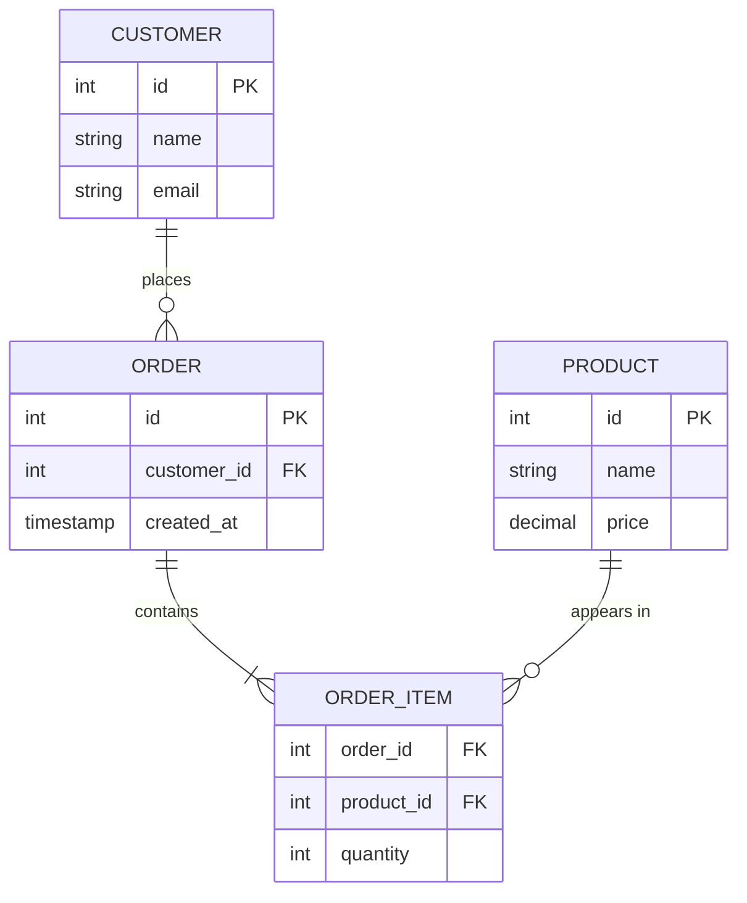

<div class="hero-section" style="background: linear-gradient(135deg, #4facfe 0%, #00f2fe 100%); color: white; padding: 3rem 2rem; margin: -2rem -3rem 2rem -3rem; text-align: center;">
  <h1 style="color: white; margin: 0; font-size: 2.5rem;">Database Crash Course</h1>
  <p style="font-size: 1.25rem; margin-top: 1rem; opacity: 0.9;">The essentials of tables, SQL, and data modeling — enough to be productive fast</p>
</div>

<div class="intro-card">
  <p class="lead-text">This is the <strong>fast on-ramp</strong> to databases: what they are, how relational data is structured, and the handful of SQL statements that do most of the work. It is deliberately concise. When you need depth — normalization theory, indexing internals, distributed databases, query planning — head to the companion deep-dive.</p>
</div>

<div class="tip-card">
  <h4>This page vs. Database Design</h4>
  <ul>
    <li><strong>This page (Crash Course)</strong> — concepts and core SQL to get started; read top to bottom.</li>
    <li><a href="database-design/">Database Design</a> — the comprehensive reference: normalization, indexing strategy, query execution, sharding/replication, NoSQL, and tuning.</li>
  </ul>
</div>

## What is a database?

A **database** is an organized, persistent collection of structured data. A **database management system (DBMS)** — PostgreSQL, MySQL, SQLite, MongoDB — is the software that stores it, answers queries, enforces rules, and coordinates many users reading and writing at once without corrupting each other's data.

<div class="key-insights">
  <div class="insight-card">
    <i class="fas fa-table"></i>
    <h4>Structure</h4>
    <p>Data lives in defined shapes (tables or documents), not loose files</p>
  </div>
  <div class="insight-card">
    <i class="fas fa-shield-alt"></i>
    <h4>Integrity</h4>
    <p>Constraints and transactions keep data valid and consistent</p>
  </div>
  <div class="insight-card">
    <i class="fas fa-bolt"></i>
    <h4>Speed at scale</h4>
    <p>Indexes make finding one row among millions near-instant</p>
  </div>
</div>

## Two big families: SQL vs NoSQL

The first decision is which kind of database fits your data and access patterns.

| | Relational (SQL) | NoSQL |
|---|------------------|-------|
| **Model** | Tables of rows and columns | Documents, key-value, wide-column, or graph |
| **Schema** | Fixed, defined up front | Flexible / schema-less |
| **Query language** | SQL (standardized) | Varies per product |
| **Consistency** | Strong (ACID transactions) | Often eventual; tunable |
| **Best for** | Structured data with relationships | High write volume, evolving or hierarchical data |
| **Examples** | PostgreSQL, MySQL, SQLite | MongoDB, Redis, Cassandra, Neo4j |

<div class="takeaway-card">
  <h4>Rule of thumb</h4>
  <p>Start with a relational database (PostgreSQL is an excellent default). Reach for NoSQL when a concrete requirement — huge scale, a document-shaped data model, sub-millisecond key lookups, or graph traversal — actually demands it.</p>
</div>

## The relational model in one picture

Relational data is organized into **tables**. Tables connect to each other through keys: a **primary key** uniquely identifies each row, and a **foreign key** in one table points to a primary key in another.



| Term | Meaning |
|------|---------|
| Table | A collection of related rows (e.g. `customers`) |
| Row (record) | One entity instance (one customer) |
| Column (field) | One attribute (`email`) |
| Primary key | Column(s) uniquely identifying a row |
| Foreign key | A column referencing another table's primary key |

## SQL essentials

SQL splits into a few sublanguages. You will use **DDL** to shape tables and **DML** to work with data.

### Defining tables (DDL)

```sql
CREATE TABLE customers (
    id          SERIAL PRIMARY KEY,
    name        VARCHAR(100) NOT NULL,
    email       VARCHAR(255) UNIQUE,
    created_at  TIMESTAMP DEFAULT CURRENT_TIMESTAMP
);

ALTER TABLE customers ADD COLUMN phone VARCHAR(20);
DROP TABLE customers;
```

### Reading and writing data (DML)

```sql
-- Create
INSERT INTO customers (name, email)
VALUES ('Ada Lovelace', 'ada@example.com');

-- Read
SELECT name, email
FROM customers
WHERE created_at >= '2024-01-01'
ORDER BY name
LIMIT 10;

-- Update
UPDATE customers SET phone = '555-0100' WHERE id = 1;

-- Delete
DELETE FROM customers WHERE id = 1;
```

> The four DML verbs map to the classic **CRUD** operations: `INSERT` = Create, `SELECT` = Read, `UPDATE` = Update, `DELETE` = Delete.

### Joining tables

Relationships become useful when you combine tables in one query.

```sql
-- Every order with its customer's name (only matching rows)
SELECT o.id, c.name, o.created_at
FROM orders o
INNER JOIN customers c ON o.customer_id = c.id;

-- Every customer, with a count of their orders (including zero)
SELECT c.name, COUNT(o.id) AS order_count
FROM customers c
LEFT JOIN orders o ON c.id = o.customer_id
GROUP BY c.id, c.name;
```

| Join | Returns |
|------|---------|
| `INNER JOIN` | Only rows that match in both tables |
| `LEFT JOIN` | All left-table rows; nulls where no match |
| `RIGHT JOIN` | All right-table rows; nulls where no match |
| `FULL JOIN` | All rows from both, matched where possible |

## Indexes: the speed dial

An index is a separate data structure that lets the database find rows without scanning the whole table — the difference between a query taking milliseconds versus seconds.

```sql
CREATE INDEX idx_customers_email ON customers(email);
```

<div class="pros-cons-grid">
  <div class="pros-section">
    <h4>Indexes help</h4>
    <div class="pro-item">Speed up <code>WHERE</code>, <code>JOIN</code>, and <code>ORDER BY</code> on the indexed columns</div>
    <div class="pro-item">Enforce uniqueness (a unique index)</div>
  </div>
  <div class="cons-section">
    <h4>Indexes cost</h4>
    <div class="con-item">Extra disk space</div>
    <div class="con-item">Slower writes — every <code>INSERT</code>/<code>UPDATE</code> must update the index</div>
  </div>
</div>

Index the columns you frequently filter or join on; don't index everything. See [Database Design → Indexing](database-design/indexing-and-queries.html#indexing-making-queries-lightning-fast) for B-tree internals and composite-index ordering.

## Transactions: all-or-nothing

A **transaction** groups operations so they either all succeed or all fail — critical for things like transferring money between accounts.

```sql
BEGIN;
  UPDATE accounts SET balance = balance - 100 WHERE id = 1;
  UPDATE accounts SET balance = balance + 100 WHERE id = 2;
COMMIT;     -- or ROLLBACK; to undo everything
```

Transactions give you the **ACID** guarantees:

| Property | Promise |
|----------|---------|
| **A**tomicity | All steps complete, or none do |
| **C**onsistency | The database moves between valid states only |
| **I**solation | Concurrent transactions don't corrupt each other |
| **D**urability | Once committed, data survives a crash |

## A glimpse of NoSQL

When the relational model doesn't fit, the data is shaped differently:

```javascript
// Document store (MongoDB): the order is embedded in the customer
{
  "_id": "...",
  "name": "Ada Lovelace",
  "email": "ada@example.com",
  "orders": [
    { "id": 1, "items": ["widget", "gadget"], "total": 99.99 }
  ]
}
```

```bash
# Key-value store (Redis): direct, ultra-fast lookups by key
SET   user:1000:name  "Ada Lovelace"
HSET  user:1000:prefs theme "dark" lang "en"
```

## Getting hands-on

The fastest way to learn is to run a database locally. With Docker it is one command:

```bash
# Spin up PostgreSQL, then connect with psql
docker run -d --name pg -e POSTGRES_PASSWORD=dev -p 5432:5432 postgres:16
docker exec -it pg psql -U postgres
```

Or use **SQLite**, which needs no server at all — perfect for learning:

```bash
sqlite3 practice.db
sqlite> CREATE TABLE notes (id INTEGER PRIMARY KEY, body TEXT);
```

## Key Takeaways

<div class="takeaway-card">
  <ul>
    <li><strong>Relational databases store data in linked tables;</strong> primary and foreign keys define the relationships.</li>
    <li><strong>SQL's core is CRUD:</strong> <code>SELECT</code>, <code>INSERT</code>, <code>UPDATE</code>, <code>DELETE</code>, plus <code>JOIN</code> to combine tables.</li>
    <li><strong>Indexes trade write speed and space for dramatically faster reads</strong> — add them to columns you filter on.</li>
    <li><strong>Transactions give all-or-nothing safety</strong> with ACID guarantees.</li>
    <li><strong>Default to relational (PostgreSQL); choose NoSQL</strong> only when a specific requirement justifies it.</li>
  </ul>
</div>

<div class="see-also-card">
  <h4>See Also</h4>
  <ul>
    <li><a href="database-design/">Database Design</a> — the full reference: normalization, indexing internals, query execution, distributed databases, and tuning</li>
    <li><a href="aws/databases.html">AWS Databases</a> — managed RDS, DynamoDB, and Aurora</li>
    <li><a href="docker-essentials.html">Docker Essentials</a> — run databases locally for development</li>
    <li><a href="../distributed-systems/">Distributed Systems</a> — consistency, replication, and the CAP theorem in depth</li>
  </ul>
</div>

## References

- [PostgreSQL Documentation](https://www.postgresql.org/docs/)
- [MySQL Documentation](https://dev.mysql.com/doc/)
- [SQLite Documentation](https://www.sqlite.org/docs.html)
- [MongoDB Documentation](https://docs.mongodb.com/)
- [Use The Index, Luke!](https://use-the-index-luke.com/) — a practical guide to SQL indexing
