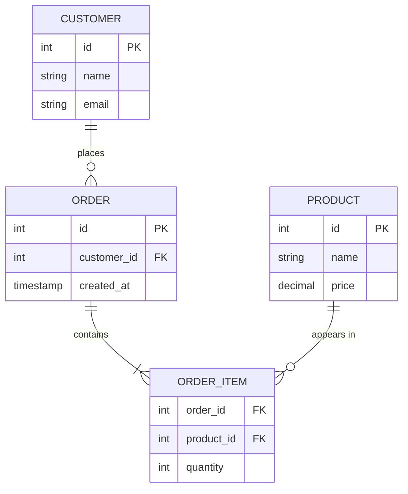

# Database Crash Course

This is the **fast on-ramp** to databases: what they are, how relational data is structured, and the handful of SQL statements that do most of the work. It is deliberately concise — read it top to bottom. When you need depth (normalization theory, indexing internals, distributed databases, query planning), head to the comprehensive [Database Design](database-design/) reference.

## What is a database?

A **database** is an organized, persistent collection of structured data. A **database management system (DBMS)** — PostgreSQL, MySQL, SQLite, MongoDB — is the software that stores it, answers queries, enforces rules, and coordinates many users reading and writing at once without corrupting each other's data. Three properties distinguish a database from a pile of files:

- **Structure** — data lives in defined shapes (tables or documents), not loose files.
- **Integrity** — constraints and transactions keep data valid and consistent.
- **Speed at scale** — indexes make finding one row among millions near-instant.

## Two big families: SQL vs NoSQL

The first decision is which kind of database fits your data and access patterns.

| | Relational (SQL) | NoSQL |
|---|------------------|-------|
| **Model** | Tables of rows and columns | Documents, key-value, wide-column, or graph |
| **Schema** | Fixed, defined up front | Flexible / schema-less |
| **Query language** | SQL (standardized) | Varies per product |
| **Consistency** | Strong (ACID transactions) | Often eventual; tunable |
| **Best for** | Structured data with relationships | High write volume, evolving or hierarchical data |
| **Examples** | PostgreSQL, MySQL, SQLite | MongoDB, Redis, Cassandra, Neo4j |

> **Rule of thumb.** Start with a relational database (PostgreSQL is an excellent default). Reach for NoSQL when a concrete requirement — huge scale, a document-shaped data model, sub-millisecond key lookups, or graph traversal — actually demands it.

## The relational model in one picture

Relational data is organized into **tables**. Tables connect to each other through keys: a **primary key** uniquely identifies each row, and a **foreign key** in one table points to a primary key in another.



| Term | Meaning |
|------|---------|
| Table | A collection of related rows (e.g. `customers`) |
| Row (record) | One entity instance (one customer) |
| Column (field) | One attribute (`email`) |
| Primary key | Column(s) uniquely identifying a row |
| Foreign key | A column referencing another table's primary key |

## SQL essentials

SQL splits into a few sublanguages. You will use **DDL** to shape tables and **DML** to work with data.

### Defining tables (DDL)

```sql
CREATE TABLE customers (
    id          SERIAL PRIMARY KEY,
    name        VARCHAR(100) NOT NULL,
    email       VARCHAR(255) UNIQUE,
    created_at  TIMESTAMP DEFAULT CURRENT_TIMESTAMP
);

ALTER TABLE customers ADD COLUMN phone VARCHAR(20);
DROP TABLE customers;
```

### Reading and writing data (DML)

```sql
-- Create
INSERT INTO customers (name, email)
VALUES ('Ada Lovelace', 'ada@example.com');

-- Read
SELECT name, email
FROM customers
WHERE created_at >= '2024-01-01'
ORDER BY name
LIMIT 10;

-- Update
UPDATE customers SET phone = '555-0100' WHERE id = 1;

-- Delete
DELETE FROM customers WHERE id = 1;
```

> The four DML verbs map to the classic **CRUD** operations: `INSERT` = Create, `SELECT` = Read, `UPDATE` = Update, `DELETE` = Delete.

### Joining tables

Relationships become useful when you combine tables in one query.

```sql
-- Every order with its customer's name (only matching rows)
SELECT o.id, c.name, o.created_at
FROM orders o
INNER JOIN customers c ON o.customer_id = c.id;

-- Every customer, with a count of their orders (including zero)
SELECT c.name, COUNT(o.id) AS order_count
FROM customers c
LEFT JOIN orders o ON c.id = o.customer_id
GROUP BY c.id, c.name;
```

| Join | Returns |
|------|---------|
| `INNER JOIN` | Only rows that match in both tables |
| `LEFT JOIN` | All left-table rows; nulls where no match |
| `RIGHT JOIN` | All right-table rows; nulls where no match |
| `FULL JOIN` | All rows from both, matched where possible |

## Indexes: the speed dial

An index is a separate data structure that lets the database find rows without scanning the whole table — the difference between a query taking milliseconds versus seconds.

```sql
CREATE INDEX idx_customers_email ON customers(email);
```

Indexes are a trade-off:

- **They help:** speed up `WHERE`, `JOIN`, and `ORDER BY` on the indexed columns, and can enforce uniqueness (a unique index).
- **They cost:** extra disk space, and slower writes — every `INSERT`/`UPDATE` must update the index too.

Index the columns you frequently filter or join on; don't index everything. See [Database Design → Indexing](database-design/indexing-and-queries.html#indexing-making-queries-lightning-fast) for B-tree internals and composite-index ordering.

## Transactions: all-or-nothing

A **transaction** groups operations so they either all succeed or all fail. The textbook example is moving money between two bank accounts: the debit and the credit are two separate `UPDATE`s, but the bank must never end up in a state where one ran and the other didn't.

```sql
-- Transfer $100 from Alice (id 1) to Bob (id 2)
BEGIN;
  UPDATE accounts SET balance = balance - 100 WHERE id = 1;
  -- Imagine the server crashes RIGHT HERE.
  UPDATE accounts SET balance = balance + 100 WHERE id = 2;
COMMIT;     -- or ROLLBACK; to undo everything
```

Without a transaction, a crash after the first `UPDATE` would vaporize $100: Alice is debited, Bob is never credited, and the missing money simply ceases to exist. Wrapped in `BEGIN ... COMMIT`, the two updates are one indivisible unit. If anything fails before `COMMIT` — a crash, a constraint violation, a deadlock — the database performs a `ROLLBACK` and the accounts look exactly as they did before `BEGIN`.

That money transfer also illustrates each **ACID** guarantee concretely:

| Property | Promise | In the transfer |
|----------|---------|-----------------|
| **A**tomicity | All steps complete, or none do | Both the debit and credit apply, or neither does — never just one |
| **C**onsistency | The database moves between valid states only | The total balance across all accounts is unchanged; a `CHECK (balance >= 0)` constraint stops an overdraft and aborts the whole transfer |
| **I**solation | Concurrent transactions don't corrupt each other | A second transfer reading Alice's balance at the same time sees either the pre-transfer or post-transfer amount, never the in-between state where $100 has vanished |
| **D**urability | Once committed, data survives a crash | After `COMMIT` returns, the transfer is on disk; pulling the power cord one millisecond later does not undo it |

> Isolation is the subtle one. Run two transfers against the same account simultaneously and a naive read-then-write can lose an update. Databases offer **isolation levels** (`READ COMMITTED`, `REPEATABLE READ`, `SERIALIZABLE`) that trade concurrency for stronger guarantees. See [Database Design → Transactions & Concurrency](database-design/transactions-and-concurrency.html) for the anomalies each level prevents.

## A glimpse of NoSQL

NoSQL is not "SQL with different syntax" — it's a different bet about what matters. Relational databases optimize for **flexible, ad-hoc queries** over normalized data: you can join any tables and ask questions you never anticipated, and the database enforces consistency for you. NoSQL stores trade some of that flexibility away in exchange for **scale and a particular access pattern**. You reach for one when you can answer "yes" to a concrete question about how the data is actually read and written, not just because it sounds modern.

The motivation almost always comes down to **access patterns and scale**:

- **You read the data the same way every time.** If 99% of requests are "give me this user's whole profile and recent orders by user ID," a document store lets you fetch that entire object in one lookup, with no joins. The relational version would join three or four tables on every page load.
- **You need to scale writes horizontally.** A single relational primary node has a ceiling. Wide-column stores like Cassandra spread writes across many nodes by a partition key, accepting eventual consistency so that a node failure or a traffic spike doesn't stall the whole system.
- **The data is hierarchical or schema-variable.** Catalog items where every category has different attributes, or event payloads that change shape over time, fight against a fixed table schema but fit naturally into documents.
- **The lookup must be sub-millisecond.** An in-memory key-value store answers "what's in this session/cart/rate-limit counter" far faster than any disk-backed table.

```javascript
// Document store (MongoDB): the customer and their orders are stored
// together because the app ALWAYS reads them together — one lookup by
// _id returns the whole object, no JOIN required.
{
  "_id": "...",
  "name": "Ada Lovelace",
  "email": "ada@example.com",
  "orders": [
    { "id": 1, "items": ["widget", "gadget"], "total": 99.99 }
  ]
}
```

```bash
# Key-value store (Redis): direct, in-memory, sub-millisecond lookups by
# key — ideal for sessions, caches, and counters, not ad-hoc queries.
SET   user:1000:name  "Ada Lovelace"
HSET  user:1000:prefs theme "dark" lang "en"
```

The cost of embedding orders inside the customer document is the flip side of the benefit: there is no cheap way to ask "which customers bought a widget?" without scanning every document. That query is trivial in SQL and awkward in a document store — which is exactly why the rule of thumb is to model NoSQL around your known access patterns, and to default to relational when your queries are still evolving. See [Database Design → NoSQL Data Models](database-design/nosql-data-models.html) for document, key-value, wide-column, and graph stores in depth.

## Getting hands-on

The fastest way to learn is to run a database locally. With Docker it is one command:

```bash
# Spin up PostgreSQL, then connect with psql
docker run -d --name pg -e POSTGRES_PASSWORD=dev -p 5432:5432 postgres:16
docker exec -it pg psql -U postgres
```

Or use **SQLite**, which needs no server at all — perfect for learning:

```bash
sqlite3 practice.db
sqlite> CREATE TABLE notes (id INTEGER PRIMARY KEY, body TEXT);
```

## Key Takeaways

- **Relational databases store data in linked tables;** primary and foreign keys define the relationships.
- **SQL's core is CRUD:** `SELECT`, `INSERT`, `UPDATE`, `DELETE`, plus `JOIN` to combine tables.
- **Indexes trade write speed and space for dramatically faster reads** — add them to columns you filter on.
- **Transactions give all-or-nothing safety** with ACID guarantees.
- **Default to relational (PostgreSQL); choose NoSQL** only when a specific requirement justifies it.

## See Also

- [Database Design](database-design/) — the full reference: normalization, indexing internals, query execution, distributed databases, and tuning
- [AWS Databases](aws/databases.html) — managed RDS, DynamoDB, and Aurora
- [Docker Essentials](docker-essentials.html) — run databases locally for development
- [Distributed Systems](../distributed-systems/) — consistency, replication, and the CAP theorem in depth

## References

- [PostgreSQL Documentation](https://www.postgresql.org/docs/)
- [MySQL Documentation](https://dev.mysql.com/doc/)
- [SQLite Documentation](https://www.sqlite.org/docs.html)
- [MongoDB Documentation](https://docs.mongodb.com/)
- [Use The Index, Luke!](https://use-the-index-luke.com/) — a practical guide to SQL indexing
