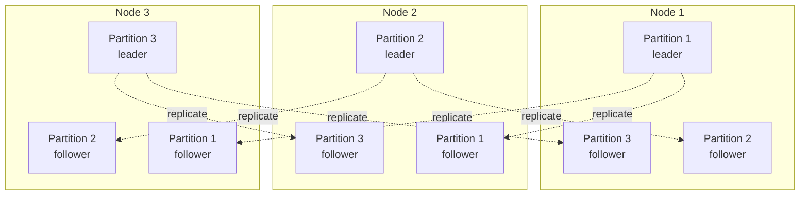
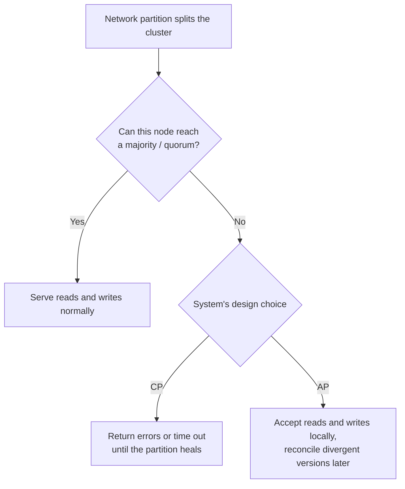
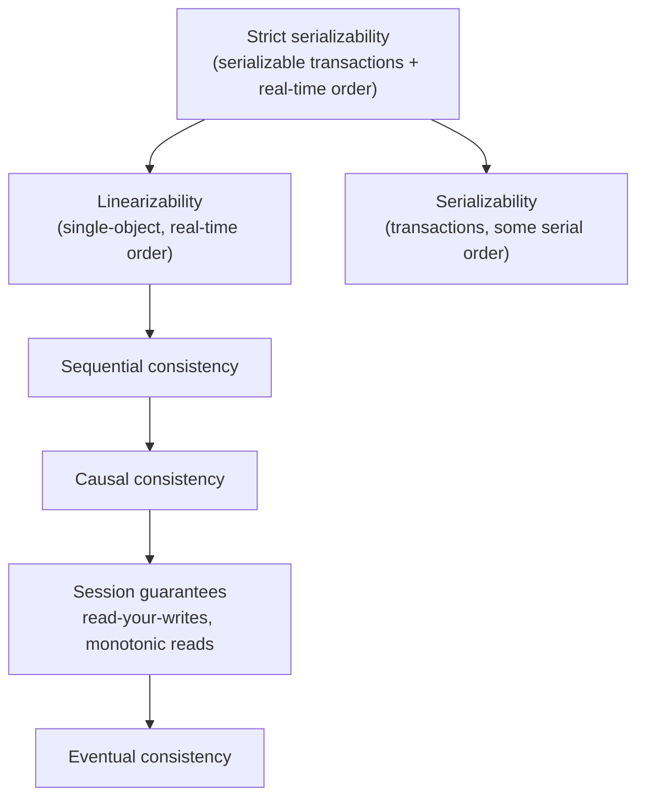
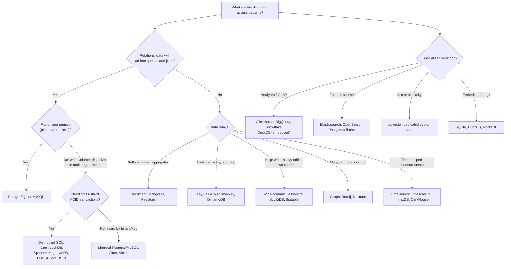

<p><a href="./">&larr; Database Design</a></p>

# Distributed & NoSQL Databases

A database is distributed when its data or its work is spread over more than one machine — to hold more data than one server can, to serve more traffic, to survive the loss of a machine or a datacenter, or to sit closer to users. Distribution brings back problems that a single node hides: machines fail independently, networks partition, and clocks disagree. This page is the entry point for that material. It covers the two basic techniques (replication and partitioning), the trade-offs every distributed store must make (CAP, PACELC and the spectrum of consistency models), consensus in brief, how to choose a database, where the field is heading, and several published case studies. The mechanisms have their own pages:

| Deep dive | Covers |
|---|---|
| [Replication & Consensus](replication-and-consensus.html) | Leader-based and leaderless replication, streaming and logical replication, replication lag, Raft and Paxos, failover, quorums |
| [Distributed Transactions](distributed-transactions.html) | Two- and three-phase commit, commit over consensus, sagas, the outbox pattern, idempotency, exactly-once processing |
| [NoSQL Data Models](nosql-data-models.html) | Document, key-value, wide-column, graph, time-series and vector stores, and how to model for each |

## Replication and Partitioning

Every distributed database combines two independent techniques:

- **Replication** keeps *copies of the same data* on several nodes. It provides fault tolerance and read scaling, and lets data sit near users. It does not increase write capacity or total storage, because every replica holds everything.
- **Partitioning** (also called **sharding**) splits the data into *disjoint subsets* and places each on different nodes. It increases storage and write capacity, but on its own it reduces availability: losing any partition loses that part of the data.

Real systems do both — each partition is replicated, typically three times — so a cluster of nodes holds many partition replicas, and each node is a leader for some partitions and a follower for others:



Replication is covered in [Replication & Consensus](replication-and-consensus.html). The rest of this section covers partitioning.

### Partitioning strategies

The partitioning function decides which partition owns a key. The choice determines whether range queries are efficient and whether load spreads evenly.

| Strategy | How keys map to partitions | Range scans | Load balance | Used by |
|---|---|---|---|---|
| **Range** | Contiguous key ranges, split automatically when a range grows too large | Efficient: adjacent keys are together | Sequential keys (timestamps, auto-increment ids) all hit the last range | Bigtable, HBase, CockroachDB, TiDB, Spanner, YugabyteDB (optional) |
| **Hash** | `hash(key) mod N`, or hash space divided into ranges | Scatter to every partition | Even, for well-distributed keys | MongoDB hashed shard keys, Redis Cluster (16,384 hash slots), YugabyteDB default |
| **Consistent hashing** | Keys and nodes placed on a ring; each key belongs to the next node clockwise, usually with many virtual nodes per server | Scatter | Even; adding a node moves only about $1/N$ of the keys | Cassandra, ScyllaDB, DynamoDB (internally), Riak |
| **Directory / lookup** | A metadata service maps each key or tenant to a partition | Depends on placement | Explicit control, e.g. move a large tenant to its own shard | Vitess, Citus (distribution column plus metadata), many multi-tenant SaaS designs |

Naive `hash(key) mod N` is a trap: changing $N$ moves almost every key. Systems that hash either use consistent hashing or pre-split the hash space into many more partitions than nodes (Redis Cluster's fixed 16,384 slots, for example) and move whole partitions when nodes join.

### Partitioning pitfalls

- **Hot partitions.** A skewed key (a celebrity account, a popular product, "today" in a time-keyed table) concentrates traffic on one partition however many nodes you add. Mitigations: add a random or hashed prefix to spread writes (and fan out reads), split hot keys into several sub-keys, or cache the hottest reads.
- **Monotonic keys on range partitioning.** Auto-increment ids and timestamps always append to the last range. Use hash-sharded keys or random identifiers (for example UUIDv4) when write distribution matters more than ordering.
- **Cross-partition operations.** Queries that do not include the partition key are sent to every partition (*scatter-gather*); their latency is that of the slowest partition. Transactions that touch several partitions need a [distributed commit](distributed-transactions.html). Choose the partition key so the most frequent reads and writes touch one partition.
- **Secondary indexes.** A *local* index (each partition indexes only its own rows) makes writes cheap but secondary-key reads scatter-gather. A *global* index (partitioned by the indexed value) makes those reads targeted but makes each write touch several partitions, and it is often updated asynchronously (DynamoDB global secondary indexes, for example).
- **Rebalancing.** Moving data between nodes competes with foreground traffic. Automatic rebalancing is convenient but should be rate-limited; many operators prefer to approve large moves.

## The CAP Theorem

<span id="the-cap-theorem-pick-two"></span>

Eric Brewer conjectured in 2000, and Seth Gilbert and Nancy Lynch proved in 2002, that a distributed data store cannot simultaneously guarantee all three of:

- **Consistency** — in the theorem's precise sense, *linearizability*: every read returns the most recent completed write, as if there were a single copy of the data.
- **Availability** — every request received by a non-failed node eventually gets a non-error response.
- **Partition tolerance** — the system keeps operating even when the network drops or delays arbitrary messages between nodes.

The popular "pick two of three" summary is misleading. Network partitions are not optional in a system that spans more than one machine, so partition tolerance cannot be traded away. The real choice is **what the system does while a partition lasts**:

- **CP** — keep consistency and give up availability on the side that cannot reach a quorum. Nodes in the minority partition refuse writes (and usually linearizable reads) rather than risk diverging. Consensus-based systems — etcd, ZooKeeper, Spanner, CockroachDB — behave this way.
- **AP** — keep answering on both sides and reconcile later, using last-write-wins timestamps, version vectors or CRDTs (conflict-free replicated data types). Dynamo-style stores such as Cassandra and Riak in their default configurations behave this way.

A so-called "CA" system is simply one that is not distributed across a network that can partition, such as a single-node database.



Two sketches of the choice in application terms:

```python
# CP: a withdrawal must be confirmed by a majority of replicas
def withdraw(account_id, amount):
    try:
        with quorum_transaction(account_id) as tx:        # fails if no majority is reachable
            if tx.balance() < amount:
                return "Insufficient funds"
            tx.debit(amount)
            return "OK"
    except QuorumUnavailable:
        return "Service unavailable, try again later"     # refuse rather than risk an overdraft

# AP: always answer, even if the freshest copy is unreachable
def get_feed(user_id):
    try:
        return latest_feed(user_id)
    except ReplicaUnreachable:
        return local_replica_feed(user_id)                # possibly a few seconds stale
```

Most real systems are tunable rather than purely CP or AP: Cassandra's per-query consistency levels, MongoDB's read and write concerns, and DynamoDB's choice between eventually consistent and strongly consistent reads let an application choose per operation.

### PACELC: the trade-off when nothing is broken

CAP only describes behaviour during a partition, which is rare. Daniel Abadi's **PACELC** formulation (2012) adds the trade-off that applies the rest of the time: **if** there is a **P**artition, choose **A**vailability or **C**onsistency; **e**lse, choose **L**atency or **C**onsistency. Keeping replicas strongly consistent requires coordination on every write, which costs round trips even when the network is healthy.

| System (default configuration) | During a partition | Normal operation |
|---|---|---|
| Cassandra, ScyllaDB, Riak | Availability (PA) | Latency (EL) |
| DynamoDB (eventually consistent reads) | Availability (PA) | Latency (EL) |
| Spanner, CockroachDB, YugabyteDB, etcd | Consistency (PC) | Consistency (EC) |

These labels describe defaults; most systems can be configured toward the other end.

### Consistency models

"Consistency" is a spectrum, not a switch. From strongest to weakest, the models most often encountered are:



| Model | Guarantee | Example systems |
|---|---|---|
| **Strict serializability** (external consistency) | Transactions appear to run one at a time, in an order consistent with real time | Spanner, FoundationDB, CockroachDB (for single-key operations; serializable across keys) |
| **Linearizability** | Each single-object operation appears to take effect instantaneously between its start and end | etcd, ZooKeeper writes, consensus-replicated stores |
| **Causal consistency** | Operations that are causally related are seen by everyone in the same order; concurrent ones may be seen in different orders | MongoDB causally consistent sessions |
| **Read-your-writes / monotonic reads** | A client sees its own writes and never sees time go backwards | Sticky sessions, reading from the leader after a write |
| **Eventual consistency** | If writes stop, all replicas eventually converge | Dynamo-style stores at low consistency levels, DNS, asynchronous replicas |

Stronger models are easier to program against and cost more coordination, and therefore latency. Anomalies caused by replication lag, and how to avoid them, are catalogued in [Replication & Consensus](replication-and-consensus.html).

## Consensus in Brief

A CP system rests on **consensus**: getting a set of nodes to agree on a value, or on an ordered log of values, even though some may crash and messages may be delayed or reordered. Databases use it for **leader election** (exactly one leader per term, so a partitioned former leader cannot keep accepting writes) and **state-machine replication** (every replica applies the same writes in the same order). Raft and Paxos both require a **majority** to act. Any two majorities of the same set of nodes share at least one member, so two conflicting decisions can never both be accepted. That argument is why consensus clusters run an odd number of nodes (three or five) and why a minority partition stops rather than diverging.

| Protocol | Characteristics | Used by |
|---|---|---|
| **Raft** | Same safety guarantees as Multi-Paxos; designed to be understandable, with strong leadership and a simple log | etcd (Kubernetes), Consul, CockroachDB, TiKV/TiDB, YugabyteDB, Kafka KRaft, MongoDB replica sets (a Raft-derived protocol) |
| **Paxos / Multi-Paxos** | The original formulation (Lamport); many variants | Google Chubby and Spanner, DynamoDB partitions, Cassandra lightweight transactions |

Leader election, log replication, terms, the safety argument and Dynamo-style quorums are explained in [Replication & Consensus](replication-and-consensus.html). Making a *transaction* atomic across several consensus groups is a separate problem, covered in [Distributed Transactions](distributed-transactions.html#commit-over-consensus).

## Choosing a Database

There is no best database, only the one whose trade-offs match the workload. Start from the data's shape and the access patterns, not from the product.



### Comparison

| Database | Model | Strong at | Weak at | How it scales |
|---|---|---|---|---|
| **PostgreSQL** | Relational | General-purpose OLTP, complex queries, extensions (PostGIS, pgvector, TimescaleDB) | Write scale beyond one primary without sharding extensions | Vertical, read replicas; horizontal via Citus |
| **MySQL** | Relational | Simple high-throughput OLTP, very mature replication | Complex analytical SQL | Vertical, replicas; horizontal via Vitess |
| **MongoDB** | Document | Aggregate-shaped data, flexible schema | Workloads needing many cross-document joins | Built-in hash or range sharding |
| **Cassandra / ScyllaDB** | Wide-column | Very high write throughput, multi-datacenter, always-on | Ad-hoc queries, joins, strong consistency on every operation | Consistent hashing, linear node addition |
| **Redis / Valkey** | Key-value (in-memory) | Caching, counters, queues, leaderboards, rate limiting | Datasets larger than memory; system of record without careful persistence setup | Redis Cluster hash slots |
| **DynamoDB** | Key-value and document (managed) | Predictable single-digit-millisecond key access at any scale, serverless operation | Ad-hoc queries; access patterns not designed up front | Automatic partitioning |
| **Neo4j** | Graph | Deep, variable-length relationship traversal | Bulk aggregation over all data | Primarily vertical, with read replicas |
| **ClickHouse** | Columnar OLAP | Fast aggregations over billions of rows | Frequent single-row updates and deletes; OLTP | Sharded and replicated clusters |
| **CockroachDB / Spanner / YugabyteDB** | Distributed SQL | ACID transactions and SQL across regions | Latency-sensitive workloads that fit on one node | Automatic range partitioning over consensus groups |
| **SQLite** | Embedded relational | Local and edge storage, zero administration | Many concurrent writers (one writer at a time) | Single file; replicated variants exist (libSQL, LiteFS) |

### Rules of thumb

- **Start relational.** PostgreSQL or MySQL is the right default for most applications. A single well-tuned server with replicas handles far more than most products ever need, and the relational model accommodates access patterns you have not thought of yet.
- **Model the queries in NoSQL.** Most NoSQL stores have no joins at read time: decide the access patterns first, then shape and duplicate data so each is one cheap lookup. See [NoSQL Data Models](nosql-data-models.html).
- **Need ACID and horizontal write scale?** That is the distributed SQL niche. Expect higher per-transaction latency than a single node, and retries on contention.
- **Polyglot persistence is normal, but has a cost.** Large systems commonly combine a relational system of record, a cache, a search index and an analytics store. Each additional engine brings its own operations, backups and consistency questions, and data moving between them usually needs [CDC or an outbox](distributed-transactions.html#the-outbox-pattern).

## Where Databases Are Heading

The main directions visible as of 2026:

**Distributed SQL has matured.** Systems that put SQL and serializable transactions on top of consensus-replicated, automatically partitioned storage — Spanner, CockroachDB, YugabyteDB, TiDB — are now established choices, and Amazon Aurora DSQL (generally available in 2025) brought a serverless, PostgreSQL-compatible variant that uses optimistic concurrency control. Licensing has shifted too: CockroachDB retired its open-source Core edition in November 2024 in favour of a single Enterprise licence with a free tier for small companies.

```sql
-- Spanner: ordinary-looking DDL; rows of a child table can be
-- stored physically with their parent ("interleaving")
CREATE TABLE users (
    user_id    INT64 NOT NULL,
    email      STRING(255),
    created_at TIMESTAMP
) PRIMARY KEY (user_id);

CREATE TABLE orders (
    user_id  INT64 NOT NULL,
    order_id INT64 NOT NULL,
    total    NUMERIC
) PRIMARY KEY (user_id, order_id),
  INTERLEAVE IN PARENT users ON DELETE CASCADE;
```

```sql
-- CockroachDB: pin each row to a home region for low-latency local access
ALTER DATABASE shop PRIMARY REGION "us-east1";
ALTER DATABASE shop ADD REGION "europe-west1";
ALTER TABLE orders SET LOCALITY REGIONAL BY ROW;   -- adds a hidden crdb_region column
```

**PostgreSQL as a platform.** Much innovation now ships as Postgres extensions or Postgres-compatible services rather than new engines: vector search (pgvector), time-series (TimescaleDB), sharding (Citus), analytics accelerators, and many "Postgres-compatible" distributed databases. PostgreSQL 18 (September 2025) added an asynchronous I/O subsystem, B-tree skip scan, virtual generated columns and a built-in `uuidv7()` function.

**Separated storage and compute.** Cloud databases increasingly store data in a shared, replicated storage layer (often backed by object storage) and run stateless compute nodes on top: Amazon Aurora, Neon, Snowflake, and the lakehouse model built on open table formats such as Apache Iceberg and Delta Lake. This enables instant branching and scale-to-zero. Neon's serverless Postgres, which popularised database branching, agreed to be acquired by Databricks in 2025.

**Vector search moves into general-purpose databases.** Dedicated vector databases (Pinecone, Weaviate, Qdrant, Milvus) remain, but most mainstream engines now offer approximate nearest-neighbour indexes alongside ordinary data — pgvector for PostgreSQL, vector search in MongoDB Atlas, Cassandra 5.0 and Redis — so embeddings can be filtered and joined with the rest of the data. See [Indexing & Query Execution](indexing-and-queries.html#index-types).

**Embedded and edge databases.** SQLite continues to spread to servers and the edge (Cloudflare D1, Turso's libSQL), and DuckDB has become the default embedded engine for analytics, querying Parquet and Iceberg data in-process.

**Learned components.** *Learned indexes* (Kraska et al., 2018) replace tree traversal with a model of the key distribution — the model predicts a key's position from its cumulative distribution, and a small bounded search corrects the error:

```python
def learned_lookup(key, model, data, max_error):
    pos = int(model.predict(key) * len(data))      # approximate CDF(key) * N
    lo, hi = max(0, pos - max_error), min(len(data), pos + max_error + 1)
    return binary_search(data, key, lo, hi)
```

Results on read-only data are strong, but updates and worst-case guarantees remain difficult, and mainstream engines still use B+ trees and LSM trees. Machine-learning-assisted plan steering (deployed, for example, in Microsoft's SCOPE big-data system; research prototypes such as Bao) and automatic index tuning in managed services are in limited production use. Natural-language-to-SQL with large language models is useful for exploration, but generated queries must be reviewed like any other code — they can be subtly wrong while looking plausible.

## Case Studies

The following are drawn from engineering blog posts published by the companies involved.

### Discord: Cassandra to ScyllaDB

Discord stores messages in a wide-column store partitioned by channel and a time bucket, so that the dominant query — recent messages in a channel — reads one partition:

```sql
-- CQL
CREATE TABLE messages (
    channel_id BIGINT,
    bucket     INT,         -- fixed time window derived from the message id
    message_id BIGINT,
    author_id  BIGINT,
    content    TEXT,
    PRIMARY KEY ((channel_id, bucket), message_id)
) WITH CLUSTERING ORDER BY (message_id DESC);
```

Discord moved its messages from MongoDB to Cassandra early in its history (described publicly in 2017). By early 2022 the cluster had grown to 177 nodes holding trillions of messages and suffered from unpredictable latency, hot partitions in large servers, and garbage-collection pauses. In 2022 it migrated to ScyllaDB (a C++ reimplementation of Cassandra), placing Rust *data services* in front of the database that coalesce concurrent requests for the same partition. The cluster shrank to 72 nodes, and p99 latency for fetching historical messages fell from 40–125 ms to about 15 ms.

**Lessons:** the partition key must bound partition size (hence the time bucket); hot partitions are an application-level problem that a proxy layer can absorb; and tail latency, not average latency, drove the migration.

### Uber: Schemaless to Docstore

Uber built **Schemaless** (2014) as an append-only, versioned cell store on top of sharded MySQL, trading SQL for easy horizontal scale:

```json
{
  "row_key": "trip:8f2c",
  "column":  "BASE",
  "ref_key": 3,
  "body":    { "status": "completed", "fare": 17.40 }
}
```

Its restrictive API made it awkward as a general-purpose database, and in 2021 Uber described its successor, **Docstore**: a distributed database that still uses MySQL as the storage engine, but replicates each partition with Raft, offers strict serializability within a partition, supports transactions, schemas that can evolve, materialized views and change data capture.

**Lessons:** a mature single-node engine (MySQL) is a good building block for a distributed store; and "schemaless" systems tend to grow schemas and transactions back as their user base widens.

### Instagram: PostgreSQL plus Cassandra

Instagram kept its core data (users, media, relationships) in horizontally sharded PostgreSQL, using logical shards mapped to physical servers so that shards can be moved without re-keying. It adopted Cassandra for high-volume, append-heavy workloads such as feeds and activity inboxes, and in 2018 described **Rocksandra**, a Cassandra fork using RocksDB as its storage engine, built to reduce tail latency from JVM garbage collection.

**Lessons:** use a relational store where relationships and correctness matter and a wide-column store where the access pattern is a known, append-heavy timeline; and many logical shards on fewer physical servers make later rebalancing cheap.

## Design Practices That Scale

Choices that are free on day one and expensive to change later:

| Choice | Prefer | Why |
|---|---|---|
| Surrogate key type | `BIGINT` or a UUID, not `INT` | A 32-bit signed integer runs out at about 2.1 billion rows; widening a primary key on a large table is a major migration |
| UUID version | On a single node, UUIDv7 (time-ordered; `uuidv7()` in PostgreSQL 18). On range-partitioned distributed SQL, random UUIDv4 or hash-sharded keys | Random keys scatter inserts across a B-tree, causing page splits and poor cache locality; time-ordered keys on a range-partitioned cluster all land on the newest range |
| Timestamps | `timestamptz` (PostgreSQL) or UTC `TIMESTAMP`; convert only for display | Mixing local times makes ordering and arithmetic wrong across time zones and DST changes |
| Money | `NUMERIC`/`DECIMAL`, or integer minor units | Binary floating point cannot represent most decimal fractions exactly |
| Partition key (if sharding) | A key present in almost every query, with high cardinality and even load (tenant id, user id) | Queries without it scatter to every shard; skewed keys create hot partitions |
| Optimistic concurrency | A `version` column checked on update | Lets retries and concurrent edits be detected without long-held locks |
| Deletes | Hard deletes plus an audit or history table, or soft deletes with partial indexes | Soft deletes (`deleted_at`) complicate every query and unique constraint; use them deliberately |

```sql
-- PostgreSQL
CREATE TABLE orders (
    id          uuid        PRIMARY KEY DEFAULT uuidv7(),   -- PostgreSQL 18+
    customer_id bigint      NOT NULL REFERENCES customers (id),
    total       numeric(12,2) NOT NULL CHECK (total >= 0),
    status      text        NOT NULL DEFAULT 'pending',
    version     integer     NOT NULL DEFAULT 1,
    created_at  timestamptz NOT NULL DEFAULT now(),
    updated_at  timestamptz NOT NULL DEFAULT now()
);
CREATE INDEX idx_orders_customer_created ON orders (customer_id, created_at DESC);
```

PostgreSQL has no `ON UPDATE CURRENT_TIMESTAMP` column option (that is MySQL syntax); maintain `updated_at` with a trigger or in the application. Index foreign-key columns you join or delete through (see [Indexing & Query Execution](indexing-and-queries.html#unindexed-foreign-keys)).

> **Code reference:** Working implementations of the distributed algorithms referenced here are in [`distributed_systems.py`](../../../code-examples/technology/database-design/distributed_systems.py) and [`modern_databases.py`](../../../code-examples/technology/database-design/modern_databases.py).

## See Also

- [Replication & Consensus](replication-and-consensus.html) — how copies stay in sync and how Raft and Paxos agree under failure.
- [Distributed Transactions](distributed-transactions.html) — 2PC, commit over consensus, sagas, outbox and idempotency.
- [NoSQL Data Models](nosql-data-models.html) — document, key-value, wide-column, graph, time-series and vector stores.
- [Storage Engines & Recovery](storage-internals.html) and [Transactions & Concurrency](transactions-and-concurrency.html) — the single-node guarantees that distribution must preserve.
- **Up:** [Database Design hub](./)
- Related: [AWS](../aws/) for managed and serverless database services, and [Networking](../networking/) for the protocols beneath distributed systems.
