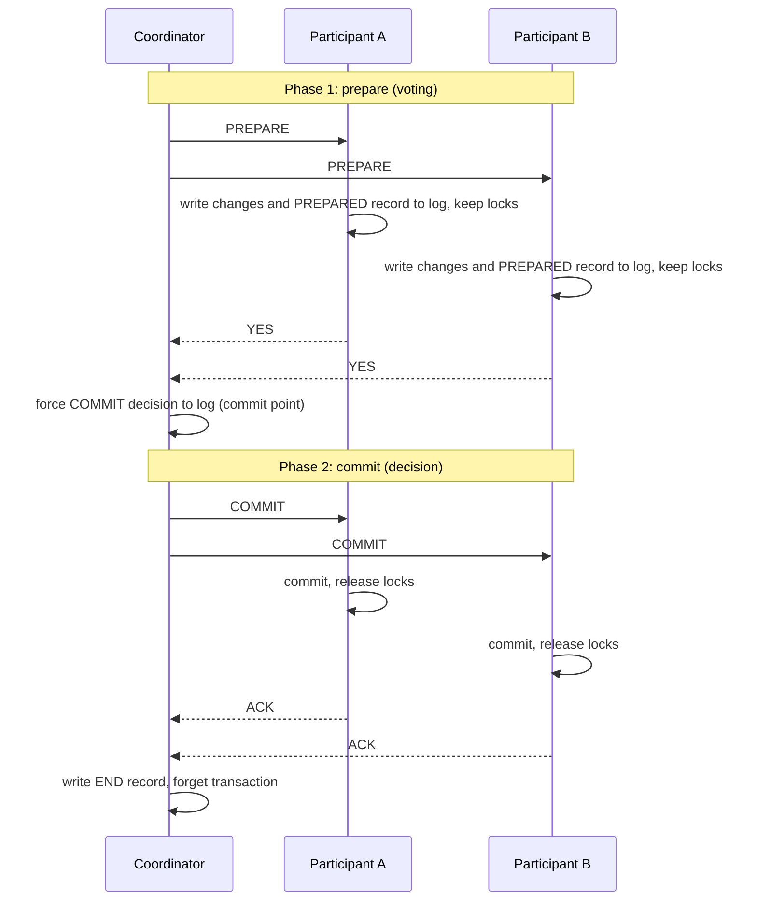
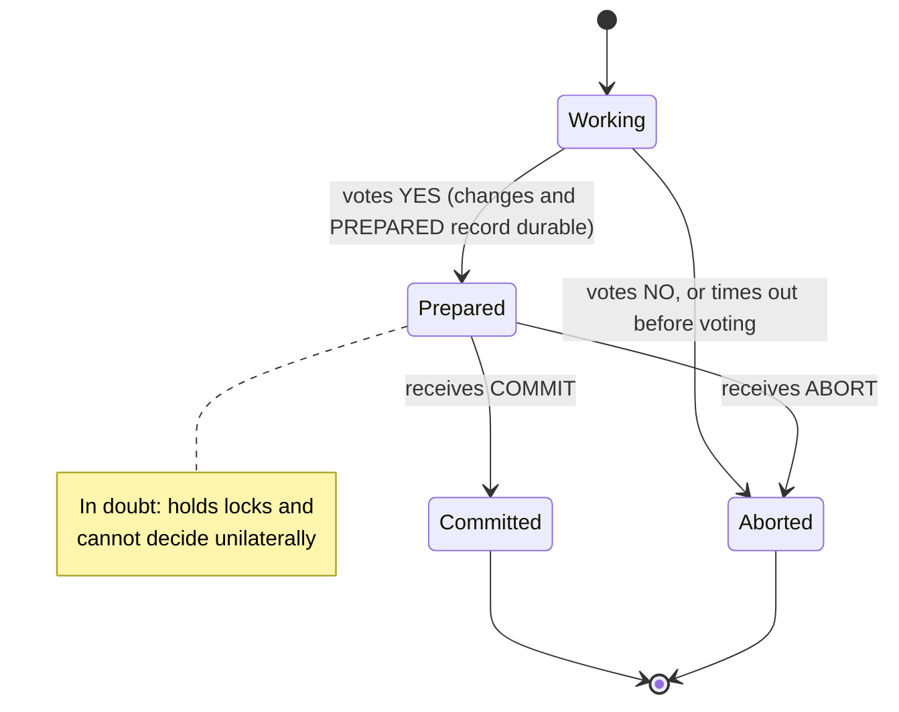
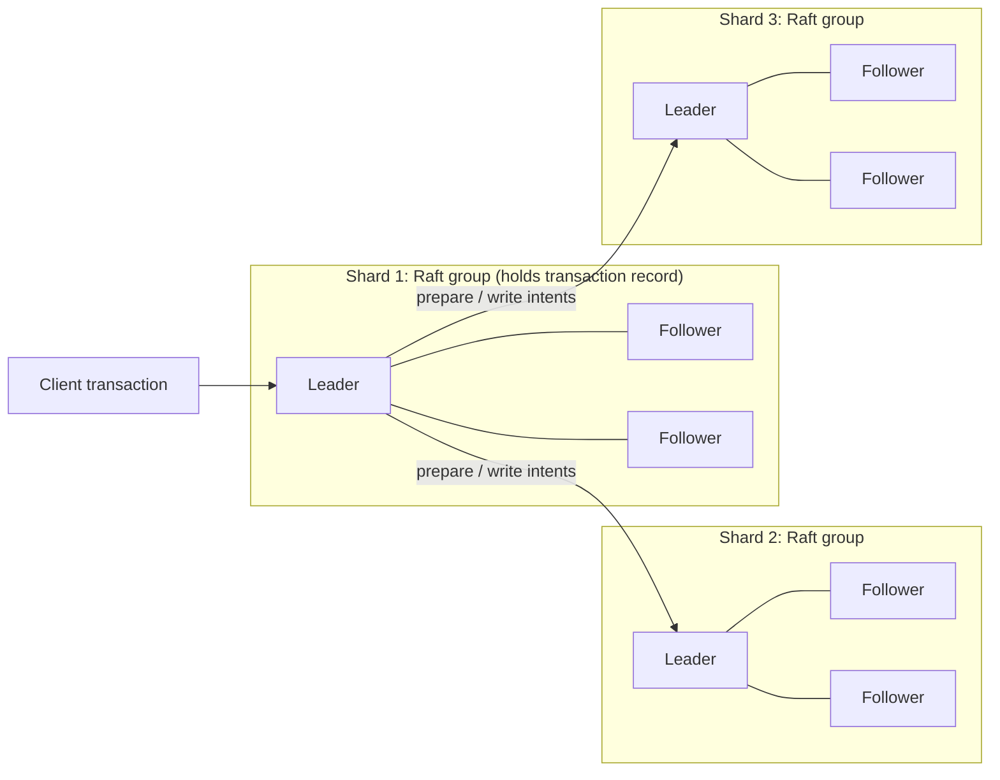
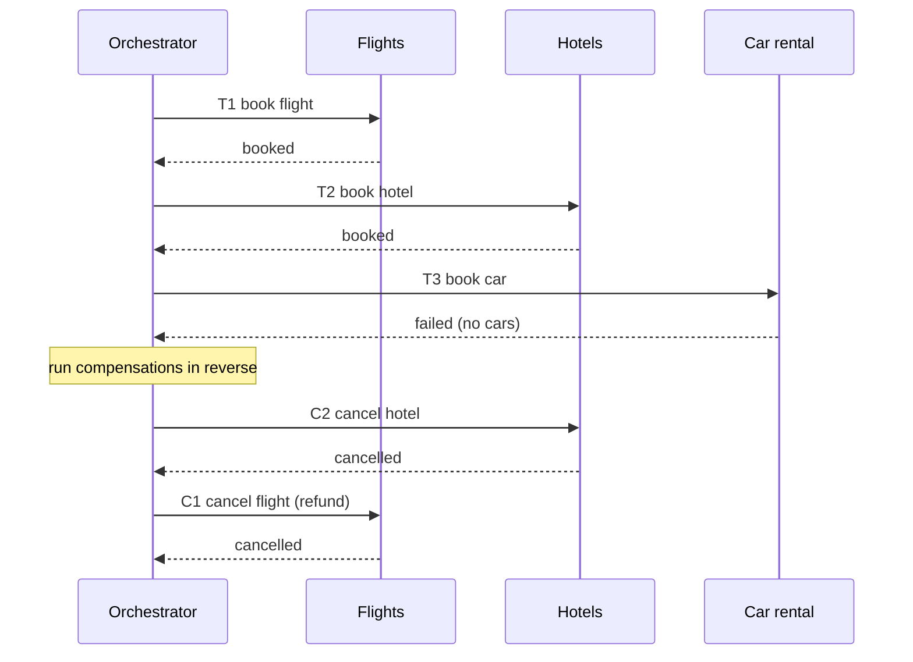
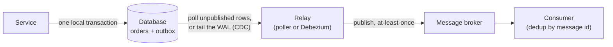
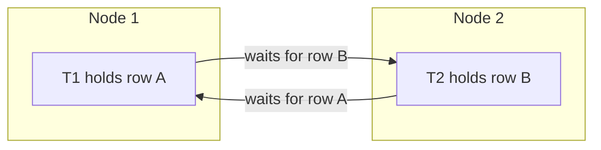
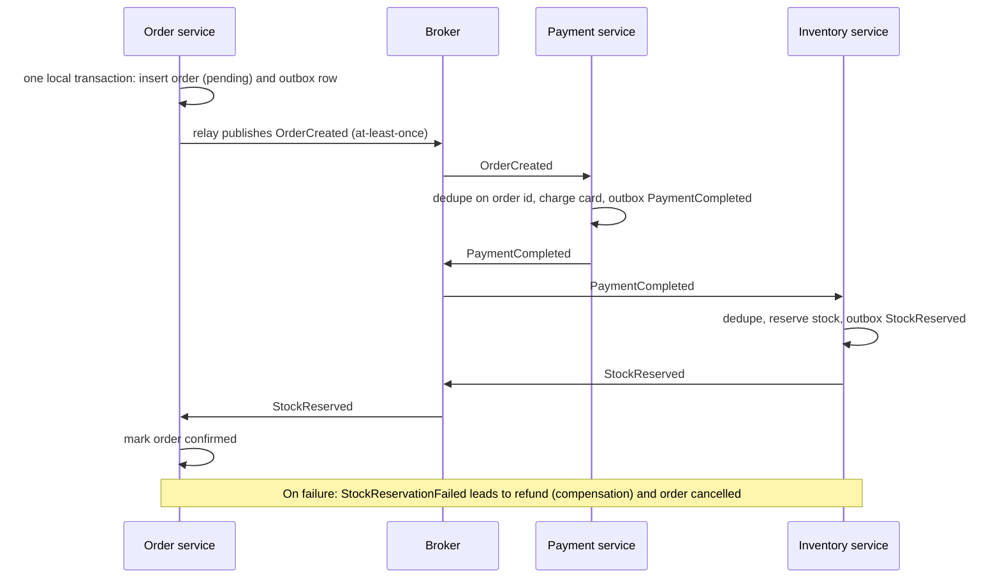

<p><a href="./">&larr; Database Design</a></p>

# Distributed Transactions

A single-node database makes a transaction atomic by writing one commit record to its write-ahead log: either the record is durable and every change survives, or it is not and none do. When a logical operation touches **several independent nodes** — shards of one database, separate databases, or a database plus a message broker — there is no single log to write. Each participant can crash independently, and the network between them can drop, delay or reorder messages. This page covers the ways systems restore "all or nothing" in that setting: coordinated atomic commit (two- and three-phase commit, and their modern consensus-backed forms), and the application-level alternatives that most service architectures use instead (sagas, the transactional outbox, idempotency and deduplication).

## The Atomic Commitment Problem

The problem is to make $N$ participants reach the same decision, commit or abort, such that:

- **Agreement** — no two participants decide differently.
- **Validity** — commit is decided only if every participant voted to commit; if all vote yes and nothing fails, the outcome is commit.
- **Termination** — every correct participant eventually decides.

Atomic commitment is closely related to consensus, and it inherits consensus's limits. The FLP result (Fischer, Lynch and Paterson, 1985) shows that in a fully asynchronous network no deterministic protocol can guarantee termination if even one node may crash, and Skeen (1981) showed that no commit protocol can be non-blocking when the network can partition. Practical systems therefore choose which property to weaken, and when.

| Approach | Consistency | Blocks on failure? | Coupling | Typical use |
|---|---|---|---|---|
| **Two-phase commit (2PC / XA)** | Atomic | Yes, if the coordinator fails | Tight | Within one database cluster or datacenter |
| **2PC over consensus groups** | Atomic, often serializable | Only if a majority of a group is lost | Tight, but hidden inside the database | Distributed SQL: Spanner, CockroachDB, YugabyteDB, TiDB |
| **Saga** | Eventual; no isolation | No | Loose | Long-running business processes across services |
| **Outbox + idempotent consumers** | Eventual; effectively-once effects | No | Loose | Publishing events reliably from a service's database |

The first two approaches give a true atomic commit; the last two accept that participants commit independently and restore consistency through application logic.

## Two-Phase Commit (2PC)

Two-phase commit (described by Jim Gray in 1978) uses one **coordinator** (the transaction manager) and several **participants** (resource managers).



**Phase 1 — prepare.** The coordinator asks each participant whether it can commit. A participant that votes **yes** first makes its changes and a `PREPARED` record durable in its own log, and keeps its locks. From that moment it has given up the right to abort on its own: it is **in doubt** until it learns the outcome. A participant that votes **no** can abort immediately.

**Phase 2 — commit or abort.** If every vote is yes, the coordinator decides commit; if any vote is no or a participant does not answer in time, it decides abort. It sends the decision to all participants, which apply it and release their locks.

```python
def two_phase_commit(tx_id, participants, log):
    votes = [p.prepare(tx_id) for p in participants]      # phase 1
    decision = "COMMIT" if all(v == "YES" for v in votes) else "ABORT"
    log.force_write(tx_id, decision)                      # the commit point
    for p in participants:                                # phase 2 (retried until acked)
        p.finish(tx_id, decision)
    log.write(tx_id, "END")
```

### The commit point

The decisive moment is when the coordinator **forces its decision to its own log**. Before that write, a crash leads to abort; after it, recovery re-reads the log and re-sends `COMMIT` until every participant acknowledges. Participants that crash after voting yes recover from their own logs, find the `PREPARED` record, and ask the coordinator for the outcome. 2PC is therefore built on top of each node's local write-ahead log, not a replacement for it.

A common optimisation, **presumed abort**, lets the coordinator skip logging abort decisions: if a participant asks about a transaction the coordinator has no record of, the answer is "abort".

Each participant moves through a small state machine; the `Prepared` state is where it can get stuck:



### Why 2PC blocks

2PC is **safe** — it never lets some participants commit while others abort — but it is **not live** when the coordinator fails. Suppose the coordinator crashes after every participant has voted yes but before any has received the decision:

- Each participant is in the `Prepared` state, holding its locks.
- It cannot commit, because the coordinator might have decided abort (for instance, if another vote arrived late).
- It cannot abort, because the coordinator might have decided commit and another participant may already have applied it.
- Asking the other participants does not help if they are all in doubt too.

Those locks stay held until the coordinator recovers, stalling every other transaction that touches the same rows. Two further operational costs follow:

- **Availability multiplies down.** A cross-participant commit needs the coordinator and every participant to be up. Five services at 99.9% availability give about $0.999^5 \approx 99.5\%$ for the combined operation.
- **Latency adds up.** Every commit costs at least two round trips plus two forced log writes on the critical path.

### 2PC in practice: XA and prepared transactions

The X/Open **XA** standard defines the interface between a transaction manager and resource managers, and most relational databases expose the participant side directly:

```sql
-- PostgreSQL participant side (requires max_prepared_transactions > 0; default is 0)
BEGIN;
UPDATE accounts SET balance = balance - 100 WHERE id = 1;
PREPARE TRANSACTION 'tx-7f3a';      -- phase 1: durable, locks retained, session detached

-- later, from any session, once the coordinator has decided
COMMIT PREPARED 'tx-7f3a';          -- or ROLLBACK PREPARED 'tx-7f3a'
```

MySQL offers the equivalent `XA START`, `XA PREPARE` and `XA COMMIT`. The operational hazard is the **orphaned prepared transaction**: if the external coordinator is lost, the prepared transaction survives restarts, keeps its locks, and in PostgreSQL also holds back `VACUUM`'s cleanup horizon. Monitor `pg_prepared_xacts` and alert on old entries. For this reason PostgreSQL disables prepared transactions by default and recommends enabling them only when an external transaction manager is actually in use.

## Three-Phase Commit (3PC)

Three-phase commit (Skeen, 1981) tries to remove 2PC's blocking by adding a round between voting and committing:

1. **CanCommit** — the coordinator collects votes, as in 2PC.
2. **PreCommit** — if all voted yes, the coordinator tells everyone so; participants acknowledge and enter a *pre-committed* state.
3. **DoCommit** — the coordinator tells participants to commit.

Because no participant commits until all have reached pre-commit, a participant that times out can decide on its own: if it has seen `PRECOMMIT`, everyone voted yes and it is safe to commit; if not, no one can have committed and it is safe to abort.

3PC is essentially unused in production. Its non-blocking argument holds only in a synchronous network with reliable failure detection. Under a network partition it can violate safety: one side that has seen `PRECOMMIT` commits by timeout while the other side, which has not, aborts. It also adds a round trip to every commit. The approach that replaced it is to make the coordinator itself fault-tolerant by replicating it with consensus.

## Commit Over Consensus

Modern distributed SQL databases keep 2PC but remove its single point of failure: **every participant and the coordinator's record are themselves replicated state machines** (Paxos or Raft groups; see [Replication & Consensus](replication-and-consensus.html)). A "node" in the 2PC protocol is then a group that survives the loss of a minority of its replicas, so the in-doubt window lasts only as long as a leader election, not as long as a machine repair.



- **Google Spanner** runs 2PC across Paxos groups. One group's leader acts as coordinator, and both the prepare records and the decision are Paxos-replicated. Transactions get commit timestamps from **TrueTime**, a clock API that returns an interval with bounded uncertainty (backed by GPS and atomic clocks); the coordinator *waits out* that uncertainty before making a commit visible, which gives **external consistency** (strict serializability) across the globe.
- **CockroachDB** writes provisional *write intents* on each range and a single transaction record whose status flip from pending to committed is the commit point. Its **parallel commits** protocol (since v19.2) writes the intents and a `STAGING` transaction record concurrently, so a distributed commit completes in roughly one round of consensus instead of two. It uses hybrid logical clocks rather than specialised hardware and defaults to `SERIALIZABLE` isolation.
- **Amazon Aurora DSQL** (generally available since 2025) is a PostgreSQL-compatible distributed SQL service that uses **optimistic concurrency control** with snapshot isolation: transactions take no locks, conflicts are checked at commit, and the loser receives a serialization failure (`SQLSTATE 40001`) that the application must retry. There are no lock waits and therefore no deadlocks, at the cost of more retries under contention.

From the application's point of view these systems offer an ordinary `BEGIN ... COMMIT`. The costs are commit latency that includes at least one consensus round trip (cross-region if replicas span regions) and the need to retry on serialization failures.

## The Saga Pattern

For a business process that spans services or takes minutes to days — booking a trip, fulfilling an order, onboarding a customer — holding locks across all participants for the whole duration is not practical. A **saga** (Garcia-Molina and Salem, 1987) is a sequence of local transactions $T_1, T_2, \ldots, T_n$, each of which commits on its own. Each step $T_i$ has a **compensating transaction** $C_i$ that semantically undoes it. If step $T_k$ fails, the saga runs $C_{k-1}, \ldots, C_1$ in reverse order.



### Compensation is semantic, not physical

A compensating transaction is not a rollback: the original step already committed and may have been observed. It is a *new* transaction that reverses the business effect — a refund, not an erased charge. This has consequences:

- **Compensations can be complex or lossy.** A refund may carry fees or be impossible after a cutoff.
- **Some steps cannot be undone.** An email cannot be unsent. Order the saga so that irreversible steps come after the **pivot transaction** — the step after which the saga is committed to completing — and make the steps after the pivot *retriable* rather than compensatable. Alternatively, split an irreversible action into a reversible reservation followed by a confirmation.
- **Compensations must be idempotent and retried until they succeed.** A compensation that fails leaves the system inconsistent, so it is retried (with backoff) rather than abandoned, and escalated to a human if it keeps failing.

### Orchestration and choreography

| | **Orchestration** | **Choreography** |
|---|---|---|
| Control | A central orchestrator invokes each step and records progress | Each service reacts to events emitted by others |
| Knowledge of the flow | In one place | Spread across services; emerges from subscriptions |
| Observability | The saga's state can be queried directly | Must be reconstructed from events and traces |
| Failure risk | Orchestrator logic grows complex | Cyclic dependencies; hard-to-trace failures |
| Suits | Many steps, clear ownership, frequent change | Few steps, highly independent teams |

An orchestrator must persist its progress so that it can resume after a crash:

```python
STEPS = [
    ("payment.charge",    "payment.refund"),
    ("inventory.reserve", "inventory.release"),
    ("shipping.dispatch", None),                 # pivot: no compensation, retried until done
]

def run_saga(saga_id, store, invoke):
    state = store.load(saga_id)                  # durable saga log
    for i in range(state.next_step, len(STEPS)):
        action, _ = STEPS[i]
        try:
            invoke(action, saga_id, idempotency_key=f"{saga_id}:{action}")
        except PermanentFailure:
            compensate(saga_id, completed=i, store=store, invoke=invoke)
            return "ABORTED"
        store.save(saga_id, next_step=i + 1)     # record progress after each step
    return "COMPLETED"

def compensate(saga_id, completed, store, invoke):
    for action, undo in reversed(STEPS[:completed]):
        if undo:
            invoke(undo, saga_id, idempotency_key=f"{saga_id}:{undo}")  # retried until it succeeds
```

Writing this machinery by hand — durable state, timers, retries, versioning of in-flight workflows — is where most home-grown sagas go wrong. **Durable execution** engines (Temporal, AWS Step Functions, Azure Durable Functions, Restate, DBOS and similar) provide it as a platform: the workflow is ordinary code whose progress is persisted after each step, so a crashed worker resumes where it stopped. They are the usual way to implement orchestrated sagas today.

A choreographed version of an order saga, expressed as events:

```text
OrderCreated            -> Payment charges card,        emits PaymentCompleted
PaymentCompleted        -> Inventory reserves stock,     emits StockReserved
StockReserved           -> Shipping dispatches,          emits OrderShipped

PaymentFailed           -> Order marks order failed (nothing to compensate)
StockReservationFailed  -> Payment refunds (compensation); Order cancels
```

### Sagas lack isolation

Because each step commits independently, other transactions can see a saga's intermediate states: a flight appears booked for a few seconds before the saga fails and cancels it. The anomalies are the familiar ones — lost updates, dirty reads, non-repeatable reads — at the level of business entities. Standard countermeasures:

- **Semantic lock** — mark records as `PENDING` so other sagas and readers know they are in flight.
- **Commutative updates** — prefer increments and decrements that give the same result in any order over absolute sets.
- **Reread and version check** — before acting or compensating, reread the record and verify its version (optimistic concurrency; see [Transactions & Concurrency](transactions-and-concurrency.html)).
- **Hide pending state** — exclude in-flight entities from other users' views until the saga completes.

## The Outbox Pattern

Event-driven services all face the same sub-problem: **update the database and publish a message, atomically**. The naive version is a *dual write*:

```python
# Broken: two systems, no shared transaction
def place_order(order):
    db.insert(order)                          # commits to PostgreSQL
    broker.publish("OrderCreated", order)     # sends to Kafka / RabbitMQ
```

If the process crashes between the two calls, the order exists but no event is ever sent. If the calls are reversed, an event can describe an order that was never committed. Reordering or `try/except` cannot fix this, because the broker and the database do not share a transaction. XA across both would reintroduce 2PC's blocking, and most brokers do not support it.

### The transactional outbox

Write the message into an `outbox` table **in the same local transaction** as the state change, and let a separate relay move it to the broker:



```sql
BEGIN;
  INSERT INTO orders (id, customer_id, total, status)
  VALUES ('ord-1', 'cust-9', 49.99, 'created');

  INSERT INTO outbox (id, aggregate_id, topic, payload, created_at)
  VALUES (gen_random_uuid(), 'ord-1', 'OrderCreated',
          '{"orderId": "ord-1", "total": 49.99}', now());
COMMIT;   -- both rows become durable together, through the local WAL
```

The relay can work in two ways:

- **Polling publisher.** A worker repeatedly selects unpublished rows, publishes them, and marks them sent. `FOR UPDATE SKIP LOCKED` lets several workers share the table without blocking each other (the same technique as a database-backed job queue; see [Transactions & Concurrency](transactions-and-concurrency.html)). Simple, but adds query load and polling latency.

  ```python
  def relay_batch():
      with db.transaction():
          rows = db.query(
              "SELECT id, topic, aggregate_id, payload FROM outbox "
              "WHERE published_at IS NULL ORDER BY created_at "
              "LIMIT 100 FOR UPDATE SKIP LOCKED")
          for row in rows:
              broker.publish(row.topic, row.payload, key=row.aggregate_id)
          db.execute("UPDATE outbox SET published_at = now() WHERE id = ANY(%s)",
                     ([r.id for r in rows],))
  ```

- **Change data capture (CDC).** A connector such as Debezium reads the database's replication stream (PostgreSQL logical decoding, the MySQL binlog) and turns each committed outbox insert into a broker message; Debezium's *outbox event router* handles the routing. No polling and lower latency, at the cost of running the CDC infrastructure and managing a replication slot. In PostgreSQL, `pg_logical_emit_message()` can write a message directly into the WAL for a CDC reader, avoiding the outbox table altogether.

Publish with the aggregate id as the message key so that events for one entity land in the same partition and stay in order. Delete or archive published rows regularly, or the outbox becomes the largest table in the database.

The outbox gives **at-least-once** delivery, not exactly-once: the relay can crash after publishing but before marking the row sent, and will publish it again. That is by design. The outbox guarantees that no message is lost; making duplicates harmless is the consumer's job, through [idempotency](#idempotency-keys). The mirror image on the receiving side is the **inbox pattern**: the consumer records each processed message id in an `inbox` table inside the same transaction as the effect, and skips ids it has seen.

## Idempotency Keys

An operation is **idempotent** if applying it several times has the same effect as applying it once. Timeouts, broker redeliveries, relays and client retries all cause the same request to arrive more than once, so idempotency is what makes retries safe.

Some operations are naturally idempotent: `SET status = 'shipped'`, an HTTP `PUT` of a full resource, `DELETE`. Others are not: `balance = balance + 100`, "create order", "charge card". For those, the client attaches an **idempotency key** — a unique identifier for the *logical* operation, generated once and reused on every retry — and the server deduplicates on it. The pattern is widely used in payment APIs (Stripe's `Idempotency-Key` header is the best-known example), and an IETF HTTP API working-group draft standardises the header.

A check-then-insert implementation has a race: two concurrent retries can both see "no such key" and both do the work. Claim the key first with a unique constraint, then do the work:

```python
def charge(key, request):
    # 1. Claim the key atomically. The PRIMARY KEY on idempotency.key makes
    #    concurrent duplicates collide instead of both proceeding.
    inserted = db.execute(
        "INSERT INTO idempotency (key, request_hash, status, created_at) "
        "VALUES (%s, %s, 'started', now()) ON CONFLICT (key) DO NOTHING",
        (key, hash_of(request)))
    if not inserted:
        row = db.query_one("SELECT request_hash, status, response "
                           "FROM idempotency WHERE key = %s", (key,))
        if row.request_hash != hash_of(request):
            raise Conflict("key reused with different parameters")
        if row.status == "done":
            return row.response                  # replay the stored result
        raise RetryLater("original request still in progress")

    # 2. Do the work. Pass the key downstream so the payment provider
    #    deduplicates too, in case we crash after it charged.
    result = payment_gateway.charge(request, idempotency_key=key)

    # 3. Record the outcome so retries get the same answer.
    db.execute("UPDATE idempotency SET status = 'done', response = %s "
               "WHERE key = %s", (result, key))
    return result
```

Rules that matter:

- **The client owns the key.** It must generate the key (typically a random UUID) once per logical operation and reuse it on every retry. A fresh key per attempt defeats deduplication.
- **Store the response, not just the key.** A retry should receive the same order id or charge id as the original. Stripe, for instance, stores the status code and body of the first request that began executing, including `500` errors.
- **Reject reuse with different parameters.** Comparing a hash of the request catches client bugs that reuse keys.
- **Make local effects atomic with the key.** When the effect is a local database write, perform it in the same transaction as the key update. When it is an external call, as above, propagate the key downstream so the external system deduplicates as well.
- **Expire keys.** Keys only need to live as long as the retry window; Stripe may prune keys once they are 24 hours old.
- **Plan for reconciliation.** A request that crashed mid-way (status `started` forever) needs a sweeper that checks the downstream system and completes or fails it. Idempotency reduces the need for reconciliation; it does not remove it.

## Distributed Deadlocks

On one node, a [deadlock](transactions-and-concurrency.html) is a cycle in the local *wait-for graph*, and the lock manager finds it and aborts a victim. Across nodes the cycle can span machines, and no single node sees all of it:



Each node's local graph contains only one edge, so neither sees a cycle. Solutions fall into three families:

**Timeouts.** Abort any transaction that waits longer than a deadline, and retry with backoff. Simple and partition-tolerant, but hard to tune: too short aborts slow but healthy transactions, too long lets deadlocks linger. Many application-level lock managers rely on this.

**Distributed detection.** Combine wait-for information across nodes and search for cycles. Doing it centrally is precise but expensive, and the combined graph may be stale (a *phantom deadlock* that has already resolved), so detectors confirm before aborting. CockroachDB does a distributed variant: a waiting transaction "pushes" the holder through the holder's transaction record, and the per-range wait queues propagate dependency information until a cycle is found and one transaction is aborted.

**Prevention by timestamp ordering.** Give each transaction a start timestamp and allow waiting in only one direction of age, so no cycle can form:

| Scheme | Older requests lock held by younger | Younger requests lock held by older |
|---|---|---|
| **Wait-die** (non-preemptive) | Older waits | Younger aborts ("dies") |
| **Wound-wait** (preemptive) | Older aborts the younger ("wounds" it) | Younger waits |

An aborted transaction restarts with its **original** timestamp, so it becomes relatively older over time and cannot starve. Spanner uses wound-wait for read-write transactions.

A fourth option is to avoid locks entirely: optimistic systems such as Aurora DSQL cannot deadlock, and resolve conflicts by aborting at commit time instead.

> **Cheapest mitigation: consistent lock ordering.** Most application-level deadlocks come from two code paths acquiring the same resources in opposite orders. Always acquire locks in a single global order — ascending primary key, lowest account id first — and the cycle cannot form, with no detector or timeout needed.

## Exactly-Once Semantics

Over an unreliable network, exactly-once *delivery* is impossible: a sender that receives no acknowledgement cannot tell whether the message or the acknowledgement was lost, so it must either risk loss (not retry) or risk duplication (retry).

| Guarantee | Mechanism | Risk |
|---|---|---|
| **At-most-once** | Send once, never retry | Messages can be lost |
| **At-least-once** | Retry until acknowledged | Messages can be duplicated |
| **Exactly-once processing** | At-least-once delivery plus deduplication, with effect and dedup record committed atomically | None at the level of effects, within the system's boundary |

What systems actually provide under the name "exactly-once" is **exactly-once processing** (also called *effectively-once*): a message may be delivered several times, but its effect is applied once. The recipe combines the pieces above:

1. **No loss at the producer** — the [outbox](#the-outbox-pattern) commits state change and message together; the relay publishes at least once.
2. **Deduplication at the consumer** — each message carries a stable id, checked against an inbox or [idempotency](#idempotency-keys) table.
3. **Atomic effect and dedup record** — the consumer records "processed message X" in the same transaction as X's effect, and acknowledges the broker only after that transaction commits.

```python
def handle(message):
    with db.transaction():
        inserted = db.execute(
            "INSERT INTO inbox (msg_id, processed_at) VALUES (%s, now()) "
            "ON CONFLICT (msg_id) DO NOTHING", (message.id,))
        if not inserted:
            return                          # duplicate delivery: already applied
        apply_business_effect(message)      # same transaction as the inbox row
    broker.ack(message)                     # a crash before this only causes a harmless redelivery
```

**Kafka's exactly-once semantics** implement the same idea inside the platform. The *idempotent producer* (enabled by default since Kafka 3.0) attaches a producer id and sequence numbers so brokers discard duplicate writes, and *transactions* (since 0.11) commit a consumer's input offsets and its output records atomically, so a read-process-write pipeline within Kafka applies each input once. The guarantee stops at Kafka's boundary: a consumer that writes to an external database or calls an external API still needs its own deduplication. KIP-939, an accepted Kafka improvement proposal, extends this by letting Kafka act as a participant in an external two-phase commit, so that a database write and a Kafka write can commit atomically.

When to use which:

- **At-most-once** suits loss-tolerant, high-volume data such as metrics and telemetry.
- **At-least-once with idempotent processing** is the right default for anything with side effects: payments, orders, notifications.
- Treat claims of "exactly-once delivery" as a prompt to ask what happens at the producer and at the consumer. The answer is almost always the outbox and deduplication pattern described here.

## Putting It Together: A Distributed Order

A typical checkout across services combines the techniques on this page without any distributed lock:



Each step is a local ACID transaction; the outbox guarantees that no event is lost, idempotent consumers make redelivery harmless, and compensations undo completed steps if a later step fails. No participant waits on another's locks, so one slow or failed service delays the order instead of blocking unrelated transactions.

> **Code reference:** Implementations of 2PC, sagas and related algorithms are in [`distributed_systems.py`](../../../code-examples/technology/database-design/distributed_systems.py).

## See Also

- [Transactions & Concurrency](transactions-and-concurrency.html) — single-node ACID, locking, MVCC and isolation levels.
- [Replication & Consensus](replication-and-consensus.html) — the Raft and Paxos groups that consensus-backed commit is built on.
- [Distributed & NoSQL Databases](distributed-and-nosql.html) — CAP, PACELC and the distributed SQL systems that implement commit for you.
- [Storage Engines & Recovery](storage-internals.html) — the write-ahead log that makes every local commit, and the outbox, durable.
- **Up:** [Database Design hub](./)
- Related: [Networking](../networking/) for the protocols beneath distributed coordination, and [AWS](../aws/) for managed queues, event buses and workflow services.
