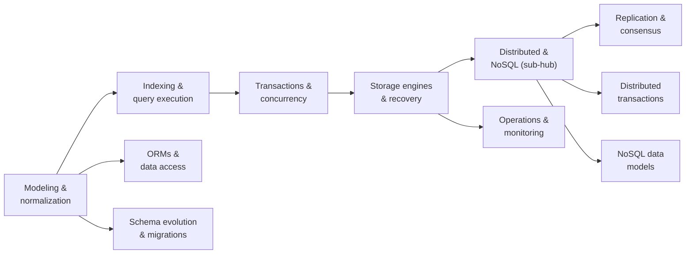

<div class="hero-section" style="background: linear-gradient(135deg, #4facfe 0%, #00f2fe 100%); color: white; padding: 2rem; margin: -2rem -3rem 2rem -3rem; text-align: center;">
  <h1 style="color: white; margin: 0; font-size: 2.25rem;">Database Design</h1>
  <p style="font-size: 1.1rem; margin-top: 0.75rem; opacity: 0.9;">Relational modeling, indexing, transactions, storage, and distributed architecture</p>
</div>

Every application that stores data runs into the same questions: how should the data be organised, how can many users read and change it at once without corrupting it, what happens when a machine crashes, and how does the system grow beyond one server? This section answers them in depth — from normalization and SQL execution, through transactions and storage engines, to replication, distributed transactions and NoSQL data models, and finally to running databases in production.

> **New to databases?** The [Database Crash Course](../database-crash-course.html) covers tables, SQL, relationships, indexes and transactions in a single page. Read it first, then return here for the internals and the scaling concerns.

## Guides

| Area | Guide | What it covers |
|------|-------|----------------|
| **Modeling** | [Data Modeling & Normalization](modeling.html) | The relational model, keys, normal forms (1NF to BCNF), modeling relationships, star and snowflake schemas, EAV, and design anti-patterns |
| **Querying** | [Indexing & Query Execution](indexing-and-queries.html) | Index types and design, when indexes hurt, the query pipeline, reading `EXPLAIN ANALYZE`, and the optimizer's cost model and statistics |
| **Transactions** | [Transactions & Concurrency](transactions-and-concurrency.html) | ACID, locking and MVCC, serializability, isolation levels and their anomalies, practical locking patterns |
| **Storage** | [Storage Engines & Recovery](storage-internals.html) | Pages, the buffer pool, B+ trees and LSM trees, write-ahead logging, crash recovery, and performance tuning |
| **Distributed** | [Distributed & NoSQL Databases](distributed-and-nosql.html) | Sub-hub: replication and partitioning, CAP and PACELC, consistency models, choosing a database, industry direction, case studies |
| **Distributed** | [Replication & Consensus](replication-and-consensus.html) | Replication topologies, streaming and logical replication, replication lag, Raft and Paxos, failover, quorums |
| **Distributed** | [Distributed Transactions](distributed-transactions.html) | Two-phase commit, commit over consensus, sagas, the outbox pattern, idempotency, exactly-once processing |
| **Distributed** | [NoSQL Data Models](nosql-data-models.html) | Document, key-value, wide-column, graph, time-series and vector stores, and how to model for each |
| **Operations** | [Operations & Monitoring](operations-and-monitoring.html) | Backups and point-in-time recovery, disaster recovery, VACUUM, connection pooling, observability, incident response |
| **Operations** | [ORMs & Data-Access Patterns](orm-patterns.html) | Object-relational mapping, the impedance mismatch, the N+1 problem, and when to drop to SQL |
| **Operations** | [Schema Evolution & Migrations](schema-evolution-and-migrations.html) | Migration tooling, zero-downtime expand and contract, backfills, online schema change, rollbacks |

### Suggested reading order

The guides build on one another. Each later topic assumes the guarantees described by the earlier ones:



## Why a Database

Consider an online store that keeps its products in a file:

```json
[
  {"id": 1, "name": "Laptop", "price": 999, "stock": 50},
  {"id": 2, "name": "Mouse",  "price": 29,  "stock": 200}
]
```

This works until the questions a database exists to answer arrive:

| Question | What a database provides | Where it is covered |
|---|---|---|
| Two customers buy the last laptop at the same moment — who gets it? | Isolation through locking or multi-version concurrency control | [Transactions & Concurrency](transactions-and-concurrency.html) |
| How do we guarantee stock never goes negative? | Constraints and atomic transactions | [Data Modeling](modeling.html) |
| The server crashes halfway through a purchase — what survives? | Atomicity and durability through write-ahead logging | [Storage Engines & Recovery](storage-internals.html) |
| How do we find all products under $50 among millions? | Indexes and a cost-based query planner | [Indexing & Query Execution](indexing-and-queries.html) |
| One server is no longer enough, or must not be a single point of failure | Replication, partitioning and consensus | [Distributed & NoSQL Databases](distributed-and-nosql.html) |

## Core Principles

- **Model for integrity first.** Normalization removes redundant copies so that an update cannot leave the data contradicting itself. Denormalize deliberately, for measured performance needs.
- **Indexes trade write cost for read speed.** A B+ tree index turns a full scan into a logarithmic lookup, but every index is maintained on every relevant write and occupies cache.
- **Transactions make concurrency tractable.** Atomicity, consistency, isolation and durability let many clients use shared data without corrupting it. Weaker isolation levels are faster but admit specific, documented anomalies.
- **The planner decides how a query runs.** SQL describes the result; the optimizer chooses the access paths and join order from statistics. `EXPLAIN ANALYZE` shows what it chose and whether its estimates were right.
- **Distribution forces trade-offs.** Replication and partitioning add capacity and resilience, but during a network partition a system must choose between consistency and availability, and even without one, stronger consistency costs latency.
- **Choose the data model by access pattern.** Relational, document, key-value, wide-column, graph, time-series and vector stores each make different queries cheap. Start relational unless a specific pattern or scale requirement says otherwise.

## Glossary

| Term | Definition |
|---|---|
| **ACID** | Atomicity, Consistency, Isolation, Durability — the guarantees of a database transaction |
| **B+ tree** | Balanced search tree with all keys in linked leaf pages; the standard on-disk index structure |
| **Buffer pool** | The database's in-memory cache of disk pages |
| **CAP theorem** | During a network partition, a distributed store must give up either linearizable consistency or availability |
| **Cardinality** | The number of distinct values in a column; also the estimated number of rows an operator returns |
| **Change data capture (CDC)** | Streaming committed changes out of a database, usually by reading its replication log |
| **Consensus** | Protocols (Raft, Paxos) by which nodes agree on a value or ordered log despite failures |
| **Deadlock** | Two or more transactions each waiting for a lock the other holds |
| **Foreign key** | A column whose values must match a key in another table |
| **Idempotency** | The property that repeating an operation has the same effect as doing it once |
| **Index** | An auxiliary structure that locates rows by key without scanning the table |
| **Isolation level** | How much concurrent transactions may observe each other's effects (read committed, repeatable read, serializable) |
| **LSM tree** | Log-structured merge tree: buffers writes in memory, flushes sorted files, and compacts them; optimised for writes |
| **MVCC** | Multi-version concurrency control: readers see a snapshot while writers create new row versions |
| **Normalization** | Organising tables so each fact is stored once, eliminating update anomalies |
| **OLTP / OLAP** | Online transaction processing (many small reads and writes) versus online analytical processing (large scans and aggregations) |
| **PACELC** | Extension of CAP: if partitioned, choose availability or consistency; else, latency or consistency |
| **Partitioning (sharding)** | Splitting data into disjoint subsets stored on different nodes |
| **Primary key** | The column or columns that uniquely identify each row |
| **Query planner** | The component that chooses an execution plan for a query from estimated costs |
| **Replication** | Keeping copies of the same data on several nodes |
| **Saga** | A sequence of local transactions with compensating actions, used instead of a distributed commit |
| **Transaction** | A group of operations that commit or abort as a unit |
| **Vector index** | An approximate nearest-neighbour index (such as HNSW) over embedding vectors |
| **WAL** | Write-ahead log: changes are logged durably before data pages are modified, enabling crash recovery and replication |

## References

### Books

- Kleppmann, M. *Designing Data-Intensive Applications* (O'Reilly, 2017; a revised second edition co-authored with Chris Riccomini followed). The standard overview of storage, replication, partitioning, transactions and stream processing.
- Petrov, A. *Database Internals* (O'Reilly, 2019). Storage engines and distributed-systems algorithms in detail.
- Karwin, B. *SQL Antipatterns* (Pragmatic Bookshelf; 2nd edition 2022). Common schema and query mistakes and their fixes.
- Winand, M. *SQL Performance Explained*, also available free as [Use The Index, Luke](https://use-the-index-luke.com/). Indexing from the developer's side.
- Ramakrishnan, R. and Gehrke, J. *Database Management Systems* (3rd edition, 2003). A thorough university textbook.

### Courses, documentation and papers

- [CMU Database Group](https://www.youtube.com/c/CMUDatabaseGroup) — recorded lectures from Andy Pavlo's introductory and advanced database systems courses.
- [PostgreSQL documentation](https://www.postgresql.org/docs/current/) — particularly the chapters on indexes, `EXPLAIN`, concurrency control and the planner's statistics.
- [Jepsen analyses](https://jepsen.io/analyses) — independent tests of distributed databases' consistency claims.
- [The Morning Paper](https://blog.acolyer.org/) — summaries of database and systems papers (archive; publication ended in 2021).
- Proceedings of SIGMOD, VLDB and CIDR for current research.

### Practice

- [PostgreSQL Exercises](https://pgexercises.com/) — graded SQL practice against a sample schema.
- [SQL Murder Mystery](https://mystery.knightlab.com/) — learn SQL by solving a case.

### Build-your-own projects

Building a small database is the most direct way to understand one. A progression, each step building on the last:

1. **Log-structured key-value store** — an append-only log plus an in-memory hash index; add compaction and crash recovery.
2. **B+ tree** — insertion with node splits, deletion, and range scans over linked leaves, backed by fixed-size pages and a buffer pool.
3. **Query engine** — parse a subset of SQL, build an iterator-model operator tree (scan, filter, project, nested-loop and hash join), and add a simple cost-based choice between plans.
4. **Transactions** — write-ahead logging with redo recovery, then two-phase locking or MVCC for isolation.
5. **Replicated key-value store** — Raft leader election and log replication across three nodes (MIT's distributed-systems labs follow this path).

CMU's educational database, BusTub, provides a skeleton for steps 2–4.

## See Also

- [Database Crash Course](../database-crash-course.html) — the fast introduction to tables and SQL.
- [AWS](../aws/) — managed relational, key-value and serverless database services.
- [Docker](../docker/) — running databases in containers for local development.
- [Cybersecurity](../cybersecurity/) — access control, encryption and SQL injection.
- [Networking](../networking/) — the protocols beneath distributed databases.
