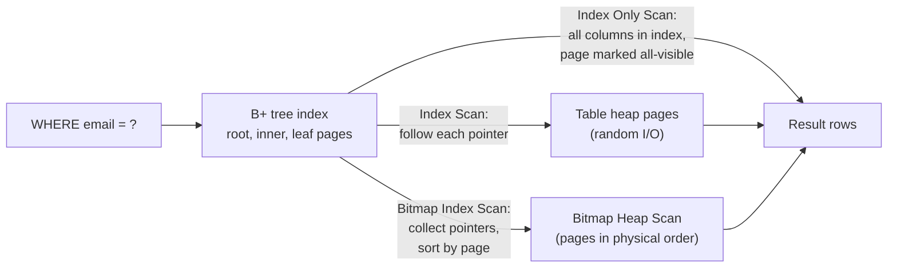
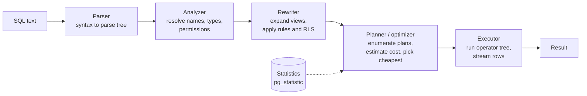
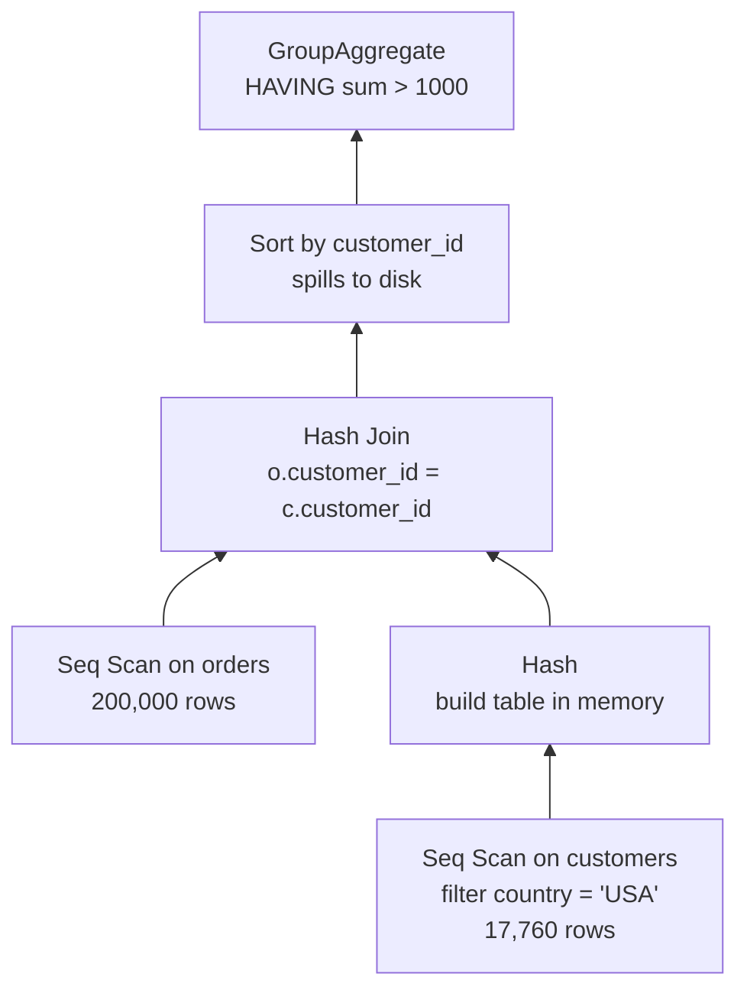

<p><a href="./">&larr; Database Design</a></p>

# Indexing & Query Execution

SQL is declarative: a query says *what* rows you want, and the database decides *how* to find them. This page covers both halves of that bargain. The first half is the **index** — the auxiliary data structures that make selective lookups cheap, how to choose and design them, and when they cost more than they save. The second half is the **query pipeline** — how the parser, planner and executor turn a statement into a tree of physical operators, how to read that tree with `EXPLAIN ANALYZE`, and the cost model and statistics that drive the planner's choices.

Examples use PostgreSQL (current major version: 18, released September 2025; 19 is in beta as of this writing) unless noted. The concepts carry over to MySQL/InnoDB, SQL Server and Oracle; the operator names and knobs differ.

<span id="indexing-making-queries-lightning-fast"></span>

## Why Indexes Matter

Without an index, the only way to answer `WHERE email = 'john@example.com'` is a **sequential scan**: read every page of the table and test every row. The cost grows linearly with the table. A B+ tree index on `email` replaces that with a descent from root to leaf, which costs $O(\log_f N)$ page reads for fan-out $f$. Because a single 8 KB index page holds hundreds of keys, even a table with hundreds of millions of rows is usually only three or four levels deep — a handful of page reads instead of millions.

```sql
-- Without an index: Seq Scan over the whole table
SELECT * FROM customers WHERE email = 'john@example.com';

CREATE INDEX idx_customers_email ON customers (email);
-- Same query: Index Scan — a few index pages, then one heap page
```

An index entry stores the key plus a pointer to the row (in PostgreSQL a *tuple ID*, the heap page and slot; in InnoDB the row's primary key, because the table itself is a B+ tree clustered on the primary key). How the executor follows those pointers determines which kind of scan appears in a plan:



The mechanics of the B+ tree itself (page splits, leaf chaining, fill factor) are covered in [Storage Engines & Recovery](storage-internals.html#b-trees).

## Index Types

The right structure follows from the *shape* of the predicate you run most often.

| Index type | Answers | Ordered / ranges | Typical use | Availability |
|---|---|---|---|---|
| **B-tree** (B+ tree) | `=`, `<`, `>`, `BETWEEN`, `IN`, `IS NULL`, `LIKE 'prefix%'`, `ORDER BY` | Yes | The default for almost everything | All engines |
| **Hash** | `=` only | No | Very long keys where only equality matters | PostgreSQL (crash-safe since 10), MySQL MEMORY; InnoDB uses an internal *adaptive* hash |
| **GIN** (inverted) | Containment: `@>`, `?`, `&&`, full-text `@@`, trigram `LIKE '%x%'` | No | `jsonb`, arrays, `tsvector`, `pg_trgm` | PostgreSQL |
| **GiST / SP-GiST** | Overlap, containment, nearest-neighbour (`<->`) | Partial | Geometry (PostGIS), ranges, exclusion constraints, IP ranges | PostgreSQL |
| **BRIN** (block range) | Range predicates on physically ordered data | Coarse | Append-only time-series, logs | PostgreSQL; similar zone maps in Oracle, ClickHouse, Snowflake |
| **Bitmap** (persistent) | `=` on low-cardinality columns, combined with AND/OR | No | Read-mostly warehouse filters | Oracle and other DW engines. PostgreSQL has no stored bitmap index; it builds bitmaps on the fly in *Bitmap Index Scans* |
| **Full-text** | Word and phrase matching with ranking | No | Article and product search | PostgreSQL (`tsvector` + GIN), MySQL `FULLTEXT`, SQL Server |
| **Vector** (HNSW, IVFFlat) | Approximate nearest-neighbour on embeddings | No | Semantic search, retrieval-augmented generation | `pgvector`, dedicated vector stores |

Notes on the less obvious rows:

- **B-tree** is the default because one structure serves equality, ranges and ordering, and it stays balanced under writes. If you are unsure, use a B-tree.
- **Hash** indexes are smaller and faster than B-trees only for equality on wide keys. They cannot serve ranges or sorting, and PostgreSQL hash indexes support neither `UNIQUE` nor multiple columns, so they rarely win in practice.
- **GIN** indexes map each *element* (a word, an array member, a JSON key) to the rows containing it. They are fast to read and slow to update; PostgreSQL buffers updates in a *pending list* (`fastupdate`) to soften the write cost. PostgreSQL 18 can build GIN indexes in parallel.
- **BRIN** stores only the minimum and maximum of each range of pages (128 by default). It is typically thousands of times smaller than a B-tree, but it only helps when the column's values correlate with physical row order — for example, an `inserted_at` column on an append-only table.
- **Vector indexes** trade exactness for speed. `pgvector` (0.8.x as of 2026) supports HNSW and IVFFlat over `vector`, `halfvec`, `bit` and `sparsevec` types; since 0.8.0 it can run *iterative index scans* (`hnsw.iterative_scan`) so that a `WHERE` filter applied after the approximate search still returns enough rows.
- **Learned indexes**, which replace tree traversal with a model of the key distribution, remain a research topic (see [Distributed & NoSQL Databases](distributed-and-nosql.html#where-databases-are-heading)).

## Designing Indexes

Once the structure is chosen, the design questions are *which columns*, *in what order*, and *which rows*.

### Composite indexes and column order

A composite B-tree on `(a, b, c)` is sorted by `a`, then by `b` within each `a`, then by `c`. It can seek directly to a contiguous slice for predicates on `a`, on `a, b`, or on `a, b, c` — the **leftmost-prefix rule** — but not for a predicate on `b` alone, because rows with a given `b` are scattered across every value of `a`.

```sql
CREATE INDEX idx_orders_customer_date ON orders (customer_id, order_date);

-- Seek on the leading column
SELECT * FROM orders WHERE customer_id = 123;
-- Seek on customer_id, then range-scan order_date inside that slice
SELECT * FROM orders WHERE customer_id = 123 AND order_date > '2026-01-01';
-- Leading column unconstrained: no contiguous slice (but see skip scan below)
SELECT * FROM orders WHERE order_date > '2026-01-01';
```

A reliable ordering heuristic is **equality, sort, range** (ESR): put columns tested with `=` first, then the column used by `ORDER BY`, then the column with a range predicate. A range predicate on a column ends the seekable prefix — every column after it can only be used as a filter within the scanned range.

**Skip scan.** PostgreSQL 18 added *skip scan* for multicolumn B-trees (MySQL has had it since 8.0.13, Oracle for much longer). When the leading column is unconstrained but has few distinct values, the planner internally treats the query as a series of `a = v AND b = ...` probes, one per distinct `a`. It helps only when the leading column has **low cardinality**; with many distinct values the planner will still prefer a sequential scan. It is a safety net for an imperfect index, not a reason to ignore column order.

### Covering indexes

If every column a query needs is in the index, the executor can answer from the index alone — an **Index Only Scan** in PostgreSQL, a *covering index* in MySQL and SQL Server.

```sql
CREATE INDEX idx_orders_covering
    ON orders (customer_id, order_date)
    INCLUDE (total, status);
```

`INCLUDE` columns (PostgreSQL 11+, SQL Server) are stored in the leaf pages but are not part of the sort key, so they cost space but do not affect ordering or uniqueness. In InnoDB every secondary index implicitly contains the primary key, so a query needing only indexed columns plus the primary key is already covered.

In PostgreSQL an index-only scan still has to confirm that each row is visible to the current snapshot. It skips the heap only for pages marked *all-visible* in the visibility map, which `VACUUM` maintains; on a heavily updated table that has not been vacuumed recently, the plan shows a large `Heap Fetches` count and most of the benefit disappears.

### Partial and expression indexes

A **partial index** covers only the rows matching a predicate. It is smaller, cheaper to maintain, and can enforce conditional uniqueness:

```sql
-- Only active users are ever looked up by email
CREATE INDEX idx_active_users_email ON users (email) WHERE active;

-- At most one open order per customer
CREATE UNIQUE INDEX one_open_order ON orders (customer_id) WHERE status = 'open';
```

The planner uses a partial index only when it can prove the query's `WHERE` clause implies the index predicate, so write the predicate the same way in both places.

An **expression index** indexes the result of a function, which is the fix when a query must filter on a computed value:

```sql
CREATE INDEX idx_users_email_lower ON users (lower(email));
SELECT * FROM users WHERE lower(email) = 'john@example.com';   -- uses the index
```

### Building indexes on live tables

A plain `CREATE INDEX` in PostgreSQL takes a `SHARE` lock on the table: reads continue, but every `INSERT`, `UPDATE` and `DELETE` waits until the build finishes. On a large production table use the concurrent form, which takes the weaker `SHARE UPDATE EXCLUSIVE` lock:

```sql
CREATE INDEX CONCURRENTLY idx_orders_status ON orders (status);
REINDEX INDEX CONCURRENTLY idx_orders_status;      -- PostgreSQL 12+
DROP INDEX CONCURRENTLY idx_orders_status;
```

Concurrent builds scan the table twice and wait for existing transactions to finish, so they are slower. They cannot run inside a transaction block, and a failed build leaves an `INVALID` index behind that must be dropped and retried. MySQL's equivalent is online DDL (`ALTER TABLE ... ADD INDEX ..., ALGORITHM=INPLACE, LOCK=NONE`). The full list of lock modes is in [Locks taken by index operations](#locks-taken-by-index-operations); schema-change workflow is covered in [Schema Evolution & Migrations](schema-evolution-and-migrations.html).

> **Dialect note.** MySQL accepts an inline `INDEX idx_name (cols)` clause inside `CREATE TABLE`. That syntax is invalid in PostgreSQL, where every non-constraint index is created with a separate `CREATE INDEX` statement.

## When Indexes Hurt

Every index is a second copy of part of the table that must be kept exactly in sync. The costs:

| Cost | What happens |
|---|---|
| **Write amplification** | Every `INSERT` and `DELETE`, and every `UPDATE` that touches an indexed column, must modify every affected index. A table with eight indexes turns one logical row write into up to nine page modifications, each also written to the WAL. |
| **Lost HOT updates** | PostgreSQL can update a row in place without touching any index (a *heap-only tuple* update) only if no indexed column changed and the page has free space. Indexing a frequently updated column disables this optimisation. |
| **Storage and cache pressure** | Indexes compete with table pages for the buffer pool. A wide multi-column index can approach the size of the table. |
| **Bloat and maintenance** | Churned indexes accumulate dead entries and half-empty pages; they need `VACUUM` and occasionally `REINDEX CONCURRENTLY`. |
| **Planning overhead** | Each candidate index is another access path the planner must cost. |

Query shapes where an index is the wrong tool:

1. **Low selectivity.** If a predicate matches a large fraction of the table, following millions of index pointers means millions of random page reads, while a sequential scan reads each page once in order. The crossover point depends on the storage and on how well the column correlates with physical order; on spinning disks it is often a few percent of rows, on SSDs with `random_page_cost` lowered it is higher. The planner computes this; you do not need to.
2. **The column is wrapped in a function or cast.** The index stores `created_at`, not `EXTRACT(YEAR FROM created_at)`:

   ```sql
   -- Cannot use an index on created_at
   WHERE EXTRACT(YEAR FROM created_at) = 2026
   -- Sargable rewrite: a half-open range
   WHERE created_at >= '2026-01-01' AND created_at < '2027-01-01'
   ```

   Either rewrite the predicate as a range on the bare column, or create an expression index that matches it exactly.
3. **Leading wildcards.** `LIKE '%term'` has no known prefix to seek to. Use a trigram GIN index (`pg_trgm`) or full-text search.
4. **Tiny tables.** A table that fits in a few pages is cheaper to scan than to probe; the planner correctly ignores the index.
5. **Write-heavy ingest paths.** A high-rate event or log table is often best served by few indexes, or by BRIN, with heavier read indexes on a downstream copy.

### Finding unused and missing indexes

Start from measurements, not guesses:

```sql
-- Indexes never used since statistics were last reset
SELECT schemaname, relname, indexrelname, idx_scan,
       pg_size_pretty(pg_relation_size(indexrelid)) AS size
FROM pg_stat_user_indexes
WHERE idx_scan = 0
ORDER BY pg_relation_size(indexrelid) DESC;

-- Tables that are scanned sequentially a lot (candidates for a missing index)
SELECT relname, seq_scan, seq_tup_read, idx_scan
FROM pg_stat_user_tables
ORDER BY seq_tup_read DESC
LIMIT 20;
```

Check `idx_scan` on every replica before dropping an index — a replica serving reports may use an index the primary never touches — and keep any index that backs a `PRIMARY KEY` or `UNIQUE` constraint. `pg_stat_statements` identifies the queries worth optimising (see [Operations & Monitoring](operations-and-monitoring.html#query-hotspots-pg_stat_statements)), and the `hypopg` extension lets you test a *hypothetical* index with `EXPLAIN` before building it. Managed-service advisors (for example Azure SQL automatic tuning or the index recommendations in cloud Postgres consoles) are useful for generating candidates, but they optimise the workload they have observed: an index that speeds up a weekly report may slow every write on the OLTP path.

## How a Query Is Executed

### The pipeline



1. **Parse** — check syntax and build a parse tree.
2. **Analyse** — resolve table and column names against the catalog, assign types, check privileges.
3. **Rewrite** — replace views with their definitions and apply row-level-security policies.
4. **Plan** — generate alternative physical plans (access paths for each table, join orders, join algorithms), estimate the cost of each using table statistics, and keep the cheapest.
5. **Execute** — run the chosen plan. Most executors use the *iterator* (Volcano) model: each operator pulls rows from its children one at a time, so rows stream up the tree without materialising intermediate results unless an operator (a sort, a hash build) needs them all.

Prepared statements can skip steps 1–4 on re-execution. PostgreSQL decides per statement whether to reuse a *generic* plan or re-plan with the actual parameter values (`plan_cache_mode`).

### Choosing between plans

Consider:

```sql
SELECT c.customer_id, c.name, SUM(o.total) AS lifetime_value
FROM customers c
JOIN orders o ON o.customer_id = c.customer_id
WHERE c.country = 'USA'
GROUP BY c.customer_id, c.name
HAVING SUM(o.total) > 1000;
```

With 100,000 customers (18% in the USA) and 200,000 orders, the planner might weigh:

- **Filter customers first, then join** — scan or index-scan `customers` for the ~18,000 US rows, build a hash table on them, stream `orders` through it.
- **Nested loop from customers** — for each US customer, probe an index on `orders(customer_id)`. Good if there are few US customers and the index exists; poor at 18,000 probes if each probe is a random read.
- **Join everything, filter later** — never chosen, because the planner always pushes the `country` filter below the join (see [Relational algebra rewrites](#relational-algebra-rewrites)).

Which one wins depends entirely on estimated row counts, which is why accurate statistics matter more than any hint.

### Scan and join operators

| Operator | What it does | Cheap when |
|---|---|---|
| **Seq Scan** | Reads every page in order | A large fraction of rows is needed, or the table is small |
| **Index Scan** | Walks the index, fetches each matching heap row | Few rows match; also returns rows in index order |
| **Index Only Scan** | Answers from the index; skips all-visible heap pages | All needed columns are in the index and the table is well vacuumed |
| **Bitmap Index + Bitmap Heap Scan** | Collects matching row pointers into a bitmap, then reads heap pages in physical order; can AND/OR several indexes | A moderate number of rows match, or several indexes are combined |
| **Nested Loop** | For each outer row, scan or probe the inner input | Outer side is small and the inner side has an index on the join key. Cost roughly $O(n \cdot \log m)$ with an index, $O(n \cdot m)$ without |
| **Hash Join** | Build a hash table on the smaller input, probe with the larger | Equality joins on unsorted inputs; build side fits in memory. $O(n + m)$ |
| **Merge Join** | Walk two inputs sorted on the join key in step | Both inputs are already sorted (e.g. by index) or needed sorted anyway; works for large inputs. $O(n + m)$ after sorting |
| **Hash / Group Aggregate** | Group rows with a hash table, or by scanning sorted input | Hash when groups fit in memory; group when input is already sorted |

## Reading EXPLAIN ANALYZE

`EXPLAIN` shows the plan the optimizer chose and its *estimates*. `EXPLAIN ANALYZE` **executes** the statement and adds *measured* times and row counts. Comparing estimates with actuals is the most useful skill for diagnosing slow queries.

`EXPLAIN ANALYZE` really runs the statement, including `INSERT`, `UPDATE` and `DELETE`. To analyse a data-modifying statement without keeping its effects, wrap it in `BEGIN; ... ROLLBACK;`. Since PostgreSQL 18, `EXPLAIN ANALYZE` includes buffer statistics automatically; on older versions ask for them with `EXPLAIN (ANALYZE, BUFFERS)`.

### A plan is a tree

Rows flow from the leaves upward. Read the output bottom-up to follow the data and top-down to see the goal. For the query above:



### An annotated plan

```sql
EXPLAIN (ANALYZE, BUFFERS)
SELECT c.customer_id, c.name, SUM(o.total) AS lifetime_value
FROM customers c
JOIN orders o ON o.customer_id = c.customer_id
WHERE c.country = 'USA'
GROUP BY c.customer_id, c.name
HAVING SUM(o.total) > 1000;
```

```text
GroupAggregate  (cost=13602.42..14855.88 rows=5920 width=48)
                (actual time=88.214..142.905 rows=796 loops=1)
  Group Key: c.customer_id
  Filter: (sum(o.total) > 1000)
  Rows Removed by Filter: 16964
  Buffers: shared hit=512 read=2400, temp read=288 written=290
  ->  Sort  (cost=13602.42..13813.05 rows=84252 width=26)
            (actual time=88.190..101.337 rows=84252 loops=1)
        Sort Key: c.customer_id
        Sort Method: external merge  Disk: 2304kB
        Buffers: shared hit=512 read=2400, temp read=288 written=290
        ->  Hash Join  (cost=2914.00..6874.66 rows=84252 width=26)
                       (actual time=12.004..58.221 rows=84252 loops=1)
              Hash Cond: (o.customer_id = c.customer_id)
              Buffers: shared hit=512 read=2400
              ->  Seq Scan on orders o  (cost=0.00..3470.00 rows=200000 width=12)
                                        (actual time=0.009..18.402 rows=200000 loops=1)
                    Buffers: shared read=1470
              ->  Hash  (cost=2692.00..2692.00 rows=17760 width=22)
                        (actual time=11.880..11.881 rows=17760 loops=1)
                    Buckets: 32768  Batches: 1  Memory Usage: 1099kB
                    Buffers: shared hit=512 read=930
                    ->  Seq Scan on customers c  (cost=0.00..2692.00 rows=17760 width=22)
                                                 (actual time=0.014..7.901 rows=17760 loops=1)
                          Filter: (country = 'USA'::text)
                          Rows Removed by Filter: 82240
                          Buffers: shared hit=512 read=930
Planning Time: 0.624 ms
Execution Time: 144.880 ms
```

What each field tells you:

- **`cost=13602.42..14855.88`** — estimated *startup* cost (work before the first row can be emitted; high for `Sort`, which must consume all input first) and *total* cost, in the planner's arbitrary units. Costs are only meaningful for comparing plans for the same query.
- **`rows=` estimated versus `actual ... rows=`** — the most important comparison. Every scan and join estimate here is exact, so statistics are healthy. The top node's estimate (5,920) is off by 7x because the planner has no statistics for an aggregate `HAVING` condition and falls back to a default selectivity of one third. At the root of the plan that is harmless; the same misestimate *below* a join would push the planner toward the wrong join algorithm. **Large estimate/actual gaps low in the tree are the most common cause of bad plans.** Refresh statistics with `ANALYZE`, raise the column's statistics target, or add extended statistics (see [Statistics and selectivity](#statistics-and-selectivity)).
- **`actual time=88.214..142.905`** — milliseconds to the first row and to the last row. A node's times include its children's; subtract to find where time is spent.
- **`loops=1`** — how many times the node ran. `actual time` and `rows` are **per loop**: on the inner side of a nested loop, multiply by `loops`. A 0.05 ms node executed 50,000 times costs 2.5 seconds.
- **`Rows Removed by Filter: 82240`** on `customers` — the scan read 100,000 rows to keep 17,760. At 18% selectivity a sequential scan is still reasonable; if this were 0.1%, it would be the signature of a missing index.
- **`Sort Method: external merge  Disk: 2304kB`** — the sort did not fit in `work_mem` and spilled to temporary files (confirmed by `temp read/written` under `Buffers`). Raising `work_mem` for this session or query would give `Sort Method: quicksort  Memory: ...`. Alternatively, an index on `customers(customer_id)` already provides sorted order that a merge join plus `GroupAggregate` could exploit.
- **`Buffers: shared hit=512 read=2400`** — pages found in PostgreSQL's buffer cache (`hit`) versus requested from the operating system (`read`, which may still be served by the OS page cache). Counts accumulate up the tree. Run the query twice: if `read` drops to near zero, the first run was a cold-cache effect, not a plan problem.
- **`Batches: 1  Memory Usage: 1099kB`** on the `Hash` node — the hash table fit in memory. `Batches` greater than 1 means the build side exceeded `work_mem × hash_mem_multiplier` and the join spilled to disk.
- **`Planning Time` versus `Execution Time`** — planning is sub-millisecond here. When planning dominates (heavily partitioned tables, very large join counts), the fixes are different: prepared statements, partition pruning, or fewer joins per query.

Useful variants: `EXPLAIN (ANALYZE, FORMAT JSON)` produces machine-readable output that visualisers such as `explain.dalibo.com` accept; `VERBOSE` shows each node's output columns; `SETTINGS` lists non-default planner settings; PostgreSQL 17+ adds `SERIALIZE` (cost of converting results for the client) and `MEMORY` (planner memory). In MySQL (8.0.18+), `EXPLAIN ANALYZE` prints a tree with `actual time=first..last rows=N loops=N` per node; in SQL Server, use the actual execution plan (`SET STATISTICS XML ON` or the graphical plan). The discipline is the same everywhere: compare estimates with actuals, multiply by loops, and look for spills.

## Common Query Anti-Patterns

Most slow queries in practice come from a short list of mistakes, each of which is visible in a plan.

### The N+1 query problem

Fetching a list and then issuing one further query per row turns one round trip into $N + 1$. The cost is dominated by latency: at 0.5 ms per round trip, 1,000 extra queries add half a second before any real work.

```python
# 1 + N queries
customers = db.query("SELECT id, name FROM customers")
for c in customers:
    orders = db.query("SELECT * FROM orders WHERE customer_id = %s", (c.id,))

# 2 queries, regardless of N
customers = db.query("SELECT id, name FROM customers")
orders = db.query("SELECT * FROM orders WHERE customer_id = ANY(%s)",
                  ([c.id for c in customers],))
```

ORMs hide the problem behind lazy-loaded relationships; the fix is eager loading (`selectinload` in SQLAlchemy, `prefetch_related` / `select_related` in Django). See [ORMs & Data-Access Patterns](orm-patterns.html#the-n1-problem).

### Unindexed foreign keys

A foreign-key constraint requires an index on the *referenced* (parent) key, which the primary key provides. It does **not** create one on the *referencing* (child) column in PostgreSQL; InnoDB creates one automatically. Without it, joins from parent to child scan the child table, and every `DELETE` or key `UPDATE` on the parent scans the child to check the constraint — a common cause of slow deletes and lock contention.

```sql
CREATE INDEX CONCURRENTLY idx_orders_customer_id ON orders (customer_id);
```

### Type mismatches and implicit casts

Storing numbers or dates as strings makes range comparisons wrong as well as slow (`'100' < '99'` as text). The subtler version is a type mismatch in the predicate: comparing a `varchar` column with a number, or comparing columns of different types in a join, can force a per-row cast of the *column*, which disables its index. Use proper column types, and make literals and join keys match the column type.

### `SELECT *`

Fetching every column wastes network bandwidth and memory, breaks when columns are added, and prevents index-only scans: a query that needs only indexed columns could skip the heap entirely, but `SELECT *` forces a heap fetch per row.

### Deep `OFFSET` pagination

`LIMIT 20 OFFSET 100000` still reads and discards 100,000 rows, so each page is slower than the last. **Keyset** (seek) pagination remembers the last row seen and seeks past it through an index. Include a unique tie-breaker so rows with equal sort keys are neither skipped nor repeated:

```sql
CREATE INDEX idx_events_created_id ON events (created_at DESC, id DESC);

-- Next page: rows strictly after the last (created_at, id) of the previous page
SELECT * FROM events
WHERE (created_at, id) < ('2026-05-01 10:00:00', 918273)
ORDER BY created_at DESC, id DESC
LIMIT 20;
```

The trade-off is that keyset pagination supports "next" and "previous" but not "jump to page 500".

### Correlated columns the planner treats as independent

By default the planner multiplies selectivities as if columns were independent. For `WHERE city = 'Paris' AND country = 'France'` it underestimates the result badly, because every Paris row is also a France row. Extended statistics fix this (see below).

## Optimizer Internals

### The cost model

PostgreSQL estimates each plan's cost as a weighted sum of expected page reads and per-row CPU work. The weights are configuration parameters:

| Parameter | Default | Meaning |
|---|---|---|
| `seq_page_cost` | 1.0 | Reading one page as part of a sequential scan (the unit of cost) |
| `random_page_cost` | 4.0 | Reading one page non-sequentially. Commonly lowered to about 1.1 on SSD or NVMe storage |
| `cpu_tuple_cost` | 0.01 | Processing one row |
| `cpu_index_tuple_cost` | 0.005 | Processing one index entry |
| `cpu_operator_cost` | 0.0025 | Evaluating one operator or function call |
| `effective_cache_size` | 4 GB | The planner's assumption about how much data the OS and PostgreSQL caches hold together; higher values make index scans look cheaper |

For a sequential scan with a filter involving $k$ operators, the estimate is:

$$
\text{cost}_{\text{seq}} = N_{\text{pages}} \cdot c_{\text{seq\_page}} + N_{\text{rows}} \cdot \left( c_{\text{tuple}} + k \cdot c_{\text{operator}} \right)
$$

For the `customers` scan above, 1,442 pages and 100,000 rows with one comparison give $1442 + 100000 \times (0.01 + 0.0025) = 2692$, which is exactly the total cost shown in the plan. Index scans are costed from the estimated number of matching rows, the index depth, and the column's *correlation* with physical order (a well-correlated column needs few distinct heap pages).

### Statistics and selectivity

`ANALYZE` (run automatically by autovacuum) samples each table and stores per-column statistics, readable through `pg_stats`:

```sql
SELECT attname, null_frac, n_distinct, most_common_vals,
       most_common_freqs, histogram_bounds, correlation
FROM pg_stats
WHERE tablename = 'orders';
```

- **Most common values** (MCVs) and their frequencies give exact selectivity for frequent values.
- A **histogram** of the remaining values estimates range predicates.
- **`n_distinct`** estimates equality selectivity for values not in the MCV list and the number of groups for `GROUP BY`.
- **`correlation`** (between -1 and 1) measures how well the column's order matches physical row order.

The sample size is controlled by `default_statistics_target` (100) or per column with `ALTER TABLE ... ALTER COLUMN ... SET STATISTICS`. Raise it for skewed columns whose estimates are poor.

Per-column statistics cannot capture relationships *between* columns. **Extended statistics** (PostgreSQL 10+) can:

```sql
CREATE STATISTICS st_addr_city_country (dependencies, ndistinct, mcv)
    ON city, country FROM addresses;
ANALYZE addresses;
```

`dependencies` records functional dependencies (city implies country), `ndistinct` gives the number of distinct combinations for multi-column `GROUP BY`, and `mcv` stores the most common value combinations.

### Relational algebra rewrites

The planner transforms a query using algebraic equivalences before costing it. The most important is **selection pushdown**: a filter on one side of a join can be applied before the join instead of after it.

$$
\sigma_{\text{country} = \text{'USA'}}\left( O \bowtie C \right) \equiv O \bowtie \sigma_{\text{country} = \text{'USA'}}(C)
$$

Others include **projection pushdown** (drop unneeded columns early), **subquery flattening** (turn `IN (SELECT ...)` and `EXISTS` into semi-joins), **outer-join simplification** (an outer join whose nullable side is filtered by a strict predicate becomes an inner join), and, in PostgreSQL 18, **self-join elimination** and removal of `GROUP BY` columns that are functionally dependent on a primary key. Writing the pushed-down form by hand, as a subquery, rarely helps; the planner already does it.

### Join ordering

Inner joins are commutative and associative, so the planner can join tables in any order. The number of orderings grows factorially — $n!$ left-deep orders for $n$ tables, and more if bushy trees are allowed — so exhaustive search is impossible for large queries. PostgreSQL uses bottom-up **dynamic programming** (the approach introduced by IBM's System R): find the best plan for every pair of tables, then every triple built from the best pairs, and so on. Two limits keep this tractable:

- `join_collapse_limit` and `from_collapse_limit` (default 8) cap how many items the planner will reorder together; beyond that, it keeps the order you wrote.
- At `geqo_threshold` (default 12) tables, PostgreSQL switches to the **genetic query optimizer**, a randomised search that finds a good rather than optimal order.

For a query that joins more than eight tables, the written join order therefore matters.

### Memory Management Internals

Two kinds of memory matter to a query:

**Shared buffer pool.** Table and index pages are read into a fixed array of page-sized *frames* in shared memory (`shared_buffers`). A hash table maps each page identifier to its frame. When a needed page is not present, the buffer manager must evict one: PostgreSQL uses a **clock-sweep** approximation of LRU, in which each frame has a small usage counter that is incremented on access and decremented as the "clock hand" sweeps past; the first unpinned frame found with a count of zero is evicted (after writing it out if dirty). Pinned frames — pages an operator is currently using — are never evicted. This is why the `hit`/`read` split in `EXPLAIN` output varies from run to run. The buffer pool is covered in more detail in [Storage Engines & Recovery](storage-internals.html#buffer-pool-your-databases-cache).

**Per-operation working memory.** Sorts, hash tables, and some other operators get private memory:

| Setting | Default | Used by |
|---|---|---|
| `work_mem` | 4 MB | Each sort, and each hash table (times `hash_mem_multiplier`), per operation, per process. A complex query can use several multiples of it, and each parallel worker gets its own |
| `hash_mem_multiplier` | 2.0 (PostgreSQL 15+) | Extra headroom for hash joins and hash aggregates, which degrade more sharply than sorts when they spill |
| `maintenance_work_mem` | 64 MB | `CREATE INDEX`, `VACUUM`, `ALTER TABLE ADD FOREIGN KEY` |

When an operation exceeds its limit it spills to temporary files: `Sort Method: external merge`, a hash with `Batches` greater than 1, or a hash aggregate reporting `Disk Usage`. Because `work_mem` is per operation rather than per connection, raise it for specific sessions or roles (`SET work_mem = '256MB'` inside a reporting job) instead of globally.

### Locks taken by index operations

Index maintenance interacts with PostgreSQL's table-level locks, which is why the choice between `CREATE INDEX` and `CREATE INDEX CONCURRENTLY` matters in production.

| Statement | Table lock | Blocks |
|---|---|---|
| `SELECT` | `ACCESS SHARE` | Only `ACCESS EXCLUSIVE` |
| `INSERT` / `UPDATE` / `DELETE` | `ROW EXCLUSIVE` | `SHARE` and stronger |
| `CREATE INDEX` | `SHARE` | All writes, for the whole build |
| `CREATE INDEX CONCURRENTLY`, `REINDEX CONCURRENTLY`, `VACUUM`, `ANALYZE` | `SHARE UPDATE EXCLUSIVE` | Other schema changes and vacuums; not reads or writes |
| `DROP INDEX`, most `ALTER TABLE` forms | `ACCESS EXCLUSIVE` | Everything, including reads |

The complete conflict matrix for the eight table-level modes (an **X** means the two modes conflict):

| Requested \ Held | AS | RS | RE | SUE | S | SRE | E | AE |
|---|---|---|---|---|---|---|---|---|
| **ACCESS SHARE** (AS) | | | | | | | | X |
| **ROW SHARE** (RS) | | | | | | | X | X |
| **ROW EXCLUSIVE** (RE) | | | | | X | X | X | X |
| **SHARE UPDATE EXCLUSIVE** (SUE) | | | | X | X | X | X | X |
| **SHARE** (S) | | | X | X | | X | X | X |
| **SHARE ROW EXCLUSIVE** (SRE) | | | X | X | X | X | X | X |
| **EXCLUSIVE** (E) | | X | X | X | X | X | X | X |
| **ACCESS EXCLUSIVE** (AE) | X | X | X | X | X | X | X | X |

A waiting `ACCESS EXCLUSIVE` request also queues every later request behind it, so even a fast `DROP INDEX` can stall all reads if it waits behind a long-running transaction. Set `lock_timeout` before running DDL on busy tables. Row-level locks, deadlock detection and isolation are covered in [Transactions & Concurrency](transactions-and-concurrency.html).

> **Code reference:** Implementations of query-processing algorithms (joins, selection pushdown, cost estimation) are in [`query_processing.py`](../../../code-examples/technology/database-design/query_processing.py).

## See Also

- **Previous:** [Data Modeling & Normalization](modeling.html)
- **Next:** [Transactions & Concurrency](transactions-and-concurrency.html) — how locks and MVCC keep concurrent queries correct.
- [Storage Engines & Recovery](storage-internals.html) — the pages, B+ trees and buffer pool that the optimizer reads from.
- [Operations & Monitoring](operations-and-monitoring.html) — `pg_stat_statements`, autovacuum, and finding slow queries in production.
- **Up:** [Database Design hub](./)
