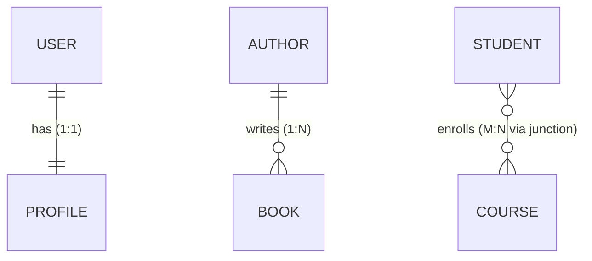

<p><a href="./">&larr; Database Design</a></p>

# Data Modeling & Normalization

## From Files to Databases

### The Relational Model: Organizing Your Data

The breakthrough came when Edgar Codd realized that data could be organized as tables (relations) with well-defined rules. This wasn't just tidiness—it enabled powerful operations and guarantees.

Consider our e-commerce example. Instead of one complex file, we organize data into focused tables:

```sql
-- Products table: Each row is a product
CREATE TABLE products (
    product_id INT PRIMARY KEY,  -- Unique identifier
    name VARCHAR(100),
    price DECIMAL(10,2),
    stock INT CHECK (stock >= 0)  -- Never negative!
);

-- Orders table: Each row is an order
CREATE TABLE orders (
    order_id INT PRIMARY KEY,
    customer_id INT,
    order_date TIMESTAMP,
    FOREIGN KEY (customer_id) REFERENCES customers(customer_id)
);
```

This structure brings immediate benefits:
- **No redundancy**: Product info stored once, referenced many times
- **Data integrity**: Can't reference non-existent customers
- **Efficient queries**: Indexes make lookups fast
- **Concurrent access**: Multiple users can read/write safely

### ACID: Making Databases Reliable

The real magic happens when databases guarantee ACID properties. These aren't abstract concepts—they solve real problems:

**Atomicity** - "All or Nothing"
When a customer places an order, multiple things must happen:
1. Decrease product stock
2. Create order record
3. Charge payment
4. Send confirmation email

If step 3 fails, you don't want steps 1-2 to remain. Atomicity ensures either everything succeeds or nothing changes.

**Consistency** - "Rules Always Apply"
Your business rules (stock >= 0, valid email format) are enforced always, even during system failures.

**Isolation** - "No Interference"
Two customers buying the last item see consistent results—one succeeds, one sees "out of stock". No weird partial states.

**Durability** - "Confirmed Means Saved"
Once you tell a customer "order confirmed", that order survives power outages, crashes, and restarts.

### SQL: The Universal Database Language

SQL emerged as the standard way to interact with relational databases. It's declarative—you say what you want, not how to get it:

```sql
-- Find all orders from high-value customers last month
SELECT c.name, COUNT(o.order_id) as order_count, SUM(o.total) as revenue
FROM customers c
JOIN orders o ON c.customer_id = o.customer_id
WHERE o.order_date >= DATE_SUB(CURRENT_DATE, INTERVAL 30 DAY)
GROUP BY c.customer_id
HAVING SUM(o.total) > 1000
ORDER BY revenue DESC;
```

> **Dialect note: date arithmetic.** `DATE_SUB(CURRENT_DATE, INTERVAL 30 DAY)` is MySQL syntax. The rest of this guide leans PostgreSQL, where the equivalent is `CURRENT_DATE - INTERVAL '30 days'`.

The database figures out the most efficient way to execute this—which tables to read first, which indexes to use, how to join the data. This separation of "what" from "how" is powerful.

## Database Normalization: Avoiding Data Disasters

As your application grows, poor data organization leads to nightmares. Normalization is the process of organizing data to minimize redundancy and dependency issues.

### Why Normalization Matters

Consider this poorly designed table:

```
Orders Table:
OrderID | CustomerName | CustomerEmail | Product1 | Price1 | Product2 | Price2
1001    | John Smith   | john@email   | Laptop   | 999    | Mouse    | 29
1002    | John Smith   | john@email   | Keyboard | 79     | NULL     | NULL
```

Problems:
1. **Update anomalies**: Change John's email? Update every row!
2. **Insert anomalies**: Can't add products without orders
3. **Delete anomalies**: Delete last order? Lose customer info!
4. **Wasted space**: Those NULLs add up

### The Normalization Process

Normalization systematically eliminates these problems:

**Step 1: Eliminate Repeating Groups (1NF)**
```sql
-- Bad: Multiple products in one row
-- Good: Separate rows for each product
CREATE TABLE order_items (
    order_id INT,
    product_name VARCHAR(100),
    price DECIMAL(10,2),
    quantity INT
);
```

**Step 2: Remove Partial Dependencies (2NF)**
```sql
-- Product price depends only on product, not order
-- Split into separate tables
CREATE TABLE products (
    product_id INT PRIMARY KEY,
    product_name VARCHAR(100),
    price DECIMAL(10,2)
);

CREATE TABLE order_items (
    order_id INT,
    product_id INT,
    quantity INT,
    FOREIGN KEY (product_id) REFERENCES products(product_id)
);
```

**Step 3: Remove Transitive Dependencies (3NF)**
```sql
-- Customer info depends on customer, not order
CREATE TABLE customers (
    customer_id INT PRIMARY KEY,
    name VARCHAR(100),
    email VARCHAR(100)
);

CREATE TABLE orders (
    order_id INT PRIMARY KEY,
    customer_id INT,
    order_date TIMESTAMP,
    FOREIGN KEY (customer_id) REFERENCES customers(customer_id)
);
```

Now updates are simple, storage efficient, and data integrity is maintained!

### When to Break the Rules

Sometimes denormalization improves performance. Amazon might store customer names in order records to avoid joins in their massive order history displays. The key is knowing why you're breaking the rules and managing the trade-offs.

## Modeling Relationships: Connecting Your Data

The three cardinalities below are the building blocks of every schema. A many-to-many relationship is always resolved with a **junction table** that holds a foreign key to each side:



### One-to-One
Each record in Table A relates to one record in Table B.

```sql
CREATE TABLE users (
    user_id SERIAL PRIMARY KEY,
    username VARCHAR(50)
);

CREATE TABLE user_profiles (
    user_id INT PRIMARY KEY REFERENCES users(user_id),
    bio TEXT,
    avatar_url VARCHAR(255)
);
```

### One-to-Many
One record in Table A relates to many in Table B.

```sql
CREATE TABLE authors (
    author_id SERIAL PRIMARY KEY,
    name VARCHAR(100)
);

CREATE TABLE books (
    book_id SERIAL PRIMARY KEY,
    title VARCHAR(200),
    author_id INT REFERENCES authors(author_id)
);
```

### Many-to-Many
Multiple records in Table A relate to multiple in Table B.

```sql
CREATE TABLE students (
    student_id SERIAL PRIMARY KEY,
    name VARCHAR(100)
);

CREATE TABLE courses (
    course_id SERIAL PRIMARY KEY,
    title VARCHAR(100)
);

CREATE TABLE enrollments (
    student_id INT REFERENCES students(student_id),
    course_id INT REFERENCES courses(course_id),
    enrollment_date DATE,
    PRIMARY KEY (student_id, course_id)
);
```

## Data Modeling Patterns

### Star Schema
Central fact table with dimension tables.

```sql
-- Fact table
CREATE TABLE sales_facts (
    sale_id SERIAL PRIMARY KEY,
    product_id INT,
    customer_id INT,
    date_id INT,
    amount DECIMAL(10, 2),
    quantity INT
);

-- Dimension tables
CREATE TABLE dim_products (
    product_id SERIAL PRIMARY KEY,
    name VARCHAR(100),
    category VARCHAR(50),
    brand VARCHAR(50)
);

CREATE TABLE dim_customers (
    customer_id SERIAL PRIMARY KEY,
    name VARCHAR(100),
    city VARCHAR(50),
    country VARCHAR(50)
);
```

### Snowflake Schema
Normalized star schema with sub-dimensions.

### Entity-Attribute-Value (EAV)
Flexible schema for variable attributes.

```sql
CREATE TABLE entities (
    entity_id SERIAL PRIMARY KEY,
    entity_type VARCHAR(50)
);

CREATE TABLE attributes (
    attribute_id SERIAL PRIMARY KEY,
    attribute_name VARCHAR(50),
    data_type VARCHAR(20)
);

CREATE TABLE values (
    entity_id INT REFERENCES entities(entity_id),
    attribute_id INT REFERENCES attributes(attribute_id),
    value TEXT,
    PRIMARY KEY (entity_id, attribute_id)
);
```

## Common Database Patterns and Anti-Patterns

### Design Patterns That Work

**1. Audit Trail Pattern**
```sql
-- Track all changes to sensitive data
CREATE TABLE users (
    id SERIAL PRIMARY KEY,
    email VARCHAR(255),
    -- ... other fields
);

CREATE TABLE users_audit (
    audit_id SERIAL PRIMARY KEY,
    user_id INT,
    changed_by INT REFERENCES users(id),
    changed_at TIMESTAMP DEFAULT CURRENT_TIMESTAMP,
    operation VARCHAR(10), -- INSERT, UPDATE, DELETE
    old_values JSONB,
    new_values JSONB
);

-- Trigger to automatically log changes
CREATE TRIGGER audit_users
AFTER INSERT OR UPDATE OR DELETE ON users
FOR EACH ROW EXECUTE FUNCTION log_user_changes();
```

**2. Hierarchical Data Pattern**
```sql
-- Method 1: Adjacency List (simple, good for shallow trees)
CREATE TABLE categories (
    id SERIAL PRIMARY KEY,
    name VARCHAR(100),
    parent_id INT REFERENCES categories(id)
);

-- Method 2: Materialized Path (fast for reading)
CREATE TABLE categories (
    id SERIAL PRIMARY KEY,
    name VARCHAR(100),
    path TEXT  -- '1/3/7' means: root(1) -> parent(3) -> this(7)
);

-- Method 3: Nested Sets (complex but powerful)
CREATE TABLE categories (
    id SERIAL PRIMARY KEY,
    name VARCHAR(100),
    lft INT,
    rgt INT
);
```

**3. Polymorphic Association Pattern**
```sql
-- When multiple tables need to reference a common feature
CREATE TABLE comments (
    id SERIAL PRIMARY KEY,
    commentable_type VARCHAR(50),  -- 'Post', 'Photo', 'Video'
    commentable_id INT,
    content TEXT,
    INDEX idx_commentable (commentable_type, commentable_id)
);
```

> **Dialect note: inline index syntax.** The inline `INDEX idx_... (...)` clause inside `CREATE TABLE` is MySQL-only and is invalid in PostgreSQL. In PostgreSQL, create the table first and then issue a separate `CREATE INDEX idx_commentable ON comments (commentable_type, commentable_id);`.

### Anti-Patterns to Avoid

**1. Entity-Attribute-Value (EAV) Gone Wrong**
```sql
-- Anti-pattern: Storing everything as key-value pairs
CREATE TABLE user_attributes (
    user_id INT,
    attribute_name VARCHAR(50),
    attribute_value TEXT  -- Everything stored as text!
);

-- Problems:
-- - No type safety
-- - Terrible query performance
-- - No referential integrity
-- - Complex queries for simple tasks

-- Better: Use JSONB for truly dynamic attributes
CREATE TABLE users (
    id SERIAL PRIMARY KEY,
    email VARCHAR(255),
    metadata JSONB  -- Flexible but still queryable
);
```

**2. Intelligent Keys Anti-Pattern**
```sql
-- Anti-pattern: Encoding meaning in primary keys
CREATE TABLE orders (
    order_id VARCHAR(20) PRIMARY KEY  -- 'US-2024-WEB-00123'
);

-- Problems:
-- - What if business rules change?
-- - Parsing keys for queries is slow
-- - Running out of namespace

-- Better: Use surrogate keys
CREATE TABLE orders (
    id SERIAL PRIMARY KEY,
    country VARCHAR(2),
    year INT,
    source VARCHAR(10),
    order_number INT,
    UNIQUE(country, year, source, order_number)
);
```

**3. Multicolumn Attributes Anti-Pattern**
```sql
-- Anti-pattern: Columns like tag1, tag2, tag3...
CREATE TABLE posts (
    id SERIAL PRIMARY KEY,
    title VARCHAR(200),
    tag1 VARCHAR(50),
    tag2 VARCHAR(50),
    tag3 VARCHAR(50)
);

-- Better: Proper many-to-many relationship
CREATE TABLE tags (
    id SERIAL PRIMARY KEY,
    name VARCHAR(50) UNIQUE
);

CREATE TABLE post_tags (
    post_id INT REFERENCES posts(id),
    tag_id INT REFERENCES tags(id),
    PRIMARY KEY (post_id, tag_id)
);
```

---

## Next Steps

- **Next:** [Indexing & Query Execution](indexing-and-queries.html) — make the schema you just modeled fast to read.
- **Up:** [Database Design hub](./)
- See also: [Database Crash Course](../database-crash-course.html) for the SQL basics behind these schemas.
