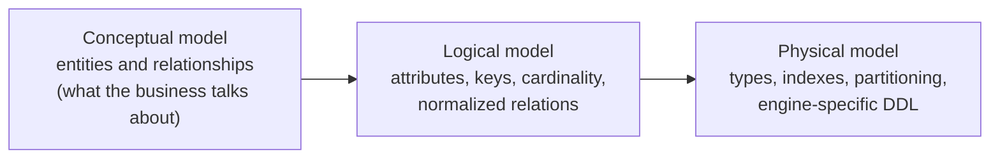
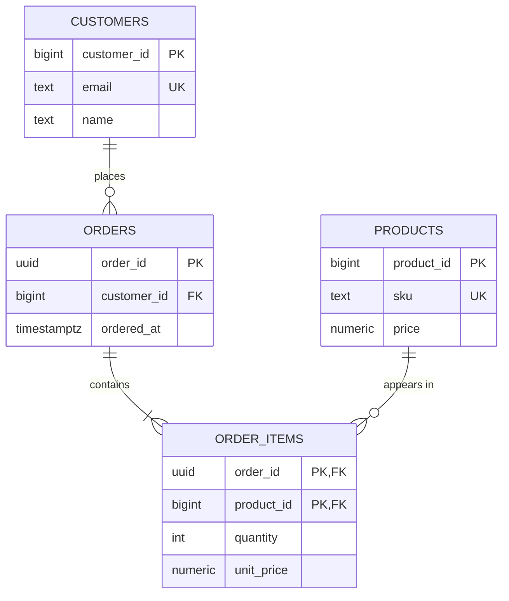
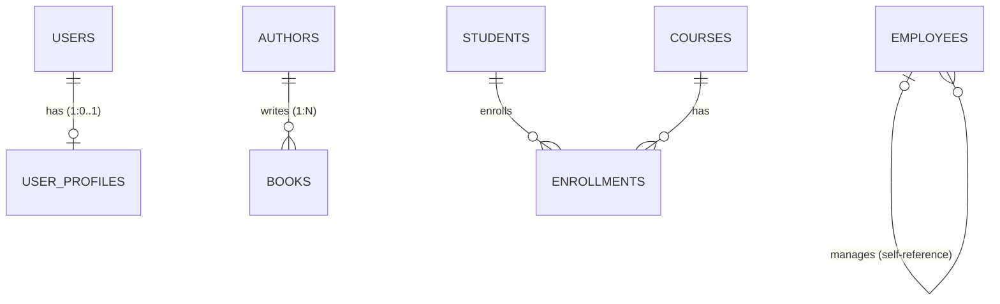
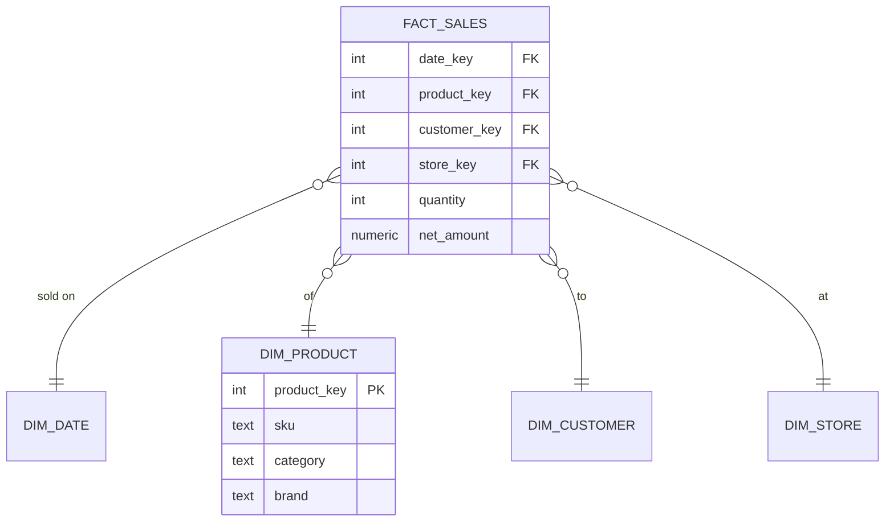

<p><a href="./">&larr; Database Design</a></p>

# Data Modeling & Normalization

**Data modeling** is the process of deciding what a database stores and how it is structured: which entities exist, how they relate, which facts depend on which keys, and which rules the database itself must enforce. A good relational model makes invalid states unrepresentable, keeps each fact in exactly one place, and still answers the application's queries efficiently. This page covers the relational model's building blocks (keys and constraints), normalization theory, relationship and hierarchy patterns, temporal and analytical (dimensional) models, and the anti-patterns that most often cause trouble in production schemas.

Examples use PostgreSQL syntax (version 13 or later unless noted); dialect differences are called out where they matter.

## Levels of a Data Model

Modeling usually moves through three levels of increasing detail. Each level answers a different question, and mistakes are cheapest to fix at the top.



| Level | Audience | Artifacts | Typical decisions |
|---|---|---|---|
| Conceptual | Domain experts, product | ER sketch, glossary | "A customer places orders; an order has one or more line items." |
| Logical | Engineers | Relations, keys, functional dependencies | Which attributes form the key; which normal form to target |
| Physical | Engineers, DBAs | `CREATE TABLE`, indexes, partitions | `numeric(12,2)` vs `bigint` cents; B-tree vs GIN index; partition by month |

## The Relational Model

Edgar F. Codd's relational model (1970) represents data as **relations** — sets of tuples over named, typed attributes — and manipulates them with a small algebra (selection, projection, join, union, difference). SQL tables are a pragmatic approximation: rows are unordered, but duplicates and `NULL`s are allowed, which is why a well-designed table always declares a key.

### Keys

| Term | Meaning |
|---|---|
| **Superkey** | Any set of columns whose values uniquely identify a row |
| **Candidate key** | A minimal superkey (remove any column and it stops being unique) |
| **Primary key** | The candidate key chosen as the row's canonical identifier |
| **Alternate key** | Any other candidate key; enforce it with `UNIQUE` |
| **Natural key** | A key drawn from the domain (ISO country code, ISBN, email) |
| **Surrogate key** | A meaningless generated identifier (identity column, UUID) |
| **Foreign key** | Columns that must match a candidate key in another (or the same) table |

The usual practice is a **surrogate primary key plus `UNIQUE` constraints on the natural keys**. Surrogates are stable when business identifiers change, compact to index, and cheap to join on; the `UNIQUE` constraints keep the natural identity rules enforced.

For generated keys, prefer standard identity columns over PostgreSQL's legacy `SERIAL` pseudo-type. When keys must be generated outside the database (distributed services, offline clients) use **UUIDv7**, which is time-ordered and therefore inserts into B-tree indexes far more cheaply than random UUIDv4. PostgreSQL 18 ships a native `uuidv7()` function; older versions need an extension or application-side generation.

```sql
CREATE TABLE customers (
    customer_id  bigint GENERATED ALWAYS AS IDENTITY PRIMARY KEY,
    email        text NOT NULL UNIQUE,              -- natural key, still enforced
    name         text NOT NULL,
    created_at   timestamptz NOT NULL DEFAULT now()
);

CREATE TABLE products (
    product_id   bigint GENERATED ALWAYS AS IDENTITY PRIMARY KEY,
    sku          text NOT NULL UNIQUE,
    name         text NOT NULL,
    price        numeric(12,2) NOT NULL CHECK (price >= 0),
    stock        integer NOT NULL CHECK (stock >= 0)
);

CREATE TABLE orders (
    order_id     uuid PRIMARY KEY DEFAULT uuidv7(),  -- PostgreSQL 18+
    customer_id  bigint NOT NULL REFERENCES customers (customer_id),
    status       text NOT NULL DEFAULT 'pending'
                 CHECK (status IN ('pending', 'paid', 'shipped', 'cancelled')),
    ordered_at   timestamptz NOT NULL DEFAULT now()
);
```

### Constraints: Let the Database Enforce the Rules

Application validation can be bypassed by a second service, a migration script, or a bug; constraints cannot. Declare every rule the schema can express:

| Constraint | Enforces | Notes |
|---|---|---|
| `NOT NULL` | Presence | The default should be `NOT NULL`; allow `NULL` only when "unknown" is a real state |
| `CHECK` | Row-level predicates | Ranges, enumerations, cross-column rules (`end_at > start_at`) |
| `UNIQUE` | Alternate keys | Partial unique indexes handle conditional uniqueness (`WHERE deleted_at IS NULL`) |
| `PRIMARY KEY` | Identity | Implies `NOT NULL` + `UNIQUE` |
| `FOREIGN KEY` | Referential integrity | Choose `ON DELETE` behavior deliberately (below) |
| `EXCLUDE` (PostgreSQL) | No two rows "conflict" under an operator | Classic use: no overlapping bookings for the same room |

Foreign-key actions encode ownership:

| `ON DELETE` | Use when |
|---|---|
| `RESTRICT` / `NO ACTION` (default) | The child is independent and must be dealt with explicitly (orders referencing a customer) |
| `CASCADE` | The child is *owned* by the parent and meaningless without it (line items of an order) |
| `SET NULL` / `SET DEFAULT` | The relationship is optional (a ticket's assignee leaves the company) |

PostgreSQL does not automatically index the referencing side of a foreign key. Index it yourself, or deletes on the parent and joins from the parent will scan the child table — see [Indexing & Query Execution](indexing-and-queries.html).

### Where ACID Fits

Constraints define what a valid state is; **transactions** guarantee the database only moves between valid states. The ACID properties — atomicity, consistency, isolation, durability — are covered in depth in [Transactions & Concurrency](transactions-and-concurrency.html). Two modeling consequences are worth stating here:

- A transaction covers only database work. Sending an email or calling a payment API inside a transaction does not make that side effect roll back; record the intent in the same transaction and deliver it afterwards (the [transactional outbox](distributed-transactions.html#the-outbox-pattern)).
- The "C" in ACID is only as strong as your constraints. A schema without `CHECK` and `FOREIGN KEY` constraints delegates consistency entirely to application code.

## Normalization {#database-normalization-avoiding-data-disasters}

**Normalization** decomposes relations so that every non-key fact depends on the key, the whole key, and nothing but the key. Its purpose is not saving disk space; it is eliminating **update anomalies** — situations where the schema lets the same fact hold two different values.

### Anomalies in an Unnormalized Table

```text
order_id | customer_email   | customer_name | product_1 | price_1 | product_2 | price_2
---------+------------------+---------------+-----------+---------+-----------+--------
1001     | john@example.com | John Smith    | Laptop    | 999.00  | Mouse     | 29.00
1002     | john@example.com | John Smith    | Keyboard  | 79.00   | NULL      | NULL
```

| Anomaly | Example |
|---|---|
| **Update** | John changes his email; every order row must be updated, and missing one leaves two "truths" |
| **Insert** | A new product cannot be recorded until someone orders it |
| **Delete** | Deleting order 1002 may delete the only record of the Keyboard's price |
| **Structural** | An order with three products does not fit; `product_1..n` columns cap the design |

### Functional Dependencies

A **functional dependency** $X \to Y$ holds when any two rows that agree on columns $X$ also agree on $Y$. Dependencies come from business rules, not from sample data: `sku -> price` holds if the catalog has one current price per SKU; `(order_id, sku) -> quantity` holds because an order lists each product once.

Normal forms are defined in terms of these dependencies and the table's candidate keys. Attributes that belong to some candidate key are **prime**; the rest are **non-prime**.

### The Normal Forms

| Normal form | Requirement | Violation it removes |
|---|---|---|
| **1NF** | Every column holds a single value of its domain; no repeating groups | `product_1, product_2, ...` columns; comma-separated lists |
| **2NF** | 1NF, and no non-prime attribute depends on *part* of a composite key | `product_name` depending only on `sku` in an `(order_id, sku)` table |
| **3NF** | 2NF, and no non-prime attribute depends on another non-prime attribute (no transitive dependency) | `customer_name` depending on `customer_id`, which depends on `order_id` |
| **BCNF** | For every non-trivial $X \to Y$, $X$ is a superkey | Rare 3NF cases with overlapping candidate keys |
| **4NF** | BCNF, and no non-trivial multivalued dependencies | Independent multi-valued facts stored together (a person's skills × languages) |
| **5NF** | 4NF, and every join dependency is implied by the candidate keys | Facts that can only be reconstructed by joining three or more projections |

In practice, **3NF or BCNF is the target** for transactional (OLTP) schemas. 4NF and 5NF violations are uncommon and usually show up as a table whose row count is the cross product of two unrelated lists.

### Worked Decomposition

Starting from the unnormalized orders table:

1. **1NF** — move the repeating product columns into one row per line item: `order_lines(order_id, product_name, price, quantity, customer_email, customer_name)`.
2. **2NF** — the key of that table is `(order_id, sku)`. `price` and `product_name` depend on `sku` alone, and `customer_*` depends on `order_id` alone, so split them out into `products` and `orders`.
3. **3NF** — in `orders(order_id, customer_id, customer_email, customer_name)`, the customer attributes depend on `customer_id`, a non-key attribute. Move them into `customers`.

The result:



```sql
CREATE TABLE order_items (
    order_id    uuid   NOT NULL REFERENCES orders (order_id) ON DELETE CASCADE,
    product_id  bigint NOT NULL REFERENCES products (product_id),
    quantity    integer NOT NULL CHECK (quantity > 0),
    unit_price  numeric(12,2) NOT NULL,     -- price at time of sale (see below)
    PRIMARY KEY (order_id, product_id)
);
CREATE INDEX ON order_items (product_id);   -- FK side is not indexed automatically
```

Note `order_items.unit_price`. It looks like a duplicate of `products.price`, but it is a different fact: *the price this order was charged*, which must not change when the catalog price does. Recognizing when an apparently redundant column is really a distinct, time-bound fact is one of the most common judgment calls in modeling.

### Denormalization

Normalization optimizes for correctness of writes; some read paths need data pre-joined or pre-aggregated. **Denormalization** deliberately stores derived or duplicated data — but it should be a measured decision with a named mechanism for keeping the copy correct.

| Technique | Keeps the copy correct via | Good for |
|---|---|---|
| Materialized view | `REFRESH MATERIALIZED VIEW [CONCURRENTLY]` on a schedule | Dashboards and reports that tolerate staleness |
| Generated column | The database, on write (`STORED`) or on read (virtual; the default in PostgreSQL 18) | Values derived from the same row (`total = qty * unit_price`) |
| Counter / summary column | A trigger or the same transaction as the source write | `posts.comment_count`, account balances |
| Read model / projection | Change data capture or an event stream | Search indexes, caches, CQRS read stores |
| Duplicated attribute | Application code (weakest guarantee) | Last resort; document it |

Measure first: a correctly indexed join over normalized tables is fast enough far more often than intuition suggests.

## Modeling Relationships

Every relationship between entities has a **cardinality** (how many on each side) and an **optionality** (whether participation is required). Crow's-foot notation, used by the mermaid diagrams on this page, encodes both.



| Cardinality | Implementation |
|---|---|
| One-to-one | Foreign key that is also the primary key (or `UNIQUE`) on the dependent side |
| One-to-many | Foreign key on the "many" side |
| Many-to-many | Junction (associative) table with a foreign key to each side; the pair is its primary key |
| Self-referencing | Foreign key to the same table (hierarchies, manager chains) |

```sql
-- One-to-one: the profile's PK *is* the FK, so at most one profile per user
CREATE TABLE user_profiles (
    user_id    bigint PRIMARY KEY REFERENCES users (user_id) ON DELETE CASCADE,
    bio        text,
    avatar_url text
);

-- Many-to-many: the junction table often carries attributes of the relationship
CREATE TABLE enrollments (
    student_id  bigint NOT NULL REFERENCES students (student_id),
    course_id   bigint NOT NULL REFERENCES courses (course_id),
    enrolled_on date   NOT NULL DEFAULT current_date,
    grade       text,
    PRIMARY KEY (student_id, course_id)
);
CREATE INDEX ON enrollments (course_id);   -- the PK already covers student_id lookups
```

A one-to-one split is justified when the second table is optional, large and rarely read (keeping the hot table narrow), or subject to different access controls. Otherwise, keep the columns in one table.

## Hierarchical Data

Trees (categories, org charts, threaded comments) are a recurring modeling problem because SQL has no native tree type. Four representations dominate:

| Model | Structure | Read subtree | Move subtree | Integrity |
|---|---|---|---|---|
| **Adjacency list** | `parent_id` FK | Recursive CTE | Update one row | FK enforced |
| **Materialized path** | `path` such as `1.3.7` (PostgreSQL `ltree`) | Prefix match, indexable | Rewrite paths of whole subtree | Not enforced by FK |
| **Nested sets** | `lft`, `rgt` interval numbers | Range query, very fast | Renumber much of the tree | Fragile under concurrent writes |
| **Closure table** | Separate `(ancestor, descendant, depth)` table | Join, fast | Delete/insert closure rows | FK enforced |

The adjacency list is the right default now that every major database supports recursive CTEs:

```sql
CREATE TABLE categories (
    category_id bigint GENERATED ALWAYS AS IDENTITY PRIMARY KEY,
    parent_id   bigint REFERENCES categories (category_id),
    name        text NOT NULL
);

-- All descendants of category 3, with depth
WITH RECURSIVE subtree AS (
    SELECT category_id, parent_id, name, 0 AS depth
    FROM categories WHERE category_id = 3
  UNION ALL
    SELECT c.category_id, c.parent_id, c.name, s.depth + 1
    FROM categories c
    JOIN subtree s ON c.parent_id = s.category_id
)
SELECT * FROM subtree;
```

Reach for a materialized path (`ltree` with a GiST index) or a closure table when subtree reads dominate on deep, large trees; nested sets are mainly of historical interest.

## Polymorphic and Variant Data

### Polymorphic associations

A common framework pattern lets one table point at rows in several others via a `(type, id)` pair:

```sql
-- Anti-pattern: commentable_id cannot be a foreign key
CREATE TABLE comments (
    comment_id       bigint GENERATED ALWAYS AS IDENTITY PRIMARY KEY,
    commentable_type text   NOT NULL,   -- 'post' | 'photo' | 'video'
    commentable_id   bigint NOT NULL,
    body             text   NOT NULL
);
```

Because `commentable_id` refers to different tables depending on another column, the database cannot enforce referential integrity: deleting a post orphans its comments silently. Two alternatives preserve integrity:

```sql
-- Option A: exclusive arcs - one nullable FK per target, exactly one set
CREATE TABLE comments (
    comment_id bigint GENERATED ALWAYS AS IDENTITY PRIMARY KEY,
    post_id    bigint REFERENCES posts (post_id)   ON DELETE CASCADE,
    photo_id   bigint REFERENCES photos (photo_id) ON DELETE CASCADE,
    body       text NOT NULL,
    CHECK (num_nonnulls(post_id, photo_id) = 1)
);

-- Option B: a common supertype - posts and photos each reference a
-- "commentable" row, and comments reference that
CREATE TABLE commentables (commentable_id bigint GENERATED ALWAYS AS IDENTITY PRIMARY KEY);
-- posts.commentable_id and photos.commentable_id: UNIQUE REFERENCES commentables
-- comments.commentable_id: REFERENCES commentables
```

Exclusive arcs suit a small, stable set of targets; the supertype table scales to many.

### Subtypes and inheritance

When entities share a core but differ in detail (an `employee` who may be a `manager` or an `engineer`), the same three strategies apply as in ORM inheritance mapping: single table with a discriminator and nullable subtype columns, one table per subtype joined to a base table, or one independent table per concrete type. The trade-offs are discussed in [ORMs & Data-Access Patterns](orm-patterns.html#mapping-inheritance).

### Semi-structured attributes: JSONB, not EAV

For attributes that genuinely vary per row (product specifications across categories), the **entity–attribute–value** (EAV) design stores one row per attribute:

```sql
-- EAV: every value is text, every read is a pivot, nothing is constrained
CREATE TABLE product_attributes (
    product_id bigint REFERENCES products (product_id),
    attribute  text,
    value      text,
    PRIMARY KEY (product_id, attribute)
);
```

EAV loses types, constraints, and readable queries; reassembling one product takes a pivot or one join per attribute. In PostgreSQL (and increasingly in MySQL, SQL Server, and SQLite) a **JSON column** is the better tool: keep stable, frequently filtered attributes as real columns and put the long tail in `jsonb`.

```sql
ALTER TABLE products ADD COLUMN specs jsonb NOT NULL DEFAULT '{}';

-- Constrain what matters, index what you query
ALTER TABLE products ADD CONSTRAINT specs_is_object
    CHECK (jsonb_typeof(specs) = 'object');
CREATE INDEX products_specs_gin ON products USING gin (specs jsonb_path_ops);

SELECT name FROM products WHERE specs @> '{"ram_gb": 32}';
```

## Temporal Data and History

Most business data changes over time, and many questions are about the past ("what was the price on 1 March?", "who changed this row?"). Choose a mechanism per requirement:

| Need | Pattern |
|---|---|
| Who changed what, when (forensics, compliance) | **Audit table** populated by a trigger or change data capture |
| Value as of a point in time, queried by the app | **Validity periods** (`valid_from`, `valid_to` or a range column) |
| Prevent overlapping periods | `EXCLUDE` constraint, or `PRIMARY KEY ... WITHOUT OVERLAPS` in PostgreSQL 18 |
| History of dimension attributes in a warehouse | **Slowly changing dimension**, type 2 (see below) |

An audit trigger in PostgreSQL:

```sql
CREATE TABLE users_audit (
    audit_id    bigint GENERATED ALWAYS AS IDENTITY PRIMARY KEY,
    user_id     bigint      NOT NULL,
    operation   text        NOT NULL,           -- INSERT | UPDATE | DELETE
    changed_at  timestamptz NOT NULL DEFAULT now(),
    changed_by  text        DEFAULT current_setting('app.user', true),
    old_row     jsonb,
    new_row     jsonb
);

CREATE FUNCTION log_user_changes() RETURNS trigger
LANGUAGE plpgsql AS $fn$
BEGIN
    INSERT INTO users_audit (user_id, operation, old_row, new_row)
    VALUES (
        COALESCE(NEW.user_id, OLD.user_id),
        TG_OP,
        CASE WHEN TG_OP <> 'INSERT' THEN to_jsonb(OLD) END,
        CASE WHEN TG_OP <> 'DELETE' THEN to_jsonb(NEW) END
    );
    RETURN NULL;   -- return value is ignored for AFTER triggers
END
$fn$;

CREATE TRIGGER users_audit_trg
AFTER INSERT OR UPDATE OR DELETE ON users
FOR EACH ROW EXECUTE FUNCTION log_user_changes();
```

Validity periods with database-enforced non-overlap (PostgreSQL 18 temporal keys; on earlier versions use an `EXCLUDE USING gist` constraint with the `btree_gist` extension):

```sql
CREATE EXTENSION IF NOT EXISTS btree_gist;

CREATE TABLE product_prices (
    product_id bigint    NOT NULL REFERENCES products (product_id),
    valid      tstzrange NOT NULL,
    price      numeric(12,2) NOT NULL,
    PRIMARY KEY (product_id, valid WITHOUT OVERLAPS)   -- PostgreSQL 18+
);

SELECT price FROM product_prices
WHERE product_id = 42 AND valid @> timestamptz '2026-03-01';
```

## Dimensional Models for Analytics

Transactional schemas are normalized for many small writes. Analytical workloads read large slices and aggregate them, and are usually modeled **dimensionally** (Kimball): a central **fact table** of measurements at a declared **grain**, surrounded by **dimension tables** of descriptive context.



- **Star schema** — dimensions are denormalized (category and brand live directly on `dim_product`), so any question is one join away from the fact table. The default choice.
- **Snowflake schema** — dimensions are themselves normalized (`dim_product -> dim_category -> dim_department`). Saves space and centralizes hierarchies at the cost of more joins; modern columnar engines make the space argument weak.
- **Grain** — state it explicitly ("one row per order line"). Mixing grains in one fact table is the most common dimensional-modeling bug.
- **Slowly changing dimensions (SCD)** — type 1 overwrites an attribute (history lost); **type 2** inserts a new dimension row with its own surrogate key and validity dates, so old facts keep pointing at the attribute values that were true when they happened.

```sql
CREATE TABLE dim_customer (
    customer_key  bigint GENERATED ALWAYS AS IDENTITY PRIMARY KEY,  -- surrogate per version
    customer_id   bigint  NOT NULL,          -- natural/business key
    city          text,
    segment       text,
    valid_from    date    NOT NULL,
    valid_to      date    NOT NULL DEFAULT '9999-12-31',
    is_current    boolean NOT NULL DEFAULT true
);
```

Dimensional models typically live in columnar warehouses or lakehouse tables (Parquet with Iceberg or Delta Lake) rather than in the OLTP database; wide, denormalized "one big table" designs are also common there because columnar storage makes unused columns nearly free to carry.

## Schema Anti-Patterns

| Anti-pattern | Symptom | Better design |
|---|---|---|
| **Repeating columns** (`tag1`, `tag2`, `tag3`) | Arbitrary limits; `OR` across columns in every query | Child or junction table (`post_tags`) |
| **Delimited lists in a column** (`'12,45,97'`) | Cannot index, join, or constrain members | Junction table, or an array/JSON column when members are never joined |
| **EAV for core attributes** | Pivots everywhere; no types or constraints | Real columns plus `jsonb` for the long tail |
| **Polymorphic foreign keys** | Orphaned rows; no FK possible | Exclusive arcs or a supertype table |
| **Intelligent keys** (`'US-2024-WEB-00123'`) | Parsing keys in queries; key changes when rules change | Surrogate key + separate columns + composite `UNIQUE` |
| **Floating point for money** | `0.1 + 0.2 <> 0.3` rounding drift | `numeric(p,s)` or integer minor units |
| **Timestamps without time zone** for events | Ambiguous across DST and regions | `timestamptz` (stored as UTC) |
| **Nullable everything** | Three-valued logic surprises; unclear required fields | `NOT NULL` by default, explicit defaults |
| **Soft delete without partial unique index** | Re-creating a "deleted" email fails the `UNIQUE` check | `UNIQUE (email) WHERE deleted_at IS NULL`, or archive tables |
| **One giant `status` text column with no `CHECK`** | Typos become new states | `CHECK (status IN (...))`, an enum type, or a lookup table with FK |

The intelligent-key fix, concretely:

```sql
CREATE TABLE orders_v2 (
    order_id     bigint GENERATED ALWAYS AS IDENTITY PRIMARY KEY,
    country      char(2)  NOT NULL,
    order_year   smallint NOT NULL,
    channel      text     NOT NULL,
    order_number integer  NOT NULL,
    UNIQUE (country, order_year, channel, order_number)
);
-- The human-readable reference is derived, not stored as the key:
-- country || '-' || order_year || '-' || channel || '-' || lpad(order_number::text, 5, '0')
```

> **Dialect notes.** MySQL spells identity columns `AUTO_INCREMENT` and allows an inline `INDEX name (cols)` clause inside `CREATE TABLE`; PostgreSQL requires a separate `CREATE INDEX`. `uuidv7()`, virtual-by-default generated columns, and `WITHOUT OVERLAPS` keys require PostgreSQL 18.

## Next Steps

- **Next:** [Indexing & Query Execution](indexing-and-queries.html) — make the schema you just modeled fast to read.
- [Schema Evolution & Migrations](schema-evolution-and-migrations.html) — change a live schema without downtime.
- [NoSQL Data Models](nosql-data-models.html) — the query-first alternative to normalization.
- **Up:** [Database Design hub](./)
- See also: [Database Crash Course](../database-crash-course.html) for the SQL basics behind these schemas.
- **Code:** [`normalization.py`](../../../code-examples/technology/database-design/normalization.py) — Armstrong's axioms, attribute closure, BCNF decomposition, and 3NF synthesis in Python.
