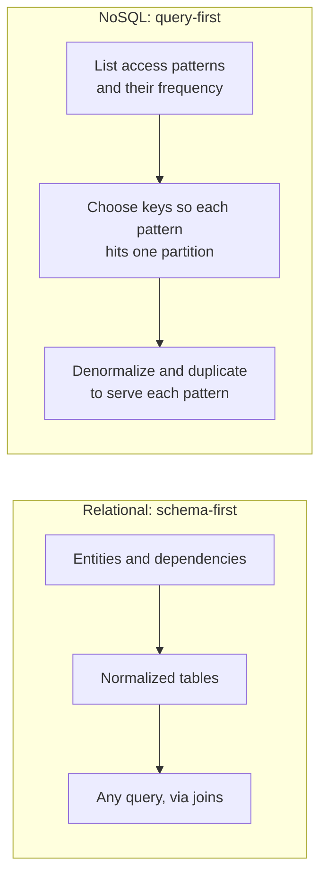
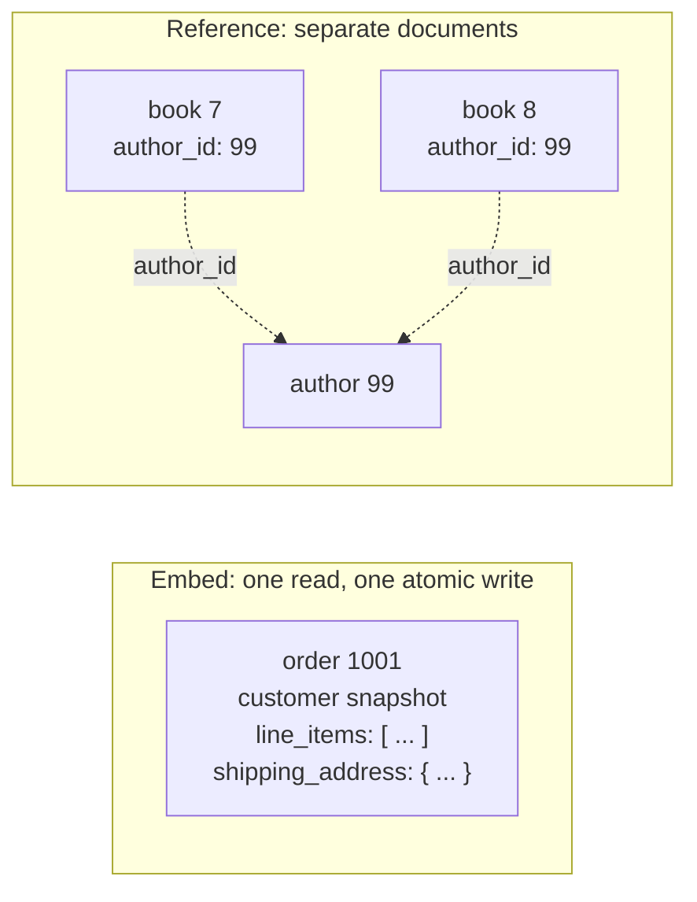
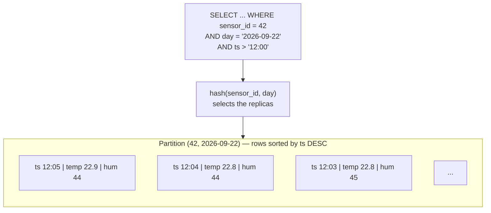
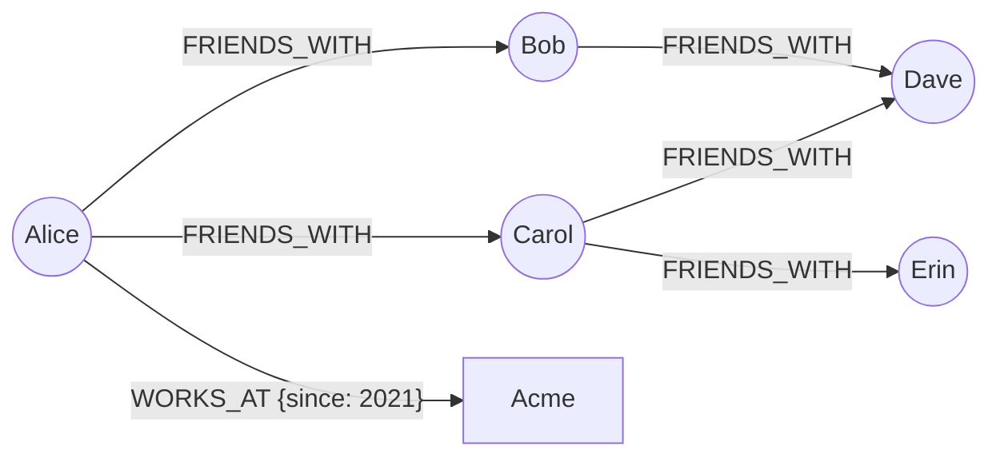
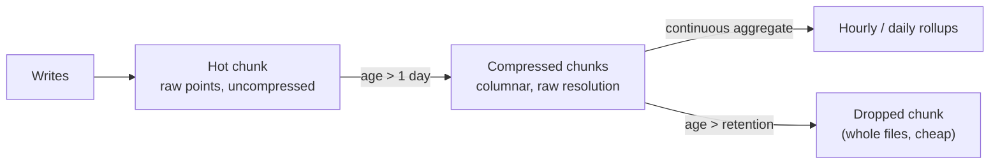
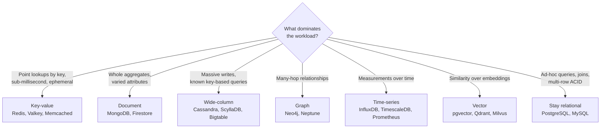

<p><a href="./">&larr; Database Design</a></p>

# NoSQL Data Models

"NoSQL" is an umbrella term for databases that do not use the relational table-and-join model as their primary abstraction. It covers several genuinely different **data models** — document, key-value, wide-column, graph, and time-series, with vector search emerging as a sixth — each optimized for a particular shape of data and a particular set of queries. This page explains how each model stores data, how to design schemas for it, and how to choose between them. Distribution concerns (CAP, consensus, replication) are covered in [Distributed Databases & NoSQL](distributed-and-nosql.html) and [Replication & Consensus](replication-and-consensus.html).

## Query-First Modeling

The single most important idea in NoSQL modeling reverses the relational habit.

- In a **relational** database you model the *data*: normalize it to remove redundancy, then rely on joins and the query planner to answer whatever queries arrive later.
- In most **NoSQL** stores there are no general-purpose joins at query time, and efficient access is only possible through the key the data is partitioned or indexed by. So you model the *queries*: enumerate the access patterns first, then shape — and often duplicate — the data so each pattern is a single, cheap lookup.



The practical consequence: before choosing a NoSQL store, write down each read and write the application must serve, with expected rates and latency targets. The right model is the one that turns the most frequent patterns into single-partition operations. A store chosen before the access patterns are known usually ends up emulating joins in application code.

| Model | Core abstraction | Sweet spot | Representative engines |
|---|---|---|---|
| **Document** | Self-contained JSON-like documents | Aggregates read and written as a unit; varied attributes | MongoDB, Couchbase, Firestore, Amazon DocumentDB |
| **Key-value** | Opaque or typed value behind a key | Caches, sessions, counters, leaderboards | Redis, Valkey, Memcached, DynamoDB, etcd |
| **Wide-column** | Partitioned rows of sparse, sorted columns | Write-heavy, huge tables with known queries | Cassandra, ScyllaDB, HBase, Bigtable |
| **Graph** | Nodes and typed relationships | Multi-hop traversal: social, fraud, recommendations | Neo4j, Amazon Neptune, Memgraph |
| **Time-series** | Timestamped measurements with tags | Metrics, telemetry, IoT | InfluxDB, TimescaleDB, Prometheus, QuestDB |
| **Vector** | High-dimensional embeddings + ANN index | Semantic search, retrieval for LLM applications | pgvector, Milvus, Qdrant, and vector features in most engines above |

## Document Stores

A document store keeps each record as a self-contained, hierarchical document (JSON, or a binary encoding such as MongoDB's BSON). Related sub-objects and arrays live *inside* the document, so one read returns a whole **aggregate** — the unit the application loads, modifies, and saves together — and a write to one document is atomic.

```javascript
// MongoDB: a product aggregate with category-specific attributes
db.products.insertOne({
  sku: "LAP-15-G",
  name: "15-inch Gaming Laptop",
  price: NumberDecimal("1499.00"),
  category: "laptop",
  specs: {
    cpu: "8-core", ram_gb: 32, gpu_vram_gb: 8,
    display: { size_in: 15.6, refresh_hz: 165 }
  },
  rating: { avg: 4.6, count: 212 },       // summary kept on the parent
  created_at: new Date()
});

// Query and index nested fields with dot notation
db.products.createIndex({ category: 1, "specs.ram_gb": 1 });
db.products.find({ category: "laptop", "specs.ram_gb": { $gte: 32 } });
```

### Embed vs. reference

The central decision is whether related data is **embedded** in the parent document or **referenced** by id and fetched separately (with a second query or a `$lookup` aggregation stage).



| Embed when | Reference when |
|---|---|
| The child is owned by the parent ("contains") | The child is shared by many parents |
| Cardinality is one-to-few and bounded | Cardinality is large or unbounded |
| Child and parent are read together | The child is often read on its own |
| They change together and need atomic updates | The child changes independently and frequently |

Unbounded embedded arrays are the classic failure: documents have a hard size cap (16 MiB in MongoDB; 400 KB per item in DynamoDB), and large documents are rewritten and transferred in full on every change. Established patterns address the in-between cases:

- **Subset** — embed the most recent or most relevant few children (the latest 10 reviews) and reference the rest in their own collection.
- **Extended reference** — copy the handful of fields you always display (author name) alongside the reference, accepting that the copy must be updated when the source changes.
- **Bucket** — for high-volume one-to-many data, store a bounded batch of children per document (one document per sensor per hour).
- **Computed** — maintain summaries (`rating.avg`, `rating.count`) on write instead of aggregating on every read.

Multi-document ACID transactions are available in MongoDB (since 4.0 for replica sets and 4.2 for sharded clusters), but they cost more than single-document writes. A model that needs them on its hot path has usually split an aggregate that should have been one document.

### Schema flexibility is a contract

"Schemaless" means the database does not require a schema, not that the data has none. Enforce the important parts with validation and version the shape so old and new documents can coexist during migrations:

```javascript
db.createCollection("products", {
  validator: {
    $jsonSchema: {
      bsonType: "object",
      required: ["sku", "name", "price", "schema_version"],
      properties: {
        sku:            { bsonType: "string" },
        price:          { bsonType: "decimal", minimum: 0 },
        schema_version: { bsonType: "int" }
      }
    }
  },
  validationAction: "error"
});
```

## Key-Value Stores

A key-value store is a distributed hash map: a key maps to a value, and access is by key. In the pure form (Memcached, etcd, RocksDB) the value is opaque bytes. Redis and its open-source fork **Valkey** (created under the Linux Foundation in 2024 after Redis left the BSD license; Redis 8 later added AGPLv3 as a licensing option) are *data-structure servers*: values are typed structures with server-side operations.

```bash
# Leaderboard: a sorted set, O(log n) updates and rank queries
ZINCRBY game:leaderboard 100 "player:alice"
ZREVRANGE game:leaderboard 0 9 WITHSCORES

# Cache with expiry
SET cache:product:42 '{"id":42,"name":"Laptop"}' EX 300

# Session hash with field-level updates and a sliding TTL
HSET session:abc123 user_id 1234 cart_items 3
EXPIRE session:abc123 1800

# Fixed-window rate limiter
INCR ratelimit:user:1234:202609221405
EXPIRE ratelimit:user:1234:202609221405 60
```

### Keys are the schema

Because retrieval is by key only, the **key namespace is the data model**. Every access pattern must map to a key you can compute:

```text
user:1234:profile          hash         profile fields
user:1234:sessions         set          ids of active sessions (a hand-built index)
session:abc123             hash + TTL   expires on its own
cart:1234                  hash         product_id -> quantity
game:leaderboard           sorted set   member -> score
```

- **Encode the access pattern in the key.** To answer "all sessions for a user" without scanning, maintain `user:{id}:sessions` on every write. Secondary indexes are keys you build yourself (Redis 8's integrated query engine and search modules are the exception, at additional memory cost).
- **Pick the structure that fits the operation.** Sorted sets for rankings and time-ordered feeds, hashes for objects with field updates, streams for append-only logs with consumer groups, HyperLogLog for approximate distinct counts, and — in Redis 8 — JSON documents and vector sets.
- **Expire ephemeral data.** Sessions, caches, and rate-limit counters should carry TTLs rather than depend on cleanup jobs.
- **Avoid big and hot keys.** A multi-megabyte value or a key every request touches concentrates load on one shard. Split large aggregates and shard hot counters (`counter:{n}` for n in 0..15, summed on read).

### DynamoDB and single-table design

Amazon DynamoDB is a managed key-value and document store whose primary key is a **partition key** plus an optional **sort key**. Items with the same partition key form an *item collection* stored together and sorted by the sort key, which allows range queries within one partition. **Global secondary indexes** (GSIs) re-key the same items under a different partition/sort key, asynchronously.

**Single-table design** exploits this by storing several entity types in one table with generic key attributes, so that a one-to-many relationship becomes a single `Query` on one partition:

| PK | SK | Other attributes |
|---|---|---|
| `CUSTOMER#1234` | `PROFILE` | name, email |
| `CUSTOMER#1234` | `ORDER#2026-09-20#8812` | total, status |
| `CUSTOMER#1234` | `ORDER#2026-09-21#8830` | total, status |
| `ORDER#8830` | `ITEM#1` | sku, quantity |

`Query PK = "CUSTOMER#1234" AND begins_with(SK, "ORDER#")` returns a customer's orders newest-first with `ScanIndexForward = false`. The cost is rigidity: new access patterns often require a new GSI or a backfill, and the table is opaque to ad-hoc analysis. Many teams use single-table design for a few hot, well-understood patterns and separate tables elsewhere.

### When key-value is the wrong primary store

Key-value stores are excellent caches, session stores, and coordination services, and poor systems of record for data that must be queried by attribute ("all orders over $100 this week"), since every such query needs a hand-maintained index or a full scan. Treat Redis/Valkey as an in-memory store: configure persistence (RDB snapshots and/or the append-only file) explicitly if losing its contents on restart is unacceptable.

## Wide-Column Stores

A wide-column (column-family) store looks tabular but works very differently from a relational table. The **partition key** is hashed to decide which nodes own the data; within a partition, rows are physically sorted by **clustering columns**. Rows can be sparse, writes go to an append-only log-structured merge tree (see [Storage Engines & Recovery](storage-internals.html)), and the engine is built for very high write throughput and queries that touch one partition.



```sql
-- Cassandra CQL: one partition per sensor per day, newest first
CREATE TABLE sensor_readings (
    sensor_id   bigint,
    day         date,
    ts          timestamp,
    temperature double,
    humidity    double,
    PRIMARY KEY ((sensor_id, day), ts)
) WITH CLUSTERING ORDER BY (ts DESC);

SELECT ts, temperature
FROM sensor_readings
WHERE sensor_id = 42 AND day = '2026-09-22'
  AND ts > '2026-09-22 12:00:00+0000';
```

### One table per query

Cassandra-style modeling works backwards from each query:

1. The `WHERE` clause must specify the **full partition key** with equality, so the coordinator knows which replicas to ask.
2. **Clustering columns** define the sort order and the only range predicates allowed, in declaration order.
3. A second access pattern gets a **second table** holding the same data keyed differently, written alongside the first (in a logged batch if the copies must not diverge).

```sql
-- Query A: messages in a channel, newest first (bucketed by day)
CREATE TABLE messages_by_channel (
    channel_id bigint,
    bucket     date,
    message_id timeuuid,
    author_id  bigint,
    content    text,
    PRIMARY KEY ((channel_id, bucket), message_id)
) WITH CLUSTERING ORDER BY (message_id DESC);

-- Query B: everything a user wrote - same data, different key
CREATE TABLE messages_by_author (
    author_id  bigint,
    bucket     date,
    message_id timeuuid,
    channel_id bigint,
    content    text,
    PRIMARY KEY ((author_id, bucket), message_id)
) WITH CLUSTERING ORDER BY (message_id DESC);
```

Design rules:

- **Duplication is the norm.** Storage is cheap relative to cross-partition reads.
- **Bound partition size.** An unbounded partition (every message in a busy channel, forever) degrades reads, compaction, and repair. Add a time bucket or hashed sub-key so partitions stay well under the commonly cited limits of about 100 MB and 100,000 rows.
- **Spread writes.** A monotonic partition key (today's date alone) sends all current writes to one replica set.
- **Prefer immutable, append-style writes.** Frequent overwrites and deletes create tombstones that slow reads until compaction removes them; TTL-heavy tables need a compaction strategy chosen for it.
- **Indexes are narrower than they look.** Cassandra 5.0's **Storage-Attached Indexes** (SAI) make secondary-index queries far more practical than the legacy indexes and add vector search, but a query that does not restrict the partition key still fans out to every node. `ALLOW FILTERING` is a full scan.

### Wide-column is not columnar

The names collide. Wide-column stores (Cassandra, ScyllaDB, HBase, Bigtable) are row-oriented, key-partitioned operational stores. **Columnar** analytical engines (ClickHouse, Apache Druid, DuckDB, and warehouses over Parquet) store each column separately so scans and aggregates over billions of rows are fast. Cassandra answers "this sensor's last hour"; ClickHouse answers "average temperature by region this year".

## Graph Databases

A graph database makes **relationships first-class**: data is stored as nodes (entities) and typed, directed relationships (edges), both of which can carry properties. Native graph engines store adjacency directly (*index-free adjacency*), so moving from a node to its neighbours costs time proportional to the neighbours visited rather than to the size of the whole dataset.



```cypher
// Friends-of-friends who are not already friends, ranked by mutual friends
MATCH (me:Person {name: 'Alice'})-[:FRIENDS_WITH]-(friend)-[:FRIENDS_WITH]-(foaf:Person)
WHERE foaf <> me
  AND NOT EXISTS { (me)-[:FRIENDS_WITH]-(foaf) }
RETURN foaf.name AS suggestion, count(DISTINCT friend) AS mutual
ORDER BY mutual DESC
LIMIT 10;
```

On the graph above this suggests Dave (two mutual friends) and Erin (one).

### Why graphs win at deep traversal

In SQL the same question is a self-join of a `friendships` table per hop, or a recursive CTE. Each join probes an index whose size grows with the whole network, and intermediate results multiply with depth. A graph traversal touches only the local neighbourhood at each step, so a fixed-depth query costs about the same on a thousand-node graph as on a billion-node one, provided the start node is found through an index. The advantage grows with depth and with the irregularity of the paths; for one or two hops over well-indexed tables, a relational database is often just as fast.

### Modeling guidance

- **Nouns become nodes, verbs become relationships.** Give each a label or type; direction and type are part of the model (`(:User)-[:FOLLOWS]->(:User)` is asymmetric).
- **Put relationship attributes on the edge** — a `RATED` edge carries `stars` and `at`.
- **Reify rich relationships into nodes.** An order with line items, status, and timestamps is an `Order` node connected to a `Customer` and many `Product` nodes, not a single edge.
- **Index entry points.** Traversal is cheap once inside the graph; locating `Person {name: 'Alice'}` still needs an index or uniqueness constraint.
- **Watch supernodes.** A node with millions of edges (a celebrity account, a "country" node) makes every traversal through it expensive. Split by relationship type or time, or avoid routing queries through it.

### Property graphs, RDF, and standards

The **property graph** model (Neo4j, Memgraph, Amazon Neptune) is queried with Cypher, openCypher, or Gremlin. **RDF triple stores** (Neptune, GraphDB, Stardog) model everything as subject–predicate–object triples queried with SPARQL, and suit linked data and ontology-driven domains. Property-graph querying is now standardized: **GQL** (ISO/IEC 39075:2024) is a standalone graph query language closely based on Cypher, and **SQL/PGQ** (part 16 of SQL:2023) defines property-graph views and `GRAPH_TABLE` pattern matching over ordinary relational tables.

## Time-Series Databases

A time-series database (TSDB) is specialized for data that is **append-mostly and indexed primarily by time**: a stream of measurements, each with a timestamp, identifying **tags** (host, region, device), and numeric **fields**. Writes dominate, updates are rare, and reads are time-range scans and downsampled aggregations.

A TSDB adds time-aware machinery on top of generic storage: automatic partitioning into time chunks, columnar compression tuned for slowly changing series, continuous aggregates or downsampling, and **retention policies** that drop expired chunks wholesale instead of deleting rows.



**InfluxDB 3** (Core/Enterprise, generally available since 2025) stores data as Parquet files on local disk or object storage, is queried with SQL (via Apache DataFusion) or InfluxQL, and still ingests the line protocol:

```text
# line protocol: measurement,tags fields timestamp
cpu,host=web-01,region=us-east usage_user=23.1,usage_system=8.4 1790000000000000000
```

```sql
-- InfluxDB 3 SQL: 5-minute averages per host over the last hour
SELECT date_bin(INTERVAL '5 minutes', time) AS bucket,
       host,
       avg(usage_user) AS avg_user
FROM cpu
WHERE region = 'us-east' AND time > now() - INTERVAL '1 hour'
GROUP BY bucket, host
ORDER BY bucket;
```

**TimescaleDB** (developed by the company now called TigerData) is a PostgreSQL extension, so time-series tables sit beside relational data with full SQL. Current releases create hypertables directly from `CREATE TABLE`; the older `create_hypertable()` function still works:

```sql
CREATE TABLE metrics (
    time        timestamptz NOT NULL,
    device_id   int         NOT NULL,
    temperature double precision
) WITH (
    tsdb.hypertable,
    tsdb.segmentby = 'device_id',   -- compression groups rows per device
    tsdb.orderby   = 'time DESC'
);

-- Continuously maintained hourly rollup
CREATE MATERIALIZED VIEW metrics_hourly
WITH (timescaledb.continuous) AS
SELECT time_bucket('1 hour', time) AS hour,
       device_id,
       avg(temperature) AS avg_temp
FROM metrics
GROUP BY hour, device_id;

SELECT add_retention_policy('metrics', INTERVAL '30 days');
```

### Modeling guidance

- **Keep tag cardinality bounded.** Every distinct combination of tag values is a separate series. Putting a request id, user id, or raw URL in a tag creates millions of series and exhausts memory (this matters most in Prometheus and older InfluxDB; columnar engines tolerate more, but queries still suffer). Put unbounded identifiers in fields or logs.
- **Tier resolution with retention.** Raw data for days, hourly rollups for months, daily rollups for years — automated with continuous aggregates and retention policies.
- **Write roughly in time order.** Out-of-order and late data is supported but costs more, especially when it lands in already-compressed chunks.
- **Metrics are not events.** Pre-aggregated metrics (Prometheus counters and histograms) answer "how many / how fast" cheaply; per-event detail belongs in logs or traces, or in a columnar store such as ClickHouse.

## Vector Search

Machine-learning **embeddings** represent text, images, or users as vectors of hundreds to thousands of floats, and similarity search ("the 10 nearest vectors to this query vector") underpins semantic search and retrieval-augmented generation. Exact nearest-neighbour search is linear in the data size, so engines use **approximate nearest neighbour** (ANN) indexes such as HNSW graphs or IVF partitioning, trading a little recall for large speedups.

Vector search is increasingly a *feature* rather than a separate database: PostgreSQL has `pgvector`, Cassandra 5.0 has a vector type with SAI indexes, Redis 8 has vector sets, and MongoDB, Elasticsearch/OpenSearch, and the major cloud databases offer vector indexes. Dedicated engines (Milvus, Qdrant, Weaviate, Pinecone) earn their place at very large scale or when filtering and index management need specialist tuning.

```sql
-- pgvector: nearest documents by cosine distance, filtered by tenant
CREATE EXTENSION IF NOT EXISTS vector;
CREATE TABLE doc_chunks (
    id        bigint GENERATED ALWAYS AS IDENTITY PRIMARY KEY,
    tenant_id bigint NOT NULL,
    body      text   NOT NULL,
    embedding vector(1024) NOT NULL
);
CREATE INDEX ON doc_chunks USING hnsw (embedding vector_cosine_ops);

SELECT id, body
FROM doc_chunks
WHERE tenant_id = 7
ORDER BY embedding <=> $1      -- $1: the query embedding
LIMIT 10;
```

The modeling questions are ordinary ones: store the vector next to the data it describes (so filters and deletes stay consistent), record which embedding model and version produced it (vectors from different models are not comparable), and plan for re-embedding when the model changes.

## Choosing a Model

There is no best NoSQL store, only the best fit for a set of access patterns. Start from the dominant queries.



| Model | Query by | Joins | Schema | Write profile | Classic use | Avoid when |
|---|---|---|---|---|---|---|
| **Document** | Any indexed field | `$lookup` only; expensive | Flexible, validated | Balanced | Catalogs, profiles, content | Data is highly relational and queried across aggregates |
| **Key-value** | Key only | None | Opaque or typed value | Very fast point ops | Cache, sessions, rate limits | You must query by attribute |
| **Wide-column** | Partition + clustering key | None | Declared, sparse | Extremely write-heavy | Feeds, messaging, IoT | Ad-hoc queries; frequent updates and deletes |
| **Graph** | Pattern traversal | Native | Flexible | Moderate | Social graph, fraud rings | Data is tabular; bulk aggregation |
| **Time-series** | Time range + tags | Limited | Tags + fields | Append firehose | Metrics, telemetry | Data is not time-ordered; many updates |
| **Vector** | Similarity + filters | None | Vector + metadata | Moderate, batch-heavy | Semantic search, RAG | Exact-match or relational queries |

### Polyglot persistence and multi-model convergence

Real systems often combine stores: PostgreSQL as the system of record, Redis or Valkey for sessions and caching, OpenSearch for full-text search, a TSDB for metrics, and a graph or vector index for recommendations. This **polyglot persistence** lets each access pattern use the best tool, at the cost of running, securing, and keeping in sync several systems — usually via change data capture from the system of record.

The counter-trend is **convergence**: relational engines have absorbed document (PostgreSQL `jsonb`), time-series (TimescaleDB), vector (`pgvector`), and graph (SQL/PGQ) capabilities, while document and key-value stores have added transactions, secondary indexes, and SQL-like query languages. For many applications a single well-run PostgreSQL covers most needs, and a specialized store is justified only when a specific access pattern outgrows it. Measure before adding a database.

> **Code:** [`distributed_systems.py`](../../../code-examples/technology/database-design/distributed_systems.py) contains working examples of several of these models.

## See Also

- [Distributed Databases & NoSQL](distributed-and-nosql.html) — CAP, consensus, NewSQL, and case studies
- [Replication & Consensus](replication-and-consensus.html) — leaderless quorums, the replication model behind Dynamo-style and Cassandra-style stores
- [Data Modeling & Normalization](modeling.html) — the relational counterpart, including JSONB vs. EAV
- [Storage Engines & Recovery](storage-internals.html) — B+ trees vs. LSM trees underneath these stores
- [Indexing & Query Execution](indexing-and-queries.html) — how relational indexes and planners work
- [AWS](../aws/) — managed NoSQL services (DynamoDB, DocumentDB, Neptune, Timestream)
- [Database Design hub](./)
