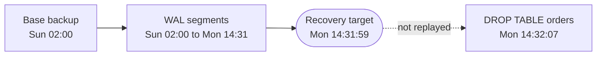
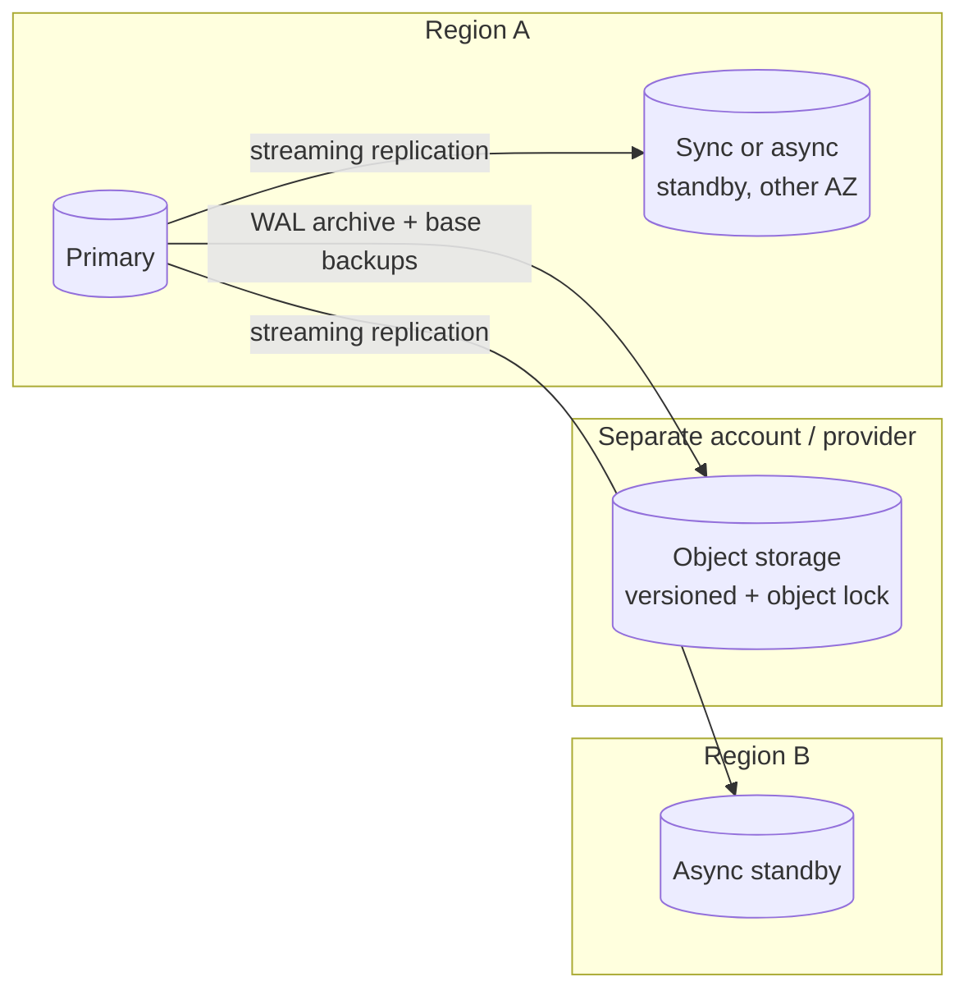
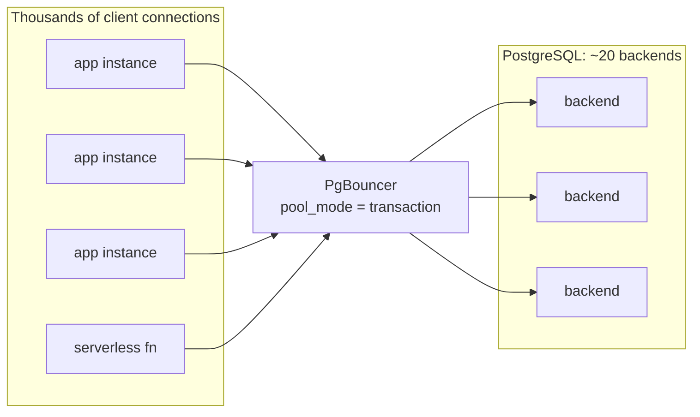
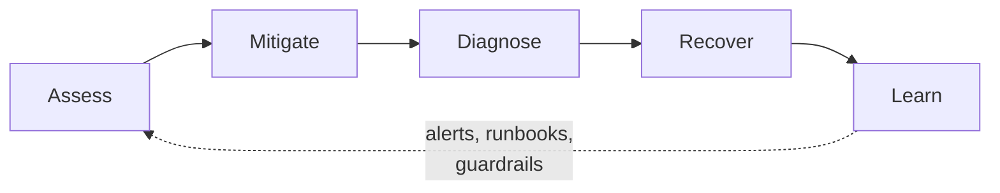

<p><a href="./">&larr; Database Design</a></p>

# Operations & Monitoring

**Database operations** is the discipline of keeping a database recoverable, healthy, and fast after it has been designed and deployed: backups and restores, disaster recovery, routine maintenance, connection management, monitoring, capacity planning, upgrades, and incident response. The database is usually the one component of a system that cannot be rebuilt from source — the data is the value — so these practices matter more for it than for any stateless service.

This page is the operational companion to [Storage Engines & Recovery](storage-internals.html), which explains how the write-ahead log (WAL), buffer pool, and checkpoints work. Examples use PostgreSQL (current major version 18; version-specific features are marked), but the principles — RPO and RTO, log shipping, saturation metrics, pool sizing — apply equally to MySQL, SQL Server, and managed cloud services.

Three principles run through everything below:

- **Recoverability.** A backup that has never been restored is a hypothesis, not a backup.
- **Maintenance.** MVCC creates garbage continuously; autovacuum is what keeps tables from bloating and transaction IDs from wrapping around.
- **Observability.** Instrument before optimizing: the statistics views show where time goes.

## Backup and Restore

### RPO and RTO

Two business requirements frame every backup decision:

- **Recovery point objective (RPO)** — how much data, measured in time, may be lost.
- **Recovery time objective (RTO)** — how long the service may be down while recovering.

$$
\text{RPO} = t_{\text{failure}} - t_{\text{last recoverable state}},
\qquad
\text{RTO} = t_{\text{service restored}} - t_{\text{failure}}
$$

Design the strategy backwards from the RPO and RTO the business actually requires. Typical options:

| Strategy | Typical RPO | Typical RTO | Protects against |
|---|---|---|---|
| Nightly logical dump | Up to 24 h | Hours (reload + index builds) | Loss of the whole server; single-table mistakes |
| Base backup + continuous WAL archiving (PITR) | Seconds to minutes | Restore time + WAL replay | Hardware loss *and* human error (bad `DELETE`, bad migration) |
| Asynchronous streaming replica | Seconds (replication lag) | Seconds to minutes (promotion) | Server or zone failure — **not** human error, which replicates instantly |
| Synchronous replica | Zero for committed transactions | Seconds to minutes | Server or zone failure, with a commit-latency cost |

Replication is not a backup: a `DROP TABLE` reaches every replica within milliseconds. A credible design combines a replica (for RTO) with PITR-capable backups (for RPO against mistakes).

### Logical vs. physical backups

| Aspect | Logical (`pg_dump`) | Physical (`pg_basebackup`, pgBackRest, ...) |
|---|---|---|
| Content | SQL / `COPY` data plus DDL | Copy of the cluster's data files |
| Granularity | Table, schema, or database | Whole cluster |
| Portability | Across major versions and architectures | Same major version and platform |
| Restore speed | Slow: reloads rows, rebuilds indexes | Fast: copy files, replay WAL |
| Point-in-time recovery | No | Yes, with WAL archiving |
| Best for | Small databases, migrations, extracting one table | Production disaster recovery and PITR |

```bash
# Logical: use the custom (-Fc) or directory (-Fd) format so restores can be
# selective and parallel. Directory format also allows parallel dumps (-j).
pg_dump -Fd -j 4 -d mydb -f /backups/mydb.dir
pg_restore -d mydb_new -j 4 /backups/mydb.dir
pg_restore -d mydb_new -t orders /backups/mydb.dir     # one table only

# Physical: a consistent copy of the whole cluster, with the WAL needed to
# make it consistent (-X stream) and a backup manifest for verification.
pg_basebackup -D /backups/base_full -X stream -c fast -P
pg_verifybackup /backups/base_full
```

**Incremental backups (PostgreSQL 17+).** With `summarize_wal = on`, the server tracks which blocks changed, and `pg_basebackup --incremental` copies only those relative to an earlier backup's manifest. An incremental backup is not restorable by itself; `pg_combinebackup` reconstructs a full data directory from the chain:

```bash
pg_basebackup -D /backups/incr_mon -X stream \
    --incremental=/backups/base_full/backup_manifest
pg_combinebackup /backups/base_full /backups/incr_mon -o /restore/pgdata
```

For production, most teams use a dedicated backup tool rather than scripting these primitives. **pgBackRest**, **Barman**, and **WAL-G** handle parallel and incremental backups, compression, encryption, object-storage targets, retention, WAL archiving, and verified restores. Managed services (Amazon RDS/Aurora, Cloud SQL, Azure Database for PostgreSQL) provide automated backups with PITR inside a retention window; check that window against your RPO, and remember that snapshots in the same account share its blast radius.

**Test restores.** Most "we had backups" outages are really "we had backup files that turned out to be empty, truncated, or unrestorable." Automate a periodic restore into a scratch instance, run `pg_verifybackup` or the tool's verify command, and run a smoke test (row counts, checksums on critical tables, a representative query). The measured duration is your real RTO.

### Point-in-time recovery (PITR)

A base backup alone restores the cluster to the moment the backup finished. **Point-in-time recovery** restores a base backup and then replays archived WAL forward to a chosen target — typically the instant before a destructive statement or a bad deployment.



The mechanism is the same WAL replay used for [crash recovery](storage-internals.html#write-ahead-logging-surviving-crashes), stopped early at a time, LSN, transaction ID, or named restore point.

```ini
# postgresql.conf on the primary - continuous archiving
wal_level = replica
archive_mode = on
# Prefer a backup tool's archive command, e.g.:
archive_command = 'pgbackrest --stanza=main archive-push %p'
# The documentation's "test ! -f dest && cp %p dest" example is for
# illustration: plain cp does not fsync, so a crash can lose archived WAL.
```

```ini
# postgresql.conf (or postgresql.auto.conf) on the recovery instance
restore_command = 'pgbackrest --stanza=main archive-get %f "%p"'
recovery_target_time = '2026-09-21 14:31:59+00'
recovery_target_action = 'promote'    # default is 'pause', to inspect first
```

```bash
# Restore the base backup into the data directory, then request
# archive recovery by creating recovery.signal (PostgreSQL 12+).
touch "$PGDATA/recovery.signal"
pg_ctl -D "$PGDATA" start
```

Targets can be `recovery_target_time`, `recovery_target_lsn`, `recovery_target_xid`, or `recovery_target_name`. Creating a named restore point before risky work gives a labeled rollback line:

```sql
SELECT pg_create_restore_point('before-orders-migration');
```

Recovering to a point in time creates a new **timeline**; the old history remains in the archive, so a second attempt with a different target is possible if the first was wrong. Restore into a separate instance when the goal is to recover a few rows, and copy them back, rather than rewinding the whole production cluster.

### Disaster recovery

Backups protect against data loss; **disaster recovery (DR)** protects against losing a whole site, account, or region — including to ransomware or a compromised administrator.



1. **Geographic redundancy.** A standby in another availability zone covers hardware and zone failures; one in another region covers regional outages. Promotion and failover mechanics are covered in [Replication & Consensus](replication-and-consensus.html).
2. **Immutable, isolated copies.** Backups in the same cloud account as the database can be deleted by the same stolen credentials. Write them to object storage with versioning and object lock (WORM retention) in a separate account.
3. **The 3-2-1 rule.** Three copies of the data, on two different kinds of storage, one of them offsite. Many teams extend it to 3-2-1-1-0: one copy immutable or offline, and zero errors in verified restores.

Exercise the plan with regular **failover drills**: promote the standby, point a copy of the application at it, verify, and record how long it took and what broke.

## Maintenance: VACUUM, ANALYZE, and Autovacuum

PostgreSQL's MVCC (see [Transactions & Concurrency](transactions-and-concurrency.html)) never overwrites a row in place. An `UPDATE` writes a new row version and marks the old one dead; a `DELETE` only marks the row dead. Dead versions must remain until no running transaction can still see them.

| Step | Heap page contents | Visible to new transactions |
|---|---|---|
| Before `UPDATE accounts SET balance = 90 WHERE id = 7` | `(id=7, balance=100)` | `balance=100` |
| After the update commits | `(id=7, balance=100)` dead, `(id=7, balance=90)` live | `balance=90` |
| After VACUUM | `(id=7, balance=90)` live, freed slot reusable | `balance=90` |

Once no snapshot needs them (they are older than the **xmin horizon**, the oldest transaction any session or replication slot still depends on), dead tuples are **bloat**: they waste space, slow sequential scans, and inflate indexes.

### What VACUUM and ANALYZE do

```sql
VACUUM (VERBOSE) orders;   -- reclaim dead tuples for reuse; update the visibility map
ANALYZE orders;            -- refresh planner statistics (row counts, distributions)
VACUUM (ANALYZE) orders;   -- both

-- VACUUM FULL rewrites the table compactly and returns space to the OS,
-- but holds an ACCESS EXCLUSIVE lock for the duration (no reads or writes).
-- On busy tables use pg_repack or pg_squeeze for an online rewrite instead.
VACUUM FULL orders;
```

Ordinary `VACUUM` does not shrink files (except for empty pages at the end), but freed space is reused by later inserts and updates. Stale statistics are a leading cause of sudden plan changes, so `ANALYZE` matters as much as the space reclamation. After a major-version upgrade, run `vacuumdb --all --analyze-in-stages` unless the upgrade carried statistics over (PostgreSQL 18's `pg_upgrade` does, except for extended statistics).

### Freezing and transaction-ID wraparound

PostgreSQL transaction IDs are 32-bit and compared modulo $2^{32}$, so each transaction can only distinguish about two billion older IDs from newer ones. VACUUM **freezes** old rows — marks them as visible to everyone — so they remain valid as the counter wraps. If freezing falls far enough behind, PostgreSQL first runs an emergency "failsafe" vacuum (`vacuum_failsafe_age`, default 1.6 billion) and, as a last resort, stops assigning new transaction IDs, which takes the database effectively read-only until a manual VACUUM completes. This is entirely preventable with monitoring:

```sql
-- Databases and tables closest to wraparound (alert well before ~1 billion)
SELECT datname, age(datfrozenxid) AS xid_age
FROM pg_database ORDER BY xid_age DESC;

SELECT c.oid::regclass AS table, age(c.relfrozenxid) AS xid_age
FROM pg_class c
WHERE c.relkind IN ('r', 'm', 't')
ORDER BY xid_age DESC
LIMIT 10;
```

PostgreSQL 18 adds **eager freezing**: regular vacuums opportunistically freeze all-visible pages (tuned by `vacuum_max_eager_freeze_failure_rate`), spreading out the work that previously arrived as a large anti-wraparound vacuum on big, insert-mostly tables.

### Autovacuum

The **autovacuum** launcher starts workers that vacuum and analyze each table when enough of it has changed. For dead tuples, a table qualifies when

$$
n_{\text{dead}} > \min\left(\theta_{\text{base}} + s \cdot n_{\text{tuples}},\ \theta_{\max}\right)
$$

where $\theta_{\text{base}}$ is `autovacuum_vacuum_threshold` (default 50), $s$ is `autovacuum_vacuum_scale_factor` (default 0.2), and $\theta_{\max}$ is `autovacuum_vacuum_max_threshold` (PostgreSQL 18+, default 100 million). Inserts have a parallel trigger (`autovacuum_vacuum_insert_threshold` and `..._insert_scale_factor`, PostgreSQL 13+) so append-only tables still get vacuumed and frozen.

A 20% scale factor suits small tables and is far too lazy for large, hot ones: before PostgreSQL 18, a billion-row table accumulated 200 million dead tuples before autovacuum started. Tune large tables individually:

```sql
-- Vacuum after ~1% churn and analyze after ~0.5% on a large, hot table
ALTER TABLE orders SET (
    autovacuum_vacuum_scale_factor  = 0.01,
    autovacuum_analyze_scale_factor = 0.005
);

-- Tables with the most dead tuples, and when they were last vacuumed
SELECT relname,
       n_live_tup,
       n_dead_tup,
       round(100.0 * n_dead_tup / nullif(n_live_tup + n_dead_tup, 0), 1) AS dead_pct,
       last_autovacuum,
       autovacuum_count
FROM pg_stat_user_tables
ORDER BY n_dead_tup DESC
LIMIT 20;

-- What autovacuum is doing right now
SELECT p.pid, p.relid::regclass AS table, p.phase,
       p.heap_blks_scanned, p.heap_blks_total
FROM pg_stat_progress_vacuum p;
```

When autovacuum cannot keep up, check in this order:

1. **Something is pinning the xmin horizon**, so VACUUM runs but cannot remove anything: a long-running or `idle in transaction` session (`pg_stat_activity.backend_xmin`), an inactive replication slot (`pg_replication_slots`), a forgotten prepared transaction (`pg_prepared_xacts`), or a standby with `hot_standby_feedback = on` running long queries. PostgreSQL 18's `idle_replication_slot_timeout` can invalidate abandoned slots automatically.
2. **Too few workers.** `autovacuum_max_workers` defaults to 3; in PostgreSQL 18 it can be raised at runtime up to `autovacuum_worker_slots`.
3. **Too much throttling.** Cost-based delay (`autovacuum_vacuum_cost_delay`, default 2 ms, and `autovacuum_vacuum_cost_limit`) limits I/O; on fast SSDs the limit can usually be raised substantially.
4. **Memory.** `maintenance_work_mem` / `autovacuum_work_mem` bound how many dead tuple IDs one pass can track. PostgreSQL 17's new dead-tuple storage uses far less memory and removed the previous 1 GB cap, so each pass does more work.

## Connection Pooling

Each PostgreSQL connection is a separate server process with its own memory. A few hundred connections are fine; thousands, most of them idle, waste memory, raise contention on shared structures, and slow snapshot acquisition. Web applications, autoscaled services, and serverless functions routinely try to open that many. A **connection pooler** multiplexes many client connections onto a small, stable set of server connections.



**PgBouncer** is the standard lightweight pooler (current release line 1.25). Its central setting is the pool mode:

| Mode | Server connection returns to the pool | Notes |
|---|---|---|
| `session` | When the client disconnects | Full compatibility; little multiplexing |
| `transaction` | At the end of each transaction | The usual choice for web and service workloads |
| `statement` | After each statement | Multi-statement transactions are forbidden |

```ini
; pgbouncer.ini
[databases]
mydb = host=10.0.0.5 port=5432 dbname=mydb

[pgbouncer]
listen_port = 6432
pool_mode = transaction
max_client_conn = 5000          ; client connections accepted
default_pool_size = 20          ; server connections per (user, database)
reserve_pool_size = 5           ; extra connections when clients wait too long
max_prepared_statements = 200   ; protocol-level prepared statements in transaction mode (1.21+)
server_idle_timeout = 600
```

In transaction mode a client may get a different backend for each transaction, so **session-scoped state does not carry over**: session-level `SET`, `LISTEN`, session advisory locks, temporary tables, and `WITH HOLD` cursors. Use `SET LOCAL` inside the transaction, or route those clients through a session-mode pool. Protocol-level prepared statements — what most drivers use — work in transaction mode since PgBouncer 1.21 when `max_prepared_statements` is non-zero; SQL-level `PREPARE` still does not.

Alternatives include **PgCat** and **Odyssey** (multi-threaded poolers with load balancing and sharding features), **Supavisor**, and managed proxies such as **Amazon RDS Proxy**. Applications also keep a client-side pool; with PgBouncer in front it should be small.

### Sizing the pool

More connections do not mean more throughput. Once CPUs and storage are saturated, extra concurrent queries add context switching and lock contention, and latency rises for everyone. A widely used starting point for the number of *active* server connections, from the PostgreSQL community via the HikariCP project, is:

$$
\text{connections} \approx 2 \times n_{\text{cores}} + n_{\text{effective spindles}}
$$

On an 8-core server with SSD storage that suggests roughly 16–20 active connections — far fewer than most people guess. The spindle term is loosely defined for SSDs, so treat the formula as a starting point: load-test, watch latency percentiles and wait events, and adjust. The total across all pools and application instances must stay below `max_connections` minus superuser and replication reserves.

```python
# Application-side pool (SQLAlchemy 2.x + psycopg 3) pointed at PgBouncer
from sqlalchemy import create_engine

engine = create_engine(
    "postgresql+psycopg://app@pgbouncer:6432/mydb",
    pool_size=5,          # steady-state connections per process
    max_overflow=5,       # temporary extra under bursts
    pool_timeout=5,       # fail fast instead of queueing forever
    pool_pre_ping=True,   # detect dead connections before use
    pool_recycle=1800,    # replace connections periodically
)
```

## Monitoring

PostgreSQL exposes its internal counters through the cumulative statistics system — the `pg_stat_*` and `pg_statio_*` views — which dashboards (Prometheus `postgres_exporter`, Datadog, Grafana, CloudWatch Database Insights) ultimately scrape. Knowing the raw views lets you investigate when a dashboard lacks the panel you need.

Two frameworks help decide what to watch: the **USE method** (for each resource: utilization, saturation, errors) and the **golden signals** (latency, traffic, errors, saturation). For a database, "resources" include CPU, memory, disk I/O, WAL volume, connection slots, locks, and the xmin horizon.

### Live activity: `pg_stat_activity`

```sql
-- What is every non-idle backend doing? The first query in any incident.
SELECT pid, usename, application_name, state,
       wait_event_type, wait_event,
       now() - xact_start  AS xact_age,
       now() - query_start AS query_age,
       left(query, 80)     AS query
FROM pg_stat_activity
WHERE state <> 'idle' AND backend_type = 'client backend'
ORDER BY xact_age DESC NULLS LAST;

-- Who is blocking whom
SELECT blocked.pid        AS blocked_pid,
       left(blocked.query, 60)  AS blocked_query,
       blocking.pid       AS blocking_pid,
       left(blocking.query, 60) AS blocking_query,
       blocking.state     AS blocking_state
FROM pg_stat_activity blocked
JOIN pg_stat_activity blocking
  ON blocking.pid = ANY (pg_blocking_pids(blocked.pid));
```

`wait_event_type` and `wait_event` say what a backend is waiting for (`Lock`, `LWLock`, `IO`, `Client`, ...); PostgreSQL 17 added the `pg_wait_events` view describing each event. Sampling these columns every second or so gives a poor man's "active session history" that shows where time goes during an incident.

### Query hotspots: `pg_stat_statements`

The most valuable extension for performance work. It aggregates statistics per normalized query (constants replaced by placeholders). It must be loaded at server start:

```ini
shared_preload_libraries = 'pg_stat_statements,auto_explain'
compute_query_id = on
track_io_timing = on
```

```sql
CREATE EXTENSION IF NOT EXISTS pg_stat_statements;

SELECT calls,
       round(total_exec_time::numeric)    AS total_ms,
       round(mean_exec_time::numeric, 2)  AS mean_ms,
       rows,
       round(100.0 * shared_blks_hit
             / nullif(shared_blks_hit + shared_blks_read, 0), 1) AS hit_pct,
       left(query, 80) AS query
FROM pg_stat_statements
ORDER BY total_exec_time DESC
LIMIT 15;
```

Rank by **total** time, not mean. A 5 ms query called a million times an hour costs the server far more than a 2-second report run once a day. Fix the top of the list, reset (`pg_stat_statements_reset()`), and re-measure.

### Tables, indexes, and I/O

```sql
-- Large tables read mostly by sequential scan may be missing an index
SELECT relname, seq_scan, seq_tup_read, idx_scan, n_live_tup
FROM pg_stat_user_tables
WHERE n_live_tup > 100000
ORDER BY seq_tup_read DESC
LIMIT 20;

-- Unused indexes: pure write and storage overhead.
-- Check replicas too - an index unused on the primary may serve replica reads.
SELECT s.relname AS table, s.indexrelname AS index, s.idx_scan,
       pg_size_pretty(pg_relation_size(s.indexrelid)) AS size
FROM pg_stat_user_indexes s
JOIN pg_index i USING (indexrelid)
WHERE s.idx_scan = 0 AND NOT i.indisunique
ORDER BY pg_relation_size(s.indexrelid) DESC;

-- Cluster-wide I/O by backend type and context (PostgreSQL 16+;
-- byte columns and WAL rows added in 18)
SELECT backend_type, object, context, reads, writes, extends, fsyncs
FROM pg_stat_io
WHERE reads > 0 OR writes > 0
ORDER BY writes DESC;
```

A buffer-cache hit ratio (`blks_hit / (blks_hit + blks_read)` in `pg_stat_database`) is worth trending, but it is a weak alert: a "read" may still be served from the operating system's page cache, and a healthy analytical workload can legitimately have a low ratio. Alert on latency and saturation; use the ratio to explain them.

### The slow-query log and `auto_explain`

Aggregates show *which* queries are expensive on average; the log captures individual slow executions with their parameters, which you need to reproduce and `EXPLAIN` them.

```sql
ALTER SYSTEM SET log_min_duration_statement = '500ms';
ALTER SYSTEM SET log_lock_waits = on;                   -- waits longer than deadlock_timeout
ALTER SYSTEM SET log_autovacuum_min_duration = '10s';
ALTER SYSTEM SET auto_explain.log_min_duration = '1s';  -- requires auto_explain loaded
ALTER SYSTEM SET auto_explain.log_analyze = on;         -- actual rows/timing (adds overhead)
SELECT pg_reload_conf();
```

To investigate one query, run `EXPLAIN (ANALYZE, BUFFERS)` — in PostgreSQL 18 `BUFFERS` is included automatically with `ANALYZE`. Red flags: sequential scans on large tables, sorts or hashes spilling to disk, row estimates off by orders of magnitude (stale statistics or correlated columns), and nested loops driving millions of inner iterations. Plan-reading is covered in [Indexing & Query Execution](indexing-and-queries.html).

### What to alert on

| Signal | Source | Why |
|---|---|---|
| Query latency (p95/p99) per workload | `pg_stat_statements` deltas, application metrics | The symptom users feel |
| Replication lag | `pg_stat_replication` (`replay_lag`), replica `pg_last_xact_replay_timestamp()` | Data loss on failover; stale reads |
| Connections vs. `max_connections` | `pg_stat_activity` | New logins refused at the limit |
| Oldest transaction / `backend_xmin` age | `pg_stat_activity` | Blocks VACUUM; causes bloat |
| Inactive replication slots, retained WAL | `pg_replication_slots` | Can fill the WAL volume |
| Transaction-ID age | `age(datfrozenxid)` | Wraparound protection stops writes |
| WAL archiving failures | `pg_stat_archiver` (`failed_count`, `last_failed_time`) | PITR silently stops working; WAL piles up |
| Disk free (data and WAL volumes) | OS / cloud metric | A full disk halts writes |
| Deadlocks, rollbacks, temp-file bytes | `pg_stat_database` | Contention bugs; `work_mem` too small |
| Checkpoint frequency | `pg_stat_checkpointer` (PostgreSQL 17+) | Requested (not timed) checkpoints mean `max_wal_size` is too small |

## Capacity Planning

Capacity planning forecasts when each resource — CPU, memory, storage, IOPS, connections, WAL throughput — will run out, so capacity is added before users notice.

1. **Baseline** current usage from the monitoring views and host metrics.
2. **Project growth** with a model that fits the data: linear for steady growth, exponential or seasonal where appropriate.
3. **Find the knee.** Latency rises long before a resource reaches 100%. In the simplest queueing model (M/M/1), mean response time is $R = S / (1 - U)$ for service time $S$ and utilization $U$: at 50% utilization requests take twice their service time, at 80% five times, at 90% ten times.
4. **Subtract a safety margin** and convert the remaining headroom into a date.

For a resource consumed at a steady rate:

$$
t_{\text{runway}} = \frac{C_{\text{threshold}} - C_{\text{now}}}{r_{\text{growth}}}
$$

```sql
SELECT pg_size_pretty(pg_database_size(current_database())) AS db_size;

-- Largest relations: where growth and bloat concentrate
SELECT relname,
       pg_size_pretty(pg_total_relation_size(relid)) AS total,
       pg_size_pretty(pg_relation_size(relid))       AS heap,
       pg_size_pretty(pg_indexes_size(relid))        AS indexes
FROM pg_statio_user_tables
ORDER BY pg_total_relation_size(relid) DESC
LIMIT 20;
```

**Worked example.** A 400 GB database grows 12 GB per week on a 1 TB volume, and the team wants to stay below 80% (about 820 GB):

$$
t_{\text{runway}} = \frac{820\ \text{GB} - 400\ \text{GB}}{12\ \text{GB/week}} = 35\ \text{weeks}
$$

About eight months of headroom. New indexes, retained WAL (from lagging replicas or slots), and bloat all steepen the slope, so re-run the projection when growth changes. Plan for whichever resource runs out first — a database can have ample disk and still be short of IOPS, memory for its working set, or connection slots.

## Upgrades

PostgreSQL releases a major version each year and supports each for five years; minor releases (security and bug fixes only) come quarterly and should be applied promptly. PostgreSQL 14 reaches end of life in November 2026.

| Method | Downtime | Notes |
|---|---|---|
| Minor upgrade (e.g. 18.5 to 18.6) | A restart | Binary replacement; read the release notes for occasional post-upgrade steps such as reindexing |
| `pg_upgrade --link` or `--swap` (18+) | Minutes, independent of data size | Rewrites the catalog only; take a backup first. Version 18 preserves planner statistics |
| Logical replication to a new cluster | Seconds at cutover | Replicate into the new version, verify, then switch traffic; sequences and DDL need separate handling |
| Dump and restore | Hours for large databases | Simplest; also changes platform or encoding |

Test the application against the new version first; planner changes occasionally alter important plans, which `pg_stat_statements` comparisons before and after will reveal.

## Incident Response

When a database incident hits — timeouts, broken replication, a nearly full disk — a calm, repeatable loop beats improvisation.



1. **Assess.** Is the database up and accepting connections? Check connection counts, the oldest transaction, lock waits, replication lag, and disk space.

   ```sql
   SELECT count(*) FILTER (WHERE state = 'active')              AS active,
          count(*) FILTER (WHERE state = 'idle in transaction') AS idle_in_txn,
          count(*) FILTER (WHERE wait_event_type = 'Lock')      AS waiting_on_locks,
          count(*)                                              AS total,
          max(now() - xact_start)                               AS oldest_txn
   FROM pg_stat_activity
   WHERE backend_type = 'client backend';
   ```

2. **Mitigate.** Apply reversible first aid: cancel a runaway query, terminate a session that holds locks or pins the xmin horizon, shed load at the pooler, or add disk.

   ```sql
   SELECT pg_cancel_backend(12345);     -- cancel the current query (gentle)
   SELECT pg_terminate_backend(12345);  -- end the session (rolls back its transaction)
   ```

   Never delete files from `pg_wal` by hand to free space; find what is retaining WAL (a failing `archive_command`, an inactive replication slot) and fix that instead.

3. **Diagnose** root cause once the system is stable, using `pg_stat_statements`, the logs, wait events, and `EXPLAIN`.
4. **Recover.** Fail over to a standby if the primary is lost; use PITR (into a separate instance where possible) if data was damaged.
5. **Learn.** Write a blameless postmortem whose output is concrete: a new alert, a changed setting, a runbook step, a guardrail.

Server-side timeouts are the most effective guardrails against repeat incidents. Set them per role or per application rather than globally:

```sql
ALTER ROLE app SET statement_timeout = '30s';
ALTER ROLE app SET idle_in_transaction_session_timeout = '60s';
ALTER ROLE app SET lock_timeout = '5s';           -- especially for migrations
ALTER ROLE app SET transaction_timeout = '5min';  -- PostgreSQL 17+
```

Most severe database incidents are made worse by a hurried second action: a `VACUUM FULL` that locks a critical table mid-outage, a restore over the only good copy, a failover to a lagging standby that discards committed transactions. State the intended change, confirm it is reversible, then act.

## See Also

- [Storage Engines & Recovery](storage-internals.html) — the WAL, buffer pool, and checkpoints these operations rest on
- [Indexing & Query Execution](indexing-and-queries.html) — reading `EXPLAIN` to fix the queries surfaced here
- [Transactions & Concurrency](transactions-and-concurrency.html) — why MVCC produces the dead tuples VACUUM reclaims
- [Replication & Consensus](replication-and-consensus.html) — streaming replication, failover, and quorums
- [Schema Evolution & Migrations](schema-evolution-and-migrations.html) — running DDL safely on a live database
- [Database Design hub](./)
