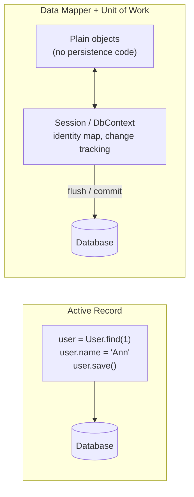
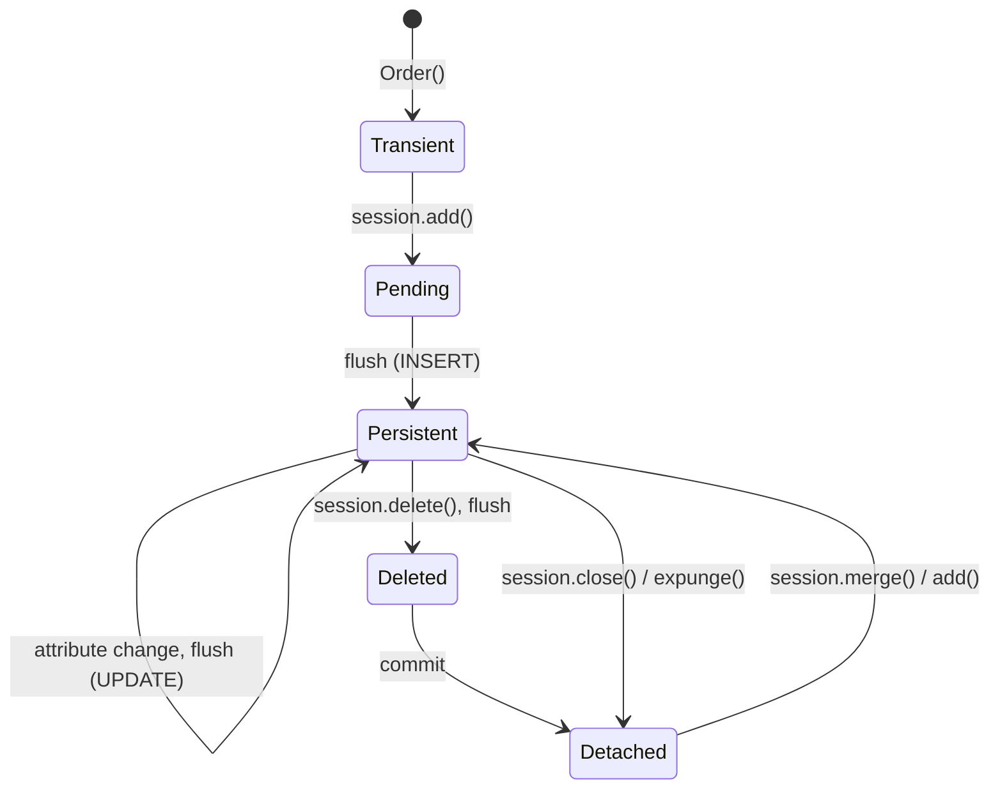
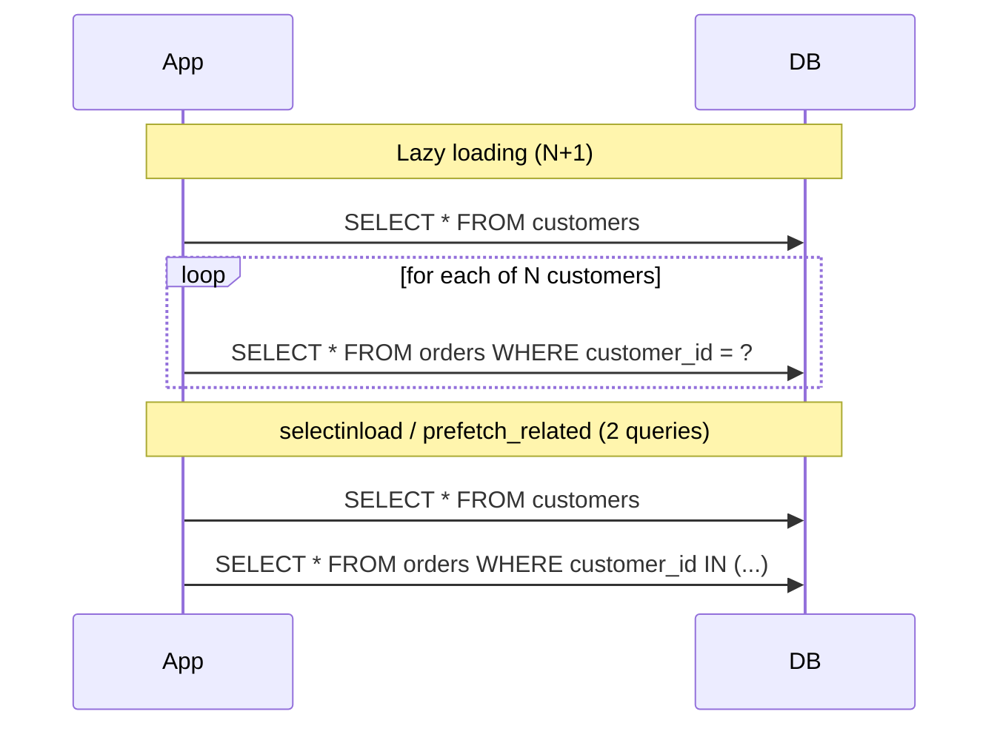
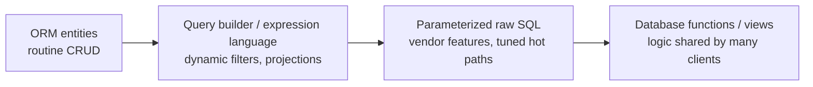

<p><a href="./">&larr; Database Design</a></p>

# ORMs & Data-Access Patterns

An **object-relational mapper (ORM)** translates between an application's object model — a `Customer` holding a list of `Order`s — and a relational schema of flat tables joined by keys. It maps classes to tables and rows to objects, generates SQL from method calls or a query API, and tracks changes to loaded objects so it can write them back. This page covers the structural mismatch ORMs bridge, the two main ORM architectures, loading strategies and the N+1 problem, transactions and concurrency control through an ORM, and when to bypass the ORM for SQL. Python examples use SQLAlchemy 2.x-style APIs and Django; JavaScript/TypeScript examples use Prisma, Drizzle, and Sequelize.

## What an ORM Provides

```python
# Without an ORM: SQL strings and hand-written hydration
rows = conn.execute(
    "SELECT id, name, email FROM customers WHERE country = %s", ("US",)
).fetchall()
customers = [Customer(id=r[0], name=r[1], email=r[2]) for r in rows]

# With an ORM (SQLAlchemy 2.x): describe the mapping once, query in the host language
customers = session.scalars(
    select(Customer).where(Customer.country == "US")
).all()
```

| Benefit | Cost |
|---|---|
| **Productivity** — CRUD, relationships, and pagination become method calls | The SQL actually executed is hidden, and can be far more than expected |
| **Parameter binding by default**, which closes the common [SQL-injection](../cybersecurity/application-and-cloud-security.html#sql-injection) routes | Raw-SQL escape hatches reintroduce the risk if misused |
| **Change tracking** — mutate objects, the ORM computes the writes | Tracked objects consume memory; long sessions go stale |
| **Portability** across PostgreSQL, MySQL, SQLite, SQL Server | Lowest-common-denominator features unless you opt into dialect extensions |
| **Typed models** that integrate with IDEs and type checkers | A second schema definition that must stay in sync with the database ([migrations](schema-evolution-and-migrations.html)) |

The rest of this page is about getting the benefits without paying the hidden costs.

## The Object-Relational Impedance Mismatch

The object and relational models were designed under different assumptions. Each gap requires an explicit mapping decision:

| Object world | Relational world | Consequence |
|---|---|---|
| Object identity (`a is b`) | Primary-key equality | Two queries could return two objects for one row; an **identity map** (one object per key per session) prevents it |
| References | Foreign keys + joins | Following `order.customer` may silently execute a query |
| Collections (`list`, `set`) | Rows in a child table | Loading is a separate `SELECT` or a join; mutation becomes inserts and deletes |
| Inheritance, polymorphism | No subtyping | Must be emulated (below) |
| Encapsulation | Public columns | The schema exposes structure the class hides |
| Object graphs of any shape | Normalized tables | Saving one aggregate may touch many tables in one transaction |
| Behavior | Data only | Rules enforced in methods are invisible to other clients; enforce invariants with constraints too |

### Mapping inheritance

Suppose `Employee` has subtypes `Manager` and `Engineer`. There are three standard mappings, supported in some form by SQLAlchemy, Hibernate/JPA, Entity Framework Core, and Django (via abstract base classes and multi-table inheritance):

| Strategy | Tables | Reads | Trade-off |
|---|---|---|---|
| **Single-table** (STI) | One table, all columns, a discriminator | No joins | Subtype columns must be nullable, so `NOT NULL` cannot be enforced per subtype |
| **Joined-table** (class-table) | Base table + one per subtype, sharing the key | Join per subtype read | Normalized and constrainable; polymorphic queries join several tables |
| **Concrete-table** | One independent table per concrete class | "All employees" needs a `UNION` | No shared key space; foreign keys to "any employee" are impossible |

```python
# SQLAlchemy 2.x single-table inheritance
from sqlalchemy import ForeignKey, String
from sqlalchemy.orm import DeclarativeBase, Mapped, mapped_column

class Base(DeclarativeBase):
    pass

class Employee(Base):
    __tablename__ = "employees"
    id:   Mapped[int] = mapped_column(primary_key=True)
    type: Mapped[str] = mapped_column(String(20))          # discriminator
    name: Mapped[str] = mapped_column(String(100))
    __mapper_args__ = {"polymorphic_on": "type", "polymorphic_identity": "employee"}

class Manager(Employee):
    # Nullable in the shared table, since engineers have no value here
    reports_to: Mapped[int | None] = mapped_column(ForeignKey("employees.id"))
    __mapper_args__ = {"polymorphic_identity": "manager"}
```

Single-table is usually the default when subtypes differ by a few columns; joined-table suits subtypes with many distinct, required attributes. The underlying trade-off is the normalization-versus-join-cost tension from [Data Modeling & Normalization](modeling.html).

## ORM Architectures

Martin Fowler's *Patterns of Enterprise Application Architecture* (2002) named the two dominant designs:



- **Active Record** — each model instance wraps a row and persists itself (`user.save()`). Simple and discoverable, but couples domain objects to the database, and each save is typically its own write.
- **Data Mapper** — a separate session, entity manager, or context loads plain objects, tracks changes to them, and writes them back as a **unit of work**. More concepts, but a cleaner domain model and batched, correctly ordered writes.
- **Query-builder-first** tools sit alongside these: they expose a typed, composable SQL API and return plain data, with little or no change tracking.

| Tool | Language | Style | Notable traits |
|---|---|---|---|
| **SQLAlchemy** | Python | Data Mapper (ORM) over a SQL expression layer (Core) | Unified `select()` API in 2.x; full SQL expressiveness; asyncio support |
| **Django ORM** | Python | Active Record | Integrated migrations and admin; lazy `QuerySet`s; composite primary keys since 5.2 |
| **Hibernate / Jakarta Persistence (JPA)** | Java | Data Mapper | Persistence context, dirty checking, JPQL/HQL, second-level cache |
| **Entity Framework Core** | C# / .NET | Data Mapper (`DbContext` unit of work) | LINQ queries; change tracker; compiled models |
| **Prisma** | TypeScript | Schema-first generated client | Declarative schema file; fully typed client; relations loaded only on request. Prisma 7 (late 2025) replaced the Rust query engine with a TypeScript query compiler |
| **Drizzle** | TypeScript | Query builder + relational query API | Schema in TypeScript; SQL-shaped API; no runtime engine |
| **Sequelize** | JavaScript / TypeScript | Active Record | Long-established Node ORM; promise-based |

The same filter in several of them:

```python
# SQLAlchemy 2.x
session.scalars(select(Order).where(Order.total > 1000)).all()

# Django
Order.objects.filter(total__gt=1000)
```

```typescript
// Prisma
await prisma.order.findMany({ where: { total: { gt: 1000 } } });

// Drizzle
await db.select().from(orders).where(gt(orders.total, 1000));

// Sequelize
await Order.findAll({ where: { total: { [Op.gt]: 1000 } } });
```

All emit essentially `SELECT ... FROM orders WHERE total > $1`. They differ in what comes back (tracked entities, model instances, or plain objects) and in what happens when you touch a relationship on the result.

## Sessions and the Unit of Work

In a Data Mapper ORM the **session** (SQLAlchemy `Session`, JPA `EntityManager`, EF Core `DbContext`) is the unit of work. It holds an identity map of loaded objects, remembers their original state, and at **flush** time compares current to original state (**dirty checking**) and emits the minimal set of `INSERT`, `UPDATE`, and `DELETE` statements, ordered to satisfy foreign keys. **Commit** flushes and then commits the database transaction.

SQLAlchemy's object lifecycle makes this concrete:



```python
with Session(engine) as session:
    order = session.get(Order, 42)   # SELECT; object is now persistent
    order.status = "shipped"         # no SQL yet, just a tracked change
    session.commit()                 # flush: UPDATE orders SET status=... WHERE id=42; COMMIT
```

Practical rules:

- **Scope a session to one unit of work** — typically one web request or one job — and close it. Long-lived sessions accumulate objects, hold stale data, and keep transactions open.
- **Understand expiry.** By default SQLAlchemy expires objects on commit, so the next attribute access reloads them; Hibernate and EF Core keep tracked state until the context is cleared.
- **Detached objects cannot lazy-load.** Accessing an unloaded relationship after the session closes raises `DetachedInstanceError` (SQLAlchemy) or `LazyInitializationException` (Hibernate). Load what you need before closing.
- **Use read-only paths for read-only work.** Change tracking costs memory and CPU. EF Core's `AsNoTracking()`, Hibernate's read-only queries or `StatelessSession`, and selecting plain columns instead of entities all avoid it.

## Loading Strategies and the N+1 Problem

### The N+1 problem

The most common ORM performance bug appears when code loads N parent objects and then touches a lazily loaded relationship on each one inside a loop:

```python
customers = session.scalars(select(Customer)).all()   # 1 query
for c in customers:
    print(c.name, len(c.orders))    # each c.orders triggers its own SELECT: N queries
```

With 1,000 customers this issues 1,001 queries. Each is fast, but round trips dominate: at 1 ms each the loop spends a second waiting on the network. The code is correct and fast with ten rows of test data, which is why the problem usually surfaces only in production.



### Eager loading

**Eager loading** fetches related rows up front, so the number of queries no longer depends on N. There are three mechanisms:

| Strategy | SQL | Queries | Best for | Watch out for |
|---|---|---|---|---|
| **Join** (`joinedload`, `select_related`, EF `Include`) | `LEFT JOIN` in the parent query | 1 | Many-to-one and one-to-one | To-many joins repeat each parent once per child ("cartesian explosion"); two to-many joins multiply |
| **Select-IN** (`selectinload`, `prefetch_related`) | Second query with `WHERE fk IN (...)` | 1 per relationship | One-to-many and many-to-many | Very large key lists are batched automatically |
| **Subquery / lateral / JSON aggregation** | Correlated subquery or `LATERAL` join building nested JSON | 1 | Tree-shaped API responses | Engine-specific; used internally by Prisma and Drizzle on some databases |

```python
from sqlalchemy.orm import selectinload, joinedload

# Collections: select-IN loading, 2 queries total
customers = session.scalars(
    select(Customer).options(selectinload(Customer.orders))
).all()

# Many-to-one: join loading, 1 query
orders = session.scalars(
    select(Order).options(joinedload(Order.customer))
).all()
```

```python
# Django
from django.db.models import Prefetch

Customer.objects.prefetch_related("orders")        # to-many: 2 queries
Order.objects.select_related("customer")           # to-one: 1 JOIN
Customer.objects.prefetch_related(
    Prefetch("orders", queryset=Order.objects.filter(status="open"))
)                                                  # filtered prefetch
```

```typescript
// Prisma: relations are never lazy-loaded; ask for them explicitly
await prisma.customer.findMany({ include: { orders: true } });

// Drizzle relational queries
await db.query.customers.findMany({ with: { orders: true } });

// Sequelize: `separate: true` switches a to-many include from JOIN to a second query
await Customer.findAll({ include: [{ model: Order, separate: true }] });
```

Because Prisma and Drizzle only load relations you request, they cannot produce N+1 through attribute access — but a loop that issues its own query per item still can.

### Preventing and detecting N+1

The most reliable defense is to make accidental lazy loads fail loudly:

```python
# SQLAlchemy: raise instead of silently lazy-loading
from sqlalchemy.orm import relationship, raiseload, selectinload
class Customer(Base):
    __tablename__ = "customers"
    id: Mapped[int] = mapped_column(primary_key=True)
    orders: Mapped[list["Order"]] = relationship(lazy="raise")

# ...or per query: forbid any relationship not explicitly loaded
session.scalars(select(Customer).options(selectinload(Customer.orders), raiseload("*")))
```

Under SQLAlchemy's asyncio extension implicit lazy loading is not possible at all (it raises `MissingGreenlet`), which forces explicit eager loading in async code.

Detection tools:

- **Log the SQL** — `create_engine(url, echo=True)` in SQLAlchemy; Django's `connection.queries` with `DEBUG=True`, or django-debug-toolbar; Hibernate's statistics or `org.hibernate.SQL` logging; EF Core's `LogTo`.
- **Assert query counts in tests** — Django's `assertNumQueries`, or an SQLAlchemy event listener counting `before_cursor_execute` calls — so an N+1 regression fails CI.
- **Watch production** — APM tools and `pg_stat_statements` (see [Operations & Monitoring](operations-and-monitoring.html)) show one cheap query with an enormous call count, the N+1 signature.

## Transactions and Concurrency

A [transaction](transactions-and-concurrency.html) groups operations so they commit or roll back together. ORMs provide scoped transaction blocks that commit on success and roll back on an exception:

```python
# SQLAlchemy: session.begin() commits at block exit, rolls back on exception
with Session(engine) as session, session.begin():
    a = session.get(Account, 1)
    b = session.get(Account, 2)
    a.balance -= 100
    b.balance += 100

# Django
from django.db import transaction
from django.db.models import F

with transaction.atomic():
    Account.objects.filter(pk=1).update(balance=F("balance") - 100)
    Account.objects.filter(pk=2).update(balance=F("balance") + 100)
```

```typescript
// Prisma interactive transaction
await prisma.$transaction(async (tx) => {
  await tx.account.update({ where: { id: 1 }, data: { balance: { decrement: 100 } } });
  await tx.account.update({ where: { id: 2 }, data: { balance: { increment: 100 } } });
});
```

Note the Django version: `F("balance") - 100` is computed by the database (`SET balance = balance - 100`), so concurrent transfers cannot overwrite each other. Loading a value into Python, changing it, and saving it back is a **read-modify-write** race unless something prevents it — pessimistic or optimistic locking.

### Pessimistic locking

Lock rows when reading them, for short critical sections within one request:

```python
# SQLAlchemy: SELECT ... FOR UPDATE
acct = session.scalars(
    select(Account).where(Account.id == 1).with_for_update()
).one()
```

Django's equivalent is `select_for_update()`; JPA uses `LockModeType.PESSIMISTIC_WRITE`. For job queues, `with_for_update(skip_locked=True)` lets several workers claim different rows without blocking each other.

### Optimistic locking

Holding locks across user think-time does not scale. **Optimistic locking** adds a version column; every `UPDATE` includes the version the application read and increments it:

```sql
UPDATE orders
SET    status = 'shipped', version = version + 1
WHERE  id = 42 AND version = 7;   -- 7 = the version read earlier
```

If another transaction updated the row first, the `WHERE` matches zero rows and the ORM raises an error — `StaleDataError` in SQLAlchemy (`version_id_col`), `OptimisticLockException` in JPA (`@Version`), `DbUpdateConcurrencyException` in EF Core — which the application handles by reloading and retrying or reporting a conflict. Django has no built-in version column; use a conditional `filter(pk=..., version=v).update(...)` and check the returned row count.

Conflicts are rare when writes spread over many rows and frequent on hot rows. If $W$ writers each update one of $N$ equally likely rows at the same moment, the probability that a given writer collides with at least one other is

$$
P_{\text{conflict}} = 1 - \left(1 - \frac{1}{N}\right)^{W-1} \approx \frac{W-1}{N} \quad \text{for } W \ll N
$$

A high conflict rate is a signal to change the model (split the hot row, use a counter table, or apply database-side increments) rather than to add retries.

## When to Drop to SQL

ORMs handle routine work well and complex or bulk work poorly. Use SQL — through the ORM's expression language or parameterized raw queries — for:

1. **Bulk writes.** Updating 100,000 rows as objects means loading them all and issuing statements in batches; one set-based statement does it in a single round trip.

   ```python
   from sqlalchemy import update, insert

   # One UPDATE, no objects loaded
   session.execute(
       update(Product).where(Product.discontinued.is_(True)).values(active=False)
   )
   # Bulk INSERT from dictionaries (batched multi-row VALUES)
   session.execute(insert(Product), [{"sku": "A1", "price": 10}, {"sku": "A2", "price": 12}])
   ```

   Django's `QuerySet.update()`, `bulk_create()`, and `bulk_update()` serve the same purpose; note that they bypass `save()` and model signals.

2. **Analytical queries** — window functions, `GROUPING SETS`/`ROLLUP`, recursive CTEs — that map poorly onto objects.
3. **Vendor features** — `INSERT ... ON CONFLICT` upserts, `jsonb` operators, full-text search, `pgvector` similarity, `LATERAL` joins. Many are reachable through dialect-specific constructs (SQLAlchemy's `postgresql.insert(...).on_conflict_do_update()`) before resorting to raw strings.
4. **Hot paths** where profiling and `EXPLAIN ANALYZE` (see [Indexing & Query Execution](indexing-and-queries.html)) show the generated SQL is the problem.

Raw SQL must still bind parameters — never interpolate input into the string:

```python
from sqlalchemy import text

rows = session.execute(
    text("SELECT id, total FROM orders WHERE total > :min ORDER BY total DESC"),
    {"min": 1000},
).all()
```

```typescript
// Prisma: the tagged template binds ${} values as parameters.
const orders = await prisma.$queryRaw`SELECT * FROM "Order" WHERE total > ${minTotal}`;
// $queryRawUnsafe(string) does NOT - avoid it with any user input.
```

A healthy codebase uses a spectrum of abstraction levels, choosing the highest level that serves each query well:



Step down deliberately, with a profile or query plan justifying the move. For dynamic filtering, the query builder beats string concatenation on both safety and readability:

```python
stmt = select(Product)
if max_price is not None:
    stmt = stmt.where(Product.price <= max_price)
if category:
    stmt = stmt.where(Product.category == category)
stmt = stmt.order_by(Product.name).limit(50)
```

## Pitfalls

| Pitfall | Symptom | Fix |
|---|---|---|
| N+1 queries | Query count grows with result size | Eager-load; make lazy loads raise |
| Join-loading collections | Duplicated parent rows; huge result sets | Select-IN loading for to-many |
| Counting by loading | `len(query.all())` is slow and memory-hungry | `select(func.count())...`, `.count()` |
| Over-fetching | Every query reads every column, including large text/JSON | Project needed columns (`load_only`, `.only()`, `select: {...}`) |
| Row-by-row writes | Thousands of single-row `UPDATE`s | Set-based `update()` / bulk insert |
| Read-modify-write races | Lost updates under concurrency | Database-side expressions, `SELECT ... FOR UPDATE`, or version columns |
| Lazy load after session close | `DetachedInstanceError`, `LazyInitializationException` | Load before closing; shorter, request-scoped sessions |
| Long-lived sessions | Stale data, memory growth, open transactions blocking VACUUM | One session per unit of work |
| Model and schema drift | Runtime errors after deploys | Generate migrations from models and review them ([Schema Evolution](schema-evolution-and-migrations.html)) |
| Unbounded pagination with `OFFSET` | Deep pages get slower | Keyset (cursor) pagination on an indexed column |
| Fighting the ORM | Convoluted chains to express one query | Write that query in SQL |

## See Also

- [Data Modeling & Normalization](modeling.html) — the schema the ORM maps onto
- [Indexing & Query Execution](indexing-and-queries.html) — reading `EXPLAIN` for ORM-generated SQL
- [Transactions & Concurrency](transactions-and-concurrency.html) — isolation levels and locking behind `commit()`
- [Schema Evolution & Migrations](schema-evolution-and-migrations.html) — Alembic and other migration tools
- [Operations & Monitoring](operations-and-monitoring.html) — connection pooling and `pg_stat_statements`
- [Database Design hub](./)
