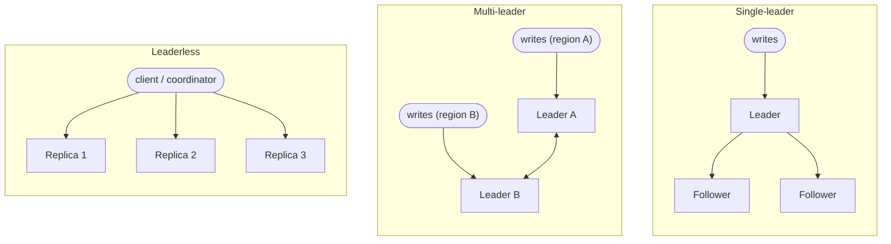
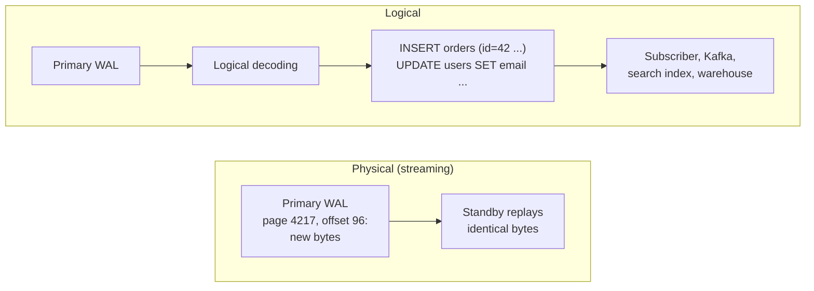
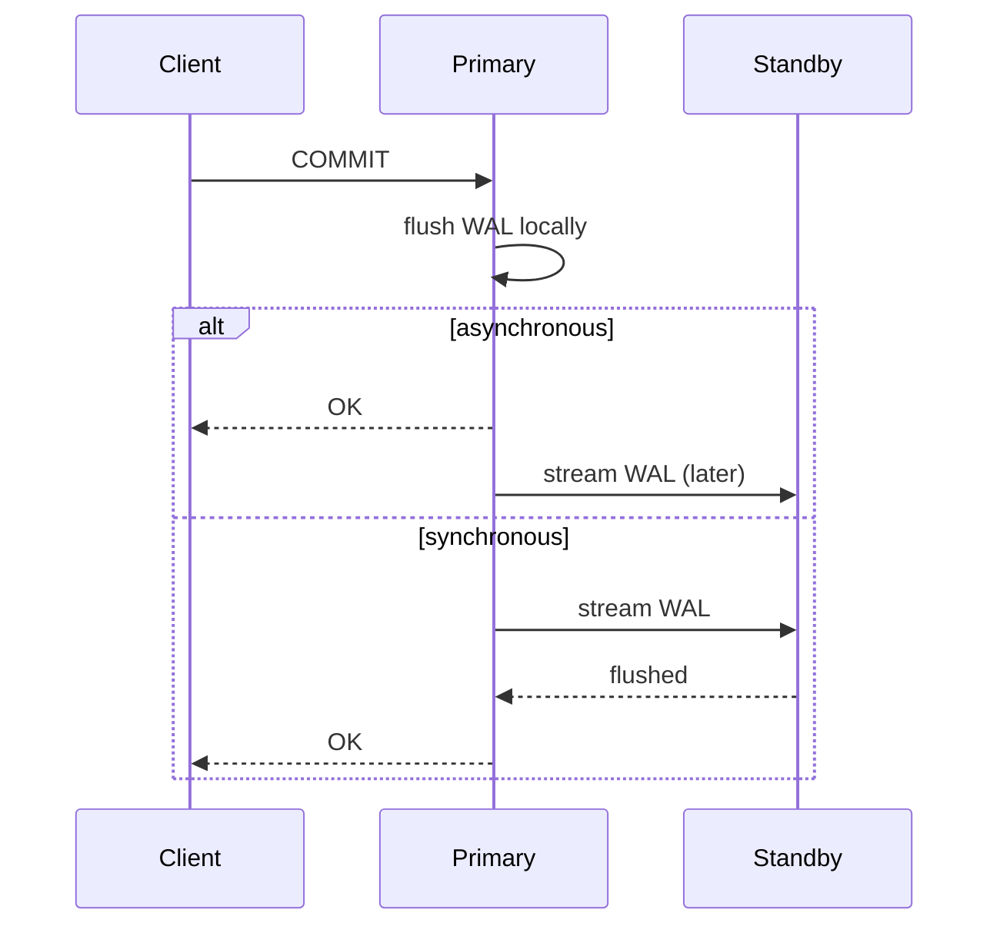
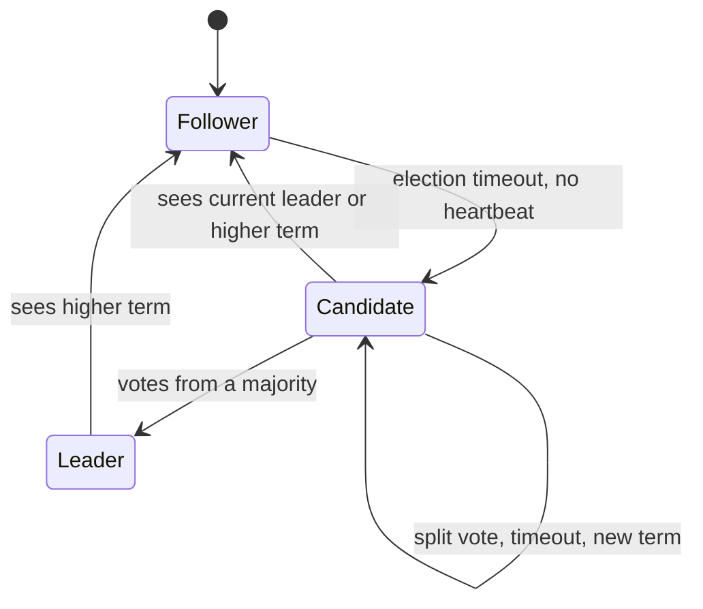
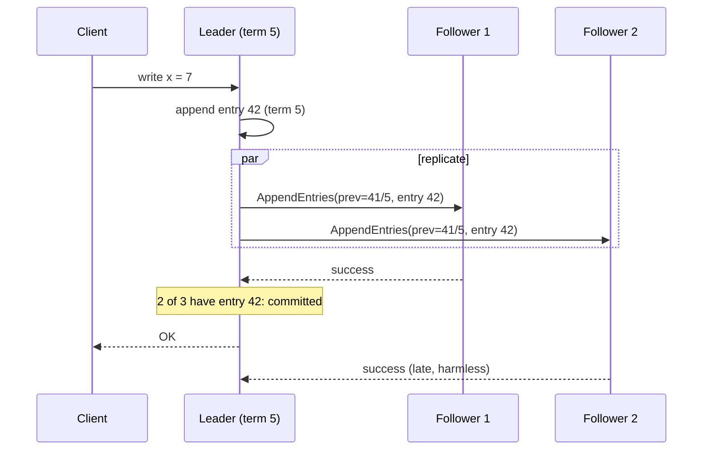
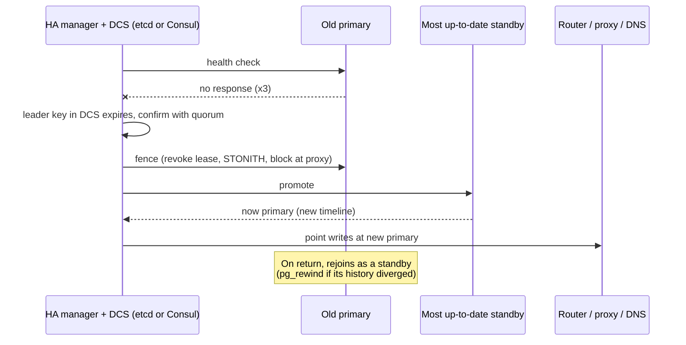
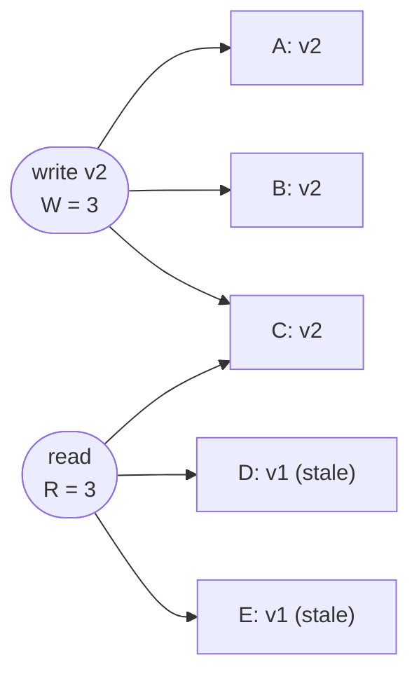

<p><a href="./">&larr; Database Design</a></p>

# Replication & Consensus

**Replication** keeps copies of the same data on several machines so that a database can survive failures, scale reads, serve users closer to where they are, and take backups without disturbing production. As soon as there is more than one copy, the system must decide what it means for the copies to agree and what to do when they cannot communicate. This page covers the mechanics of copying data (topologies, physical and logical replication, synchronous and asynchronous commit), the consequences for readers (replication lag), the **consensus** protocols that let a cluster agree on a leader and an ordered log despite crashes and partitions (Raft and Paxos), failover, leaderless quorum systems, and the log-shipping cloud architectures that blur the line between replication and storage.

For the theory underneath — consistency models, CAP/PACELC, and the FLP result — see [Consensus & Coordination](../../distributed-systems/consensus-and-coordination.html).

## Replication Topologies

A topology describes who accepts writes and who copies from whom. It determines whether write conflicts can happen, where write latency comes from, and how failover works.



| Topology | Writes accepted by | Write conflicts | Typical systems |
|---|---|---|---|
| **Single-leader** | One node | Impossible: the leader orders all writes | PostgreSQL, MySQL, SQL Server Always On, MongoDB replica sets, most managed databases |
| **Multi-leader** | Several nodes, usually one per region | Must be detected and resolved | MySQL Group Replication (multi-primary mode), EDB Postgres Distributed, pgactive, CouchDB |
| **Leaderless** | Any W of N replicas | Resolved by versions, last-write-wins, or read repair | Cassandra, ScyllaDB, Riak |
| **Consensus groups** | The Raft/Paxos leader of each shard | Impossible within a shard | CockroachDB, TiDB, YugabyteDB, Spanner, etcd |

**Single-leader** replication is the default because it is simple: one node decides the order of writes, so replicas never disagree about *what* happened, only about *how far* they have caught up. The leader is a write bottleneck and its failure requires a failover.

**Multi-leader** replication lets each region write locally and survive the loss of a region, at the price of **write conflicts** when two leaders modify the same row concurrently. Resolution strategies are last-write-wins (simple, silently discards data), conflict-free replicated data types (**CRDTs**, which merge deterministically), or application-level merge logic. Most teams avoid multi-leader unless geography or offline operation requires it; where possible, route each record's writes to a single "home" region to make conflicts rare.

**Leaderless** (Dynamo-style) systems have no leader: a client or coordinator writes to several replicas and reads from several, relying on overlapping quorums. See [Quorum Reads & Writes](#quorum-reads--writes).

**Consensus-replicated** systems are single-leader per shard, but use a consensus protocol so that leader election and commit are provably safe. Distributed SQL databases split data into many ranges, each its own consensus group, so leadership and write load are spread across the cluster.

## Streaming vs. Logical Replication

A single-leader system must describe its changes to followers. There are two fundamentally different formats.



### Physical (Streaming) Replication

The primary ships its **write-ahead log** — the same record of page-level changes it writes for crash recovery (see [Storage Engines & Recovery](storage-internals.html#write-ahead-logging-surviving-crashes)). The standby stays in permanent recovery mode, replaying WAL as it arrives, and its data files are byte-for-byte copies of the primary's.

- **Low overhead**: no parsing or re-planning, just log replay.
- **Exact copy**: a standby can be promoted to primary immediately, and can serve read-only queries (a *hot standby*).
- **All or nothing**: you replicate the entire cluster, not individual tables.
- **Version-locked**: primary and standby must run the same major version on the same platform, because WAL is an internal format.

This is PostgreSQL **streaming replication** (the `walsender`/`walreceiver` processes) and SQL Server log shipping and Always On availability groups. MySQL is different: its standard replication ships the **binary log**, a logical (row- or statement-based) record separate from InnoDB's redo log, so MySQL replicas are logical copies even when used as HA standbys.

A **replication slot** makes the primary retain WAL until a given standby or subscriber has consumed it, so a slow replica cannot fall irrecoverably behind. The flip side is that an abandoned slot retains WAL forever and can fill the primary's disk; cap it with `max_slot_wal_keep_size`, and on PostgreSQL 18 with `idle_replication_slot_timeout`.

```sql
-- On the primary: per-standby replication progress and lag
SELECT application_name, client_addr, state, sync_state,
       pg_wal_lsn_diff(pg_current_wal_lsn(), replay_lsn) AS replay_lag_bytes,
       write_lag, flush_lag, replay_lag
FROM pg_stat_replication;

-- Slots and how much WAL each is holding back
SELECT slot_name, slot_type, active,
       pg_size_pretty(pg_wal_lsn_diff(pg_current_wal_lsn(), restart_lsn)) AS retained
FROM pg_replication_slots;
```

### Logical Replication

With **logical decoding**, the primary turns WAL into a stream of row-level change events — "insert this row into `orders`", "update `users` row 7" — which subscribers apply as ordinary operations.

- **Selective**: replicate chosen tables (a *publication*), and optionally a row filter or column list.
- **Cross-version and cross-platform**: the subscriber only needs to understand rows, so PostgreSQL 16 can feed PostgreSQL 18, or the stream can feed Kafka, a search index, or a data warehouse.
- **Writable subscribers**: the subscriber is an independent database, which enables consolidation, fan-in, and bidirectional setups (PostgreSQL 16 added `origin = none` to prevent changes from looping).
- **Costs and gaps**: decoding and re-applying rows costs more than byte replay; DDL and sequence values are not replicated in PostgreSQL, so schema changes must be applied to both sides.

```sql
-- On the source
CREATE PUBLICATION orders_pub FOR TABLE orders, order_items;

-- On the destination (may be a newer major version)
CREATE SUBSCRIPTION orders_sub
  CONNECTION 'host=source dbname=shop user=repl'
  PUBLICATION orders_pub;
```

Recent PostgreSQL releases have closed many of the practical gaps: 16 allows logical decoding from a standby and parallel apply of large transactions; 17 adds **failover slots** (logical slots synchronized to standbys, so CDC consumers survive a primary failover) and `pg_createsubscriber`, which converts a physical standby into a logical subscriber without re-copying the data; 18 makes parallel streaming the default for new subscriptions and reports apply conflicts in `pg_stat_subscription_stats`.

Tailing the logical stream to publish every row change to other systems is **change data capture (CDC)**; Debezium is the most widely used open-source implementation. Its reliable counterpart for application events is the [outbox pattern](distributed-transactions.html#the-outbox-pattern).

| Use | Physical | Logical |
|---|---|---|
| HA standby, instantly promotable | Yes | Possible, but slower to set up and fail over |
| Read replica of the whole database | Yes | Yes |
| Replicate a subset of tables | No | Yes |
| Major-version upgrade with near-zero downtime | No | Yes |
| Feed Kafka, search, analytics (CDC) | No | Yes |
| Replicates DDL automatically | Yes | No (PostgreSQL) |

## Synchronous vs. Asynchronous Replication

When does the primary tell the client a commit succeeded?



| Mode | Primary waits for | Data lost if the primary dies | Write latency |
|---|---|---|---|
| **Asynchronous** | Nothing beyond its own disk | Anything not yet streamed | Lowest |
| **Synchronous (one or quorum)** | At least *k* standbys to confirm | None that was acknowledged | Plus a network round-trip to the *k*-th fastest standby |
| **Synchronous to all** | Every standby | None | Highest; one slow or dead standby stalls all writes |

Waiting for *every* replica is fragile, so production systems wait for a subset. In PostgreSQL, `synchronous_standby_names = 'ANY 1 (s1, s2, s3)'` waits for any one of three standbys, and `synchronous_commit` chooses how far along it must be: `remote_write` (received by the standby's OS), `on` (flushed to its disk), or `remote_apply` (replayed and visible to queries on the standby, giving read-your-writes on that standby). MySQL's semi-synchronous replication (`rpl_semi_sync_source_wait_for_replica_count`) plays the same role. In the cloud, placing synchronous standbys in another availability zone in the same region keeps the added latency to around a millisecond.

## Read Replicas & Replication Lag

The payoff of single-leader replication is read scaling: send writes to the primary and spread reads across replicas. The cost is **replication lag** — the delay between a commit on the primary and its visibility on a replica. It is usually milliseconds, but a write burst, a long-running query on the replica (which can pause replay), a large transaction, or a network problem can stretch it to minutes.

Lag produces anomalies that users notice:

| Anomaly | Scenario | Remedy |
|---|---|---|
| **Read-your-writes violation** | A user saves a profile change, the next page load reads a stale replica, and the change seems lost | Route that user's reads to the primary for a short window after a write, or wait until a replica has replayed past the write's LSN |
| **Monotonic reads violation** | Successive requests hit a fresh replica, then a stale one; data appears to go backwards in time | Pin a session to one replica (for example, hash the user ID) |
| **Consistent prefix violation** | A reader sees an answer before the question it replies to, because they were written to different shards | Keep causally related writes on the same shard, or track causal dependencies |

The general technique behind the first remedy is a **causal token**: after a write, return the primary's commit LSN (PostgreSQL `pg_current_wal_lsn()`, MySQL GTID set) to the client; a later read goes to any replica whose replayed position is at or beyond that token, and falls back to the primary otherwise. Some managed services and proxies implement this automatically. See [Client-Side Consistency](../../distributed-systems/client-side-consistency.html) for session guarantees in general.

```python
def run_read(query, session):
    """Serve a read from a replica that has caught up to the session's last write."""
    token = session.last_write_lsn                      # set after each write
    for replica in healthy_replicas():
        if token is None or replica.replayed_lsn() >= token:
            return replica.execute(query)
    return primary.execute(query)                       # nobody caught up yet
```

Measure lag rather than guess: `replay_lag` in `pg_stat_replication` on the primary, `now() - pg_last_xact_replay_timestamp()` on a PostgreSQL standby, and `Seconds_Behind_Source` from `SHOW REPLICA STATUS` in MySQL (8.0.22+ terminology; older versions use `SHOW SLAVE STATUS`). Alert on lag and remove badly lagging replicas from the read pool automatically.

## Consensus: Getting Distributed Nodes to Agree

Replication moves bytes; it does not decide **who the leader is** when machines crash and networks partition. Doing that safely is the job of a **consensus** protocol, which lets a group of nodes agree on a sequence of values even if a minority of them fail and messages are delayed, lost, or reordered.

Databases use consensus for two related jobs:

1. **Leader election** — choose exactly one leader, and make sure a deposed leader that is still running cannot keep committing writes (**split-brain**).
2. **State machine replication** — agree on the *order* of log entries, so every replica applies the same commands in the same order and ends in the same state.

Consensus protocols assume **crash failures** (nodes stop or restart, but do not lie). Tolerating malicious nodes requires Byzantine fault-tolerant protocols, which need $n \ge 3f + 1$ nodes and are used in blockchains rather than databases.

### Raft

Raft (Ongaro and Ousterhout, 2014) was designed to be understandable. It separates leader election, log replication, and safety, and makes every node a follower, a candidate, or a leader.



**Terms.** Time is divided into numbered **terms**, each beginning with an election. Every message carries the sender's term; a node that sees a higher term updates its own and reverts to follower, and messages with a stale term are rejected. Terms act as a logical clock that makes deposed leaders harmless: when a partitioned old leader reconnects, its messages carry an outdated term and are refused.

**Leader election.** A follower that hears no heartbeat within its **randomized election timeout** (for example 150–300 ms) increments its term, votes for itself, and sends `RequestVote` to every other node. A node grants at most one vote per term, and only if the candidate's log is **at least as up to date** as its own (compared by the term, then the index, of the last entry). A candidate with votes from a majority becomes leader. Randomized timeouts make split votes rare, and the up-to-date check guarantees that any elected leader already holds every committed entry.

**Log replication.** Clients send commands to the leader, which appends them to its log and sends `AppendEntries` to followers (the same message, empty, serves as the heartbeat). Each `AppendEntries` includes the index and term of the preceding entry; a follower whose log does not match rejects it, and the leader backs up until the logs agree, then overwrites the follower's divergent suffix. Once a majority has stored an entry, the leader marks it **committed**, applies it, and tells followers in subsequent messages.



A condensed sketch of the vote-granting rule, which is where most home-grown implementations go wrong:

```python
def handle_request_vote(self, term, candidate_id, last_log_index, last_log_term):
    if term < self.current_term:
        return False                                   # stale candidate
    if term > self.current_term:
        self.current_term, self.voted_for = term, None
        self.state = "follower"
    up_to_date = (last_log_term, last_log_index) >= (self.last_log_term(), self.last_log_index())
    if self.voted_for in (None, candidate_id) and up_to_date:
        self.voted_for = candidate_id
        self.persist()                                 # term and vote must survive a restart
        self.reset_election_timer()
        return True
    return False
```

Production implementations add several refinements:

- **Pre-vote**: a node first checks whether it *could* win before incrementing its term, so a node isolated by a flaky link does not disrupt a healthy leader when it reconnects.
- **CheckQuorum / leader leases**: a leader steps down if it has not heard from a majority recently, and can serve **linearizable reads** locally while its lease is valid instead of running a round of consensus for each read (the alternative is Raft's *ReadIndex* protocol).
- **Joint consensus** or single-server changes for adding and removing members safely.
- **Snapshots** to truncate the log, and batching and pipelining of `AppendEntries` for throughput.

Raft or a close variant runs inside **etcd** (and therefore every Kubernetes control plane), **Consul**, **CockroachDB** (one Raft group per range), **TiKV/TiDB**, **YugabyteDB**, **MongoDB** replica sets (protocol version 1 is Raft-inspired), and **Apache Kafka**, whose KRaft metadata quorum fully replaced ZooKeeper in Kafka 4.0 (2025).

### Paxos

Paxos (Lamport, *The Part-Time Parliament*, 1998; *Paxos Made Simple*, 2001) solves the same problem and was the first protocol proven correct for it. Single-decree Paxos agrees on one value using **proposers**, **acceptors**, and **learners**, in two phases:

1. **Prepare / promise.** A proposer picks a ballot number *n* and sends `prepare(n)` to the acceptors. Each acceptor that has not promised a higher ballot promises to ignore lower ballots from now on, and reports the highest-ballot value it has already accepted, if any.
2. **Accept / accepted.** Once a majority has promised, the proposer sends `accept(n, v)`, where *v* **must** be the value from the highest-numbered acceptance reported in phase 1 — the proposer may choose its own value only if none was reported. Acceptors accept unless they have since promised a higher ballot.

A value is **chosen** once a majority of acceptors accept it in the same ballot. Because any two majorities intersect, a later proposer's phase 1 always discovers a chosen value and is forced to propose it again, so two different values can never both be chosen.

**Multi-Paxos** agrees on a whole log by running an instance per slot and letting a stable leader skip phase 1 for every slot after the first. At that point it closely resembles Raft; the differences are mostly in how leader election and log gaps are handled, and Raft's prescriptive design is easier to implement correctly.

Paxos variants run Google's Chubby and Spanner, MySQL Group Replication (the XCom protocol), Amazon DynamoDB's per-partition replication, and Cassandra's lightweight transactions. **Flexible Paxos** (Howard, Malkhi and Spiegelman, 2016) showed that only phase-1 and phase-2 quorums need to intersect each other, not every pair of quorums — so a system can use small replication quorums at the price of larger election quorums.

### Why an Odd Number of Nodes?

Consensus needs a **majority**, $\lfloor n/2 \rfloor + 1$ nodes, to elect a leader or commit an entry. The number of failures a cluster tolerates is therefore $\lfloor (n-1)/2 \rfloor$:

| Cluster size *n* | Majority | Failures tolerated |
|---|---|---|
| 3 | 2 | 1 |
| 4 | 3 | 1 |
| 5 | 3 | 2 |
| 6 | 4 | 2 |
| 7 | 4 | 3 |

Adding a fourth or sixth node increases the quorum size without increasing fault tolerance, and makes commits wait on more replicas. Consensus clusters therefore run 3 or 5 voting members (occasionally 7). Nodes added purely to scale reads join as **non-voting** members (Raft *learners*, MongoDB non-voting members, etcd learners). Spread voters across failure domains: three nodes in one rack survive a disk failure but not a rack outage, and a two-datacentre deployment always has one site holding the majority — a third site, even a small witness, is what lets the cluster survive the loss of either main site.

## Failover & High Availability

Consensus databases elect a new leader themselves. Traditional primary/standby databases such as PostgreSQL and MySQL need an external **HA manager** to do the equivalent: detect failure, pick a replacement, promote it, and redirect clients.



The steps and their pitfalls:

1. **Detect.** One missed heartbeat is not a failure: a garbage-collection pause, a long `fsync`, or a congested link looks identical to a crash. Require several misses and, ideally, agreement from a quorum of observers.
2. **Fence.** Before promoting a replacement, make sure the old primary *cannot* accept writes — revoke its lease, cut it off at the proxy, or power it off (STONITH, "shoot the other node in the head"). Without fencing, two primaries accept writes simultaneously and diverge (split-brain).
3. **Promote** the standby with the most WAL applied; with asynchronous replication, anything the old primary committed but never shipped is lost at this point.
4. **Redirect** clients, via a proxy (HAProxy, PgBouncer, ProxySQL), a virtual IP, DNS, or a Kubernetes Service.
5. **Rejoin.** The old primary must return as a standby. If it had written WAL the new primary never received, its history has diverged and must be rewound (`pg_rewind`) or rebuilt.

Common tooling:

| Database | HA managers |
|---|---|
| PostgreSQL | **Patroni** (stores leader state in etcd, Consul, ZooKeeper, or the Kubernetes API), **CloudNativePG** and other Kubernetes operators, pg_auto_failover, repmgr |
| MySQL | **InnoDB Cluster** (Group Replication plus MySQL Router), Orchestrator, Vitess (sharding and failover) |
| Managed cloud | RDS/Aurora Multi-AZ, Cloud SQL HA, Azure Database flexible server HA — see [AWS Databases](../aws/databases.html) |

Patroni illustrates the standard design: instead of implementing consensus itself, it delegates it to a distributed configuration store. The primary holds a leader key with a short TTL and renews it continually; a primary that cannot renew the key demotes itself, and standbys race to acquire the key when it expires. The store's consensus guarantees there is only one leader key.

**Recovery objectives.** Asynchronous replication with automatic failover typically yields a recovery time (RTO) of tens of seconds and a small but non-zero recovery point (RPO). Synchronous replication to at least one standby makes RPO zero for acknowledged writes. Failover does not protect against logical errors such as a bad `DELETE`, which replicate faithfully; that requires backups and point-in-time recovery ([Operations & Monitoring](operations-and-monitoring.html#point-in-time-recovery-pitr)).

## Quorum Reads & Writes

Leaderless (Dynamo-style) systems skip elections and use **quorums** to provide consistency on demand. Each key is stored on *N* replicas; a write succeeds once *W* replicas acknowledge it, and a read consults *R* replicas and returns the newest version it sees. If

$$
W + R > N
$$

then every read quorum overlaps every write quorum in at least one replica, so a read contacts at least one node holding the latest successful write — the same intersection argument behind Raft and Paxos, exposed as a per-request setting.



With N = 5, W = 3, R = 3, the write reached A, B, and C. A read that happens to contact C, D, and E still finds v2 on C, returns it, and repairs D and E.

```python
N, W, R = 3, 2, 2        # W + R = 4 > 3: read and write sets overlap

def write(key, value):
    version = hlc_now()                               # timestamp or vector clock
    acks = send_to_all(replicas_for(key), ("put", key, value, version))
    return "OK" if wait_for(acks, W) else "FAILED: quorum not met"

def read(key):
    responses = wait_for(send_to_all(replicas_for(key), ("get", key)), R)
    newest = max(responses, key=lambda r: r.version)
    for r in responses:
        if r.version < newest.version:
            r.replica.repair(key, newest)             # read repair
    return newest.value
```

### Tuning the Knobs

| Goal | Setting (N = 3) | Trade-off |
|---|---|---|
| Reads see the latest acknowledged write | W + R > N, e.g. W = 2, R = 2 | Each request waits for the slower of two replicas |
| Fast writes | W = 1 | A read must use R = N to be sure of seeing it |
| Fast reads | R = 1 | Writes need W = N, so one down node blocks writes |
| Survive one node down for both | W = 2, R = 2 | Standard choice |

Cassandra exposes these as per-query **consistency levels** (`ONE`, `QUORUM`, `LOCAL_QUORUM`, `EACH_QUORUM`, `ALL`); `QUORUM` for both reads and writes ($\lfloor N/2 \rfloor + 1$ each) satisfies the overlap rule, and `LOCAL_QUORUM` confines the quorum to one datacentre to avoid cross-region latency. For contrast, Amazon DynamoDB is *not* leaderless internally: each partition is replicated with Multi-Paxos, and a "strongly consistent" read is served by the partition leader while an "eventually consistent" read may be served by any replica.

### The Catch: Quorums Aren't Quite Linearizable

$W + R > N$ ensures overlap with the latest *successful* write, but it does not by itself provide linearizability — the illusion of a single up-to-date copy that Raft and Paxos give:

- **Sloppy quorums and hinted handoff** — to stay writable during a partition, a write may be accepted by any W reachable nodes, not the key's home replicas, and handed back later. Until then, a read quorum of home replicas may miss it.
- **Concurrent writes** — two clients writing the same key produce conflicting versions. Last-write-wins silently discards one (and depends on clock accuracy); vector clocks detect the conflict but leave resolution to the application.
- **Partial writes** — a write that reached fewer than W replicas reports failure but is not rolled back; later reads may or may not return it.
- **Read-after-read anomalies** — without read repair completing synchronously, two sequential reads can return new then old values.

Background **anti-entropy** (comparing Merkle trees of replica contents) and read repair converge the replicas over time, which is why these systems are described as eventually consistent. Where true linearizability is needed for a few operations, Cassandra offers Paxos-based **lightweight transactions** (`INSERT ... IF NOT EXISTS`, `UPDATE ... IF`); for more, use a consensus-replicated database.

<div class="notice--info">
  <p>In <a href="distributed-and-nosql.html#the-cap-theorem">CAP</a> terms, quorum replication with sloppy quorums sits at the <strong>AP</strong> end (stays available during a partition, converges later), while consensus-replicated systems sit at the <strong>CP</strong> end (the minority side refuses writes). PACELC adds the everyday trade-off: even without a partition, stronger consistency costs latency.</p>
</div>

## Log-Based Cloud Storage

Cloud-native databases move replication below the database engine. **Amazon Aurora** sends only redo-log records from the compute node to a storage service that keeps six copies of each 10 GB segment across three availability zones, acknowledging a write once four of the six have it (read quorum three), so the storage layer can lose an entire zone without losing writes. Storage nodes materialize pages from the log themselves, and read replicas share the same storage volume, so replica lag is typically tens of milliseconds and adding a replica does not copy data. **Neon** (Postgres) follows a similar split, with the WAL made durable by a Paxos-replicated set of *safekeepers* and served to compute nodes by *pageservers*; Google **AlloyDB** and Azure SQL Hyperscale take related approaches.

These architectures change the operational picture — failover is a compute restart against shared storage, and new replicas start in seconds — but the underlying ideas are the ones on this page: a single ordered log, made durable by a quorum.

> **Code Reference:** Toy implementations of leader election, quorum reads and writes, and related algorithms are in [`distributed_systems.py`](../../../code-examples/technology/database-design/distributed_systems.py).

## See Also

- [Consensus & Coordination](../../distributed-systems/consensus-and-coordination.html) — consistency models, CAP/PACELC, FLP, and deeper Paxos and Raft coverage.
- [Replication Strategies](../../distributed-systems/replication-strategies.html) — replication from the general distributed-systems perspective.
- [Distributed Databases & NoSQL](distributed-and-nosql.html) — CAP, NewSQL, and choosing a database.
- [Distributed Transactions](distributed-transactions.html) — 2PC, sagas, and the outbox pattern.
- [Storage Engines & Recovery](storage-internals.html) — the write-ahead log that replication ships.
- [Transactions & Concurrency](transactions-and-concurrency.html) — the single-node isolation guarantees replication must preserve.
- [Operations & Monitoring](operations-and-monitoring.html) — backups, PITR, and monitoring replicas in production.
- **Up:** [Database Design hub](./) · Related: [AWS](../aws/) for managed replication (RDS read replicas, Multi-AZ, Aurora) and [Networking](../networking/) for the protocols beneath these clusters.
