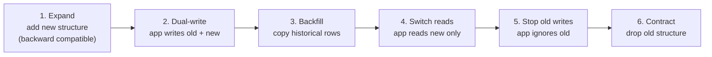
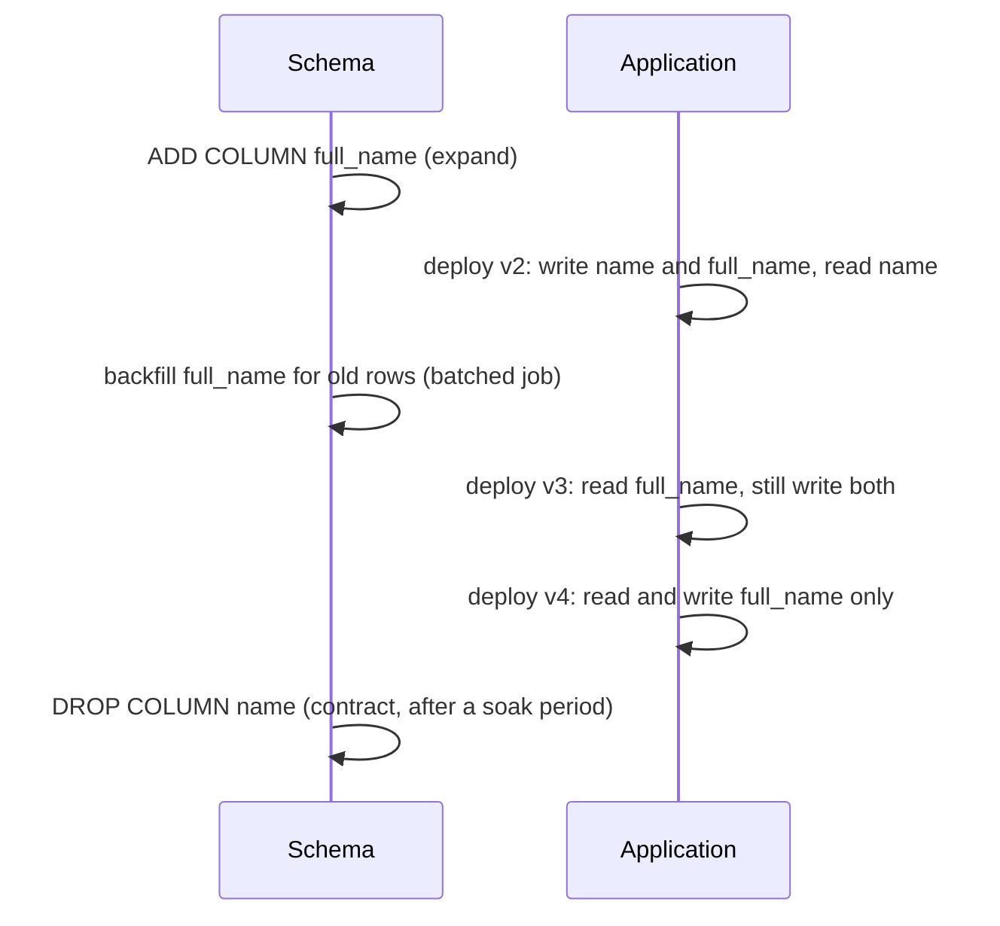
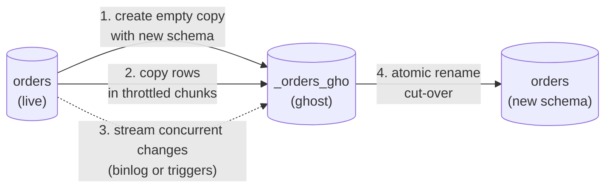

<p><a href="./">&larr; Database Design</a></p>

# Schema Evolution & Migrations

A schema is never finished: features add columns, growth demands indexes, refactors split tables, and yesterday's `VARCHAR(50)` turns out to be too short. Writing the `ALTER TABLE` is easy. Changing a schema that a *running* application depends on — often a table with hundreds of millions of rows — without dropping requests or corrupting data is the hard part. This page covers the discipline that makes schema change routine: **migration tooling** that versions the schema like code, the actual **locking and rewrite cost** of DDL in PostgreSQL and MySQL, the **expand–contract** pattern for zero-downtime changes, safe **backfills**, **online schema change** tools, CI/CD integration, and **rollback** strategy.

> **Mental model.** Treat the schema as code. Every change is a small, reviewed, version-controlled step that runs in the same order in every environment, and the database's current shape is fully described by which steps have been applied.

## Migrations as Version Control for the Database

A **migration** is a discrete, ordered change to the schema (and sometimes the data), expressed as a script. A migration tool records which migrations each database has applied in a bookkeeping table inside that database — `flyway_schema_history` for Flyway, `DATABASECHANGELOG` for Liquibase, `alembic_version` for Alembic, `schema_migrations` for Rails — so a developer laptop, CI, staging, and production can each be brought to the latest version by applying whatever is missing, in order.

```sql
-- Conceptually, every tool keeps something like this
CREATE TABLE schema_migrations (
    version      varchar(255) PRIMARY KEY,   -- "0042" or a revision hash
    description  text,
    checksum     varchar(64),                -- detects edits to already-applied scripts
    applied_at   timestamptz NOT NULL DEFAULT now(),
    success      boolean NOT NULL
);
```

Tools differ in how they order migrations and in whether you write the steps or the end state:

- **Versioned, sequential** (Flyway, golang-migrate, dbmate, Rails): each migration has a monotonic version (`V1__`, `V2__`, or a timestamp). Order is total and deterministic; parallel branches that pick the same number must renumber before merging.
- **Revision graph** (Alembic, Django): each migration names its parent(s), forming a DAG. Parallel feature branches each add a child of the same parent; the resulting "multiple heads" must be joined by a **merge migration** before deploying.
- **Declarative / state-based** (Atlas, Skeema, SQL Server DACPAC, Prisma `db push`): you edit the desired schema, and the tool diffs it against the database to *plan* the migration. Most teams using this style still commit the generated plan as a versioned migration, so production changes remain reviewed and reproducible.

### Rules That Prevent Most Incidents

1. **Migrations are immutable once shared.** Never edit a migration that has run anywhere beyond your own machine; checksums exist to catch this. Fix mistakes with a new migration.
2. **Review migrations like code** — a one-line `ALTER` can lock a production table for an hour.
3. **Separate schema changes from data changes.** A large `UPDATE` inside a DDL migration ties a slow backfill to a transaction that may hold locks.
4. **Every migration must be compatible with the application version already running** (the compatibility rule, below).
5. **Forward-only in production is a legitimate policy** (see [Rollbacks and Recovery](#rollbacks-and-recovery)).

## The Tooling Landscape

| Tool | Authoring format | Ordering model | Database abstraction | Ecosystem / notes |
|---|---|---|---|---|
| **Flyway** (Redgate) | Plain SQL, or Java | Sequential `V{n}__desc.sql`, plus repeatable `R__` | None — native SQL | JVM and CLI; undo (`U`) scripts only in paid editions |
| **Liquibase** | XML, YAML, JSON, or SQL changesets | Ordered changelog | High — abstract change types generate dialect SQL | JVM and CLI; Community edition moved from Apache 2.0 to the Functional Source License with 5.0 (2025) |
| **Alembic** | Python `upgrade()` / `downgrade()` | Revision DAG | Via SQLAlchemy `op.*` | Python; autogenerate from models |
| **Django migrations** | Python operations | Revision DAG per app | Via the ORM | Python; generated by `makemigrations` |
| **Rails / Active Record** | Ruby DSL | Timestamped sequential | Via the ORM | Ruby |
| **Atlas** | HCL, SQL, or ORM schema; declarative or versioned | Plans diffs; versioned directory with checksums | Multi-dialect | Go CLI; strong migration linting |
| **golang-migrate, dbmate** | Paired `.up.sql` / `.down.sql` | Sequential | None | Language-agnostic CLIs |
| **pgroll** | JSON/YAML operations | Sequential | PostgreSQL only | Automates expand–contract (below) |

### Flyway

Flyway favours plain SQL and convention over configuration: versioned files go in a migrations directory and `flyway migrate` applies anything newer than the recorded high-water mark.

```
db/migration/
  V1__create_users.sql
  V2__add_email_index.sql
  V3__add_orders_table.sql
  R__reporting_views.sql        -- repeatable: re-applied whenever its checksum changes
```

The prefix carries the semantics: `V` runs once in order; `R` is re-applied whenever the file changes, which suits views, functions, and grants where you want the *latest definition* rather than a diff; `U` is an undo script. `flyway validate` fails if an applied `V` file has been edited. A migration that cannot run in a transaction (such as `CREATE INDEX CONCURRENTLY`) is marked with a per-script config file, `V2__add_email_index.sql.conf`, containing `executeInTransaction=false`.

### Liquibase

Liquibase models change as a **changelog** of **changesets**, each identified by `id`, `author`, and file path. Its distinguishing feature is database-agnostic change types: you describe intent (`addColumn`, `createIndex`) and Liquibase emits dialect-specific SQL.

```yaml
databaseChangeLog:
  - changeSet:
      id: add-phone-to-users
      author: andrew
      changes:
        - addColumn:
            tableName: users
            columns:
              - column: { name: phone, type: VARCHAR(32) }
      rollback:
        - dropColumn: { tableName: users, columnName: phone }
```

Changesets support **preconditions** (skip or fail unless the database is in an expected state), **contexts and labels** (run subsets per environment), and explicit `rollback` blocks. The abstraction pays off for products that ship on several databases, but leaks for dialect-specific features (partial indexes, `CONCURRENTLY`, generated columns), where you drop back to raw `sql` changes.

### Alembic

Alembic, the migration tool for SQLAlchemy, writes migrations in Python linked by `down_revision`. `alembic revision --autogenerate` diffs the ORM models against the live database — convenient, but always review the output: autogenerate cannot detect renames (it emits drop plus add, which loses data) and misses some constraint and server-default changes.

```python
# alembic/versions/8f3a_add_status_to_orders.py
revision = "8f3a"
down_revision = "7b21"

from alembic import op
import sqlalchemy as sa

def upgrade():
    op.add_column(
        "orders",
        sa.Column("status", sa.String(20), nullable=False, server_default="pending"),
    )
    # CREATE INDEX CONCURRENTLY cannot run inside a transaction block
    with op.get_context().autocommit_block():
        op.create_index("ix_orders_status", "orders", ["status"],
                        postgresql_concurrently=True)

def downgrade():
    with op.get_context().autocommit_block():
        op.drop_index("ix_orders_status", table_name="orders",
                      postgresql_concurrently=True)
    op.drop_column("orders", "status")
```

When two branches each add a revision on the same parent, `alembic heads` shows two heads; `alembic merge -m "merge" <rev1> <rev2>` creates an empty revision that depends on both. Make "exactly one head" a CI check.

## What `ALTER TABLE` Actually Costs

Before designing a zero-downtime change you need to know, for your engine and version, which DDL is a metadata-only change, which rewrites or scans the table, and which lock it takes.

### PostgreSQL

Most `ALTER TABLE` forms take an `ACCESS EXCLUSIVE` lock, which blocks all reads and writes on the table while held. What matters is how *long* it is held.

| Operation | Cost | Notes |
|---|---|---|
| `ADD COLUMN` (nullable, no default) | Metadata only | |
| `ADD COLUMN ... DEFAULT <constant>` (with or without `NOT NULL`) | Metadata only (PG 11+) | The default is stored in the catalog; existing rows are not rewritten |
| `ADD COLUMN ... DEFAULT <volatile>` (e.g. `clock_timestamp()`, `gen_random_uuid()`) | Full table rewrite | Add without default, then backfill |
| `DROP COLUMN` | Metadata only | Space is reclaimed as rows are later rewritten |
| `RENAME COLUMN` / `RENAME TABLE` | Metadata only | But breaks every running query that uses the old name |
| `ALTER COLUMN TYPE` | Usually a full rewrite plus index rebuilds | Exceptions: binary-compatible changes such as increasing a `varchar` length or `varchar` to `text` |
| `SET NOT NULL` | Full scan under the lock | Skipped if a validated `CHECK (col IS NOT NULL)` already proves it (PG 12+) |
| `ADD CONSTRAINT ... CHECK / FOREIGN KEY ... NOT VALID` | Metadata only | Enforced for new rows immediately; existing rows unchecked |
| `ADD CONSTRAINT ... NOT NULL col NOT VALID` | Metadata only (PG 18+) | Validate later, as with `CHECK` |
| `VALIDATE CONSTRAINT` | Full scan, but only a `SHARE UPDATE EXCLUSIVE` lock | Reads and writes continue |
| `CREATE INDEX` | Blocks writes for the whole build | |
| `CREATE INDEX CONCURRENTLY` | Two scans, no write blocking | Cannot run in a transaction; a failure leaves an `INVALID` index that must be dropped |

**The lock queue trap.** Even a metadata-only change must *acquire* `ACCESS EXCLUSIVE`. If a long-running query or an idle-in-transaction session holds any lock on the table, the `ALTER` waits — and every query that arrives after it queues behind the `ALTER`, so a "free" DDL statement can take the application down. Always set a short `lock_timeout` and retry:

```sql
SET lock_timeout = '3s';          -- give up quickly instead of blocking the table
SET statement_timeout = '15min';  -- for operations that legitimately scan
ALTER TABLE orders ADD COLUMN status text;
-- On lock_timeout: back off, check pg_stat_activity for the blocker, retry
```

PostgreSQL's DDL is **transactional**: a multi-statement migration inside `BEGIN ... COMMIT` applies entirely or not at all. Keep such transactions short, because every lock taken is held until commit.

### MySQL / InnoDB

InnoDB classifies each DDL operation by algorithm, which you can request explicitly so that the statement fails rather than silently falling back to something slower:

| `ALGORITHM=` | What happens | Examples |
|---|---|---|
| `INSTANT` | Metadata only | Add a column (any position since 8.0.29), drop a column (8.0.29+), rename a column, set or drop a default, extend an `ENUM` |
| `INPLACE` | Rebuilds in place; concurrent DML allowed for most operations, with brief exclusive metadata locks at start and end | Add a secondary index, change row format |
| `COPY` | Copies the whole table; writes blocked throughout | Changing a column's data type, most charset conversions |

```sql
ALTER TABLE orders ADD COLUMN status VARCHAR(20) NOT NULL DEFAULT 'pending',
      ALGORITHM=INSTANT;                         -- errors instead of degrading to COPY
ALTER TABLE orders ADD INDEX ix_status (status), ALGORITHM=INPLACE, LOCK=NONE;
```

Caveats: a table can take only a limited number of `INSTANT` column changes before it needs a rebuild; MySQL DDL is **not transactional** (each statement commits implicitly, so a multi-statement migration can half-apply); and the metadata lock trap is the same as in PostgreSQL — set `lock_wait_timeout` low. MySQL 8.0 reached end of standard support in April 2026, so new work should target 8.4 LTS or later. When native online DDL is not enough, use an [online schema change tool](#online-schema-change-tools).

## Zero-Downtime Migrations: The Expand–Contract Pattern

You cannot change the schema and every running instance of the application at the same instant. **Expand–contract** (also called *parallel change*) splits a breaking change into steps such that **the deployed application and the current schema are compatible at every moment**:



Each arrow is a separate deploy or migration. Every step before *contract* can be abandoned by redeploying the previous application version, because the old structure is still present and populated.

### Worked Example: Rename `users.name` to `users.full_name`

`ALTER TABLE users RENAME COLUMN name TO full_name` is instant — and immediately breaks every running instance still selecting `name`. With expand–contract:



```sql
-- 1. Expand
ALTER TABLE users ADD COLUMN full_name text;

-- 2. Application v2 writes both columns
UPDATE users SET name = $1, full_name = $1 WHERE id = $2;

-- 3. Backfill historical rows in batches (see Backfills)

-- 4-5. Application v3 reads full_name; v4 stops writing name

-- 6. Contract
ALTER TABLE users DROP COLUMN name;
```

Dual writes can live in the application or in a database trigger that keeps the columns in sync; a trigger catches writes from every client (including scripts and other services) but must be removed during contract.

### Common Changes in the Expand–Contract Frame

- **Adding a `NOT NULL` column.** With a constant default, PostgreSQL 11+ and MySQL `INSTANT` do this in one cheap step. Without a suitable default: add it nullable, backfill, then enforce. On PostgreSQL, enforce with `ADD CONSTRAINT ... CHECK (col IS NOT NULL) NOT VALID`, then `VALIDATE CONSTRAINT` (no write blocking), then `SET NOT NULL` (skips the scan because the check proves it), then drop the redundant check. PostgreSQL 18 can add the `NOT NULL` constraint itself as `NOT VALID` and validate it later.
- **Adding a foreign key.** `ADD CONSTRAINT ... FOREIGN KEY ... NOT VALID`, then `VALIDATE CONSTRAINT` in a separate transaction.
- **Adding a unique constraint.** `CREATE UNIQUE INDEX CONCURRENTLY`, then `ADD CONSTRAINT ... UNIQUE USING INDEX`.
- **Splitting a column** (`address` into `street`, `city`, `postcode`): expand with the new columns, dual-write the parsed parts, backfill, switch reads, contract.
- **Changing a type** (`int` to `bigint` for an ID nearing $2^{31}$): add a `bigint` column, sync it with a trigger, backfill, then swap names in one short transaction; for a primary key also build the new unique index concurrently and swap constraints. This is major surgery on a hot table, which is why new tables should use `bigint` (or UUIDv7) keys from the start.
- **Renaming or splitting a table.** Expand with the new table and a view or trigger for compatibility, migrate readers and writers, contract.

### The Compatibility Rule

> **Each migration must be compatible with the application version running before it and the version deployed after it.**

In practice: a column is dropped only after it has stopped being read *and* stopped being written, which takes separate deploys; a new column must be nullable or have a default until every writer populates it; and an application must tolerate columns it does not know about (no `SELECT *` mapped positionally, no `INSERT` without a column list). Most migration outages are a violation of this one rule.

### Tools That Automate Expand–Contract

**pgroll** (PostgreSQL) performs expand–contract as a single tool-managed operation: it creates the new columns and triggers to keep old and new in sync, and exposes each schema version as a separate PostgreSQL schema of **views** over the physical table. Old application instances keep using the old version's views, new instances set `search_path` to the new version, and `pgroll complete` performs the contract step once the old version is retired.

## Backfills

A **backfill** populates a new column or table for existing rows. A single `UPDATE big_table SET new_col = f(old_col)` runs as one long transaction: it holds row locks on every row it touches, generates a burst of WAL that replicas must replay, prevents vacuum from cleaning up, and creates a dead copy of every row (in PostgreSQL). Backfills must be **batched, throttled, and resumable**.

```python
# Keyset-paginated backfill: each batch is its own short transaction.
BATCH = 5_000
last_id = 0
max_id = db.scalar("SELECT max(id) FROM users")

while last_id < max_id:
    upper = last_id + BATCH
    with db.transaction():
        db.execute(
            """
            UPDATE users
               SET full_name = name
             WHERE id > :lo AND id <= :hi
               AND full_name IS NULL
            """,
            lo=last_id, hi=upper,
        )
    last_id = upper
    save_checkpoint("users_full_name_backfill", last_id)   # resume point
    throttle_on_replica_lag(max_lag_seconds=5)             # back off if replicas fall behind
    time.sleep(0.05)
```

The loop is bounded by the maximum ID rather than stopping at the first empty batch, because ID ranges can have gaps and some ranges may already be filled by dual writes.

A safe backfill is:

- **Bounded** — each statement touches a small, predictable range of an indexed key (usually the primary key) and commits, releasing locks.
- **Idempotent and resumable** — the `IS NULL` guard makes reruns harmless, and a stored checkpoint lets a crashed job continue where it stopped.
- **Throttled adaptively** — watch replication lag and database load, and slow down when they rise; a backfill that outruns the replicas causes stale reads everywhere else.
- **Separate from the DDL migration** — add the column in a fast migration and run the backfill as a job (a script, a worker task, or a framework "data migration"), so it can be paused and resumed without blocking deploys.
- **Coordinated with dual writes** — new writes already populate the new column, so the backfill only needs historical rows.

On PostgreSQL, also watch table bloat on very large backfills; running `VACUUM` between chunks of the job keeps it under control. For the largest tables, it can be cheaper to build the new state in a shadow table and swap it in, which is what online schema change tools automate.

## Online Schema Change Tools

When the engine cannot perform a change online — typically a `COPY`-algorithm `ALTER` on a large MySQL table — external tools use the **shadow table and swap** method:



1. Create an empty **ghost** table with the desired schema.
2. Copy existing rows into it in throttled chunks.
3. Capture concurrent writes to the original (from the binary log, or with triggers) and apply them to the ghost.
4. When the ghost has caught up, **atomically rename** it into place and drop (or keep) the old table.

| Tool | Change capture | Notes |
|---|---|---|
| **pt-online-schema-change** (Percona Toolkit) | Triggers on the original table | Mature and simple; adds trigger overhead to every write and conflicts with existing triggers |
| **gh-ost** (GitHub) | Reads the binary log | Triggerless, pausable, can run from a replica; single-threaded copy |
| **Spirit** (Block/Cash App) | Reads the binary log | gh-ost reimplementation for MySQL 8.0+ only; multi-threaded copy and apply, resumable checkpoints — faster, at the cost of more replica lag |
| **Vitess / PlanetScale online DDL** | VReplication | Built into the platform; supports reverting a completed migration |

```bash
# gh-ost: change a column on a large table without blocking writes.
# Throttles when Threads_running exceeds 25; cuts over atomically when caught up.
gh-ost \
  --host=replica1.db --database=shop --table=orders \
  --alter="MODIFY COLUMN note VARCHAR(1000) NOT NULL DEFAULT ''" \
  --max-load=Threads_running=25 \
  --critical-load=Threads_running=100 \
  --chunk-size=1000 \
  --max-lag-millis=1500 \
  --execute
```

PostgreSQL rarely needs these tools, because most additive changes are metadata-only and indexes can be built concurrently. For the remaining cases — reclaiming bloat, or rewriting a hot table — **pg_repack** rebuilds tables and indexes online by the same shadow-and-swap method, holding an exclusive lock only briefly at the start and end.

> **Trade-off.** Online tools turn a blocking `ALTER` into a slow background copy. You pay in elapsed time, extra disk for a full second copy of the table, and replication load, to buy availability. Run them off-peak, watch replication lag, and make sure binlog or WAL retention covers the whole run.

## Migrations in CI/CD

- **Run every migration in CI** against a disposable database: apply the full history from empty, then check that the result matches the ORM models or the declared schema. This catches autogenerate misses, dialect bugs, and ordering conflicts.
- **Lint for dangerous operations.** Tools such as **Squawk** (PostgreSQL), **Atlas** `migrate lint`, and framework plugins such as `strong_migrations` (Rails) and `django-migration-linter` flag table rewrites, blocking index builds, `NOT NULL` without a default, unsafe renames and drops, and missing `lock_timeout`; the build fails unless the author explicitly acknowledges the risk.
- **Order migrations around deploys.** Expand migrations run *before* the application version that needs them; contract migrations run *after* every instance of the old version is gone — often a release or more later.
- **Run migrations as their own step**, not at application start-up. With many replicas starting at once, start-up migrations race each other, and a slow migration makes every pod fail its health check. Use a pipeline stage, a Kubernetes Job or Helm pre-upgrade hook, or an approval gate for destructive changes.
- **Test against production-scale data** for anything that scans or rewrites: a migration that takes 200 ms on a developer database may take an hour in production. Database branching services and restored snapshots make this practical.
- **Pin timeouts** (`lock_timeout`, `statement_timeout`, MySQL `lock_wait_timeout`) in the migration session.

## Rollbacks and Recovery

When a migration goes wrong there are three recovery strategies, in order of preference.

### 1. Roll Forward

Many mature teams run production migrations **forward-only**: they never execute `down` scripts in production, and fix a bad change with a new corrective migration. The reasons:

- `down` scripts are rarely tested against production-scale data, so they tend to fail exactly when needed.
- Many changes are not reversible: a dropped column's data is gone, and a lossy type change or merge cannot be undone.
- Expand–contract already provides a safe abort: until the contract step, the old structure is intact and redeploying the previous application version is enough.

### 2. Reverse Migration

Paired down-migrations (`downgrade()` in Alembic, `.down.sql` in golang-migrate, `rollback` blocks in Liquibase, Flyway undo scripts) are valuable in development and CI — `alembic downgrade -1`, adjust, re-run. In production they are safe only for changes that lost no data, such as dropping an index or a column that has never held anything. Treat them as a convenience for additive changes, not a safety net for destructive ones.

### 3. Restore from Backup / Point-in-Time Recovery

If a migration destroyed or corrupted data and no forward fix exists, recover from the storage layer: restore a base backup and replay the write-ahead log to just before the migration ran (see [Operations & Monitoring](operations-and-monitoring.html#point-in-time-recovery-pitr) and [Storage Engines & Recovery](storage-internals.html)). Restoring a whole database loses every legitimate write since that point, so the usual approach is to restore to a *separate* instance and copy the lost data back. The discipline this implies: **take a backup or PITR-capable snapshot immediately before any irreversible migration, and know how long a restore takes.**

### Making Rollback Safe by Design

- **Use transactional DDL where available.** In PostgreSQL, wrap related DDL in one transaction so a failure leaves nothing half-applied. In MySQL each DDL statement commits implicitly, so keep one DDL statement per migration and write cleanup by hand.
- **Isolate irreversible steps.** A migration that drops a column should do nothing else, so its blast radius is exactly one understood change.
- **Delay destructive changes.** Run the contract step after a soak period — days, not minutes — or rename the old column or table first (for example `name_deprecated_2026_09`) and drop it later, so a mistake is recoverable without a restore.

## Checklist

| Before merging a migration, ask | Why |
|---|---|
| Is it compatible with the application version currently running? | The compatibility rule |
| Does it rewrite or scan a large table under a strong lock? | Check the engine's cost table; use `NOT VALID`, `CONCURRENTLY`, `INSTANT`, or an online tool |
| Does the session set `lock_timeout` / `lock_wait_timeout`? | Avoid the lock queue trap |
| Is any data change batched and run separately from the DDL? | Long transactions, WAL bursts, replica lag |
| Is anything irreversible? Is there a fresh backup? | Rollback may require PITR |
| Has it run against production-sized data? | Duration surprises |

## See Also

- [Data Modeling & Normalization](modeling.html) — the schema being evolved and the integrity rules migrations must preserve.
- [Indexing & Query Execution](indexing-and-queries.html) — how indexes are built and why concurrent builds matter.
- [Transactions & Concurrency](transactions-and-concurrency.html) — locking and MVCC, the machinery online DDL and backfills depend on.
- [Storage Engines & Recovery](storage-internals.html) — table rewrites, WAL, and why large updates create bloat.
- [Replication & Consensus](replication-and-consensus.html) — replication lag during backfills, and logical replication for major-version upgrades.
- [ORMs & Data-Access Patterns](orm-patterns.html) — ORM-generated migrations and their pitfalls.
- **Up:** [Database Design hub](./)
