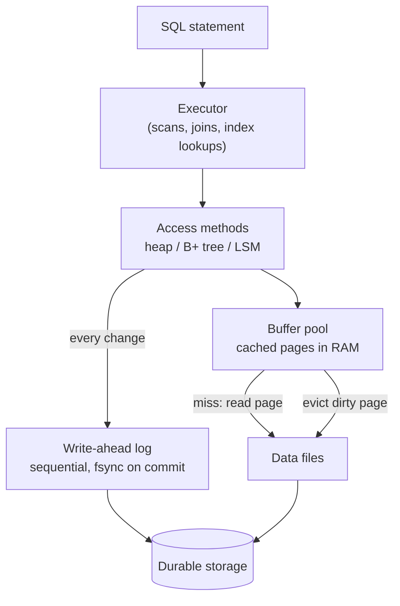
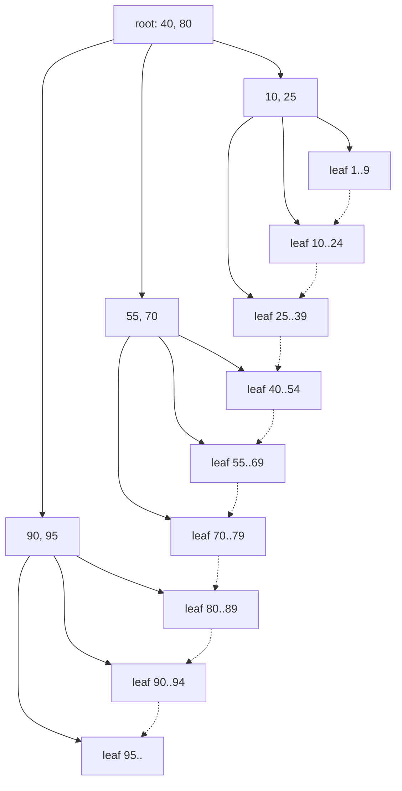
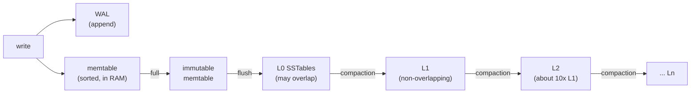
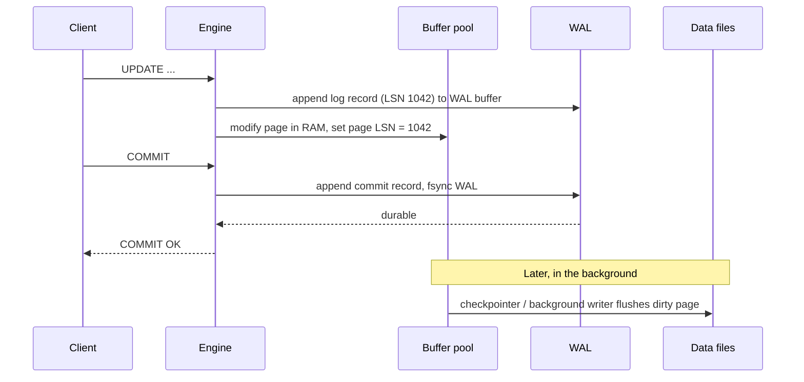
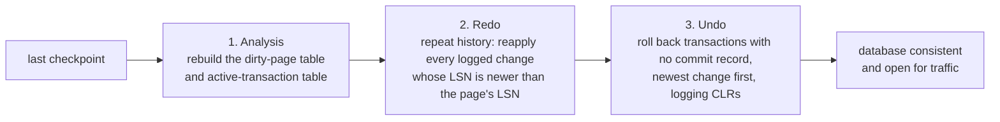

<p><a href="./">&larr; Database Design</a></p>

# Storage Engines & Recovery

The **storage engine** is the part of a database that turns logical operations ("insert this row", "find rows where `id = 42`") into reads and writes of fixed-size pages on disk, and that guarantees committed data survives a crash. This page covers how data is laid out (pages, heap files, clustered indexes), how it is cached (the buffer pool), the two dominant index structures (B+ trees and log-structured merge trees), row versus column layouts, and the write-ahead log that makes durability and crash recovery possible. Operational topics built on these mechanisms — backups, point-in-time recovery, vacuuming, and tuning — live in [Operations & Monitoring](operations-and-monitoring.html).

## The Storage Stack



Two write paths run side by side. Changes are recorded **sequentially** in the write-ahead log, which is flushed at commit, and applied to cached pages in memory, which are written back to the data files **lazily**, in the background. Durability comes from the log; performance comes from not having to write data pages synchronously.

## Pages and On-Disk Layout

Databases do not read or write individual rows. They move fixed-size **pages** (also called blocks): 8 KB in PostgreSQL, 16 KB by default in MySQL InnoDB, 8 KB in SQL Server and Oracle (configurable). Fetching a page costs about the same whether you need one row from it or all of them, so the engine's goal is to make each page read useful.

Most row stores use a **slotted page** layout:

```
+------------------------------------------------------------+
| Page header: LSN of last change, checksum, free-space ptrs |
+------------------------------------------------------------+
| Slot array: [1][2][3][4] ->  grows forward                 |
|                                                            |
|                     free space                             |
|                                                            |
|             <- grows backward   [tuple 4][tuple 3]         |
|                                 [tuple 2][tuple 1]         |
+------------------------------------------------------------+
```

The slot array at the front holds the offset of each tuple; tuples are packed from the end of the page. A row is addressed by *(page number, slot number)* — PostgreSQL calls this the **TID** or `ctid`. Because other structures point at the slot rather than the byte offset, the engine can compact a page without updating every index.

The page header's **LSN** (log sequence number) records the last WAL record applied to the page, which is how recovery knows whether a change still needs to be redone. The **checksum** detects corruption from bad disks or firmware; PostgreSQL 18 enables data checksums by default for newly initialized clusters.

### Heap Tables vs. Clustered Indexes

Engines disagree on where rows physically live:

| | Heap-organized (PostgreSQL, Oracle default) | Index-organized / clustered (InnoDB, SQL Server clustered tables) |
|---|---|---|
| Row storage | Unordered heap file; rows go wherever there is space | Leaf pages of the primary-key B+ tree |
| Secondary index entry | Key → TID (physical location) | Key → primary key value |
| Primary-key range scan | Index scan plus random heap fetches | Sequential leaf scan — very fast |
| Secondary-index lookup | One index descent plus one heap fetch | Two descents (secondary, then primary) |
| Effect of a random primary key (UUIDv4) | Mild: only the PK index fragments | Severe: every insert lands on a random leaf page, causing page splits and a cold cache |

This is why InnoDB schemas favour compact, monotonically increasing primary keys. Time-ordered identifiers such as **UUIDv7** (RFC 9562; native `uuidv7()` in PostgreSQL 18) keep global uniqueness while inserting at the right-hand edge of the index.

### Large Values

A tuple must fit within a page. Larger values are moved out of line: PostgreSQL's **TOAST** compresses and slices values over about 2 KB into a side table (with `lz4` or `pglz` compression); InnoDB stores long `BLOB`/`TEXT`/`JSON` values on overflow pages. Wide columns you rarely read therefore cost little on scans that do not touch them — but `SELECT *` pays to reassemble them.

## Buffer Pool: Your Database's Cache

The **buffer pool** is a fixed array of page-sized frames in shared memory, plus a hash table mapping page IDs to frames. Every page access goes through it: on a hit the page is returned from RAM; on a miss the engine picks a victim frame, writes it out first if it is **dirty** (modified since it was read), and reads the requested page in. A page in use is **pinned** so it cannot be evicted mid-operation.

```python
class BufferPool:
    """Sketch of a buffer pool with LRU eviction and write-back of dirty pages."""

    def __init__(self, capacity_pages, disk, wal):
        self.capacity = capacity_pages
        self.frames = OrderedDict()   # page_id -> Page (ordered by recency)
        self.disk, self.wal = disk, wal

    def get_page(self, page_id):
        if page_id in self.frames:                # hit
            self.frames.move_to_end(page_id)
            return self.frames[page_id]
        if len(self.frames) >= self.capacity:     # miss: make room
            self._evict()
        page = self.disk.read(page_id)
        self.frames[page_id] = page
        return page

    def _evict(self):
        for page_id, page in self.frames.items():       # least recently used first
            if page.pin_count == 0:
                if page.dirty:
                    self.wal.flush_up_to(page.lsn)       # WAL rule: log before data
                    self.disk.write(page_id, page)
                del self.frames[page_id]
                return
        raise RuntimeError("all pages pinned")
```

Note the `flush_up_to(page.lsn)` before writing a dirty page: a page may never reach disk before the log records describing its changes. That is the write-ahead rule, and the buffer pool is where it is enforced.

Plain LRU performs badly for databases because a single large sequential scan evicts the entire working set. Real engines use scan-resistant policies:

- **PostgreSQL** uses a **clock-sweep** approximation of LRU with per-buffer usage counts, and gives large sequential scans, `VACUUM`, and bulk writes a small **ring buffer** so they recycle a few frames instead of flushing the cache.
- **InnoDB** splits its LRU list into a *young* and an *old* sublist; newly read pages enter at the midpoint (by default 3/8 from the tail) and are promoted only if accessed again after `innodb_old_blocks_time`.

The two engines also differ in how they relate to the OS page cache. InnoDB is typically configured with `innodb_flush_method = O_DIRECT` and a buffer pool of 50–75% of RAM, bypassing the OS cache. PostgreSQL uses buffered I/O and relies on the OS cache as a second tier, so `shared_buffers` is conventionally about 25% of RAM, with `effective_cache_size` telling the planner how much the OS is likely caching. PostgreSQL 18 added an **asynchronous I/O** subsystem (`io_method = worker` by default, or `io_uring` on Linux) that issues reads ahead for sequential scans, bitmap heap scans, and vacuum instead of waiting on each one.

```sql
-- PostgreSQL: share of block requests served from shared_buffers
-- (OS-cache hits count as "reads" here, so this understates the real hit rate)
SELECT datname,
       round(blks_hit * 100.0 / nullif(blks_hit + blks_read, 0), 2) AS hit_pct
FROM pg_stat_database
WHERE datname = current_database();
```

A frame-and-page-table view of the same structure, with the clock algorithm and per-query work memory, is in [Indexing & Query Execution](indexing-and-queries.html#memory-management-internals).

## B+ Trees

The **B+ tree** is the default index structure in essentially every relational database. It is a balanced search tree whose nodes are pages:

- **Internal nodes** hold only separator keys and child pointers, so each page holds hundreds of entries.
- **Leaf nodes** hold the keys plus either the row itself (clustered index) or a pointer to it, and are linked to their siblings so range scans walk sideways without returning to the root.
- Every leaf is at the same depth.



A lookup for key 62 reads the root (62 ≥ 40 and < 80, go to the middle child), the internal node (62 ≥ 55 and < 70), then the leaf holding 55–69. A range query such as `BETWEEN 62 AND 85` finds the first leaf the same way and follows the dotted sibling links.

**Why the tree is so shallow.** The height is logarithmic in the number of keys with a very large base, the **fan-out** $f$ (entries per internal page). With 8 KB pages and roughly 16-byte entries, $f$ is in the hundreds, so

$$
\text{height} \approx \left\lceil \log_f N \right\rceil, \qquad f = 500:\ \ 500^3 = 1.25 \times 10^8 .
$$

Three levels address over a hundred million rows, and the root and internal levels are almost always cached, so a point lookup typically costs one or two physical reads.

**Inserts and splits.** An insert finds the target leaf and adds the key in sorted position. If the leaf is full it **splits**: half the entries move to a new page and a separator key is inserted into the parent, which may split in turn; a root split is the only way the tree grows taller. Deletes may merge under-full nodes, though many engines simply leave space to be reused.

```python
def insert(tree, key, value):
    leaf = tree.find_leaf(key)              # root-to-leaf descent
    leaf.insert_sorted(key, value)
    node = leaf
    while node.overflowing():
        left, sep, right = node.split()     # right half moves to a new page
        parent = node.parent or tree.new_root(left)
        parent.insert_child(sep, right)     # may overflow the parent
        node = parent
```

Practical consequences:

- **Sequential keys fill pages; random keys fragment them.** Right-edge inserts leave pages nearly full, while random inserts split pages throughout the tree, leaving them about 70% full on average and touching many pages. PostgreSQL's `fillfactor` (and InnoDB's `innodb_fill_factor` for sorted index builds) reserve headroom for later updates.
- **Updates in place are cheap only when indexed columns do not change.** PostgreSQL's **HOT** (heap-only tuple) updates avoid touching any index when no indexed column changes and the new version fits on the same page.
- **Concurrency** is handled with short-lived page latches and techniques such as B-link trees (Lehman and Yao), so readers never wait for a split to finish.

Index types beyond the B+ tree — hash, GIN, GiST, BRIN — and how the planner chooses among them are covered in [Indexing & Query Execution](indexing-and-queries.html).

## LSM Trees

A **log-structured merge tree** gives up in-place updates entirely. Writes are buffered in memory and written out as immutable sorted files, which are merged in the background. It trades read cost and background CPU for very cheap, sequential writes, and is the engine behind RocksDB, LevelDB, Cassandra, ScyllaDB, HBase, and many distributed SQL stores (CockroachDB's Pebble, TiKV and YugabyteDB on RocksDB derivatives).



**Write path.** A write is appended to the WAL and inserted into the **memtable**, an in-memory sorted structure (typically a skip list). When the memtable fills it becomes immutable and is flushed to disk as a **sorted string table (SSTable)**: an immutable file of sorted key-value pairs with a block index and a Bloom filter. Updates and deletes are just newer entries; a delete writes a **tombstone** that shadows older values until compaction removes both.

**Read path.** A point read checks the memtable, then the immutable memtables, then SSTables from newest to oldest, stopping at the first hit. Each SSTable's **Bloom filter** answers "definitely not here" for most files without any disk read (about 1% false positives at 10 bits per key), and the block index locates the right block in the files that remain.

```python
class LSMTree:
    def put(self, key, value):
        self.wal.append(("put", key, value))    # durability first
        self.memtable[key] = value              # sorted map / skip list
        if self.memtable.size_bytes() > self.memtable_limit:
            self.flush()

    def delete(self, key):
        self.put(key, TOMBSTONE)                # deletes are writes

    def get(self, key):
        for table in [self.memtable, *self.immutables, *self.sstables_newest_first()]:
            if table is not self.memtable and not table.bloom.might_contain(key):
                continue                        # skip without I/O
            value = table.get(key)
            if value is not None:
                return None if value is TOMBSTONE else value
        return None
```

### Compaction and Amplification

Compaction merges SSTables, discards overwritten values and expired tombstones, and keeps the number of files a read must consult bounded. The strategy determines the engine's cost profile, usually described by three **amplification** factors:

- **Write amplification** — bytes written to disk per byte written by the application.
- **Read amplification** — disk reads per logical read.
- **Space amplification** — bytes on disk per byte of live data.

The RUM conjecture (Athanassoulis et al., 2016) observes that an access method can optimize at most two of Read, Update, and Memory/space overhead at the expense of the third.

| Strategy | How it works | Write amp. | Read amp. | Space amp. | Used by |
|---|---|---|---|---|---|
| **Leveled** | Each level is one sorted run about 10x larger than the previous; a file is merged into the overlapping files of the next level | High (roughly 10x per level) | Low | Low (about 1.1x) | RocksDB default, LevelDB, Pebble |
| **Size-tiered / universal** | Accumulate several similar-sized runs, then merge them together | Low | Higher | High (needs up to 2x free space while merging) | Cassandra STCS, RocksDB universal, ScyllaDB |
| **Time-window** | Tier within fixed time buckets; old buckets are never rewritten | Low | Low for recent-time queries | Low with TTLs | Cassandra TWCS for time series |

Cassandra 5.0 introduced the **Unified Compaction Strategy (UCS)**, which parameterizes the spectrum between tiered and leveled behaviour per level, so operators tune a density knob instead of switching strategies.

### B+ Tree or LSM?

| | B+ tree | LSM tree |
|---|---|---|
| Write pattern | Random in-place page writes | Sequential appends and merges |
| Write throughput | Moderate; bounded by random I/O and page splits | High; bounded by compaction bandwidth |
| Point reads | One tree descent, predictable | Memtable plus several files (mitigated by Bloom filters) |
| Range scans | Excellent (sorted, linked leaves) | Good, but must merge iterators across levels |
| Space efficiency | Pages partly empty after random inserts | Compact after compaction; temporary bloat before it |
| Latency variance | Low | Compaction can cause stalls if it falls behind |
| Deletes | Immediate space reuse | Tombstones linger until compacted |
| Typical fit | OLTP with mixed reads and writes | Write-heavy ingest, time series, key-value at scale |

On modern NVMe SSDs the gap in raw random-write cost has narrowed, but LSM trees still write less and write sequentially, which also reduces flash wear. Many systems now pick per workload: MySQL can run MyRocks (RocksDB) alongside InnoDB, and MongoDB's WiredTiger is a B-tree engine while most distributed SQL systems use LSM storage underneath.

## Row vs. Column Storage

Everything above assumes **row-oriented** storage: all columns of a row are stored together, which suits OLTP, where queries read or write whole rows by key. Analytical queries are different — they scan millions of rows but only a handful of columns.

**Column-oriented** storage keeps each column in its own contiguous segments. A query reads only the columns it references; values of one type stored together compress very well (run-length, dictionary, delta, and bit-packing encodings often achieve 5–10x); and the executor can process them in **vectorized** batches with SIMD instructions. The costs are slow single-row inserts and updates, usually handled by buffering writes in a row-oriented delta store and merging them into column segments in the background.

| | Row store | Column store |
|---|---|---|
| Best at | Point lookups, short transactions | Scans and aggregates over few columns |
| Examples | PostgreSQL, MySQL, SQL Server rowstore | ClickHouse, DuckDB, Snowflake, BigQuery, Redshift, SQL Server columnstore indexes |
| File formats | Engine pages | Apache Parquet, ORC; table formats such as Apache Iceberg and Delta Lake layer transactions on top |

Hybrid designs such as PAX store column-wise *within* each page; Parquet's row groups follow the same idea.

## Write-Ahead Logging: Surviving Crashes

A crash can happen at any instant: after a transaction commits but before its dirty pages reach disk, or after some pages of an uncommitted transaction have already been written. **Write-ahead logging (WAL)** makes both cases recoverable with two rules:

1. **Write-ahead rule.** A log record describing a change must reach durable storage *before* the modified page does.
2. **Commit rule.** A transaction is committed only once all of its log records, including the commit record, are durable.

With these rules the engine can use the most efficient buffer policy — **steal** (a dirty page from an uncommitted transaction may be written out to free a frame) and **no-force** (committed pages need not be written at commit time) — because the log always holds enough information to redo committed changes that never reached the data files and undo uncommitted changes that did.



The commit waits for one sequential `fsync` of the log, not for random writes of every modified page. **Group commit** amortizes that `fsync` across many concurrent transactions, which is why commit throughput scales well beyond the device's raw flush rate.

### Checkpoints

Without a bound, recovery would have to replay the log from the beginning of time. A **checkpoint** writes all dirty pages to the data files and records a checkpoint location in the log; recovery starts from the latest checkpoint and older log segments can be recycled or archived. Checkpoints are *fuzzy* in practice — the engine records which pages are dirty and flushes them gradually (PostgreSQL spreads the writes over `checkpoint_completion_target` of the interval) rather than freezing the database.

Checkpoint spacing is a trade-off: frequent checkpoints shorten recovery but write hot pages repeatedly and, in PostgreSQL, increase full-page-image volume; infrequent checkpoints do the opposite. PostgreSQL controls this with `checkpoint_timeout` and `max_wal_size`; InnoDB checkpoints continuously as its fixed-size redo log (`innodb_redo_log_capacity`) fills.

### Torn Pages

A database page (8–16 KB) is larger than the unit the storage device writes atomically (often 4 KB), so a crash mid-write can leave a **torn page**, half old and half new — which a change-only log record cannot repair. The engines solve this differently:

- **PostgreSQL** writes a **full-page image** into the WAL the first time a page is modified after each checkpoint (`full_page_writes = on`); recovery restores the image and then applies later records.
- **InnoDB** writes pages first to a **doublewrite buffer** and only then to their real location, so an intact copy always exists.
- Filesystems or devices with atomic 16 KB writes (for example some ZFS configurations, or cloud block storage offering torn-write protection) let operators disable these safeguards.

### Durability Knobs

| Setting | Effect | Risk if relaxed |
|---|---|---|
| PostgreSQL `synchronous_commit = off` | Commit returns before the WAL flush; a background writer flushes within about 3x `wal_writer_delay` | Last few hundred milliseconds of commits lost on crash; no corruption |
| MySQL `innodb_flush_log_at_trx_commit = 2` | Write the redo log to the OS on commit, `fsync` about once per second | Up to about one second of commits lost if the *OS* crashes |
| MySQL `sync_binlog = 1` | `fsync` the binary log on every commit | Needed so replicas and the binlog agree with InnoDB after a crash |
| `fsync = off` (PostgreSQL) | Never flush | Data corruption on power loss — test environments only |

Durability also depends on the storage stack honouring flushes. The 2018 "fsyncgate" discovery that Linux could silently drop dirty pages after a failed `fsync` led PostgreSQL (in its early-2019 minor releases) to treat an `fsync` failure as fatal (PANIC and recover from the WAL) rather than retry.

### Crash Recovery (ARIES)

Most disk-based engines follow the recovery scheme of **ARIES** (Mohan et al., 1992). After a crash it runs three passes over the log:



1. **Analysis** scans forward from the checkpoint to determine which transactions were active at the crash and which pages might be dirty.
2. **Redo** *repeats history*: it reapplies every logged change — committed or not — to any page whose on-disk LSN shows it has not seen that change yet. After redo the database is exactly as it was at the instant of the crash.
3. **Undo** rolls back the transactions that never committed, writing **compensation log records (CLRs)** as it goes so that a crash during recovery never undoes the same change twice.

```python
def recover(log, pages):
    # 1. Analysis
    active, dirty = {}, {}
    for rec in log.scan_from(log.last_checkpoint()):
        if rec.kind == "commit" or rec.kind == "end":
            active.pop(rec.txid, None)
        else:
            active[rec.txid] = rec.lsn                   # last LSN per open txn
            if rec.page_id is not None:
                dirty.setdefault(rec.page_id, rec.lsn)   # first LSN that dirtied it

    # 2. Redo: repeat history for every change, committed or not
    start = min(dirty.values(), default=None)
    for rec in log.scan_from(start):
        if rec.is_update() and pages[rec.page_id].lsn < rec.lsn:
            pages[rec.page_id].apply(rec.redo)
            pages[rec.page_id].lsn = rec.lsn

    # 3. Undo: roll back losers, newest first, logging compensation records
    for rec in log.scan_backward(txids=active.keys()):
        if rec.is_update():
            pages[rec.page_id].apply(rec.undo)
            log.append_clr(rec)
```

The engines above adapt the scheme to their concurrency control. **InnoDB** replays its redo log and then rolls back incomplete transactions using undo logs, as ARIES describes. **PostgreSQL** needs only redo: because MVCC never overwrites a row in place, an uncommitted transaction's new tuple versions are simply invisible once the transaction is marked as aborted in the commit log (`pg_xact`), and `VACUUM` removes them later. **SQL Server's** Accelerated Database Recovery uses its persistent version store to make undo effectively instant regardless of transaction size.

> **Code Reference:** Working toy implementations of a buffer pool, B+ tree, LSM tree, and WAL recovery are in [`storage_engines.py`](../../../code-examples/technology/database-design/storage_engines.py).

## Partitioning

Large tables can be split into **partitions** — separate physical tables that share one logical definition. Queries that filter on the partition key touch only the relevant partitions (*partition pruning*), each partition has its own smaller indexes, and old data can be removed by dropping a partition instead of running a massive `DELETE` that bloats the table.

```sql
CREATE TABLE events (
    event_id    bigint GENERATED ALWAYS AS IDENTITY,
    occurred_at timestamptz NOT NULL,
    payload     jsonb,
    PRIMARY KEY (event_id, occurred_at)          -- PK must include the partition key
) PARTITION BY RANGE (occurred_at);

CREATE TABLE events_2026_09 PARTITION OF events
    FOR VALUES FROM ('2026-09-01') TO ('2026-10-01');

-- Retention: detach without blocking queries on the parent, then drop
ALTER TABLE events DETACH PARTITION events_2026_03 CONCURRENTLY;
DROP TABLE events_2026_03;
```

Partitioning helps with data lifecycle and with queries that naturally filter on the key (time ranges, tenants). It does not speed up queries that ignore the key — those must now visit every partition — so it is a layout decision, not a general performance fix. Tools such as `pg_partman` automate creating future partitions. Partitioning across machines (sharding) is covered in [Distributed Databases & NoSQL](distributed-and-nosql.html).

## From the Log to Backups and Replicas

The write-ahead log is not only a recovery mechanism; it is the backbone of the features that copy a database elsewhere:

- **Physical backups and point-in-time recovery** take a copy of the data files (a *base backup*) and archive every WAL segment after it. Restoring means copying the base backup and replaying the log to any chosen moment — crash recovery run deliberately. PostgreSQL 17 added **incremental** base backups (`pg_basebackup --incremental`, reassembled with `pg_combinebackup`), driven by WAL summaries. Procedures are in [Operations & Monitoring](operations-and-monitoring.html#point-in-time-recovery-pitr).
- **Streaming replication** ships the same log records to standbys, which stay in continuous recovery; **logical decoding** turns them into row-level change events for logical replication and change data capture. See [Replication & Consensus](replication-and-consensus.html).
- **Disaggregated storage** takes the idea furthest: in Amazon Aurora and Neon, compute nodes send only log records to a replicated storage tier, which materializes pages from the log on demand — "the log is the database".

## See Also

- [Transactions & Concurrency](transactions-and-concurrency.html) — MVCC and locking, the other half of how the engine keeps data consistent.
- [Indexing & Query Execution](indexing-and-queries.html) — index types, the planner, and memory and lock internals.
- [Operations & Monitoring](operations-and-monitoring.html) — backups, PITR, VACUUM, connection pooling, slow-query diagnosis, and tuning.
- [Replication & Consensus](replication-and-consensus.html) — streaming the WAL to other machines.
- **Previous:** [Transactions & Concurrency](transactions-and-concurrency.html) · **Next:** [Distributed Databases & NoSQL](distributed-and-nosql.html) · **Up:** [Database Design hub](./)
