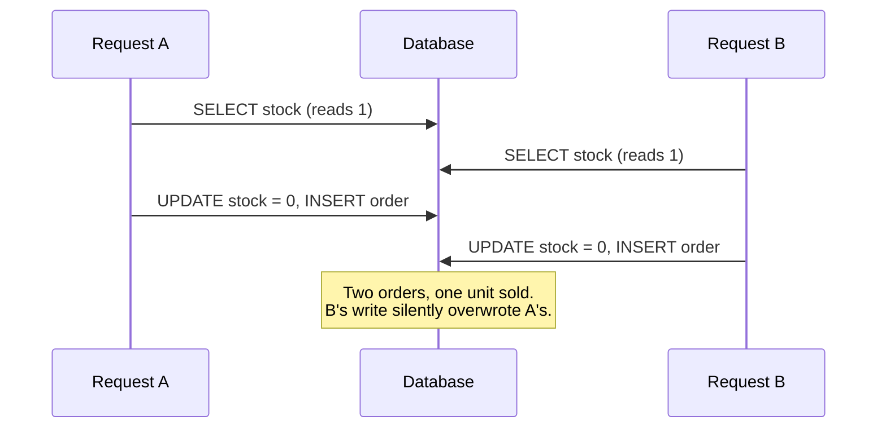
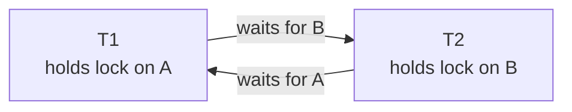
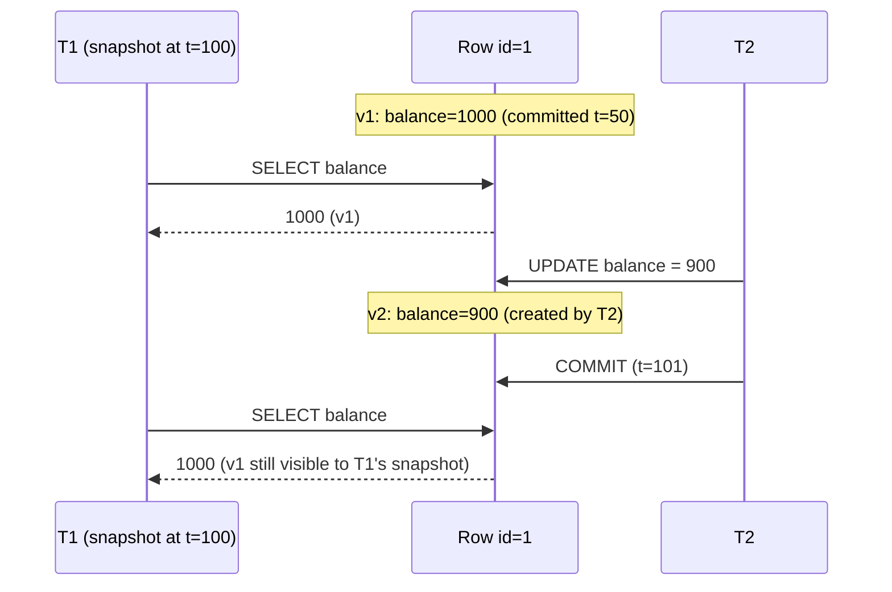
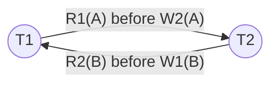

<p><a href="./">&larr; Database Design</a></p>

# Transactions & Concurrency

A **transaction** groups reads and writes into a unit that either takes effect completely or not at all, and that behaves as if it ran without interference from other transactions. This page covers the second half of that promise — *isolation* — which is where nearly all the subtlety lives: the anomalies that concurrent execution can produce, the two families of mechanisms that prevent them (locking and multi-version concurrency control), the formal target of serializability, the isolation levels real databases actually ship, and the application-side patterns that make concurrent code correct. Atomicity and durability are provided by the write-ahead log, covered in [Storage Engines & Recovery](storage-internals.html).

## The Concurrency Problem

Two customers try to buy the last unit of a product at the same moment. Each request runs the same check-then-act logic:

```python
# Runs concurrently in two request handlers
stock = db.query_one("SELECT stock FROM products WHERE id = 123")   # both read 1
if stock > 0:
    db.execute("UPDATE products SET stock = ? WHERE id = 123", stock - 1)
    db.execute("INSERT INTO orders (product_id, customer_id) VALUES (123, ?)", customer)
```



Neither statement is wrong in isolation; the bug is the *interleaving*. Every concurrency-control mechanism exists to rule out interleavings like this one without giving up the throughput that running transactions in parallel provides.

## Anomalies

Isolation levels are defined by which anomalies they permit. The first three come from the ANSI SQL-92 standard; the rest were identified later (Berenson et al., *A Critique of ANSI SQL Isolation Levels*, 1995) because the standard's definitions turned out to be ambiguous and incomplete.

| Anomaly | What happens | Example |
|---|---|---|
| **Dirty write** | T2 overwrites a value T1 wrote but has not committed | Two transfers interleave writes to the same two rows, leaving a mix of both |
| **Dirty read** | T2 reads a value T1 wrote but later rolls back | A report counts an order that was never committed |
| **Non-repeatable read** (fuzzy read) | T1 reads a row twice and gets different values because T2 committed an update in between | A balance check and the subsequent debit see different balances |
| **Phantom read** | T1 re-runs a predicate query and gets a different *set* of rows because T2 inserted or deleted matching rows | `SELECT count(*) WHERE status='open'` changes mid-transaction |
| **Lost update** | T1 and T2 both read-modify-write the same row; one write is silently discarded | The stock example above |
| **Read skew** | T1 sees parts of the database at different points in time, observing a state that never existed | Reading account A before a transfer and account B after it, so money appears to vanish |
| **Write skew** | T1 and T2 read an overlapping set, each updates a *different* row based on what it read, and together they violate an invariant neither broke alone | Two on-call doctors each see "another doctor is on call" and both go off call |

Write skew is the anomaly that most often surprises people, because it survives snapshot isolation — the level many databases use by default for "repeatable read".

## Concurrency Control Mechanisms

Databases use two broad strategies, and most modern engines combine them: **pessimistic** control blocks conflicting operations up front with locks, while **optimistic/multi-version** control lets transactions proceed on private snapshots and detects conflicts later.

### Two-Phase Locking (2PL)

Under 2PL a transaction acquires locks as it goes (the *growing* phase) and releases them only after it has stopped acquiring (the *shrinking* phase). Every production implementation uses **strict 2PL**: write locks (and, for serializability, read locks) are held until commit or abort, so no other transaction ever sees uncommitted data.

| Lock mode | Held by | Compatible with |
|---|---|---|
| **Shared (S)** | Readers | Other S locks |
| **Exclusive (X)** | Writers | Nothing |
| **Intention (IS / IX)** | Transactions that will lock rows inside a table or page | Lets the engine check table-level conflicts without scanning every row lock |

Row locks alone cannot stop phantoms, because a phantom is a row that does not exist yet. Serializable 2PL therefore also locks *predicates* or, in practice, **index ranges**: InnoDB's next-key locks lock an index record plus the gap before it, so an insert into a range another transaction has scanned must wait.

2PL is simple and correct, but readers and writers block each other, and long transactions hold locks for their whole duration. It also introduces deadlocks.

### Deadlocks



A deadlock is a cycle in the **waits-for graph**. Databases handle them in one of two ways:

- **Detection** — periodically, or after a waiting transaction has been blocked for a while (PostgreSQL's `deadlock_timeout`, default 1 s), search the graph for cycles and abort one member (the *victim*). PostgreSQL reports SQLSTATE `40P01`; MySQL reports error 1213. InnoDB detects deadlocks immediately on each lock wait unless `innodb_deadlock_detect` is turned off.
- **Prevention / timeout** — abort any transaction that waits longer than a limit (`lock_timeout`, `innodb_lock_wait_timeout`), or order transactions by timestamp (wait-die, wound-wait), common in distributed systems where a global waits-for graph is expensive (see [Distributed Transactions](distributed-transactions.html#distributed-deadlocks)).

The application-side cure is to **acquire locks in a consistent order** (for example, always lock the lower account ID first in a transfer) and to keep transactions short. A deadlock victim should simply retry. The PostgreSQL table-level lock-mode compatibility matrix is in [Indexing & Query Execution](indexing-and-queries.html#locks-taken-by-index-operations).

### Multi-Version Concurrency Control (MVCC)

MVCC keeps several versions of each row. A write creates a new version instead of overwriting the old one, and each transaction reads from a **snapshot**: the set of versions committed as of some instant. Because readers look at old versions, **readers never block writers and writers never block readers**. Writers still conflict with other writers on the same row.



A version is visible to a snapshot if the transaction that created it committed before the snapshot was taken, and the transaction that deleted or superseded it (if any) had not. Engines differ mainly in *where* old versions live:

| Engine | Where old versions are kept | Cleanup |
|---|---|---|
| **PostgreSQL** | In the table heap itself; every tuple carries `xmin` (creating transaction) and `xmax` (deleting transaction) | `VACUUM` / autovacuum removes dead tuples; see [Operations](operations-and-monitoring.html#maintenance-vacuum-analyze-and-autovacuum) |
| **MySQL InnoDB** | Latest version in the clustered index; older versions reconstructed from **undo logs** | Background purge threads discard undo no longer needed by any snapshot |
| **Oracle** | Undo segments | Automatic undo retention (`ORA-01555 snapshot too old` if exceeded) |
| **SQL Server** | Row versions in a **version store** (tempdb, or in-database with Accelerated Database Recovery) | Background cleanup |

The operational cost of MVCC is garbage: a long-running transaction pins its snapshot, preventing cleanup of every version created since it started. In PostgreSQL this shows up as table bloat and, in extreme cases, transaction-ID wraparound pressure; in InnoDB as an ever-growing history list length. Keep transactions short and monitor the oldest open transaction.

A simplified model of snapshot visibility:

```python
class MVCCStore:
    """Toy MVCC: each key maps to a list of versions (value, created_by, deleted_by)."""

    def __init__(self):
        self.versions = {}          # key -> list[Version]
        self.committed = set()      # ids of committed transactions
        self.next_txid = 1

    def begin(self):
        txid = self.next_txid
        self.next_txid += 1
        # Snapshot = which transactions were committed when we started
        return Txn(txid, snapshot=frozenset(self.committed))

    def visible(self, v, txn):
        created_ok = v.created_by == txn.id or v.created_by in txn.snapshot
        deleted = v.deleted_by is not None and (
            v.deleted_by == txn.id or v.deleted_by in txn.snapshot)
        return created_ok and not deleted

    def read(self, txn, key):
        for v in reversed(self.versions.get(key, [])):
            if self.visible(v, txn):
                return v.value
        return None
```

Real engines also record which transactions were *in progress* at snapshot time (PostgreSQL's `xmin`/`xmax`/`xip` snapshot fields), because transaction IDs are assigned at start but commits happen in a different order.

## Serializability

The gold standard is **serializability**: the outcome of running transactions concurrently must equal the outcome of *some* serial order of the same transactions. It is the only level at which every invariant that holds for each transaction run alone also holds under concurrency — the application does not need to reason about interleavings at all.

The standard test is **conflict serializability**. Two operations conflict if they belong to different transactions, touch the same item, and at least one is a write. Draw an edge Ti → Tj whenever an operation of Ti precedes a conflicting operation of Tj; the schedule is conflict-serializable exactly when this **precedence graph** is acyclic.

Consider the schedule `R1(A), W2(A), R2(B), W1(B)`:



T1 must precede T2 because it read A before T2 overwrote it, and T2 must precede T1 because it read B before T1 overwrote it. The cycle means no serial order produces the same result, so the schedule is not serializable. Strict 2PL can never produce such a cycle (one transaction would block), which is why it guarantees serializability.

### Serializable Snapshot Isolation (SSI)

Plain snapshot isolation prevents most anomalies but allows write skew, which appears in the precedence graph as a cycle of two *read-write anti-dependencies* (each transaction read something the other later wrote). **SSI** (Cahill, Röhm and Fekete, 2008) tracks these rw-antidependencies at runtime and aborts a transaction when it detects the "dangerous structure" of two consecutive ones — a pattern present in every non-serializable SI execution. PostgreSQL has implemented SSI as its `SERIALIZABLE` level since 9.1; CockroachDB and several other distributed SQL systems use related techniques.

SSI keeps MVCC's non-blocking reads and adds only bookkeeping, so it usually costs far less than serializable 2PL. The price is occasional **false-positive aborts**: the application must be ready to retry.

## Isolation Levels: Choosing Your Guarantees

SQL defines four isolation levels, each set per transaction:

```sql
BEGIN;
SET TRANSACTION ISOLATION LEVEL SERIALIZABLE;   -- must be the first statement
-- ...
COMMIT;

-- PostgreSQL shorthand
BEGIN ISOLATION LEVEL REPEATABLE READ;
```

The standard defines each level only by the three anomalies it must prevent, so vendors implement the same name with different mechanisms and different guarantees. The table below is the useful version: what you actually get. (Behaviour for lost update and write skew follows the [Hermitage](https://github.com/ept/hermitage) test suite.)

| Level | Dirty read | Non-repeatable read | Phantom | Lost update | Write skew |
|---|---|---|---|---|---|
| **Read Uncommitted** (standard) | possible | possible | possible | possible | possible |
| **Read Committed** (standard) | prevented | possible | possible | possible | possible |
| **Repeatable Read** (standard) | prevented | prevented | possible | varies by engine | varies by engine |
| **Snapshot Isolation** (not in the standard) | prevented | prevented | prevented | prevented | **possible** |
| **Serializable** (standard) | prevented | prevented | prevented | prevented | prevented |

| Database | Default | What "Repeatable Read" means | What "Serializable" means |
|---|---|---|---|
| **PostgreSQL** | Read Committed | Snapshot isolation; a concurrent update to a row you then write aborts you with SQLSTATE `40001` (so lost updates are prevented) | SSI — true serializability |
| **MySQL / InnoDB** | Repeatable Read | Consistent snapshot for plain `SELECT`s, but `UPDATE` and locking reads see the latest committed data — lost updates and write skew are possible | Strict 2PL: plain `SELECT` becomes `SELECT ... FOR SHARE` (when autocommit is off) |
| **SQL Server** | Read Committed (locking); RCSI is the default in Azure SQL Database | Locking RR (phantoms possible); `SNAPSHOT` level gives SI | Range-locking 2PL |
| **Oracle** | Read Committed | Not offered | Actually snapshot isolation — write skew is possible |
| **CockroachDB** | Serializable | — | Serializable (Read Committed is also available since v23.2) |

Practical guidance:

- **Read Committed** is the right default for most OLTP code, *provided* you handle read-modify-write with atomic updates (`SET stock = stock - 1`), row locks, or version checks (see below). Each statement sees a fresh snapshot, so two statements in one transaction can disagree.
- **Repeatable Read / Snapshot** gives a stable view for reports and multi-statement reads, and on PostgreSQL also catches lost updates. It does not catch write skew.
- **Serializable** is the only level that frees you from reasoning about interleavings. On PostgreSQL (SSI) and CockroachDB its overhead is modest; on 2PL engines it can reduce concurrency sharply. Either way, you must retry on serialization failure.
- **Read Uncommitted** is rarely worth it. PostgreSQL silently treats it as Read Committed; on SQL Server it is equivalent to the `NOLOCK` hint, which can return rows twice or skip them during page splits.

### Retrying Serialization Failures

Under Repeatable Read and Serializable, the database resolves conflicts by aborting one transaction. That is not an error to report to the user; it is a signal to rerun the *whole* transaction, including its reads:

```python
import random, time
import psycopg
from psycopg import errors

RETRYABLE = (errors.SerializationFailure, errors.DeadlockDetected)  # 40001, 40P01

def run_serializable(conn: psycopg.Connection, work, max_attempts=5):
    conn.isolation_level = psycopg.IsolationLevel.SERIALIZABLE
    for attempt in range(1, max_attempts + 1):
        try:
            with conn.transaction():          # BEGIN ... COMMIT, or ROLLBACK on exception
                return work(conn)
        except RETRYABLE:
            if attempt == max_attempts:
                raise
            time.sleep(random.uniform(0, 0.05 * 2 ** attempt))  # jittered backoff
```

The `work` function must be free of side effects outside the database (emails, HTTP calls), because it may run more than once.

### Write Skew in Practice

A hospital requires at least one doctor on call per shift. Two doctors, both currently on call, each ask to go off call at the same time:

```sql
-- Both transactions run this concurrently under REPEATABLE READ (snapshot isolation)
BEGIN ISOLATION LEVEL REPEATABLE READ;
SELECT count(*) FROM doctors WHERE shift_id = 1 AND on_call;   -- both see 2
-- "someone else is still on call, so I can leave"
UPDATE doctors SET on_call = false WHERE shift_id = 1 AND name = 'Alice';  -- Bob updates his own row
COMMIT;                                                          -- both succeed: zero on call
```

The two transactions update *different* rows, so there is no write-write conflict for snapshot isolation to detect. Three fixes, in order of generality:

1. Run at `SERIALIZABLE` (on PostgreSQL, one of the two commits fails with `40001`).
2. **Materialize the conflict**: lock the rows the decision depends on, e.g. `SELECT ... FROM doctors WHERE shift_id = 1 FOR UPDATE`, so the second transaction waits and then sees the first one's result.
3. Encode the invariant as a constraint the database enforces (possible for some invariants, such as uniqueness or exclusion constraints, but not for "at least one").

> **Code Reference:** Toy implementations of 2PL, MVCC visibility, and deadlock detection are in [`concurrency_control.py`](../../../code-examples/technology/database-design/concurrency_control.py).

## Practical Locking Patterns

### Atomic Updates

The simplest fix for most read-modify-write races is to let the database do the arithmetic and check the precondition in the same statement:

```sql
UPDATE products
   SET stock = stock - 1
 WHERE id = 123 AND stock > 0
RETURNING stock;
-- 0 rows returned = sold out; no race under any isolation level
```

### Pessimistic Locking with `SELECT ... FOR UPDATE`

When the decision needs data from several statements, lock the rows first:

```sql
BEGIN;
SELECT balance FROM accounts WHERE id IN (7, 42) ORDER BY id FOR UPDATE;  -- consistent order avoids deadlocks
UPDATE accounts SET balance = balance - 100 WHERE id = 7;
UPDATE accounts SET balance = balance + 100 WHERE id = 42;
COMMIT;
```

Variants: `FOR SHARE` (block writers, allow other readers), `FOR NO KEY UPDATE` (PostgreSQL; does not block inserts of rows that reference this one by foreign key), `NOWAIT` (fail immediately instead of waiting), and `SKIP LOCKED` (see below).

### Optimistic Locking with a Version Column

For long user-facing edits — a form open for minutes — holding a database lock is not an option. Instead, store a version number and make the write conditional on it:

```sql
-- Load
SELECT content, version FROM documents WHERE id = 123;   -- version = 5

-- Save: succeeds only if nobody saved in between
UPDATE documents
   SET content = 'Hello World', version = version + 1
 WHERE id = 123 AND version = 5;
-- 1 row  -> saved
-- 0 rows -> conflict: reload and merge, or tell the user
```

Most ORMs implement this directly (JPA `@Version`, SQLAlchemy `version_id_col`, Rails `lock_version`); see [ORMs & Data-Access Patterns](orm-patterns.html#optimistic-locking).

### Work Queues with `SKIP LOCKED`

Multiple workers pulling jobs from a table should not all block on the same first row. `SKIP LOCKED` (PostgreSQL 9.5+, MySQL 8.0+) makes each worker skip rows another worker has already locked:

```sql
WITH next_job AS (
    SELECT id FROM job_queue
     WHERE status = 'pending'
     ORDER BY priority DESC, created_at
     LIMIT 1
     FOR UPDATE SKIP LOCKED
)
UPDATE job_queue j
   SET status = 'running', worker_id = 'worker-1', started_at = now()
  FROM next_job
 WHERE j.id = next_job.id
RETURNING j.*;
```

This pattern is the basis of several Postgres-backed job queues. It works well up to moderate throughput; very high-volume queues are usually better served by a dedicated broker.

### Advisory Locks

When the thing to protect is not a row — "only one instance may run the nightly billing job" — PostgreSQL's advisory locks provide an application-defined mutex keyed by an integer:

```sql
SELECT pg_try_advisory_lock(hashtext('nightly-billing'));   -- true if acquired
-- ... do the work ...
SELECT pg_advisory_unlock(hashtext('nightly-billing'));
```

Session-level advisory locks survive commits and are released when the session ends; `pg_advisory_xact_lock` releases at transaction end, which is safer behind a connection pooler. MySQL offers `GET_LOCK()` / `RELEASE_LOCK()`.

### Choosing a Pattern

| Situation | Pattern |
|---|---|
| Single-row counter or balance change | Atomic `UPDATE ... WHERE` precondition |
| Multi-row decision within one request | `SELECT ... FOR UPDATE` in a consistent order, or `SERIALIZABLE` with retry |
| User edits spanning seconds to minutes | Optimistic version column |
| Many workers consuming a table | `FOR UPDATE SKIP LOCKED` |
| Singleton background job | Advisory lock |
| Invariant spanning rows with no natural lock target | `SERIALIZABLE`, or a constraint / exclusion constraint |

## Keeping Transactions Healthy

- **Keep them short.** Never hold a transaction open across user think-time or a network call to another service. Long transactions hold locks, pin MVCC snapshots, and block cleanup.
- **Set timeouts.** `statement_timeout`, `lock_timeout`, and (PostgreSQL) `idle_in_transaction_session_timeout` turn a stuck transaction into an error instead of an outage.
- **Retry the right errors.** Serialization failures and deadlocks are retryable; constraint violations are not.
- **Watch for idle-in-transaction sessions** in `pg_stat_activity` (see [Operations & Monitoring](operations-and-monitoring.html)); they are usually an application bug such as a missing commit.
- **Transactions do not span services.** Once work crosses a database boundary you need a different toolkit — two-phase commit, sagas, and the outbox pattern, covered in [Distributed Transactions](distributed-transactions.html).

## See Also

- [Data Modeling & Normalization](modeling.html#where-acid-fits) — the ACID properties this page's isolation guarantees belong to.
- [Indexing & Query Execution](indexing-and-queries.html#locks-taken-by-index-operations) — PostgreSQL table-level lock modes and the DDL lock queue.
- [Storage Engines & Recovery](storage-internals.html) — how the write-ahead log provides atomicity and durability.
- [Replication & Consensus](replication-and-consensus.html) — what happens to these guarantees when data is copied across machines.
- [Distributed Transactions](distributed-transactions.html) — atomicity across databases and services.
- [Application Security](../cybersecurity/application-and-cloud-security.html#sql-injection) — SQL injection and parameterized queries (formerly covered here).
- **Previous:** [Indexing & Query Execution](indexing-and-queries.html) · **Next:** [Storage Engines & Recovery](storage-internals.html) · **Up:** [Database Design hub](./)
