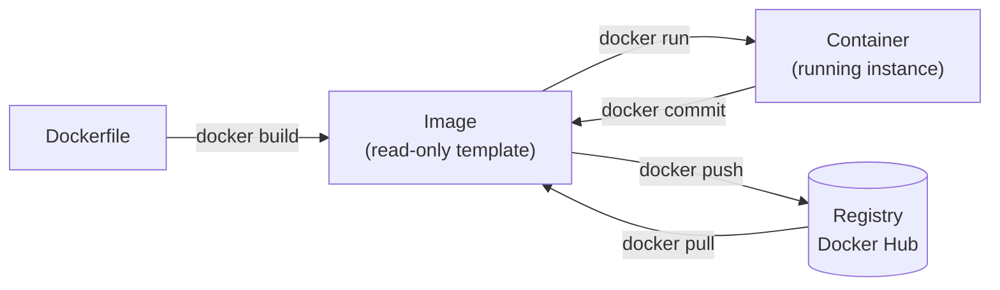

<div class="hero-section" style="background: linear-gradient(135deg, #0066cc 0%, #00aaff 100%); color: white; padding: 2rem; margin: -2rem -3rem 2rem -3rem; text-align: center;">
  <h1 style="color: white; margin: 0; font-size: 2.25rem;">Docker Essentials</h1>
  <p style="font-size: 1.1rem; margin-top: 0.5rem; opacity: 0.9;">Quick reference for container commands and operations</p>
</div>

A **command cheat sheet** — the Docker commands you reach for during daily development, grouped by task. It assumes you already know what containers are. For the concepts behind these commands, see [Docker Fundamentals](docker/fundamentals.html) (how images, layers, and the runtime work) and [Dockerfiles](docker/dockerfiles.html) / [Advanced Docker](docker/advanced.html) (building and optimizing your own images).

### Jump to a task

<div class="command-grid">
  <div class="command-card"><a href="#container-lifecycle"><b>Container Lifecycle</b></a><p>run, stop, exec, logs</p></div>
  <div class="command-card"><a href="#image-management"><b>Images</b></a><p>build, pull, tag, push</p></div>
  <div class="command-card"><a href="#docker-compose"><b>Compose</b></a><p>up, down, multi-service</p></div>
  <div class="command-card"><a href="#networking"><b>Networking</b></a><p>networks &amp; volumes</p></div>
  <div class="command-card"><a href="#debugging--troubleshooting"><b>Debugging</b></a><p>stats, inspect, top</p></div>
  <div class="command-card"><a href="#system-maintenance"><b>Cleanup</b></a><p>prune &amp; disk usage</p></div>
</div>

### The mental model



A **Dockerfile** is a recipe; `docker build` turns it into an **image** (an immutable template); `docker run` starts a **container** (a live instance) from that image. Registries store and share images.

## Container Lifecycle

### Running Containers

```bash
# Run a container from an image
docker run <image>

# Run in detached mode (background)
docker run -d <image>

# Run with interactive terminal
docker run -it <image> /bin/bash

# Run with port mapping (host:container)
docker run -p 8080:80 <image>

# Run with volume mount
docker run -v /host/path:/container/path <image>

# Run with environment variables
docker run -e "ENV_VAR=value" <image>

# Run with automatic removal when stopped
docker run --rm <image>

# Run with custom name
docker run --name my-container <image>
```

These flags combine freely. The ones you will reach for constantly:

| Flag | Does | Typical use |
|------|------|-------------|
| `-d` | Detached (background) | Long-running services |
| `-it` | Interactive + TTY | Shells and REPLs |
| `-p host:container` | Publish a port | Expose a web server |
| `-v host:container` | Mount a volume / bind dir | Persist data, live-reload code |
| `-e KEY=value` | Set an environment variable | Config and secrets |
| `--rm` | Auto-remove on exit | Throwaway/test containers |
| `--name` | Assign a stable name | Reference without the ID |

A common all-in-one invocation: `docker run -d --rm --name web -p 8080:80 -e ENV=prod nginx`.

### Managing Containers

```bash
# List running containers
docker ps

# List all containers (including stopped)
docker ps -a

# Stop a running container
docker stop <container>

# Start a stopped container
docker start <container>

# Restart a container
docker restart <container>

# Remove a container
docker rm <container>

# Remove all stopped containers
docker container prune

# Force remove running container
docker rm -f <container>
```

### Interacting with Containers

```bash
# Execute command in running container
docker exec <container> <command>

# Open interactive shell in container
docker exec -it <container> /bin/bash

# View container logs
docker logs <container>

# Follow logs in real-time
docker logs -f <container>

# Show last N lines of logs
docker logs --tail 100 <container>

# Copy files to/from container
docker cp <container>:/path/to/file /local/path
docker cp /local/file <container>:/path/to/file
```

## Image Management

### Working with Images

```bash
# List local images
docker images

# Pull image from registry
docker pull <image>:<tag>

# Build image from Dockerfile
docker build -t <name>:<tag> .

# Build with no cache
docker build --no-cache -t <name>:<tag> .

# Tag an image
docker tag <image> <new-name>:<tag>

# Push image to registry
docker push <image>:<tag>

# Remove an image
docker rmi <image>

# Remove unused images
docker image prune

# Remove all unused images
docker image prune -a
```

### Inspecting Images

```bash
# Show image details
docker inspect <image>

# Show image history/layers
docker history <image>

# Search Docker Hub
docker search <term>
```

## Docker Compose

<div class="notice--info">
  <p><strong><code>docker compose</code> vs <code>docker-compose</code>.</strong> Modern Docker ships Compose v2 as a plugin invoked with a space — <code>docker compose up</code>. The hyphenated <code>docker-compose</code> is the legacy v1 binary, now end-of-life. The commands below are interchangeable in syntax; prefer the spaced form on current installs.</p>
</div>

### Basic Operations

```bash
# Start services defined in compose.yaml
docker compose up

# Start in detached mode
docker compose up -d

# Stop services
docker compose down

# Stop and remove volumes
docker compose down -v

# View service logs
docker compose logs

# Follow logs
docker compose logs -f

# List running services
docker compose ps
```

### Service Management

```bash
# Build or rebuild services
docker compose build

# Force rebuild without cache
docker compose build --no-cache

# Scale a service
docker compose up -d --scale web=3

# Execute command in service
docker compose exec <service> <command>

# Run one-off command
docker compose run <service> <command>
```

## Networking

```bash
# List networks
docker network ls

# Create a network
docker network create <name>

# Connect container to network
docker network connect <network> <container>

# Disconnect from network
docker network disconnect <network> <container>

# Inspect network
docker network inspect <network>

# Remove network
docker network rm <network>
```

## Volumes

```bash
# List volumes
docker volume ls

# Create a volume
docker volume create <name>

# Inspect volume
docker volume inspect <name>

# Remove volume
docker volume rm <name>

# Remove unused volumes
docker volume prune
```

## System Maintenance

```bash
# Show disk usage
docker system df

# Show detailed disk usage
docker system df -v

# Remove all unused resources
docker system prune

# Remove everything including volumes
docker system prune -a --volumes

# Show system-wide information
docker info

# Show Docker version
docker version
```

## Debugging & Troubleshooting

```bash
# View container resource usage
docker stats

# View resource usage for specific containers
docker stats <container1> <container2>

# Inspect container details
docker inspect <container>

# View container processes
docker top <container>

# Show container port mappings
docker port <container>

# View container changes (filesystem diff)
docker diff <container>
```

## Common Patterns

### Development Environment

```bash
# Run with live code reload (mount source directory)
docker run -v $(pwd):/app -w /app node:18 npm run dev

# Run database for development
docker run -d \
  --name postgres-dev \
  -e POSTGRES_PASSWORD=devpass \
  -p 5432:5432 \
  postgres:15
```

### Quick Testing

```bash
# Run temporary container for testing
docker run --rm -it alpine sh

# Test network connectivity from container
docker run --rm alpine ping -c 4 google.com

# Quick Python environment
docker run --rm -it -v $(pwd):/work -w /work python:3.11 python
```

### Cleanup Commands

```bash
# Remove all stopped containers, unused networks, and dangling images
docker system prune

# Full cleanup (includes unused images and volumes)
docker system prune -a --volumes

# Remove containers older than 24h
docker container prune --filter "until=24h"
```

---

## Quick Reference Card

| Task | Command |
|------|---------|
| Run container | `docker run <image>` |
| Run interactive | `docker run -it <image> bash` |
| List containers | `docker ps -a` |
| Stop container | `docker stop <container>` |
| Remove container | `docker rm <container>` |
| View logs | `docker logs <container>` |
| Execute command | `docker exec -it <container> bash` |
| List images | `docker images` |
| Build image | `docker build -t <name> .` |
| Pull image | `docker pull <image>` |
| Compose up | `docker compose up -d` |
| Compose down | `docker compose down` |
| System cleanup | `docker system prune -a` |

---

## Key Takeaways

- **Build → run → ship:** `docker build` makes images, `docker run` starts containers, `push`/`pull` move images through a registry.
- Use `-d` for background, `-it` for an interactive shell, `-p` to publish ports, `-v` to mount volumes.
- `docker compose up -d` manages multi-container apps from a single YAML file.
- Reclaim disk with `docker system prune` — add `-a --volumes` for an aggressive cleanup.
- Debug live containers with `logs -f`, `exec -it ... bash`, `stats`, and `inspect`.

## See Also

- [Docker Fundamentals](docker/fundamentals.html) — core concepts and architecture explained
- [Docker Storage & Security](docker/storage-security.html) — volumes, networking, and security best practices
- [Dockerfiles Guide](docker/dockerfiles.html) — building custom images
- [Advanced Docker](docker/advanced.html) — multi-stage builds, optimization, and orchestration
- [Kubernetes](kubernetes/) — container orchestration at scale
- [CI/CD](ci-cd/) — automating Docker workflows in pipelines
