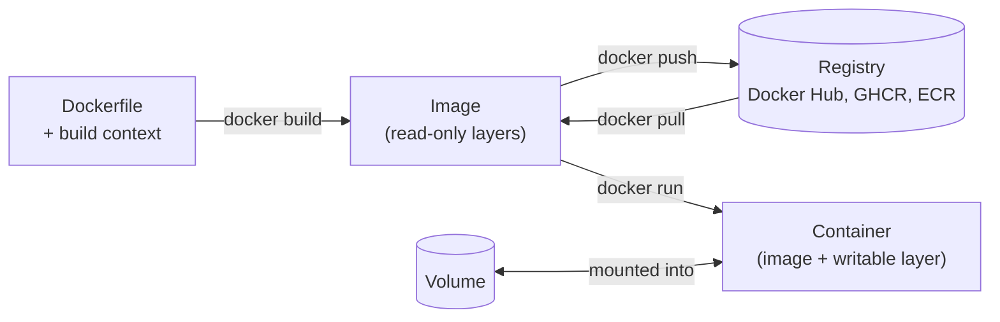
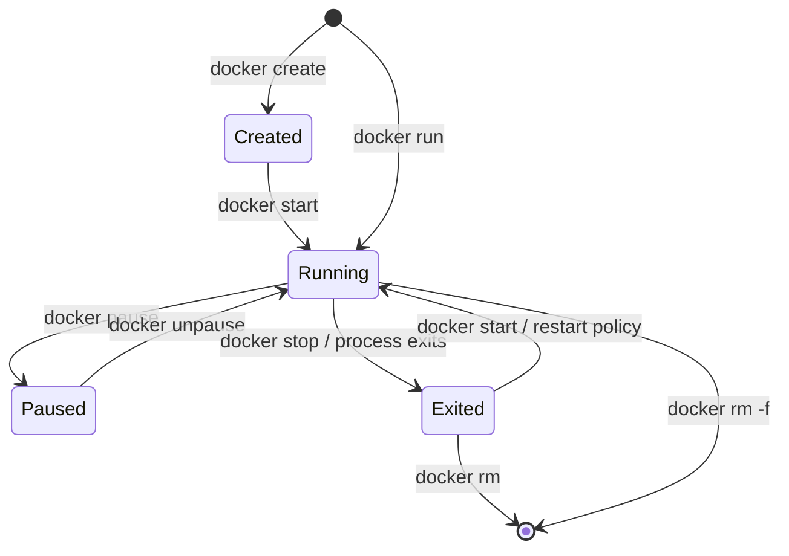

# Docker Essentials

This page is a task-organized reference for the Docker commands used in day-to-day development: running and managing containers, building and publishing images, multi-service applications with Compose, networking, storage, debugging and disk cleanup. It assumes you know what a container is. For the concepts behind the commands, see [Docker Fundamentals](docker/fundamentals.html); for writing and optimizing images, see [Dockerfiles](docker/dockerfiles.html) and [Advanced Docker](docker/advanced.html).

Commands reflect **Docker Engine 29** (current release line as of September 2026) with the Compose v2 plugin and the BuildKit builder, both of which are the defaults on current installations.

## Core concepts



| Object | What it is | Lifetime |
|--------|------------|----------|
| **Image** | An immutable stack of filesystem layers plus metadata (entrypoint, env, ports), identified by a content digest and referenced by `name:tag` | Until deleted; shared between containers |
| **Container** | A running (or stopped) instance of an image: isolated processes with a thin writable layer on top | Writable layer is lost when the container is removed |
| **Volume** | Storage managed by Docker, mounted into containers | Independent of any container |
| **Network** | A virtual network that containers attach to | Independent of any container |
| **Registry** | A server that stores and distributes images | External |

Anything a container writes outside a mounted volume disappears with `docker rm`. Treat containers as disposable and put state in volumes or external services.

### Command forms

Docker groups commands by object (`docker container ...`, `docker image ...`). The older top-level shortcuts remain supported and are what most people type; both forms appear below.

| Shortcut | Full form |
|----------|-----------|
| `docker ps` | `docker container ls` |
| `docker run` / `exec` / `logs` / `rm` | `docker container run` / `exec` / `logs` / `rm` |
| `docker images` | `docker image ls` |
| `docker rmi` | `docker image rm` |
| `docker build` | `docker buildx build` (BuildKit) |

## Containers

### Running a container

```bash
docker run <image>                          # run in the foreground
docker run -d --name web -p 8080:80 nginx   # detached, named, port published
docker run --rm -it ubuntu:24.04 bash       # interactive shell, deleted on exit
docker run --rm -e LOG_LEVEL=debug --env-file .env <image>
docker run -d --restart unless-stopped <image>
```

| Flag | Effect | Typical use |
|------|--------|-------------|
| `-d` | Run detached in the background | Long-running services |
| `-it` | Keep STDIN open and allocate a TTY | Shells and REPLs |
| `--rm` | Remove the container when it exits | One-off and test containers |
| `--name <name>` | Assign a stable name | Referring to it without the ID |
| `-p host:container` | Publish a container port on the host | Exposing a web server; `-p 127.0.0.1:8080:80` binds to localhost only |
| `-v src:dst` / `--mount` | Mount a volume or host directory | Persistent data, live-reloading source |
| `-e KEY=value`, `--env-file` | Set environment variables | Configuration |
| `--network <net>` | Attach to a network | Letting containers reach each other by name |
| `--restart <policy>` | `no`, `on-failure[:N]`, `always`, `unless-stopped` | Services that should survive crashes and reboots |
| `-u uid:gid` | Run as a specific user | Avoiding root; matching host file ownership |
| `--memory 512m`, `--cpus 1.5` | Resource limits (cgroups) | Preventing one container from starving the host |
| `--init` | Run a minimal init as PID 1 | Correct signal handling and zombie reaping |
| `--read-only` | Make the root filesystem read-only | Hardening |
| `--platform linux/amd64` | Choose an image architecture | Running amd64 images on arm64 hosts (emulated) |

Arguments after the image name replace the image's default `CMD`; use `--entrypoint` to replace the `ENTRYPOINT`.

### Lifecycle

A container moves through a small set of states, and most management commands are transitions between them:



```bash
docker ps                     # running containers
docker ps -a                  # all containers, including exited
docker stop <container>       # SIGTERM, then SIGKILL after 10 s (-t to change)
docker start <container>
docker restart <container>
docker kill <container>       # SIGKILL immediately (or -s <signal>)
docker rm <container>         # remove an exited container
docker rm -f <container>      # stop and remove
docker container prune        # remove all exited containers
```

`docker stop` sends `SIGTERM` to PID 1 in the container. If the application runs under a shell wrapper (`CMD npm start` in shell form) the signal may never reach it, and every stop waits the full timeout; use the exec form of `CMD` or `--init`.

### Working inside a container

```bash
docker exec -it <container> sh              # shell in a running container (bash if installed)
docker exec <container> env                 # run a single command
docker exec -u root -it <container> sh      # as a different user

docker logs <container>                     # stdout/stderr so far
docker logs -f --tail 100 <container>       # follow, starting from the last 100 lines
docker logs --since 10m -t <container>      # last 10 minutes, with timestamps

docker cp <container>:/etc/nginx/nginx.conf ./nginx.conf   # container to host
docker cp ./site <container>:/usr/share/nginx/html        # host to container
```

## Images

### Building

```bash
docker build -t myapp:1.4 .                         # build from ./Dockerfile
docker build -t myapp:dev -f docker/Dockerfile.dev .
docker build --target test -t myapp:test .          # stop at a named multi-stage stage
docker build --build-arg VERSION=1.4 -t myapp:1.4 .
docker build --secret id=npmrc,src=$HOME/.npmrc .   # secret available only during the build
docker build --no-cache -t myapp:1.4 .              # ignore the layer cache
docker build --pull -t myapp:1.4 .                  # re-pull base images first

# Multi-platform image, pushed directly to a registry
docker buildx build --platform linux/amd64,linux/arm64 -t ghcr.io/me/myapp:1.4 --push .
```

The final `.` is the **build context**: the directory sent to the builder. Keep it small with a `.dockerignore` (exclude `.git`, `node_modules`, build output and secrets); it speeds builds and prevents files from leaking into images. Build secrets passed with `--secret` are mounted with `RUN --mount=type=secret,id=npmrc` and never stored in a layer, unlike `ARG` or `ENV`.

Docker Desktop's `docker init` generates a starter `Dockerfile`, `.dockerignore` and `compose.yaml` for common languages.

### Pulling, tagging and publishing

```bash
docker pull postgres:18                      # tag
docker pull nginx@sha256:<digest>            # exact, immutable content
docker images                                # list local images
docker tag myapp:1.4 ghcr.io/me/myapp:1.4    # add a registry-qualified name
docker login ghcr.io
docker push ghcr.io/me/myapp:1.4
docker rmi myapp:1.4                         # remove a tag (and the image if unreferenced)
```

A tag such as `postgres:18` is a mutable pointer that the publisher can move; a digest (`@sha256:...`) always refers to the same bytes. Pin digests, or at least specific version tags, in production and CI; avoid `latest`.

### Inspecting

```bash
docker image inspect <image>                 # full metadata as JSON
docker history <image>                       # layers and the instruction that created each
docker image ls --digests                    # show content digests
docker scout cves <image>                    # vulnerability scan (Docker Scout)
```

## Compose

**Compose** runs multi-container applications described in a YAML file (`compose.yaml` by convention; `docker-compose.yml` is still recognised). Compose v2 is a CLI plugin invoked as `docker compose`; the standalone Python `docker-compose` v1 reached end of life in 2023. The top-level `version:` key is obsolete and only produces a warning; omit it.

```yaml
# compose.yaml
services:
  web:
    build: .
    ports:
      - "8080:8000"
    environment:
      DATABASE_URL: postgres://postgres:dev@db:5432/postgres
    depends_on:
      db:
        condition: service_healthy     # wait for the healthcheck, not just container start
    develop:
      watch:                           # used by `docker compose watch`
        - action: sync
          path: ./src
          target: /app/src
        - action: rebuild
          path: requirements.txt

  db:
    image: postgres:18
    environment:
      POSTGRES_PASSWORD: dev
    volumes:
      - pgdata:/var/lib/postgresql     # PostgreSQL 18+ volume path
    healthcheck:
      test: ["CMD-SHELL", "pg_isready -U postgres"]
      interval: 5s
      retries: 10

volumes:
  pgdata:
```

Compose creates a network for the project, and each service is reachable from the others by its service name (`db` above).

```bash
docker compose up -d                 # create and start everything in the background
docker compose up -d --build --wait  # rebuild images, wait until services are healthy
docker compose watch                 # sync or rebuild on file changes (develop.watch)
docker compose ps                    # service status
docker compose logs -f web           # follow one service's logs
docker compose exec db psql -U postgres
docker compose run --rm web pytest   # one-off command in a new container
docker compose up -d --scale web=3   # run several replicas (drop fixed host ports first)
docker compose config                # print the fully resolved configuration
docker compose down                  # stop and remove containers and networks
docker compose down -v               # also remove named volumes (destroys data)
```

Use `compose.override.yaml` (merged automatically) or `-f` with several files to layer development settings over a base file, and `profiles:` to keep optional services (debug tools, seed jobs) out of the default `up`.

## Networking

```bash
docker network ls
docker network create appnet
docker run -d --name api --network appnet myapi
docker run --rm --network appnet curlimages/curl http://api:8000/health
docker network connect appnet <container>
docker network disconnect appnet <container>
docker network inspect appnet
docker network rm appnet
```

| Driver | Behaviour | Use for |
|--------|-----------|---------|
| `bridge` (default) | Private network on one host, NAT to the outside | Most single-host setups |
| `host` | Shares the host's network stack; no isolation, no port mapping | Maximum network performance on Linux |
| `none` | Loopback only | Fully isolated jobs |
| `overlay` | Spans multiple Docker hosts (Swarm) | Multi-host services |
| `macvlan` / `ipvlan` | Container gets an address on the physical LAN | Appliances that must look like LAN devices |

Containers on a **user-defined** bridge network can resolve each other by container name through Docker's embedded DNS; containers on the default `bridge` network cannot. Create a network (or let Compose create one) whenever containers need to talk. See [Docker Networking](docker/docker-networking.html#default-bridge-vs-user-defined-bridge).

## Storage

```bash
docker volume create pgdata
docker volume ls
docker volume inspect pgdata
docker volume rm pgdata
docker volume prune              # unused anonymous volumes
docker volume prune -a           # unused named volumes too

# Named volume (Docker-managed) vs bind mount (host path)
docker run -v pgdata:/var/lib/postgresql postgres:18
docker run -v "$PWD":/app -w /app node:24 npm test
docker run --mount type=bind,src="$PWD",dst=/app,readonly node:24 ls /app
docker run --mount type=tmpfs,dst=/tmp <image>
```

| Type | Data lives | Best for |
|------|------------|----------|
| **Named volume** | Docker's storage area (`/var/lib/docker/volumes` on Linux) | Databases and any persistent service data |
| **Bind mount** | An existing host path | Source code during development, config files |
| **tmpfs** | Host memory only | Scratch space and secrets that must not touch disk |

`-v` creates a missing host directory silently; `--mount` fails instead, which catches typos. Back up a volume by mounting it into a throwaway container: `docker run --rm -v pgdata:/data -v "$PWD":/backup alpine tar czf /backup/pgdata.tgz -C /data .` (stop the database first, or use its own dump tool). See [Docker Storage & Security](docker/storage-security.html).

## Debugging

```bash
docker stats                            # live CPU, memory, network, I/O per container
docker top <container>                  # processes inside the container
docker inspect <container>              # full configuration and state as JSON
docker port <container>                 # published port mappings
docker diff <container>                 # files changed in the writable layer
docker events --since 30m               # daemon events: starts, dies, OOM kills
```


```bash
# Extract single fields with Go templates
docker inspect -f '{{.State.Status}} {{.State.ExitCode}} {{.State.OOMKilled}}' <container>
docker inspect -f '{{json .NetworkSettings.Networks}}' <container>
docker ps --format 'table {{.Names}}\t{{.Status}}\t{{.Ports}}'
```


| Symptom | First checks |
|---------|--------------|
| Container exits immediately | `docker logs <c>`; `docker ps -a` for the exit code. A detached container needs a foreground process. |
| Exit code 137 | Killed by `SIGKILL`: check `OOMKilled` in `docker inspect`, then raise `--memory` or fix the leak |
| Port not reachable | `docker port <c>`; confirm the app listens on `0.0.0.0`, not `127.0.0.1`, inside the container |
| Containers cannot reach each other | Same user-defined network? Use the container or service name, not `localhost` |
| Permission denied on a bind mount | UID mismatch between container user and host files; run with `-u "$(id -u):$(id -g)"` |
| Image has no shell (distroless, scratch) | Attach a tools container to its namespaces: `docker run --rm -it --network container:<c> --pid container:<c> nicolaka/netshoot` |

## Disk cleanup

Images, stopped containers and build cache accumulate quickly. `docker system df` shows where the space went.

| Command | Removes |
|---------|---------|
| `docker container prune` | Stopped containers |
| `docker image prune` | Dangling images (untagged layers left behind by rebuilds) |
| `docker image prune -a` | Every image not used by a container |
| `docker volume prune` | Unused anonymous volumes (add `-a` for named volumes) |
| `docker builder prune` | BuildKit build cache |
| `docker system prune` | Stopped containers, unused networks, dangling images and build cache |
| `docker system prune -a --volumes` | All of the above plus every unused image and unused anonymous volumes |

```bash
docker system df -v                          # detailed usage
docker container prune --filter "until=24h"  # only containers stopped over a day ago
docker image prune -a --filter "until=168h"  # unused images older than a week
```

Volume pruning deletes data permanently. Check `docker volume ls` before adding `--volumes` or `-a`.

## Common recipes

```bash
# Throwaway shells and runtimes
docker run --rm -it alpine sh
docker run --rm -it -v "$PWD":/work -w /work python:3.14 python
docker run --rm -v "$PWD":/app -w /app node:24 npm run build

# Local PostgreSQL for development
docker run -d --name pg -e POSTGRES_PASSWORD=dev \
  -p 127.0.0.1:5432:5432 -v pgdata:/var/lib/postgresql postgres:18

# Network checks from inside the Docker network
docker run --rm --network appnet nicolaka/netshoot dig api
docker run --rm curlimages/curl -sI https://example.com

# Which image and command is a container running?
docker inspect -f '{{.Config.Image}} {{.Config.Cmd}}' <container>
```

## Recent changes to be aware of

| Change | Since | Effect |
|--------|-------|--------|
| BuildKit is the default builder; `docker build` runs via Buildx | Engine 23.0 | Parallel stages, cache mounts, build secrets |
| `docker volume prune` skips named volumes unless `-a` is given | Engine 23.0 | Safer default cleanup |
| Compose v1 (`docker-compose`) end of life | 2023 | Use `docker compose` |
| containerd image store is the default for new installations | Engine 29.0 | Native multi-platform images and attestations in the local store |
| Docker Content Trust (`DOCKER_CONTENT_TRUST`) removed from the CLI | Engine 29.0 | Use Sigstore/cosign or Notation for image signing |
| cgroup v1 deprecated | Engine 29.0 | Hosts should run cgroup v2 (default on current Linux distributions) |

## Quick reference

| Task | Command |
|------|---------|
| Run a service in the background | `docker run -d --name web -p 8080:80 nginx` |
| Interactive throwaway shell | `docker run --rm -it alpine sh` |
| List containers | `docker ps -a` |
| Shell into a running container | `docker exec -it <c> sh` |
| Follow logs | `docker logs -f <c>` |
| Stop and remove | `docker rm -f <c>` |
| Build and tag | `docker build -t <name>:<tag> .` |
| Push | `docker push <registry>/<name>:<tag>` |
| Start a Compose app | `docker compose up -d` |
| Tear down a Compose app | `docker compose down` |
| Disk usage | `docker system df` |
| Reclaim space | `docker system prune` |

## See also

- [Docker Fundamentals](docker/fundamentals.html) — images, layers, namespaces and the container runtime
- [Dockerfiles](docker/dockerfiles.html) — writing and optimizing images
- [Advanced Docker](docker/advanced.html) — multi-stage builds, BuildKit and orchestration
- [Docker Networking](docker/docker-networking.html) — bridge, overlay and DNS in depth
- [Docker Storage & Security](docker/storage-security.html) — volumes and container hardening
- [Kubernetes](kubernetes/) — orchestrating containers at scale
- [CI/CD](ci-cd/) — building and shipping images in pipelines

## References

- [Docker CLI reference](https://docs.docker.com/reference/cli/docker/)
- [Compose file reference](https://docs.docker.com/reference/compose-file/)
- [Docker Engine release notes](https://docs.docker.com/engine/release-notes/)
- [Docker build documentation](https://docs.docker.com/build/)
