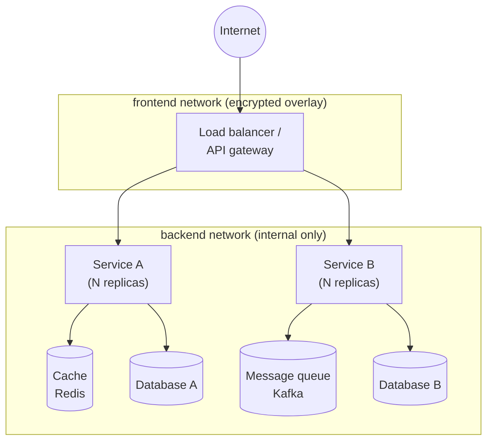
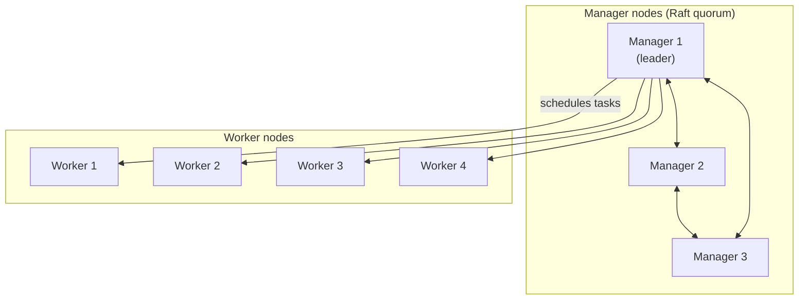
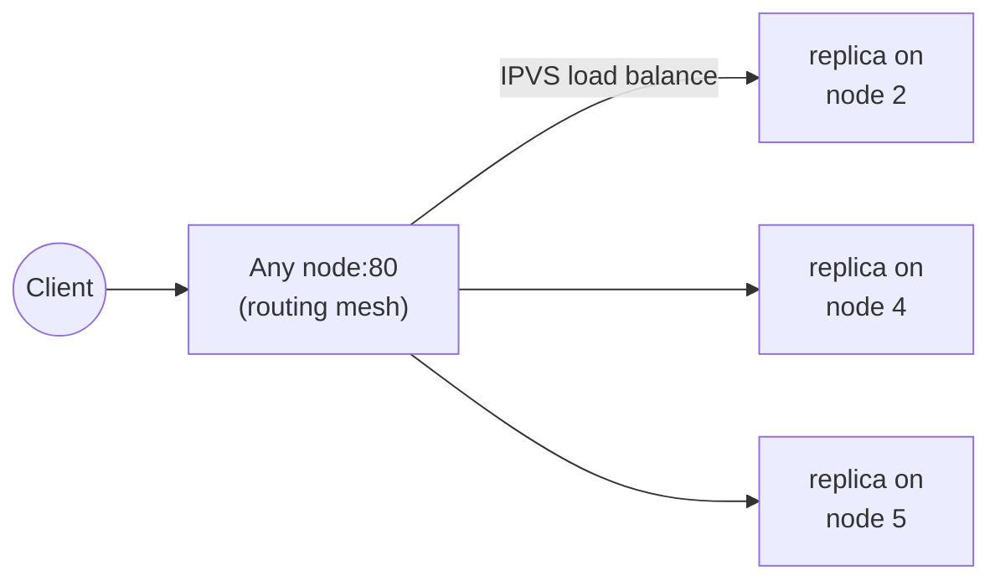

<div class="hero-section" style="background: linear-gradient(135deg, #0066cc 0%, #00aaff 100%); color: white; padding: 3rem 2rem; margin: -2rem -3rem 2rem -3rem; text-align: center;">
  <h1 style="color: white; margin: 0; font-size: 2.5rem;">Docker: Production Patterns</h1>
  <p style="font-size: 1.25rem; margin-top: 1rem; opacity: 0.9;">Real-world architectures, Docker Compose at scale, Docker Swarm orchestration, and production case studies.</p>
</div>

[Docker](./) &raquo; Production Patterns

<div class="intro-card">
  <p class="lead-text">This page assumes you are comfortable with images, containers, and Dockerfiles. It looks at how Docker is run <strong>in production at scale</strong>: the recurring shapes of real-world architectures, how to grow a Docker Compose file from a laptop convenience into a deployable production stack, how Docker Swarm turns a fleet of hosts into one cluster, and what migrating to containers looks like through worked case studies. Treat it as a tour of "what good looks like" once the basics are second nature.</p>
</div>

<div class="notice--info">
  <p><strong>Two topics moved out of this page.</strong> The multi-container <em>design patterns</em> (Sidecar, Ambassador, Adapter, Init) and image/runtime <em>security patterns</em> (distroless, non-root, Falco) now live on <a href="docker-design-patterns.html">Docker: Design Patterns</a>. The <em>runtime alternatives</em> below Docker — gVisor, Kata, Firecracker microVMs, and WebAssembly/WASI — now live on <a href="../container-runtimes.html">Container Runtimes &amp; Alternatives</a>. This page links to both rather than duplicating them.</p>
</div>

## What "Production" Adds

A container that runs on your laptop and a container that runs in production are the same artifact, but the surrounding machinery is entirely different. Production deployment is mostly about the *non-functional* requirements the happy-path demo never exercises:

- **Replication and load distribution** — one instance is a single point of failure; production runs N replicas behind a load balancer.
- **Zero-downtime updates** — new versions roll out a few replicas at a time, with health gates and automatic rollback if the new version is unhealthy.
- **Resource governance** — CPU and memory limits so one noisy service cannot starve its neighbors, and reservations so the scheduler places work where it fits.
- **Secret management** — credentials injected at runtime, never baked into the image or committed to a compose file.
- **Network segmentation** — public-facing services on one network, databases on an internal-only network the outside world cannot reach.
- **Observability** — health checks, metrics, and logs wired in so failures are detected before users notice.

The rest of this page shows how Compose and Swarm express each of these, anchored in real architectures.

## Real-World Architectures

Most production Docker deployments fall into a handful of recurring shapes. Recognizing which one you are building tells you which concerns to prioritize.



| Architecture | Shape | Where Docker fits |
|--------------|-------|-------------------|
| **Microservices** | Many small services behind a gateway, each owning its data | One image per service; replicas scaled independently |
| **Worker pool** | A queue feeding a horizontally scaled set of stateless workers | Scale the worker service to match queue depth |
| **Edge / CDN origin** | Stateless app servers fronted by a CDN, sharing a cache tier | Tiny, fast-starting images for rapid scale-out |
| **Batch / ETL** | Short-lived jobs that run to completion on a schedule | Run-once containers; orchestrator handles retries |

The microservices shape is the one most teams reach for, and it is the architecture the case study below walks through end to end.

## Docker Compose at Scale

Docker Compose starts life as a developer convenience — `docker compose up` to bring a stack online locally. The same file format, with the `deploy:` block and a few discipline changes, becomes a legitimate production descriptor (deployed directly by Docker Swarm via `docker stack deploy`, or used as the source of truth a CI pipeline translates). Growing a compose file to production scale means layering on the concerns from the previous section.

### Replicas, Resources, and Update Policy

The `deploy:` block is the heart of a production compose service. It is *ignored* by plain `docker compose up` but honored by `docker stack deploy` (Swarm). It declares how many replicas to run, how to bound their resource use, and how to roll new versions out.

```yaml
services:
  product-service:
    image: company/product-service:${VERSION}
    deploy:
      replicas: 5
      resources:
        limits:
          cpus: '2'
          memory: 2G
        reservations:
          cpus: '1'
          memory: 1G
      update_config:
        parallelism: 2          # update 2 replicas at a time
        delay: 10s              # wait 10s between batches
        failure_action: rollback # auto-revert if the new version is unhealthy
        order: start-first      # start the new task before stopping the old
      restart_policy:
        condition: on-failure
        max_attempts: 3
```

Two distinctions matter here. **Limits vs. reservations:** `limits` is the ceiling the kernel enforces (the container is throttled or OOM-killed past it); `reservations` is the floor the scheduler guarantees when *placing* the task, so it only lands on a node with that much free capacity. **`order: start-first` vs. `stop-first`:** start-first briefly runs old and new replicas together for true zero-downtime (at the cost of extra capacity during the rollout); stop-first is cheaper but drops a replica's worth of capacity mid-update.

### Health Checks Gate the Rollout

An update is only "zero-downtime" if Docker knows when a new replica is actually ready. A health check turns `failure_action: rollback` from a hope into a guarantee — an unhealthy new replica never receives traffic and trips the rollback.

```yaml
services:
  product-service:
    image: company/product-service:${VERSION}
    healthcheck:
      test: ["CMD", "curl", "-f", "http://localhost:8080/health"]
      interval: 30s
      timeout: 10s
      retries: 3
      start_period: 40s     # grace window before failures count, for slow boots
```

During a rolling update, Swarm starts a new task, waits for it to report `healthy`, and only then proceeds to the next batch. If a task fails its health check within the `update_config` window, the deploy is reverted to the previous image.

### Secrets and Network Segmentation

Two production disciplines that a local compose file usually skips. **Secrets** are mounted as files under `/run/secrets/<name>` rather than passed as environment variables (which leak into `docker inspect`, logs, and child-process environments). Many images support the `*_FILE` convention — point them at the secret path:

```yaml
services:
  product-db:
    image: postgres:15-alpine
    environment:
      POSTGRES_PASSWORD_FILE: /run/secrets/db_password
    secrets:
      - db_password

secrets:
  db_password:
    external: true    # created out-of-band: docker secret create db_password ./pw.txt
```

**Network segmentation** puts public-facing services on one network and data stores on an internal-only network. Marking the backend network `internal: true` removes its default gateway, so containers there have *no route to the outside world* — a database cannot be reached from the internet even if a port is misconfigured, and a compromised service cannot exfiltrate over it.

```yaml
networks:
  frontend:
    driver: overlay
    driver_opts:
      encrypted: "true"     # encrypt cross-node traffic on this overlay
  backend:
    driver: overlay
    driver_opts:
      encrypted: "true"
    internal: true          # no egress: not reachable from outside the cluster
```

### Compose vs. an Orchestrator

A production compose stack carries you a long way, but it has a ceiling. Compose (even via Swarm's `stack deploy`) does not give you horizontal *cluster autoscaling*, sophisticated scheduling (affinity/anti-affinity, taints), or the vast ecosystem of operators and CRDs that Kubernetes does. The decision is one of operational scale:

| Need | Compose / Swarm stack | Kubernetes |
|------|-----------------------|------------|
| Single host, handful of services | Ideal — minimal overhead | Overkill |
| Small multi-node cluster, simple scaling | Good fit (Swarm) | Workable but heavy |
| Large fleet, advanced scheduling, autoscaling | Hits limits | Designed for this |
| Rich ecosystem (operators, service mesh, GitOps) | Limited | Extensive |

When a compose stack stops fitting, the next step up is usually Docker Swarm (covered next) for a gentle move, or [Kubernetes](../kubernetes/) for full-scale orchestration.

## Docker Swarm

Docker Swarm is Docker's built-in orchestrator: it turns a set of Docker hosts into a single logical cluster and runs the production compose stacks above across that cluster, no extra tooling required. The CLI essentials — `docker swarm init`, `docker swarm join`, `docker service create`, and `docker stack deploy` — are introduced in [Dockerfiles &amp; CI/CD](dockerfiles.html#docker-swarm-native-orchestration). This section focuses on what running Swarm *in production* requires.

### Cluster Topology: Managers and Workers

A Swarm has two node roles. **Managers** maintain cluster state in a Raft-replicated store and make scheduling decisions; **workers** run the containers managers assign them. Managers can also run workloads, but in production they are usually dedicated to keep the control plane stable.



The control plane uses Raft consensus, which demands a **quorum** — a strict majority of managers must be reachable to make decisions. This is why manager counts must be **odd**: with `2m+1` managers the cluster tolerates `m` failures.

| Managers | Quorum (majority) | Failures tolerated |
|----------|-------------------|--------------------|
| 1 | 1 | 0 (no HA) |
| 3 | 2 | 1 |
| 5 | 3 | 2 |
| 7 | 4 | 3 |

An *even* count is actively worse than the odd number below it: 4 managers still only tolerate 1 failure (quorum is 3) while exposing more nodes that can fail. Spread managers across availability zones so a single zone outage never costs you quorum, and keep the count at 3 or 5 — more managers means more Raft coordination overhead, not more resilience.

### Overlay Networking and the Routing Mesh

Swarm's overlay networks span every node, so a container on host A reaches a container on host B by service name as if they were local — Docker tunnels the traffic (VXLAN) and, with `encrypted: "true"`, encrypts it across the wire.

The **routing mesh** is the feature that makes published ports work cluster-wide: when you publish a service port, *every* node in the swarm listens on it, and an internal IPVS load balancer forwards each incoming connection to a healthy replica wherever it runs. A client can hit any node's IP and reach the service even if no replica runs on that node.



This means an external load balancer in front of the swarm can target *all* nodes without knowing which ones currently host a given service — the mesh handles the last hop.

### Production Stack: Constraints, Rollouts, and Rollback

A production Swarm stack combines placement control, rolling updates, and automatic rollback. Placement constraints and preferences steer tasks onto the right nodes (databases onto labeled storage nodes; replicas spread across zones for resilience):

```yaml
# stack.production.yml  →  docker stack deploy -c stack.production.yml shop
services:
  web:
    image: company/web:${VERSION}
    deploy:
      replicas: 6
      placement:
        constraints:
          - node.role == worker
        preferences:
          - spread: node.labels.zone   # balance replicas across zones
      update_config:
        parallelism: 2
        delay: 15s
        order: start-first
        failure_action: rollback
      rollback_config:
        parallelism: 0                 # roll all replicas back at once on failure
        order: stop-first
    networks:
      - frontend

  db:
    image: postgres:15-alpine
    deploy:
      replicas: 1
      placement:
        constraints:
          - node.labels.storage == ssd  # pin the DB to a storage-class node
    environment:
      POSTGRES_PASSWORD_FILE: /run/secrets/db_password
    secrets:
      - db_password
    networks:
      - backend

networks:
  frontend:
    driver: overlay
    driver_opts: { encrypted: "true" }
  backend:
    driver: overlay
    driver_opts: { encrypted: "true" }
    internal: true

secrets:
  db_password:
    external: true
```

Operating it day to day:

```bash
# Deploy or update the whole stack from one file
docker stack deploy -c stack.production.yml shop

# Watch a rolling update progress, replica by replica
docker service ps shop_web

# Ship a new version (image tag change) and let update_config roll it out
docker service update --image company/web:v2.4.0 shop_web

# Manually roll back the last update if needed
docker service rollback shop_web
```

The rollout is gated by each task's health check (defined as in the Compose section): a new replica must report healthy before the next batch starts, and a failure within the update window triggers the `rollback_config` policy automatically. Swarm secrets are encrypted in the Raft log at rest and delivered only to the nodes running a service that requests them, then mounted as in-memory files — never written to disk on the worker.

### Swarm vs. Kubernetes, Briefly

Swarm trades breadth for simplicity. It gives you clustering, overlay networking, secrets, rolling updates, and rollback with almost no learning curve and a single binary. It does *not* offer cluster autoscaling, a large operator ecosystem, or fine-grained scheduling. For small-to-medium fleets run by a small team, Swarm is often the right amount of orchestration; past that, teams graduate to [Kubernetes](../kubernetes/). The full comparison table lives on the [Dockerfiles &amp; CI/CD](dockerfiles.html#docker-swarm-native-orchestration) page.

## Case Studies

### E-Commerce Platform Migration to Microservices

A major e-commerce company migrated from a monolithic application to Docker-based microservices, reporting a 70% reduction in deployment time and roughly 50% infrastructure cost savings. The production stack below is the shape they landed on — an API gateway fronting independently scaled product and order services, each with its own database, plus shared cache and message-queue tiers, all wired across an encrypted public network and an internal-only backend network.

```yaml
# docker-compose.production.yml  (deployed via `docker stack deploy`)
version: '3.8'

services:
  # API Gateway — the only public-facing service
  gateway:
    image: company/api-gateway:${VERSION}
    deploy:
      replicas: 3
      resources:
        limits:
          cpus: '2'
          memory: 2G
        reservations:
          cpus: '1'
          memory: 1G
    ports:
      - "443:443"
    environment:
      - RATE_LIMIT=1000
      - JWT_SECRET_FILE=/run/secrets/jwt_key
    secrets:
      - jwt_key
    networks:
      - frontend
      - backend

  # Product Service — scaled to demand, rolling updates with auto-rollback
  product-service:
    image: company/product-service:${VERSION}
    deploy:
      replicas: 5
      update_config:
        parallelism: 2
        delay: 10s
        failure_action: rollback
    environment:
      - DB_HOST=product-db
      - CACHE_HOST=redis-product
    depends_on:
      - product-db
      - redis-product
    networks:
      - backend

  # Order Service — talks to its own DB and the message bus
  order-service:
    image: company/order-service:${VERSION}
    deploy:
      replicas: 3
    environment:
      - DB_HOST=order-db
      - KAFKA_BROKERS=kafka:9092
    depends_on:
      - order-db
      - kafka
    networks:
      - backend

  # Databases — one per service (database-per-service pattern)
  product-db:
    image: postgres:15-alpine
    volumes:
      - product-data:/var/lib/postgresql/data
    environment:
      POSTGRES_PASSWORD_FILE: /run/secrets/db_password
    secrets:
      - db_password
    networks:
      - backend

  order-db:
    image: postgres:15-alpine
    volumes:
      - order-data:/var/lib/postgresql/data
    environment:
      POSTGRES_PASSWORD_FILE: /run/secrets/db_password
    secrets:
      - db_password
    networks:
      - backend

  # Caching tier
  redis-product:
    image: redis:7-alpine
    command: redis-server --maxmemory 2gb --maxmemory-policy allkeys-lru
    deploy:
      replicas: 2
    networks:
      - backend

  # Message bus for asynchronous order events
  kafka:
    image: confluentinc/cp-kafka:latest
    environment:
      KAFKA_ZOOKEEPER_CONNECT: zookeeper:2181
      KAFKA_ADVERTISED_LISTENERS: PLAINTEXT://kafka:9092
    depends_on:
      - zookeeper
    networks:
      - backend

  zookeeper:
    image: confluentinc/cp-zookeeper:latest
    environment:
      ZOOKEEPER_CLIENT_PORT: 2181
    networks:
      - backend

networks:
  frontend:
    driver: overlay
    driver_opts:
      encrypted: "true"
  backend:
    driver: overlay
    driver_opts:
      encrypted: "true"
    internal: true          # databases & queue unreachable from the internet

volumes:
  product-data:
    driver: local
  order-data:
    driver: local

secrets:
  db_password:
    external: true
  jwt_key:
    external: true
```

**What makes this production-grade.** Every concern from earlier in the page appears: replicas with resource limits, rolling updates with auto-rollback, file-based secrets, a public/internal network split, and a database-per-service so the order and product domains scale and fail independently. The reported wins followed directly from these choices.

**Implementation highlights reported by the team:**

- **Service mesh** — Istio for advanced traffic management and observability (the Envoy data plane is the Ambassador pattern from [Design Patterns](docker-design-patterns.html)).
- **Auto-scaling** — Kubernetes HPA with custom metrics for demand-based scaling once they outgrew Swarm.
- **Zero-downtime** — rolling updates gated by health checks, exactly as the `update_config` above expresses.
- **Security** — mutual TLS between services and automated secret rotation.
- **Monitoring** — full observability with Prometheus, Grafana, and distributed tracing.

### Containerized ML Model Serving

A different production shape: a machine-learning team needed to serve trained models behind an HTTP API with reproducible, hardened images. The serving image is a multi-stage build that compiles dependencies in a fat builder stage, then copies only the virtual environment into a slim, non-root runtime — a small, CVE-light image that boots fast for scale-out.

```dockerfile
# Dockerfile for ML model serving
FROM python:3.12-slim AS builder

# Install build dependencies (only present in the builder stage)
RUN apt-get update && apt-get install -y \
    build-essential \
    && rm -rf /var/lib/apt/lists/*

# Create an isolated virtual environment
RUN python -m venv /opt/venv
ENV PATH="/opt/venv/bin:$PATH"

# Install Python dependencies
COPY requirements.txt .
RUN pip install --no-cache-dir -r requirements.txt

# Production stage — slim, no build toolchain
FROM python:3.12-slim

# Copy the prepared virtual environment from the builder
COPY --from=builder /opt/venv /opt/venv
ENV PATH="/opt/venv/bin:$PATH"

# Only the runtime shared libs the model needs
RUN apt-get update && apt-get install -y \
    libgomp1 \
    && rm -rf /var/lib/apt/lists/*

# Run as a non-root user
RUN useradd -m -u 1000 mluser
USER mluser

# Copy model and application code, owned by the runtime user
WORKDIR /app
COPY --chown=mluser:mluser model/ ./model/
COPY --chown=mluser:mluser src/ ./src/

# Health check so the orchestrator can gate traffic on readiness
HEALTHCHECK --interval=30s --timeout=10s --start-period=30s --retries=3 \
  CMD python -c "import requests; requests.get('http://localhost:8080/health').raise_for_status()"

# Serve the model with a production WSGI server
EXPOSE 8080
CMD ["gunicorn", "--bind", "0.0.0.0:8080", "--workers", "4", "--timeout", "120", "src.app:app"]
```

Training, by contrast, is a *batch* workload — a job that requests GPUs, runs to completion, and exits. It is expressed as a run-once container the orchestrator retries on failure (shown here as a Kubernetes `Job`, since GPU scheduling and per-job resource requests exceed what a Swarm service expresses cleanly):

```yaml
# kubernetes-job.yaml
apiVersion: batch/v1
kind: Job
metadata:
  name: model-training-job
spec:
  template:
    spec:
      containers:
      - name: training
        image: company/ml-training:latest
        resources:
          limits:
            nvidia.com/gpu: 2
            memory: 32Gi
            cpu: 8
          requests:
            nvidia.com/gpu: 2
            memory: 16Gi
            cpu: 4
        volumeMounts:
        - name: dataset
          mountPath: /data
        - name: model-output
          mountPath: /output
        env:
        - name: EPOCHS
          value: "100"
        - name: BATCH_SIZE
          value: "64"
        - name: LEARNING_RATE
          value: "0.001"
      volumes:
      - name: dataset
        persistentVolumeClaim:
          claimName: training-dataset
      - name: model-output
        persistentVolumeClaim:
          claimName: model-storage
      restartPolicy: OnFailure
      nodeSelector:
        gpu-type: nvidia-v100
```

The two halves of the ML platform illustrate the **service vs. batch** split from the architectures table: the serving image is a long-running, replicated, health-checked *service*; training is a short-lived, GPU-hungry *batch job* the orchestrator schedules, retries, and reaps.

## Putting It Into Practice

The patterns on this page — replicated compose stacks, segmented networks, Swarm rollouts with rollback, and the service-vs-batch split — all serve the same goals: high availability, safe delivery, and predictable behavior at scale. Which ones matter most depends on your role.

<div class="takeaway-grid">
  <div class="takeaway-card">
    <h4><i class="fas fa-book"></i> Newcomers</h4>
    <ul>
      <li>Solidify the basics in <a href="fundamentals.html">Fundamentals</a> before adopting these patterns</li>
      <li>Reach for a single Docker Compose file before any orchestrator</li>
      <li>Add the <code>deploy:</code> block and health checks before you scale past one host</li>
      <li>Follow security best practices from day one, not as a retrofit</li>
    </ul>
  </div>

  <div class="takeaway-card">
    <h4><i class="fas fa-code"></i> For Developers</h4>
    <ul>
      <li>Keep a single compose file as the source of truth from dev to prod</li>
      <li>Use multi-stage builds to keep production images small and fast to scale</li>
      <li>Implement health checks so rolling updates can gate on readiness</li>
      <li>Inject secrets as files, never as environment variables</li>
    </ul>
  </div>

  <div class="takeaway-card">
    <h4><i class="fas fa-server"></i> For DevOps/SRE</h4>
    <ul>
      <li>Run an odd number of Swarm managers across availability zones</li>
      <li>Segment networks: public frontend, internal-only backend</li>
      <li>Tune <code>update_config</code> and <code>rollback_config</code> for zero-downtime deploys</li>
      <li>Front the routing mesh with an external load balancer targeting all nodes</li>
    </ul>
  </div>

  <div class="takeaway-card">
    <h4><i class="fas fa-building"></i> For Architects</h4>
    <ul>
      <li>Pick the architecture (microservices, worker pool, batch) before the tooling</li>
      <li>Choose the lightest orchestrator that meets the scale: Compose, Swarm, then Kubernetes</li>
      <li>Adopt database-per-service so domains scale and fail independently</li>
      <li>Plan the migration path from Swarm to Kubernetes before you hit Swarm's ceiling</li>
    </ul>
  </div>
</div>

### The Modern Toolchain

The ecosystem around production Docker has matured well beyond the original CLI and daemon. The tools below change how you build, ship, and operate images day to day.

| Area | Tool | What it gives you |
|------|------|-------------------|
| Supply chain | Docker Scout | Vulnerability scanning and SBOM generation |
| Supply chain | Build attestations | SLSA provenance baked into the image |
| Build | BuildKit | The default builder: parallel stages, cache mounts, secrets |
| Build | Docker Build Cloud | Remote, shared builders for faster CI |
| Orchestration | Docker Swarm | Built-in clustering, overlay networking, rolling updates |
| Orchestration | Kubernetes | Full-scale scheduling, autoscaling, operator ecosystem |
| Runtime | containerd | The OCI runtime Docker and Kubernetes share |
| Dev loop | Compose Watch | Auto-sync source into running containers |

The durable principles do not change with the tooling: build for **consistency, isolation, and portability**, replicate for availability, gate every rollout on health, and choose the lightest orchestrator that meets your scale.

## See Also

- [Docker: Design Patterns](docker-design-patterns.html) - Sidecar, ambassador, adapter, init, and image/runtime security patterns
- [Container Runtimes &amp; Alternatives](../container-runtimes.html) - gVisor, Kata, Firecracker microVMs, and WebAssembly/WASI
- [Docker: Dockerfiles &amp; CI/CD](dockerfiles.html) - Multi-stage builds, Swarm basics, and pipelines
- [Docker Essentials](../docker-essentials.html) - Quick reference and command cheat sheet
- [Kubernetes](../kubernetes/) - Container orchestration at scale
- [CI/CD](../ci-cd/) - Docker in continuous integration workflows
- [AWS](../aws/) - ECS, EKS, and cloud container services
- [Terraform](../terraform/) - Infrastructure as Code for container deployments
- [Networking](../networking/) - Network concepts and container networking
- [Distributed Systems](../../distributed-systems/) - Distributed computing principles
