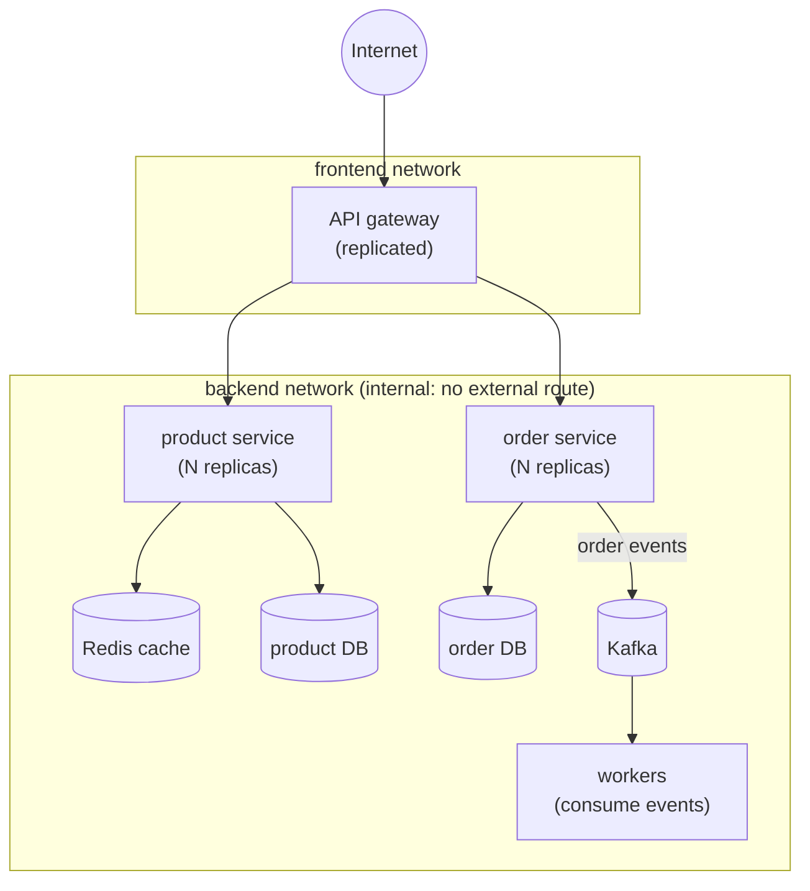
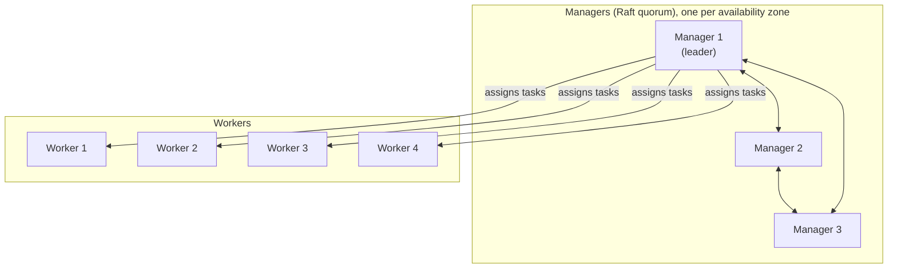
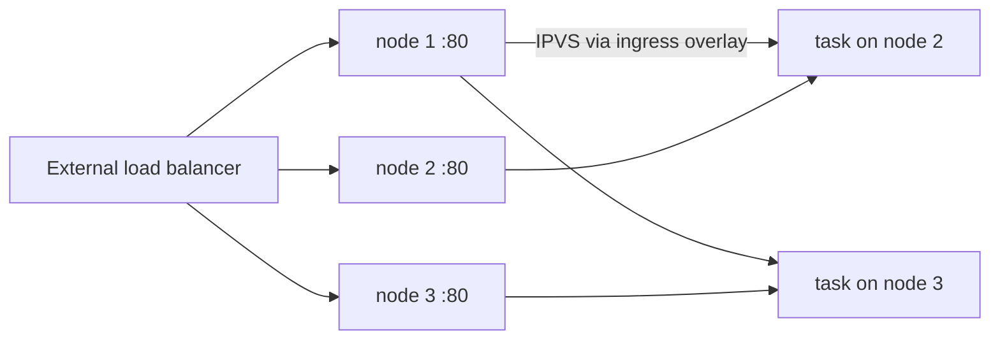
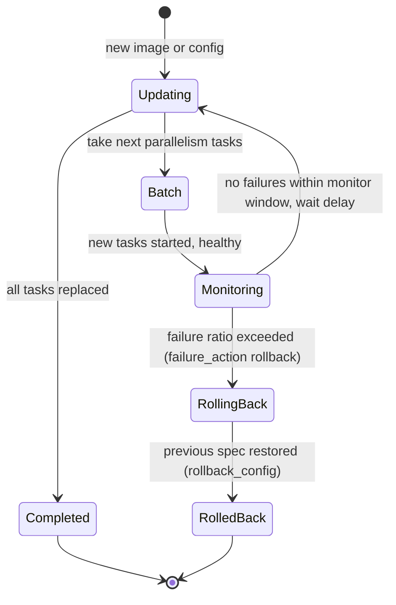
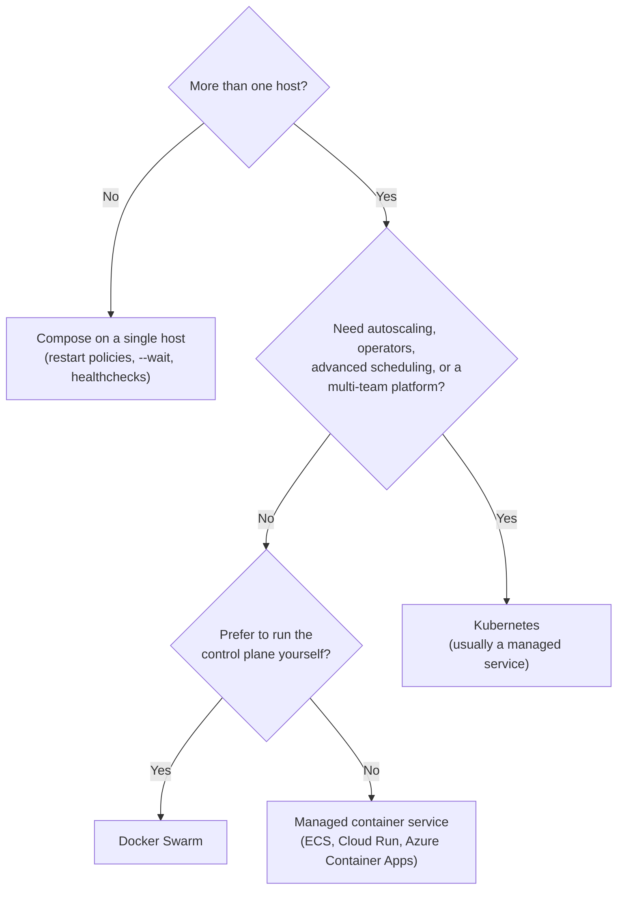

[Docker](./) &raquo; Production Patterns

This page covers what changes when containers move from a laptop to production: replication, resource governance, health-gated rolling updates, secrets, network segmentation, and logging, expressed first with **Docker Compose** and then across a cluster with **Docker Swarm**. It closes with two reference architectures (a microservices storefront and an ML model-serving platform) and guidance on when to move to Kubernetes. It assumes familiarity with images, Dockerfiles, and Compose. Multi-container patterns (sidecar, ambassador, init) and image hardening are on [Design Patterns](docker-design-patterns.html); alternative runtimes (gVisor, Kata, Firecracker, WebAssembly) are on [Container Runtimes](../container-runtimes.html).

## What Production Adds

The image that runs in production is the same artifact that ran in CI. What differs is everything around it:

| Concern | Failure it prevents | Compose / Swarm mechanism |
|---------|---------------------|---------------------------|
| Replication | One crash takes the service down | `deploy.replicas`, Swarm scheduling |
| Resource governance | One service starves its neighbors, or the host OOM-kills the wrong process | `deploy.resources.limits` and `reservations` |
| Health checking | Traffic sent to a process that is up but not working | `healthcheck`, `depends_on: service_healthy` |
| Zero-downtime updates | Deploys cause outages; bad versions stay live | `update_config`, `rollback_config` (Swarm) |
| Secret management | Credentials leaked through images, `docker inspect`, or logs | `secrets:` mounted under `/run/secrets` |
| Network segmentation | A compromised front end reaches the database | Multiple networks, `internal: true` |
| Log management | Unbounded log files fill the disk | Logging driver with rotation |

## Reference Architectures

Most containerized systems follow one of a few shapes, and the shape determines which concerns dominate.

| Architecture | Shape | Dominant concerns |
|--------------|-------|-------------------|
| **Microservices** | Many services behind a gateway, each owning its data | Independent scaling and rollouts, service discovery, network segmentation |
| **Worker pool** | A queue feeding horizontally scaled stateless workers | Scaling to queue depth, idempotent processing, graceful shutdown |
| **Stateless web tier** | Identical app servers behind a load balancer or CDN, shared cache | Fast startup, small images, health-gated rollouts |
| **Batch / scheduled jobs** | Containers that run to completion | Retries, exit codes, resource requests (often GPUs) |



The gateway is the only service attached to the public network. Everything else, including every data store, sits on an internal network with no route to or from the outside.

## Compose in Production

Compose files are the usual deployment descriptor for single-host production and, through `docker stack deploy`, for Swarm. The same format covers both, but the two consumers honor different parts of it.

### What each tool honors

| Compose key | `docker compose up` (single host) | `docker stack deploy` (Swarm) |
|-------------|-----------------------------------|-------------------------------|
| `deploy.replicas` | Yes (runs N containers) | Yes |
| `deploy.resources` (limits, reservations, GPU devices) | Yes | Yes |
| `deploy.update_config`, `rollback_config` | Ignored | Yes |
| `deploy.placement` | Ignored | Yes |
| `depends_on` | Yes (with conditions) | Ignored: services must tolerate dependencies starting in any order |
| `build:` | Yes | Ignored: images must come from a registry |
| `secrets:` | File-backed secrets only | Swarm secrets (`external: true`) or files |
| `healthcheck` | Yes | Yes (also gates rolling updates) |

The top-level `version:` key is obsolete: current Compose ignores it and warns. Omit it.

### Structuring files per environment

Keep one base file and layer environment-specific differences on top:

```bash
# compose.yaml holds the service graph; compose.prod.yaml adds limits, replicas, logging
docker compose -f compose.yaml -f compose.prod.yaml up -d --wait
```

Later files override or extend earlier ones key by key. `--wait` blocks until services are running and healthy, which makes the command usable as a deployment step. Other structuring features: `include:` pulls in another project's Compose file (with its own relative paths), and `profiles:` marks optional services (debug tools, one-off admin jobs) that start only when their profile is enabled.

### Replicas, resources, and update policy

```yaml
services:
  product-service:
    image: registry.example.com/product-service:${VERSION:?set VERSION}
    deploy:
      replicas: 5
      resources:
        limits:
          cpus: "2"
          memory: 2G
        reservations:
          cpus: "0.5"
          memory: 1G
      update_config:
        parallelism: 2            # replace 2 replicas per batch
        delay: 10s                # pause between batches
        monitor: 30s              # watch each batch this long for failures
        failure_action: rollback
        order: start-first        # start new task before stopping the old one
      restart_policy:
        condition: on-failure
        max_attempts: 3
```

- **Limits vs. reservations.** A *limit* is enforced by the kernel through cgroups: CPU above it is throttled, and memory above it gets the container OOM-killed. A *reservation* is used by the Swarm scheduler to place the task only on a node with that much unreserved capacity. Set memory limits on every service; a service without one can exhaust the host.
- **`start-first` vs. `stop-first`.** `start-first` briefly runs old and new tasks side by side, so capacity never drops, at the cost of headroom during the rollout. `stop-first` (the default) needs no spare capacity but removes a batch before its replacements are ready. Services that bind a fixed host port in `mode: host` must use `stop-first`.
- **`${VERSION:?...}`** makes the deploy fail if the variable is unset, rather than silently pulling an empty or `latest` tag. Deploying by digest (`image: repo/app@sha256:...`) is stricter still.

The same limits apply to single containers: `docker run --memory 1g --memory-reservation 750m --cpus 2 --pids-limit 256 my-app`.

### Health checks gate the rollout

A rolling update is only as safe as the signal that a new replica works. A health check provides that signal:

```yaml
services:
  product-service:
    healthcheck:
      test: ["CMD", "/app/healthcheck"]    # or ["CMD", "curl", "-fsS", "http://localhost:8080/healthz"]
      interval: 10s
      timeout: 3s
      retries: 3
      start_period: 40s        # failures during startup do not count
      start_interval: 2s       # probe quickly during start_period
```

The check runs *inside* the container, so the command must exist in the image. Minimal and distroless images usually lack `curl`; ship a small health-check binary or a subcommand of the application itself. Kubernetes ignores the image's `HEALTHCHECK` and uses its own liveness, readiness, and startup probes.

### Secrets and network segmentation

Secrets are mounted as files under `/run/secrets/<name>` (in-memory under Swarm) rather than passed as environment variables, which appear in `docker inspect`, crash dumps, and child processes. Many official images accept a `*_FILE` variant of their configuration variables:

```yaml
services:
  product-db:
    image: postgres:18
    environment:
      POSTGRES_PASSWORD_FILE: /run/secrets/db_password
    secrets: [db_password]

secrets:
  db_password:
    external: true    # Swarm: created with `docker secret create db_password -`
    # single host alternative:  file: ./secrets/db_password.txt
```

Segmentation puts public-facing services on one network and data stores on another marked `internal: true`, which has no gateway to the outside: a database there cannot be reached from the internet even if a port is misconfigured, and a compromised service on it cannot open outbound connections.

```yaml
networks:
  frontend:
    driver: overlay
    driver_opts:
      encrypted: "true"   # IPsec between Swarm nodes
  backend:
    driver: overlay
    driver_opts:
      encrypted: "true"
    internal: true
```

On a single host, drop the `driver: overlay` lines and the same file creates bridge networks. [Networking](docker-networking.html#network-security) covers the underlying mechanics and firewall integration.

### Logging

The default `json-file` logging driver does not rotate logs, so a chatty container can fill the host's disk. Configure rotation daemon-wide in `/etc/docker/daemon.json` (applies to containers created afterwards):

```json
{
  "log-driver": "local",
  "log-opts": { "max-size": "10m", "max-file": "5" }
}
```

The `local` driver stores compressed, rotated logs and still supports `docker logs`. For centralized logging, either ship from the host (an agent reading container logs) or use a driver such as `fluentd`, `gelf`, `syslog`, or `awslogs` per service with `logging:` in Compose. Applications should log to stdout/stderr, not to files inside the container.

### GPUs

Compose reserves GPUs through the device-reservation syntax (requires the NVIDIA Container Toolkit on the host):

```yaml
services:
  inference:
    image: registry.example.com/model-server:2.1.0
    deploy:
      resources:
        reservations:
          devices:
            - driver: nvidia
              count: 1            # or: device_ids: ["0"]
              capabilities: [gpu]
```

## Docker Swarm

Swarm mode is Docker Engine's built-in orchestrator. `docker swarm init` turns an Engine into a cluster manager; other hosts join as managers or workers; and services, stacks, secrets, configs, and overlay networks become cluster-wide objects. Swarm remains part of Docker Engine and continues to receive fixes (the Engine 29 releases improved overlay-network convergence and node-failure recovery), but the container ecosystem's new orchestration features are built for Kubernetes.

```bash
docker swarm init --advertise-addr 10.0.0.11                 # first manager
docker swarm join-token worker                               # prints the join command
docker swarm join --token <token> 10.0.0.11:2377             # on each worker
docker node ls
docker service create --name web --replicas 3 -p 80:80 nginx:1.29
docker service scale web=5
```

### Cluster topology: managers and workers

**Managers** hold the cluster state in a Raft-replicated store and make scheduling decisions; **workers** run tasks. Managers can also run workloads, but in production they are usually drained (`docker node update --availability drain <manager>`) so application load cannot destabilize the control plane.



Raft needs a **quorum**, a strict majority of managers, to change cluster state. With $2m+1$ managers the cluster tolerates $m$ manager failures:

| Managers | Quorum | Manager failures tolerated |
|----------|--------|----------------------------|
| 1 | 1 | 0 |
| 3 | 2 | 1 |
| 5 | 3 | 2 |
| 7 | 4 | 3 |

An even count adds failure points without adding tolerance: 4 managers need 3 for quorum, so they tolerate only 1 failure, the same as 3. Use 3 or 5 managers spread across failure domains; beyond that, Raft replication overhead grows with no practical gain. If quorum is lost, running tasks keep running, but no changes (deploys, rescheduling after failures) are possible until quorum is restored or the cluster is recovered with `docker swarm init --force-new-cluster` on a surviving manager.

### Overlay networking and the routing mesh

Overlay networks span all nodes: a task on one node reaches a task on another by service name, with traffic tunneled in VXLAN and optionally encrypted with IPsec. Each service name resolves to a virtual IP that load-balances across its healthy tasks. The underlay details (ports 2377, 7946, 4789, MTU) are on [Networking](docker-networking.html#multi-host-networking-with-overlay).

A published port uses the **ingress routing mesh** by default: every node listens on the port and forwards each connection to a healthy task on any node through IPVS. An external load balancer can therefore target all nodes without knowing where the tasks run.



The mesh adds a hop and replaces the client's source address with an internal one. When a service needs the real client IP, or the extra hop matters, publish in **host mode** instead: only nodes running a task listen, and each task binds the host port directly (so run at most one task per node, typically as a `mode: global` service).

```yaml
    ports:
      - target: 80
        published: 80
        protocol: tcp
        mode: host
```

### Rolling updates and rollback

`docker service update` (or re-running `docker stack deploy` with a new image) replaces tasks in batches according to `update_config`:



A task counts as failed if it exits or never becomes healthy. `max_failure_ratio` (default 0) sets how many failures are tolerated before `failure_action` triggers.

### A production stack

Placement constraints pin tasks to suitable nodes; placement preferences spread them across failure domains:

```yaml
# stack.yml  ->  docker stack deploy -c stack.yml shop
services:
  web:
    image: registry.example.com/web:${VERSION:?}
    deploy:
      replicas: 6
      placement:
        constraints: [node.role == worker]
        preferences:
          - spread: node.labels.zone      # balance across zones
      update_config:
        parallelism: 2
        delay: 15s
        monitor: 30s
        order: start-first
        failure_action: rollback
      rollback_config:
        parallelism: 0                    # 0 = roll back all tasks at once
        order: stop-first
      resources:
        limits: { cpus: "1", memory: 512M }
    networks: [frontend, backend]

  db:
    image: postgres:18
    deploy:
      replicas: 1
      placement:
        constraints: [node.labels.storage == ssd]
    environment:
      POSTGRES_PASSWORD_FILE: /run/secrets/db_password
    secrets: [db_password]
    volumes:
      - db-data:/var/lib/postgresql       # PostgreSQL 18+ image layout
    networks: [backend]

networks:
  frontend:
    driver: overlay
    driver_opts: { encrypted: "true" }
  backend:
    driver: overlay
    driver_opts: { encrypted: "true" }
    internal: true

volumes:
  db-data:

secrets:
  db_password:
    external: true
```

The database is pinned to one labeled node because a `local` volume exists only on the node that created it. Swarm has no built-in replicated storage; stateful services need either node pinning, a volume plugin backed by shared storage, or (commonly) a managed database outside the cluster.

Day-to-day operations:

```bash
docker node update --label-add zone=a --label-add storage=ssd node-3
docker stack deploy -c stack.yml shop               # create or update the stack
docker service ps shop_web                          # task-level rollout progress
docker service update --image registry.example.com/web:2.4.0 shop_web
docker service rollback shop_web                    # revert to the previous spec
docker node update --availability drain node-5      # move tasks off for maintenance
```

Swarm secrets are stored encrypted in the Raft log, sent only to nodes running a service that uses them, and mounted into containers on an in-memory filesystem.

### Swarm vs. Kubernetes

| Factor | Docker Swarm | Kubernetes |
|--------|--------------|------------|
| Setup | Built into Docker Engine; a cluster in minutes | Separate distribution (managed EKS/GKE/AKS, k3s, kubeadm) |
| Configuration | Compose files | Kubernetes manifests, Helm, Kustomize |
| Learning curve | Small | Large |
| Scheduling | Constraints, preferences, replicated or global | Affinity/anti-affinity, taints, topology spread, priorities, custom schedulers |
| Autoscaling | None built in | Horizontal/vertical Pod autoscaling, cluster autoscaling (Cluster Autoscaler, Karpenter) |
| Storage | Volume plugins | CSI drivers, dynamic provisioning, StatefulSets |
| Extensibility | Limited | CRDs and operators, service meshes, GitOps tooling |
| Ecosystem and managed offerings | Small | Very large; every major cloud |
| Good fit | Small teams, a handful of nodes, Compose-centric workflows | Large fleets, multi-team platforms, complex scheduling |

## Reference Architecture: Microservices Storefront

The stack below expresses the microservices diagram above as one Swarm stack: a gateway on the public network, independently scaled services each with its own database (database-per-service), a cache, and Kafka for asynchronous order events. It is illustrative; production data stores are frequently managed services rather than containers in the cluster.

```yaml
# stack.production.yml  ->  docker stack deploy -c stack.production.yml shop
services:
  gateway:
    image: registry.example.com/api-gateway:${VERSION:?}
    ports:
      - "443:8443"
    deploy:
      replicas: 3
      resources:
        limits: { cpus: "2", memory: 1G }
      update_config: { parallelism: 1, order: start-first, failure_action: rollback }
    secrets: [jwt_key]
    environment:
      JWT_KEY_FILE: /run/secrets/jwt_key
    networks: [frontend, backend]

  product-service:
    image: registry.example.com/product-service:${VERSION:?}
    deploy:
      replicas: 5
      resources:
        limits: { cpus: "1", memory: 512M }
      update_config: { parallelism: 2, delay: 10s, failure_action: rollback }
    environment:
      DB_HOST: product-db
      CACHE_HOST: redis
    networks: [backend]

  order-service:
    image: registry.example.com/order-service:${VERSION:?}
    deploy:
      replicas: 3
      resources:
        limits: { cpus: "1", memory: 512M }
    environment:
      DB_HOST: order-db
      KAFKA_BOOTSTRAP_SERVERS: kafka:9092
    networks: [backend]

  product-db:
    image: postgres:18
    deploy:
      placement: { constraints: [node.labels.db == product] }
    environment:
      POSTGRES_PASSWORD_FILE: /run/secrets/product_db_password
    secrets: [product_db_password]
    volumes: [product-data:/var/lib/postgresql]
    networks: [backend]

  order-db:
    image: postgres:18
    deploy:
      placement: { constraints: [node.labels.db == order] }
    environment:
      POSTGRES_PASSWORD_FILE: /run/secrets/order_db_password
    secrets: [order_db_password]
    volumes: [order-data:/var/lib/postgresql]
    networks: [backend]

  redis:
    image: redis:8-alpine
    command: ["redis-server", "--maxmemory", "1gb", "--maxmemory-policy", "allkeys-lru"]
    networks: [backend]

  # Single-node Kafka in KRaft mode (Kafka 4.x has no ZooKeeper)
  kafka:
    image: apache/kafka:4.1.0
    deploy:
      placement: { constraints: [node.labels.kafka == true] }
    environment:
      KAFKA_NODE_ID: 1
      KAFKA_PROCESS_ROLES: broker,controller
      KAFKA_LISTENERS: PLAINTEXT://:9092,CONTROLLER://:9093
      KAFKA_ADVERTISED_LISTENERS: PLAINTEXT://kafka:9092
      KAFKA_CONTROLLER_LISTENER_NAMES: CONTROLLER
      KAFKA_LISTENER_SECURITY_PROTOCOL_MAP: CONTROLLER:PLAINTEXT,PLAINTEXT:PLAINTEXT
      KAFKA_CONTROLLER_QUORUM_VOTERS: 1@kafka:9093
      KAFKA_OFFSETS_TOPIC_REPLICATION_FACTOR: 1
      KAFKA_LOG_DIRS: /var/lib/kafka/data
    volumes: [kafka-data:/var/lib/kafka/data]
    networks: [backend]

networks:
  frontend:
    driver: overlay
    driver_opts: { encrypted: "true" }
  backend:
    driver: overlay
    driver_opts: { encrypted: "true" }
    internal: true

volumes:
  product-data:
  order-data:
  kafka-data:

secrets:
  jwt_key:
    external: true
  product_db_password:
    external: true
  order_db_password:
    external: true
```

Design points:

- **Only the gateway publishes a port** and joins `frontend`; every data store is on the internal `backend` network.
- **Separate credentials per database**, so a compromise of one service does not expose the other's data.
- **No `depends_on`.** Swarm ignores it, so each service must retry its connections at startup; this is also what makes it survive a dependency restarting later.
- **Stateful services are pinned** to labeled nodes because their volumes are node-local.
- **Kafka 4.x runs in KRaft mode.** ZooKeeper support was removed in Kafka 4.0; older examples with a `zookeeper` service do not work with current images. A production cluster runs three or more brokers with replication factor 3.

As a system like this grows, the usual pressure points are autoscaling on custom metrics, per-request traffic policy (canaries, retries, mTLS between services), and operators for stateful components, which is typically when teams move it to Kubernetes.

## Reference Architecture: ML Model Serving

Model serving is a long-running, replicated, health-checked **service**; training is a **batch job** that requests accelerators, runs to completion, and exits. The two halves use containers differently.

### Serving image

A multi-stage build compiles dependencies in a builder stage and copies only the virtual environment into a slim, non-root runtime image:

```dockerfile
# syntax=docker/dockerfile:1
FROM python:3.13-slim AS builder
RUN apt-get update \
 && apt-get install -y --no-install-recommends build-essential \
 && rm -rf /var/lib/apt/lists/*
RUN python -m venv /opt/venv
ENV PATH="/opt/venv/bin:$PATH"
COPY requirements.txt .
RUN --mount=type=cache,target=/root/.cache/pip pip install -r requirements.txt

FROM python:3.13-slim
RUN apt-get update \
 && apt-get install -y --no-install-recommends libgomp1 \
 && rm -rf /var/lib/apt/lists/* \
 && useradd --system --uid 10001 --create-home ml
COPY --from=builder /opt/venv /opt/venv
ENV PATH="/opt/venv/bin:$PATH" PYTHONUNBUFFERED=1
WORKDIR /app
COPY --chown=ml:ml src/ ./src/
USER ml

# Uses only the standard library, so no curl is needed in the image
HEALTHCHECK --interval=15s --timeout=3s --start-period=60s --retries=3 \
  CMD ["python", "-c", "import urllib.request; urllib.request.urlopen('http://127.0.0.1:8080/healthz', timeout=2)"]

EXPOSE 8080
CMD ["gunicorn", "--bind", "0.0.0.0:8080", "--workers", "2", "--timeout", "120", "src.app:app"]
```

Model weights are deliberately not copied into the image. Multi-gigabyte weights make every image push and pull slow and couple model releases to code releases; they are usually mounted from a volume or object storage at startup, or distributed as separate OCI artifacts. Large-language-model serving typically uses a purpose-built server image (vLLM, TensorRT-LLM, llama.cpp) instead of a custom web app, with the same service concerns: GPU reservation, readiness gated on the model being loaded, and long start periods.

### Training job

Training is expressed as a run-to-completion job. GPU scheduling, per-job resource requests, and retry limits are the reason this is usually a Kubernetes `Job` rather than a Swarm service:

```yaml
apiVersion: batch/v1
kind: Job
metadata:
  name: train-model
spec:
  backoffLimit: 2                      # retries before the Job is marked failed
  ttlSecondsAfterFinished: 86400       # clean up a day after completion
  template:
    spec:
      restartPolicy: Never
      nodeSelector:
        nvidia.com/gpu.product: NVIDIA-H100-80GB-HBM3   # label set by GPU feature discovery
      containers:
        - name: train
          image: registry.example.com/ml-training:3.2.0
          args: ["--epochs=100", "--batch-size=64", "--lr=0.001"]
          resources:
            requests: { cpu: "8", memory: 64Gi }
            limits: { nvidia.com/gpu: 2, memory: 64Gi }
          volumeMounts:
            - { name: dataset, mountPath: /data, readOnly: true }
            - { name: output,  mountPath: /output }
      volumes:
        - name: dataset
          persistentVolumeClaim: { claimName: training-dataset }
        - name: output
          persistentVolumeClaim: { claimName: model-output }
```

GPUs are an extended resource: they are requested through `limits` only, and cannot be shared or overcommitted without additional configuration (time-slicing or MIG).

## Choosing an Orchestration Level



Managed container services are a frequently overlooked middle ground: they run images from a registry with scaling and rolling deploys, and no cluster to operate.

## Production Checklist

| Area | Check |
|------|-------|
| Images | Built by CI, pinned by digest or immutable tag, scanned, non-root, minimal base |
| Configuration | No secrets in images or environment variables; `*_FILE` secrets; per-environment override files |
| Resources | Memory limit on every service; CPU limits or reservations where contention matters |
| Health | Health check on every long-running service; `start_period` sized for real startup time |
| Rollouts | `update_config` with `failure_action: rollback`; `start-first` where capacity allows |
| Networking | Only edge services publish ports; data stores on internal networks; overlays encrypted |
| State | Volumes pinned or on shared storage; backups tested; managed databases considered |
| Logging | Rotation configured; logs to stdout/stderr; shipped off-host |
| Cluster | 3 or 5 managers across failure domains; managers drained of workloads; underlay ports documented |

## Current Tooling

| Area | Tool | Role |
|------|------|------|
| Build | BuildKit / Buildx | Default builder: parallel stages, cache and secret mounts, multi-platform, attestations |
| Build | Docker Build Cloud | Remote shared builders and cache for CI |
| Supply chain | Docker Scout, Trivy, Grype | Vulnerability scanning and SBOM analysis |
| Supply chain | Docker Hardened Images, Chainguard Images, distroless | Minimal, low-CVE base images |
| Engine | containerd image store | Default for new installations since Engine 29; stores multi-platform images and attestations |
| Dev loop | Compose Watch (`docker compose watch`) | Syncs source changes into running containers or rebuilds on change |
| Testing | Testcontainers | Disposable real dependencies (databases, brokers) in integration tests |
| Orchestration | Swarm, Kubernetes, managed container services | See [Choosing an Orchestration Level](#choosing-an-orchestration-level) |

## See Also

- [Design Patterns](docker-design-patterns.html) - Sidecar, ambassador, adapter, init, and image hardening
- [Dockerfiles &amp; CI/CD](dockerfiles.html) - Multi-stage builds, BuildKit, and CI pipelines
- [Networking](docker-networking.html) - Overlay networks, port publishing, and firewall integration
- [Storage &amp; Security](storage-security.html) - Volumes, secrets, and container hardening
- [Registries &amp; Supply Chain](registry.html) - Tagging, digests, and provenance
- [Container Runtimes](../container-runtimes.html) - gVisor, Kata, Firecracker, and WebAssembly
- [Docker Essentials](../docker-essentials.html) - Command reference
- [Kubernetes](../kubernetes/) - Orchestration at scale
- [AWS](../aws/) - ECS, EKS, and Fargate
- [Distributed Systems](../../distributed-systems/) - Consensus, replication, and failure models

## References

- [Compose file reference](https://docs.docker.com/reference/compose-file/)
- [Compose deploy specification](https://docs.docker.com/reference/compose-file/deploy/)
- [Swarm mode overview](https://docs.docker.com/engine/swarm/)
- [Raft consensus in Swarm mode](https://docs.docker.com/engine/swarm/raft/)
- [Configure logging drivers](https://docs.docker.com/engine/logging/configure/)
