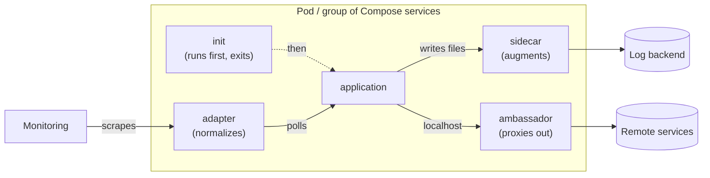
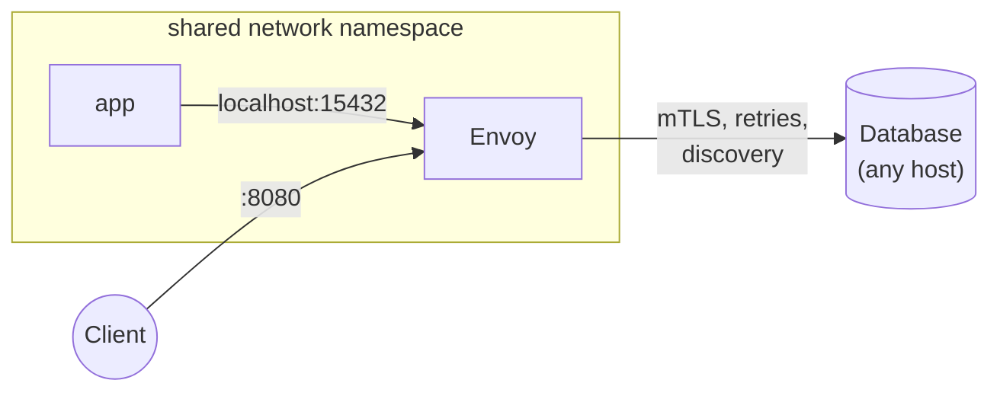
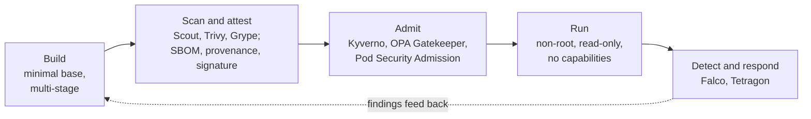
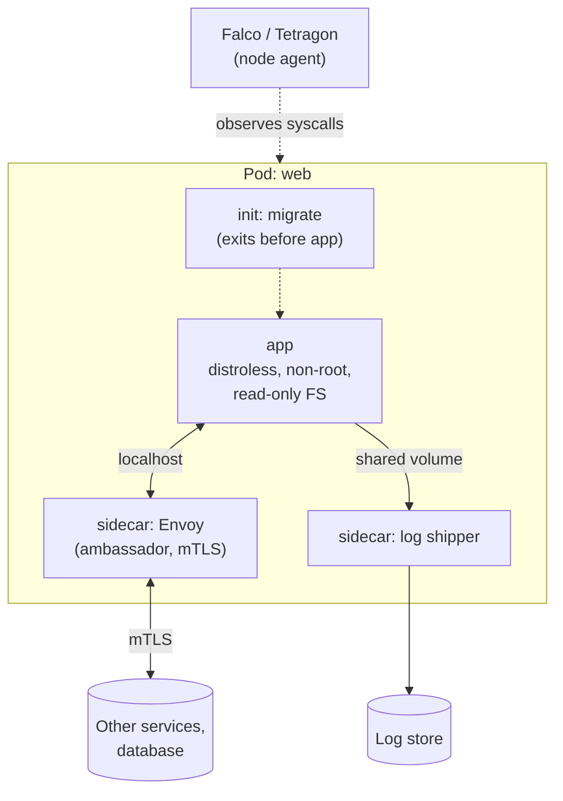

[Docker](./) &raquo; Design Patterns

A production workload is rarely one container. Operational concerns such as log shipping, TLS, protocol translation, and one-time setup are usually handled by **helper containers** that run beside the application and share some of its resources. The recurring arrangements have names: **sidecar**, **ambassador**, **adapter**, and **init**. They were catalogued by Burns and Oppenheimer in *Design Patterns for Container-based Distributed Systems* (USENIX HotCloud 2016) and are now built into Kubernetes and approximated in Docker Compose. This page describes each pattern and how to express it in both, then covers the **image and runtime security patterns** (minimal base images, least privilege, runtime detection) that production containers are expected to follow.

## Why Helper Containers

An application image should contain the application. When cross-cutting tooling is baked into it instead, every change to the log shipper or proxy configuration forces an application rebuild, the image grows (with more CVEs), and the application's release cycle becomes coupled to the platform team's. Running the concern in a separate container keeps each image single-purpose and lets the helper be reused across many applications and upgraded independently.

What makes this possible is that containers can **share namespaces and volumes**:

| Shared resource | Enables | Compose | Kubernetes Pod |
|-----------------|---------|---------|----------------|
| Network namespace | Helper reachable on `localhost`; can intercept traffic | `network_mode: "service:<name>"` | Always shared by all containers in a Pod |
| Volume | Helper reads files the app writes (logs, sockets, config) | Named volume mounted in both services | `emptyDir` or other volume mounted in both |
| PID namespace | Helper can see and signal the app's processes | `pid: "service:<name>"` | `shareProcessNamespace: true` |
| Lifecycle | Helper starts before / stops after the app | Approximated with `depends_on` | Native: init containers and sidecar containers |

Kubernetes has a unit for co-scheduled containers, the **Pod**. Compose does not: each service is scheduled separately, and the grouping is expressed through the sharing options above. On a single host this is close enough; across a Swarm cluster, services that share a volume or namespace must also be constrained to the same node.



## Sidecar Pattern

A **sidecar** extends the application without the application knowing about it, typically by sharing a volume. The canonical example is log forwarding: the application writes log files, and the sidecar tails them and ships each line to a backend.

```yaml
# compose.yaml
services:
  app:
    image: my-app:1.4.0
    volumes:
      - logs:/var/log/app

  log-forwarder:
    image: fluent/fluent-bit:4.0
    volumes:
      - logs:/var/log/app:ro
      - ./fluent-bit.yaml:/fluent-bit/etc/fluent-bit.yaml:ro
    command: ["-c", "/fluent-bit/etc/fluent-bit.yaml"]
    depends_on: [app]

volumes:
  logs:
```

The application mounts the volume read-write; the forwarder mounts it read-only. No network hop or logging API is involved.

### Native sidecars in Kubernetes

Historically, a Kubernetes sidecar was just another entry in `containers`, which caused two problems: the sidecar could start *after* the app (a proxy not yet ready when the app made its first call), and a Job never completed because the sidecar kept running after the main container exited. Kubernetes 1.28 introduced **native sidecar containers**, stable since 1.33: an entry in `initContainers` with `restartPolicy: Always`.

```yaml
apiVersion: v1
kind: Pod
metadata:
  name: app-with-log-shipper
spec:
  initContainers:
    - name: log-shipper
      image: fluent/fluent-bit:4.0
      restartPolicy: Always          # makes this a sidecar, not a one-shot init
      volumeMounts:
        - name: logs
          mountPath: /var/log/app
          readOnly: true
  containers:
    - name: app
      image: my-app:1.4.0
      volumeMounts:
        - name: logs
          mountPath: /var/log/app
  volumes:
    - name: logs
      emptyDir: {}
```

```mermaid
sequenceDiagram
    participant K as kubelet
    participant I as init: migrate
    participant S as sidecar: log-shipper
    participant A as app
    K->>I: start
    I-->>K: exit 0
    K->>S: start
    S-->>K: started (startupProbe passes)
    K->>A: start
    Note over A,S: both run; sidecar restarts independently if it crashes
    K->>A: SIGTERM (Pod deleted)
    A-->>K: exited
    K->>S: SIGTERM (after app has stopped)
```

A native sidecar starts before the main containers, in declaration order with other init containers, restarts on failure, does not block Job completion, and is terminated only after the main containers have exited, so it can ship the application's last log lines or proxy its final requests.

Common sidecars: log shippers (Fluent Bit, Vector, the OpenTelemetry Collector), configuration and secret reloaders (Vault Agent, config watchers), certificate rotators, and service-mesh proxies. Give each sidecar explicit CPU and memory limits; a leaking helper should not starve the application.

## Ambassador Pattern

An **ambassador** is a proxy that brokers the application's network connections. The application talks to `localhost` as if the dependency were local; the ambassador handles discovery, TLS, retries, timeouts, and circuit breaking.

```yaml
# compose.yaml
services:
  envoy:
    image: envoyproxy/envoy:v1.39-latest
    volumes:
      - ./envoy.yaml:/etc/envoy/envoy.yaml:ro
    ports:
      - "8080:8080"                  # inbound traffic enters via the proxy

  app:
    image: my-app:1.4.0
    network_mode: "service:envoy"    # share envoy's network namespace
    environment:
      DATABASE_URL: postgres://app@localhost:15432/app   # envoy listens here
```

`network_mode: "service:envoy"` places the application in the proxy's network namespace; they share one loopback interface and one port space. When the app connects to `localhost:15432`, Envoy accepts the connection and forwards it to the real database, adding mutual TLS, connection pooling, and retries. Ports must be published on the service that owns the namespace (`envoy`), not on `app`.



The ambassador decouples the application from the *topology* of its dependencies: moving the database, adding replicas, or enforcing mTLS changes proxy configuration, not the application. An inbound ambassador works the same way in reverse, terminating TLS and applying rate limits before passing plain HTTP to the app.

### Service meshes: sidecar and sidecar-less

A service mesh automates the ambassador pattern fleet-wide: Istio or Linkerd inject a proxy next to every workload, and a control plane configures all of them. The per-Pod proxy has costs (memory per replica, an extra hop, restarts to upgrade the proxy), which led to **sidecar-less** designs. Istio's **ambient mode** (generally available since Istio 1.24, late 2024) splits the proxy into a per-node layer-4 component (`ztunnel`) that provides mTLS, plus optional per-namespace **waypoint** proxies for layer-7 policy. Cilium's service mesh similarly moves much of the work into eBPF and per-node proxies.

| | Sidecar proxy per Pod | Per-node / ambient |
|---|---|---|
| Isolation between workloads | Strong (one proxy each) | Shared node component |
| Resource overhead | Grows with replica count | Grows with node count |
| Proxy upgrade | Restart every workload | Upgrade node components |
| L7 features | Always available | Opt-in waypoint proxies |

The pattern, a proxy that owns the application's network connections, is unchanged; only where the proxy runs differs.

## Adapter Pattern

An **adapter** presents the application's output through a standard interface. The ambassador adapts *connections*; the adapter adapts *data and interfaces*, most often to expose a legacy or third-party application's metrics, logs, or health in the format the platform expects.

```yaml
# compose.yaml
services:
  legacy-app:
    image: legacy-app:2.3            # exposes stats in its own format at /legacy/stats

  metrics-adapter:
    image: example/legacy-exporter:1.0   # placeholder: an exporter for this app
    environment:
      LEGACY_APP_URL: http://legacy-app:8080/legacy/stats
    ports:
      - "9100:9100"                  # Prometheus scrapes /metrics here
```

The adapter polls the proprietary endpoint, converts each value into Prometheus/OpenMetrics text format, and serves it on `/metrics`. Neither the application nor the monitoring system changes. Real examples are the Prometheus exporter ecosystem (`redis_exporter`, `postgres_exporter`, the JMX exporter), log normalizers that turn unstructured output into structured JSON, and health shims that translate an application-specific status into an HTTP `200`/`503` for probes.

### Choosing between the three

| Pattern | Mediates | Coupling to the app | Canonical example |
|---------|----------|---------------------|-------------------|
| **Sidecar** | Local resources (files, sockets, processes) | Shared volume or PID namespace | Log shipper tailing a shared volume |
| **Ambassador** | Outbound or inbound connections | Shared network namespace (`localhost`) | Envoy providing mTLS and discovery |
| **Adapter** | The shape of the app's external interface | Network or volume, read-only | Prometheus exporter for a legacy app |

The terms overlap in practice: a mesh proxy is often called a "sidecar" because of how it is deployed, even though its job is the ambassador's. The distinction that matters is what the helper mediates.

## Init Containers

An **init container** runs to completion before the application starts; if it fails, the application does not start. It is the pattern for work that must happen once, before the app, and must block startup on failure: schema migrations, waiting for a dependency, fetching configuration, or fixing volume permissions.

```yaml
apiVersion: v1
kind: Pod
metadata:
  name: web
spec:
  initContainers:
    - name: wait-for-db
      image: busybox:1.37
      command: ['sh', '-c', 'until nc -z db 5432; do echo waiting for db; sleep 2; done']
    - name: migrate
      image: registry.example.com/migrations:1.4.0
      command: ['/app/migrate', 'up']
      env:
        - name: DATABASE_URL
          valueFrom:
            secretKeyRef: { name: db-admin, key: url }
  containers:
    - name: web
      image: registry.example.com/web:1.4.0
      ports:
        - containerPort: 8080
```

Init containers run sequentially in declaration order. If one fails, the kubelet retries it according to the Pod's `restartPolicy`, and `web` never sees a partially migrated schema.

In Compose, the equivalent is a one-shot service plus `depends_on` conditions:

```yaml
services:
  db:
    image: postgres:18
    healthcheck:
      test: ["CMD-SHELL", "pg_isready -U postgres"]
      interval: 5s
      retries: 10

  migrate:
    image: registry.example.com/migrations:1.4.0
    command: ["/app/migrate", "up"]
    depends_on:
      db:
        condition: service_healthy
    restart: "no"

  web:
    image: registry.example.com/web:1.4.0
    depends_on:
      migrate:
        condition: service_completed_successfully
      db:
        condition: service_healthy
        restart: true          # restart web if Compose restarts db
```

`service_completed_successfully` starts `web` only after `migrate` exits with status 0.

A separate container rather than a startup script keeps migration tooling and database-admin credentials out of the application image: the init container can use a different image and a more privileged identity, and then it is gone. Two caveats: with many replicas, every Pod runs its init containers, so migrations must be idempotent or guarded by a lock; and large schema changes are often better run as a separate Job in the deployment pipeline than as an init step in every Pod.

## Image Security Patterns

The composition patterns decide how containers run together. The next patterns decide what is inside an image and what the process may do.

### Distroless and hardened base images

A **distroless** image contains the application and its runtime dependencies and nothing else: no shell, no package manager, no coreutils. An attacker who achieves code execution has no `sh`, `curl`, or `apt` to work with, the image has far fewer packages to accumulate CVEs, and it pulls faster.

```dockerfile
# syntax=docker/dockerfile:1
FROM golang:1.26 AS build
WORKDIR /src
COPY go.mod go.sum ./
RUN go mod download
COPY . .
RUN CGO_ENABLED=0 go build -trimpath -ldflags="-s -w" -o /out/app .

FROM gcr.io/distroless/static-debian13:nonroot
COPY --from=build /out/app /app
ENTRYPOINT ["/app"]
```

`CGO_ENABLED=0` produces a statically linked binary, so the runtime image needs no libc. The `:nonroot` tag already sets `USER` to UID 65532.

Google's distroless images (currently based on Debian 13) are tiered by how much runtime the language needs:

| Image | Adds | For |
|-------|------|-----|
| `static-debian13` | CA certificates, tzdata, `/etc/passwd` | Static Go and Rust binaries |
| `base-debian13` | glibc, OpenSSL | Dynamically linked native binaries |
| `cc-debian13` | libgcc, libstdc++ | C/C++ and some Rust binaries |
| `java21-debian13`, `java25-debian13` | A JRE | JVM applications |
| `nodejs22-debian13`, `nodejs24-debian13` | Node.js | Node applications |
| `python3-debian13` | CPython | Python applications (dependencies copied in from a build stage) |

Each is published with `:latest`, `:nonroot`, `:debug`, and `:debug-nonroot` tags; the `debug` variants add a BusyBox shell for troubleshooting.

Distroless is one of several **minimal, hardened image** families:

| Family | Characteristics |
|--------|-----------------|
| Google distroless | Debian packages, no shell; free |
| Chainguard Images | Built on the Wolfi distribution, rebuilt continuously for low CVE counts; `-dev` variants include a shell and package manager |
| Docker Hardened Images | Maintained by Docker on Debian and Alpine; non-root by default; signed SBOMs, VEX, and SLSA Build Level 3 provenance; the core catalog is free under Apache 2.0, with paid tiers for remediation SLAs |
| `scratch` | Empty; you supply everything (CA certificates and `/etc/passwd` included) |

The build-and-runtime split of dev and runtime variants follows the multi-stage pattern in [Dockerfiles](dockerfiles.html#multi-stage-builds): compile in the variant with tools, ship the one without.

**Debugging without a shell.** `docker exec -it app sh` fails on a distroless container because there is no `sh`. Instead, attach a tools container to its namespaces, which leaves the production image unchanged:

```bash
# Docker: a tools container sharing the target's network and PID namespaces
docker run --rm -it --network container:app --pid container:app nicolaka/netshoot

# Docker Desktop: docker debug attaches a toolbox shell without modifying the image
docker debug app

# Kubernetes: an ephemeral debug container targeting the app's process namespace
kubectl debug -it pod/web --image=busybox:1.37 --target=web
```

### Least privilege at runtime

The image should run as non-root; the runtime specification should remove what the process does not need:

```yaml
# compose.yaml
services:
  server:
    image: registry.example.com/server:1.4.0
    user: "65532:65532"
    read_only: true                 # immutable root filesystem
    tmpfs:
      - /tmp                        # writable scratch space only where needed
    cap_drop: [ALL]                 # no Linux capabilities
    security_opt:
      - no-new-privileges:true      # setuid binaries cannot escalate
    pids_limit: 256
```

The Kubernetes equivalent is a `securityContext` with `runAsNonRoot: true`, `readOnlyRootFilesystem: true`, `allowPrivilegeEscalation: false`, `capabilities: { drop: [ALL] }`, and `seccompProfile: { type: RuntimeDefault }`, which together satisfy the Pod Security Standards *restricted* profile.

| Control | Blocks |
|---------|--------|
| Non-root UID | Writing to root-owned paths; many container-escape techniques |
| Read-only root filesystem | Dropping and running payloads, tampering with binaries |
| `cap_drop: ALL` | Raw sockets (`NET_RAW`), mounts and namespace tricks (`SYS_ADMIN`), ownership changes |
| `no-new-privileges` | Escalation through setuid/setgid binaries |
| Default seccomp profile | Rarely needed, dangerous syscalls |
| User namespaces (rootless Docker, `userns-remap`, Kubernetes `hostUsers: false`) | Container root mapping to host root |

Volume, secrets, and capability hardening are covered in more depth in [Storage &amp; Security](storage-security.html); user namespaces in [Container Runtimes](../container-runtimes.html#user-namespaces-and-rootless-containers).

## Runtime Security Patterns

Hardening shrinks the attack surface; **runtime detection** catches what gets through anyway. The pattern is to observe system calls and container behavior, compare them against expected behavior, and alert on or block deviations.

[Falco](https://falco.org/), a CNCF graduated project, taps the kernel's syscall stream (with its modern eBPF probe by default) and evaluates each event against rules:

```yaml
# custom-rules.yaml
- list: web_allowed_processes
  items: [nginx, node]

- rule: Unexpected process in web container
  desc: A process not on the allowlist started in a web-tier container
  condition: >
    spawned_process and container
    and container.image.repository = "registry.example.com/web"
    and not proc.name in (web_allowed_processes)
  output: >
    Unexpected process in web container
    (command=%proc.cmdline user=%user.name container=%container.name image=%container.image.repository)
  priority: WARNING
  tags: [container, process]
```

`spawned_process` and `container` are macros from Falco's default ruleset. The rule fires when anything other than the expected processes starts in the web image, such as a shell spawned through a remote-code-execution bug. It pairs well with distroless images, where the legitimate process set is a single binary and any other process is anomalous by construction.

Runtime detection is one layer in a chain of controls, each covering a different point in an image's life:



| Stage | Tools | Catches |
|-------|-------|---------|
| Scan and attest | Docker Scout, Trivy, Grype; SBOM and SLSA provenance; cosign or Notation signatures | Known CVEs; images of unknown origin |
| Admission | Kyverno, OPA Gatekeeper, Pod Security Admission, signature-verification policies | Privileged, root, unsigned, or unapproved-registry workloads |
| Runtime detection and enforcement | Falco, Tetragon (eBPF, can kill offending processes) | Exploitation of unknown bugs, attacker activity inside a container |

No single layer is sufficient: a clean scan says nothing about zero-days, and a runtime alert comes too late if a privileged container was admitted.

## Putting the Patterns Together



The init container ensures the schema exists before the app starts; the application image contains only the application and runs with least privilege; the ambassador handles encryption and discovery; the sidecar ships logs; and a node agent watches every container for anomalous behavior. Each component owns one concern.

## See Also

- [Fundamentals](fundamentals.html) - Images, containers, and namespaces
- [Dockerfiles &amp; CI/CD](dockerfiles.html) - Multi-stage builds and build-time secrets
- [Networking](docker-networking.html) - Shared network namespaces and Compose networking
- [Storage &amp; Security](storage-security.html) - Volumes, capabilities, and secrets
- [Registries &amp; Supply Chain](registry.html) - Signing, SBOMs, and provenance
- [Production Patterns](advanced.html) - Compose in production, Swarm, and reference architectures
- [Container Runtimes](../container-runtimes.html) - Sandboxed runtimes and user namespaces
- [Kubernetes](../kubernetes/) - Pods, init containers, and sidecars at scale

## References

- B. Burns and D. Oppenheimer, "Design Patterns for Container-based Distributed Systems," USENIX HotCloud 2016
- [Kubernetes: Sidecar containers](https://kubernetes.io/docs/concepts/workloads/pods/sidecar-containers/)
- [Compose file reference: depends_on](https://docs.docker.com/reference/compose-file/services/#depends_on)
- [Distroless container images](https://github.com/GoogleContainerTools/distroless)
- [Docker Hardened Images](https://docs.docker.com/dhi/)
- [Falco rules documentation](https://falco.org/docs/concepts/rules/)
