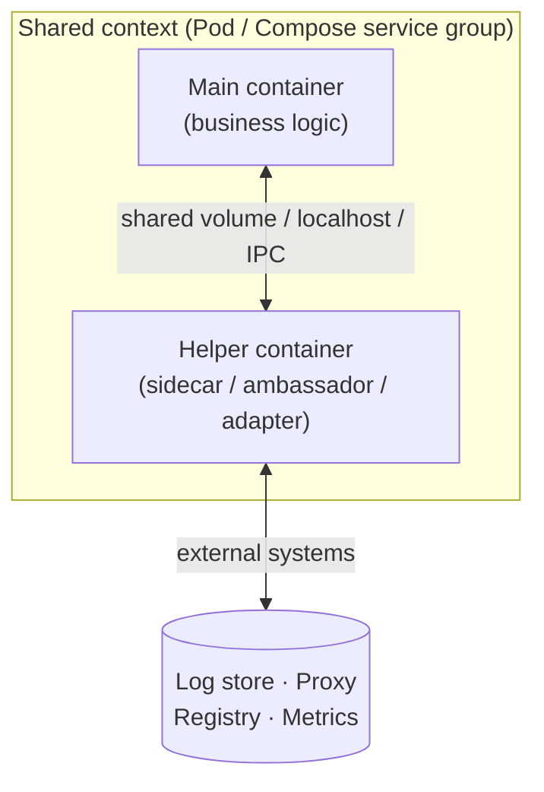
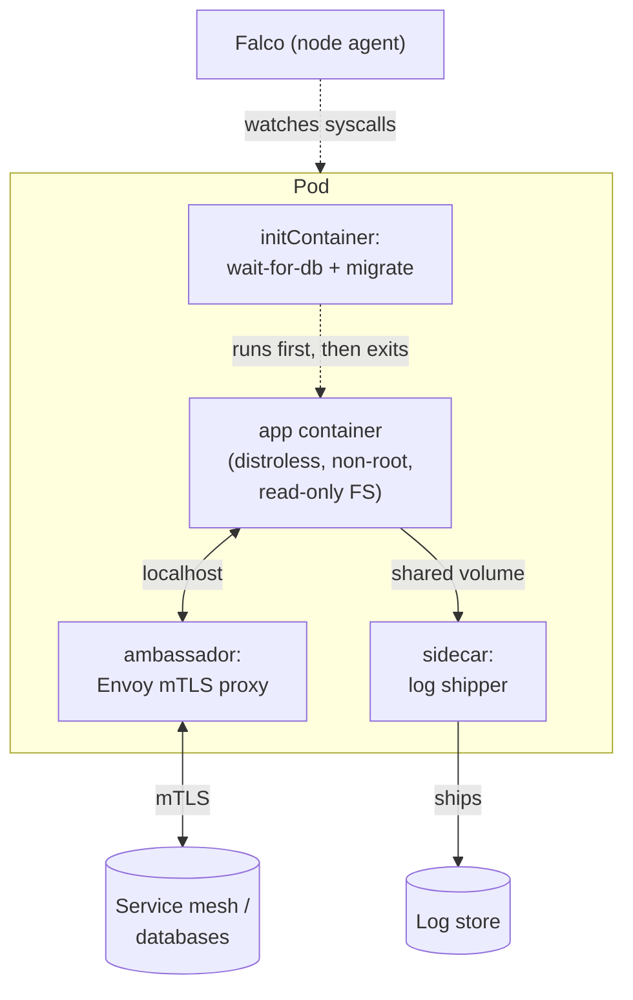

<div class="hero-section" style="background: linear-gradient(135deg, #0066cc 0%, #00aaff 100%); color: white; padding: 3rem 2rem; margin: -2rem -3rem 2rem -3rem; text-align: center;">
  <h1 style="color: white; margin: 0; font-size: 2.5rem;">Docker: Design Patterns</h1>
  <p style="font-size: 1.25rem; margin-top: 1rem; opacity: 0.9;">Multi-container composition patterns, hardened images, and runtime security for production workloads.</p>
</div>

[Docker](./) &raquo; Design Patterns

<div class="intro-card">
  <p class="lead-text">A single container rarely lives alone in production. Once you move past a lone web server, recurring shapes emerge for how containers are composed: a main application paired with helpers that handle logging, proxying, format translation, or one-time setup. These are the classic <strong>multi-container design patterns</strong> — Sidecar, Ambassador, Adapter, and Init — and they keep your application image focused while pushing cross-cutting concerns into reusable companions. This page covers those patterns, then turns to <strong>image and runtime security patterns</strong> (distroless images, non-root execution, runtime threat detection) that make the resulting deployments safe at scale.</p>
</div>

## Why Multi-Container Patterns Exist

The single-responsibility principle applies to containers as much as to code. An application container should run *one* concern — your business logic — and nothing else. But real deployments need logging, metrics, TLS termination, secret fetching, and protocol translation. You have two choices:

1. **Bake everything into the application image.** This couples your app to its operational tooling. Every time you change the log shipper or rotate the proxy config, you rebuild and redeploy the application.
2. **Run the cross-cutting concern in a separate container** that shares resources with the application. The app image stays minimal; the helper evolves independently.

The patterns below are all instances of the second choice. They differ in *what* the helper does and *how* it couples to the main container. The shared substrate that makes them possible is the container runtime's ability to let multiple containers share a network namespace, a volume, or a process namespace.



> **Compose vs. Kubernetes.** In Docker Compose the "shared context" is a set of services wired together with a shared volume or `network_mode: "service:..."`. In Kubernetes it is a **Pod** — multiple containers that always co-schedule and share a network namespace and volumes. The patterns are identical in spirit; only the manifest syntax differs. Examples below show both where it clarifies the pattern.

## Sidecar Pattern

The **sidecar** runs alongside the main container and augments it without the application being aware. The classic example is log forwarding: the application writes logs to a shared volume, and a sidecar tails that volume and ships the logs elsewhere. The application never learns where its logs go.

<div class="advanced-patterns-section">
  <div class="pattern-grid">
    <div class="pattern-card">
      <h4><i class="fas fa-sync-alt"></i> Sidecar Pattern</h4>
      <p>Deploy helper containers alongside your main application container</p>
      <pre><code class="language-yaml"># Logging sidecar example (compose.yaml)
services:
  app:
    image: my-app:latest
    volumes:
      - logs:/var/log/app

  log-forwarder:
    image: fluent/fluent-bit:latest
    volumes:
      - logs:/var/log/app:ro
      - ./fluent-bit.conf:/fluent-bit/etc/fluent-bit.conf
    environment:
      - ELASTICSEARCH_HOST=elasticsearch

volumes:
  logs:</code></pre>
    </div>
  </div>
</div>

**How it works.** Both containers mount the named volume `logs`. The app mounts it read-write at `/var/log/app` and writes log files there. The `log-forwarder` mounts the same volume read-only (`:ro`), tails the files, and forwards each line to Elasticsearch. Because the volume is shared, no network round-trip or log API is needed between them.

**When to use it.** Reach for a sidecar when the helper needs to *read from* or *write to* the same files or local sockets as the application, and when the helper's lifecycle is tied to the app's. Common sidecars:

- **Log shippers** — Fluent Bit, Vector, Promtail tailing a shared volume.
- **Metrics agents** — a Prometheus exporter scraping the app over `localhost`.
- **Config/secret reloaders** — a process watching a config source and rewriting a file the app reads.
- **Service-mesh proxies** — Envoy injected as a sidecar to intercept all traffic (this is the Ambassador pattern specialized for meshes).

**Trade-offs.** A sidecar doubles the container count and consumes its own CPU and memory. Keep sidecar images tiny and resource-limited; a leaky log shipper should never starve the application it serves.

## Ambassador Pattern

An **ambassador** is a proxy container that brokers the main container's *outbound* (or inbound) network communication. The application connects to `localhost` as if the dependency were local; the ambassador handles the real work — TLS, retries, service discovery, load balancing, circuit breaking — transparently.

<div class="advanced-patterns-section">
  <div class="pattern-grid">
    <div class="pattern-card">
      <h4><i class="fas fa-shield-alt"></i> Ambassador Pattern</h4>
      <p>Proxy container that handles external communication</p>
      <pre><code class="language-yaml"># Service mesh ambassador
services:
  app:
    image: my-app:latest
    network_mode: "service:envoy"

  envoy:
    image: envoyproxy/envoy:v1.31-latest
    ports:
      - "8080:8080"
    volumes:
      - ./envoy.yaml:/etc/envoy/envoy.yaml</code></pre>
    </div>
  </div>
</div>

**How it works.** The key line is `network_mode: "service:envoy"`: it places the `app` container in the *same network namespace* as `envoy`. They now share one loopback interface and one set of ports. The app dials `localhost:9000` for its database; Envoy is listening there and forwards the connection to the real, possibly remote, database — adding mutual TLS, connection pooling, and retries along the way. The application's code stays ignorant of all of it.

**Why this matters.** The ambassador decouples the application from the *topology* of its dependencies. Move the database, add a read replica, or wrap every call in mTLS, and you change only the ambassador's config — never the application image. This is precisely the mechanism behind service meshes (Istio, Linkerd), where an Envoy sidecar-ambassador is injected next to every workload to form the mesh data plane.

**Inbound ambassadors** work the same way in reverse: the proxy terminates TLS and rate-limits before forwarding clean HTTP to the app on `localhost`, so the application never handles certificates or abusive clients directly.

## Adapter Pattern

An **adapter** (sometimes called a *normalizer*) standardizes the output of a container so the outside world sees a uniform interface. Where the ambassador adapts the *connection*, the adapter adapts the *data or interface shape* — most often to expose a legacy or third-party app's metrics, logs, or health in a format your platform expects.

<div class="advanced-patterns-section">
  <div class="pattern-grid">
    <div class="pattern-card">
      <h4><i class="fas fa-code-branch"></i> Adapter Pattern</h4>
      <p>Standardize output from different containers</p>
      <pre><code class="language-yaml"># Metrics adapter example
services:
  legacy-app:
    image: legacy-app:latest

  metrics-adapter:
    image: prom-exporter:latest
    environment:
      - LEGACY_APP_URL=http://legacy-app:8080
      - METRICS_PATH=/legacy/stats
    ports:
      - "9090:9090"</code></pre>
    </div>
  </div>
</div>

**How it works.** The `legacy-app` exposes statistics in its own idiosyncratic format at `/legacy/stats`. Your monitoring stack speaks Prometheus, which expects metrics in the OpenMetrics text format on a `/metrics` endpoint. The `metrics-adapter` polls the legacy endpoint, translates each value into a Prometheus metric, and serves the result on port `9090`. Prometheus scrapes the adapter; neither the legacy app nor Prometheus needs to change.

**Typical adapters.**

- **Metrics exporters** — `node_exporter`, `redis_exporter`, JMX exporters that turn app-specific stats into Prometheus format.
- **Log format normalizers** — a container that reshapes unstructured app logs into structured JSON before shipping.
- **Health-check shims** — translate a non-standard liveness signal into the HTTP `200`/`503` your orchestrator probes.

### Choosing Between the Three

The three composition patterns are easy to confuse because they all run a helper next to the app. The distinction is *what* the helper mediates:

| Pattern | Mediates | Direction | Canonical example |
|---------|----------|-----------|-------------------|
| **Sidecar** | Shared local resources (files, sockets) | Augments the app in place | Log shipper on a shared volume |
| **Ambassador** | Network connections | Brokers traffic in/out | Envoy proxy for mTLS and discovery |
| **Adapter** | Data/interface shape | Normalizes the app's external surface | Prometheus exporter for a legacy app |

A single Pod may use all three at once: an init container seeds config, an ambassador handles egress mTLS, a sidecar ships logs, and an adapter exposes metrics — while the application container does nothing but serve requests.

## Init Containers

An **init container** runs *before* the main container starts, performs one-time setup, then exits. The main container does not start until every init container has completed successfully. This is the pattern for any work that must happen *once, before the app*, and must *block* startup if it fails: schema migrations, fetching secrets or config, waiting on a dependency, or fixing volume permissions.

Init containers are a first-class Kubernetes concept. In Docker Compose the same ordering is approximated with `depends_on` plus a service that runs to completion.

**Kubernetes:**

```yaml
apiVersion: v1
kind: Pod
metadata:
  name: web-with-init
spec:
  initContainers:
  - name: wait-for-db
    image: busybox:1.36
    # Block until the database accepts connections
    command: ['sh', '-c', 'until nc -z db 5432; do echo waiting for db; sleep 2; done']
  - name: run-migrations
    image: myregistry/migrations:latest
    command: ['/app/migrate', 'up']
    env:
    - name: DATABASE_URL
      valueFrom:
        secretKeyRef:
          name: db-credentials
          key: url
  containers:
  - name: web
    image: myregistry/web:latest
    ports:
    - containerPort: 8080
```

The `web` container starts only after `wait-for-db` confirms the database is reachable *and* `run-migrations` applies the schema. If either init container fails, Kubernetes restarts the Pod and retries — the application never sees a half-migrated database.

**Docker Compose equivalent:**

```yaml
services:
  migrate:
    image: myregistry/migrations:latest
    command: ["/app/migrate", "up"]
    depends_on:
      db:
        condition: service_healthy
    restart: "no"            # run once, do not restart

  web:
    image: myregistry/web:latest
    ports:
      - "8080:8080"
    depends_on:
      migrate:
        condition: service_completed_successfully   # wait for migrate to exit 0
```

The `service_completed_successfully` condition is Compose's way to express "start `web` only after `migrate` exits cleanly" — the same ordering guarantee an init container provides.

**Why a separate container, not a startup script?** Putting migrations in an init container keeps the application image free of migration tooling and database admin credentials. The init container can use a different, more privileged image and identity, run to completion, and disappear — leaving the long-running app with the minimal image and least-privileged credentials it actually needs.

## Image Security Patterns

The composition patterns above shape *how containers run together*; the next two sections shape *what is inside the image* and *what it is allowed to do at runtime*. Both reduce attack surface.

### Distroless Images

A "distroless" image contains *only* your application and its runtime dependencies — no shell, no package manager, no `ls`, no `cat`. There is nothing for an attacker who lands a remote-code-execution bug to pivot with: no `sh` to spawn, no `curl` to exfiltrate, no `apt` to install tools. The image is also dramatically smaller, which means fewer CVEs to patch and faster pulls.

<div class="security-patterns">
  <h4>Distroless Images</h4>
  <pre><code class="language-dockerfile"># Multi-stage build with distroless
FROM golang:1.23 AS builder
WORKDIR /app
COPY . .
RUN CGO_ENABLED=0 go build -o myapp .

# Distroless image - no shell, package manager, or utilities
FROM gcr.io/distroless/static:nonroot
COPY --from=builder /app/myapp /
USER nonroot:nonroot
ENTRYPOINT ["/myapp"]</code></pre>
</div>

**How it works.** A multi-stage build does all the messy compilation in a full `golang` image, then copies *only the resulting static binary* into `gcr.io/distroless/static`. `CGO_ENABLED=0` produces a statically linked binary with no libc dependency, so the runtime image needs nothing but the binary itself. The `:nonroot` tag and `USER nonroot:nonroot` ensure the process runs as an unprivileged user.

**The distroless family** (from Google's `distroless` project, with similar offerings from Chainguard's `wolfi`) is tiered by how much runtime the language needs:

| Image | Contains | Use for |
|-------|----------|---------|
| `distroless/static` | CA certs, tzdata, `/etc/passwd` | Statically linked Go/Rust binaries |
| `distroless/base` | The above + glibc, libssl | Dynamically linked native binaries |
| `distroless/cc` | base + libgcc, libstdc++ | C/C++ and some Rust binaries |
| `distroless/java`, `python3`, `nodejs` | base + the language runtime | JVM, CPython, Node apps |

**The debugging caveat.** With no shell, `docker exec -it container sh` will not work — there is no `sh`. Use the `:debug` variant of a distroless image (which adds BusyBox) for local troubleshooting, or attach an *ephemeral debug container* in Kubernetes (`kubectl debug`) that brings its own tools into the Pod without modifying the hardened production image.

### Run as Non-Root and Drop Privileges

Distroless gives you a non-root *user*; defense in depth means also stripping the *capabilities* and write access the process does not need. A hardened production image and run spec typically combines:

```dockerfile
# In the Dockerfile: never run as root
FROM gcr.io/distroless/base:nonroot
COPY --from=builder /app/server /server
USER nonroot:nonroot          # UID 65532, not root
ENTRYPOINT ["/server"]
```

```yaml
# In the runtime spec (Compose): least privilege at launch
services:
  server:
    image: myregistry/server:latest
    read_only: true                 # immutable root filesystem
    cap_drop:
      - ALL                         # drop every Linux capability
    security_opt:
      - no-new-privileges:true      # block setuid escalation
    tmpfs:
      - /tmp                        # writable scratch where actually needed
```

Each control closes a path an attacker would otherwise use: `read_only` prevents writing a payload to disk, `cap_drop: ALL` removes powers like `CAP_NET_RAW` and `CAP_SYS_ADMIN`, and `no-new-privileges` stops a setuid binary from re-escalating. (Storage and capability hardening are covered in depth in [Storage &amp; Security](storage-security.html); the point here is that the *image pattern* and the *runtime pattern* reinforce each other.)

## Runtime Security Patterns

Image hardening shrinks the attack surface; **runtime detection** catches the cases where an attacker gets in anyway. The pattern is to watch system calls and container behavior against a policy of what is expected, and alert (or block) on anything outside it.

<div class="security-patterns">
  <h4>Runtime Security with Falco</h4>
  <pre><code class="language-yaml"># falco-rules.yaml
- rule: Unauthorized Process in Container
  desc: Detect unauthorized process execution
  condition: >
    container and
    not proc.name in (allowed_processes) and
    not container.image.repository in (trusted_images)
  output: >
    Unauthorized process in container
    (user=%user.name command=%proc.cmdline container=%container.name)
  priority: WARNING</code></pre>
</div>

**How it works.** [Falco](https://falco.org/) is a CNCF runtime-security engine that taps the kernel's system-call stream (via eBPF) and evaluates each event against rules like the one above. The rule fires when a process starts inside a container whose name is *not* on an allowlist and whose image is *not* trusted — a strong signal that an attacker has spawned a shell or dropped a tool inside a container that should only ever run its one known process. Because distroless images have *no* extra processes, this rule pairs naturally with them: any unexpected process is, by construction, anomalous.

**Layers of runtime defense.** Falco is one tool in a broader runtime-security pattern:

- **Behavioral detection** (Falco, Tetragon) — alert on unexpected syscalls, file writes, or network connections.
- **Admission control** (OPA Gatekeeper, Kyverno) — reject Pods at deploy time that run as root, lack resource limits, or use untrusted registries.
- **Image scanning and provenance** (Docker Scout, Trivy, SLSA attestations) — block images with known CVEs or without a verifiable build origin before they ever run.

Together these enforce a closed loop: only vetted images deploy, they run with least privilege, and any deviation at runtime is detected. No single layer is sufficient — a scanned image can still be exploited at runtime, and a runtime alert is too late if a privileged container has already been deployed.

## Putting the Patterns Together

A production deployment usually layers several of these patterns at once. A typical hardened web workload looks like:



The init container guarantees the schema is ready before the app starts; the distroless, non-root, read-only app container minimizes what an attacker can do; the ambassador handles encryption and discovery; the sidecar ships logs; and a node-level Falco agent watches every container for anomalous behavior. Each pattern owns one concern, and the application image stays focused on business logic.

## See Also

- [Docker Fundamentals](fundamentals.html) - Images, containers, and core concepts
- [Docker: Storage &amp; Security](storage-security.html) - Volumes, network drivers, and container hardening
- [Docker: Dockerfiles &amp; CI/CD](dockerfiles.html) - Multi-stage builds and pipelines
- [Docker: Advanced Patterns](advanced.html) - Production architectures, case studies, and WebAssembly runtimes
- [Kubernetes](../kubernetes/) - Pods, init containers, and orchestration at scale
- [Docker Essentials](../docker-essentials.html) - Quick command reference
