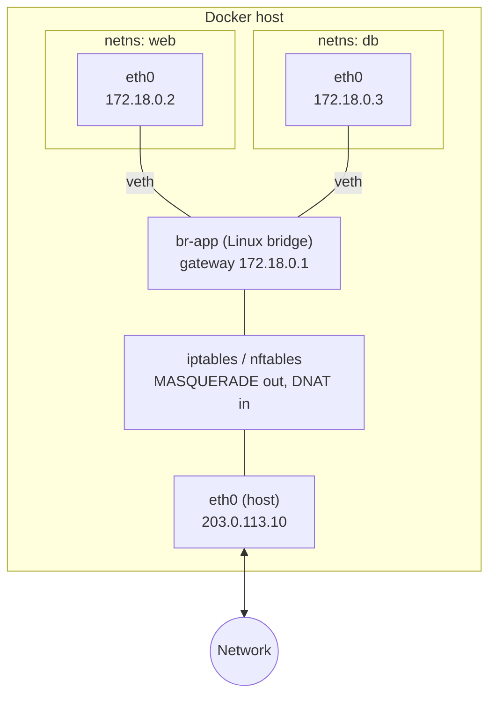
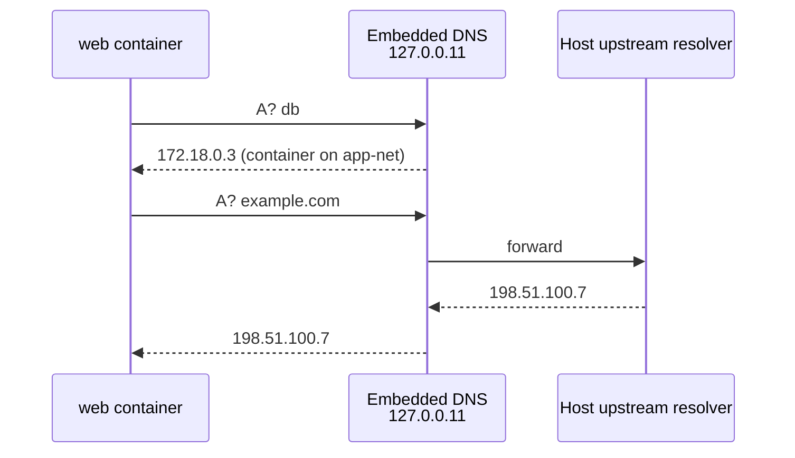
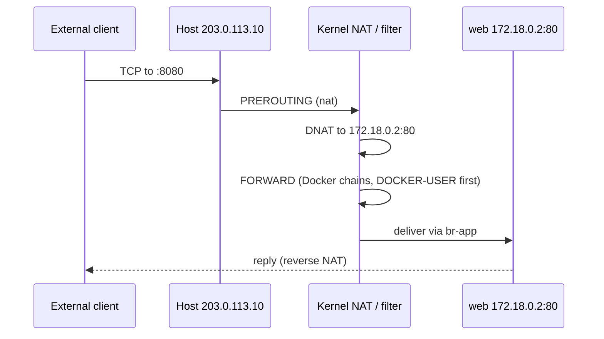
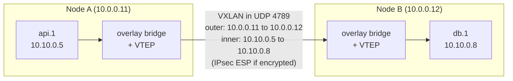
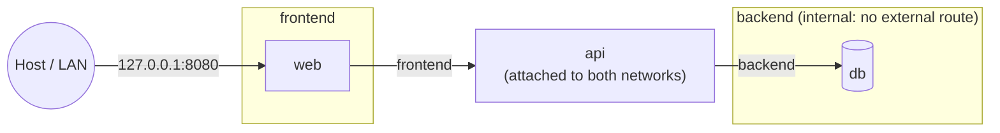

[Docker](./) &raquo; Networking

Docker networking is built from ordinary Linux kernel features: each container gets a **network namespace**, a **network driver** connects that namespace to the host and to other containers, an **embedded DNS server** provides name-based discovery, and **packet-filter rules** (iptables, or nftables since Engine 29) implement NAT, port publishing, and isolation. This page explains each piece, the drivers and when to choose them, how port publishing interacts with host firewalls, multi-host overlay networking, and how to debug connectivity. Basic command usage is in [Fundamentals](fundamentals.html); a cheat sheet is in [Docker Essentials](../docker-essentials.html#networking).

## Building Blocks

| Primitive | Role in Docker networking |
|-----------|---------------------------|
| Network namespace | A private copy of the network stack (interfaces, routes, sockets, firewall state) per container |
| veth pair | A virtual cable: one end is `eth0` inside the container, the other is attached to a bridge on the host |
| Linux bridge | A software switch (`docker0`, or `br-<id>` per user-defined network) connecting containers on one host |
| iptables / nftables | NAT (masquerading outbound, DNAT for published ports) and inter-network isolation |
| Embedded DNS (`127.0.0.11`) | Resolves container, alias, and service names on user-defined networks |
| VXLAN | Encapsulates layer-2 frames in UDP to stretch a network across hosts (overlay driver) |
| `docker-proxy` | Userland proxy that handles published-port cases the kernel rules do not (e.g. loopback access, IPv6-to-IPv4) |

## Network Drivers

| Driver | Isolation | Spans hosts | Overhead | Typical use |
|--------|-----------|-------------|----------|-------------|
| **bridge** | Per network; NAT to the host | No | Low (veth + NAT) | Default for standalone containers and Compose on one host |
| **host** | None: shares the host's namespace | No | None | Latency-sensitive or port-heavy workloads, network agents |
| **overlay** | Per network; VXLAN tunnel | Yes | VXLAN encapsulation (+ IPsec if encrypted) | Swarm services across nodes |
| **macvlan** | Own MAC and IP on the physical LAN | Same L2 segment | Minimal (no bridge/NAT) | Containers that must look like physical hosts |
| **ipvlan** | Own IP, shares the parent's MAC (L2) or routes (L3) | Same L2 / routed | Minimal | Like macvlan where the network allows only one MAC per port |
| **none** | Loopback only | No | N/A | Jobs that need no network at all |

Third-party network plugins exist but are rare outside Kubernetes, whose CNI plugins (Calico, Cilium, and others) replace Docker's drivers entirely.

## Bridge Networking

The bridge driver is the default for single-host Docker. Each bridge network is a Linux bridge on the host; every container attached to it gets a veth pair whose host end is plugged into that bridge. Outbound traffic is masqueraded to the host's address; inbound traffic reaches a container only through a published port.



Containers on the same bridge talk directly through it, without NAT and without published ports. Containers on *different* bridge networks cannot reach each other unless one is connected to both networks.

### Default bridge vs. user-defined bridge

Docker creates a network named `bridge` (the `docker0` interface) at startup and attaches containers to it when no `--network` is given. It predates most of Docker's networking features and behaves differently from networks you create:

| Behavior | Default `bridge` | User-defined bridge |
|----------|------------------|---------------------|
| Name resolution | None (legacy `--link` only) | Embedded DNS resolves container names and aliases |
| Isolation | Every container on the host that did not choose a network shares it | Only containers attached to that network |
| Connect/disconnect a running container | No | Yes (`docker network connect` / `disconnect`) |
| Subnet, gateway, MTU, options | Daemon-wide (`daemon.json`) | Per network |

Use a user-defined network for anything beyond a throwaway `docker run`. Compose creates one per project automatically.

```bash
docker network create app-net
docker run -d --name db  --network app-net postgres:18
docker run -d --name web --network app-net nginx
docker exec web getent hosts db     # resolves via the embedded DNS
```

### Choosing subnets

Docker allocates bridge subnets from its default address pools (by default ranges inside `172.17.0.0/16`-`172.31.0.0/16` and `192.168.0.0/16`). These collide with corporate or VPN ranges surprisingly often. Either pin a subnet per network or change the pools daemon-wide:

```bash
docker network create --subnet 10.42.0.0/24 --gateway 10.42.0.1 app-net
docker run -d --name api --network app-net --ip 10.42.0.10 my-api   # static address
```

```json
{
  "default-address-pools": [
    { "base": "10.200.0.0/16", "size": 24 }
  ]
}
```

(`/etc/docker/daemon.json`; applies to networks created after a daemon restart.)

## Host Networking

`--network host` skips the network namespace: the container uses the host's interfaces directly. There is no veth, no NAT, and no port publishing; a process listening on port 8080 is listening on the host's port 8080.

```bash
docker run -d --network host nginx   # answers on the host's port 80; -p is ignored
```

It removes the per-packet cost of the bridge and NAT and suits monitoring agents, routing daemons, and applications that open many dynamic ports. The costs: no port remapping (two containers cannot both bind port 80), no network isolation from the host, and port conflicts with host services.

On Docker Desktop, containers run in a Linux VM, so "host" historically meant the VM. Docker Desktop 4.34 and later offer host networking as an opt-in setting (Settings, Resources, Network) that forwards TCP and UDP between the containers and the machine; it works at layer 4 only and cannot bind to the host's specific IP addresses.

## No Networking

`--network none` gives the container only a loopback interface. It suits compute jobs that read and write mounted volumes and should have no network attack surface. A container can be started with `none` and connected to a network later.

## DNS and Service Discovery

On user-defined networks, each container's `/etc/resolv.conf` points at Docker's embedded DNS server at `127.0.0.11`. It answers for:

- **container names** on networks the querying container shares;
- **network aliases** (`--network-alias`, or `aliases:` in Compose), which give several containers, or a replaced container, a stable name;
- **Compose service names**, which are registered as aliases, so `db` works regardless of the generated container name;
- **Swarm service names**, which resolve to a virtual IP (see [Service discovery in Swarm](#service-discovery-in-swarm)).

Names are scoped per network: a container resolves only peers on networks it is attached to. Other queries are forwarded to the host's upstream resolvers.



### Round-robin aliases

When several containers share an alias, the DNS server returns all their addresses in rotating order. This is client-side load distribution only: clients that cache DNS results (the JVM, many HTTP clients, nginx without a `resolver`) keep using one address.

```bash
docker network create web-net
for i in 1 2 3; do docker run -d --network web-net --network-alias web nginx; done
docker run --rm --network web-net alpine nslookup web   # three A records
```

### Overriding resolution

```bash
docker run -d \
  --dns 10.0.0.53 \
  --dns-search corp.example.com \
  --add-host legacy-host:192.168.1.50 \
  --add-host host.docker.internal:host-gateway \
  my-app
```

`--add-host` writes a static `/etc/hosts` entry. The special value `host-gateway` resolves to the host's address on the bridge, which gives Linux containers the `host.docker.internal` name that Docker Desktop provides automatically.

## Port Publishing

A container on a bridge network is not reachable from outside the host until a port is **published**. Publishing installs a DNAT rule that rewrites traffic arriving at a host port to the container's address and port, plus rules allowing that forwarded traffic through.



```bash
docker run -d -p 8080:80 nginx               # all host addresses, IPv4 and IPv6
docker run -d -p 127.0.0.1:8080:80 nginx     # loopback only
docker run -d -p 80 nginx                    # random host port; see `docker port`
docker run -d -p 53:53/udp my-dns            # UDP
docker run -d -p 7000-7010:7000-7010 my-app  # range
docker run -d -P my-app                      # every EXPOSEd port, random host ports
```

Points that commonly cause trouble:

- **`EXPOSE` does not publish.** It is metadata used by `-P` and by tooling.
- **Published means published everywhere.** `-p 8080:80` binds every host address. Use `-p 127.0.0.1:8080:80` for host-local services, or set a default per network (`-o com.docker.network.bridge.host_binding_ipv4=127.0.0.1`) or for the default bridge (`"ip": "127.0.0.1"` in `daemon.json`).
- **Containers on the same network need no published ports** to talk to each other. Publish only what must be reachable from outside Docker.
- **Published ports bypass the host's INPUT chain.** DNAT happens in `PREROUTING` and the traffic is *forwarded*, so `ufw` and many firewalld setups, which filter `INPUT`, do not protect published ports. See [Firewall integration](#firewall-integration).

### Gateway modes

Since Engine 27 (with `nat-unprotected` and `isolated` added in 28), a bridge network's handling of NAT is configurable per address family with `com.docker.network.bridge.gateway_mode_ipv4` and `..._ipv6`:

| Mode | Behavior |
|------|----------|
| `nat` (default) | Masquerade outbound; only published ports are reachable, via the host's addresses |
| `nat-unprotected` | NAT as above, but no filtering: unpublished container ports are also reachable by direct routing |
| `routed` | No NAT; containers use their own addresses, and only published ports are opened on the container's address. Common for IPv6 with globally routable addresses |
| `isolated` | For `--internal` networks: no address on the host side of the bridge, so the host itself cannot reach the containers directly |

Engine 28 also tightened the default: remote hosts on the same LAN can no longer reach unpublished container ports by routing directly to a container's bridge address. The daemon option `allow-direct-routing` or the network option `com.docker.network.bridge.trusted_host_interfaces` restores direct access where needed.

## Firewall Integration

Docker manages its own packet-filter rules. Hand edits to Docker's chains or tables are overwritten on restart; custom policy goes in the places Docker reserves for it.

### iptables backend and DOCKER-USER

With the iptables backend (the default), Docker evaluates the **`DOCKER-USER`** chain before its own forwarding rules and never modifies it. Filtering for published ports belongs there:

```bash
# Allow only 10.0.0.0/24 to reach published container ports on eth0
iptables -I DOCKER-USER -i eth0 ! -s 10.0.0.0/24 -j DROP
```

Rules in `DOCKER-USER` see packets *after* DNAT, so match on the container's address and port, or use `-m conntrack --ctorigdstport` to match the original host port. Engine 29 removed the `DOCKER-ISOLATION-STAGE-1/2` chains as part of restructuring these rules; scripts that referenced them need updating.

### nftables backend

Engine 29 added an **experimental nftables backend** (`"firewall-backend": "nftables"` in `daemon.json`). Docker then creates its own `ip docker-bridges` and `ip6 docker-bridges` tables. There is no `DOCKER-USER` equivalent: custom rules go in your own nftables table with base chains at a priority that runs before Docker's, and accept rules that must override Docker's drops mark packets with the firewall mark configured by `--bridge-accept-fwmark`. As of Engine 29 the nftables backend does not support Swarm mode (overlay networking still uses iptables), and IP forwarding must be enabled on the host manually.

| | iptables backend | nftables backend |
|---|---|---|
| Status | Default | Experimental (Engine 29+) |
| Custom filtering | `DOCKER-USER` chain | Your own table/base chains; `--bridge-accept-fwmark` for accepts |
| Swarm / overlay | Supported | Not supported |
| IP forwarding | Enabled by the daemon | Enable yourself (`net.ipv4.ip_forward=1`) |

## IPv6

IPv6 is opt-in per network. `ip6tables` rules are managed by default (since Engine 27), so IPv6 networks get the same NAT and isolation behavior as IPv4.

```bash
# Dual-stack network; Docker assigns an IPv6 subnet from its pools if none is given
docker network create --ipv6 v6-net

# Or a specific, globally routed /64 without NAT
docker network create --ipv6 --subnet 2001:db8:1::/64 \
  -o com.docker.network.bridge.gateway_mode_ipv6=routed v6-routed
```

With `routed` mode, the upstream router must route the prefix to the Docker host. With the default `nat` mode, containers use unique local addresses and are masqueraded, which mirrors IPv4 behavior.

## Multi-Host Networking with Overlay

A Linux bridge exists on one host. The **overlay** driver connects containers on different Swarm nodes into one layer-2 network by tunneling their frames over the underlay network in VXLAN (UDP port 4789). Swarm's managers distribute the network state (which container address lives on which node) to participating nodes over a gossip protocol.



```bash
# Swarm must be initialized first
docker swarm init --advertise-addr 10.0.0.11

docker network create \
  --driver overlay \
  --attachable \
  --opt encrypted \
  --subnet 10.10.0.0/24 \
  prod-net

docker service create --name api --network prod-net --replicas 3 my-api:1.0
```

- `--attachable` lets standalone `docker run` containers join the overlay, not only Swarm services; useful for debugging.
- `--opt encrypted` enables IPsec (ESP) for the VXLAN data plane between nodes. Swarm's control plane is always TLS-encrypted; the data plane is not unless requested. Encryption has a CPU and MTU cost, and is not supported for Windows containers.
- VXLAN adds 50 bytes of headers. If the underlay MTU is below 1500 (some clouds, VPNs), set `--opt com.docker.network.driver.mtu=...` on the overlay or large packets will be dropped silently.

### Required underlay ports

| Port | Protocol | Purpose |
|------|----------|---------|
| 2377 | TCP | Swarm cluster management (to managers) |
| 7946 | TCP and UDP | Node-to-node gossip (network state, membership) |
| 4789 | UDP | VXLAN data plane |
| (IP protocol 50) | ESP | Encrypted overlay traffic |

If services deploy but cross-node traffic fails, blocked 4789/udp, 7946, or ESP is the usual cause.

### Service discovery in Swarm

A Swarm service name resolves, by default, to a **virtual IP** (VIP). Connections to the VIP are load-balanced across healthy tasks by IPVS in the kernel, so clients that cache DNS still spread load. With `--endpoint-mode dnsrr`, the name instead resolves to each task's IP (round-robin DNS), which is needed when an external load balancer or the client does its own balancing.

Published service ports use the **ingress routing mesh**: every node listens on the published port and forwards connections over the `ingress` overlay network to a task on any node. [Production Patterns](advanced.html#overlay-networking-and-the-routing-mesh) covers the routing mesh and its alternative, `mode=host` publishing.

## Macvlan and IPvlan

**macvlan** gives each container its own MAC address and an IP on the parent interface's physical network, with no bridge or NAT. The container looks like a separate machine on the LAN, which some legacy systems, network appliances, and IP-based licensing require.

```bash
docker network create -d macvlan \
  --subnet 192.168.1.0/24 --gateway 192.168.1.1 \
  --ip-range 192.168.1.192/27 \
  -o parent=eth0 lan-net

docker run -d --network lan-net --ip 192.168.1.200 nginx
```

Limitations:

- **The host cannot reach its own macvlan containers** by default; the kernel does not hairpin between a parent interface and its macvlan children. Adding a macvlan sub-interface on the host with a route to the container range works around it.
- **Multiple MACs per switch port** are required. Many switches with port security, most Wi-Fi networks, and most cloud VPCs drop such traffic.
- **Addresses are yours to manage.** Docker's IPAM does not talk to the LAN's DHCP server; reserve an `--ip-range` the DHCP server does not use.

**ipvlan** avoids the multiple-MAC problem: all containers share the parent's MAC. In **L2 mode** containers share the parent's subnet, as with macvlan. In **L3 mode** the host routes between the container subnets and the network, and the upstream router needs routes to them.

```bash
docker network create -d ipvlan \
  --subnet 192.168.1.0/24 --gateway 192.168.1.1 \
  -o parent=eth0 -o ipvlan_mode=l2 \
  ipvlan-net
```

## Compose Networking

Compose creates a user-defined bridge named `<project>_default` for each project and attaches every service to it; each service is reachable by its service name. Declare networks explicitly to segment tiers:

```yaml
services:
  web:
    image: nginx
    ports:
      - "127.0.0.1:8080:80"    # published, host-local
    networks: [frontend]
  api:
    image: my-api
    networks: [frontend, backend]
  db:
    image: postgres:18
    networks:
      backend:
        aliases: [primary-db]

networks:
  frontend:
  backend:
    internal: true             # no route in or out of the host
```



`web` reaches `api` over `frontend`; `api` reaches `db` over `backend`; `web` has no path to `db`, and nothing on `backend` can reach the internet. Other network-level Compose keys: `network_mode: host`, `network_mode: "service:<name>"` (share another service's namespace, as in the [ambassador pattern](docker-design-patterns.html#ambassador-pattern)), `extra_hosts`, `dns`, and per-network `ipv4_address`.

## Network Security

| Control | How | Protects against |
|---------|-----|------------------|
| Segment tiers into separate networks | One network per trust zone; only bridging services join two | Lateral movement from a compromised front end |
| Internal networks for data stores | `docker network create --internal`, or `internal: true` in Compose | Exfiltration and accidental exposure of databases |
| Publish narrowly | Only required ports; bind to `127.0.0.1` or a specific interface | Services reachable from the LAN or internet by accident |
| Filter published ports in `DOCKER-USER` (or your nftables table) | Source-address allowlists | `ufw`/INPUT rules that do not apply to forwarded traffic |
| Encrypt overlays | `--opt encrypted` | Sniffing on the underlay between nodes |
| Mutual TLS between services | A service mesh or application-level TLS | Spoofing and eavesdropping inside a network |
| Avoid `--network host` for untrusted workloads | Default bridge networking | Access to host-only services and interfaces |
| Drop `NET_RAW` | `--cap-drop NET_RAW` | ARP spoofing and raw-packet attacks between containers on a bridge |

An internal network in practice:

```bash
docker network create --internal backend
docker network create frontend
docker run -d --name db  --network backend postgres:18
docker run -d --name api --network frontend my-api
docker network connect backend api      # api is the only path to db
```

## Troubleshooting

Work from the inside out: interface and address, then DNS, then reachability, then the published-port path and firewall.

```bash
# A debugging toolbox inside the target container's network namespace
docker run --rm -it --network container:my-app nicolaka/netshoot
#   ip addr; ip route; dig db; curl -v http://api:8080/health; ss -tlnp

# Which networks and addresses does a container have?
docker inspect --format '{{json .NetworkSettings.Networks}}' my-app | jq
docker network inspect app-net

# Published ports and what is listening on the host
docker port my-app
ss -tlnp | grep 8080

# Packet capture on the container's interface
docker run --rm --network container:my-app nicolaka/netshoot tcpdump -i eth0 -n port 5432
```

| Symptom | Likely cause | Fix |
|---------|--------------|-----|
| Name fails, IP works | Containers on the default bridge, or on different networks | Put both on the same user-defined network |
| Works from the host, not from the LAN | Port bound to `127.0.0.1`, or a `DOCKER-USER` / cloud firewall rule | Publish on the right address; check the rules |
| Service reachable despite `ufw deny` | Published ports bypass `INPUT` | Filter in `DOCKER-USER` (or bind to loopback) |
| Container cannot reach a corporate/VPN range | Docker subnet overlaps it | Change `default-address-pools` or pin a subnet |
| Large requests hang across Swarm nodes | Overlay MTU larger than the underlay allows | Lower the overlay MTU |
| Cross-node Swarm traffic fails | 4789/udp, 7946, or ESP blocked | Open the overlay ports on the underlay |
| Host cannot reach its macvlan container | macvlan parent/child isolation | Add a host macvlan sub-interface, or use ipvlan/bridge |
| LAN host cannot reach an unpublished container port by routing | Engine 28+ direct-routing protection | Publish the port, or use `routed`/`trusted_host_interfaces` deliberately |

## See Also

- [Fundamentals](fundamentals.html) - Images, containers, and bridge networking basics
- [Storage &amp; Security](storage-security.html) - Volumes and container hardening
- [Production Patterns](advanced.html) - Swarm, the routing mesh, and segmented production stacks
- [Design Patterns](docker-design-patterns.html) - Ambassador and sidecar containers sharing a network namespace
- [Docker Essentials](../docker-essentials.html) - Quick command reference
- [Kubernetes](../kubernetes/) - The Kubernetes networking model and CNI
- [Networking](../networking/) - TCP/IP, DNS, and firewall fundamentals

## References

- [Docker networking overview](https://docs.docker.com/engine/network/)
- [Packet filtering and firewalls](https://docs.docker.com/engine/network/packet-filtering-firewalls/)
- [Port publishing and mapping](https://docs.docker.com/engine/network/port-publishing/)
- [Overlay network driver](https://docs.docker.com/engine/network/drivers/overlay/)
- [Docker Engine release notes](https://docs.docker.com/engine/release-notes/)
