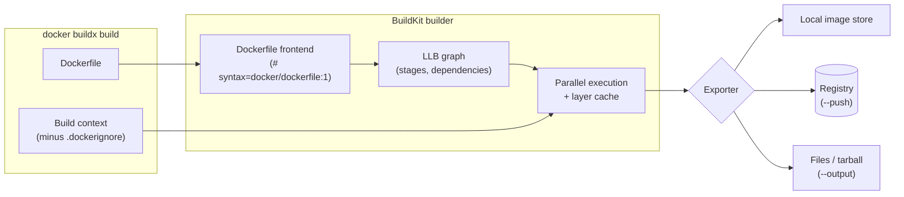
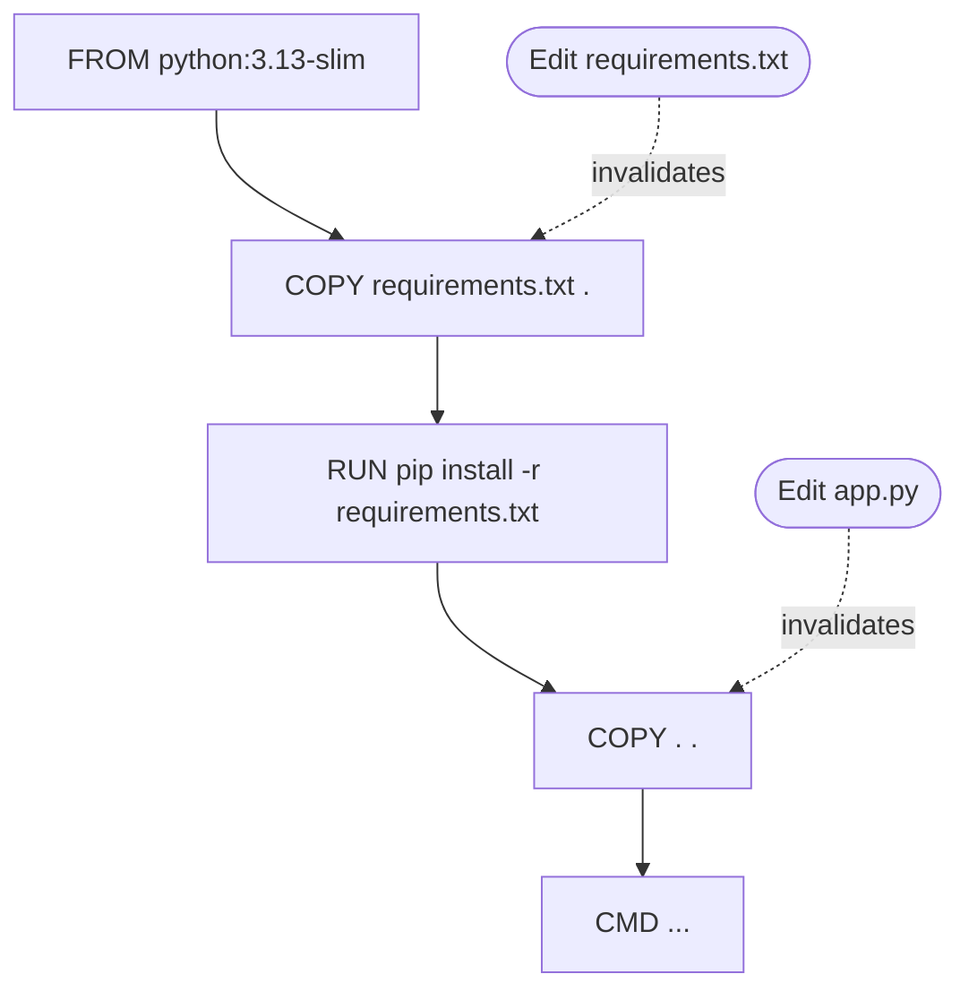
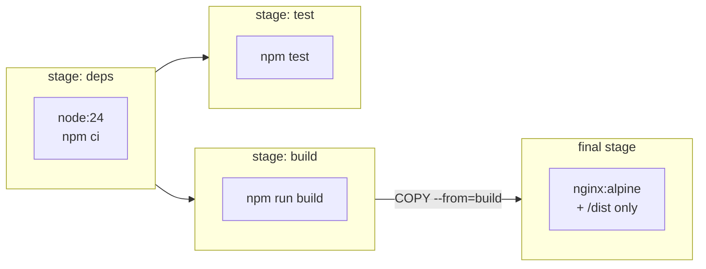
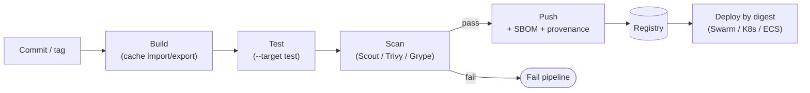

[Docker](./) &raquo; Dockerfiles & CI/CD

A **Dockerfile** is a declarative build script: a sequence of instructions that BuildKit, Docker's build engine, evaluates against a *build context* to produce an OCI image. This page covers how that evaluation works (and why instruction order decides build speed), the instructions and their pitfalls, multi-stage builds, the BuildKit features that replaced most historical workarounds (cache mounts, secret mounts, heredocs), multi-platform builds, and how images are built, attested, and pushed from CI. Running images in production is covered in [Production Patterns](advanced.html); registries and signing in [Registries &amp; Supply Chain](registry.html).

## How a Build Works

Since Docker Engine 23.0, `docker build` is an alias for `docker buildx build`, and every build runs on **BuildKit**. The client sends the build context (the directory argument, filtered by `.dockerignore`) to a builder. BuildKit parses the Dockerfile into a dependency graph (LLB), executes independent branches in parallel, skips stages the requested target does not need, and exports the result as an image.



The first line `# syntax=docker/dockerfile:1` pins the Dockerfile *frontend* to the latest stable 1.x release, which BuildKit pulls at build time. This decouples Dockerfile features from the Engine version: a new flag such as `COPY --exclude` works as soon as the frontend supports it, without upgrading the daemon. Put it at the top of every Dockerfile.

### Layers and the build cache

Each filesystem-changing instruction (`RUN`, `COPY`, `ADD`) produces a layer; metadata instructions (`ENV`, `CMD`, `EXPOSE`, `USER`, ...) change only the image config. BuildKit reuses a cached result for an instruction when its inputs are unchanged:

- for `RUN`, the command string and all preceding steps;
- for `COPY`/`ADD`, a checksum of the *contents* of the copied files (modification times are ignored).

Once one step misses the cache, **every later step in that stage rebuilds**. Instruction order is therefore the main build-speed lever: put what changes rarely (base image, system packages, dependency manifests) above what changes on every commit (source code).



Editing application code invalidates only `COPY . .` and what follows; the slow dependency install is reused. Had `COPY . .` come first, every code change would reinstall all dependencies.

## A Minimal Dockerfile

```dockerfile
# syntax=docker/dockerfile:1
FROM python:3.13-slim

WORKDIR /app

# Dependency manifest first: this layer is reused until requirements change
COPY requirements.txt .
RUN pip install --no-cache-dir -r requirements.txt

# Application code last: changes here do not invalidate the install above
COPY . .

# Drop root before the process starts
RUN useradd --system --uid 10001 app
USER app

EXPOSE 5000
CMD ["python", "app.py"]
```

```bash
docker build -t my-app:dev .
docker run --rm -p 8080:5000 my-app:dev   # host port 8080 -> container port 5000
```

## Instruction Reference

| Instruction | Effect | Notes |
|-------------|--------|-------|
| `FROM image [AS name]` | Starts a stage from a base image | Pin a tag, or a digest (`@sha256:...`) for reproducibility |
| `RUN cmd` | Executes a command, commits the result as a layer | Supports `--mount`, `--network`, heredocs |
| `COPY src dest` | Copies files from the context or another stage | `--from`, `--chown`, `--chmod`, `--link`, `--exclude`, `--parents` |
| `ADD src dest` | Like `COPY`, plus remote URLs, Git repos, and auto-extraction of local tarballs | Use only when you need those features |
| `WORKDIR path` | Sets (and creates) the working directory | Prefer over `RUN cd ...` |
| `ENV key=value` | Sets an environment variable in the build *and* the final image | Persists into running containers |
| `ARG name[=default]` | Declares a build-time variable (`--build-arg`) | Not persisted in the image config, but visible in build history; never use for secrets |
| `USER user[:group]` | Sets the user for later `RUN` and for the container process | Use a numeric UID so Kubernetes `runAsNonRoot` can verify it |
| `EXPOSE port[/proto]` | Documents a listening port | Does *not* publish it; see [Port Publishing](docker-networking.html#port-publishing) |
| `CMD [...]` | Default command or default arguments to `ENTRYPOINT` | Overridden by arguments to `docker run` |
| `ENTRYPOINT [...]` | Fixed executable for the container | Overridden only by `--entrypoint` |
| `HEALTHCHECK CMD ...` | Command the engine runs to mark the container healthy/unhealthy | Used by Compose `service_healthy` and Swarm rollouts; ignored by Kubernetes |
| `LABEL key=value` | Adds metadata | Use the `org.opencontainers.image.*` keys |
| `STOPSIGNAL sig` | Signal sent by `docker stop` | Default `SIGTERM` |
| `SHELL [...]` | Changes the shell used by shell-form instructions | Mostly for Windows (`powershell`) or `bash -o pipefail` |

### Shell form vs. exec form

`RUN`, `CMD`, and `ENTRYPOINT` accept two syntaxes, and the difference matters at runtime:

| | Exec form `["prog", "arg"]` | Shell form `prog arg` |
|---|---|---|
| Runs as | `prog` directly | `/bin/sh -c "prog arg"` |
| PID 1 in container | Your process | The shell |
| Receives `SIGTERM` from `docker stop` | Yes | No: `sh` does not forward it, so the container is killed after the 10 s grace period |
| Variable expansion (`$HOME`) | No | Yes |
| Needs a shell in the image | No (works on distroless/scratch) | Yes |

Use exec form for `CMD` and `ENTRYPOINT`. If the process does not reap child processes or handle signals itself, run the container with `docker run --init` (which injects the `tini` init as PID 1). BuildKit's build checks warn about shell-form `CMD`/`ENTRYPOINT` (`JSONArgsRecommended`).

### CMD and ENTRYPOINT together

`ENTRYPOINT` fixes *what* runs; `CMD` supplies default *arguments* that `docker run` replaces:

```dockerfile
ENTRYPOINT ["python", "-m", "myapp"]
CMD ["--port", "8080"]
```

| Invocation | Process started |
|------------|-----------------|
| `docker run img` | `python -m myapp --port 8080` |
| `docker run img --port 9000` | `python -m myapp --port 9000` |
| `docker run --entrypoint sh img` | `sh` |

A common production pattern is an `ENTRYPOINT` script that performs setup and then `exec "$@"`, replacing itself with the `CMD` so the application becomes PID 1 and receives signals.

### COPY vs. ADD

Prefer `COPY`. `ADD` additionally downloads URLs, clones Git repositories (`ADD https://github.com/org/repo.git#v1.2.0 /src`), and silently extracts local tar archives, which makes its behavior depend on the input. When you do need a remote file, `ADD --checksum=sha256:...` verifies it, which is better than `RUN curl` without verification.

### ARG and ENV

`ARG` values exist only during the build; `ENV` values persist into the container. An `ARG` declared before `FROM` is in scope only for `FROM` lines and must be re-declared inside a stage to be used there:

```dockerfile
ARG PYTHON_VERSION=3.13
FROM python:${PYTHON_VERSION}-slim
ARG APP_VERSION          # re-declare to use inside this stage
LABEL org.opencontainers.image.version=$APP_VERSION
```

## Multi-Stage Builds

A multi-stage Dockerfile has several `FROM` lines. Early stages carry compilers, dev dependencies, and test tooling; the final stage copies in only the built artifacts. Build tooling never reaches the shipped image, which shrinks it and removes most of its CVEs.



```dockerfile
# syntax=docker/dockerfile:1
FROM node:24 AS deps
WORKDIR /app
COPY package.json package-lock.json ./
RUN --mount=type=cache,target=/root/.npm npm ci

FROM deps AS build
COPY . .
RUN npm run build

FROM deps AS test
COPY . .
RUN npm test

FROM nginx:alpine AS runtime
COPY --from=build /app/dist /usr/share/nginx/html
```

BuildKit builds only the stages the target depends on. `docker build .` builds the last stage (`runtime`), which needs `deps` and `build` but not `test`; `docker build --target test .` runs the tests. Independent stages execute in parallel.

Typical size effect of moving from a single-stage to a multi-stage build (orders of magnitude, not guarantees):

| Workload | Single stage on the SDK image | Multi-stage runtime image |
|----------|-------------------------------|---------------------------|
| Static front end served by nginx | ~1 GB (`node`) | tens of MB (`nginx:alpine` + assets) |
| Go or Rust static binary | ~1 GB (`golang`) | ~10-20 MB (`scratch` / `distroless/static`) |
| Java service | ~500 MB+ (JDK) | ~200 MB (JRE or distroless Java) |

`COPY --from` also accepts an external image, e.g. `COPY --from=ghcr.io/astral-sh/uv:latest /uv /bin/uv`, which pulls a single binary out of another image without a stage of your own.

## BuildKit Features

These features require BuildKit (the default) and the `# syntax=docker/dockerfile:1` directive.

### Cache mounts

A cache mount persists a directory (a package manager cache) across builds *without* storing it in a layer. Dependencies download once per builder, not once per cache miss:

```dockerfile
# syntax=docker/dockerfile:1
FROM golang:1.26 AS build
WORKDIR /src
COPY go.mod go.sum ./
RUN --mount=type=cache,target=/go/pkg/mod go mod download
COPY . .
RUN --mount=type=cache,target=/go/pkg/mod \
    --mount=type=cache,target=/root/.cache/go-build \
    CGO_ENABLED=0 go build -o /out/app .
```

Cache mounts live in the builder, so ephemeral CI runners lose them between jobs unless the cache is exported (see [Caching in CI](#caching-in-ci)).

### Secret and SSH mounts

Anything passed with `ARG`, set with `ENV`, or `COPY`ed into a stage is recoverable from the image or its history, even if a later step deletes it. Build-time credentials belong in a **secret mount**, which exposes the value to a single `RUN` as a tmpfs file (or, with `env=`, an environment variable) and never writes it to a layer:

```dockerfile
# syntax=docker/dockerfile:1
RUN --mount=type=secret,id=npm_token,env=NPM_TOKEN \
    npm ci
# Private Git dependencies over the host's SSH agent
RUN --mount=type=ssh git clone git@github.com:org/private-lib.git
```

```bash
docker build --secret id=npm_token,env=NPM_TOKEN --ssh default .
```

### Heredocs

Heredocs make multi-line scripts and inline files readable without `&& \` chains:

```dockerfile
# syntax=docker/dockerfile:1
RUN <<EOF
set -eux
apt-get update
apt-get install -y --no-install-recommends curl ca-certificates
rm -rf /var/lib/apt/lists/*
EOF

COPY <<EOF /etc/app/config.yaml
log_level: info
EOF
```

The whole heredoc is one `RUN`, so the cleanup happens in the same layer as the install. Files deleted in a *later* layer still occupy space in the earlier one.

### Other COPY and RUN options

| Option | Purpose |
|--------|---------|
| `COPY --link` | Creates the layer independently of the layers below it, so changing the base image does not invalidate it and it can be rebased without a rebuild |
| `COPY --exclude=*.md` | Filters files out of a single copy |
| `COPY --parents` | Preserves the source directory structure (e.g. copying every `*/package.json` of a monorepo) |
| `COPY --chmod=0755` / `--chown=10001` | Sets mode and ownership without an extra `RUN chmod` layer |
| `RUN --network=none` | Proves a step is hermetic (fails if it tries to download) |
| `RUN --mount=type=bind,source=...,target=...` | Reads context files in a `RUN` without copying them into a layer |

### Build checks

BuildKit lints the Dockerfile during every build and prints warnings for issues such as shell-form `CMD`, secrets in `ARG`/`ENV` names, mismatched stage-name casing, or undefined variables. `docker build --check .` runs only the checks. A directive at the top of the file configures them:

```dockerfile
# syntax=docker/dockerfile:1
# check=error=true
```

With `error=true`, any violation fails the build. Pin a specific frontend version (e.g. `docker/dockerfile:1.19`) when doing so, so that newly added checks do not start failing CI unexpectedly.

## The Build Context and .dockerignore

Everything in the context directory is sent to the builder unless `.dockerignore` excludes it. A missing `.dockerignore` makes builds slower, invalidates `COPY . .` on irrelevant changes, and risks shipping credentials:

```text
# .dockerignore
.git
**/node_modules
**/__pycache__
*.log
.env
.env.*
Dockerfile*
compose*.yaml
dist/
```

A Dockerfile-specific ignore file (`api.Dockerfile.dockerignore` next to `api.Dockerfile`) takes precedence over the root file, which is useful in monorepos.

## Multi-Platform Images

A single tag can reference an image **index** with a variant per OS/architecture (for example `linux/amd64` and `linux/arm64`). The client pulls the variant matching the host.

```bash
# Build both architectures and push the index in one step
docker buildx build --platform linux/amd64,linux/arm64 -t ghcr.io/org/app:1.4.0 --push .
```

A builder produces non-native variants either by **emulation** (QEMU via binfmt; simple but often 5-20x slower for compile-heavy steps), by **cross-compilation** inside a native build stage (fast; the pattern for Go, Rust, and .NET), or by **native nodes** (a multi-node builder, a native arm64 CI runner, or Docker Build Cloud). The cross-compilation pattern uses the automatic platform arguments:

```dockerfile
# syntax=docker/dockerfile:1
FROM --platform=$BUILDPLATFORM golang:1.26 AS build
ARG TARGETOS TARGETARCH
WORKDIR /src
COPY . .
RUN CGO_ENABLED=0 GOOS=$TARGETOS GOARCH=$TARGETARCH go build -o /out/app .

FROM gcr.io/distroless/static-debian13:nonroot
COPY --from=build /out/app /app
ENTRYPOINT ["/app"]
```

The build stage runs natively on the builder's own architecture (`$BUILDPLATFORM`); only the tiny final stage is assembled per target. Since Engine 29, new installations use the containerd image store, which can hold multi-platform images and attestations locally (the classic store could not).

## Best Practices

| Practice | Why |
|----------|-----|
| Start every file with `# syntax=docker/dockerfile:1` | Current frontend features and build checks regardless of Engine version |
| Pin base images by tag, and by digest where reproducibility matters | `latest` and floating tags change underneath you; a digest is immutable. Let a bot (Renovate, Dependabot) bump digests |
| Choose a minimal runtime base (`-slim`, `alpine`, distroless, Docker Hardened Images, Chainguard) | Fewer packages means fewer CVEs and faster pulls; see [Design Patterns](docker-design-patterns.html#distroless-and-hardened-base-images) |
| Order instructions from least to most frequently changing | Maximizes cache reuse |
| Install and clean up in the same `RUN` (`--no-install-recommends`, remove apt lists) | Deleting in a later layer does not shrink the image |
| Use cache mounts for package managers instead of baking caches into layers | Faster rebuilds, smaller images |
| Never pass secrets through `ARG`, `ENV`, or `COPY` | Recoverable from history; use `--mount=type=secret` |
| Run as a non-root numeric UID | Limits the impact of a compromise; verifiable by orchestrators |
| Exec-form `CMD`/`ENTRYPOINT`; `--init` if needed | Correct signal handling and graceful shutdown |
| Add OCI labels (`org.opencontainers.image.source`, `.revision`) | Links an image back to the commit that produced it |

## Building Images in CI/CD

A CI pipeline turns a commit into a tested, scanned, attested image in a registry. Whatever the CI system, the stages are the same:



Deploy by the immutable digest the push produced, not by a mutable tag, so what was tested is what runs.

### GitHub Actions

Docker's official actions handle builder setup, registry login, tag generation, and caching. `docker/metadata-action` derives tags and OCI labels from the Git ref (branch, semver tag, short SHA):


```yaml
# .github/workflows/image.yml
name: image
on:
  push:
    branches: [main]
    tags: ['v*']
  pull_request:

permissions:
  contents: read
  packages: write        # push to GHCR
  id-token: write        # keyless signing / attestations
  attestations: write

jobs:
  build:
    runs-on: ubuntu-latest
    steps:
      - uses: actions/checkout@v7

      - uses: docker/setup-buildx-action@v4

      - uses: docker/login-action@v4
        if: github.event_name != 'pull_request'
        with:
          registry: ghcr.io
          username: ${{ github.actor }}
          password: ${{ secrets.GITHUB_TOKEN }}

      - id: meta
        uses: docker/metadata-action@v6
        with:
          images: ghcr.io/${{ github.repository }}
          tags: |
            type=ref,event=branch
            type=semver,pattern={{version}}
            type=sha

      - uses: docker/build-push-action@v7
        with:
          push: ${{ github.event_name != 'pull_request' }}
          tags: ${{ steps.meta.outputs.tags }}
          labels: ${{ steps.meta.outputs.labels }}
          cache-from: type=gha
          cache-to: type=gha,mode=max
          provenance: mode=max
          sbom: true
```


Pull requests build and cache but do not push. `provenance` and `sbom` attach SLSA provenance and an SPDX SBOM to the pushed image as attestations; [Registries &amp; Supply Chain](registry.html) covers verifying them. Check each action's release page for the current major version when you copy this; they are bumped periodically (most recently for the Node 24 Actions runtime).

### GitLab CI/CD

GitLab runners commonly build with Docker-in-Docker. Use a pinned `docker` image and TLS between the job and the `dind` service:

```yaml
# .gitlab-ci.yml
build:
  image: docker:29
  services:
    - docker:29-dind
  variables:
    DOCKER_TLS_CERTDIR: "/certs"
  before_script:
    - echo "$CI_REGISTRY_PASSWORD" | docker login -u "$CI_REGISTRY_USER" --password-stdin "$CI_REGISTRY"
  script:
    - docker buildx create --use
    - >
      docker buildx build
      --cache-from type=registry,ref=$CI_REGISTRY_IMAGE:buildcache
      --cache-to type=registry,ref=$CI_REGISTRY_IMAGE:buildcache,mode=max
      -t $CI_REGISTRY_IMAGE:$CI_COMMIT_SHA
      --push .
```

Docker-in-Docker requires a privileged runner. Where that is not acceptable, rootless BuildKit (`moby/buildkit:rootless`) or a daemonless builder such as Buildah are the usual alternatives.

### Caching in CI

Ephemeral runners start with an empty builder, so without an exported cache every CI build is a cold build. BuildKit can export and import its cache through several backends:

| Backend | `--cache-to` / `--cache-from` | Fits |
|---------|-------------------------------|------|
| GitHub Actions cache | `type=gha` | GitHub-hosted runners (subject to the repository cache quota) |
| Registry | `type=registry,ref=<repo>:buildcache` | Any CI with registry access; shared across branches |
| Inline | `type=inline` | Simple setups; embeds cache metadata in the image, `min` mode only |
| Local directory | `type=local,dest=...` | Self-hosted runners with persistent disks |
| S3 / Azure Blob | `type=s3`, `type=azblob` | Large caches on cloud storage |

`mode=max` exports the layers of every stage, not only the final one, which is what makes multi-stage builds cache well. Remote builders (Docker Build Cloud or a self-hosted BuildKit) sidestep export entirely because the cache stays warm on the builder.

### Pipeline practices

| Practice | Why |
|----------|-----|
| Tag with the commit SHA (and semver on releases) | Traceable, immutable references |
| Deploy by digest | The deployed bytes are exactly the tested bytes |
| Never deploy `latest` | Mutable, and ambiguous in rollbacks |
| Run tests as a build target | The same image and dependencies as production |
| Scan and fail on fixable critical/high CVEs | Blocks known-vulnerable images before they reach a registry |
| Attach SBOM and provenance attestations; sign images | Consumers can verify what an image contains and where it was built |

## Common Pitfalls

| Pitfall | Consequence | Fix |
|---------|-------------|-----|
| `COPY . .` before installing dependencies | Every code change reinstalls all dependencies | Copy manifests, install, then copy source |
| Cleaning up in a separate `RUN` | Files persist in the earlier layer; no size reduction | Install and clean up in one `RUN` (or a heredoc) |
| Secrets in `ARG`, `ENV`, or copied files | Recoverable with `docker history` or by unpacking layers | `RUN --mount=type=secret` |
| Shell-form `CMD` | App is not PID 1, ignores `SIGTERM`, killed after 10 s | Exec form; `--init` if the app spawns children |
| No `.dockerignore` | Slow context upload, cache busting, leaked `.env` or `.git` | Add one early |
| `apt-get upgrade` in the Dockerfile | Unpinned, non-reproducible layers | Update the base image tag/digest instead |
| Assuming `EXPOSE` publishes a port | Service unreachable from the host | Publish with `-p` or Compose `ports:` |

## Docker Swarm: Native Orchestration

Swarm clustering, stack files, rolling updates, and the Swarm-versus-Kubernetes trade-off are covered in [Production Patterns: Docker Swarm](advanced.html#docker-swarm). The short version for a build pipeline: a stack file uses the Compose format, `docker stack deploy -c stack.yml app` deploys it, and `docker service update --image repo/app@sha256:... app_web` rolls out a newly built image.

## See Also

- [Fundamentals](fundamentals.html) - Images, layers, and the build context
- [Registries &amp; Supply Chain](registry.html) - Tagging, digests, signing, SBOMs, and provenance
- [Storage &amp; Security](storage-security.html) - Container hardening and secrets at runtime
- [Design Patterns](docker-design-patterns.html) - Distroless and hardened base images
- [Production Patterns](advanced.html) - Compose in production, Swarm, and resource limits
- [CI/CD](../ci-cd/) - Broader continuous delivery practices
- [Kubernetes](../kubernetes/) - Running the images you build at scale

## References

- [Dockerfile reference](https://docs.docker.com/reference/dockerfile/)
- [Docker Build documentation](https://docs.docker.com/build/)
- [Build checks](https://docs.docker.com/build/checks/)
- [Cache storage backends](https://docs.docker.com/build/cache/backends/)
- [Multi-platform builds](https://docs.docker.com/build/building/multi-platform/)
