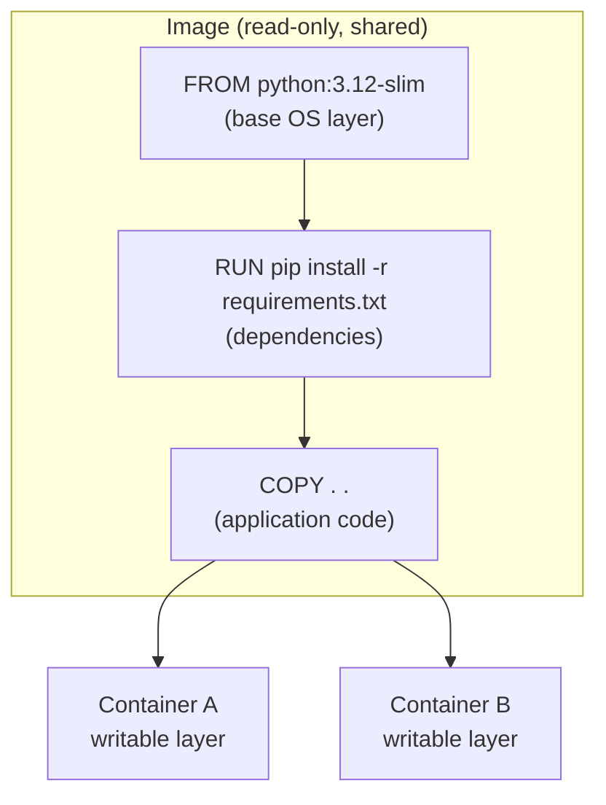
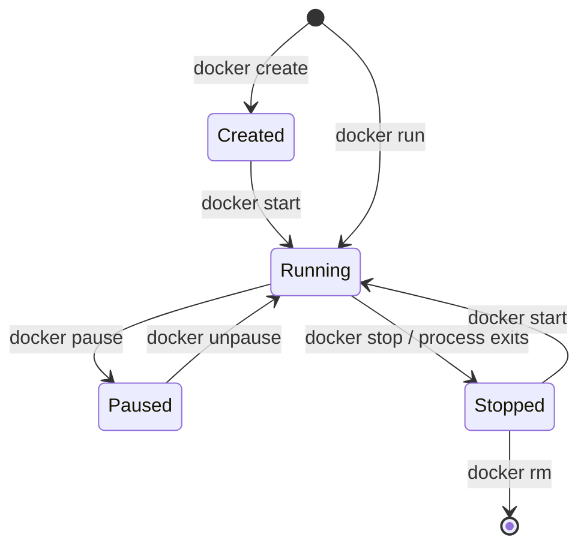
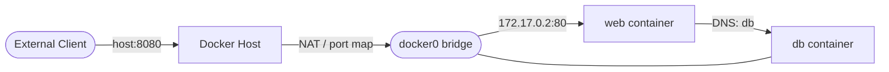

<div class="hero-section" style="background: linear-gradient(135deg, #0066cc 0%, #00aaff 100%); color: white; padding: 3rem 2rem; margin: -2rem -3rem 2rem -3rem; text-align: center;">
  <h1 style="color: white; margin: 0; font-size: 2.5rem;">Docker: Fundamentals</h1>
  <p style="font-size: 1.25rem; margin-top: 1rem; opacity: 0.9;">Master the core concepts of containerization including images, containers, networking, and the Docker architecture.</p>
</div>

## Why Docker? The Problems It Solves

Consider the following scenario: You have built an application that works perfectly on your machine. You hand it to a colleague, and it fails immediately. The culprit? Different Python versions, missing libraries, or conflicting configurations. Docker eliminates this entire class of problems.

<div class="problems-section">
  <h3><i class="fas fa-exclamation-triangle"></i> Common Development Challenges</h3>
  
  <div class="problem-grid">
    <div class="problem-item">
      <i class="fas fa-puzzle-piece"></i>
      <h4>Dependency Hell</h4>
      <p>Different projects require different versions of libraries, languages, and tools, leading to conflicts and complex virtual environment management.</p>
    </div>
    
    <div class="problem-item">
      <i class="fas fa-exchange-alt"></i>
      <h4>Environment Parity</h4>
      <p>Code that works perfectly on a developer's laptop fails in production due to OS differences, missing dependencies, or configuration mismatches.</p>
    </div>
    
    <div class="problem-item">
      <i class="fas fa-clock"></i>
      <h4>Onboarding Time</h4>
      <p>New team members spend days setting up development environments, installing tools, and troubleshooting configuration issues.</p>
    </div>
    
    <div class="problem-item">
      <i class="fas fa-server"></i>
      <h4>Resource Efficiency</h4>
      <p>Traditional VMs consume significant resources, limiting the number of applications that can run on a single server.</p>
    </div>
  </div>
  
  <h3><i class="fas fa-check-circle"></i> How Docker Solves These Problems</h3>
  
  <div class="solution-grid">
    <div class="solution-item">
      <i class="fas fa-cube"></i>
      <h4>Isolated Environments</h4>
      <p>Each container has its own filesystem, network, and process space, eliminating conflicts between applications.</p>
    </div>
    
    <div class="solution-item">
      <i class="fas fa-copy"></i>
      <h4>Reproducible Builds</h4>
      <p>Dockerfiles define exact steps to build an environment, ensuring consistency across all stages of development.</p>
    </div>
    
    <div class="solution-item">
      <i class="fas fa-play-circle"></i>
      <h4>Instant Setup</h4>
      <p>New developers can start with a simple `docker run` command, eliminating complex installation procedures.</p>
    </div>
    
    <div class="solution-item">
      <i class="fas fa-layer-group"></i>
      <h4>Efficient Layering</h4>
      <p>Docker's layer system shares common components between containers, dramatically reducing disk usage and memory overhead.</p>
    </div>
  </div>
</div>

## Essential Docker Commands

Before running any Docker commands, it helps to understand the mental model: Docker images are like recipes (blueprints), while containers are the actual dishes you create from those recipes. You can make many containers from the same image, and each one runs independently.

<div class="commands-section">
  <h3><i class="fas fa-terminal"></i> Core Operations</h3>

  <p class="intro-text">The following examples demonstrate the core concepts. Start with simple commands and build up to more complex workflows.</p>
  
  <div class="command-examples">
    <div class="example-section">
      <h4>Running Containers</h4>
      <p><strong>When to use:</strong> Start here when learning Docker or when you need to quickly test something in a clean environment.</p>
      <pre><code class="language-bash"># Run an interactive Ubuntu container
docker run -it ubuntu:22.04 bash

# You are now inside a minimal Linux system
cat /etc/os-release && exit</code></pre>
      <p class="explanation">The <code>-it</code> flags create an interactive terminal session. When you type <code>exit</code>, the container stops.</p>
    </div>
    
    <div class="example-section">
      <h4>Web Server Deployment</h4>
      <p><strong>When to use:</strong> When you need to run a service in the background, such as a web server, database, or API.</p>
      <pre><code class="language-bash"># Run Nginx web server in the background
docker run -d -p 8080:80 --name my-web nginx

# Visit http://localhost:8080, then clean up
docker stop my-web && docker rm my-web</code></pre>
      <p class="explanation">The <code>-d</code> flag runs the container in the background. The <code>-p 8080:80</code> maps your machine's port 8080 to the container's port 80.</p>
    </div>
    
    <div class="example-section">
      <h4>Building Custom Images</h4>
      <p><strong>When to use:</strong> When you need to package your own application with its specific dependencies and configuration.</p>
      <pre><code class="language-dockerfile"># Dockerfile - save this file, then build with: docker build -t my-app .
FROM python:3.12-slim
WORKDIR /app
COPY requirements.txt .
RUN pip install --no-cache-dir -r requirements.txt
COPY . .
CMD ["python", "app.py"]</code></pre>
      <pre><code class="language-bash"># Build and run your custom image
docker build -t my-app .
docker run -d -p 5000:5000 my-app</code></pre>
      <p class="explanation">A Dockerfile defines your environment step by step. Docker caches each step, so rebuilds are fast when only your code changes.</p>
    </div>
    
    <div class="example-section">
      <h4>Using Docker Compose</h4>
      <p><strong>When to use:</strong> When your application needs multiple services (web server + database, for example) that work together.</p>
      <pre><code class="language-yaml"># compose.yaml
services:
  web:
    build: .
    ports:
      - "5000:5000"
    depends_on:
      - redis
  redis:
    image: redis:alpine</code></pre>
      <pre><code class="language-bash"># Start all services with one command
docker compose up -d

# Stop everything
docker compose down</code></pre>
      <p class="explanation">Compose automatically creates a network where services can find each other by name. Your web service can connect to <code>redis</code> without knowing its IP address.</p>
    </div>
  </div>
  
  <div class="command-summary">
    <h3><i class="fas fa-lightbulb"></i> Key Takeaways</h3>
    <ul>
      <li><strong>Images</strong> are blueprints; <strong>containers</strong> are running instances</li>
      <li><strong>Dockerfiles</strong> define how to build images reproducibly</li>
      <li><strong>Port mapping</strong> connects container services to your host</li>
      <li><strong>Docker Compose</strong> manages multi-container applications</li>
      <li><strong>Volumes</strong> persist data beyond container lifecycle</li>
    </ul>
  </div>
</div>

## Understanding Container Technology

Before diving into Docker's specific implementation, it helps to understand how containers differ from traditional virtualization. This context will help you make informed decisions about when to use each approach.

### Containers vs Virtual Machines

Consider the following when choosing between containers and VMs:

| Factor | Choose Containers | Choose VMs |
|--------|-------------------|------------|
| Startup time matters | Yes - seconds vs minutes | Boot time acceptable |
| Running many instances | Yes - minimal overhead | Fewer, larger workloads |
| Need different OS | No - share host kernel | Yes - run Windows on Linux |
| Security isolation | Process-level sufficient | Need hardware-level isolation |
| Legacy applications | May need refactoring | Run as-is |

<div class="comparison-section">
  <p class="section-intro">Containers are lightweight, resource-efficient, and portable, making them suitable for modern, scalable applications. Virtual machines provide strong isolation, full OS support, and hardware emulation but can be resource-intensive and slower to start up.</p>
  
  <div class="architecture-comparison">
    <div class="architecture-diagram">
      <svg viewBox="0 0 600 350">
        <!-- Container Architecture -->
        <g id="container-arch">
          <text x="150" y="20" text-anchor="middle" font-size="14" font-weight="bold">Container Architecture</text>
          
          <!-- Hardware -->
          <rect x="50" y="300" width="200" height="40" fill="#34495e" />
          <text x="150" y="325" text-anchor="middle" font-size="11" fill="white">Hardware</text>
          
          <!-- Host OS -->
          <rect x="50" y="250" width="200" height="40" fill="#3498db" />
          <text x="150" y="275" text-anchor="middle" font-size="11" fill="white">Host OS + Kernel</text>
          
          <!-- Container Runtime -->
          <rect x="50" y="200" width="200" height="40" fill="#e74c3c" />
          <text x="150" y="225" text-anchor="middle" font-size="11" fill="white">Container Runtime</text>
          
          <!-- Containers -->
          <rect x="60" y="80" width="55" height="110" fill="#2ecc71" opacity="0.7" stroke="#27ae60" stroke-width="2" />
          <text x="87" y="100" text-anchor="middle" font-size="9" fill="white">App A</text>
          <text x="87" y="115" text-anchor="middle" font-size="8" fill="white">Bins/Libs</text>
          
          <rect x="125" y="80" width="55" height="110" fill="#f39c12" opacity="0.7" stroke="#d68910" stroke-width="2" />
          <text x="152" y="100" text-anchor="middle" font-size="9" fill="white">App B</text>
          <text x="152" y="115" text-anchor="middle" font-size="8" fill="white">Bins/Libs</text>
          
          <rect x="190" y="80" width="55" height="110" fill="#9b59b6" opacity="0.7" stroke="#8e44ad" stroke-width="2" />
          <text x="217" y="100" text-anchor="middle" font-size="9" fill="white">App C</text>
          <text x="217" y="115" text-anchor="middle" font-size="8" fill="white">Bins/Libs</text>
        </g>
        
        <!-- VM Architecture -->
        <g id="vm-arch" transform="translate(300,0)">
          <text x="150" y="20" text-anchor="middle" font-size="14" font-weight="bold">Virtual Machine Architecture</text>
          
          <!-- Hardware -->
          <rect x="50" y="300" width="200" height="40" fill="#34495e" />
          <text x="150" y="325" text-anchor="middle" font-size="11" fill="white">Hardware</text>
          
          <!-- Host OS -->
          <rect x="50" y="250" width="200" height="40" fill="#3498db" />
          <text x="150" y="275" text-anchor="middle" font-size="11" fill="white">Host OS</text>
          
          <!-- Hypervisor -->
          <rect x="50" y="200" width="200" height="40" fill="#e74c3c" />
          <text x="150" y="225" text-anchor="middle" font-size="11" fill="white">Hypervisor</text>
          
          <!-- VMs -->
          <rect x="60" y="50" width="55" height="140" fill="#2ecc71" opacity="0.7" stroke="#27ae60" stroke-width="2" />
          <text x="87" y="70" text-anchor="middle" font-size="9" fill="white">App A</text>
          <text x="87" y="85" text-anchor="middle" font-size="8" fill="white">Bins/Libs</text>
          <rect x="65" y="120" width="45" height="25" fill="#27ae60" opacity="0.5" />
          <text x="87" y="137" text-anchor="middle" font-size="8" fill="white">Guest OS</text>
          
          <rect x="125" y="50" width="55" height="140" fill="#f39c12" opacity="0.7" stroke="#d68910" stroke-width="2" />
          <text x="152" y="70" text-anchor="middle" font-size="9" fill="white">App B</text>
          <text x="152" y="85" text-anchor="middle" font-size="8" fill="white">Bins/Libs</text>
          <rect x="130" y="120" width="45" height="25" fill="#d68910" opacity="0.5" />
          <text x="152" y="137" text-anchor="middle" font-size="8" fill="white">Guest OS</text>
          
          <rect x="190" y="50" width="55" height="140" fill="#9b59b6" opacity="0.7" stroke="#8e44ad" stroke-width="2" />
          <text x="217" y="70" text-anchor="middle" font-size="9" fill="white">App C</text>
          <text x="217" y="85" text-anchor="middle" font-size="8" fill="white">Bins/Libs</text>
          <rect x="195" y="120" width="45" height="25" fill="#8e44ad" opacity="0.5" />
          <text x="217" y="137" text-anchor="middle" font-size="8" fill="white">Guest OS</text>
        </g>
      </svg>
    </div>
  </div>
</div>

<div class="pros-cons-comparison">
  <div class="container-pros-cons">
    <h3><i class="fas fa-box"></i> Container Pros/Cons</h3>
    
    <div class="pros-cons-grid">
      <div class="pros-section">
        <h4><i class="fas fa-check-circle"></i> Pros</h4>
        <div class="pro-item">
          <i class="fas fa-feather-alt"></i>
          <div>
            <strong>Lightweight</strong>
            <p>Share the host OS kernel, minimal overhead</p>
          </div>
        </div>
        <div class="pro-item">
          <i class="fas fa-rocket"></i>
          <div>
            <strong>Fast startup</strong>
            <p>Start in seconds for rapid deployment</p>
          </div>
        </div>
        <div class="pro-item">
          <i class="fas fa-chart-line"></i>
          <div>
            <strong>Resource efficiency</strong>
            <p>Higher density on single host</p>
          </div>
        </div>
        <div class="pro-item">
          <i class="fas fa-ship"></i>
          <div>
            <strong>Portability</strong>
            <p>Consistent deployment across environments</p>
          </div>
        </div>
        <div class="pro-item">
          <i class="fas fa-shield-alt"></i>
          <div>
            <strong>Process Isolation</strong>
            <p>Applications run without interference</p>
          </div>
        </div>
      </div>
      
      <div class="cons-section">
        <h4><i class="fas fa-times-circle"></i> Cons</h4>
        <div class="con-item">
          <i class="fas fa-link"></i>
          <div>
            <strong>Kernel dependency</strong>
            <p>Limited cross-platform compatibility</p>
          </div>
        </div>
        <div class="con-item">
          <i class="fas fa-lock-open"></i>
          <div>
            <strong>Security boundaries</strong>
            <p>Weaker isolation than VMs</p>
          </div>
        </div>
        <div class="con-item">
          <i class="fas fa-ban"></i>
          <div>
            <strong>Limited applications</strong>
            <p>Not suitable for kernel modifications</p>
          </div>
        </div>
      </div>
    </div>
  </div>

  <div class="vm-pros-cons">
    <h3><i class="fas fa-desktop"></i> Virtual Machine Pros/Cons</h3>
    
    <div class="pros-cons-grid">
      <div class="pros-section">
        <h4><i class="fas fa-check-circle"></i> Pros</h4>
        <div class="pro-item">
          <i class="fas fa-lock"></i>
          <div>
            <strong>Strong isolation</strong>
            <p>Complete OS separation for security</p>
          </div>
        </div>
        <div class="pro-item">
          <i class="fas fa-layer-group"></i>
          <div>
            <strong>Full OS support</strong>
            <p>Run any OS version or distribution</p>
          </div>
        </div>
        <div class="pro-item">
          <i class="fas fa-microchip"></i>
          <div>
            <strong>Hardware emulation</strong>
            <p>Support legacy and platform-specific apps</p>
          </div>
        </div>
        <div class="pro-item">
          <i class="fas fa-history"></i>
          <div>
            <strong>Mature ecosystem</strong>
            <p>Extensive tooling and management</p>
          </div>
        </div>
      </div>
      
      <div class="cons-section">
        <h4><i class="fas fa-times-circle"></i> Cons</h4>
        <div class="con-item">
          <i class="fas fa-weight-hanging"></i>
          <div>
            <strong>Resource-intensive</strong>
            <p>Full OS stack overhead</p>
          </div>
        </div>
        <div class="con-item">
          <i class="fas fa-hourglass-half"></i>
          <div>
            <strong>Slow startup</strong>
            <p>Minutes to boot and initialize</p>
          </div>
        </div>
        <div class="con-item">
          <i class="fas fa-database"></i>
          <div>
            <strong>Storage overhead</strong>
            <p>Duplicated OS and libraries</p>
          </div>
        </div>
        <div class="con-item">
          <i class="fas fa-random"></i>
          <div>
            <strong>Deployment complexity</strong>
            <p>Manual dependency management</p>
          </div>
        </div>
      </div>
    </div>
  </div>
</div>

### What Containers Guarantee

Containers provide strong guarantees in several areas:

- **Application dependencies**: All libraries and tools are bundled together, eliminating "missing dependency" errors
- **Configuration**: Environment settings travel with the container, making deployments reproducible
- **Isolation**: Each container has its own filesystem and process space, preventing conflicts between applications
- **Portability**: The same container runs on any machine with Docker installed

### What Containers Cannot Guarantee

However, some factors remain outside container control:

- **Kernel features**: Containers share the host kernel, so a container expecting Linux 5.x features will not work on a host running Linux 4.x
- **Hardware access**: GPU acceleration, specialized devices, and host-specific resources may behave differently across machines
- **Resource limits**: CPU and memory constraints vary by host, affecting performance consistency
- **Platform differences**: A Linux container cannot run natively on Windows without a Linux VM layer

**Practical guidance**: For maximum portability, avoid dependencies on specific kernel versions or hardware features. When these are unavoidable, document the requirements clearly.

Now that we understand what containers do, let's briefly look at how Docker implements them. You do not need to memorize these details to use Docker effectively, but understanding the architecture helps when troubleshooting or optimizing performance.

### Docker Architecture Overview

Docker uses a layered architecture where each component has a specific responsibility:

| Component | Role | When You Interact With It |
|-----------|------|---------------------------|
| Docker CLI | User interface | Every docker command you run |
| Docker Daemon | Manages containers, images, networks | Runs in background |
| containerd | Container lifecycle management | Rarely directly |
| runc | Actually runs containers | Never directly |

### Container Runtime Basics

At its core, a container is defined by:

- **Filesystem**: What files the container can see (its "root filesystem")
- **Namespaces**: Isolation boundaries for processes, network, users, and more
- **Cgroups**: Resource limits for CPU, memory, and I/O
- **Security**: Capabilities, seccomp profiles, and mandatory access controls

The Open Container Initiative (OCI) standardizes these specifications, allowing containers to run on any compliant runtime.

> **Note**: Most users never interact with these low-level components directly. Docker's CLI abstracts away this complexity while giving you control when needed.

### How Images Are Layered

A Docker image is not a single blob; it is a stack of read-only layers, one per build instruction. When you run a container, Docker adds a thin writable layer on top. Multiple containers from the same image share the underlying read-only layers, which is why containers are so lightweight.



**Why this matters for builds**: Docker caches each layer. If a layer's inputs are unchanged, Docker reuses the cached layer instead of rebuilding it. Ordering instructions so that rarely-changing steps (installing dependencies) come before frequently-changing steps (copying source code) maximizes cache hits and dramatically speeds up rebuilds.

### The Container Lifecycle

A container is not simply "on" or "off." It moves through a small set of well-defined states, and knowing them explains why a stopped container still occupies disk, and why `docker run` and `docker start` are different operations.



| State | Meaning | Writable layer kept? |
|-------|---------|----------------------|
| Created | Filesystem prepared, process not started | Yes |
| Running | Main process executing | Yes |
| Paused | Processes frozen via cgroup freezer | Yes |
| Stopped (Exited) | Process ended; container retained | Yes (until `docker rm`) |
| Removed | Container and its writable layer deleted | No |

**Key insight**: `docker run` is shorthand for `docker create` + `docker start`. A stopped container keeps its writable layer and configuration, so `docker start` resumes it with state intact. Only `docker rm` reclaims that space — which is why `docker ps -a` often reveals a long tail of forgotten exited containers.

### Operating a Running Container

A handful of commands cover almost all day-to-day inspection and debugging:

```bash
docker ps                       # List running containers
docker ps -a                    # Include stopped containers
docker logs -f my-web           # Stream a container's stdout/stderr
docker exec -it my-web bash     # Open a shell inside a running container
docker inspect my-web           # Full JSON: networks, mounts, env, state
docker stats                    # Live CPU/memory/IO per container
docker cp my-web:/app/log.txt . # Copy a file out of a container
```

`docker exec` is the workhorse for debugging: it starts a *new* process inside an already-running container, unlike `docker run` which creates a fresh container. If `exec` fails with "executable not found," the image is likely a minimal one (e.g. `distroless` or `scratch`) that ships no shell.

### The Build Context and .dockerignore

When you run `docker build .`, the trailing `.` is the **build context** — the entire directory tree is sent to the Docker daemon before the build begins. A bloated context (a stray `node_modules/` or `.git/`) slows every build and can leak secrets into images via a careless `COPY . .`.

A `.dockerignore` file, with the same syntax as `.gitignore`, excludes paths from the context:

```dockerignore
.git
node_modules
*.log
.env
Dockerfile
```

This both speeds uploads and prevents accidental inclusion of credentials or local artifacts in the final image.

## Docker Network Architecture

Networking is often the trickiest part of containerization. Containers need to communicate with each other, with the host, and with external services, all while maintaining isolation. Docker provides several network drivers for different scenarios.

### Network Driver Quick Reference

| Driver | Use Case | Isolation | Performance |
|--------|----------|-----------|-------------|
| bridge | Default for standalone containers | Good | Good |
| host | Maximum performance needed | None | Best |
| overlay | Multi-host communication (Swarm) | Good | Good |
| macvlan | Container needs real IP on network | Varies | Good |
| none | Complete network isolation | Maximum | N/A |

### How Bridge Networking Works

When you run a container without specifying a network, Docker uses the default bridge network. Here is what happens:

1. Docker creates a virtual network interface pair (veth)
2. One end attaches to the container, the other to a bridge on the host
3. The container gets an IP address from Docker's internal DHCP
4. Containers on the same bridge can communicate by IP
5. For external access, Docker uses NAT and port mapping

**Key insight**: Containers on the same user-defined bridge network can find each other by container name (automatic DNS). The default bridge does not have this feature, which is why creating custom networks is recommended.

The diagram below shows how an external request reaches a container on a bridge network, and how two containers on the same network reach each other directly by name:



### When to Use Each Network Type

- **bridge**: Development, single-host deployments, isolated applications
- **host**: Performance-critical applications, when container port must match host port
- **overlay**: Docker Swarm services spanning multiple hosts
- **macvlan**: When container must appear as physical device on network (legacy integration)
- **none**: Security-sensitive workloads that should have no network access

<div class="notice--warning">
  <h4>Common Pitfalls</h4>
  <ul>
    <li><strong>Relying on the default bridge for DNS:</strong> Containers on the default <code>bridge</code> cannot resolve each other by name. Always create a user-defined network for multi-container apps.</li>
    <li><strong>Expecting data to persist:</strong> A container's writable layer is destroyed with the container. Use volumes for anything you need to keep (see Storage &amp; Security).</li>
    <li><strong>Using <code>latest</code> tags:</strong> <code>latest</code> is not a fixed version; it moves. Pin explicit tags for reproducible builds.</li>
    <li><strong>Running as root:</strong> Containers default to root inside the container. Add a non-root <code>USER</code> for anything beyond local experiments.</li>
  </ul>
</div>

## Key Takeaways

<div class="takeaway-grid">
  <div class="takeaway-card">
    <h4>Images vs Containers</h4>
    <p>An image is an immutable, layered blueprint; a container is a running instance with a thin writable layer on top.</p>
  </div>
  <div class="takeaway-card">
    <h4>Containers Share the Kernel</h4>
    <p>Unlike VMs, containers share the host kernel — giving them second-startup times and minimal overhead, at the cost of weaker isolation.</p>
  </div>
  <div class="takeaway-card">
    <h4>Layers Drive Caching</h4>
    <p>Each Dockerfile instruction is a cached layer. Order from least- to most-frequently-changing to speed up rebuilds.</p>
  </div>
  <div class="takeaway-card">
    <h4>Custom Networks for DNS</h4>
    <p>User-defined bridge networks give containers automatic name resolution; the default bridge does not.</p>
  </div>
</div>

---

## See Also

- [Storage &amp; Security](storage-security.html) - Persist data with volumes and harden containers
- [Dockerfiles &amp; CI/CD](dockerfiles.html) - Build optimized images and automate pipelines
- [Advanced Patterns](advanced.html) - Production architectures and WebAssembly runtimes
- [Docker Essentials](../docker-essentials.html) - Quick command reference
- [Kubernetes](../kubernetes/) - Orchestrate containers at scale
