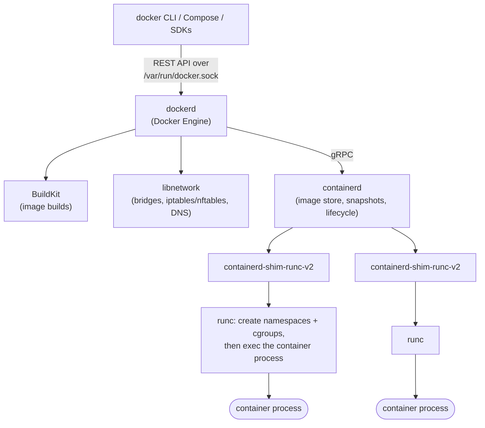
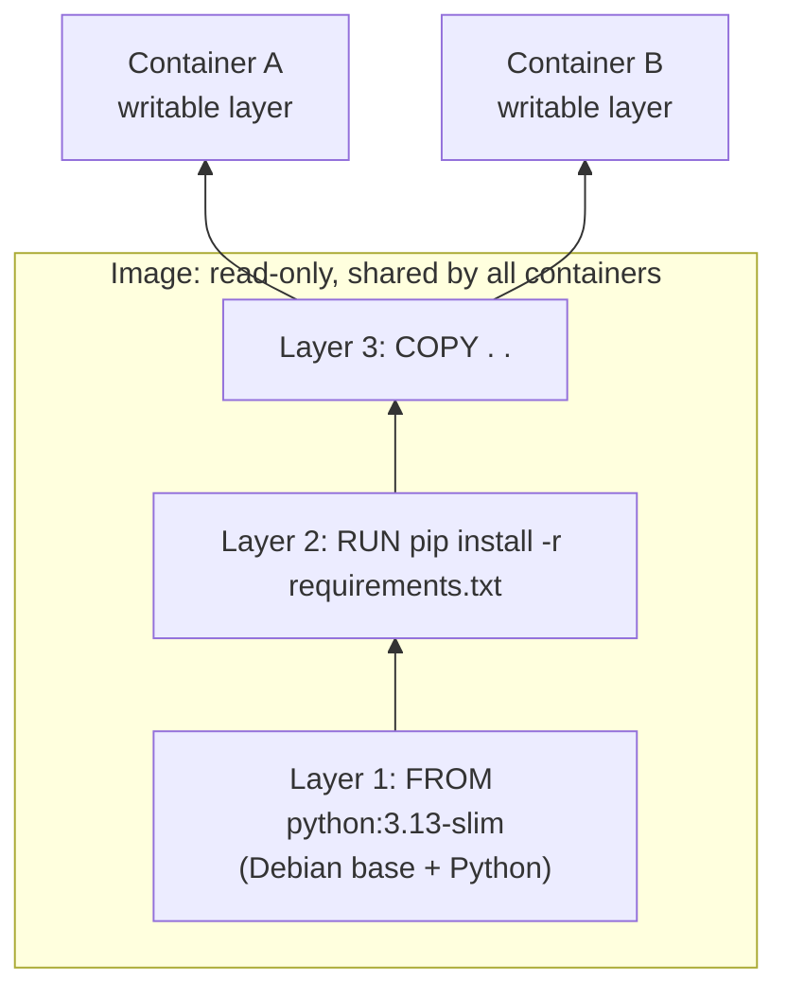
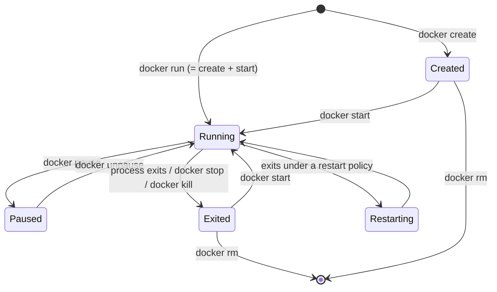
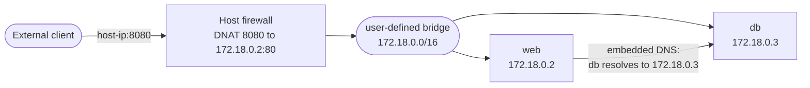

[Docker](./) &raquo; Fundamentals

Docker packages an application and its user-space dependencies into an **image**, and runs that image as an isolated process called a **container**. This page explains the model behind that sentence: what images and containers actually are, how the Docker Engine is put together, which Linux kernel features provide the isolation, how layered images and copy-on-write storage work, and the commands that cover day-to-day use. Storage, networking, Dockerfiles, and registries each have their own page (see [See Also](#see-also)).

## Core Concepts

| Term | What it is |
|------|------------|
| **Image** | An immutable, content-addressed bundle: an ordered stack of filesystem layers plus a JSON config (entrypoint, environment, user, exposed ports). Defined by the [OCI Image Specification](https://github.com/opencontainers/image-spec). |
| **Container** | A running (or stopped) instance of an image: the image's layers, a private writable layer, and one or more processes confined by namespaces and cgroups. |
| **Dockerfile** | A text recipe that BuildKit executes to produce an image. See [Dockerfiles &amp; CI/CD](dockerfiles.html). |
| **Registry** | An HTTP service that stores and serves images (Docker Hub, GHCR, ECR, Harbor). See [Registries &amp; Supply Chain](registry.html). |
| **Volume** | Docker-managed storage that outlives any container. See [Storage &amp; Security](storage-security.html). |
| **Network** | A virtual network that containers attach to; user-defined networks give name-based DNS. See [Networking](docker-networking.html). |
| **Compose** | A YAML description (`compose.yaml`) of a multi-container application, run with `docker compose`. |

The relationship to keep in mind: an image is to a container what a program binary is to a process. Many containers can run from one image, each with its own writable state.

## What Problem Containers Solve

A service depends on far more than its own code: a language runtime of a specific version, system libraries, CA certificates, configuration files, locale data. When those differ between a laptop, a CI runner, and a production host, the same code behaves differently. A container image captures the entire user-space filesystem the application needs, so the only remaining dependency on the host is a compatible Linux kernel and a container runtime.

This gives three practical properties:

- **Reproducibility.** The same image digest yields the same filesystem everywhere it runs.
- **Isolation.** Each container has its own filesystem view, process tree, network stack, and resource limits, so two services that need conflicting library versions coexist on one host.
- **Density and speed.** A container is a process, not a machine; it starts in milliseconds to seconds and costs little more memory than the process itself.

### What containers do not guarantee

Because every container on a host shares the host's kernel, some things remain host-dependent:

- **Kernel version and features.** A workload that needs a recent syscall, eBPF feature, or cgroup v2 controller will fail on an older kernel regardless of the image.
- **CPU architecture.** An `amd64` image does not run natively on `arm64`; publish multi-platform images (see [Registries](registry.html#how-a-registry-works)) or accept slow QEMU emulation.
- **Hardware and drivers.** GPU access requires the host driver plus a runtime hook such as the NVIDIA Container Toolkit (`docker run --gpus all ...`).
- **The OS family.** Linux containers need a Linux kernel. Docker Desktop on macOS and Windows runs them inside a lightweight Linux VM.

## Containers vs. Virtual Machines

A virtual machine virtualizes hardware: each guest boots its own kernel on top of a hypervisor. A container virtualizes the operating system view: processes share the host kernel, and the kernel gives each group of processes a private view of system resources.

<div class="architecture-diagram" style="overflow-x:auto">
<svg viewBox="0 0 640 300" role="img" aria-label="Side-by-side stacks. Containers: apps with their libraries run directly on a container runtime on the host kernel. Virtual machines: each app has its own guest OS and kernel on top of a hypervisor." style="max-width:640px;width:100%;height:auto;font-family:inherit" fill="none" stroke="currentColor">
  <g font-size="13" fill="currentColor" stroke="none" text-anchor="middle" font-weight="600">
    <text x="160" y="20">Containers</text>
    <text x="480" y="20">Virtual machines</text>
  </g>
  <!-- Containers stack -->
  <g stroke-width="1.5">
    <rect x="20" y="40" width="85" height="80" rx="4" stroke-dasharray="4 3"/>
    <rect x="117" y="40" width="85" height="80" rx="4" stroke-dasharray="4 3"/>
    <rect x="214" y="40" width="85" height="80" rx="4" stroke-dasharray="4 3"/>
    <rect x="20" y="170" width="280" height="36" rx="4"/>
    <rect x="20" y="214" width="280" height="36" rx="4" fill="currentColor" fill-opacity="0.08"/>
    <rect x="20" y="258" width="280" height="36" rx="4" fill="currentColor" fill-opacity="0.16"/>
  </g>
  <g font-size="11" fill="currentColor" stroke="none" text-anchor="middle">
    <text x="62" y="72">App A</text><text x="62" y="92" font-size="10" opacity="0.8">libs/runtime</text>
    <text x="159" y="72">App B</text><text x="159" y="92" font-size="10" opacity="0.8">libs/runtime</text>
    <text x="256" y="72">App C</text><text x="256" y="92" font-size="10" opacity="0.8">libs/runtime</text>
    <text x="160" y="148" font-size="10" opacity="0.8">namespaces + cgroups (no guest kernel)</text>
    <text x="160" y="193">Container runtime (dockerd / containerd / runc)</text>
    <text x="160" y="237">Host OS + shared Linux kernel</text>
    <text x="160" y="281">Hardware</text>
  </g>
  <!-- VM stack -->
  <g stroke-width="1.5">
    <rect x="340" y="40" width="85" height="120" rx="4"/>
    <rect x="437" y="40" width="85" height="120" rx="4"/>
    <rect x="534" y="40" width="85" height="120" rx="4"/>
    <rect x="346" y="112" width="73" height="40" rx="3" fill="currentColor" fill-opacity="0.08"/>
    <rect x="443" y="112" width="73" height="40" rx="3" fill="currentColor" fill-opacity="0.08"/>
    <rect x="540" y="112" width="73" height="40" rx="3" fill="currentColor" fill-opacity="0.08"/>
    <rect x="340" y="170" width="280" height="36" rx="4"/>
    <rect x="340" y="214" width="280" height="36" rx="4" fill="currentColor" fill-opacity="0.08"/>
    <rect x="340" y="258" width="280" height="36" rx="4" fill="currentColor" fill-opacity="0.16"/>
  </g>
  <g font-size="11" fill="currentColor" stroke="none" text-anchor="middle">
    <text x="382" y="72">App A</text><text x="382" y="92" font-size="10" opacity="0.8">libs/runtime</text>
    <text x="479" y="72">App B</text><text x="479" y="92" font-size="10" opacity="0.8">libs/runtime</text>
    <text x="576" y="72">App C</text><text x="576" y="92" font-size="10" opacity="0.8">libs/runtime</text>
    <text x="382" y="129" font-size="10">Guest OS</text><text x="382" y="143" font-size="10">+ kernel</text>
    <text x="479" y="129" font-size="10">Guest OS</text><text x="479" y="143" font-size="10">+ kernel</text>
    <text x="576" y="129" font-size="10">Guest OS</text><text x="576" y="143" font-size="10">+ kernel</text>
    <text x="480" y="193">Hypervisor (KVM, Hyper-V, ESXi)</text>
    <text x="480" y="237">Host OS / firmware</text>
    <text x="480" y="281">Hardware</text>
  </g>
</svg>
</div>

| Property | Containers | Virtual machines |
|----------|------------|------------------|
| Unit of isolation | Process group confined by kernel namespaces, cgroups, seccomp, LSMs | Full guest OS on virtual hardware |
| Kernel | Shared with host | One per VM |
| Startup | Milliseconds to seconds | Seconds to minutes |
| Footprint | Image size in MB; memory ~ the process itself | Guest OS disk in GB; reserved guest RAM |
| Isolation strength | Weaker: a kernel bug is a potential escape path for every container | Stronger: hardware-virtualization boundary |
| Guest OS choice | Must match host kernel family (Linux on Linux) | Any OS the hypervisor supports |
| Typical use | Microservices, CI jobs, dense multi-tenant hosting of trusted code | Legacy systems, different OSes, hard multi-tenancy |

The line between the two has blurred. Sandboxed runtimes such as gVisor (a user-space kernel) and Kata Containers or Firecracker (lightweight microVMs per container) keep the container workflow while restoring a VM-like boundary. Kubernetes nodes are also usually VMs themselves. See [Container Runtimes](../container-runtimes.html) for these options.

## How Docker Is Built

"Docker" names several layered components. The `docker` CLI is only a client; it talks to the **Docker Engine** daemon (`dockerd`) over a REST API, usually on the Unix socket `/var/run/docker.sock`. The daemon delegates container execution to **containerd**, which in turn launches each container through a small per-container shim and the OCI runtime **runc**.



| Component | Responsibility |
|-----------|----------------|
| `docker` CLI | Parses commands, calls the Engine API. Can target a remote engine via `docker context` or `DOCKER_HOST`. |
| `dockerd` | The Engine: API server, networking, volumes, BuildKit integration, orchestration of containerd. |
| BuildKit | The build backend (default since Engine 23.0). Executes Dockerfiles as a dependency graph with parallel stages, cache mounts, and secrets. `docker buildx` is its full CLI. |
| containerd | CNCF-graduated runtime daemon: pulls and stores images, manages snapshots (layer filesystems), supervises containers. Also the runtime under most Kubernetes clusters. |
| shim | One per container; keeps the container running if `dockerd` or containerd restarts, and holds its stdio and exit status. |
| runc | Reference implementation of the [OCI Runtime Specification](https://github.com/opencontainers/runtime-spec). Sets up the isolation, starts the process, then exits. |

Because the Engine API is a root-equivalent control plane, **access to `docker.sock` is equivalent to root on the host**. Membership in the `docker` group, or mounting the socket into a container, grants it. [Rootless mode](https://docs.docker.com/engine/security/rootless/) runs the whole daemon as an unprivileged user to remove that risk.

### Docker Engine in 2026

Recent Engine releases changed several defaults that older tutorials do not reflect:

| Change | Since | Effect |
|--------|-------|--------|
| BuildKit is the default builder | Engine 23.0 | `DOCKER_BUILDKIT=1` is no longer needed; the legacy builder is deprecated. |
| Compose V2 is a CLI plugin | 2022; V1 end of life 2023 | Use `docker compose` (space), not the Python `docker-compose`. The top-level `version:` key in Compose files is obsolete. |
| containerd image store is the default for fresh installs | Engine 29.0 (Nov 2025) | Images are stored as containerd content and snapshots rather than in the classic `overlay2` graph driver. Enables multi-platform images locally, attestations, and image mounts. Existing installs keep their current store until migrated. |
| Docker Content Trust removed from the CLI | Engine 29.0 | `DOCKER_CONTENT_TRUST=1` no longer does anything in the stock CLI; use cosign or Notation (see [Image Signing](registry.html#image-signing)). |
| cgroup v1 deprecated | Engine 29.0 | Supported until at least May 2029; hosts should run cgroup v2 (the default on current distributions). |
| Minimum API version 1.44 | Engine 29.0 | Clients older than Docker 25.0 can no longer talk to the daemon. |
| nftables firewall backend (experimental) | Engine 29.0 | Opt in with the daemon option `"firewall-backend": "nftables"` instead of iptables. |

**Docker Desktop** (macOS, Windows, Linux) bundles the Engine inside a managed VM with a GUI, Compose, BuildKit, Scout, and Kubernetes. It requires a paid subscription for larger commercial organizations; Docker Engine on Linux is open source (Moby project) and free. OCI-compatible alternatives include Podman (daemonless, rootless by default), nerdctl (a Docker-compatible CLI directly on containerd), and, on macOS, Colima and OrbStack.

## The Isolation Primitives

A container is not a kernel object. It is an ordinary Linux process that runc has placed into a set of namespaces and cgroups, with a restricted set of privileges. Knowing the pieces explains most container behavior and most container security advice.

| Mechanism | What it isolates or limits | Visible effect |
|-----------|----------------------------|----------------|
| **mount** namespace | Filesystem view | The container sees the image's root filesystem, not the host's. |
| **PID** namespace | Process IDs | The entrypoint is PID 1; host processes are invisible. |
| **network** namespace | Interfaces, routes, ports, firewall | Each container has its own `eth0` and `localhost`. |
| **UTS** namespace | Hostname | `hostname` returns the container ID or `--hostname`. |
| **IPC** namespace | System V IPC, POSIX message queues | No shared memory with other containers by default. |
| **user** namespace | UID/GID mapping | Optional (`userns-remap`, rootless): container root maps to an unprivileged host UID. |
| **cgroup** namespace | cgroup hierarchy view | The container sees its own cgroup as the root. |
| **time** namespace | Boot and monotonic clocks | Used by default on supported kernels since Engine 29.5. |
| **cgroups v2** | CPU, memory, I/O, PIDs | `--memory`, `--cpus`, `--pids-limit`; exceeding a memory limit triggers the OOM killer inside the container. |
| **Capabilities** | Slices of root's privileges | Docker drops most by default; `--cap-drop ALL` removes the rest. |
| **seccomp** | Allowed syscalls | The default profile blocks dozens of dangerous syscalls. |
| **AppArmor / SELinux** | Mandatory access control | Profiles such as `docker-default` or the `container_t` type confine file and device access. |

Everything else Docker offers (networks, volumes, restart policies, health checks) is built on top of these kernel features. The [Storage &amp; Security](storage-security.html#running-containers-securely) page covers how to tighten them.

## Images and Layers

An image is a stack of read-only layers. Each filesystem-changing Dockerfile instruction (`RUN`, `COPY`, `ADD`) produces one layer: a tarball of the files it added, changed, or deleted. At run time a union filesystem (overlayfs on Linux) stacks the layers and adds one thin **writable layer** per container.



Three consequences follow from this design:

- **Sharing.** Layers are content-addressed by SHA-256 digest, so ten containers from one image, or ten images built on the same base, store each shared layer once on disk and in the page cache.
- **Copy-on-write.** When a container modifies a file from a lower layer, the file is first copied up into the writable layer. Reads are fast, but the first write to a large file is slow, and write-heavy data (databases, logs) belongs in a volume rather than the writable layer.
- **Deletion does not shrink images.** Removing a file in a later layer only adds a "whiteout" marker; the bytes remain in the earlier layer. Clean up in the same `RUN` that created the files, or use a multi-stage build.

**Build cache.** BuildKit reuses a cached layer when an instruction and its inputs are unchanged. Once one step misses the cache, every step after it is rebuilt, so order instructions from least to most frequently changing: base image, system packages, dependency manifests and install, then application source.

**Where the layers live.** With the classic storage drivers the layers are under `/var/lib/docker/overlay2`. With the containerd image store (the default on new Engine 29 installs) containerd keeps compressed content blobs and unpacks them through its overlayfs *snapshotter* under `/var/lib/containerd`. The layer model is the same; only the on-disk bookkeeping differs. Useful inspection commands:

```bash
docker image history python:3.13-slim   # layers and the instruction that made each one
docker image inspect --format '{{json .RootFS.Layers}}' python:3.13-slim
docker system df                        # space used by images, containers, volumes, build cache
```

## The Container Lifecycle

A container moves through a small set of states. The writable layer and configuration exist from `create` until `rm`, which is why stopped containers still consume disk.



| State | Meaning |
|-------|---------|
| Created | Filesystem and config prepared; no process yet. |
| Running | PID 1 of the container is executing. |
| Paused | All processes frozen with the cgroup freezer; memory retained. |
| Restarting | The process exited and a restart policy (`--restart on-failure`, `unless-stopped`, `always`) is bringing it back. |
| Exited | The process ended. Exit code, logs, and writable layer are kept until `docker rm`. |

A container lives exactly as long as its **PID 1**. `docker stop` sends `SIGTERM` (or the image's `STOPSIGNAL`) to PID 1, waits 10 seconds by default (`--time` / `-t`), then sends `SIGKILL`. A shell-form entrypoint (`CMD python app.py`) runs the app under `/bin/sh -c`, which does not forward signals, so the app is killed rather than shut down cleanly; use the exec form (`CMD ["python", "app.py"]`) or run with `--init` to add a minimal init (tini) that forwards signals and reaps zombie processes. Exit code 137 means the container was killed by `SIGKILL`, commonly by the OOM killer or a stop timeout.

## Everyday Commands

### Running containers

```bash
# Interactive, removed on exit
docker run --rm -it ubuntu:24.04 bash

# Detached web server, host port 8080 -> container port 80
docker run -d --name web -p 8080:80 nginx:1.29

# With limits, environment, a volume, and a restart policy
docker run -d --name api \
  --memory 512m --cpus 1 \
  -e LOG_LEVEL=info \
  --mount type=volume,src=api-data,dst=/var/lib/api \
  --restart unless-stopped \
  my-api:1.4.2
```

| Flag | Meaning |
|------|---------|
| `-d` | Detach; run in the background. |
| `-it` | Interactive with a TTY (for shells). |
| `--rm` | Delete the container when it exits. |
| `-p HOST:CONTAINER` | Publish a port. Add an address (`127.0.0.1:8080:80`) to avoid exposing it on all interfaces. |
| `-e`, `--env-file` | Set environment variables. |
| `--mount`, `-v` | Attach a volume, bind mount, or tmpfs. |
| `--network` | Attach to a named network. |
| `--init` | Run a minimal init as PID 1 for signal forwarding and zombie reaping. |

### Inspecting and debugging

```bash
docker ps                          # running containers (-a includes stopped)
docker logs -f --tail 100 web      # stream stdout/stderr
docker exec -it web sh             # new process inside a running container
docker inspect web                 # full JSON: state, mounts, networks, config
docker stats                       # live CPU / memory / I/O per container
docker top web                     # processes in the container, as seen from the host
docker cp web:/etc/nginx/nginx.conf .
docker events                      # stream daemon events (start, die, oom, ...)
```

`docker exec` starts an additional process in an existing container; it fails on minimal images (distroless, `scratch`) that ship no shell. To debug those, attach a tool-rich container to the target's namespaces, for example `docker run --rm -it --pid container:web --network container:web nicolaka/netshoot`, or use an image mount (containerd image store only) to bring tools in read-only.

Application logs should go to stdout and stderr. Docker captures them through a logging driver; the default `json-file` driver does not rotate unless configured, so set `max-size` and `max-file` (or use the `local` driver) in `/etc/docker/daemon.json` on long-lived hosts.

### Building images

```dockerfile
# syntax=docker/dockerfile:1
FROM python:3.13-slim
WORKDIR /app
COPY requirements.txt .
RUN pip install --no-cache-dir -r requirements.txt
COPY . .
USER 1000
CMD ["python", "app.py"]
```

```bash
docker build -t my-app:dev .
docker run --rm -p 5000:5000 my-app:dev
```

The trailing `.` is the **build context**: the directory whose files `COPY` can see. BuildKit transfers only the files a build actually references, but anything in the context can still end up in an image through a broad `COPY . .`. A `.dockerignore` file (gitignore syntax) keeps VCS metadata, dependency directories, and local secrets out:

```text
.git
node_modules
__pycache__
*.log
.env
```

Dockerfile instructions, multi-stage builds, cache mounts, and multi-platform builds are covered in [Dockerfiles &amp; CI/CD](dockerfiles.html).

### Multi-container applications with Compose

```yaml
# compose.yaml
services:
  web:
    build: .
    ports:
      - "5000:5000"
    environment:
      REDIS_URL: redis://cache:6379
    depends_on:
      cache:
        condition: service_healthy
  cache:
    image: redis:8-alpine
    healthcheck:
      test: ["CMD", "redis-cli", "ping"]
      interval: 5s
```

```bash
docker compose up -d        # build if needed, create network, start services
docker compose logs -f web
docker compose watch        # rebuild or sync files on source changes (dev loop)
docker compose down         # stop and remove containers and the network (add -v for volumes)
```

Compose creates a project network on which services resolve each other by service name, so `web` reaches Redis at `cache:6379`. `depends_on` with `condition: service_healthy` waits for the dependency's health check rather than merely for it to start.

### Cleaning up

```bash
docker container prune       # remove stopped containers
docker image prune           # remove dangling (untagged) images; -a for all unused
docker builder prune         # remove build cache
docker system prune          # all of the above except volumes
```

## Networking in Brief

Every container gets its own network namespace. With the default **bridge** driver, Docker connects it to a Linux bridge through a veth pair, assigns an address from the network's subnet (Docker's own IPAM, not DHCP), and NATs outbound traffic through the host. Published ports (`-p`) are implemented as firewall DNAT rules plus, in some cases, a userland proxy.



On a **user-defined** network, Docker's embedded DNS server (127.0.0.11 inside each container) resolves container and service names; on the legacy default `bridge` network it does not, which is why multi-container setups should always create their own network (Compose does this automatically). The other drivers (`host`, `overlay`, `macvlan`, `ipvlan`, `none`), port-publishing security, and segmentation are covered in [Docker: Networking](docker-networking.html#default-bridge-vs-user-defined-bridge).

## Common Pitfalls

| Pitfall | Why it bites | Fix |
|---------|--------------|-----|
| Data kept in the writable layer | Deleted with the container; slow copy-on-write | Use a named volume for state. |
| Deploying `:latest` | The tag moves; two hosts can run different code | Pin a version tag and deploy by digest. |
| Running as root | Container root is host root unless user namespaces are enabled | Set `USER` to a non-root UID in the image. |
| Shell-form `CMD` / no init | `SIGTERM` never reaches the app; slow, unclean stops | Exec-form `CMD`, or `--init`. |
| Publishing on `0.0.0.0` | Published ports bypass host firewalls such as UFW on many setups | Bind to `127.0.0.1` for local-only services; see [Networking](docker-networking.html). |
| Unbounded logs | `json-file` logs grow until the disk fills | Configure `max-size` / `max-file` or the `local` driver. |
| Mounting `docker.sock` | Gives the container root on the host | Avoid; use a socket proxy with a restricted API if unavoidable. |

---

## See Also

- [Storage &amp; Security](storage-security.html) - Volumes, bind mounts, backups, and runtime hardening
- [Docker: Networking](docker-networking.html) - Drivers, DNS, port publishing, and segmentation
- [Dockerfiles &amp; CI/CD](dockerfiles.html) - Writing and optimizing images, build pipelines
- [Registries &amp; Supply Chain](registry.html) - Distribution, digests, signing, SBOMs, provenance
- [Container Runtimes](../container-runtimes.html) - OCI, containerd, CRI-O, gVisor, Kata, Wasm
- [Docker Essentials](../docker-essentials.html) - Command cheat sheet
- [Kubernetes](../kubernetes/) - Orchestrating containers across many hosts
