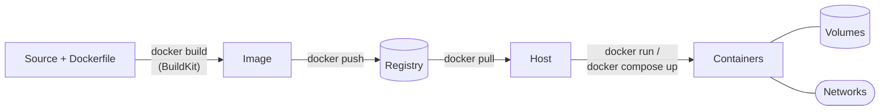

  <h1 style="color: white; margin: 0; font-size: 2.25rem;">Containers</h1>
  
Build, ship, and run anywhere

Docker is a platform for building, distributing, and running applications as **containers**: isolated Linux processes that carry their own filesystem, packaged as portable, content-addressed **images**. The Docker Engine (open source, from the Moby project), the `docker` CLI, BuildKit, and Compose together cover the whole path from source code to a running service, and the image and runtime formats they use are the vendor-neutral [OCI](https://opencontainers.org/) standards shared with Kubernetes, Podman, and every major cloud.

This section documents Docker as it stands in late 2026 (Docker Engine 29.x). The guides follow the life of an image:

## Guides

| # | Guide | Covers |
|---|-------|--------|
| 1 | [Fundamentals](fundamentals.html) | Images vs. containers, engine architecture (dockerd, containerd, runc), namespaces and cgroups, layers and copy-on-write, lifecycle, everyday commands, Compose |
| 2 | [Storage &amp; Security](storage-security.html) | Volumes, bind mounts, tmpfs, image mounts, backups; image, build, runtime, and host hardening; secrets; troubleshooting |
| 3 | [Dockerfiles &amp; CI/CD](dockerfiles.html) | Dockerfile instructions, multi-stage builds, BuildKit features, build performance, GitHub Actions and GitLab pipelines |
| 4 | [Networking](docker-networking.html) | Network drivers, DNS service discovery, port publishing, overlay and macvlan, network security |
| 5 | [Registries &amp; Supply Chain](registry.html) | OCI registries, tags vs. digests, choosing a registry, signing (cosign, Notation), SBOMs, scanning, SLSA provenance |
| 6 | [Design Patterns](docker-design-patterns.html) | Multi-container composition patterns, hardened images, runtime security in production |
| 7 | [Advanced Patterns](advanced.html) | Compose in production, Docker Swarm, reference architectures, choosing an orchestration level |
| 8 | [Container Runtimes](../container-runtimes.html) | The OCI specs, runc, containerd, CRI-O, gVisor, Kata Containers, Firecracker, Wasm |

For a one-page command cheat sheet, see [Docker Essentials](../docker-essentials.html); it is a quick reference rather than a step in the sequence above.

## Containers and Virtual Machines

Containers share the host kernel; virtual machines each run their own. That single difference drives the trade-offs:

| Property | Containers | Virtual machines |
|----------|------------|------------------|
| Startup time | Milliseconds to seconds | Seconds to minutes |
| Memory overhead | Close to the process itself | Full guest OS per VM |
| Disk footprint | Megabytes (shared layers) | Gigabytes per guest |
| Isolation boundary | Kernel namespaces, cgroups, seccomp, LSMs | Hardware virtualization |
| Guest OS | Same kernel family as host | Any |
| Typical use | Microservices, CI jobs, dense packing of trusted workloads | Legacy systems, different OSes, hard multi-tenancy |

Sandboxed runtimes (gVisor, Kata Containers, Firecracker) blur the line by giving each container a VM-grade boundary; see [Container Runtimes](../container-runtimes.html).

## What Changed Recently

Material written before 2024 is often out of date on these points:

- **Docker Engine 29** (November 2025) made the **containerd image store** the default for new installations, removed **Docker Content Trust** from the CLI (use cosign or Notation instead), deprecated **cgroup v1**, and added an experimental **nftables** firewall backend.
- **BuildKit** has been the default builder since Engine 23.0; `DOCKER_BUILDKIT=1` is unnecessary.
- **Compose V2** (`docker compose`, with a space) replaced the Python `docker-compose`; the `version:` key in `compose.yaml` is obsolete, and `docker compose watch` provides a file-sync development loop.
- **Supply-chain attestations** (SBOM and SLSA provenance) can be generated by BuildKit and attached to images; Docker Hardened Images ship them for common base images.
- **Docker Hub** limits pulls per 6-hour window (100 unauthenticated, 200 for authenticated free accounts), so CI should authenticate or use a mirror.

## See Also

- [Docker Essentials](../docker-essentials.html) - Command reference
- [Container Runtimes](../container-runtimes.html) - Runtimes beyond Docker
- [Kubernetes](../kubernetes/) - Container orchestration
- [AWS Compute](../aws/compute.html) - ECS, Fargate, and EKS
- [CI/CD](../ci-cd/) - Build and deployment pipelines
