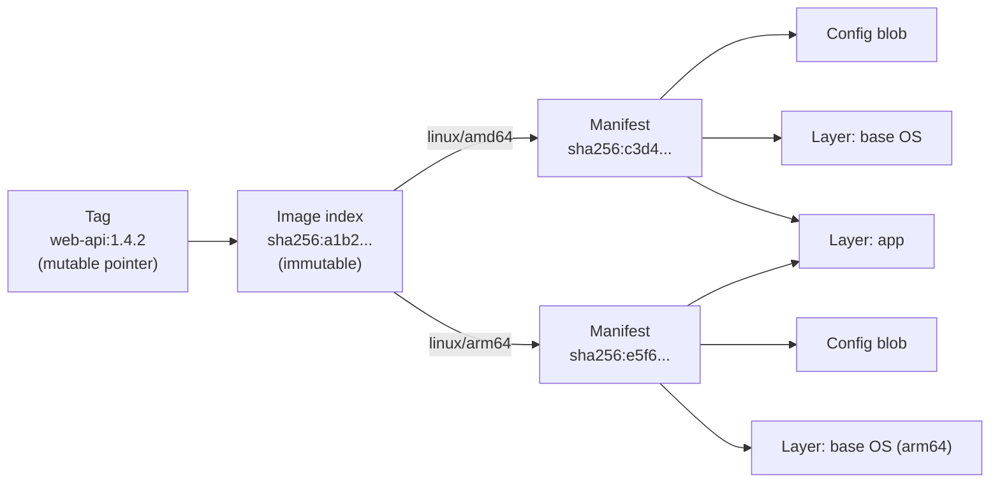
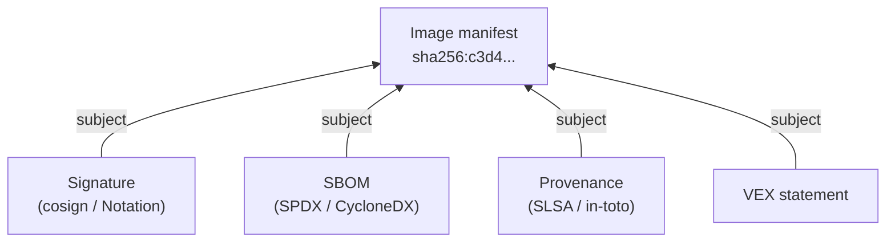
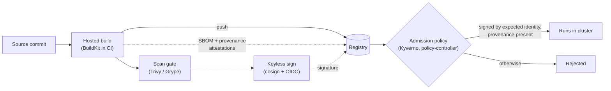

[Docker](./) &raquo; Registries &amp; Supply-Chain Security

A registry is where images live between `docker build` and `docker run`. What runs in production, what a scanner reports, and what an auditor accepts all depend on the integrity of that distribution step. This page covers how registries store and address images, why deployments should use digests rather than tags, how to choose and operate a registry, and the supply-chain controls (signing, SBOMs, vulnerability scanning, and build provenance) that let you prove an image is the one your pipeline built from source you control.

## How a Registry Works

A registry is an HTTP service implementing the [OCI Distribution Specification](https://github.com/opencontainers/distribution-spec), the standardized successor to the Docker Registry HTTP API v2. It stores two kinds of objects, both **content-addressed** by the SHA-256 digest of their bytes:

- **Blobs**: compressed layer tarballs and the image's JSON config.
- **Manifests**: small JSON documents listing the config blob and the ordered layer blobs (each by digest and size) that make up one image for one platform.

A multi-platform image adds an **image index** (Docker calls it a *manifest list*): a manifest whose entries point to per-platform manifests such as `linux/amd64` and `linux/arm64`. The client selects the entry matching its platform. A **tag** is the only mutable object: a name in a repository that currently points to some manifest or index digest.



Push and pull both reduce to exchanging blobs and manifests by digest. The client uploads only blobs the registry does not already have, the registry deduplicates layers shared across images, and the client verifies every byte it downloads against the digest that named it.

The digest of the top-level manifest or index therefore pins the entire image transitively: it covers the config and every layer, because they are referenced by their own digests. Change anything inside the image and the top-level digest changes. That property is what makes deploying by digest trustworthy.

### Artifacts and the Referrers API

Registries now store more than images. OCI Image and Distribution Specifications v1.1 (2024) standardized two additions that the supply-chain tools below depend on:

- **Artifacts.** A manifest can carry an `artifactType` and arbitrary blobs, so Helm charts, WebAssembly modules, SBOMs, signatures, and ML model files can be pushed to the same registry with the same authentication and replication.
- **The `subject` field and Referrers API.** An artifact can declare that it refers to another manifest (its *subject*). The registry indexes these links, and a client can ask "what refers to `sha256:c3d4...`?" to discover the signatures, SBOMs, and provenance attached to an image.



Registries without referrers support fall back to a tag-naming convention (for example cosign's `sha256-<digest>.sig` tags). BuildKit, by contrast, stores its SBOM and provenance attestations as extra entries inside the image index.

### Image Reference Anatomy

```text
ghcr.io/acme/web-api:1.4.2@sha256:9f86d08...
└──┬──┘ └───┬──────┘ └─┬─┘ └──────┬───────┘
  host   repository    tag       digest
```

| Part | Example | Notes |
|------|---------|-------|
| Host (registry) | `ghcr.io` | Omitted means Docker Hub (`docker.io`, served from `registry-1.docker.io`) |
| Repository | `acme/web-api` | On Docker Hub a bare name such as `nginx` means `library/nginx` (Docker Official Images) |
| Tag | `1.4.2` | Mutable; defaults to `latest` if omitted |
| Digest | `sha256:9f86d08...` | Immutable; when present, the registry resolves the digest and the tag is ignored |

When both are present the digest wins and the tag is informational only; Docker does not check that the tag still points at that digest. Renovate and Dependabot understand `tag@digest` references and update both together.

## Choosing a Registry

All mainstream registries speak the OCI distribution protocol, so `docker`, `buildx`, `crane`, `oras`, `skopeo`, and `cosign` work against any of them. They differ in hosting model, identity integration, and extra features.

| Registry | Hosting | Authentication | Notable features | Typical fit |
|----------|---------|----------------|------------------|-------------|
| **Docker Hub** | SaaS (Docker) | Docker ID, personal or organization access tokens | Docker Official Images, Docker Hardened Images, Scout analysis | Public images, base images |
| **GitHub Container Registry** (`ghcr.io`) | SaaS (GitHub) | `GITHUB_TOKEN` in Actions, PATs | Permissions inherited from repositories, artifact attestations | Projects hosted on GitHub |
| **Amazon ECR** | SaaS (AWS) | IAM; 12-hour tokens | Tag immutability, pull-through cache, enhanced scanning (Inspector), cross-region replication | ECS, EKS, Lambda |
| **Google Artifact Registry** | SaaS (Google Cloud) | IAM, service accounts, workload identity | Multi-format (containers, language packages), remote and virtual repositories; successor to the retired Container Registry (`gcr.io`) | GKE, Cloud Run |
| **Azure Container Registry** | SaaS (Azure) | Microsoft Entra ID, repository-scoped tokens | Geo-replication, Notation integration, ACR Tasks | AKS, Azure pipelines |
| **Harbor** | Self-hosted (CNCF graduated) | Local users, OIDC, LDAP | Project RBAC, Trivy scanning, signature enforcement, replication, proxy cache | On-premises and air-gapped environments |
| **Quay** | SaaS or self-hosted (Red Hat) | Robot accounts, OIDC | Clair scanning, mirroring | OpenShift environments |

### Authenticating and Pushing

Only the login step differs between providers, because each has its own credential source.

```bash
# Docker Hub
docker login -u myuser                       # prompts for an access token
docker tag myapp:1.4.2 myuser/myapp:1.4.2
docker push myuser/myapp:1.4.2

# GitHub Container Registry
echo "$GHCR_TOKEN" | docker login ghcr.io -u my-gh-user --password-stdin
docker push ghcr.io/acme/myapp:1.4.2

# Amazon ECR (repository must already exist)
aws ecr get-login-password --region us-east-1 \
  | docker login --username AWS --password-stdin 123456789012.dkr.ecr.us-east-1.amazonaws.com
docker push 123456789012.dkr.ecr.us-east-1.amazonaws.com/myapp:1.4.2

# Google Artifact Registry (registers gcloud as a Docker credential helper)
gcloud auth configure-docker us-docker.pkg.dev
docker push us-docker.pkg.dev/my-project/my-repo/myapp:1.4.2
```

`docker login` stores credentials in the OS keychain when a credential helper (`credsStore` in `~/.docker/config.json`) is configured, and otherwise base64-encoded in that file, which is effectively plaintext. In CI, prefer short-lived identity-based credentials: GitHub Actions' `GITHUB_TOKEN` for GHCR, or OIDC federation to AWS, Google Cloud, or Azure, rather than long-lived stored passwords.

### Docker Hub Rate Limits and Mirrors

Docker Hub limits image pulls per 6-hour window: 100 for unauthenticated clients (counted per IPv4 address or IPv6 /64 subnet) and 200 for authenticated Personal accounts, with higher limits on paid plans. CI fleets behind a shared NAT address exhaust the anonymous limit quickly. The usual mitigations are:

- **Authenticate** every pull in CI, even for public images.
- **Use a pull-through cache**: Harbor proxy projects, ECR pull-through cache rules, Artifact Registry remote repositories, or a self-hosted `registry:2` in proxy mode. The Docker daemon's `registry-mirrors` setting in `daemon.json` redirects Docker Hub pulls (only) to such a mirror.
- **Copy critical base images** into your own registry with `crane copy` or `skopeo copy`, which also protects builds from upstream outages and deletions.

### Harbor

[Harbor](https://goharbor.io/) is the CNCF-graduated open-source registry. On top of storage it adds project-level RBAC, integrated Trivy scanning with deployment gating on severity, cosign and Notation signature enforcement, tag retention and immutability rules, replication to and from other registries, and proxy-cache projects. It is the common choice for on-premises or air-gapped environments where images cannot leave the perimeter. Clients use it like any other registry:

```bash
docker login harbor.internal.example.com
docker push harbor.internal.example.com/platform/myapp:1.4.2
```

### Storage Growth and Garbage Collection

Deleting a tag removes only the pointer. The manifest and its blobs remain until the registry's garbage collector finds them unreferenced. Every managed registry offers lifecycle or retention policies (for example "keep the last 30 `sha-*` tags; expire untagged manifests after 7 days"); configure them early, because CI that pushes on every commit produces thousands of images. Retention rules must not delete digests that production still references.

## Tagging Strategy and Immutability

Tags are mutable by default, and that mutability is a leading cause of "works in CI, breaks in production" incidents: two builds can both be tagged `latest`, the last push wins, and tomorrow's pull may return a different image than today's.

### Why `latest` Is a Trap

`latest` has no special meaning to a registry; it is simply the tag used when none is specified. It does not guarantee the newest or the most stable build. A deployment of `myapp:latest` depends on push order and on which hosts have a cached copy, so two replicas can run different code. Pin deployments to an explicit tag, and in production to a digest.

### A Workable Tagging Scheme

Give each build several tags so that people and automation each get a stable handle:

| Tag style | Example | Mutability | Use |
|-----------|---------|------------|-----|
| Commit ID | `sha-a1b2c3d` | Immutable by convention | Deployments, rollbacks, correlating incidents with commits |
| Exact version | `1.4.2` | Should be immutable | Releases |
| Rolling minor / major | `1.4`, `1` | Moves forward | Consumers who want the latest patch |
| Channel | `stable`, `edge` | Moves forward | Human convenience only |

```bash
# One build, several tags pointing at the same digest (BuildKit)
docker buildx build \
  -t ghcr.io/acme/myapp:1.4.2 \
  -t ghcr.io/acme/myapp:1.4 \
  -t ghcr.io/acme/myapp:sha-$(git rev-parse --short HEAD) \
  --platform linux/amd64,linux/arm64 \
  --push .
```

In GitHub Actions, `docker/metadata-action` derives this set of tags and the standard OCI labels (`org.opencontainers.image.source`, `.revision`, `.version`) from the Git ref automatically.

### Enforcing Immutability

Convention is not enough; make the registry reject overwrites, and deploy by digest so tags cannot affect what runs.

- **Amazon ECR**: set the repository's tag mutability to `IMMUTABLE`.
- **Harbor**: define per-project immutability rules on tag patterns such as `v*`.
- **Google Artifact Registry**: enable immutable tags on the repository.
- **Everywhere**: resolve the tag to a digest once, at release time, and reference `image@sha256:...` in deployment manifests.

```bash
aws ecr create-repository --repository-name myapp \
  --image-tag-mutability IMMUTABLE

# Resolve a tag to its digest
docker buildx imagetools inspect ghcr.io/acme/myapp:1.4.2 \
  --format '{{.Manifest.Digest}}'
crane digest ghcr.io/acme/myapp:1.4.2          # equivalent, with go-containerregistry
```

## The Software Supply Chain Problem

A pinned digest proves the bytes have not changed since you recorded it. It does not prove who built the image, from what source, or whether it contains known-vulnerable components. Attacks such as the SolarWinds build compromise, the Codecov uploader tampering, and hijacked GitHub Action tags all targeted exactly those gaps. Supply-chain controls add verifiable answers, each as a separate attestation:

| Control | Question it answers | Common tools |
|---------|---------------------|--------------|
| **Digest pinning** | Did the bytes change? | OCI digests |
| **Signing** | Did an identity we trust publish this digest? | cosign (Sigstore), Notation |
| **SBOM** | What components are inside? | Syft, BuildKit, Docker Scout |
| **Vulnerability scan** | Do those components have known CVEs, and do they matter? | Trivy, Grype, Docker Scout, registry scanners |
| **Provenance** | Which source, builder, and parameters produced it? | SLSA provenance via BuildKit, GitHub artifact attestations |



The controls are independent and composable. A mature pipeline produces all of them as OCI artifacts stored next to the image, and enforces them at deploy time.

## Image Signing

Signing binds a cryptographic identity to an image **digest**, so a verifier can reject anything not signed by an expected identity. Always sign and verify digests, never tags.

### cosign (Sigstore)

[cosign](https://docs.sigstore.dev/cosign/signing/overview/), from the OpenSSF Sigstore project, is the most widely used signer. It supports two modes.

**Keyless** (the default and recommended mode). cosign obtains a short-lived X.509 certificate from Sigstore's [Fulcio](https://docs.sigstore.dev/certificate_authority/overview/) CA, binding the signature to an OIDC identity such as a specific GitHub Actions workflow. The signing event is recorded in the [Rekor](https://docs.sigstore.dev/logging/overview/) transparency log, so there is no long-lived private key to store, leak, or rotate, and every signature is publicly auditable.

```bash
# In CI with an ambient OIDC token (GitHub Actions: permissions id-token: write)
cosign sign --yes ghcr.io/acme/myapp@sha256:9f86d08...

# Verify: who signed (identity) AND which OIDC provider vouched for them (issuer)
cosign verify ghcr.io/acme/myapp@sha256:9f86d08... \
  --certificate-identity 'https://github.com/acme/myapp/.github/workflows/release.yml@refs/tags/v1.4.2' \
  --certificate-oidc-issuer https://token.actions.githubusercontent.com
```

Verification must check both the identity and the issuer. Use an exact identity, or a tightly anchored `--certificate-identity-regexp` such as `'^https://github\.com/acme/myapp/\.github/workflows/release\.yml@refs/tags/v'`; a loose pattern like `https://github.com/acme/.*` accepts any workflow in any repository of the organization.

**Key-based.** You manage a key pair, optionally in a KMS (`--key awskms://...`, `gcpkms://...`, `azurekms://...`, `hashivault://...`). This suits air-gapped environments that cannot reach the public Sigstore services.

```bash
cosign generate-key-pair
cosign sign --key cosign.key ghcr.io/acme/myapp@sha256:9f86d08...
cosign verify --key cosign.pub ghcr.io/acme/myapp@sha256:9f86d08...
```

cosign 3.x (current as of late 2026) writes signatures in the standardized **Sigstore bundle** format by default, logs to Rekor v2, and still verifies legacy-format signatures. Several older flags are deprecated ahead of a future v4. In GitHub Actions, `sigstore/cosign-installer@v4` or later is required to install cosign 3.x.

### Notation (Notary Project)

[Notation](https://notaryproject.dev/) is the CNCF Notary Project's signer. It also stores signatures as OCI artifacts, but is built around conventional X.509 PKI and declarative trust policies rather than Sigstore's keyless model. It fits organizations with an existing certificate authority or key management service, and is integrated with Azure Container Registry and Key Vault, AWS Signer, and Harbor.

```bash
notation sign   $REGISTRY/myapp@sha256:9f86d08...
notation verify $REGISTRY/myapp@sha256:9f86d08...   # evaluated against trustpolicy.json
```

### Docker Content Trust (retired)

Docker Content Trust (DCT), built on Notary v1 and The Update Framework, signed **tags** rather than digests and stored trust data on a separate Notary server. It has been retired: Docker Engine 29 (November 2025) removed DCT from the Docker CLI, so `DOCKER_CONTENT_TRUST=1` no longer signs or verifies anything with the stock CLI, and Docker has announced that the Notary v1 service at `notary.docker.io` shuts down on December 8, 2026. Existing DCT users should migrate to cosign or Notation.

### Choosing a Signer

| Tool | Trust root | Signature storage | Choose it when |
|------|-----------|-------------------|----------------|
| **cosign** | Keyless (Fulcio + OIDC + Rekor) or keys / KMS | OCI artifact or referrer | You want keyless CI signing and the broadest ecosystem support |
| **Notation** | X.509 certificates from your own CA / KMS | OCI referrer | You already operate PKI and want CA-rooted trust policies |
| **Docker Content Trust** | TUF / Notary v1 | Separate Notary server | Not for any new work; retired |

## Software Bill of Materials (SBOM)

An SBOM is a machine-readable inventory of an image's contents: OS packages, language dependencies, versions, licenses, and file locations. It turns "do we use log4j anywhere?" into a query: image `sha256:9f86...` contains `log4j-core 2.14.1` in `/app/lib`. When a new CVE is published, you search stored SBOMs instead of re-scanning every image.

Two formats dominate: **SPDX** (Linux Foundation; ISO/IEC 5962) and **CycloneDX** (OWASP; also standardized as ECMA-424). Most tools emit both. Regulatory pressure is growing: US Executive Order 14028 pushed SBOMs into federal software procurement, and the EU Cyber Resilience Act requires manufacturers to maintain SBOMs for products with digital elements.

### Generating an SBOM

[Syft](https://github.com/anchore/syft) catalogs an existing image:

```bash
syft ghcr.io/acme/myapp:1.4.2                                   # table
syft ghcr.io/acme/myapp:1.4.2 -o cyclonedx-json=sbom.cdx.json   # CycloneDX
syft ghcr.io/acme/myapp:1.4.2 -o spdx-json=sbom.spdx.json       # SPDX
```

BuildKit can generate the SBOM during the build (using a Syft-based scanner) and attach it to the image as an attestation. Build-time generation can also scan intermediate stages, which catches components that a scan of the final filesystem misses:

```bash
docker buildx build --sbom=true --provenance=mode=max \
  -t ghcr.io/acme/myapp:1.4.2 --push .

docker buildx imagetools inspect ghcr.io/acme/myapp:1.4.2 \
  --format '{{ json .SBOM }}'
```

Attaching the SBOM to the image, rather than leaving it in a CI artifact bucket, means anyone who can pull the image can also retrieve its bill of materials. Attestations require the containerd image store or a push to a registry; the classic image store cannot hold them locally.

## Vulnerability Scanning

A scanner matches the components in an image, taken from its SBOM or by inspecting the filesystem, against vulnerability data from sources such as the NVD, the GitHub Advisory Database, OSV, and distribution security trackers, and reports matching CVEs by severity.

### Scanners

[Trivy](https://github.com/aquasecurity/trivy) (Aqua Security) and [Grype](https://github.com/anchore/grype) (Anchore) are the leading open-source scanners; both scan images, filesystems, or existing SBOMs. `docker scout cves` is built into Docker Desktop and the CLI and adds base-image upgrade recommendations. Managed registries (ECR with Amazon Inspector, Artifact Registry, ACR with Defender for Cloud, Harbor with Trivy) scan on push.

```bash
trivy image --severity HIGH,CRITICAL --ignore-unfixed --exit-code 1 ghcr.io/acme/myapp:1.4.2
trivy sbom sbom.cdx.json                         # scan an existing SBOM, no image pull

grype ghcr.io/acme/myapp:1.4.2 --fail-on high
grype sbom:./sbom.spdx.json

docker scout cves ghcr.io/acme/myapp:1.4.2
docker scout recommendations ghcr.io/acme/myapp:1.4.2
```

### Making Results Actionable

Raw CVE counts are noise without policy.

- **Gate on severity and fixability.** Fail builds on High and Critical findings that have a fix available (`--ignore-unfixed` in Trivy, `--only-fixed` in Grype); report the rest.
- **Record exceptions with a reason and an expiry.** Use a `.trivyignore` file or, better, a **VEX** (Vulnerability Exploitability eXchange) document stating that a CVE is `not_affected` because, for example, the vulnerable function is never called. Trivy and Grype both consume OpenVEX, and Docker Hardened Images ship VEX statements with each image.
- **Re-scan continuously.** An image that was clean at build time accumulates CVEs as new ones are disclosed. Re-scan deployed digests on a schedule, not only on push.
- **Reduce what there is to scan.** Minimal and hardened bases (distroless, Wolfi/Chainguard, Docker Hardened Images, `scratch`) contain far fewer packages; see [Storage &amp; Security](storage-security.html#image-security) and [Dockerfiles &amp; CI/CD](dockerfiles.html).

## Provenance and SLSA

Signing proves *who* published an image; provenance records *how it was built*: the source repository and commit, the builder, the build parameters, and the input materials such as base images. Signed provenance lets a verifier reject an image that did not come from the expected repository and pipeline, which defends against compromised developer machines, tampered builds, and images pushed by stolen credentials.

### SLSA

[SLSA](https://slsa.dev/) (Supply-chain Levels for Software Artifacts, pronounced "salsa") is an OpenSSF framework of incrementally stronger requirements. The current specification, v1.2, defines a **Build track** and a **Source track**. The Build track levels are:

| Build level | Requirement | What it defends against |
|-------------|-------------|-------------------------|
| **L0** | None | Nothing |
| **L1** | Provenance exists, describing how the artifact was built | Mistakes; enables inventory and debugging |
| **L2** | Built on a hosted build platform that generates and signs the provenance | Tampering after the build |
| **L3** | Hardened build platform: runs are isolated from each other and signing material is inaccessible to user-defined build steps | Tampering during the build, including by a compromised build step |

### Generating and Verifying Provenance

BuildKit emits SLSA provenance in in-toto format and attaches it to the image:

```bash
docker buildx build --provenance=mode=max --sbom=true \
  -t ghcr.io/acme/myapp:1.4.2 --push .

docker buildx imagetools inspect ghcr.io/acme/myapp:1.4.2 \
  --format '{{ json .Provenance }}'
```

`mode=max` records the full build definition, including build arguments; do not pass secrets as build arguments (use secret mounts), since they would appear in the provenance.

GitHub [artifact attestations](https://docs.github.com/actions/security-guides/using-artifact-attestations-to-establish-provenance-for-builds) sign SLSA provenance with Sigstore from inside a workflow (the public-good instance for public repositories, GitHub's private instance for private ones) and can push it to the registry as a referrer. Verification uses the GitHub CLI:

```bash
gh attestation verify oci://ghcr.io/acme/myapp:1.4.2 --owner acme
```

## Putting It Together: a Hardened Pipeline

The workflow below builds a multi-platform image with BuildKit SBOM and provenance attestations, gates on a vulnerability scan, keyless-signs the digest with cosign, and publishes a GitHub build-provenance attestation. Action versions are current as of September 2026; in production, pin third-party actions to full commit SHAs, since tags can be moved by whoever controls the action's repository.

```yaml
# .github/workflows/release.yml
name: release
on:
  push:
    tags: ["v*"]

permissions:
  contents: read
  packages: write           # push to GHCR
  id-token: write           # OIDC token for keyless signing
  attestations: write       # GitHub artifact attestations
  artifact-metadata: write

env:
  IMAGE: ghcr.io/${{ github.repository }}

jobs:
  release:
    runs-on: ubuntu-latest
    steps:
      - uses: actions/checkout@v7

      - uses: docker/setup-buildx-action@v4

      - uses: docker/login-action@v4
        with:
          registry: ghcr.io
          username: ${{ github.actor }}
          password: ${{ secrets.GITHUB_TOKEN }}

      - id: meta
        uses: docker/metadata-action@v6
        with:
          images: ${{ env.IMAGE }}

      # 1. Build and push with SBOM + provenance attached
      - id: build
        uses: docker/build-push-action@v7
        with:
          platforms: linux/amd64,linux/arm64
          push: true
          tags: ${{ steps.meta.outputs.tags }}
          labels: ${{ steps.meta.outputs.labels }}
          sbom: true
          provenance: mode=max

      # 2. Gate on fixable High/Critical vulnerabilities
      - uses: aquasecurity/trivy-action@v0.36.0
        with:
          image-ref: ${{ env.IMAGE }}@${{ steps.build.outputs.digest }}
          severity: HIGH,CRITICAL
          ignore-unfixed: true
          exit-code: "1"

      # 3. Keyless-sign the digest (identity = this workflow at this ref)
      - uses: sigstore/cosign-installer@v4
      - run: cosign sign --yes "${{ env.IMAGE }}@${{ steps.build.outputs.digest }}"

      # 4. GitHub build-provenance attestation, pushed to the registry
      - uses: actions/attest@v4
        with:
          subject-name: ${{ env.IMAGE }}
          subject-digest: ${{ steps.build.outputs.digest }}
          push-to-registry: true
```

At deploy time an admission controller, such as Kyverno's `verifyImages` rules or Sigstore's policy-controller in [Kubernetes](../kubernetes/), checks the signature identity, issuer, and required attestations before a pod may start, and can rewrite tags to digests. The check is equivalent to:

```bash
cosign verify ghcr.io/acme/myapp@sha256:9f86d08... \
  --certificate-identity-regexp '^https://github\.com/acme/myapp/\.github/workflows/release\.yml@refs/tags/v' \
  --certificate-oidc-issuer https://token.actions.githubusercontent.com
```

The result is a verifiable chain: a digest that cannot change, a signature only this workflow could produce, an SBOM listing every component, a scan gating on real risk, and provenance tying the artifact to a specific commit and builder.

---

## See Also

- [Fundamentals](fundamentals.html) - Images, layers, and the content-addressed model behind digests
- [Storage &amp; Security](storage-security.html) - Runtime hardening and secrets management
- [Dockerfiles &amp; CI/CD](dockerfiles.html) - Minimal base images and build pipelines
- [CI/CD Security and Operations](../ci-cd/security-and-operations.html) - Pipeline hardening beyond the image
- [Kubernetes](../kubernetes/) - Admission control and deploy-time verification
- [Cloud and Container Security](../cybersecurity/cloud-and-container-security.html) - Broader container security context
