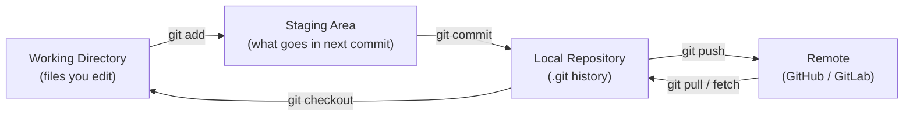
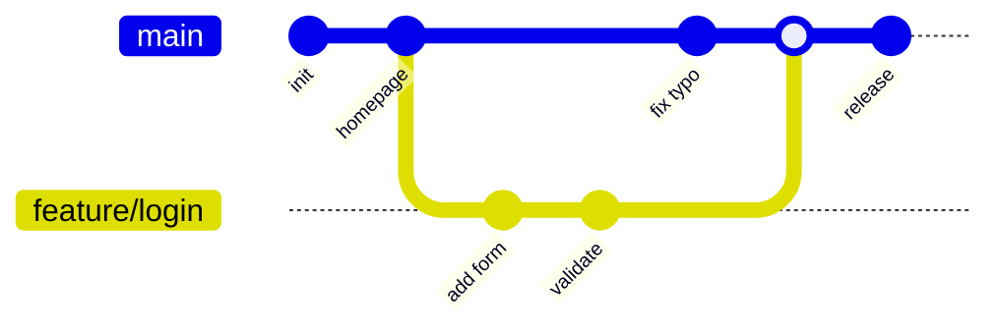
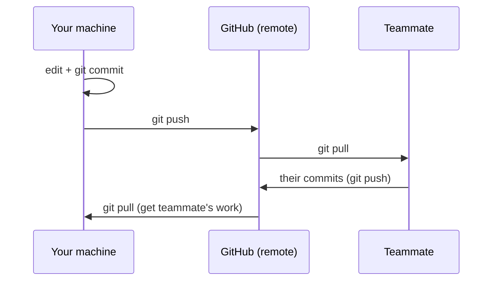

<div class="hero-section" style="background: linear-gradient(135deg, #4facfe 0%, #00f2fe 100%); color: white; padding: 3rem 2rem; margin: -2rem -3rem 2rem -3rem; text-align: center;">
  <h1 style="color: white; margin: 0; font-size: 2.5rem;">Git Crash Course</h1>
  <p style="font-size: 1.25rem; margin-top: 1rem; opacity: 0.9;">From zero to your first pull request — the fastest on-ramp to version control</p>
</div>

<div class="intro-card">
  <p class="lead-text">This is the <strong>learning path</strong> for people new to Git. It follows a single story — create a repo, make commits, branch, push, and open a pull request — in the order you actually do them, with just enough explanation to keep moving. When you want depth, syntax, or strategy, follow the cross-links to the companion pages.</p>
</div>

<div class="tip-card">
  <h4>How the four Git pages fit together</h4>
  <ul>
    <li><strong>This page (Crash Course)</strong> — a guided first walkthrough; read it top to bottom.</li>
    <li><a href="git/">Git Version Control</a> — how Git works under the hood (objects, the DAG, internals).</li>
    <li><a href="git-reference.html">Git Command Reference</a> — the alphabetical lookup cheat sheet for every command.</li>
    <li><a href="branching.html">Branching Strategies</a> — team workflows: Git Flow, GitHub Flow, trunk-based.</li>
  </ul>
</div>

## Why version control?

Before Git, people emailed `report_final_v2_REALLY_final.docx` around. Version control replaces that chaos with a single source of truth that remembers **every** change, **who** made it, and **why** — and lets many people work in parallel without overwriting each other.

<div class="key-insights">
  <div class="insight-card">
    <i class="fas fa-history"></i>
    <h4>Full History</h4>
    <p>Every saved version is recoverable forever</p>
  </div>
  <div class="insight-card">
    <i class="fas fa-users"></i>
    <h4>Collaboration</h4>
    <p>Many people edit the same project safely</p>
  </div>
  <div class="insight-card">
    <i class="fas fa-flask"></i>
    <h4>Safe Experiments</h4>
    <p>Try ideas in a branch; throw it away if it fails</p>
  </div>
</div>

## The mental model: three areas

Almost every Git command moves your work between three places. Internalize this picture and the commands stop feeling random.



| Area | What it holds | You change it with |
|------|---------------|--------------------|
| Working Directory | The actual files on disk you are editing | Your editor |
| Staging Area (Index) | The exact snapshot you are about to commit | `git add` |
| Local Repository | The committed history on your machine | `git commit` |
| Remote | The shared copy others pull from | `git push` |

## Step 1 — One-time setup

Tell Git who you are (this stamps every commit) and pick sensible defaults.

```bash
git config --global user.name "Your Name"
git config --global user.email "you@example.com"
git config --global init.defaultBranch main   # name the first branch "main"
git config --global pull.rebase false          # default merge behavior on pull
```

Check it worked:

```bash
git config --list
```

## Step 2 — Start a repository

You either **create** a new one or **clone** an existing project.

```bash
# Option A: brand-new project in the current folder
git init

# Option B: copy an existing project from a remote
git clone https://github.com/owner/repo.git
```

`git init` creates a hidden `.git/` directory — that folder *is* your repository (the history database). Delete it and you delete the version control, not the files.

## Step 3 — The core loop: edit → add → commit

This is the cycle you will repeat thousands of times.

```bash
# 1. See what changed
git status

# 2. Stage the changes you want to save together
git add file1.py file2.py
git add .              # stage everything that changed

# 3. Save a snapshot with a message explaining WHY
git commit -m "Add login form validation"
```

<div class="tip-card">
  <h4>What makes a good commit?</h4>
  <p>One logical change per commit, with a message written in the imperative mood ("Add", "Fix", "Remove" — not "Added"/"Fixing"). Keep the first line under ~50 characters. Future-you reading <code>git log</code> will thank present-you.</p>
</div>

Inspect your history any time:

```bash
git log --oneline --graph    # compact, visual history
git diff                     # changes you have NOT staged yet
git diff --staged            # changes that ARE staged for next commit
```

## Step 4 — Branching: work without breaking things

A branch is a cheap, movable pointer to a commit. Create one per feature or fix so `main` always stays stable.

```bash
git switch -c feature/login   # create and switch to a new branch (Git 2.23+)
# ...edit, add, commit as usual...
git switch main               # jump back to main
git switch feature/login      # and back to your work
```



> `git switch` and `git restore` (Git 2.23+) are the modern, clearer replacements for the overloaded `git checkout`. You will still see `checkout` everywhere — it does both jobs.

## Step 5 — Share your work: push and pull

`origin` is the conventional name for your main remote. The first push sets up tracking with `-u`.

```bash
# Push your branch to the remote for the first time
git push -u origin feature/login

# Later pushes on the same branch are just:
git push

# Bring down changes others have pushed
git pull
```



## Step 6 — Open a pull request

A pull request (PR) — called a merge request on GitLab — proposes merging your branch into `main`. It is where review, automated tests, and discussion happen before code lands.

1. Push your branch (Step 5).
2. On GitHub/GitLab, open a PR from your branch into `main`.
3. Teammates review; CI runs tests automatically.
4. After approval, **merge** — your work is now in `main`.
5. Delete the branch; pull `main` locally to stay current.

```bash
# Using the GitHub CLI from the terminal
gh pr create --fill
gh pr status
```

See [Branching Strategies](branching.html) for how teams structure this at scale.

## The 12 commands that cover 90% of daily work

<div class="command-grid">
  <div class="command-card"><code>git status</code><p>What changed, what's staged</p></div>
  <div class="command-card"><code>git add &lt;file&gt;</code><p>Stage changes</p></div>
  <div class="command-card"><code>git commit -m "msg"</code><p>Save a snapshot</p></div>
  <div class="command-card"><code>git log --oneline</code><p>View history</p></div>
  <div class="command-card"><code>git diff</code><p>See unstaged changes</p></div>
  <div class="command-card"><code>git switch -c &lt;br&gt;</code><p>New branch</p></div>
  <div class="command-card"><code>git switch &lt;br&gt;</code><p>Change branch</p></div>
  <div class="command-card"><code>git merge &lt;br&gt;</code><p>Combine branches</p></div>
  <div class="command-card"><code>git pull</code><p>Get remote changes</p></div>
  <div class="command-card"><code>git push</code><p>Send your commits</p></div>
  <div class="command-card"><code>git stash</code><p>Shelve work temporarily</p></div>
  <div class="command-card"><code>git restore &lt;file&gt;</code><p>Discard local edits</p></div>
</div>

## "Oh no" — fixing common mistakes

Everyone breaks something early on. These get you out of the most common holes safely.

<div class="challenge-cards">
  <div class="challenge-card">
    <h4>I committed too early / wrong message</h4>
    <pre><code>git commit --amend -m "Better message"</code></pre>
    <p>Rewrites the last commit. Don't amend commits you have already pushed and shared.</p>
  </div>
  <div class="challenge-card">
    <h4>I want to undo the last commit but keep the code</h4>
    <pre><code>git reset --soft HEAD~1</code></pre>
    <p>Removes the commit, leaves the changes staged so you can recommit.</p>
  </div>
  <div class="challenge-card">
    <h4>I need to drop everything since the last commit</h4>
    <pre><code>git restore .</code></pre>
    <p>Discards uncommitted edits. This is destructive — make sure you mean it.</p>
  </div>
  <div class="challenge-card">
    <h4>I'm mid-task and need to switch branches</h4>
    <pre><code>git stash
git switch other-branch
# later:
git stash pop</code></pre>
    <p>Shelves your work-in-progress and brings it back later.</p>
  </div>
  <div class="challenge-card">
    <h4>I think I lost a commit</h4>
    <pre><code>git reflog</code></pre>
    <p>Shows where HEAD has been; almost nothing is ever truly gone. Check out the hash to recover it.</p>
  </div>
</div>

## Handling merge conflicts (the calm version)

A conflict just means two branches changed the same lines. Git pauses and asks you to choose.

```bash
git merge feature/login
# CONFLICT in app.py
```

Open the file; Git marks the clash:

```text
<<<<<<< HEAD
greeting = "Hello"
=======
greeting = "Hi there"
>>>>>>> feature/login
```

Edit the file to the version you want, delete the `<<<<<<<`/`=======`/`>>>>>>>` markers, then:

```bash
git add app.py
git commit          # completes the merge
```

If it goes sideways, `git merge --abort` returns you to safety.

## Where to go next

<div class="command-grid">
  <div class="step-card">
    <h4>Understand the machinery</h4>
    <p>Read <a href="git/">Git Version Control</a> for the object model, the commit DAG, and how SHA hashing guarantees integrity.</p>
  </div>
  <div class="step-card">
    <h4>Look up a command</h4>
    <p>Keep <a href="git-reference.html">Git Command Reference</a> open as your cheat sheet for rebase, cherry-pick, bisect, and more.</p>
  </div>
  <div class="step-card">
    <h4>Work on a team</h4>
    <p>Pick a workflow in <a href="branching.html">Branching Strategies</a> and wire it into <a href="ci-cd/">CI/CD</a>.</p>
  </div>
</div>

## Key Takeaways

<div class="takeaway-card">
  <ul>
    <li><strong>Three areas:</strong> working directory → staging (<code>add</code>) → repository (<code>commit</code>) → remote (<code>push</code>).</li>
    <li><strong>The core loop is edit → <code>add</code> → <code>commit</code>,</strong> repeated endlessly with clear messages.</li>
    <li><strong>Branch for every change</strong> so <code>main</code> stays stable; merge via pull requests.</li>
    <li><strong>Almost nothing is unrecoverable</strong> — <code>git reflog</code> and <code>git reset</code> are your safety net.</li>
    <li><strong>A dozen commands</strong> cover the vast majority of daily work; learn the rest as you need them.</li>
  </ul>
</div>

<div class="see-also-card">
  <h4>See Also</h4>
  <ul>
    <li><a href="git/">Git Version Control</a> — architecture and internals deep dive</li>
    <li><a href="git-reference.html">Git Command Reference</a> — complete command cheat sheet</li>
    <li><a href="branching.html">Branching Strategies</a> — Git Flow, GitHub Flow, trunk-based development</li>
    <li><a href="ci-cd/">CI/CD</a> — automate testing and deployment from your commits</li>
  </ul>
</div>

## References

- [Pro Git Book](https://git-scm.com/book) — free, comprehensive, beginner-friendly
- [GitHub Skills](https://skills.github.com/) — interactive hands-on exercises
- [Official Git Documentation](https://git-scm.com/doc)
- [Conventional Commits](https://www.conventionalcommits.org/) — a popular commit message convention
