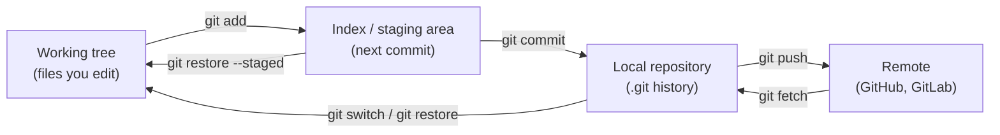
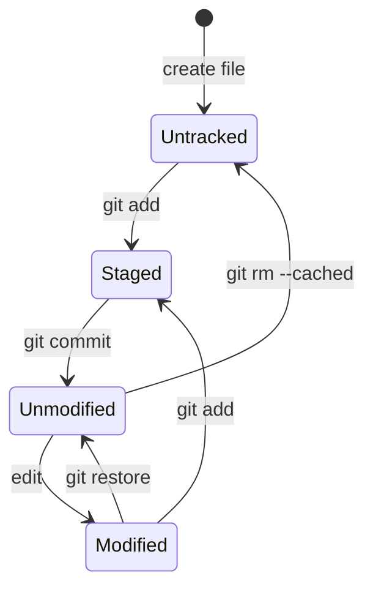
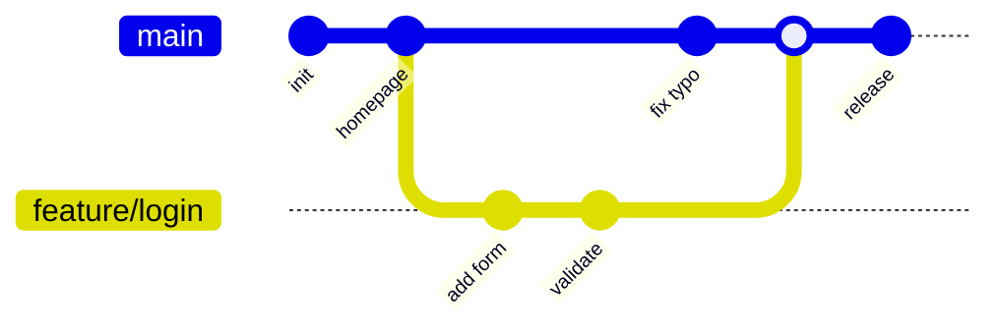
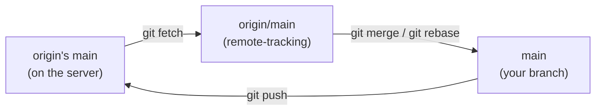
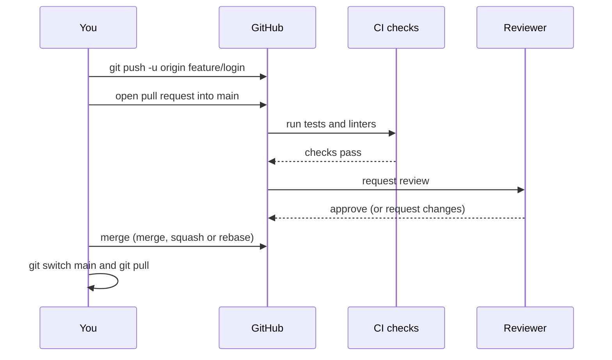

This page is a first walkthrough of Git for people new to it. It follows the order in which you actually use Git — set up, create a repository, commit, branch, sync with a remote, open a pull request — and ends with fixing common mistakes and resolving conflicts. Commands reflect Git 2.55 (June 2026); anything older than about Git 2.30 may lack some of them. The Git pages on this site divide up as follows:

| Page | Use it for |
|------|-----------|
| **Git Crash Course** (this page) | Learning the everyday workflow, read top to bottom |
| [Git Command Reference](git-reference.html) | Looking up syntax, organized by task |
| [Git Version Control](git/) | How Git works internally: objects, the commit graph, packfiles |
| [Branching Strategies](branching.html) | Team workflows: GitHub Flow, trunk-based development, Git Flow |

## What Git does

Git is a **distributed version control system**. It records a project's history as a series of **commits**, each a complete snapshot of the tracked files plus the author, time, message and a pointer to the previous commit. Every clone holds the full history, so almost all operations (committing, branching, viewing history) are local and fast, and a lost server can be restored from any clone. Collaboration happens by exchanging commits with shared **remotes** such as GitHub, GitLab or Bitbucket.

## The three areas

Most Git commands move changes between three local areas and a remote. Keeping this picture in mind makes the commands predictable.



| Area | Holds | Changed by |
|------|-------|------------|
| **Working tree** | The files on disk you are editing | Your editor; `git restore` |
| **Index** (staging area) | The exact snapshot the next commit will record | `git add`, `git restore --staged` |
| **Local repository** | All commits, branches and tags, stored in `.git/` | `git commit`, `git fetch`, `git merge` |
| **Remote** | A shared copy that others push to and fetch from | `git push` |

The index is what makes Git different from most other tools: you choose exactly which changes go into a commit, even individual hunks within a file (`git add -p`), rather than committing everything that changed.

From Git's point of view, each file is in one of a few states:



`git status` reports exactly these states, and usually prints the command to move a file from one to another.

## Setup

### Identity and defaults

Git stamps every commit with a name and email. Set them once per machine:

```bash
git config --global user.name "Your Name"
git config --global user.email "you@example.com"
git config --global init.defaultBranch main    # Git 3.0 will make "main" the built-in default
git config --global pull.rebase true           # replay local commits on top when pulling
git config --global core.editor "code --wait"  # or vim, nano, etc.

git config list --show-origin                  # review settings and which file set them
```

If your branch and the remote have diverged, recent Git versions refuse to `git pull` until you have chosen how to reconcile them. `pull.rebase true` keeps history linear; `pull.ff only` refuses anything but a fast-forward and leaves the decision to you; `pull.rebase false` creates a merge commit.

### Authenticating to a remote

Hosting services do not accept account passwords for Git operations (GitHub removed password authentication in 2021). Use one of:

| Method | Setup | Notes |
|--------|-------|-------|
| **HTTPS + credential helper** | Install Git Credential Manager, or run `gh auth login` for GitHub | Browser-based sign-in; tokens are stored in the OS keychain |
| **SSH key** | `ssh-keygen -t ed25519 -C "you@example.com"`, then add `~/.ssh/id_ed25519.pub` to your account | Use `git@github.com:owner/repo.git` URLs |

[Authentication and Access Control](git/auth-and-access-control.html) covers keys, tokens and hardware-backed keys in depth. The same SSH key can also sign your commits, which lets the host display them as *verified*; see [signing](git-reference.html#signing-commits-and-tags) in the command reference.

## Starting a repository

```bash
# A new project in the current directory
git init

# A copy of an existing project (creates ./repo)
git clone https://github.com/owner/repo.git
git clone git@github.com:owner/repo.git         # same, over SSH
```

`git init` creates a hidden `.git/` directory; that directory *is* the repository. Deleting it removes all history but leaves the files. `git clone` downloads the full history, checks out the default branch, and records the source as a remote named `origin`.

### Ignoring files

List files Git should never track (build output, dependencies, local secrets, editor clutter) in a `.gitignore` at the repository root, and commit it:

```text
# .gitignore
node_modules/
dist/
__pycache__/
*.log
.env
.DS_Store
```

`.gitignore` only affects untracked files. If a file was committed before being ignored, stop tracking it with `git rm --cached <file>`. A file containing a secret that was ever committed should be treated as leaked (see [Removing sensitive data](git-reference.html#removing-sensitive-data)).

## The commit loop

This is the cycle you repeat all day: inspect, stage, commit.

```bash
git status                  # what changed and what is staged
git diff                    # unstaged changes
git add app.py tests/       # stage specific paths
git add -p                  # stage hunk by hunk, reviewing each
git diff --staged           # exactly what will be committed
git commit -m "Validate email format on signup"
```

A good commit contains **one logical change** and a message that explains it. The convention is a short summary line in the imperative mood ("Add", "Fix", "Remove"), about 50 characters, then a blank line and a body explaining *why* when it is not obvious:

```text
Validate email format on signup

Users could register with addresses missing a domain, which later
failed silently when we sent verification mail. Reject them at the
form and return a specific error message.
```

Many teams also follow [Conventional Commits](https://www.conventionalcommits.org/) (`feat:`, `fix:`, `docs:`), which lets tools generate changelogs and version numbers.

To look back at history:

```bash
git log --oneline --graph --all   # compact graph of every branch
git log -p path/to/file           # full change history of one file
git show <commit>                 # one commit's message and diff
git blame path/to/file            # who last changed each line, and in which commit
```

## Branches

A **branch** is a movable, named pointer to a commit; creating one costs almost nothing. `HEAD` names the branch you are on, and each new commit advances that branch. Work on a branch per feature or fix so that `main` stays releasable.

```bash
git switch -c feature/login   # create a branch at the current commit and switch to it
# ...edit, add, commit...
git switch main               # back to main
git switch -                  # back to the previous branch
git branch                    # list local branches
```



`git switch` (for changing branches) and `git restore` (for discarding file changes) were introduced in Git 2.23 to split up the overloaded `git checkout`, which does both. Older guides use `checkout` throughout; the two forms are equivalent.

### Bringing a branch up to date

While you work, `main` moves on. There are two ways to incorporate those changes:

```bash
git fetch origin
git rebase origin/main    # replay your commits on top of the latest main (linear history)
# or
git merge origin/main     # record a merge commit joining the two lines
```

Rebasing rewrites your branch's commits (they get new IDs), so only rebase commits that nobody else has built on. If the branch has already been pushed, update it with `git push --force-with-lease`, which refuses to overwrite commits you have not seen.

## Remotes: fetch, pull and push

A remote is a named URL; `origin` is the conventional name for the one you cloned from. Git keeps **remote-tracking branches** such as `origin/main`, local read-only records of where the remote's branches were at your last fetch.



| Command | Does |
|---------|------|
| `git fetch` | Downloads new commits and updates `origin/*`; never touches your branches or files |
| `git pull` | `git fetch`, then merges or rebases the upstream branch into the current one |
| `git push` | Uploads your commits and moves the remote branch forward, if that is a fast-forward |

```bash
git push -u origin feature/login   # first push: create the remote branch and set it as upstream
git push                           # later pushes from that branch
git pull                           # integrate others' work
git status                         # shows "ahead 2, behind 1" relative to the upstream
```

A push is rejected when the remote branch contains commits you do not have. Pull (or fetch and rebase) first, then push again.

## Pull requests

A **pull request** (GitHub, Bitbucket) or **merge request** (GitLab) proposes merging a branch into `main`. It is where code review, automated checks and discussion happen before the change lands.



With the GitHub CLI:

```bash
gh pr create --fill                        # title and body from your commits
gh pr status                               # your PRs and their checks
gh pr checkout 123                         # check out someone else's PR locally
gh pr merge --squash --delete-branch       # merge once approved
```

To address review feedback, commit to the same branch and push; the pull request updates automatically. After merging, delete the branch and update your local `main`. [Branching Strategies](branching.html) covers how teams structure this at scale.

## Everyday commands

| Command | Does |
|---------|------|
| `git status` | Show changed, staged and untracked files |
| `git add <path>` / `git add -p` | Stage changes (whole files, or hunk by hunk) |
| `git commit -m "msg"` | Record the staged snapshot |
| `git diff` / `git diff --staged` | Show unstaged / staged changes |
| `git log --oneline --graph` | View history |
| `git switch -c <branch>` | Create a branch and switch to it |
| `git switch <branch>` | Change branch |
| `git merge <branch>` / `git rebase <branch>` | Integrate another branch |
| `git fetch` / `git pull` | Get remote changes |
| `git push` | Publish your commits |
| `git stash` / `git stash pop` | Set work in progress aside, then restore it |
| `git restore <file>` | Discard uncommitted edits to a file |

## Fixing common mistakes

Git rarely destroys committed work, and `git reflog` can usually recover anything committed in the last 30 days (the default expiry for unreachable entries; reachable ones last 90). The commands that *do* lose data are the ones that discard uncommitted changes (`git restore`, `git reset --hard`, `git clean`), so pause before running them.

| Situation | Fix | Notes |
|-----------|-----|-------|
| Typo in the last commit message, or forgot a file | `git add <file>`, then `git commit --amend` | Replaces the last commit; do not amend commits already pushed to a shared branch |
| Staged a file by mistake | `git restore --staged <file>` | The edits stay in your working tree |
| Want to discard edits to a file | `git restore <file>` | Destructive: uncommitted changes are gone |
| Undo the last commit but keep the changes | `git reset --soft HEAD~1` | The changes return to the staging area |
| Committed on `main` instead of a branch | `git branch feature/x`, then `git reset --hard origin/main`, then `git switch feature/x` | Creates the branch at your commit before moving `main` back |
| Need to switch branches mid-task | `git stash -u`, `git switch other`, later `git stash pop` | `-u` includes untracked files |
| Pushed a bad commit to a shared branch | `git revert <commit>` | Adds a new commit that undoes it; history is not rewritten |
| "Lost" a commit after a reset or rebase | `git reflog`, then `git switch -c rescue <hash>` | The reflog records every position `HEAD` has had |

[Conflict and Recovery](git/conflict-and-recovery.html) explains why these work.

## Merge conflicts

A **conflict** occurs when two branches change the same lines (or one edits a file the other deletes) and Git cannot decide which version wins. Git pauses the merge, rebase or cherry-pick and marks the file:

```bash
git merge feature/login
# CONFLICT (content): Merge conflict in app.py
git status                     # lists files under "Unmerged paths"
```

With the recommended setting `git config --global merge.conflictStyle zdiff3` (Git 2.35+), the markers also show the common ancestor, which makes it much easier to see what each side intended:

```text
<<<<<<< HEAD
greeting = "Hello, world"
||||||| base
greeting = "Hello"
=======
greeting = "Hi there"
>>>>>>> feature/login
```

Here `main` added ", world" and the branch replaced the word, so the correct resolution might be `greeting = "Hi there, world"`. Edit the file to the intended result, delete all the marker lines, then:

```bash
git add app.py        # mark as resolved
git commit            # finish a merge (for a rebase: git rebase --continue)
```

To give up and return to the state before the merge, run `git merge --abort` (or `git rebase --abort`). Most editors, including VS Code and JetBrains IDEs, provide a three-way merge view for conflicts.

## Next steps

- **Look up a command:** [Git Command Reference](git-reference.html) covers rebase, cherry-pick, bisect, worktrees, signing and more.
- **Understand the internals:** [Git Version Control](git/) explains blobs, trees, commits and why a commit ID identifies the entire history behind it.
- **Choose a team workflow:** [Branching Strategies](branching.html), then automate checks with [CI/CD](ci-cd/).

## References

- [Pro Git](https://git-scm.com/book) — free and comprehensive
- [Official Git documentation](https://git-scm.com/docs)
- [GitHub Skills](https://skills.github.com/) — interactive exercises
- [Conventional Commits](https://www.conventionalcommits.org/)
- [Oh Shit, Git!?!](https://ohshitgit.com/) — recovering from common mistakes
