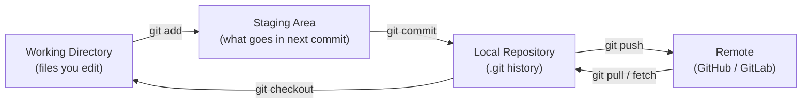
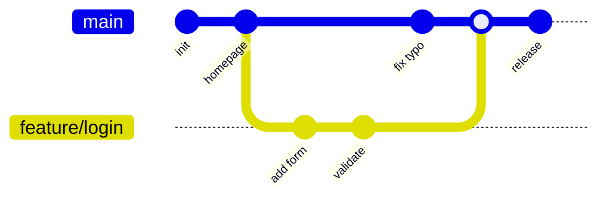
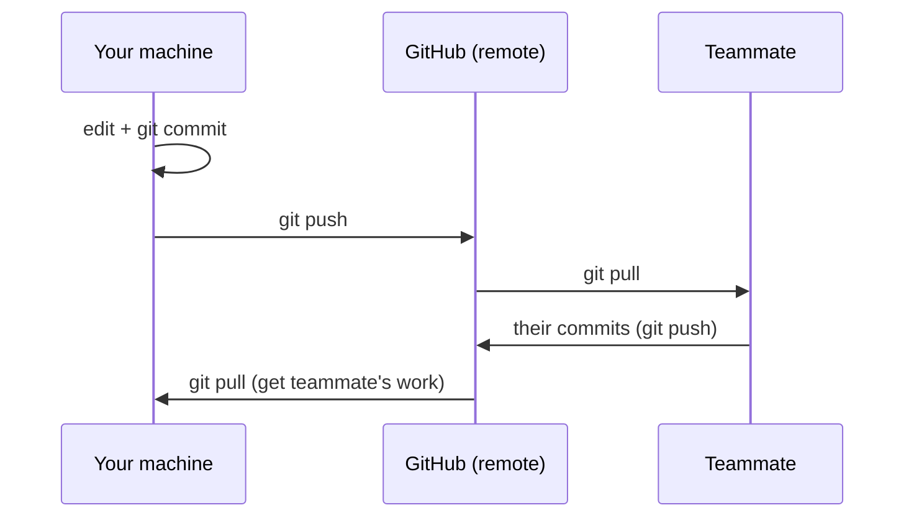

This is the **learning path** for people new to Git. It follows a single story — create a repo, make commits, branch, push, and open a pull request — in the order you actually do them, with just enough explanation to keep moving. The four Git pages fit together as:

- **This page (Crash Course)** — a guided first walkthrough; read it top to bottom.
- [Git Version Control](git/) — how Git works under the hood (objects, the DAG, internals).
- [Git Command Reference](git-reference.html) — the alphabetical lookup cheat sheet for every command.
- [Branching Strategies](branching.html) — team workflows: Git Flow, GitHub Flow, trunk-based.

## Why version control?

Before Git, people emailed `report_final_v2_REALLY_final.docx` around. Version control replaces that chaos with a single source of truth that remembers **every** change, **who** made it, and **why** — and lets many people work in parallel without overwriting each other. The payoff is threefold: a **full history** where every saved version is recoverable forever, **collaboration** where many people edit the same project safely, and **safe experiments** you can try in a branch and throw away if they fail.

## The mental model: three areas

Almost every Git command moves your work between three places. Internalize this picture and the commands stop feeling random.



| Area | What it holds | You change it with |
|------|---------------|--------------------|
| Working Directory | The actual files on disk you are editing | Your editor |
| Staging Area (Index) | The exact snapshot you are about to commit | `git add` |
| Local Repository | The committed history on your machine | `git commit` |
| Remote | The shared copy others pull from | `git push` |

## Step 1 — One-time setup

Tell Git who you are (this stamps every commit) and pick sensible defaults.

```bash
git config --global user.name "Your Name"
git config --global user.email "you@example.com"
git config --global init.defaultBranch main   # name the first branch "main"
git config --global pull.rebase false          # default merge behavior on pull
```

Check it worked:

```bash
git config --list
```

## Step 2 — Start a repository

You either **create** a new one or **clone** an existing project.

```bash
# Option A: brand-new project in the current folder
git init

# Option B: copy an existing project from a remote
git clone https://github.com/owner/repo.git
```

`git init` creates a hidden `.git/` directory — that folder *is* your repository (the history database). Delete it and you delete the version control, not the files.

## Step 3 — The core loop: edit → add → commit

This is the cycle you will repeat thousands of times.

```bash
# 1. See what changed
git status

# 2. Stage the changes you want to save together
git add file1.py file2.py
git add .              # stage everything that changed

# 3. Save a snapshot with a message explaining WHY
git commit -m "Add login form validation"
```

**What makes a good commit?** One logical change per commit, with a message written in the imperative mood ("Add", "Fix", "Remove" — not "Added"/"Fixing"). Keep the first line under ~50 characters. Future-you reading `git log` will thank present-you.

Inspect your history any time:

```bash
git log --oneline --graph    # compact, visual history
git diff                     # changes you have NOT staged yet
git diff --staged            # changes that ARE staged for next commit
```

## Step 4 — Branching: work without breaking things

A branch is a cheap, movable pointer to a commit. Create one per feature or fix so `main` always stays stable.

```bash
git switch -c feature/login   # create and switch to a new branch (Git 2.23+)
# ...edit, add, commit as usual...
git switch main               # jump back to main
git switch feature/login      # and back to your work
```



> `git switch` and `git restore` (Git 2.23+) are the modern, clearer replacements for the overloaded `git checkout`. You will still see `checkout` everywhere — it does both jobs.

## Step 5 — Share your work: push and pull

`origin` is the conventional name for your main remote. The first push sets up tracking with `-u`.

```bash
# Push your branch to the remote for the first time
git push -u origin feature/login

# Later pushes on the same branch are just:
git push

# Bring down changes others have pushed
git pull
```



## Step 6 — Open a pull request

A pull request (PR) — called a merge request on GitLab — proposes merging your branch into `main`. It is where review, automated tests, and discussion happen before code lands.

1. Push your branch (Step 5).
2. On GitHub/GitLab, open a PR from your branch into `main`.
3. Teammates review; CI runs tests automatically.
4. After approval, **merge** — your work is now in `main`.
5. Delete the branch; pull `main` locally to stay current.

```bash
# Using the GitHub CLI from the terminal
gh pr create --fill
gh pr status
```

See [Branching Strategies](branching.html) for how teams structure this at scale.

## The 12 commands that cover 90% of daily work

| Command | What it does |
|---------|-------------|
| `git status` | What changed, what's staged |
| `git add <file>` | Stage changes |
| `git commit -m "msg"` | Save a snapshot |
| `git log --oneline` | View history |
| `git diff` | See unstaged changes |
| `git switch -c <br>` | New branch |
| `git switch <br>` | Change branch |
| `git merge <br>` | Combine branches |
| `git pull` | Get remote changes |
| `git push` | Send your commits |
| `git stash` | Shelve work temporarily |
| `git restore <file>` | Discard local edits |

## "Oh no" — fixing common mistakes

Everyone breaks something early on. These get you out of the most common holes safely.

| Situation | Fix | Notes |
|-----------|-----|-------|
| Committed too early / wrong message | `git commit --amend -m "Better message"` | Rewrites the last commit. Don't amend commits you've already pushed and shared. |
| Undo last commit but keep the code | `git reset --soft HEAD~1` | Removes the commit, leaves the changes staged so you can recommit. |
| Drop everything since the last commit | `git restore .` | Discards uncommitted edits — destructive, make sure you mean it. |
| Mid-task, need to switch branches | `git stash` → `git switch other` → `git stash pop` | Shelves your work-in-progress and brings it back later. |
| Think I lost a commit | `git reflog` | Shows where HEAD has been; almost nothing is truly gone. Check out the hash to recover it. |

## Handling merge conflicts (the calm version)

A conflict just means two branches changed the same lines. Git pauses and asks you to choose.

```bash
git merge feature/login
# CONFLICT in app.py
```

Open the file; Git marks the clash:

```text
<<<<<<< HEAD
greeting = "Hello"
=======
greeting = "Hi there"
>>>>>>> feature/login
```

Edit the file to the version you want, delete the `<<<<<<<`/`=======`/`>>>>>>>` markers, then:

```bash
git add app.py
git commit          # completes the merge
```

If it goes sideways, `git merge --abort` returns you to safety.

## Where to go next

- **Understand the machinery** — read [Git Version Control](git/) for the object model, the commit DAG, and how SHA hashing guarantees integrity.
- **Look up a command** — keep [Git Command Reference](git-reference.html) open as your cheat sheet for rebase, cherry-pick, bisect, and more.
- **Work on a team** — pick a workflow in [Branching Strategies](branching.html) and wire it into [CI/CD](ci-cd/).

## Key Takeaways

- **Three areas:** working directory → staging (`add`) → repository (`commit`) → remote (`push`).
- **The core loop is edit → `add` → `commit`,** repeated endlessly with clear messages.
- **Branch for every change** so `main` stays stable; merge via pull requests.
- **Almost nothing is unrecoverable** — `git reflog` and `git reset` are your safety net.
- **A dozen commands** cover the vast majority of daily work; learn the rest as you need them.

## References

- [Pro Git Book](https://git-scm.com/book) — free, comprehensive, beginner-friendly
- [GitHub Skills](https://skills.github.com/) — interactive hands-on exercises
- [Official Git Documentation](https://git-scm.com/doc)
- [Conventional Commits](https://www.conventionalcommits.org/) — a popular commit message convention
