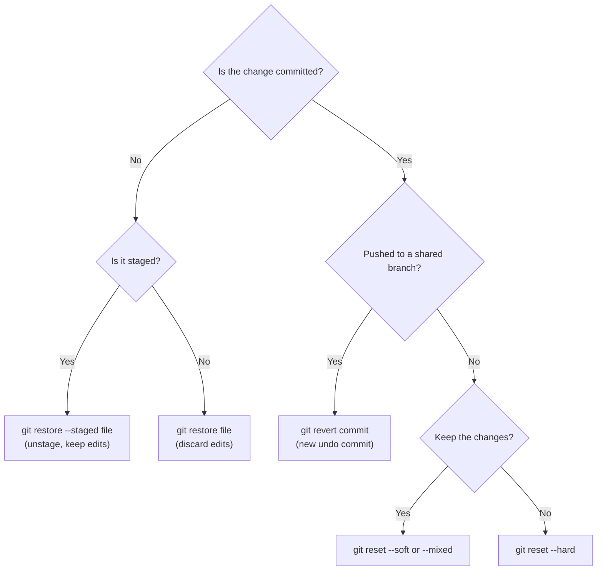

This page is a Git command reference organized by task. Scan the section you need or search the page for a command. Syntax reflects Git 2.55 (June 2026); commands added in the last few releases are marked with the version that introduced them. To *learn* Git, start with the [Git Crash Course](git-crash-course.html); for *how Git works internally*, see [Git Version Control](git/); for *team workflows*, see [Branching Strategies](branching.html).

Placeholders: `<commit>` accepts anything that names a commit — a hash, branch, tag, `HEAD~2` (two commits before `HEAD`), `HEAD^2` (second parent of a merge), `main@{yesterday}` or `@{u}` (the current branch's upstream).

**Two habits prevent almost all lost work.** Before rewriting history, remember that `git reflog` records every position `HEAD` has held, so a bad `reset` or `rebase` can be undone with `git reset --hard HEAD@{n}`. When updating a shared branch you have rewritten, use `git push --force-with-lease` instead of `--force`, so you cannot overwrite commits you have not seen.

## Configuration

```bash
git config --global user.name "Your Name"
git config --global user.email "you@example.com"
git config list --show-origin          # all settings and where each comes from (2.46+; older: --list)
git config get user.email              # read one value (2.46+; older: git config user.email)
git config --global --edit             # open ~/.gitconfig in the editor
git config --global alias.lg "log --oneline --graph --decorate --all"
```

Settings are read from `/etc/gitconfig` (`--system`), `~/.gitconfig` or `~/.config/git/config` (`--global`), and `.git/config` (`--local`, the default when writing); later scopes override earlier ones. `includeIf` lets you switch identity per directory, for example a work email for everything under `~/work/`:

```ini
# ~/.gitconfig
[includeIf "gitdir:~/work/"]
    path = ~/.gitconfig-work
```

Widely recommended settings:

| Setting | Effect |
|---------|--------|
| `init.defaultBranch main` | Name of the first branch in new repositories |
| `pull.rebase true` (or `pull.ff only`) | How `git pull` reconciles diverged branches |
| `rebase.autoStash true` | Stash and restore uncommitted changes around a rebase |
| `rebase.updateRefs true` | Move dependent branches along when rebasing a stack (2.38+) |
| `merge.conflictStyle zdiff3` | Show the common ancestor in conflict markers (2.35+) |
| `rerere.enabled true` | Record conflict resolutions and replay them automatically |
| `push.autoSetupRemote true` | First `git push` of a new branch sets its upstream (2.37+) |
| `fetch.prune true` | Delete remote-tracking branches that were deleted on the remote |
| `diff.algorithm histogram` | Usually produces more readable diffs than the default Myers |
| `help.autocorrect prompt` | Offer to run the intended command after a typo |

## Creating and cloning repositories

```bash
git init                                   # new repository in the current directory
git init --object-format=sha256 <dir>      # SHA-256 object IDs (not interoperable with SHA-1 remotes)
git clone <url>                            # full clone into ./<repo-name>
git clone <url> <dir>                      # into a chosen directory
git clone --branch <branch> <url>          # check out a specific branch or tag
git clone --recurse-submodules <url>       # include submodules
```

For large repositories, clone less (see [Large repositories](#large-repositories)):

| Clone type | Command | Downloads | Trade-off |
|------------|---------|-----------|-----------|
| Full | `git clone <url>` | All commits, trees and file contents | Largest, fully offline |
| Blobless (partial) | `git clone --filter=blob:none <url>` | All commits and trees; file contents on demand | Best default for developers on big repos |
| Treeless (partial) | `git clone --filter=tree:0 <url>` | All commits; trees and contents on demand | Good for CI builds; history commands are slow |
| Shallow | `git clone --depth 1 <url>` | Only the most recent commit(s) | Smallest; history is truncated and some operations fail |

## Staging and committing

```bash
git status                     # working tree and index status
git status -s                  # short format
git add <path>                 # stage a file or directory
git add -A                     # stage everything, including deletions, in the whole tree
git add -p                     # choose hunks interactively
git add -u                     # stage modifications and deletions of tracked files only
git rm <file>                  # delete and stage the deletion
git rm --cached <file>         # stop tracking but keep the file on disk
git mv <old> <new>             # rename and stage

git commit -m "Message"        # commit the index
git commit                     # write the message in the editor
git commit -am "Message"       # stage all tracked modifications, then commit (skips untracked files)
git commit --amend             # replace the last commit with index + new message
git commit --amend --no-edit   # add staged changes to the last commit, keep its message
git commit --fixup=<commit>    # record a fix to be squashed into <commit> by rebase --autosquash
git commit -S -m "Message"     # sign the commit
```

## Inspecting changes and history

### Diffs

```bash
git diff                       # working tree vs index (unstaged changes)
git diff --staged              # index vs HEAD (what will be committed)
git diff HEAD                  # working tree vs HEAD (everything uncommitted)
git diff main...feature        # changes on feature since it diverged from main
git diff --stat                # per-file summary
git diff --name-status         # file names with A/M/D status
git diff --word-diff           # word-level changes (prose, long lines)
git diff --check               # whitespace errors and leftover conflict markers
git range-diff main old-feature new-feature   # compare two versions of a rebased branch
```

### Log

```bash
git log --oneline --graph --decorate --all
git log -p <path>                         # patches touching a path
git log --follow -p <file>                # continue across renames
git log --stat -5                         # last five commits with file statistics
git log --author="Ada" --since="2 weeks ago"
git log --grep="timeout" -i               # search commit messages
git log -S "parse_config"                 # commits that add or remove this string ("pickaxe")
git log -G "retr(y|ies)"                  # commits whose diff matches a regex
git log -L :parse_config:src/config.py    # history of one function
git log main..feature                     # commits on feature not yet on main
git log --format="%h %an %ar %s"          # custom format
```

### Commits, files and authorship

```bash
git show <commit>                  # message and diff
git show <commit>:<path>           # file contents at that commit
git blame <file>                   # last commit to touch each line
git blame -w -C <file>             # ignore whitespace; detect lines moved from other files
git shortlog -sn                   # commit counts per author
git describe --tags                # nearest tag, e.g. v2.3.0-14-g1a2b3c4
git grep -n "TODO"                 # search tracked files (fast, respects .gitignore)
git last-modified                  # last commit to touch each path (2.52+)
git repo info                      # repository properties such as object format (2.52+)
```

To keep bulk reformatting commits out of `git blame`, list their hashes in `.git-blame-ignore-revs` and set `git config blame.ignoreRevsFile .git-blame-ignore-revs` (GitHub's blame view honours the file automatically).

## Branches

```bash
git branch                         # local branches (* marks the current one)
git branch -a                      # include remote-tracking branches
git branch -vv                     # with upstream and ahead/behind counts
git branch --merged main           # branches already merged into main
git branch <name> [<start>]        # create without switching
git branch -m <old> <new>          # rename
git branch -d <name>               # delete if merged
git branch -D <name>               # delete regardless

git switch <branch>                # change branch
git switch -c <branch> [<start>]   # create and switch
git switch -                       # previous branch
git switch --detach <commit>       # inspect an arbitrary commit
git checkout <branch>              # pre-2.23 equivalent of switch
git checkout -b <branch>           # pre-2.23 equivalent of switch -c
```

## Merging and rebasing

### Merge

```bash
git merge <branch>                 # merge into the current branch
git merge --no-ff <branch>         # always create a merge commit
git merge --ff-only <branch>       # succeed only if no merge commit is needed
git merge --squash <branch>        # stage the branch's combined changes; you then commit
git merge --abort                  # abandon a conflicted merge
git mergetool                      # open the configured merge tool on conflicts
```

| Style | Resulting history | Suits |
|-------|-------------------|-------|
| Fast-forward | No merge commit; the branch pointer simply advances | Linear history when the target has not moved |
| `--no-ff` | A merge commit joins the two lines | Recording that a feature was a unit of work |
| `--squash` | One new ordinary commit; the branch's individual commits are not kept | One tidy commit per feature on `main` |
| Rebase then fast-forward | Branch commits replayed onto the target, then advanced | Linear history that keeps individual commits |

### Rebase

```bash
git rebase <upstream>              # replay current branch's commits onto <upstream>
git rebase --onto <new> <old> <b>  # move commits after <old> on <b> onto <new>
git rebase -i HEAD~5               # edit the last five commits interactively
git rebase -i --autosquash main    # apply --fixup commits automatically
git rebase --update-refs main      # also move branches stacked on this one (2.38+)
git rebase --rebase-merges main    # preserve merge commits in the rebased range
git rebase --continue              # after resolving a conflict
git rebase --skip                  # drop the conflicting commit
git rebase --abort                 # return to the pre-rebase state
```

Interactive rebase opens a to-do list, one line per commit, oldest first. Change the verb to rewrite history:

| Verb | Effect |
|------|--------|
| `pick` | Keep the commit as is |
| `reword` | Keep the changes, edit the message |
| `edit` | Stop after applying, to amend or split the commit |
| `squash` | Meld into the previous commit and combine messages |
| `fixup` | Meld into the previous commit and discard this message |
| `drop` | Remove the commit (or delete the line) |
| `exec <cmd>` | Run a shell command, for example tests, at that point |

Rebasing creates new commits with new IDs. Do not rebase commits that others have based work on unless the team has agreed to it. Git 2.54 also ships an experimental `git history` command for common rewrites (such as splitting a commit) without a full interactive rebase.

### Cherry-pick and revert

```bash
git cherry-pick <commit>           # apply one commit's changes onto the current branch
git cherry-pick A^..B              # a range, A through B inclusive
git cherry-pick -x <commit>        # append "(cherry picked from ...)" to the message
git cherry-pick --continue        # after resolving a conflict (or --abort)
git revert <commit>                # new commit that undoes <commit>
git revert -m 1 <merge-commit>     # undo a merge, keeping parent 1 (the branch merged into)
git revert --no-commit A..B        # revert a range as a single commit
```

## Remotes and synchronization

```bash
git remote -v                      # list remotes with URLs
git remote add <name> <url>
git remote set-url origin <url>    # e.g. switch from HTTPS to SSH
git remote rename <old> <new>
git remote remove <name>

git fetch                          # update remote-tracking branches from the upstream remote
git fetch --all --prune            # every remote; drop branches deleted upstream
git pull                           # fetch, then merge or rebase (see pull.rebase)
git pull --rebase                  # fetch, then rebase
git push                           # push the current branch to its upstream
git push -u origin <branch>        # first push; set upstream
git push origin --delete <branch>  # delete a remote branch
git push --force-with-lease        # overwrite only if the remote is where you last saw it
git push --force-with-lease --force-if-includes   # also require that you have integrated it (2.30+)
```

`git fetch` only updates remote-tracking branches (`origin/main`) and never touches your own branches or files, so it is always safe; inspect with `git log HEAD..origin/main`, then merge or rebase deliberately. `git pull` combines both steps.

`--force-with-lease` alone can be defeated by a background fetch in an IDE, which silently updates what "last seen" means; `--force-if-includes` closes that gap by also checking that the remote tip appears in your branch's reflog.

## Undoing changes

Choose the command by where the change currently is:



```bash
git restore <file>                     # discard working-tree changes (2.23+; older: git checkout -- <file>)
git restore --staged <file>            # unstage (2.23+; older: git reset HEAD <file>)
git restore --source=<commit> <file>   # restore a file's content from another commit
git clean -n                           # preview untracked files that would be deleted
git clean -fd                          # delete untracked files and directories
git reset --soft HEAD~1                # undo the last commit, keep changes staged
git reset HEAD~1                       # undo the last commit, keep changes unstaged (--mixed)
git reset --hard HEAD~1                # undo the last commit and discard its changes
git reset --hard @{u}                  # make the branch match its upstream exactly
```

`git reset` moves the current branch to another commit; the mode determines what else is overwritten:

| Mode | Moves the branch | Index | Working tree | Use when |
|------|:----------------:|:-----:|:------------:|----------|
| `--soft` | yes | kept | kept | Recommit differently (squash, reword) |
| `--mixed` (default) | yes | reset | kept | Unstage and rework before committing |
| `--hard` | yes | reset | **overwritten** | Discard the work entirely |

`reset` rewrites history and is safe only for commits that exist nowhere else. For commits already pushed to a shared branch, use `git revert`, which adds a new commit and leaves existing history intact.

## Stashing

```bash
git stash                          # stash tracked changes (staged and unstaged)
git stash -u                       # include untracked files
git stash push -m "wip: parser" -- src/parser.py   # stash specific paths with a message
git stash list
git stash show -p stash@{1}        # view a stash's diff
git stash pop                      # apply the most recent stash and drop it
git stash apply stash@{1}          # apply without dropping
git stash branch <name> stash@{1}  # new branch from the stash's base, with the stash applied
git stash drop stash@{1}
git stash clear                    # delete all stashes
```

## Tags

```bash
git tag                            # list
git tag -l "v2.*"                  # list matching a pattern
git tag v2.3.0                     # lightweight tag (a bare pointer)
git tag -a v2.3.0 -m "Release 2.3.0"   # annotated tag (tagger, date, message)
git tag -s v2.3.0 -m "Release 2.3.0"   # signed annotated tag
git push origin v2.3.0             # push one tag
git push --follow-tags             # push annotated tags reachable from pushed commits
git tag -d v2.3.0                  # delete locally
git push origin --delete v2.3.0    # delete on the remote
```

Use annotated tags for releases; `git describe` and `--follow-tags` ignore lightweight tags by default.

## Finding bugs with bisect

`git bisect` binary-searches history for the commit that introduced a regression, needing only about log2(n) tests for n candidate commits (roughly 10 tests for 1,000 commits).

```bash
git bisect start
git bisect bad                     # the current commit is broken
git bisect good v2.2.0             # this one worked
# Git checks out a midpoint; test it, then mark it:
git bisect good                    # or: git bisect bad, or git bisect skip if untestable
git bisect reset                   # finish and return to the original branch

git bisect run ./test.sh           # automate: exit 0 = good, 125 = skip, other non-zero = bad
```

## Worktrees

A worktree is an additional checkout of the same repository in another directory, so you can work on two branches at once without stashing or cloning again.

```bash
git worktree add ../hotfix hotfix/login     # check out an existing branch in ../hotfix
git worktree add -b review ../review main   # create a new branch there
git worktree list
git worktree remove ../hotfix
git worktree prune                          # clean up records of deleted directories
```

A branch can be checked out in only one worktree at a time.

## Large repositories

| Technique | Command | Helps with |
|-----------|---------|------------|
| Partial clone | `git clone --filter=blob:none <url>` | Clone size and time |
| Sparse checkout | `git sparse-checkout set <dir>...` | Number of files in the working tree |
| Background maintenance | `git maintenance start` | Keeping commit-graph, packs and prefetch fresh |
| Filesystem monitor | `git config core.fsmonitor true` | `git status` speed (built-in daemon on Windows and macOS) |
| Untracked cache | `git config core.untrackedCache true` | `git status` speed |
| Many-files preset | `git config feature.manyFiles true` | Enables index and untracked-file optimizations together |
| Scalar | `scalar clone <url>` | Applies all of the above in one step (bundled since 2.38) |
| Git LFS | `git lfs track "*.psd"` | Large binary assets |

```bash
# Monorepo: blobless clone limited to two directories
git clone --filter=blob:none --sparse <url>
cd repo
git sparse-checkout set services/api libs/common
git sparse-checkout list
git sparse-checkout add docs
git sparse-checkout disable        # back to a full working tree

# Manual maintenance
git maintenance run                # run the scheduled tasks now
git gc                             # repack and remove unreachable objects past expiry
git fsck                           # verify object integrity
```

`git sparse-checkout set` uses cone mode (whole directories) by default; the older `git sparse-checkout init` step is deprecated. Git LFS stores large files on a separate server and keeps small pointer files in the repository; run `git lfs install` once per machine and commit `.gitattributes` along with the tracking rules. See [Protocols and Performance](git/protocols-and-performance.html) for how packfiles and partial clone work.

## Signing commits and tags

Signing lets hosts mark commits as *verified*. SSH keys (Git 2.34+) are the simplest option because most developers already have one.

```bash
# SSH signing
git config --global gpg.format ssh
git config --global user.signingkey ~/.ssh/id_ed25519.pub
git config --global commit.gpgsign true
git config --global tag.gpgsign true

# Local verification needs a list of trusted signers
git config --global gpg.ssh.allowedSignersFile ~/.config/git/allowed_signers
echo "you@example.com $(cat ~/.ssh/id_ed25519.pub)" >> ~/.config/git/allowed_signers

git log --show-signature -1
git verify-commit <commit>
git verify-tag v2.3.0
```

For OpenPGP signing, leave `gpg.format` at its default (`openpgp`) and set `user.signingkey` to the GPG key ID. Upload the public key (SSH signing key or GPG key) to your hosting account so the host can verify signatures.

## Removing sensitive data

Once a secret has been pushed, assume it is compromised: **rotate the credential first**, then clean history. Removing it from the latest commit is not enough; it remains in every earlier commit.

```bash
# git-filter-repo is the tool recommended by the Git project (install via pip or a package manager)
git filter-repo --invert-paths --path config/secrets.yml   # drop a file from all history
git filter-repo --replace-text expressions.txt             # replace strings, e.g. "SECRET==>***"
git push --force --all && git push --force --tags
```

`git filter-branch` is deprecated in favour of `git filter-repo`; it is slow and easy to misuse. Rewriting changes every subsequent commit ID, so all collaborators must re-clone or hard-reset, and hosting services may retain the old commits in pull-request refs and caches (GitHub requires contacting support to purge them).

Prevent leaks rather than cleaning them up: enable the host's push protection (GitHub secret scanning blocks pushes containing recognised credential formats) and run a scanner in pre-commit hooks and CI, for example `gitleaks git` (gitleaks 8.19+) or TruffleHog.

## Hooks and tool integration

Hooks are scripts in `.git/hooks/` that Git runs at points such as `pre-commit`, `commit-msg` and `pre-push`; a non-zero exit aborts the operation. They are not cloned, so teams share them with a framework or a tracked directory:

```bash
git config core.hooksPath .githooks          # use hooks committed to the repository

pip install pre-commit                       # or: pipx install pre-commit
pre-commit install                           # install hooks from .pre-commit-config.yaml
pre-commit run --all-files
```

Git 2.54 also allows hooks to be defined in configuration files, including several commands for the same event; see `git help githooks`.

```bash
# VS Code as editor and diff tool
git config --global core.editor "code --wait"
git config --global diff.tool vscode
git config --global difftool.vscode.cmd 'code --wait --diff $LOCAL $REMOTE'

# GitHub CLI
gh repo clone <owner>/<repo>
gh pr create --fill
gh pr checkout <number>
gh pr view --web
```

## Troubleshooting

| Problem | Fix |
|---------|-----|
| **Detached HEAD** ("You are in 'detached HEAD' state") | You checked out a commit, not a branch. To keep work done there: `git switch -c <new-branch>`. To leave: `git switch <branch>`. |
| **Committed to the wrong branch** (not pushed) | `git switch correct-branch`, `git cherry-pick <commit>`, then `git switch wrong-branch` and `git reset --hard HEAD~1` |
| **Last *n* commits belong on a new branch** | `git branch <new>`, `git reset --hard HEAD~n`, `git switch <new>` |
| **Push rejected (non-fast-forward)** | The remote has commits you lack: `git pull --rebase`, resolve, push again |
| **Lost commits after reset or rebase** | `git reflog`, find the entry, `git branch rescue <hash>` |
| **Deleted a branch** | `git reflog` (or the hash printed by `git branch -D`), then `git branch <name> <hash>` |
| **Merge conflict** | Edit files, remove markers, `git add`, then `git commit` or `git rebase --continue`; or `--abort` |
| **Line-ending noise on Windows** | Commit a `.gitattributes` with `* text=auto`, then `git add --renormalize .` |
| **Corrupted object errors** | `git fsck --full` to identify the damage; fetch the missing objects from a remote or re-clone and copy over uncommitted work |
| **Slow `git status`** | Enable `core.fsmonitor` and `core.untrackedCache`, or run `scalar register` |

Avoid `git reflog expire --expire=now --all` followed by `git gc --prune=now` unless you intend to destroy unreachable history: it deletes exactly the objects the reflog would let you recover.

## Toward Git 3.0

The Git project maintains a list of breaking changes planned for Git 3.0, which has no release date yet. Most can already be opted into:

| Change | Git 2.x today | Planned for 3.0 |
|--------|---------------|-----------------|
| Default branch name | `master` (with a hint to configure it) | `main` |
| Object hash for new repositories | SHA-1; opt in with `git init --object-format=sha256` | SHA-256 |
| Reference storage for new repositories | Loose files plus `packed-refs`; opt in with `git init --ref-format=reftable` | Reftable |
| Discovery of bare repositories | Allowed anywhere (`safe.bareRepository=all`) | Only when explicitly requested |
| Legacy commands and features | `git whatchanged`, `git pack-redundant`, grafts | Removed |
| Building Git from source | Rust optional | Rust required |

SHA-256 repositories cannot yet exchange objects with SHA-1 repositories, and support on hosting services is still limited, so opt in only where every participant supports it.

## See also

- [Git Crash Course](git-crash-course.html) — guided introduction for newcomers
- [Git Version Control](git/) — object model, the commit graph and internals
- [Conflict and Recovery](git/conflict-and-recovery.html) — how merges, conflicts and the reflog work
- [Branching Strategies](branching.html) — GitHub Flow, trunk-based development and Git Flow
- [CI/CD](ci-cd/) — automating checks on every push

## References

- [Git reference manual](https://git-scm.com/docs)
- [Pro Git](https://git-scm.com/book)
- [Git BreakingChanges](https://git-scm.com/docs/BreakingChanges) — the Git 3.0 plan
- [git-filter-repo](https://github.com/newren/git-filter-repo)
- [Git Flight Rules](https://github.com/k88hudson/git-flight-rules) — what to do when things go wrong
