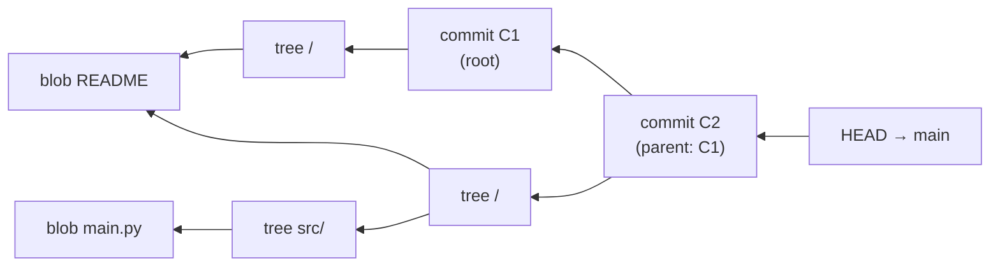
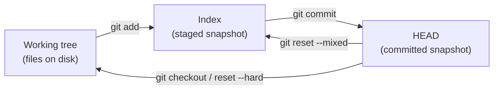
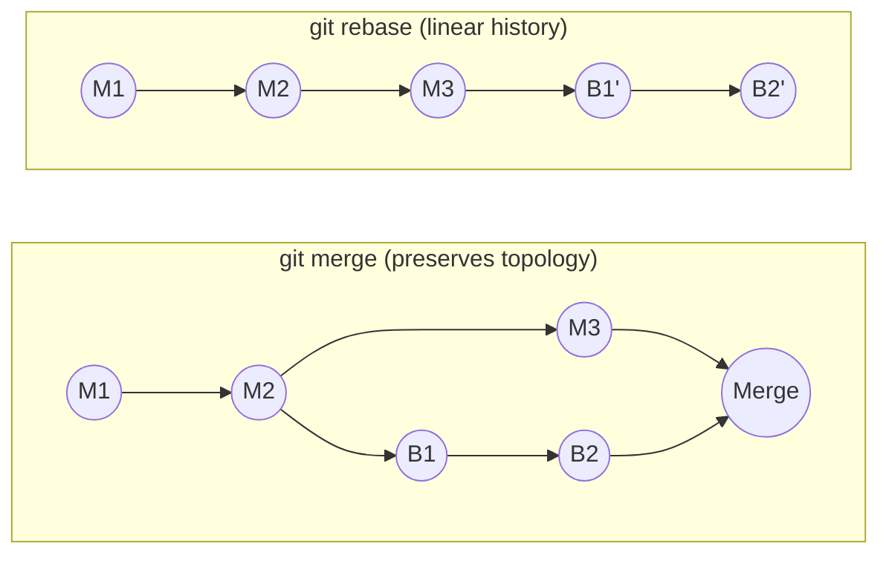

<div class="hero-section" style="background: linear-gradient(135deg, #4facfe 0%, #00f2fe 100%); color: white; padding: 3rem 2rem; margin: -2rem -3rem 2rem -3rem; text-align: center;">
  <h1 style="color: white; margin: 0; font-size: 2.5rem;">Git Version Control</h1>
  <p style="font-size: 1.25rem; margin-top: 1rem; opacity: 0.9;">Distributed Version Control System: Architecture, Algorithms, and Implementation</p>
</div>

<div class="intro-card">
  <p class="lead-text">Git is a distributed version control system designed by Linus Torvalds in 2005. Built on content-addressable storage and cryptographic principles, Git provides a robust framework for tracking changes, managing parallel development, and ensuring data integrity through SHA-1/SHA-256 hashing. Its distributed architecture enables every clone to function as a complete repository with full history.</p>
  
  <div class="key-insights">
    <div class="insight-card">
      <i class="fas fa-project-diagram"></i>
      <h4>DAG-Based History</h4>
      <p>Directed acyclic graph for commits</p>
    </div>
    <div class="insight-card">
      <i class="fas fa-shield-alt"></i>
      <h4>Cryptographic Integrity</h4>
      <p>SHA-256 content addressing (SHA-1 deprecated)</p>
    </div>
    <div class="insight-card">
      <i class="fas fa-network-wired"></i>
      <h4>Distributed Architecture</h4>
      <p>Peer-to-peer repository model</p>
    </div>
  </div>
</div>

<div class="tip-card">
  <h4>Which Git page do you want?</h4>
  <p>This page is the <strong>architecture and internals deep dive</strong> — the object model, the commit DAG, and how Git works under the hood. If you instead want to <em>get started</em>, read the <a href="git-crash-course.html">Git Crash Course</a>; to <em>look up a command</em>, the <a href="git-reference.html">Git Command Reference</a>; for <em>team workflow</em>, <a href="branching.html">Branching Strategies</a>.</p>
</div>

## What is Git?

Git is a **distributed version control system** created by Linus Torvalds in 2005 for Linux kernel development. Unlike centralized systems (SVN, Perforce), Git:

- **Stores complete history locally**: Every clone is a full backup
- **Works offline**: Most operations don't need network access
- **Branches are lightweight**: Creating/merging branches is fast and easy
- **Guarantees data integrity**: Uses SHA-256 checksums for all data (SHA-1 legacy support)
- **Supports non-linear development**: Multiple parallel branches and complex merges

### Why Use Version Control?

Version control solves fundamental problems in software development:

1. **Collaboration**: Multiple developers can work on the same project without conflicts
2. **History**: Track who changed what, when, and why
3. **Backup**: Distributed copies protect against data loss
4. **Experimentation**: Try new ideas in branches without affecting stable code
5. **Time Travel**: Revert to any previous state of the project
6. **Blame/Annotation**: Understand why code was written a certain way

## Core Architecture

### Object Model

Git implements a content-addressable filesystem with four fundamental object types:

**Blob Objects**
- Store file contents without metadata
- Identified by SHA-1 hash of content
- Immutable once created
- Shared across identical files

**Tree Objects**
- Represent directory structures
- Contain references to blobs and other trees
- Store file modes and names
- Form hierarchical structure

**Commit Objects**
- Point to tree object (snapshot)
- Reference parent commit(s)
- Include author, committer, timestamp
- Store commit message

**Tag Objects**
- Annotated tags with metadata
- Point to any Git object
- Include tagger information
- Cryptographically signable

These objects compose into a graph: each **commit** points to one **tree** (the project snapshot) and to its **parent** commit(s). Trees point to **blobs** (file contents) and nested trees. Following parent links backward traces the full history as a directed acyclic graph (DAG).



Because objects are addressed by the hash of their content, identical files anywhere in history share a single blob, and any tampering changes the hash — giving Git both deduplication and cryptographic integrity.

#### Seeing the Object Model Directly

The abstract model becomes concrete with Git's *plumbing* commands. The session below creates a blob, wraps it in a tree, and seals that tree into a commit — the exact three steps `git commit` performs internally:

```bash
# 1. Store a blob and get its hash
$ echo "hello" | git hash-object -w --stdin
ce013625030ba8dba906f756967f9e9ca394464a

# 2. Inspect any object: its type, and its content
$ git cat-file -t ce013625        # -> blob
$ git cat-file -p ce013625        # -> hello

# 3. A commit is just text pointing at a tree and parent(s)
$ git cat-file -p HEAD
tree   a1b2c3...        # the snapshot
parent d4e5f6...        # previous commit (omitted for the root commit)
author  Jane Dev <jane@example.com> 1700000000 +0000
committer Jane Dev <jane@example.com> 1700000000 +0000

    Add greeting
```

The hash of a blob depends only on its content (plus a `blob <size>\0` header), never on its filename or location — that is why renaming a file or copying it elsewhere costs zero extra storage.

### Storage Model

```
.git/
├── objects/           # Content-addressable storage
│   ├── 2d/           # First 2 chars of SHA-1
│   │   └── 3f4a...  # Remaining 38 chars
│   ├── info/
│   └── pack/         # Packed objects
├── refs/             # References
│   ├── heads/        # Branch tips
│   ├── tags/         # Tag references
│   └── remotes/      # Remote tracking
├── HEAD              # Current branch
├── index             # Staging area
└── config            # Repository configuration
```

### The Three Trees

Almost every day-to-day Git command moves data between three "trees" (snapshots of the project). Understanding them demystifies `add`, `commit`, `reset`, and `checkout` — they are all just different ways of synchronizing these three states.

| Tree | Lives in | Represents | Advanced by |
|------|----------|------------|-------------|
| **HEAD** | `.git` (the commit it points to) | Last commit — the snapshot you started from | `git commit` |
| **Index** (staging area) | `.git/index` | The proposed *next* snapshot | `git add` |
| **Working tree** | Files on disk | Your actual edits, staged or not | Editing files |



This is why the three `reset` modes differ only in *how far* they propagate a move of HEAD:

| Command | Moves HEAD | Resets Index | Resets Working tree |
|---------|:----------:|:------------:|:-------------------:|
| `git reset --soft`  | Yes | No  | No  |
| `git reset --mixed` (default) | Yes | Yes | No  |
| `git reset --hard`  | Yes | Yes | Yes |

A `--soft` reset leaves your staged changes intact (useful for re-doing a commit message); a `--hard` reset discards everything back to the target commit (and is the one command capable of destroying uncommitted work).

## Configuration Management

### Configuration Hierarchy

Git uses a three-level configuration system:

**System Level** (`/etc/gitconfig`)
- Applies to all users on the system
- Modified with `git config --system`

**Global Level** (`~/.gitconfig`)
- User-specific settings
- Modified with `git config --global`

**Repository Level** (`.git/config`)
- Repository-specific settings
- Modified with `git config --local`

### Essential Configuration

```bash
# Identity
git config --global user.name "Your Name"
git config --global user.email "your.email@example.com"

# Editor
git config --global core.editor "vim"

# Line endings
git config --global core.autocrlf input  # Unix/Mac
git config --global core.autocrlf true   # Windows

# Default branch
git config --global init.defaultBranch main

# Aliases
git config --global alias.lg "log --graph --pretty=format:'%Cred%h%Creset -%C(yellow)%d%Creset %s %Cgreen(%cr) %C(bold blue)<%an>%Creset' --abbrev-commit"
```

## Common Operations

### Repository Initialization

```bash
# Initialize new repository
git init
git init --bare              # Bare repository (no working tree)
git init --object-format=sha256  # SHA-256 (recommended)

# Clone existing repository
git clone <url>
git clone --depth 1 <url>    # Shallow clone
git clone --filter=blob:none <url>  # Partial clone
```

### Staging and Committing

```bash
# Stage changes
git add <file>               # Stage specific file
git add .                    # Stage all changes
git add -p                   # Interactive staging
git add -u                   # Stage modified/deleted files

# Commit
git commit -m "message"
git commit -am "message"     # Stage and commit tracked files
git commit --amend          # Modify last commit
git commit --fixup <sha>    # Create fixup commit
```

### Branch Operations

```bash
# Branch management
git branch                   # List branches
git branch <name>           # Create branch
git checkout <branch>       # Switch branch
git checkout -b <branch>    # Create and switch
git branch -d <branch>      # Delete merged branch
git branch -D <branch>      # Force delete

# Remote branches
git push -u origin <branch> # Push and track
git push origin --delete <branch>  # Delete remote
git fetch --prune           # Clean stale references
```

## Mathematical Foundations

### Content-Addressable Storage Theory

Git implements a content-addressable filesystem where objects are stored and retrieved by their cryptographic hash. This provides integrity guarantees and enables efficient storage through deduplication.

**Key Components:**
- **GitObject**: Base class for all Git objects (blob, tree, commit, tag)
- **SHA-256 Hashing**: Content addressing using cryptographic hashes (recommended)
  - **Security Notice**: SHA-1 is cryptographically broken. New repositories should use SHA-256 with `git init --object-format=sha256`. Git 2.42+ supports automatic algorithm detection and interoperability
- **Compression**: zlib compression for efficient storage
- **Merkle Trees**: Tree objects form a Merkle tree structure
- **Commit DAG**: Directed Acyclic Graph for version history

**Object Model:**
```python
# Example: Creating a Git object (SHA-256 recommended)
header = f"blob {len(content)}\0".encode()
# SHA-256 for new repositories
sha256 = hashlib.sha256(header + content).hexdigest()
# SHA-1 for legacy compatibility
sha1 = hashlib.sha1(header + content).hexdigest()
compressed = zlib.compress(header + content)
```

> **Code Reference**: For complete implementation of Git's object model, Merkle trees, and DAG operations, see [`content_addressable_storage.py`](../../code-examples/technology/git/content_addressable_storage.py)

### Three-Way Merge Algorithm

Git's three-way merge algorithm combines changes from two branches using their common ancestor as a reference point. This enables automatic resolution of non-conflicting changes.

**Algorithm Steps:**
1. Find common ancestor (merge base)
2. Compute diffs: base→ours and base→theirs
3. Apply non-conflicting changes automatically
4. Mark conflicting changes for manual resolution

**Merge Cases:**
- **No conflict**: Changes in different files or parts
- **Auto-merge**: Same changes in both branches
- **Conflict**: Different changes to same lines

**Example merge conflict markers:**
```
<<<<<<< ours
Our changes
=======
Their changes
>>>>>>> theirs
```

> **Code Reference**: For complete three-way merge implementation with conflict detection and advanced merge strategies, see [`three_way_merge.py`](../../code-examples/technology/git/three_way_merge.py)

## Git Internals

### Object Storage Implementation

Git uses a content-addressable storage system where objects are identified by their cryptographic hash (SHA-256 recommended, SHA-1 legacy). The storage system includes:

**Key Components:**
- **Loose Objects**: Individual compressed files stored in `.git/objects/`
- **Pack Files**: Compressed archives containing multiple objects with delta compression
- **Pack Indexes**: Binary indexes for fast object lookup within pack files
- **Bitmap Indexes**: Reachability bitmaps for optimized operations

**Storage Format:**
- Objects are compressed using zlib
- Directory structure uses first 2 characters of hash for sharding
- Pack files use delta compression to reduce storage size
- SHA-256 repositories use extended object format for compatibility

> **Code Reference**: For complete object storage implementation including loose objects, pack files, and index structures, see [`object_storage.py`](../../code-examples/technology/git/object_storage.py)

### Index (Staging Area) Structure

```c
// Git index format
struct index_header {
    char signature[4];      // "DIRC"
    uint32_t version;       // 2, 3, or 4
    uint32_t entries;       // Number of entries
};

struct index_entry {
    struct stat_data {
        uint32_t ctime_sec;
        uint32_t ctime_nsec;
        uint32_t mtime_sec;
        uint32_t mtime_nsec;
        uint32_t dev;
        uint32_t ino;
        uint32_t mode;
        uint32_t uid;
        uint32_t gid;
        uint32_t size;
    } stat;
    uint8_t sha1[20];
    uint16_t flags;
    char path[]; // Variable length
};

// Extensions
struct index_extension {
    char signature[4];
    uint32_t size;
    // Extension-specific data
};
```

### Reference Management

Git references are human-readable names that point to commit objects. The reference system provides:

**Reference Types:**
- **Branches**: Mutable references to commits (`refs/heads/*`)
- **Tags**: Immutable references to objects (`refs/tags/*`)
- **Remote refs**: References to remote repository state (`refs/remotes/*`)
- **Symbolic refs**: References to other references (like HEAD)

**Storage Mechanisms:**
- **Loose refs**: Individual files containing commit SHA
- **Packed refs**: Single file containing multiple references for efficiency
- **Ref transactions**: Atomic updates to multiple references

**Atomic Updates:**
- Lock files ensure concurrent safety
- Compare-and-swap operations prevent race conditions
- Reflogs track reference history

> **Code Reference**: For complete reference management implementation with atomic updates and transactions, see [`reference_management.py`](../../code-examples/technology/git/reference_management.py)

## Advanced Command Implementation

### Repository Operations at the Protocol Level

Git's network protocol enables efficient distributed repository synchronization through:

**Protocol Phases:**
1. **Reference Discovery**: Client queries available refs from server
2. **Capability Negotiation**: Client and server agree on protocol features
3. **Pack Negotiation**: Client specifies wants/haves for minimal data transfer
4. **Pack Transfer**: Server sends optimized pack file with only needed objects

**Protocol Features:**
- **Smart HTTP Protocol**: Efficient bidirectional communication
- **Pack Protocol**: Optimized object transfer format
- **Shallow Cloning**: Fetch limited history depth
- **Partial Cloning**: Fetch subset of repository objects
- **Protocol Extensions**: Side-band, progress reporting, atomic push

**Optimization Techniques:**
- Delta compression between similar objects
- Bitmap indexes for reachability queries
- Multi-pack indexes for large repositories

> **Code Reference**: For complete Git protocol implementation including clone, fetch, and push operations, see [`repository_operations.py`](../../code-examples/technology/git/repository_operations.py)

### History and Inspection

```bash
# View history
git log --oneline --graph --all
git log --follow <file>      # Track renames
git log -p                   # Show patches
git log --since="2 weeks ago"
git log --author="pattern"

# Examine changes
git diff                     # Working vs staged
git diff --staged           # Staged vs committed
git diff HEAD~2 HEAD        # Between commits
git diff branch1..branch2   # Between branches

# Blame and annotation
git blame <file>
git blame -L 10,20 <file>   # Lines 10-20
```

## Advanced Branching and Merge Strategies

### Merge Algorithm Implementation

Git implements sophisticated merge algorithms to combine divergent development branches:

**Merge Strategies:**
- **Recursive (default)**: Handles multiple merge bases by recursively merging them
- **Octopus**: Merges multiple branches simultaneously (for integration branches)
- **Ours**: Keeps current branch content, ignoring other branches
- **Subtree**: Adjusts for directory structure differences
- **Resolve**: Older two-head merge strategy

**Three-Way Merge Process:**
1. Find common ancestor(s) of branches
2. For multiple bases, recursively merge them to create virtual base
3. Compare base, ours, and theirs for each file
4. Auto-merge non-conflicting changes
5. Mark conflicts for manual resolution

**Conflict Detection:**
- Concurrent modifications to same file regions
- File vs directory conflicts
- Add/add conflicts (different files at same path)
- Rename detection and handling

> **Code Reference**: For complete merge strategy implementations including recursive, octopus, and subtree strategies, see [`merge_strategies.py`](../../code-examples/technology/git/merge_strategies.py)

## Branching Strategies

### Merge Operations

```bash
# Fast-forward merge (default when possible)
git merge <branch>

# No fast-forward (preserve branch history)
git merge --no-ff <branch>

# Squash merge (single commit)
git merge --squash <branch>

# Merge strategies
git merge -s recursive <branch>  # Default
git merge -s ours <branch>       # Keep current content
git merge -s octopus b1 b2 b3    # Multiple branches
```

### Merge vs Rebase

Both `merge` and `rebase` integrate work from one branch into another, but they produce different histories. A **merge** preserves the true topology by creating a merge commit with two parents; a **rebase** rewrites your commits so they appear to have been built on top of the latest base, yielding a linear history. The diagrams below show a feature branch `B1 → B2` integrated into `main` (`M1 → M2 → M3`).



| | Merge | Rebase |
|---|-------|--------|
| History | Non-linear; true graph | Linear, easier to read |
| Commit hashes | Preserved | Rewritten (new commits) |
| Traceability | Records when integration happened | Loses the original branch point |
| Safe on shared branches? | Yes | No — never rebase commits others have pulled |

**Golden rule of rebasing**: rebase only commits that exist solely in your local repository. Rewriting published history forces every collaborator to recover manually.

### Rebase Operations

```bash
# Basic rebase
git rebase <base-branch>

# Interactive rebase
git rebase -i <base-commit>
# Commands: pick, reword, edit, squash, fixup, drop

# Preserve merge commits (--preserve-merges is deprecated)
git rebase --rebase-merges <base>

# Autosquash fixup commits
git rebase -i --autosquash

# Rebase with strategy
git rebase -s recursive -X theirs <base>
```

### Cherry-Pick

```bash
# Apply specific commits
git cherry-pick <sha>
git cherry-pick <sha1>..<sha2>  # Range
git cherry-pick -n <sha>        # No commit
git cherry-pick -x <sha>        # Add source reference
```

## Distributed Repository Synchronization

### Remote Protocol Implementation

Git's distributed nature relies on efficient protocols for synchronizing repositories:

**Protocol Capabilities:**
- **multi_ack_detailed**: Optimized negotiation with multiple acknowledgments
- **side-band-64k**: Multiplexed data streams for progress and errors
- **ofs-delta**: Offset-based delta encoding for better compression
- **shallow**: Support for shallow clones and fetches
- **filter**: Partial clone with object filtering
- **atomic**: All-or-nothing push transactions

**Fetch Operation Phases:**
1. **Reference Discovery**: Query remote for available refs and capabilities
2. **Negotiation**: Find common commits to minimize transfer
3. **Pack Transfer**: Receive optimized pack with only missing objects
4. **Reference Update**: Atomically update local refs

**Push Operation Phases:**
1. **Permission Check**: Verify write access to remote
2. **Pack Building**: Create pack with objects missing on remote
3. **Atomic Transaction**: Upload pack and update refs atomically
4. **Hook Execution**: Server-side hooks for policy enforcement

**Delta Compression:**
- Rolling hash for efficient block matching
- Copy/insert instructions for minimal delta size
- Window-based search for similar objects

> **Code Reference**: For complete remote protocol implementation with pack negotiation and delta compression, see [`remote_protocol.py`](../../code-examples/technology/git/remote_protocol.py)

## Remote Operations

### Remote Management

```bash
# Remote configuration
git remote add <name> <url>
git remote set-url <name> <url>
git remote rename <old> <new>
git remote remove <name>
git remote show <name>

# Fetch operations
git fetch <remote>
git fetch --all --prune
git fetch <remote> <branch>
```

### Push and Pull

```bash
# Push operations
git push <remote> <branch>
git push -u <remote> <branch>    # Set upstream
git push --force-with-lease      # Safe force push
git push --tags                  # Push all tags
git push <remote> :<branch>      # Delete remote branch

# Pull operations
git pull --rebase <remote> <branch>
git pull --no-rebase <remote> <branch>
git pull --ff-only               # Fast-forward only
```

## Advanced Git Algorithms

### Rebase and Bisect Algorithms

**Interactive Rebase:**
Rebase rewrites commit history by replaying commits onto a new base:

**Rebase Commands:**
- **pick**: Use commit as-is
- **reword**: Edit commit message
- **edit**: Stop for amending
- **squash**: Combine with previous commit
- **fixup**: Like squash but discard message
- **exec**: Run shell command
- **drop**: Remove commit
- **label/reset**: Advanced scripting commands
- **merge**: Create merge commit during rebase

**Rebase Process:**
1. Save original HEAD position
2. Checkout onto target
3. Cherry-pick each commit according to todo list
4. Handle conflicts by pausing for resolution
5. Update branch reference when complete

**Binary Search (Bisect):**
Efficiently find commit that introduced a bug:

**Bisect Algorithm:**
1. Mark known good and bad commits
2. Find commits between good and bad
3. Select optimal commit that best bisects the graph
4. Test and mark as good/bad
5. Repeat until first bad commit is found

**Optimization:**
- Weight commits by reachability to minimize search steps
- Skip untestable commits
- Handle non-linear history with merge commits

> **Code Reference**: For complete rebase and bisect implementations with conflict handling, see [`rebase_bisect.py`](../../code-examples/technology/git/rebase_bisect.py)

## Advanced Operations

### Stash Management

```bash
# Stash operations
git stash push -m "description"
git stash push -p               # Interactive
git stash push -- <pathspec>   # Specific files

# Apply stash
git stash apply stash@{n}
git stash pop                   # Apply and drop
git stash branch <branch> stash@{n}

# Manage stashes
git stash list
git stash show -p stash@{n}
git stash drop stash@{n}
git stash clear
```

### Reset and Revert

```bash
# Reset modes
git reset --soft <commit>       # Move HEAD only
git reset --mixed <commit>      # Move HEAD and index
git reset --hard <commit>       # Move HEAD, index, and working tree

# Revert operations
git revert <commit>
git revert -n <commit>          # No commit
git revert -m 1 <merge-commit>  # Revert merge
```

### Binary Search (Bisect)

```bash
# Find regression
git bisect start
git bisect bad <bad-commit>
git bisect good <good-commit>

# Mark commits
git bisect good/bad
git bisect skip                 # Untestable

# Automated bisect
git bisect run <script>

# Finish
git bisect reset
```

## Advanced Workflow Patterns

### Formal Workflow Modeling

Git workflows can be formally modeled as state machines to enforce policies and guide development:

**Workflow Components:**
- **States**: Development stages (feature, staging, production)
- **Transitions**: Valid moves between states
- **Branch Mappings**: Patterns mapping branches to states
- **Validation Rules**: Policies enforcing workflow compliance

**Common Workflow Patterns:**

**GitFlow:**
- Long-lived branches: main/master, develop
- Feature branches from develop
- Release branches for staging
- Hotfix branches from production
- Structured release process

**GitHub Flow:**
- Single main branch
- Feature branches for all changes
- Pull requests for code review
- Deploy from feature branches or main
- Simple and continuous deployment friendly

**GitLab Flow:**
- Environment branches (staging, production)
- Main branch for development
- Cherry-pick or merge to promote changes
- Supports multiple deployment environments

**Monorepo Workflows:**
- Project-aware branching strategies
- Dependency analysis for affected projects
- Selective CI/CD based on changes
- Cross-project atomic commits

> **Code Reference**: For complete workflow modeling implementations with state machines and validation, see [`workflow_modeling.py`](../../code-examples/technology/git/workflow_modeling.py)

## Workflow Models

### GitFlow

**Branch Structure:**
- `main/master`: Production releases
- `develop`: Integration branch
- `feature/*`: Feature development
- `release/*`: Release preparation
- `hotfix/*`: Emergency fixes

**Characteristics:**
- Explicit release process
- Suitable for versioned releases
- Complex but structured

### GitHub Flow

**Branch Structure:**
- `main`: Always deployable
- `feature-branches`: All changes

**Process:**
1. Branch from main
2. Commit changes
3. Open pull request
4. Review and test
5. Merge to main
6. Deploy immediately

### GitLab Flow

**Environment Branches:**
- `main`: Development
- `pre-production`: Staging
- `production`: Live environment

**Deployment:**
- Merge/cherry-pick upstream
- Environment-specific branches
- Supports multiple environments

## Large Files and Submodules

### Git LFS

```bash
# Setup
git lfs install
git lfs track "*.psd" "*.zip" "*.dmg"
git add .gitattributes

# Operations
git lfs ls-files               # List LFS files
git lfs fetch                  # Download LFS objects
git lfs pull                   # Fetch and checkout
git lfs prune                  # Remove old LFS files

# Migration
git lfs migrate import --include="*.zip"
git lfs migrate export --include="*.zip"
```

### Submodules

```bash
# Add submodule
git submodule add <url> <path>
git submodule add -b <branch> <url> <path>

# Initialize and update
git submodule update --init --recursive
git submodule update --remote --merge

# Foreach operations
git submodule foreach 'git pull origin main'
git submodule foreach 'git checkout <tag>'

# Remove submodule
git submodule deinit -f <path>
git rm -f <path>
rm -rf .git/modules/<path>
```

## Git Hooks

### Hook Types

**Client-side Hooks:**
- `pre-commit`: Validate before commit
- `prepare-commit-msg`: Modify commit message
- `commit-msg`: Validate commit message
- `post-commit`: Notification after commit
- `pre-rebase`: Validate before rebase
- `post-rewrite`: After commit rewriting
- `pre-push`: Validate before push

**Server-side Hooks:**
- `pre-receive`: Validate entire push
- `update`: Validate per-branch update
- `post-receive`: Trigger after push
- `post-update`: Legacy notification hook

### Hook Implementation

```bash
#!/bin/sh
# Example: pre-commit hook

# Run linting
if ! npm run lint; then
    echo "Linting failed. Please fix errors before committing."
    exit 1
fi

# Check for debugging code
if git diff --cached | grep -E "console\.(log|debug)" > /dev/null; then
    echo "Remove console statements before committing."
    exit 1
fi

exit 0
```

## Best Practices

### Commit Guidelines

**Commit Message Format:**
```
<type>(<scope>): <subject>

<body>

<footer>
```

**Types:**
- `feat`: New feature
- `fix`: Bug fix
- `docs`: Documentation
- `style`: Formatting
- `refactor`: Code restructuring
- `perf`: Performance improvement
- `test`: Testing
- `build`: Build system
- `ci`: CI configuration
- `chore`: Maintenance

**Rules:**
- Subject line: 50 characters max
- Body: 72 characters per line
- Use imperative mood
- Reference issues in footer

### Branch Naming Conventions

```
<type>/<ticket>-<description>

feature/JIRA-123-user-authentication
bugfix/GH-456-login-validation
hotfix/PROD-789-security-patch
release/v2.1.0
```

### .gitignore Patterns

```gitignore
# Operating System
.DS_Store
Thumbs.db
*.swp
*~

# IDE/Editor
.vscode/
.idea/
*.sublime-*
.project
.classpath

# Dependencies
node_modules/
vendor/
*.jar
*.gem

# Build artifacts
dist/
build/
target/
*.o
*.so
*.exe

# Logs and databases
*.log
logs/
*.sqlite
*.db

# Environment
.env
.env.*
!.env.example

# Temporary
*.tmp
*.temp
*.cache
.sass-cache/

# Security
*.pem
*.key
*.cert
```

## Troubleshooting

### Recovery Operations

```bash
# Reflog (reference log)
git reflog
git reflog <branch>
git checkout HEAD@{n}

# Recover deleted commits
git fsck --lost-found
git show <dangling-commit-sha>
git merge <dangling-commit-sha>

# Fix corrupted repository
git fsck --full
git gc --aggressive --prune=now

# Emergency backup
git bundle create backup.bundle --all
git clone backup.bundle recovered-repo
```

### Common Issues

**Detached HEAD:**
```bash
git checkout -b <new-branch>    # Save current state
git checkout <branch>           # Discard state
```

**Merge Conflicts:**
```bash
git status                      # List conflicts
git diff --name-only --diff-filter=U  # Conflict files
git checkout --theirs <file>    # Accept their version
git checkout --ours <file>      # Keep our version
```

**Large Repository:**
```bash
git gc --aggressive
git repack -a -d --depth=250 --window=250
git prune-packed
```

## Security

### Commit Signing

```bash
# GPG setup
gpg --list-secret-keys --keyid-format=long
git config --global user.signingkey <key-id>
git config --global commit.gpgsign true
git config --global tag.gpgsign true

# SSH signing (Git 2.34+)
git config --global gpg.format ssh
git config --global user.signingkey ~/.ssh/id_ed25519.pub

# Verify signatures
git log --show-signature
git verify-commit <commit>
git verify-tag <tag>
```

### Sensitive Data Removal

```bash
# Using git-filter-repo (recommended)
pip install git-filter-repo
git filter-repo --path <sensitive-file> --invert-paths

# Using BFG Repo-Cleaner
java -jar bfg.jar --delete-files <file>
java -jar bfg.jar --replace-text passwords.txt

# Clean up
git reflog expire --expire=now --all
git gc --prune=now --aggressive
```

## Performance Optimization Theory

### Git Performance Analysis

Git provides sophisticated tools and algorithms for optimizing repository performance:

**Performance Metrics:**
- **Object Database**: Loose objects vs pack files ratio
- **Pack Efficiency**: Compression ratios and delta chain depths
- **Reference Performance**: Loose vs packed refs
- **Working Tree**: Large files and untracked content
- **Network Operations**: Pack negotiation efficiency

**Optimization Strategies:**

**Geometric Repacking:**
- Groups pack files by size in geometric progression
- Each pack ~2x size of previous
- Reduces pack file count while maintaining efficiency
- Optimal for large repositories with many packs

**Bitmap Indexes:**
- EWAH compressed bitmaps for reachability queries
- Dramatically speeds up counting and traversal operations
- Optimal commit selection for coverage
- Used in fetch/push negotiations

**Optimization Techniques:**
- Multi-pack indexes for very large repositories
- Commit graphs for faster traversal
- Bloom filters for changed paths
- Delta islands for fork networks

**Performance Tuning Parameters:**
- `pack.window`: Delta search window size
- `pack.depth`: Maximum delta chain length
- `pack.threads`: Parallel compression threads
- `core.preloadIndex`: Parallel index loading

> **Code Reference**: For complete performance analysis and optimization implementations, see [`performance_optimization.py`](../../code-examples/technology/git/performance_optimization.py)

## Performance Optimization

### Repository Maintenance

```bash
# Regular maintenance
git maintenance start          # Enable automatic maintenance
git maintenance run           # Run maintenance tasks
git maintenance stop          # Disable automatic maintenance

# Manual optimization
git gc --aggressive --prune=now
git repack -a -d -f --depth=50 --window=100
git prune --expire=now

# Performance diagnostics
git count-objects -vH
git rev-list --all --objects | wc -l
du -sh .git/objects/pack/
```

### Large Repository Strategies

```bash
# Partial clone
git clone --filter=blob:none <url>     # Omit blobs
git clone --filter=tree:0 <url>        # Omit trees
git clone --filter=blob:limit=1m <url> # Omit large blobs

# Sparse checkout
git sparse-checkout init --cone
git sparse-checkout set <directory>
git sparse-checkout add <pattern>
git sparse-checkout list

# Shallow operations
git fetch --depth=1
git pull --depth=1
git fetch --unshallow              # Convert to full
```

## Research Frontiers in Version Control

### Emerging Paradigms

The future of version control explores novel approaches beyond traditional DAG-based systems:

**Quantum Version Control:**
- Superposition of multiple development branches
- Quantum entanglement for correlated changes
- Amplitude amplification for optimal path selection
- Theoretical framework: $|\psi\rangle = \sum_i \alpha_i\,|\text{branch}_i\rangle$

**CRDT-Based VCS:**
- Conflict-free Replicated Data Types guarantee convergence
- No coordination required for merging
- Eventual consistency without central authority
- Operation-based and state-based CRDT approaches

**Blockchain Version Control:**
- Immutable commit history with cryptographic proof
- Smart contracts for automated governance
- Decentralized trust without central repository
- Proof-of-work or proof-of-stake for commit validation

### Machine Learning Integration

**Conflict Prediction:**
- Feature extraction from branch histories
- Neural networks trained on historical conflicts
- Proactive warnings before problematic merges
- Integration with CI/CD pipelines

**Automated Commit Messages:**
- Transformer models analyzing code diffs
- Context-aware message generation
- Conventional commit format compliance
- Multi-language support

**Merge Strategy Optimization:**
- Reinforcement learning for strategy selection
- State encoding of repository structure
- Reward based on merge success and conflicts
- Adaptive to project-specific patterns

**Code Review Automation:**
- AI-powered vulnerability detection
- Style and pattern suggestions
- Performance impact analysis
- Test coverage recommendations

> **Code Reference**: For experimental implementations of quantum VCS, CRDT-based systems, blockchain VCS, and ML enhancements, see [`research_frontiers.py`](../../code-examples/technology/git/research_frontiers.py)

## Key Takeaways

<div class="takeaway-grid">
  <div class="takeaway-card">
    <h4>Snapshots, not diffs</h4>
    <p>Each commit stores a full tree snapshot. Identical content is deduplicated by hash, so snapshots stay cheap.</p>
  </div>
  <div class="takeaway-card">
    <h4>Everything is content-addressed</h4>
    <p>Blobs, trees, commits, and tags are named by the hash of their content, giving Git both integrity and deduplication.</p>
  </div>
  <div class="takeaway-card">
    <h4>History is a DAG</h4>
    <p>Commits link to parents to form a directed acyclic graph. Branches and tags are just movable pointers into it.</p>
  </div>
  <div class="takeaway-card">
    <h4>Branches are cheap pointers</h4>
    <p>A branch is a 40-character file pointing at a commit. Creating, switching, and merging are fast and local.</p>
  </div>
  <div class="takeaway-card">
    <h4>Merge needs a common ancestor</h4>
    <p>Three-way merge diffs both sides against the merge base; non-overlapping changes combine automatically.</p>
  </div>
  <div class="takeaway-card">
    <h4>Almost everything is local</h4>
    <p>Commits, branches, history, and diffs work offline. The network is only needed to fetch, push, and clone.</p>
  </div>
</div>

## Additional Resources

### Official Documentation
- [Git Documentation](https://git-scm.com/doc)
- [Git Reference Manual](https://git-scm.com/docs)
- [Git Protocol Documentation](https://git-scm.com/docs/protocol-v2)

### Implementations
- **libgit2**: Portable C implementation
- **JGit**: Java implementation (Eclipse)
- **Dulwich**: Pure Python implementation
- **go-git**: Pure Go implementation
- **isomorphic-git**: JavaScript implementation

### Alternative VCS
- **Mercurial**: Similar distributed model
- **Pijul**: Patch-based with category theory
- **Darcs**: Patch theory and commutation
- **Fossil**: Integrated wiki and tickets
- **Bazaar**: Canonical's DVCS

## Implementation Details

### Pack File Format

**Structure:**
```
PACK Header (12 bytes)
├── Signature: "PACK"
├── Version: 2 or 3
└── Object count: 32-bit

Objects (variable)
├── Type and size encoding
├── Delta base (if delta)
└── Compressed data

Checksum (20 bytes)
└── SHA-1 of entire pack
```

**Object Types:**
- OBJ_COMMIT (1)
- OBJ_TREE (2)
- OBJ_BLOB (3)
- OBJ_TAG (4)
- OBJ_OFS_DELTA (6)
- OBJ_REF_DELTA (7)

### Index Format

**Version 2 Structure:**
```
DIRC Header
├── Signature: "DIRC"
├── Version: 2
└── Entry count

Index entries
├── ctime, mtime
├── dev, ino, mode
├── uid, gid, size
├── SHA-1
├── Flags
└── Path (null-terminated)

Extensions (optional)
├── Tree cache
├── Resolve undo
└── Split index

Checksum
```

### Wire Protocol

**Protocol Capabilities:**
- `multi_ack_detailed`
- `side-band-64k`
- `ofs-delta`
- `agent`
- `shallow`
- `filter`
- `atomic`

**Packfile Negotiation:**
1. Reference discovery
2. Capability negotiation
3. Want/have exchange
4. Pack transmission
5. Reference update

### External Resources
- [Pro Git Book](https://git-scm.com/book) - Comprehensive Git guide
- [Git Documentation](https://git-scm.com/docs) - Official reference
- [GitHub Skills](https://skills.github.com/) - Interactive tutorials

---

## See Also

<div class="see-also-card">
  <h4>Related pages</h4>
  <ul>
    <li><a href="git-crash-course.html">Git Crash Course</a> — start here if you are new to Git</li>
    <li><a href="git-reference.html">Git Command Reference</a> — complete command syntax cheat sheet</li>
    <li><a href="branching.html">Branching Strategies</a> — Git Flow, GitHub Flow, and trunk-based development</li>
    <li><a href="ci-cd.html">CI/CD</a> — continuous integration and deployment pipelines</li>
    <li><a href="docker/">Docker</a> — containerization for consistent development environments</li>
    <li><a href="cybersecurity.html">Cybersecurity</a> — security practices for version control and secrets management</li>
  </ul>
</div>